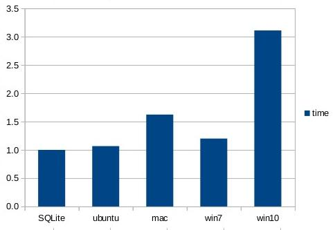
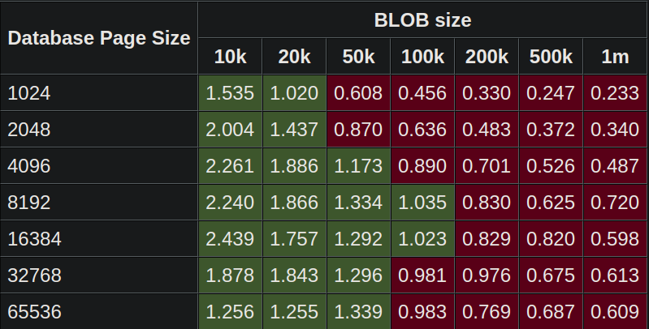
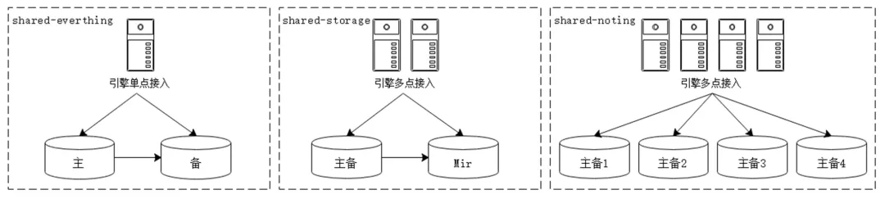
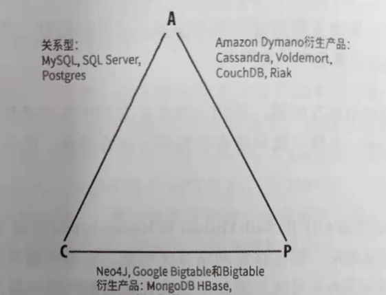
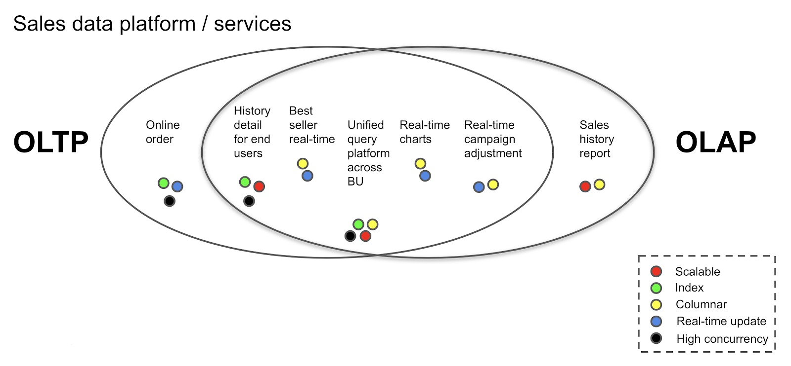

# database management systems (DBMS): 数据库管理系统

## RDBMS (关系性数据库)

### 基本理论

- 结构化存储(structured storage systems): 强调`Consistency`(一致性)

  - SQL语句并不区分大小写

  - 关系模型在逻辑层和视图层描述数据,不必关注数据存储的底层细节

    - 元组指 行

    - 属性指 列

    - 关系指 表

      - 关系是元组(行)的集合,但和元组的排列顺序没关

    - 关系模式:由属性(列)组成,数据库的逻辑设计

    - 关系实例:数据库的数据值

      - 关系模式不会发生变化,而关系实例会随时间变化
- 查询

  - 过程化语言

    - 以计算为操作的结果

    - 从单个关系中(id),选出满足一定条件的特殊元组(> 10)

      ```sql
      select * from cnarea_2019
      where id > 100
      ```

    - 从单个关系中,选出特定的属性(id)

      ```sql
      select id from cnarea_2019
      ```

    - 两种计算:id > 100,选出 id,name 属性

      ```sql
      select id,name from cnarea_2019
      where id > 100
      ```

    - 连接合并多个关系的元组

  - 非过程化语言

#### SQL索引

- B 树只适合随机检索,适合文件操作,B+树同时支持随机检索和顺序检索

- B+树的磁盘读写代价更低, B+树的内部结点并没有指向关键字具体信息的指针

- B+树的查询效率更加稳定.B 树搜索有可能会在非叶子结点结束

- 只要遍历叶子节点就可以实现整棵树的遍历,数据库中基于范围的查询是非常频繁,B 树这样的操作效率非常低

### MySQL

Port:3306

- Mysql 是一个单进程多线程架构的关系性数据库

- `client/server` 架构

    - 即使用TCP/IP进行通信

**特点：**

- 免费开源

- 因为开源提供高度多样性支持 C+,Perl,Java,PHP,以及 Python,以及各种客户端

- MySQL 区别于其他数据库的一个最重要的特点是插件式存储引擎.它是基于表的,而不是数据库

- MySQL 数据库实例由后台线程以及一个共享内存区组成,负责操作数据库文件

---

**缺点:**
?? N + 1查询: 数据库的频繁访问,导致性能降低
- 没有一种存储过程(Stored Procedure)语言
- 其安全系统,主要是复杂而非标准,另外只有到调用 mysqladmin 来重读用户权限时才发生改变
- [十款常见的开源数据库学习资料大汇总](https://linux.cn/article-3758-1.html)
- [深入理解 InnoDB -- 架构篇](https://mp.weixin.qq.com/s?__biz=MzI2MDQzMTU2MA==&mid=2247483850&idx=1&sn=4611d9744b70a00d411eb4c91246eb7d&chksm=ea688a6ddd1f037bd6bc592bd13feb76abb36c3ea0aeb13e3fb355753d1a64f20f1521f2e1df&token=1896344902&lang=zh_CN#rd)

### [MariaDB](https://mariadb.org/documentation/)

> Oracle收购mysql后, 独立出来. 使用GPLv2许可证, 是自由软件

- Mariadb10 主要是基于 mysql5.6 的原型

- 很多linux发行版, 默认的mysql安装命令, 实际上是安装Mariadb

### [PostgreSQL](https://www.postgresql.org/about/)

数据类型丰富,可以自定义类型的关系型数据库:

- 提供外围数据库的接口连接

- [PostgreSQL 详细配置参数](https://postgresqlco.nf/en/doc/param/)

### sqlite

- 关系性数据库

- 使用`serverless`, 也就是不采用 `client/server` 架构

- 没有任何配置

- self-contained(少量的外部库)

- 支持Transactional(事务),符合ACID:

    - Atomic(原子性): 事务是不可分割的最小单位. 要么成功, 要么失败

    - Consistent(一致性): 事务必须确保将数据库从一个有效状态更改为另一个有效状态

        - 同一个数据不能有不同的值

        - 当事物开启后每一条修改数据库的语句, 会使数据库不一致, 因此事务提交或回滚时, 必须保持数据库一致性

    - Isolation(隔离性): 多个事务会话相互隔离

        - 使用 `INSERT`  `UPDATE` 等语句修改同一数据时, 其中一个事务必须等待另一个事务执行完成后执行

    - Durable(持久性): 事务一旦提交, 对数据修改不会丢失

- 数据类型:

    - 动态类型

    - 列的字段即使声明了数据类型, 也可以存储其它类型

    - 创建数据库时, 列字段可以选择不声明数据类型

    - 没有`BOOLEAN`(布尔), `DATETIME` 类型

    - 默认关闭 `Foreign Key`(外键)

    - `PRIMARY KEY` 支持 `NULL`, `INTEGER PRIMARY KEY`(是`ROWID`列的别名)和`WITHOUT ROWID`的表除外.

- 文件保存格式像版本控制系统:

    - 性能:比文件系统的fread(), fwrite()快35%

        - 给sqlite的内存分配越大, 速度越快

    - sqlite打包所有blob,而open(),close()对单个文件的每个blob,都要调用一次

    - 只需覆盖文件修改的部分,减少ssd的损耗

    - 只需读取文件所需的数据进内存,而不是读取整个文件

    - 不需要自己写文件I/O

    - 读取性能对比

        

    - 写入性能对比

        

    - 对100M大小的文件, 分割成不同大小的块, 进行性能对比

        - 大于1的: 文件系统更快, 小于1: 数据库更快

        

- 使用N + 1, 但没有传统N + 1的问题(因此可以使用大量查询):

    - 第一组查询是从`Fossil数据库` 的`config`, `global_config`中提取

    - timeline的代码可以对不同部分进行分离

    - sqlite与应用程序共同使用进程空间

    - 查询只是函数调用,而不是消息往返

        - `client/server` 架构的数据库,每条sql语句都需要应用程序与数据库之间来回往返

#### [sqlite个人笔记](./sqlite.md)

### [dolt: git 命令的数据库](https://github.com/dolthub/dolt)

## NOSQL(非关系数据库)

### 基本理论

- 非结构化存储(no-structed storage systems): 强调`Availability`(可用性)

  - 不存在行字段的数据结构

  - 优点

    - 可扩展性

    - kv (key/value),分布式等结构

  - 缺点:

    - 缺乏事务支持,因此也没有 ACID

### key-value

#### [Redis](https://github.com/redis/redis)

- Port:6379

- In-memory 存储

#### [Kvrocks: 基于rosedb, 并兼容redis协议. 存储成本小于redis](https://github.com/bitleak/kvrocks)

- [rosedb](https://github.com/roseduan/rosedb)

- docker安装
```sh
docker run -it -p 6666:6666 bitleak/kvrocks
redis-cli -p 6666
```

#### [leveldb](https://github.com/google/leveldb)

- LevelDB 只是一个 C/C++ 编程语言的库, 不包含网络服务封装, 所以无法像一般意义的存储服务器(如 MySQL)那样, 用客户端来连接它. LevelDB 自己也声明, 使用者应该封装自己的网络服务器.

- 存储基于内存 + SSD

- 底层数据结构为 `LSM-tree`

- 单进程

#### [rocksdb: 基于leveldb, 由facebook维护](https://github.com/facebook/rocksdb)

#### [Amazon Dynamo在线论文](https://www.allthingsdistributed.com/2007/10/amazons_dynamo.html)

### 文档

#### MonogoDB

- Port:27017

#### [exist: XML](https://github.com/eXist-db/exist)

### Wide-column (列存储)

#### [BigTable论文pdf](https://static.googleusercontent.com/media/research.google.com/en//archive/bigtable-osdi06.pdf)

#### HBase

- Hadoop的组件之一: Google BigTable 的衍生开源版本

#### Cassandra

> 最早由facebook开发, 后交由apache的Google BigTable 的衍生数据库

### 图

#### [neo4j](https://github.com/neo4j/neo4j)

### 对象

## DDBS(分布式数据库)

### 基本理论

- 半结构化存储(semi-structure storage systems): 兼顾`Consistency`(一致性)和`Availability`(可用性)

#### shared-nothing 不共享架构

> sharding(网络分片): 将数据划分到多个节点



- Shard-everting：共享数据库引擎和数据库存储，无数据存储问题

    - 并行处理能力是最差的

- Shared-storage：引擎集群部署，分摊接入压力，无数据存储问题

- Shard-noting：引擎集群部署，分摊接入压力，存储分布式部署，存在数据存储问题

    - 各个处理单元都有自己私有的 CPU/内存/硬盘等，不存在共享资源，类似于 MPP（大规模并行处理）模式，各处理单元之间通过协议通信

    - 并行处理和扩展能力更好

    - 避免单点故障, 导致系统不能运行

    - 分片机制:

        - 按功能分片: 评论, 用户数据, 商品各为独立节点

        - 按键分片: 26个英文字母, 每个字母为独立节点

#### [CAP理论](https://en.wikipedia.org/wiki/CAP_theorem)

- CAP

    - Consistency(一致性)：每次读取都会收到最新写入

    - Availability(可用性)：每个请求都会收到一个(非错误)响应,但不保证它包含最新的写入

    - Partition tolerance(分区容错)：节点之间的网络丢包或延迟, 不影响系统运行

- 在网络分区存在的情况下, 没有一个分布式系统, 能确保没有网络故障

    - 在网络没有故障的情况下, 能同时满足`Consistency`和`Availability`

    - 在网络存在故障的情况下, 必须在`Consistency`和`Availability`之间做出选择(PC|PA)

        - AP: 则不能保证message是最新, 系统返回错误或超时(DNS)

        - CP: 节点如有错误, 部分数据可能会丢失

        - CA: 分布式事务使用**两阶段**提交, 如出现网络分区会阻塞

- 随着分区恢复技术(P)的发展, 完全有可能同时获得CAP

- 数据库对`CAP`选择

    | 数据库                                                                                     | CAP选择 |
    |--------------------------------------------------------------------------------------------|---------|
    | `Amazon Dynamo`以及它衍生出来的数据库: `Cassandra`, `Project Voldemort`, `CouchDB`, `Riak` | CP      |
    | 图数据库几乎都是                                                                           | AP      |
    | `Google Bigtable`衍生出来的数据库:  `MongoDB`, `HBase`, `Hypertable`, `Redis`              | AP      |
    | 传统RDBMS                                                                                  | CA      |


    

##### [PACELC理论](https://en.wikipedia.org/wiki/PACELC_theorem)

> PACELC是CAP的拓展

- CAP: 有网络分区存在, 必然有网络故障: 因此必须在`Consistency`(一致性)和`Availability`(可用性)之间选择

- 在没有有网络分区存在: 必须在`Consistency`(一致性)和`Latency`(延迟)之间选择

    - high Availability(高可用性)意味着系统必须复制数据. 一旦复制了数据, 就会在`Consistency`和`Latency`之间进行权衡

- AP/EL: 为了较低`Latency`, 放弃`Consistency`

    -  `DynamoDB`, `Cassandra`, `Riak`, `Cosmos DB`

- CP/EC：为了`Consistency`, 放弃 `Availability` 和 `Latency`

    - `VoltDB/H-Store`, `Megastore`, `MySQL Cluster`等ACID系统几乎都是PC/EC

    - BigTable和相关系统(HBase)

    - 为了保证PC的一致性算法

        - Paxos

        - [Raft](https://raft.github.io/raftscope/index.html)

            - , 每个节点从log获取命令, 到达相同的状态和结果

#### HTAP(Hybrid transaction/analytical processing) 混合事务 / 分析处理

- [What is HTAP?](https://en.pingcap.com/blog/how-we-build-an-htap-database-that-simplifies-your-data-platform)

-  OLTP(Online Transactional Processing) 在线事务处理

    - 强调快速查询,更可能是行数据库, 每次修改不超过几行, 以事务/s衡量效率
    - 一般用于交易服务, 如mysql

-  OLAP(Online Analytical Processing) 在线分析处理

    - 强调响应时间, 更可能是列数据库, 事务较少, 查询复杂通常涉及aggregating(聚合)历史数据

    - 一般用于数据挖掘, 如hadoop

- OLTP数据库保存数据, 并定期提取数据; 再使用OLAP数据库进行分析, 导出报告或者写回OLTP数据库
    - 这一过程复杂漫长, 延迟高

- 而HTAP数据库便是兼容两者, 不需要在一个数据库里执行事务, 另一个数据库里分析
    

#### [GFS论文pdf](https://research.google.com/archive/gfs-sosp2003.pdf)

#### [Spanner论文pdf](http://research.google.com/archive/spanner-osdi2012.pdf)

#### [MapReduce论文pdf](https://research.google.com/archive/mapreduce-osdi04.pdf)

### [rqlite: 分布式sqlite](https://github.com/rqlite/rqlite)

- 基本使用

```sh
# 创建三个节点. rqlite需要两个端口, 一个是http api, 另一个是节点之间的通信
rqlited -node-id 1 ~/node.1

rqlited -node-id 2 -http-addr localhost:4003 -raft-addr localhost:4004 -join http://localhost:4001 ~/node.2

rqlited -node-id 3 -http-addr localhost:4005 -raft-addr localhost:4006 -join http://localhost:4001 ~/node.3

# 通过http查看状态
curl 'localhost:4001/status?pretty'

# 进入数据库查看状态
rqlite
.status
```

- 使用Raft实现所有sqlite实例的一致性

    - 所有对数据库的修改都需要log, 必须经过quorum节点的提交才能生效

    - 查询不不一定经过log

    ```sh
    # 创建数据库
    curl -XPOST 'localhost:4001/db/execute?pretty&timings' -H "Content-Type: application/json" -d '[
        "CREATE TABLE foo (id INTEGER NOT NULL PRIMARY KEY, name TEXT, age INTEGER)"
    ]'

    # 插入数据
    curl -XPOST 'localhost:4001/db/execute?pretty&timings' -H "Content-Type: application/json" -d '[
        "INSERT INTO foo(name, age) VALUES(\"fiona\", 20)"
    ]'

    # 查询
    curl -G 'localhost:4001/db/query?pretty&timings' --data-urlencode 'q=SELECT * FROM foo'
    ```

- 默认情况下sqlite layer 是在内存创建数据库

- 默认开启log压缩

- 使用https api

    - 写入会发送给leader node

    - 查询默认会发送给leader node(防止其他节点的更新落后于leader)

        - 也可以发送给其他node, 取决于read consistency(读一致性设置): `none`, `weak`, `strong`

        ```sh
        # none 不检查是否为leader, 速度最快
        curl -G 'localhost:4001/db/query?level=none' --data-urlencode 'q=SELECT * FROM foo'
        # weak 只检查本地是否为leader, 再查询
        curl -G 'localhost:4001/db/query?level=weak' --data-urlencode 'q=SELECT * FROM foo'
        # strong 必须确保节点在整个查询过程为leader
        curl -G 'localhost:4001/db/query?level=strong' --data-urlencode 'q=SELECT * FROM foo'
        ```


### PGXC

#### [TDSQL: 腾讯开发的HTAP数据库](https://github.com/Tencent/TBase)

- 兼容MYSQL, PostgreSQL

- TDSQL-A: 分析数据库

- TDSQL-C: 云原生数据库

#### [openGauss: 华为基于PostgreSQL开发的分布式HTAP数据库](https://gitee.com/opengauss/openGauss-server)

### NewSQL

> 支持NoSQL的OLTP和使用SQL作为主要接口并兼容ACID的关系性数据库

#### [H-Store](https://github.com/apavlo/h-store)

> 最早的NewSQL数据库

- SN(不共享架构)

- 数据库被划分为不同的分区,每个分区分配一个线程

    - 因为它是单线程的,系统中不包括锁, 一次只能有一个事务访问

    - 增加吞吐量方法

        - 增加节点数

        - 减少分区大小

#### [VoltDB](https://github.com/VoltDB/voltdb)

> 兼容ACID的内存RDBMS

- 基于H-Store

- SN(不共享架构)

#### [TiDB](https://github.com/pingcap/tidb)

> 参考 Google Spanner 和 Goolge F1 实现的NEWSQL

- [TiDB介绍](https://en.pingcap.com/blog/how-we-build-an-htap-database-that-simplifies-your-data-platform)

- 使用HTAP

- `TiDB` 兼容 MySQL 5.7 协议和 MySQL 生态的层

- `Tiky` 行存储引擎

- `Tiflash` 是4.0版本新增支持kv, 事务的列存储引擎


    - `Tiky`->`Tiflash`: 行存储 -> 列存储

        - 使用Raft一致性算法, 从TiKV异步复制数据

        - TiKV和TiFlash之间没有中间层,数据复制快速简单, 因此行列是实时更新的

    - 并通过验证Raft索引和多版本并发控制(MVCC)来保证快照隔离级别的一致性
    - 优化器会根据成本模型选择列工作, 还是行工作

- `TiSpark`是用于在TiKV或TiFlash之上的可以运行Spark的中间层,以响应复杂的OLAP查询

- 安装

```sh
# 下载tiup
curl --proto '=https' --tlsv1.2 -sSf https://tiup-mirrors.pingcap.com/install.sh | sh

# 下载安装tidb, 默认开启是一个db, pd, kv
cd tiup/bin
 ./tiup playground

# 也可以指定db, pd, kv的数量
tiup playground v5.0.0 --db 2 --pd 3 --kv 3 --monitor

# Grafana: 用户密码为为admin
http://127.0.0.1:3000
```

# reference

- [db-engines](https://db-engines.com/en/)

- [nosql-database](https://hostingdata.co.uk/nosql-database/)

- [awesome-db](https://github.com/numetriclabz/awesome-db#readme)

- [sqlfluff: sql语句语法检查](https://github.com/sqlfluff/sqlfluff)

# 新闻

- [数据库内核月报](http://mysql.taobao.org/monthly/)
  通过搜索引擎输入以下格式进行搜索(我这里搜索的是 binlog)

  > site:mysql.taobao.org binlog

