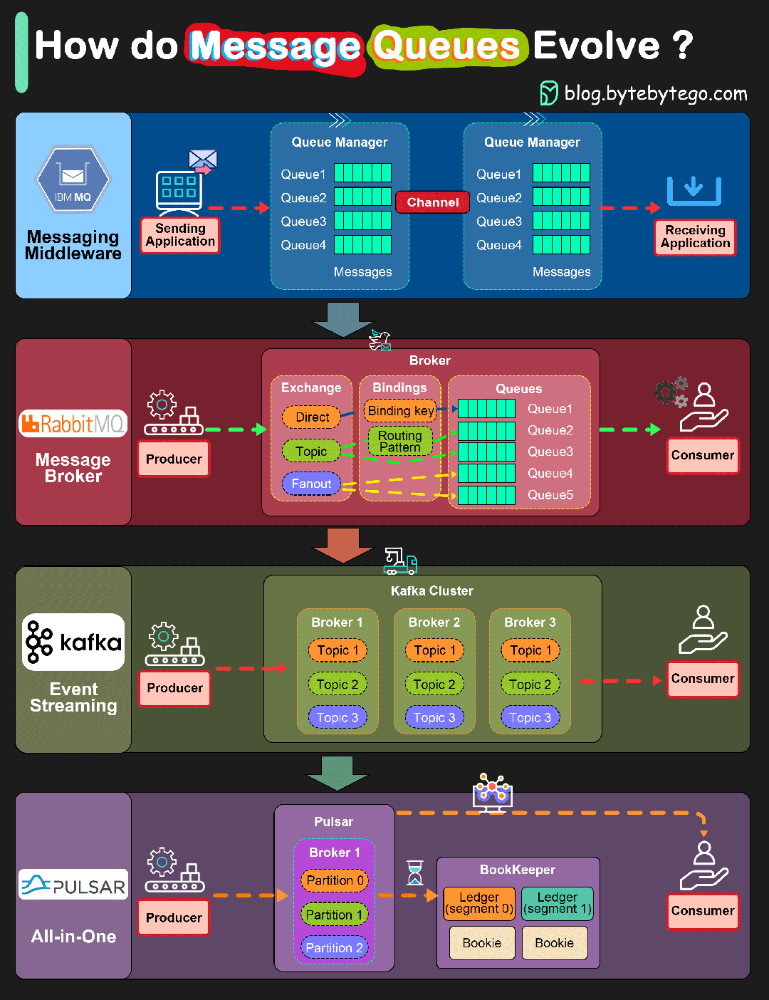

<!-- mtoc-start -->

* [消息队列](#消息队列)
  * [什么是消息队列](#什么是消息队列)
    * [小白debug：Kafka 是什么？](#小白debugkafka-是什么)
    * [小白debug：RocketMQ 是什么？它的架构是怎么样的？和 Kafka 又有什么区别？](#小白debugrocketmq-是什么它的架构是怎么样的和-kafka-又有什么区别)
      * [在架构上做减法](#在架构上做减法)
      * [在功能上做加法](#在功能上做加法)
  * [3大应用场景](#3大应用场景)
  * [2种模型](#2种模型)
  * [基本原理](#基本原理)
  * [常见问题](#常见问题)
  * [市面上消息队列对比](#市面上消息队列对比)
* [RabbitMQ](#rabbitmq)
* [RocketMQ](#rocketmq)
* [kafka](#kafka)
  * [常见疑问和面试题](#常见疑问和面试题)
    * [ByteByteGo：面试官：Kafka 会丢消息吗？](#bytebytego面试官kafka-会丢消息吗)
  * [分区（partition）](#分区partition)
  * [持久化](#持久化)
  * [集群（cluster）](#集群cluster)
    * [副本](#副本)
  * [主从模式](#主从模式)
  * [如何保证消息消费的全局顺序性](#如何保证消息消费的全局顺序性)
  * [安装集群](#安装集群)
  * [server.properties配置文件](#serverproperties配置文件)
  * [日志](#日志)
  * [监控](#监控)
  * [第三方软件](#第三方软件)
  * [未读](#未读)

<!-- mtoc-end -->

# 消息队列

## 什么是消息队列

- [咸鱼运维杂谈：关于消息队列的那些事](https://mp.weixin.qq.com/s?__biz=MzkzNzI1MzE2Mw==&mid=2247484660&idx=1&sn=8be392c3a1b67bec66f690645b734717&chksm=c29304b0f5e48da614c2bc81b4f920fe74b9522a3354b3d84cab98c48bbcd7c6247226f7fcb5&scene=21#wechat_redirect)

- 在日常当中，消息队列往往指的是消息中间件，它主要的功能就是用来存放消息，便于应用之间的消息通信

- ”对象之间的关系远比对象本身要重要“

- 为什么需要消息队列？

    - 在过去业务量小的时候，企业用的都是单机架构，直接一台单机就能满足日常业务的需求了

    - 随着互联网的不断发展，公司的业务体量不断扩大，老旧的单机架构已经不能满足日常需求了，于是分布式、微服务这些新架构新方法不断涌现出来

    - 这也意味着成千上百服务之间的依赖、调用关系越来越复杂，这时候我们迫切的需要一个【中间件】来解耦服务之间的关系，控制资源的合理合时分配以及缓冲流量高峰等等

- 消息队列应运而生，消息队列的三大经典场景——异步处理、服务解耦、流量控制

### [小白debug：Kafka 是什么？](https://mp.weixin.qq.com/s/SNMmCMV-gqkHtWS0Ca3j4g)

- 问题：两个服务 A 和 B。B 服务每秒只能处理 100 个消息，但 A 服务却每秒发出 200 个消息，B 服务哪里顶得住，分分钟被压垮。

- 解决方法：没有什么是加一层中间层不能解决的，如果有，那就再加一层。这次我们要加的中间层是 消息队列 Kafka。让 B 在不被压垮的同时，还能处理掉 A 的消息

- 消息队列的概念和演变过程：

- 1.offset：为了保护 B 服务，我们很容易想到可以在 B 服务的内存中加入一个队列。
    - 其实是个链表，链表的每个节点就是一个消息。
    - 每个节点有一个序号，我们叫它 Offset，记录消息的位置。
    
    

- 2.独立进程：
    - 问题：来不及处理的消息会堆积在内存里，如果 B 服务更新重启，这些消息就都丢了。
    - 解决方法：将队列挪出来，变成一个单独的进程。
        - 就算 B 服务重启，也不会影响到了队列里的消息。
        

    - 这样一个简陋的队列进程，其实就是所谓的消息队列。
        - 而像 A 服务这样负责发数据到消息队列的角色，就是生产者，像 B 服务这样处理消息的角色，就是消费者。
        

- 高性能：

    - 3.topic：
        - 问题：随着生产者和消费者都变多，我们会发现它们会同时争抢同一个消息队列，抢不到的一方就得等待，这不纯纯浪费时间吗！
        - 解决方法：对消息进行分类，每一类是一个 *topic*，然后根据 topic 新增队列的数量，生产者将数据按 topic 投递到不同的队列中，消费者则根据需要订阅不同的 topic。这就大大降低了 topic 队列的压力。
            

    - 4.partition分区：
        - 单个 topic 的消息还是可能过多，我们可以将单个队列，拆成好几段，每段就是一个 partition分区，每个消费者负责一个 partition。这就大大降低了争抢，提升了消息队列的性能。
            

- 高可用：

    - 5.broker：
        - 问题：随着 partition 变多，如果 partition 都在同一台机器上的话，就会导致单机 cpu 和内存过高，影响整体系统性能。
            
        - 解决方法：将 partition 分散部署在多台机器上，这每一台机器，就代表一个 broker。
            - 我们可以通过增加 broker 缓解机器 cpu 过高带来的性能问题。
            

    - 6.Leader和Follower：
        - 问题：如果其中一个 partition 所在的 broker 挂了，那 broker 里所有 partition 的消息就都没了。
        - 解决方法：给 partition 多加几个副本，也就是 replicas。Leader 负责应付生产者和消费者的读写请求，而 Follower 只管同步 Leader 的消息。
            - 这样 Leader 所在的 broker 挂了，也不会影响到 Follower 所在的 broker, 并且还能从 Follower 中选举出一个新的 Leader partition 顶上。
            
            

- 7.持久化和过期策略
    - 问题：假设所有 broker 都挂了，那岂不是数据全丢了？
    - 解决方法：
        - 持久化：不能光把数据放内存里，还要持久化到磁盘中，这样哪怕全部 broker 都挂了，数据也不会全丢，重启服务后，也能从磁盘里读出数据，继续工作。
            
        - 过期策略：磁盘总是有限的，这一直往里写数据迟早有一天得炸。所以我们还可以给数据加上保留策略，也就是所谓的 retention policy，比如磁盘数据超过一定大小或消息放置超过一定时间就会被清理掉。

- 8.consumer group（消费者组）
    - 问题：按现在的消费方式，每次新增的消费者只能跟着最新的消费 Offset 接着消费。如果我想让新增的消费者从某个 Offset 开始消费呢？
        - 例子：哪怕 B 服务有多个实例，但本质上，它只有一个消费业务方，新增实例一般也是接着之前的 offset 继续消费。假设现在来了个新的业务方，C 服务，它想从头开始消费消息队列里的数据，这时候就不能跟在 B 服务的 offset 后边继续消费了。

    - 解决方法：加入consumer group（消费者组）的概念，B 和 C 服务各自是一个独立的消费者组，不同消费者组维护自己的消费进度，互不打搅。
        - 消费者组互相独立
        

- ZooKeeper：组件太多了，而且每个组件都有自己的数据和状态，所以还需要有个组件去统一维护这些组件的状态信息，于是我们引入 ZooKeeper 组件。它会定期和 broker 通信，获取 整个 kafka 集群的状态，以此判断 某些 broker 是不是跪了，某些消费组消费到哪了。
    

### [小白debug：RocketMQ 是什么？它的架构是怎么样的？和 Kafka 又有什么区别？](https://mp.weixin.qq.com/s/oje7PLWHz_7bKWn8M72LUw)

- 作为一个程序员，假设你有 A、B 两个服务，A 服务发出消息后，不想让 B 服务立马处理到。而是要过半小时才让 B 服务处理到，该怎么实现？

    - 这类延迟处理消息的场景非常常见，举个例子，比如我每天早上到公司后都会点个外卖，我希望外卖能在中午送过来，而不是立马送过来，这就需要将外卖消息经过延时后，再投递到商家侧。

    - 当然有，没有什么是加一层中间层不能解决的，如果有，那就再加一层。这次我们要加的中间层是消息队列 RocketMQ。

- RocketMQ 是阿里自研的国产消息队列，目前已经是 Apache 的顶级项目。和其他消息队列一样，它接受来自生产者的消息，将消息分类，每一类是一个 topic，消费者根据需要订阅 topic，获取里面的消息。

- RocketMQ 和 Kafka 的区别

    - RocketMQ 的架构其实参考了 Kafka 的设计思想，同时又在 Kafka 的基础上做了一些调整。

    - 这些调整，用一句话总结就是，"和 Kafka 相比，RocketMQ 在架构上做了减法，在功能上做了加法"。

#### 在架构上做减法

- 简单回顾下消息队列 Kafka 的架构。
    - kakfa 也是通过多个 topic 对消息进行分类。
    - 为了提升单个 topic 的并发性能，将单个 topic 拆为多个 partition。
    - 为了提升系统扩展性，将多个 partition 分别部署在不同 broker 上。
    - 为了提升系统的可用性，为 partition 加了多个副本。
    - 为了协调和管理 Kafka 集群的数据信息，引入Zookeeper作为协调节点。
    

- 简化协调节点

    - Zookeeper 在 Kafka 架构中会和 broker 通信，维护 Kafka 集群信息。一个新的 broker 连上 Zookeeper 后，其他 broker 就能立马感知到它的加入，像这种能在分布式环境下，让多个实例同时获取到同一份信息的服务，就是所谓的分布式协调服务。

        

    - 问题：但 Zookeeper 作为一个通用的分布式协调服务，它不仅可以用于服务注册与发现，还可以用于分布式锁、配置管理等场景。Kafka 其实只用到了它的部分功能，多少有点杀鸡用牛刀的味道。太重了。

        - 解决方法：RocketMQ 直接将 Zookeeper 去掉，换成了 nameserver，用一种更轻量的方式，管理消息队列的集群信息。生产者通过 nameserver 获取到 topic 和 broker 的路由信息，然后再与 broker 通信，实现服务发现和负载均衡的效果。

            

        - 当然，开发 Kafka 的大佬们后来也意识到了 Zookeeper 过重的问题，所以从 2.8.0 版本就支持将 Zookeeper 移除，通过 在 broker 之间加入一致性算法 raft 实现同样的效果，这就是所谓的 KRaft 或 Quorum 模式。
            

- 简化分区

    - Kafka 会将 topic 拆分为多个 partition，用来提升并发性能。
        
    - RocketMQ 里也一样，将 topic 拆分成了多个分区，但换了个名字，叫 Queue,也就是"队列"。
        

    - Kafka 中的 partition 会存储完整的消息体，而 RocketMQ 的 Queue 上却只存一些简要信息，比如消息偏移 offset，而消息的完整数据则放到"一个"叫 commitlog 的文件上，通过 offset 我们可以定位到 commitlog 上的某条消息。

    - Kafka 消费消息，broker 只需要直接从 partition 读取消息返回就好，也就是读第一次就够了。
        

    - 而在 RocketMQ 中，broker 则需要先从 Queue 上读取到 offset 的值，再跑到 commitlog 上将完整数据读出来，也就是需要读两次。
        

    - 那么问题就来了，看起来 Kafka 的设计更高效？为什么 RocketMQ 不采用 Kafka 的设计？这就不得说一下 Kafka 的底层存储了。

- Kafka 的底层存储
    - Kafka 的 partition 分区，其实在底层由很多段（segment）组成，每个 segment 可以认为就是个小文件。将消息数据写入到 partition 分区，本质上就是将数据写入到某个 segment 文件下。
        

    - 问题：
        - 我们知道，操作系统的机械磁盘，顺序写的性能会比随机写快很多，差距高达几十倍。为了提升性能，Kafka 对每个小文件都是顺序写。
        - 如果只有一个 segment 文件，那写文件的性能会很好。
        - 但当 topic 变多之后，topic 底下的 partition 分区也会变多，对应的 partition 底下的 segment 文件也会变多。同时写多个 topic 底下的 partition，就是同时写多个文件，虽然每个文件内部都是顺序写，但多个文件存放在磁盘的不同地方，原本顺序写磁盘就可能劣化变成了随机写。于是写性能就降低了。
        

        - 究竟多少 topic 才算多？这个看实际情况，我给一个经验值仅供参考，8 个分区的情况下，超过 64 topic, Kafka 性能就会开始下降。

- RocketMQ 的底层存储

    - 为了缓解同时写多个文件带来的随机写问题，RocketMQ 索性将单个 broker 底下的多个 topic 数据，全都写到"一个"逻辑文件 CommitLog 上，这就消除了随机写多文件的问题，将所有写操作都变成了顺序写。大大提升了 RocketMQ 在多 topic 场景下的写性能。

        > 注意上面提到的"一个"是带引号的，虽然逻辑上它是一个大文件，但实际上这个 CommitLog 由多个小文件组成。每个文件的大小是固定的，当一个文件被写满后，会创建一个新的文件来继续存储新的消息。这种方式可以方便地管理和清理旧的消息。

        

- 简化备份模型

    - Kafka 会将 partiton 分散到多个 broker 中，并为 partiton 配置副本，将 partiton 分为 leader和 follower，也就是主和从。broker 中既可能有 A topic 的主 partiton，也可能有 B topic 的从 partiton。
        - 主从 partiton 之间会建立数据同步，本质上就是同步 partiton 底下的 segment 文件数据

        

    - RocketMQ 将 broker 上的所有 topic 数据到写到 CommitLog 上。如果还像 Kafka 那样给每个分区单独建立同步通信，就还得将 CommitLog 里的内容拆开，这就还是退化为随机读了。
        - 于是 RocketMQ 索性以 broker 为单位区分主从，主从之间同步 CommitLog 文件，保持高可用的同时，也大大简化了备份模型。

        

- Kafka架构
    
- RocketMQ架构
    

#### 在功能上做加法

- 虽然 RocketMQ 的架构比 Kafka 的简单，但功能却比 Kafka 要更丰富，我们来看下。

- 消息过滤

    - 问题：Kafka 支持通过 topic 将数据进行分类，比如订单数据和用户数据是两个不同的 topic
        - 但如果我还想再进一步分类呢？比如同样是用户数据，还能根据 vip 等级进一步分类。假设我们只需要获取 vip6 的用户数据，在 Kafka 里，消费者需要消费 topic 为用户数据的所有消息，再将 vip6 的用户过滤出来。

    - 解决方法：RocketMQ 支持对消息打上标记，也就是打 tag，消费者能根据 tag 过滤所需要的数据。比如我们可以在部分消息上标记 tag=vip6，这样消费者就能只获取这部分数据，省下了消费者过滤数据时的资源消耗。
        

- 支持事务

    - Kafka 支持事务，比如生产者发三条消息 ABC，这三条消息要么同时发送成功，要么同时发送失败。
        

    - RocketMQ 支持的事务能力："执行一些自定义逻辑"和"生产者发消息"这两件事，要么同时成功，要么同时失败。
        

- 加入延时队列
    - 如果我们希望消息投递出去之后，消费者不能立马消费到，而是过个一定时间后才消费，也就是所谓的延时消息，就像文章开头的定时外卖那样。如果我们使用 Kafka， 要实现类似的功能的话，就会很费劲。
    - 但 RocketMQ 天然支持延时队列，我们可以很方便实现这一功

- 加入死信队列
    - 消费消息是有可能失败的，失败后一般可以设置重试。如果多次重试失败，RocketMQ 会将消息放到一个专门的队列，方便我们后面单独处理。这种专门存放失败消息的队列，就是死信队列。
    - Kafka 原生不支持这个功能，需要我们自己实现。

- 消息回溯
    - Kafka 支持通过调整 offset 来让消费者从某个地方开始消费
        - kafka在0.10.1后支持调时间
    - RocketMQ，除了可以调整 offset, 还支持调整时间

## 3大应用场景

- 1.异步处理

    - 你负责公司的一个电商项目，业务初期只是一个很简单的流程：用户下单支付—>扣库存—>下单成功

    - 后面来了个产品经理跟你说要搞个积分系统，问题不大，流程里多加一步就行了
    - 结果你发现产品经理并不满足于此，又来找你说要搞个优惠券系统，你咬咬牙说：行！整就完事了
    - 再后来产品经理一脸邪笑的找到你，下单成功之后我们需要给用户发送短信，再搞个短信服务吧嘿嘿嘿
    - 到后面你的项目流程就如下图右边所示（在现实的电商项目中，涉及到的流程可比这个复杂多了）
        

    - 既然流程长了会导致时间变长，但我们可以将其中一些流程同时做呀——用户下单成功之后，我去检验优惠券的同时还能去增减积分，还能发个短信

        - 怎么实现异步呢？消息队列！
        

        - 相对于扣库存和下单，积分和短信是没有必要这么的“及时”，因此你只需要在支付后的那个流程，扔个消息到消息队列当中就可以直接返回响应给客户端了，不需要再等待积分、优惠券、短信服务
        - 有了消息队列，用户只需要很短时间内就知道自己支付成功了，至于短信和积分这些非必要服务，迟几秒并不会特别影响用户的使用体验

- 2.服务解耦

    - 上面的电商场景中已经有了——积分服务、优惠券服务、短信服务

    - 万一后面可能又来个营销服务、活动期间再弄个促销服务等等等等....

    - 问题：随着服务越来越多，就需要经常的修改支付服务的下游接口，任何一个下游服务接口的变更都可能会影响到订单服务的代码

    - 解决方法：为了解决服务之间的依赖关系，降低服务间的耦合度，我们可以在支付服务和下游的服务中间加一个消息队列

    - 支付服务只需要把订单、支付相关消息塞到消息队列当中，下游的服务谁需要这个消息自己去获取就行了

    - 这样无论下游添加了什么服务，都不会影响上游的订单服务

    

- 3.流量控制

    - 在平常的业务场景中，你的流量很低，但是一旦遇到秒杀活动、双十一活动这些大流量的场景

    - 尤其是在某一时刻（例如 00:00）流量如洪水猛兽一样疯狂怼进来，你的服务器、MySQL、Redis各自的性能都是不一样的

    - 你肯定不能将全部的流量请求照单全收，很容易会将性能低的服务器直接打挂

    - 所以需要引入一个中间件来做缓冲，消息队列是一个很好的选择

    - 先将请求放到消息队列当中，后端服务就尽自己最大的能力去消息队列中消费请求，对于超时的请求，可以直接返回错误。这样可以防止在高峰期大量的请求直接导致后端服务器崩溃

    

## 2种模型

- 消息队列中，有下面两个角色：

    - 生产者（producer）：负责生产数据并传输到消息队列，至于谁去取消息，生产者并不关心

    - 消费者（consumer）：负责从消息队列中取出数据，至于数据是谁生产的，消费者并不关心

    


- 1.队列模型

    - 生产者往某个队列里发送消息，一个队列可以存储多个生产者的消息，一个队列也可以有多个消费者

    - 但是消费者之间是竞争关系，即每条消息只能被一个消费者消费

    

- 2.发布/订阅模型

    - 让一条消息能被多个消费者消费

    - 在发布/订阅模型当中，会将消息发送到一个 topic（主题）中，所有订阅了这个 topic 的消费者都能消费到这条消息

    

- 队列模型就是你在微信上跟别人私聊，你发送的消息只能被你私聊的那个人收到
- 发布/订阅模型就相当于你创建了一个群聊，把大家都拉进群里，只要是在群里的（订阅了 topic）都能收到你发的消息

- 那有的人就会想，我对好多人私聊，并且发的都是相同的信息，不是也能够实现一条消息被多个消费者消费的功能吗

    - 很聪明！在队列模型里，可以使用多队列来全量存储相同的消息，然后不同的消费者去不同的队列里消费

    - 通过数据的冗余实现一条消息被多个消费者消费的功能

    - RabbitMQ 中通过 exchange 模块将消息发送到多个队列，解决一条消息能被多个消费者消费的问题

- RabbitMQ 采用队列模型、RocketMQ 和 Kafka 采用发布/订阅模型

## 基本原理

- 3个角色
    - 生产者：Producer
    - 消费者：Consumer
    - 消息队列服务端：Broker

- 消息由 Producer 发往 Broker，Broker 将消息存储至本地，然后 Consumer 从 Broker拉取消息，或者由 Broker 推送消息给 Consumer，最后实现消费

- 在发布/订阅模型中，为了提高并发，还会引入队列或者分区的概念——将消息发往一个 topic 中的某个队列或者某个分区（队列和分区本质一样，叫法不一样）
    - 例如某个 topic 下有 n 个队列，那么这个 topic 的并发度就提高 n，同时可以支持 n 个消费者并行消费该 topic 中的消息
    - 通常采用轮询 或者 key hash 取余等策略来将同一个 topic 的消息分配到不同的队列当中

- 既然是一对多的关系，那么消费者一般都有组的概念（Consumer group），即一条消息会发送到订阅了这个 topic 的消费者组

    - 本来是一个消费者消费三个分区的，现在我们有消费者组，就可以每个消费者去消费一个分区（也是为了提高吞吐量）

        
        

        - 如果消费者组中的某个消费者挂了，那么其中一个消费者可能就要消费两个partition了

        - 如果只有三个partition，而消费者组有4个消费者，那么一个消费者会空闲

        - 如果多加入一个消费者组，无论是新增的消费者组还是原本的消费者组，都能消费topic的全部数据。（消费者组之间从逻辑上它们是独立的）

    - 例如现在有 Group1 和 Group 2 两个消费组，都订阅了 topic1 ，如果有一条消息发送到 topic1，那么这两个消费组都能接收到这条消息；消息其实是存储到了 topic1 中的某个队列当中，消费组的某个消费者对应消费一个队列的消息

        - 实际上，一条消息在 Broker 中只会有一份，每个 Consumer group 会有自己的 offset （偏移量）来标识消费到的位置

        - 在 offset 前的消息表示已经消费过了，每个 Consumer group 都会维护订阅的 topic 下的每个队列的 offset

        


## 常见问题

- 如何保证消息不丢失？

    - 从生产者生产消息到消费者消费消息，会经历三个阶段——生产消息、存储消息、消费消息。为了让消息不丢失，我们需要从这三个阶段进行考虑

    - 1.生产消息

        - producer 发送消息到 broker ，需要处理 broker 的响应，无论是同步还是异步发送消息，都需要处理好 broker 的响应

        - 如果 broker 返回写入失败等错误消息，需要重新发送，当多次发送失败后需要进行故障处理
    - 2.存储消息

        - 在这个阶段，broker 需要在消息刷盘之后再给 producer 响应

        - 假设消息写到缓存中就给 producer 响应，这个时候 broker 突然断电或者故障，就会导致消息丢失，而 producer 接收到 broker 的响应就会认为该消息已经发送成功了

        - 如果 broker 是分布式架构的话，有副本机制（即消息不仅要写入当前 broker，还要写入副本机）那就应该设置成至少写入两台 broker 后再给 producer 响应

    - 3.消费消息

        - Consumer 应该在执行完过程之后再给 broker 返回响应，而不是在拿到消息并放到内存后就立马给 broker 返回响应，这才是真正的消费了

        - 万一这个时候 Consumer 出现故障或者断电，这条消息其实是没有走完整个业务流程的，而 broker 以为 Consumer 已经拿到数据并处理了

- 如何处理重复消息？

    - 为什么会有消息重复？

        - 假设 producer 发送消息不管 broker 的响应，只管生产，这样的情况下是不会出现消息重复的

            - 但这样会导致另一个问题——消息不可靠

        - 所以我们规定消息至少得发到 broker 上，并等待 broker 的响应，那么就有可能出现这个问题——消息已经发送到 broker 上并且 broker 返回响应给 producer ，但是由于网络问题这个响应并没有被 producer 收到，然后 producer 又重发了一次，这时候消息就会重复了

        - 又假设 consumer 已经拿到消息了，并且走完业务流程此时需要更新 offset ，好巧不巧的是这个 consumer 挂掉了，另一个 consumer 来顶上，但这个 consumer 是没有消费的，于是会拿到刚刚那条消息重新走一遍业务，于是消息又重复了

        - 由此可见——为了保证消息的可靠性，消息重复是无法避免的

    - 那么如何处理重复消息呢？
        - 幂等处理重复消息，幂等指的是任意多次执行所产生的影响均与一次执行的影响相同
        - 例子：
            - 通过数据库的约束（唯一键）
            - 记录关键的 key，对于一些关键的 key，给它一个唯一 ID

- 如何保证消息的有序性？

    - 全局有序

        - 如果要保证消息的全局有序，首先只能有 producer 往 topic 发送消息，并且一个 topic 内部只能有一个队列（分区）

        - consumer 也必须是单线程消费这个队列

        

    - 部分有序

        - 为了实现部分有序，我们将 topic 内部划分出多个队列，然后通过特定策略将消息发往固定队列当中

        - 每个队列对应一个单线程处理的 consumer ，这样既能够实现部分有序，又能够提高并

        

- 如何处理消息堆积？

    - 往往 consumer 的消费速度跟 producer 的生产速度不一致（consumer消费能力弱 or consumer 消费失败导致反复重试）就会导致消息堆积的问题

    - 一方面，对 consumer 进行优化。先定位消费慢的原因，是因为 consumer 的业务出现 bug 还是说本身消费能力就不太行，例如消费逻辑是一条一条处理或者说是单线程处理，那我们就可以在这方面进行优化

    - 或者增加 consumer 的数量，水平扩容来实现暴力解决问题

    - 另一方面，对 broker 进行优化。增加 topic 的队列（分区）数

        - PS：队列数增加后要相应地增加 consumer 的数量，不然生产的数据没人来消费

- 使用消息队列后会带来什么问题

    - 凡事都有两面性，虽然消息队列可以帮助我们很好地提高系统性能，降低耦合度，但是依旧会带来一些不可避免的问题

    - 1.可用性降低：在没有使用消息队列中间件之前，你不需要考虑消息丢失或者消息队列中间件出现故障宕机这些情况，使用了之后你就要去考虑如何保证消息队列中间件的高可用

    - 2.复杂性提高：使用了消息队列中间件之后，需要考虑消息有没有被重复消费、消息是不是有序传递，如何处理消息丢失的情况等等问题

## 市面上消息队列对比




# RabbitMQ

- [java技术爱好者：超详细的RabbitMQ入门，看这篇就够了！](https://developer.aliyun.com/article/769883)

# RocketMQ

- [小白debug：RocketMQ 为什么性能不如 Kafka？](https://mp.weixin.qq.com/s/4ZTqvsLzg6-kJFJez4Zkqw)

- RocketMQ 的架构其实参考了 kafka 的设计思想，同时又在 kafka 的基础上做了一些调整。看起来，RocketMQ 好像各方面都比 kafka 更能打。

    - 但 kafka 却一直没被淘汰，RocketMQ 必然是有着不如 kafka 的地方。是啥呢？ 性能，严格来说是吞吐量。

    - 阿里中间件团队对它们做过压测，同样条件下，kafka 比 RocketMQ 快 50%左右。但即使这样，RocketMQ 依然能每秒处理 10w 量级的数据，依旧非常能打。

        - 你不能说 RocketMQ 弱，只能说 Kafka 性能太强了。

- kafka 为什么性能比 RocketMQ 好？

    - 因为 RocketMQ 使用的是 `mmap` 零拷贝技术，而 kafka 使用的是 `sendfile`。

    - 为什么 RocketMQ 不使用 `sendfile`？参考 kafka 抄个作业也不难啊？

        - 我们来看下 `sendfile` 函数长啥样。

            ```c
            ssize_t sendfile(int out_fd, int in_fd, off_t* offset, size_t count);
            // num = sendfile(xxx);
            ```

        - 再来看下 mmap 函数长啥样。

            ```c
            void *mmap(void *addr, size_t length, int prot, int flags,
            int fd, off_t offset);
            // buf = mmap(xxx)
            ```

        - 注释里写的是两个函数的用法

            - `mmap` 返回的是数据的具体内容，应用层能获取到消息内容并进行一些逻辑处理。
            - `sendfile` 返回的则是发送成功了几个字节数，具体发了什么内容，应用层根本不知道。

        - RocketMQ 的一些功能，却需要了解具体这个消息内容，方便二次投递等
            - 比如将消费失败的消息重新投递到死信队列中，如果 RocketMQ 使用 `sendfile`，那根本没机会获取到消息内容长什么样子，也就没办法实现一些好用的功能了。

        - kafka 却没有这些功能特性，追求极致性能，正好可以使用 sendfile。

            - 除了零拷贝以外，kafka 高性能的原因还有很多，比如什么批处理，数据压缩啥的，但那些优化手段 rocketMQ 也都能借鉴一波，唯独这个零拷贝，那是毫无办法。

- kafka 和 RocketMQ 怎么选？

    - 我的标准只有一个，如果是大数据场景，比如你能频繁听到 spark，flink 这些关键词的时候，那就用 kafka。除此之外，如果公司组件支持，尽量用 RocketMQ。

# kafka


- kafka 是消息队列，像消息队列投递消息的是生产者，消费消息的是消费者。增加生产者和消费者的实例个数可以提升系统吞吐。多个消费者可以组成一个消费者组，不同消费者组维护自己的消费进度，互不打搅。

- kafka 将消息分为多个 topic
    - 每个 topic 内部拆分为多个 partition
    - 每个 partition 又有自己的副本
    - 不同的 partition 会分布在不同的 broker 上，提升性能的同时，还增加了系统可用性和可扩展性。

## 常见疑问和面试题

### [ByteByteGo：面试官：Kafka 会丢消息吗？](https://mp.weixin.qq.com/s/J6dfpnF7gKhAwa1r7Buigg)

- 许多开发人员普遍认为，Kafka 的设计本身就能保证不会丢失消息。然而，Kafka 架构和配置的细微差别会导致消息的丢失。

- 下图显示了消息在 Kafka 的生命周期中可能丢失的场景。

     发送消息时，消息不会直接发送到代理。

    - 消息发送过程涉及两个线程和一个队列：
        - 1.应用程序线程
        - 2.消息累加器
        - 3.发送线程（I/O 线程）
    - 我们需要为生产者配置适当的 "acks "和 "retries"，以确保消息被发送到代理。

- 消息代理（Broker）

    - 当代理集群正常运行时，它不应该丢失消息。但是，我们需要了解哪些极端情况可能会导致消息丢失：

        - 1.为了提高 I/O 吞吐量，消息通常会异步刷到磁盘上，因此如果实例在刷新之前宕机，消息就会丢失。
        - 2.Kafka 集群中的副本需要正确配置，以保持数据的有效副本。数据同步的确定性非常重要。

- 消费者（Consumer）

    - Kafka 提供了不同的提交消息的方式。自动提交可能会在实际处理记录之前确认对记录的处理。当消费者在处理过程中宕机时，有些记录可能永远不会被处理。

    - 一个好的做法是将同步提交和异步提交结合起来，在处理消息的循环中使用异步提交以提高吞吐量，在异常处理中使用同步提交以确保最后的偏移始终被提交。

    - 伪代码：
    ```
    try {
        while (true) {
        ConsumerRecords<String, String> records = consumer.poll(Duration.ofMillis(1000));

        for (ConsumerRecord<String, String> record : records) {
            // process records one by one
        }

        consumer.commitAsync();
        }
    } catch (Exception e){
        // exception handling
    } finally {
        try {
            consumer.commitSync();
        } finally {
            consumer.close();
        }
    }
    ```

## 分区（partition）

- Kafka 是发布/订阅模型，消息以 主题（topic） 来分类，每一个 topic 都对应一个消息队列，订阅这个 topic 的 consumer 都会能够消费到对应的消息

- 为了提高吞吐量，实现 topic 的负载均衡，Kafka 在 topic 下又引用了分区（partition）的概念，能够大大提高消费速率

    - 例如某个 topic 下有 n 个队列，那么这个 topic 的并发度就提高 n，同时可以支持 n 个 consumer 并行消费该 topic 中的消息

    

    - 每一个 patition 都是一个顺序的、不可变的消息队列，并且可以持续地添加。patition 中的消息都被分配了一个唯一的序列号，也叫做偏移量（offset）

        

    - 这就会导致 Kafka 是没有办法删除消息的，Kafka 会保持所有的消息，无论消息是否被消费，保持到它们过期

        - 实际上 consumer 只是拥有 offset，正常情况当 consumer 消费消息的时候，offset 也线性的的增加，consumer 可以将 offset 重置为更老的一个 offset，重新读取消息

        - 因为每一个 consumer 对应一个 partition，所以不会影响其他 consumer 的操作

        - PS：topic 是逻辑上的概念，消息真正是存储到 partition 中去的

## 持久化

- Kafka是将partition的数据写在磁盘的(消息日志)，不过Kafka只允许追加写入(顺序访问)，避免缓慢的随机 I/O 操作。

- Kafka也不是partition一有数据就立马将数据写到磁盘上，它会先缓存一部分，等到足够多数据量或等待一定的时间再批量写入(flush)。

## 集群（cluster）

- 若干个 broker 组成一个 cluster，集群内某个 broker 会成为集群控制器（cluster controller），负责管理集群，包括分配分区给 broker，监控 broker 等

- 在 cluster 中，一个分区由一个 broker 负责，这个 broker 是这个分区中的 leader，当然一个分区可以被复制到多个 broker 上实现冗余

    - 当broker出现故障时还可以将其分区重新分配到其他的broker上，保证高可用性

    

### 副本

- 为了实现数据冗余，保证业务的高可用性，Kafka 引入了副本的概念

- 在 Kafka 集群里，副本有两种角色：
    - 1.对外提供读写服务的称之为 leader；
    - 2.不对外提供读写服务的称之为 follower，follower 会去同步 leader 的数据以此来保证数据一致性

- Kafka 会尽量的把 partition 的副本均分在不同的 broker 上，并从中挑选一个作为 leader 副本

- 如下图所示：每个 broker 有两个主题，每个主题有两个分区，每个分区有一个副本，分别在不同的 broker 上

    


- 只要还存在一个副本，那么 producer 提交的数据就不会丢失，如果某些副本落后于 leader 副本，那么落后的副本就会被移出

- 如果 leader 副本所在的主机宕机，那么集群就会从剩余的 follower 副本中重新挑选一个副本作为新的 leader 副本，但不是所有的 follower 都有资格去竞选 leader 的（有些数据落后于 leader 太多的 follower 是不能参加竞选的）

    - 为了能够更好地管理副本，Kafka 引入了 ISR——Kafka 动态维护的一组同步副本集合

    - 每个 topic 下的 partition 都有自己的 ISR 列表，ISR 中所有的 follower 都与 leader 保持同步状态，而且 leader 也在 ISR 列表中，只有在自己 ISR 列表中的副本才能参与 leader 竞选

- ISR 中的副本是如何保持同步的呢？

    

    - 每个 partition 的副本中都会维护三个位移量：

        - 起始位移：副本中第一条消息的位置

        - 高水印标记（HW）：表示副本最新一条被提交的消息的位置，这个值决定了 consumer 可以读到的消息最大范围，超过 HW 的消息（图中超过5，6）属于未提交消息，consumer 是读取不到的

        - 日志末端位移（LEO），表示下一条代写入消息的位移，也就是说 LEO 指向的位置是没有消息的，当写入一条消息时 LEO 会加1

    - leader 和 follower 都具有这三个位移量，partition 的 HW 值就是 leader 的 HW 值，并且 leader 所在的 broker 上还保存了 follwer 的 HW 和 LEO 值

    


- 什么时候更新 LEO 值？

    - 我们知道，leader 所在的 broker 上保存了所有 follower 的 HW 和 LEO 值，同时 follower 所在的 broker 也保存了自己的 HW 和 LEO

    - producer 向 leader 写入数据，那么 leader 的 LEO 就会增加，follower 向 leader 同步数据并写入自己的日志文件时 follower 的 LEO 也会增加

    - leader 所在的 broker 保存的 follower 的 LEO 值是在 leader 收到 follower 的同步数据请求后和真正发送数据给 follower 之前进行更新的，而且发送同步数据请求的时候 follower 会发送自己的 HW 值，leader 所在的 broker 上保存的 follower 的 LEO 值就是 follower 同步数据是时发送的 HW 值

- 什么时候更新 HW 值？

    - follower

        - follower 收到数据后需要写入日志里，然后就会更新自己的 LEO 值，更新完之后再去更新自己的 HW 值：leader 发送给 follower 的数据中包含 leader 自己的 HW，foloower 在更新完自己的 LEO 之后会将自己的 LEO 值和 leader 的 HW 值进行比较，取最小值来设置自己的 HW 值

    - leader 更新 HW 有两个场景：

        - 1.producer 写入新的消息后，leader 更新自己的 LEO 并尝试更新 HW
        - 2.leader 从日志中读取了数据并发送给 follower后尝试更新 HW

    - 例如初始状态下（leader LEO 和 HW 分别为 0，follower 的 LEO 和 HW 也为0）如果写入了一条消息，那么 leader 的 LEO 进行了更新变成了1，但此时 follower 的 LEO 为 0（因为消息还没同步）比较  leader 的 LEO 和其保存的所有 follower 的 LEO 值，取最小值是 0，所以 leader 的 HW 也是 0，故不需要更新

- 如何知道 leader 和 follower 之间数据不同步？

    - 0.9版本之前是按照消息个数来做的，0.9之后是时间，默认是10秒，如果一个 Follower 落后Leader 的时间持续超过 10 秒则该 Follower 被认为不是同步的

## 主从模式

- 数据库所采用的的方式是通过快照+增量的方式实现。
    - 1.在某一个时间点产生一个一致性的快照。
    - 2.将快照拷贝到从节点。
    - 3.从节点连接到主节点请求所有快照点后发生的改变日志。
    - 4.获取到日志后，应用日志到自己的副本中，称之为追赶
    - 5.可能重复多轮a-d。

- 从节点失效——追赶式恢复
    - Kafka在运行过程中，会定期项磁盘文件中写入checkpoint，共包含两个文件
        - `recovery-point-offset-checkpoint`：记录已经写到磁盘的offset
        - `replication-offset-checkpoint`：用来记录高水位
            - 由ReplicaManager写入，下一次恢复时，Broker将读取两个文件的内容，可能有些被记录到本地磁盘上的日志没有提交，这时就会先截断（Truncate）到`replication-offset-checkpoint`对应的offset上，然后从这个offset开始从Leader副本拉取数据，直到认追上Leader，被加入到ISR集合中

- 主节点失效——节点切换

    - 1.确认主节点失效：大多数系统会采用超时来判定节点失效。一般都是采用节点间互发心跳的方式，如果发现某个节点在较长时间内无响应，则会认定为节点失效。

        - Kafka中，它是通过和Zookeeper（下文简称ZK）间的会话来保持心跳的，在启动时Kafka会在ZK上注册临时节点，此后会和ZK间维持会话，假设Kafka节点出现故障（这里指被动的掉线，不包含主动执行停服的操作），当会话心跳超时时，ZK上的临时节点会掉线，这时会有专门的组件（Controller）监听到这一信息，并认定节点失效。

    - 2.选举新的主节点：通过选举的方式（民主协商投票，通常使用共识算法），或由某个特定的组件指定某个节点作为新的节点（Kafka的Controller）。

        - 在选举或指定时，需要尽可能地让新主与原主的差距最小，这样会最小化数据丢失的风险（让所有节点都认可新的主节点是典型的共识问题）--这里所谓共识，就是让一个小组的节点就某一个议题达成一致，下一篇文章会重点进行介绍。

    - 3.重新配置系统是新的主节点生效

        - 这一阶段基本可以理解为对集群的元数据进行修改，让所有外界知道新主节点的存在（Kafka中Controller通过元数据广播实现），后续及时旧的节点启动，也需要确保它不能再认为自己是主节点，从而承担写请求。

## 如何保证消息消费的全局顺序性

- 当消息被生产出来的时候，如果没有指定分区或者指定 key ，那么消费会按照【轮询】的方式均匀地分配到所有可用分区中，但不一定按照分区顺序来分配
    

- 如果一个消费者消费了多个分区，某些场景下消费者需要顺序地消费消息，但消息并不是按照顺序分配给分区的，所以就不一定能够保证消息消费的全局顺序性

    - 比如下图中 Msg0002 消息并不是在 Msg0001 消息之后的，就有可能导致消费者先把 Msg0002 消息给消费， Msg0001 消息才被消费
    

- 解决方法：

    - 1.单分区
        - 虽然 Kafka 不能保证全局消费顺序性，但是能够保证分区内的消息顺序性
        - 但是这样做大大降低了吞吐量和处理效率，容易使得性能出现瓶颈

    - 2.基于 key 的哈希分配策略
        - 当生产者发送消息时，可以指定一个键（key），Kafka 使用这个键通过哈希算法来确定消息被发送到哪个分区
        - 由于相同的 key 就发送到同一分区，这样就能够保证了消费的消息是有序的

        - 如果只有一个消费者消费相同 key 的消息，那么与单分区相比，基于 key 的消息分配策略不会提高吞吐量
            - 因为即使相同 key 的消息在多个分区中，但同一消费者依然只能从一个分区中消费，这并不会增加整体的处理能力。

        - 如果有多个消费者消费相同 key 的消息，基于 key 的分区策略可以提高消费者并行消费的能力
            - 因为这些消费者可以同时从不同分区中读取消息，从而增加整体的处理速度。这种情况下，基于 key 的消息分配可以提高整体吞吐量

## 安装集群

- [蜀道运维：一文详解kafka](https://mp.weixin.qq.com/s/RZFaniPD1qnb3YRqZxliqg)

| 主机名 | IP            |
|--------|---------------|
| node1  | 192.168.110.4 |
| node2  | 192.168.110.5 |
| node3  | 192.168.110.6 |

- 设置hosts
```sh
cat >>/etc/hosts<<EOF
192.168.110.4 node1
192.168.110.5 node2
192.168.110.6 node3
EOF
```

- 下载安装
```sh
wget https://archive.apache.org/dist/kafka/3.0.0/kafka_2.12-3.0.0.tgz
tar -xvf kafka_2.12-3.0.0.tgz  -C /usr/local/
```

- 修改配置
    ```sh
    # 先备份配置文件
    cd /usr/local/kafka_2.12-3.0.0/config
    cp server.properties server.properties.bak
    ```

    - `vim server.properties`修改配置文件

        - 注意：node1为broker.id=0 node2为broker.id=1  node3为broker.id=2

        ```
        broker.id=0
        zookeeper.connect=node1:2181,node2:2181,node3:2181/kafka
        ```

- 启动

    - 启动顺序：zookeeper -- >  kafka
    - 关闭顺序: kafka  -- > zookeeper

    ```sh
    cd /usr/local/kafka_2.12-3.0.0

    # 启动zookeeper
    ./bin/zookeeper-server-start.sh -daemon  ./config/zookeeper.properties

    # 启动kafka
    ./bin/kafka-server-start.sh -daemon ./config/server.properties
    ```

- `kafka-topics.sh`使用

    | kafka-topics.sh参数  | 说明            |
    |----------------------|-----------------|
    | --bootstrap-server   | 连接zookee      |
    | --create             | 创建主题        |
    | --delete             | 删除主题        |
    | --describe           | 查看主题详情    |
    | --list               | 列出所有主题    |
    | --alter              | 修改主题        |
    | --topic              | 操作的topic名称 |
    | --partitions         | 设置分区数      |
    | --replication-factor | 设置副本数      |

    ```sh
    cd /usr/local/kafka_2.12-3.0.0

    # 查看当前服务器中所有topic
    ./bin/kafka-topics.sh --bootstrap-server node1:9092 --list

    # 创建topic，名称为first，分区为1 副本为1
    ./bin/kafka-topics.sh --bootstrap-server node1:9092 --create --topic first --partitions 1 --replication-factor 1

    # 查看刚创建的topic为first的详情
    ./bin/kafka-topics.sh --bootstrap-server node1:9092 --topic first --describe

    # 修改topic，将分区增加为3，注意分区只能增加不能减少
    ./bin/kafka-topics.sh --bootstrap-server node1:9092   --topic first --alter --partitions 2
    ```

- `kafka-console-producer.sh`

    ```sh
    cd /usr/local/kafka_2.12-3.0.0

    # 生产者
    ./bin/kafka-console-producer.sh --bootstrap-server node1:9092 --topic first

    # 消费者
    ./bin/kafka-console-consumer.sh  --bootstrap-server node1:9092 --topic first
    ```

    

## server.properties配置文件

- `/usr/local/kafka_2.12-3.0.0/config/server.properties`

```
#broker的全局唯一编号，不能重复
broker.id=0

#用来监听链接的端口，producer或consumer将在此端口建立连接
port=9092

#处理网络请求的线程数量，也就是接收消息的线程数。
#接收线程会将接收到的消息放到内存中，然后再从内存中写入磁盘。
num.network.threads=3

#消息从内存中写入磁盘是时候使用的线程数量。
#用来处理磁盘IO的线程数量
num.io.threads=8

#发送套接字的缓冲区大小
socket.send.buffer.bytes=102400

#接受套接字的缓冲区大小
socket.receive.buffer.bytes=102400

#请求套接字的缓冲区大小
socket.request.max.bytes=104857600

#kafka运行日志存放的路径
log.dirs=/export/servers/logs/kafka

#topic在当前broker上的分片个数
num.partitions=2

#我们知道segment文件默认会被保留7天的时间，超时的话就
#会被清理，那么清理这件事情就需要有一些线程来做。这里就是
#用来设置恢复和清理data下数据的线程数量
num.recovery.threads.per.data.dir=1

#segment文件保留的最长时间，默认保留7天（168小时），
#超时将被删除，也就是说7天之前的数据将被清理掉。
log.retention.hours=168

#滚动生成新的segment文件的最大时间
log.roll.hours=168

#日志文件中每个segment的大小，默认为1G
log.segment.bytes=1073741824

#上面的参数设置了每一个segment文件的大小是1G，那么
#就需要有一个东西去定期检查segment文件有没有达到1G，
#多长时间去检查一次，就需要设置一个周期性检查文件大小
#的时间（单位是毫秒）。
log.retention.check.interval.ms=300000

#日志清理是否打开
log.cleaner.enable=true

#broker需要使用zookeeper保存meta数据
zookeeper.connect=zk01:2181,zk02:2181,zk03:2181

#zookeeper链接超时时间
zookeeper.connection.timeout.ms=6000

#上面我们说过接收线程会将接收到的消息放到内存中，然后再从内存
#写到磁盘上，那么什么时候将消息从内存中写入磁盘，就有一个
#时间限制（时间阈值）和一个数量限制（数量阈值），这里设置的是
#数量阈值，下一个参数设置的则是时间阈值。
#partion buffer中，消息的条数达到阈值，将触发flush到磁盘。
log.flush.interval.messages=10000

#消息buffer的时间，达到阈值，将触发将消息从内存flush到磁盘，
#单位是毫秒。
log.flush.interval.ms=3000

#删除topic需要server.properties中设置delete.topic.enable=true否则只是标记删除
delete.topic.enable=true

#此处的host.name为本机IP(重要),如果不改,则客户端会抛出:
#Producer connection to localhost:9092 unsuccessful 错误!
host.name=kafka01
advertised.host.name=192.168.239.128
```

## 日志

- [knowclub：Kafka日志索引详解以及生产常见问题分析与总结](https://mp.weixin.qq.com/s/5EHJclMxaI98vjUT7ZNeFA)

## 监控

- [阿里巴巴中间件：问题盘点｜使用 Prometheus 监控 Kafka，我们该关注哪些指标](https://mp.weixin.qq.com/s/0y13nETgeac42an2JlImvA)

## 第三方软件

- [kafka-ui：web ui管理](https://github.com/provectus/kafka-ui)

## 未读

- [Kafka 常用工具脚本总结](https://mp.weixin.qq.com/s/qIrob9I6XgI1eLRd1mBMJA)

- [腾讯云开发者：图解Kafka：架构设计、消息可靠、数据持久、高性能背后的底层原理](https://mp.weixin.qq.com/s/2PEYaSiKzNfB_Ijq69UOJQ)

- [腾讯技术工程：消息队列选型看这一篇就够了](https://mp.weixin.qq.com/s/jWKHAic4Tt4Ohsj4pTmYFw)

