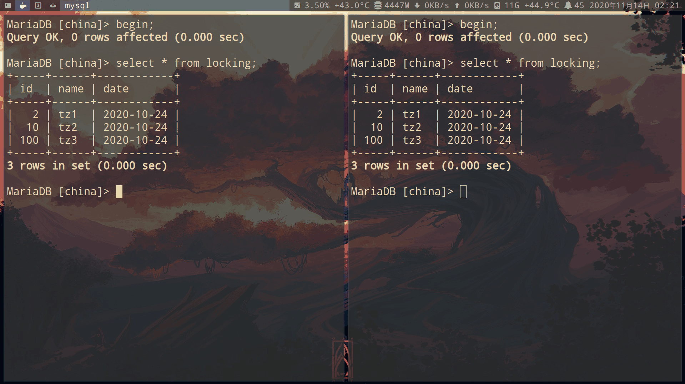
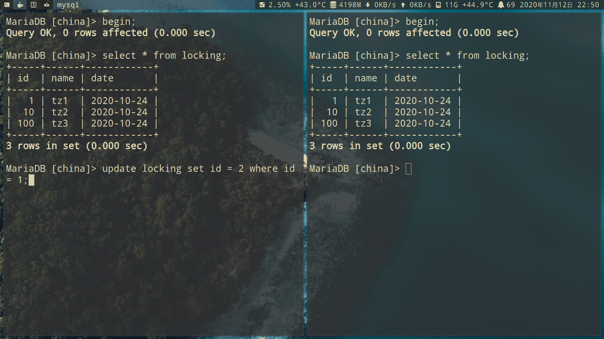

# Storage Engine (存储引擎)

- [『浅入浅出』MySQL 和 InnoDB](https://draveness.me/mysql-innodb/)

- mysql的存储引擎架构是分离的, 类似插件式的架构

修改默认存储引擎 `engine`:

> ```sh
> [mysqld]
> default_storage_engine=INNODB
> ```

- MyIsam: 速度更快,因为 MyISAM 内部维护了一个计数器,可以直接调取,使用 b+树索引

  > 表锁(对表的锁)
  >
  > 不支持事务
  >
  > 缓冲池只缓存索引文件,不缓冲数据文件
  >
  > 由 MYD 和 MYI 文件组成,MYD 用来存放数据文件,MYI 用来存放索引文件

- InnoDB: 事务更好,使用 b+树索引

  > 行锁(对行的锁),表锁(对表的锁)
  >
  > 支持事务
  >
  > 自动灾难恢复

```sql
# 查看支持的存储引擎
show engines;

# 查看目前使用的存储引擎
show variables like 'storage_engine';

# 查看 cnarea_2019表 的存储引擎
show create table cnarea_2019\G;

# 修改ca表的存储引擎为MYISAM
ALTER TABLE ca ENGINE = MYISAM;
```

### 锁

- [MySQL 锁详解](https://blog.csdn.net/qq_40378034/article/details/90904573)

Mysql 锁分为**共享锁**和**排他锁**,也叫做 **读锁** 和 **写锁**:

- 写锁: 是排他的,它会阻塞其他的写锁和读锁.从颗粒度来区分,可以分为 **表锁** 和 **行锁** 两种.

- 表锁: 会锁定整张表并且阻塞其他用户对该表的所有读写操作,比如 alter 修改表结构的时候会锁表.

> Innodb 默认使用的是行锁.而行锁是基于索引的,因此要想加上行锁,在加锁时必须命中索引,否则将使用表锁.

**行锁分为:**

- Pessimistic Locking(悲观锁): 具有**排他性**,数据处理过程中,数据处于锁定状态

- Optimistic Locking(乐观锁): 记录 commit 的版本号(version),对数据修改会改变 version,通过对比 **修改前后 的 version 是否一致**来确定是哪个事务的 commit

[详情](https://zhuanlan.zhihu.com/p/222958908)

> ```sql
> # 加锁
> LOCK TABLES 表1 WRITE, 表2 READ, ...;
>
> # 排他锁(写锁)
> LOCK TABLES 表1 WRITE;
>
> # 共享锁(读锁)
> LOCK TABLES 表1 READ;
> ```

> ```sql
> # 解锁
> UNLOCK TABLES;
> ```

> ```sql
> # 通过队列查看是否有 lock
> show processlist;
> ```

行锁创建一个表进行实验:

```sql
CREATE TABLE locking(
    id int (8) NOT NULL UNIQUE,
    name varchar(50),
    date DATE
);

insert into locking (id,name,date) values
(1,'tz1','2020-10-24'),
(10,'tz2','2020-10-24'),
(100,'tz3','2020-10-24');
```

共享锁:只能加入读取锁

事务 a 对表 locking 加入共享锁:

```sql
begin;
select * from locking
lock in share mode;
```

事务 b 也能对表 locking 加入共享锁:

```sql
begin;
select * from locking
lock in share mode;

update locking set id = 20 where id = 10;

# 加入非读取锁(悲观锁) 或者 使用update语句,会阻塞
select * from locking
for update;
```


悲观锁:不能加入其他锁

```sql
# 事务a 在select 最后 加入 for update 悲观锁,锁整个表
begin;
select * from locking
for update;

# 事务b 执行update时 或者 加入其他锁,会阻塞
begin;
update locking
set id = 1
where id = 2;

# 事务a commit后,事务b update id = 1 执行成功
commit;
```


```sql
# 事务a 加入where 从句,只锁对应的行(我这里是id = 1)
select * from locking
where id = 1
for update;

# 事务b 对 update 不同的行 成功执行
update locking
set id = 10
where id = 20;

# 事务b update id = 1时,会阻塞
update locking
set id = 2
where id = 1;

# 事务a commit后,事务b update id = 1 执行成功
commit;
```


**事务 a** 和 **事务 b** 插入相同的数据,**事务 a** 先 **事务 b** 插入.那么**事务 b** 会被阻塞,当事务 a `commit` 后

- 如果有唯一性索引或者主健那么 **事务 b** 会插入失败(幻读)

- 如果没有,那么将会出现相同的两条数据

**有唯一性索引或者主健:**

```sql
# 事务a 和 事务 b 插入同样的数据
insert into locking (id,name,date) value
(1000,'tz4','2020-10-24');
```



**没有索引:**

```sql
# 删除唯一性索引
alter table locking
drop index id;

# 事务a 和 事务 b 插入同样的数据
insert into locking (id,name,date) value
(1000,'tz4','2020-10-24');
```


---

乐观锁:

修改包含:update,delete

事务 a: 修改数据为 2

```sql
begin;
select * from locking;

update locking
set id = 2
where id = 1;

commit;
select * from locking;
```

事务 b: 修改数据为 3

```sql
begin
select * from locking;

update locking
set id = 3
where id = 1;

commit;
```

最后结果 **2**.

因为事务 a 比事务 b 先 commit,此时版本号改变,所以当事务 b 要 commit 时的版本号 与 事务 b 开始时的版本号不一致,提交失败.



### dictionary(字典)

#### informantion_schema

- row_format(行格式)是 `redundant` ,存储在 `ibdata1`, `ibdata2` 文件

- 记录 `innodb` 核心的对象信息,比如表、索引、字段等

- 表一般是大写

**informantion_schema** 的表一般有多种 **engine**(存储引擎):

- **Memory**(内存)
  
- **MariaDB** 数据库: **Aria**(类似 MyISAM)
  
- **Mysql** 数据库: **Innodb**
  

```sql
# 查看innoddb字典
use information_schema;
show tables like '%INNODB_SYS%';
+------------------------------+
| Tables_in_information_schema |
+------------------------------+
| INNODB_SYS_DATAFILES         |
| INNODB_SYS_TABLESTATS        |
| INNODB_SYS_FIELDS            |
| INNODB_SYS_FOREIGN_COLS      |
| INNODB_SYS_FOREIGN           |
| INNODB_SYS_TABLES            |
| INNODB_SYS_COLUMNS           |
| INNODB_SYS_TABLESPACES       |
| INNODB_SYS_VIRTUAL           |
| INNODB_SYS_INDEXES           |
| INNODB_SYS_SEMAPHORE_WAITS   |
+------------------------------+
```

查看使用 innodb 存储的表:

```sql
select * from INNODB_SYS_TABLES;
```


**InnoDB Buffer Pool** 储数据和索引,减少磁盘 I/O,是一种特殊的 mitpoint LRU 算法
[查看 INNODB_BUFFER 表](https://mariadb.com/kb/en/information-schema-innodb_buffer_pool_stats-table/)

```sql
select * from INNODB_BUFFER
# 或者 隔几秒就会有变化
show global status like '%buffer%';

# innodb 页是16k

# 一共 8057页
POOL_SIZE: 8057

# 空闲页
FREE_BUFFERS: 6024

# 已使用页
DATABASE_PAGES: 2033
```


**innodb_buffer_pool_size** 越大,初始化时间就越长

```sql
show variables like 'innodb%buffer%';
```


#### performance_schema

独立的内存存储引擎:


## MyISAM

在 Mysql 保存目录下:

- frm: 表格式(innodb也有此文件)

- MYD: 数据文件

- MYI: 索引文件


MyISAM 不支持行锁,在执行查询语句(SELECT、UPDATE、DELETE、INSERT 等)前,会自动给涉及的表加读锁,这个过程并不需要用户干预

当线程获得一个表的写锁后, 只有持有锁的线程可以对表进行更新操作. 其他线程的读、 写操作都会等待,直到锁被释放为止.

默认情况下,写锁比读锁具有更高的优先级:当一个锁释放时,这个锁会优先给写锁队列中等候的获取锁请求,然后再给读锁队列中等候的获取锁请求.

这也正是 MyISAM 表不太适合于有大量更新操作和查询操作应用的原因,因为,大量的更新操作会造成查询操作很难获得读锁,从而可能永远阻塞.

测试在循环 50 次 select 的过程中,MYISAM 的表的写入情况

```sql
# 创建存储过程,循环50次select

delimiter #
create procedure scn()
begin
declare i int default 1;
declare s int default 50;

while  i < s do
    select * from cnarea_2019;
    set i = i + 1;
end while;

end #
delimiter ;

# 执行scn
call scn();
```

打开另一个客户端,对 MyISAM 表修改数据:

```sql
show processlist;

update cnarea_2019
set name='test-lock'
where id <11;

select name from cnarea_2019
where id < 11;
```

- 左边:修改数据的客户端
- 右边:执行 call scn();

左边在等待右边的锁,可以看到我停止 **scn()**后,立马修改成功


[跳转 innodb 同样的实验](#innodb_lock)

## [InnoDB](https://dev.mysql.com/doc/refman/8.0/en/innodb-storage-engine.html)

注意:在 MariaDB 10.3.7 以上的版本,InnoDB 版本不再与 MySQL 发布版本相关联
[InnoDB and XtraDB](https://mariadb.com/kb/en/innodb/)

在 Mysql 保存目录下:

- frm: 表格式

- ibd: 索引和数据文件


行格式:

- Compact

- Redundant


tablespace (表空间):

- segment (包括段)
- extent (区)
- page (页)


InnoDB 采用`WAL`(Write-Ahead Logging). 先修改日志,再在修改数据页进 buffer(内存).当等到有空闲线程、内存不足、Redo log 满了时再 Checkpoint(刷脏).写 Redo log 是顺序写入,Checkpoint(刷脏)是随机写.

[日志格式:](https://mp.weixin.qq.com/s?__biz=MzA5ODM5MDU3MA==&mid=2650869018&idx=1&sn=7723368c861231e310666dc4dd749141&chksm=8b67ea5fbc10634958da77475d084241aef457631bab8cd26a91816f7e450626b36978f61477&scene=21#wechat_redirect)

- redo log(重做日志) 物理日志:事务提交成功,数据页被修改后的值,就会被永久存储了.文件名`ib_logfile*`

- binlog 逻辑日志:事务提交成功,记录数据库所有更改操作. 不包括 select,show


redo log 参数:`innodb_flush_log_at_trx_commit`.在导入数据时可以临时调整为 `0` 提高性能.

| 参数 | 操作                                       | 安全性               |
| ---- | ------------------------------------------ | -------------------- |
| 0    | log buffer 每 1 秒写日志,写数据           | 最快,有数据丢失风险 |
| 1    | log buffer commit 后,写日志,写数据        | 最安全               |
| 2    | log buffer commit 后,写日志,每 1 秒写数据 | 较快,有数据丢失风险 |

binlog 参数:`sync_binlog`.

| 参数 | 操作                                                   |
| ---- | ------------------------------------------------------ |
| 0    | 由参数`binlog_group_commit_sync_delay`指定延迟写入日志 |
| n    | 延迟等于 commit n 次后,再写入日志                      |

最安全:把`innodb_flush_log_at_trx_commit` 和 `sync_binlog` 设置为 `1`

查看日志缓冲区大小,更大的日志缓冲区可以节省磁盘 `I / O`:

```sql
# 默认是 16M
show variables like 'innodb_log_buffer_size';
+------------------------+----------+
| Variable_name          | Value    |
+------------------------+----------+
| innodb_log_buffer_size | 16777216 |
+------------------------+----------+

# 查看 InnoDB 版本:
SHOW VARIABLES LIKE "innodb_version";
```

#### REDO LOG (重做日志)

- redo log 以 **块(block)** 为单位进行存储的,每个块的大小为 **512** Bytes
- redo log 文件的组合大小 = (`innodb_log_file_size` \* `innodb_log_files_in_group`)

```sql
# redo log文件大小
show variables like 'innodb_log_file_size';
+----------------------+-----------+
| Variable_name        | Value     |
+----------------------+-----------+
| innodb_log_file_size | 100663296 |
+----------------------+-----------+

# redo log文件数量
show variables like 'innodb_log_files_in_group';
+---------------------------+-------+
| Variable_name             | Value |
+---------------------------+-------+
| innodb_log_files_in_group | 1     |
```

#### UNDO LOG

undo log 逻辑日志:事务未提交的时候,修改数据存到日志里.系统崩溃时,没 COMMIT 的事务 ,就需要借助 undo log 来进行回滚至,事务开始前的状态.保存在`ibdata*`

<span id="transaction"></span>

#### TRANSACTION (事务)

| 事务sql语句   | 操作           |
| ------------- | -------------- |
| BEGIN         | 开始一个事务   |
| ROLLBACK      | 事务回滚       |
| COMMIT        | 事务确认       |

```sql
# 创建表tz
create table tz (
    id int (8),
    name varchar(50),
    date DATE
);

# 开始事务
begin;

# 插入数据
insert into tz (id,name,date) values
(1,'tz','2020-10-24');

# 回滚到开始事务之前(rollback 和 commit 只能选一个)
rollback;
# 如果出现waring,表示该表的存储引擎不支持事务(不是innodb)
Query OK, 0 rows affected, 1 warning (0.00 sec)

# 如果不回滚,使用commit确认这次事务的修改
commit;
```

如果有两个会话,一个开启了事务,修改了数据.另一个会话同步数据要执行 `flush table 表名`

```sql
# 把 clone表 存放在缓冲区里的修改操作写入磁盘
flush table clone
```


`flush table clone`后, `select` 数据同步


---

- `SAVEPOINT savepoint_name;` 声明一个事务保存点
- `ROLLBACK TO savepoint_name;` 回滚到事务保存点,但不会终止该事务
- `RELEASE SAVEPOINT savepoint_name;` // 删除指定保留点

```sql
# 创建数据库
create table tz (
    id int (8),
    name varchar(50),
    date DATE
);

# 声明一个名叫 abc 的事务保存点
savepoint abc;

# 插入数据
insert into tz (id,name,date) values
(1,'tz','2020-10-24');

# 回滚到 abc 事务保存点
rollback to abc;
```

##### [设置事务隔离性为不可重复读](https://mariadb.com/kb/en/set-transaction/)

查看事务隔离性:

```sql
SELECT @@GLOBAL.tx_isolation, @@tx_isolation;
```

创建测试表,并插入数据:

```sql
drop table if exists test;

CREATE TABLE test(
    id int (8),
    name varchar(50),
    date DATE
);

insert into test (id,name,date) values
(1,'tz1','2020-10-24'),
(10,'tz2','2020-10-24'),
(100,'tz3','2020-10-24');

commit;
```

###### read uncommitted(未提交读) , dirty read (脏读)

开启事务 a:

```sql
# 设置事务a read uncommitted
set session transaction isolation level read uncommitted;
begin;
select * from test;
```

开启事务 b,并修改数据,不需要提交:

```sql
begin;
select *from test;

update test
set id = 20
where id = 10;
```

事务 a 就能读取:

```sql
select * from test;
```

- 右边为事务 a
- 左边为事务 b
  

注意:如果事务 b,没有 `commit` 就退出.那么事务 b 的修改将失效


###### read committed(已提交读) , phantom read (幻读):

开启事务 a:

```sql
# 设置事务a read committed
set session transaction isolation level read committed;
begin;
select * from test;
```

开启事务 b,并修改数据后,提交:

```sql
begin;
select *from test;

update test
set id = 20
where id = 10;

# 区别于 read uncommitted
commit;
```

事务 a 就能读取:

```sql
select * from test;
```

- 右边为事务 a
- 左边为事务 b
  

#### autocommit

`autocommit = 1` 对表的所有修改将立即生效

`autocommit = 0` 则必须使用 COMMIT 来提交事务,或使用 ROLLBACK 来回滚撤销事务

- 1.如果 InnoDB 表有大量的修改操作,应设置 `autocommit = 0` 因为 `ROLLBACK` 操作会浪费大量的 I/O

> **注意:**
>
> - 不要长时间打开事务会话,适当的时候要执行 COMMIT(完成更改)或 ROLLBACK(回滚撤消更改)
> - ROLLBACK 这是一个相对昂贵的操作 请避免对大量行进行更改,然后回滚这些更改.
>
> ```sql
> [mysqld]
> autocommit = 0
> ```

- 2.如果只是查询表,没有大量的修改,应设置 `autocommit = 1`

#### 锁

**死锁:**


事务 A 在等待事务 B 释放 id=2 的行锁,而事务 B 在等待事务 A 释放 id=1 的行锁.互相等待对方的资源释放,就进入了死锁状态.当出现死锁以后,有两种策略:

- 一:进入等待,直到超时.超时时间参数 `innodb_lock_wait_timeout`

- 二:发起死锁检测,发现死锁后,主动回滚死锁链条中的某一个事务,让其他事务得以继续执行.将参数 `innodb_deadlock_detect` 设置为 `on`.但是它有额外负担的.每当一个事务被锁的时候,就要看看它所依赖的线程有没有被别人锁住,如此循环,最后判断是否出现了循环等待,也就是死锁

MVCC(多版本并发控制): 实际上就是保存了数据在某个时间节点的快照

<span id="innodb_lock"></span>

```sql
# 把 cnarea_2019表 改为innodb 引擎
alter table cnarea_2019 rename cnarea_2019_innodb;
alter table cnarea_2019_innodb engine = innodb;
```

测试在循环 50 次 select 的过程中,innodb 的表的写入情况

```sql
# 创建存储过程,循环50次select
delimiter #
create procedure scn2()
begin
declare i int default 1;
declare s int default 50;

while  i < s do
    select * from cnarea_2019_innodb;
    set i = i + 1;
end while;

end #
delimiter ;

# 执行scn2
call scn2();
```

打开另一个客户端,对 innodb 表修改数据:

```sql
update cnarea_2019_innodb
set name='test-lock'
where id < 11;

select name from cnarea_2019_innodb
where id < 11;
```

- 左边:修改数据的客户端
- 右边:执行 call scn2();

修改数据后左边**commit**,右边也**commit**后,数据同步


### MVCC

- [PolarDB-X: InnoDB事务 - 从原理到实现](https://zhuanlan.zhihu.com/p/365415843)

- 每个事务修改数据之后, 会创建一个新的版本

    - 事务id作为版本号

    - 多个版本会通过指针连接起来, 通过指针即可遍历所有版本

    

- 旧版本回收:

    - 当一个版本对所有活跃事务都不可见了, 即可回收

- innodb 采用 n2o(从最新到最旧):

    

    - TRX_ID: 是创建这个Tuple 的 TRX_ID

    - ROLL_PTR: 是指向了undo log 旧版本的指针

        - 旧版本的数据存储在**undo log**里

        

