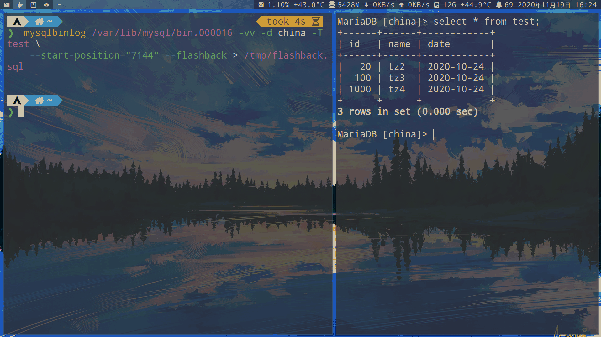
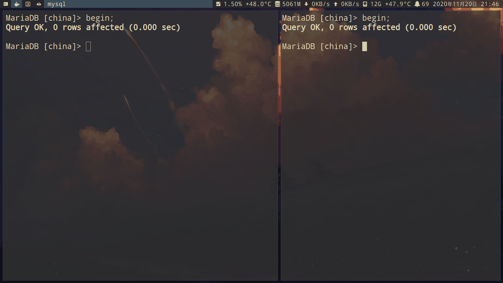
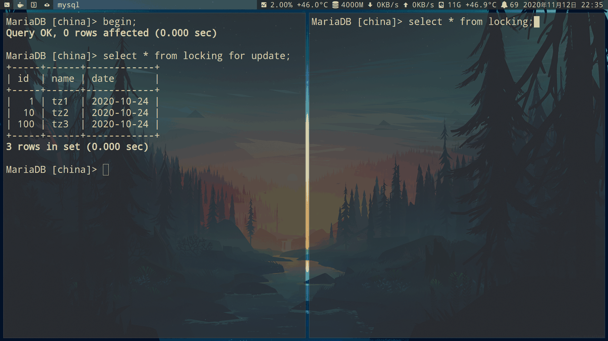
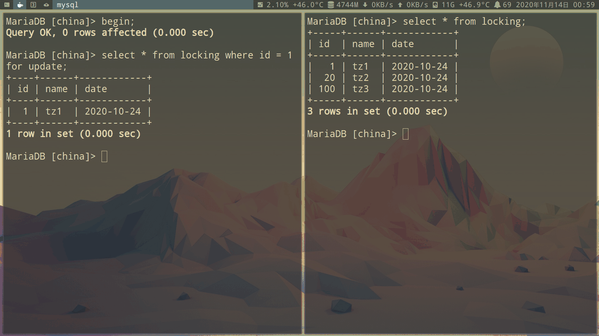
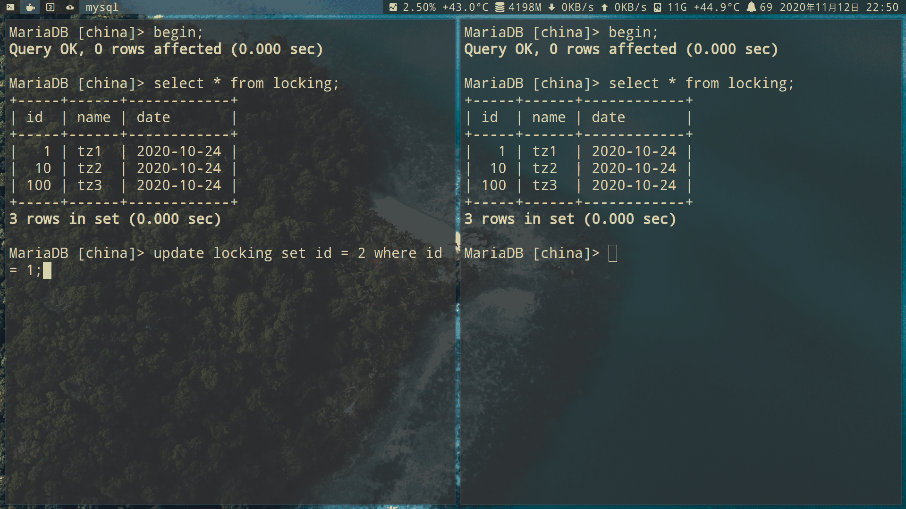
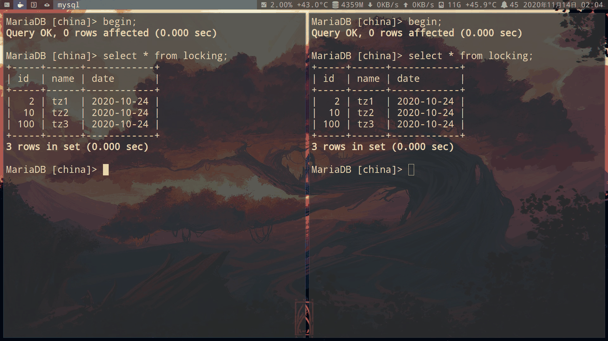
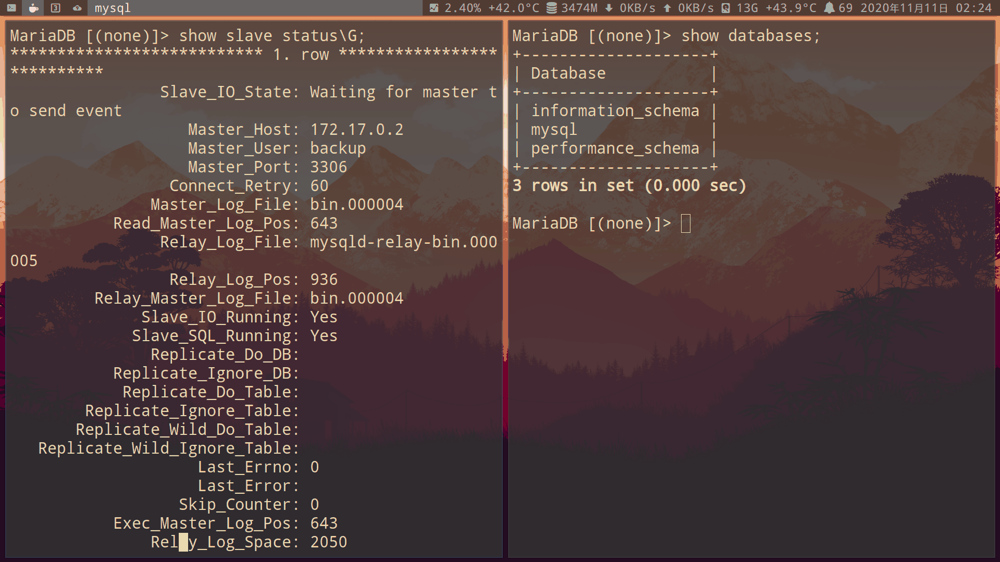

# mysql

## 版本


- MySQL 的发布模型分为两个主要路径：
    - 长期支持版（LTS，Long-Term Support）
    - 创新版（Innovation）。
    - 所有 LTS 和创新版本都包含错误和安全修复，并被视为生产级质量。

    

- 什么情况适合 LTS 版？
    - 需要稳定的功能和更长的支持期。
    - 除了第一个 LTS 版本删除了一些功能，其他版本仅包含必要的修复，不在删除功能。
    - LTS 版本遵循 Oracle 终身支持政策（5 年主要支持和 3 年延长支持）。

- 什么情况适合创新版？
    - 想了解最新功能、改进。适合快节奏开发环境中的开发和 DBA，具有更高水平的自动化测试和现代持续集成技术，可实现更快的升级周期。
    - 除新功能外，随着代码重构、删除不推荐功能以及修改 MySQL 使其更符合 SQL 标准（在 LTS 版本中不会发生）。
    - 支持至下一个创新版。

- LTS 版本内的升级和降级

    > 在 LTS 版本内，功能保持不变，数据格式也不会改变。

    - 因此：

        - 就地升级和降级是可能的。与 MySQL 8.0.x 版本（< 8.0.34）相比，这是一个改进，因为降级是不可能的，并且不建议跳过版本进行升级。
        - InnoDB CLONE 在 LTS 版本内都支持升级和降级。
    - 完全过渡到这一点还需要一些工作，这将在 8.0.34 之后的版本中完成。

    - 可以从一个 LTS 版本迁移到下一个 LTS 版本，而无需执行多个中间创新版本的升级步骤。
    - 可以通过就地升级、MySQL Shell 导出和导入以及 MySQL 异步复制进行升级。
    - 仅为了回滚正在进行的升级，可以通过 MySQL Shell 导出和导入以及 MySQL 复制进行降级。


- 创新版本之间的升级和降级
    - 支持从一个创新版本或 LTS 版本就地升级到未来的创新版本，直到下一个 LTS 版本。复制和导出导入也可以实现。
    - 降级将需要逻辑导出和导入。这与 MySQL 8.0.x（< 8.0.34）类似。

- 使用MySQL异步复制进行升级和降级

    - 在业务关键环境中，升级通常使用 MySQL 异步复制完成，其中新版本环境被设置为当前版本的从库。这允许近零停机时间的升级。

    - 可以从 LTS 版本或创新版本异步复制到：

        - 下一个 LTS 版本。
        - 任何未来的创新版本，直到下一个 LTS 版本（LTS 8.4 → LTS 9.7，但不是 LTS 8.4 → LTS 10.7）。

    - 如果在提升新版本后出现任何问题，支持回到前一个版本非常重要。因此，MySQL 异步复制将能够复制到前一个版本。此支持仅用于回滚目的，其中尚未使用新功能，不应视为持续生产部署的一部分。

## 安装 MySql

- MySQL主要包含四个部分的程序，分别为：服务器程序、安装程序、实用工具程序，及客户端程序。

- 服务器程序：mysqld

    ```sh
    # 手动启动
    mysqld --user=mysql --datadir=/var/lib/mysql --socket=/tmp/mysql.sock
    ```

- 安装程序：

    - mysql_secure_installation：可以对安全性进行初始化配置
        - 可以改善MySQL服务器的安全性，包括创建root用户的密码、删除root用户的远程访问权限、删除匿名账户，以及删除“test”数据库。注意，该程序主要针对8.0之前版本的MySQL，8.0的安装包内已经包含了上述功能。

    - mysql_tzinfo_to_sql：则可以创建一个包含主机时区信息的SQL语句。

- 实用工具程序：

    - mysql_config_editor：用于管理登录路径，方便用户通过命令行客户端连接MySQL服务器。

        - 可以创建一个加密的选项文件，文件中包含用户的密码及主机的选项，默认产生的文件名称为`.mylogin.cnf`

            - 可以通过设置`MYSQL_TEST_LOGIN_FILE`环境变量的值更改该文件名称
            ```ini
            [adminuser]
            user=root
            password = mysqlroot
            host = 127.0.0.1
            ```
        ```sh
        # 创建登录路径时，使用如下命令：
        mysql_config_editor set --login-path=login-path --user=username --password --host=hostname

        # 删除登录路径时，使用如下命令；
        mysql_config_editor remove --login-path=login-path

        # 客户端连接MySQL服务器时，使用“--login-path”选项，指定用户名即可进行连接。例如，
        mysql --login-path=adminuser
        ```

    - mysqlbinlog：用于读取和回放二进制日志中的内容。

    - mysqldumpslow：用于读取和总结慢查询日志的内容。

    - mysql_ssl_rsa_setup：用于创建TLS密钥和证书

    - ibd2sdi：用于从InnoDB表空间文件中抽取SDI（serialized dictionary information）

- 客户端程序：

    - mysql：MySQL命令行客户端

    - mysqladmin：用于监视、管理及关闭MySQL

    - mysqldump/mysqlpump：使用SQL语句执行的逻辑备份工具

    - mysqlimport：用于将文件中的数据导入数据库

    - mysqlslap：加载模拟程序

    - mysqlshow：用于显示数据库对象的元数据

    - mysqlcheck：用于检查和优化数据库的表

    - mysqlsh：MySQL的高级命令行客户端及代码编辑器

### Centos 7 安装 MySQL

- 从 CentOS 7 开始,`yum` 安装 `MySQL` 默认安装的会是 `MariaDB`

- 安装mariadb
    ```sh
    # 不要用yum命令安装。如果使用yum install -y mysql安装，是没有systemd 的unit的
    systemctl start mariadb
    Failed to start mariadb.service: Unit not found.

    # 使用dnf命令安装
    dnf install mariadb-server
    ```

- 安装mysql8
    - 整个过程需要科学上网

    ```sh
    # 下载
    wget https://dev.mysql.com/get/mysql80-community-release-el7-3.noarch.rpm

    # 安装源
    rpm -Uvh mysql80-community-release-el7-3.noarch.rpm

    # 查看安装是否成功
    yum repolist enabled | grep "mysql.*-community.*"

    # 查看当前MySQL Yum Repository中所有MySQL版本(每个版本在不同的子仓库中)
    yum repolist all | grep mysql

    # 切换版本
    yum-config-manager --disable mysql80-community
    yum-config-manager --enable mysql57-community

    # 安装
    yum install mysql-community-server
    ```

- /etc/mysql/my.cnf
    ```sh
    [mysqld]
    # 允许MySQL监听所有网络接口
    bind-address = 0.0.0.0
    ```

<span id="docker"></span>

### [docker 安装](https://www.runoob.com/docker/docker-install-mysql.html)

```sh
# 下载镜像
docker pull mysql:latest

# 查看本地镜像
docker images

# -p端口映射
docker run -itd --name mysql-tz -p 3306:3306 -e MYSQL_ROOT_PASSWORD=YouPassword mysql

# 查看运行镜像
docker ps

#进入容器
docker exec -it mysql-tz bash

#登录 mysql
mysql -uroot -pYouPassword -h 127.0.0.1 -P3306
```

### 升级

- 2023年10月25日，随着MySQL 5.7.44发布，宣告5.7正式停止开发和维护。而不少企业选择把MySQL 5.7升级到8.0。

#### github升级mysql 8.0过程

- GitHub也在去年把MySQL升级到了8.0。[详细的升级过程](https://github.blog/2023-12-07-upgrading-github-com-to-mysql-8-0/)

- 总结一下大致步骤

    - 1.先升级部分副本，然后将部分只读流量切上去，也会保留足够的5.7副本，以方便回滚

    - 2.如果只读流量经过8.0的验证，没问题，就调整复制拓扑为下图形式

        

        - 一个8.0的候选，直接接在5.7主库后面

        - 8.0的从库下游又创建两个复制链

            - 一部分是5.7的从（暂时不提供查询，用来做回滚用的）

            - 另外一部分是8.0的从，用来承担只读查询

    - 3.通过Orchestrator，执行failover将上图MySQL 8.0的从库提升为主。

        - 通过Orchestrator，执行failover将上图MySQL 8.0的从库提升为主。

        - 这个时候，拓扑变成了一个8.0的主，它下游附带了两个复制链组：

            - 一部分是5.7的从（暂时不提供查询，用来做回滚用的）。

            - 另外一部分是8.0的从，用来承担只读查询。

        - 并且Orchestrator还把5.7的主机列为故障转移的黑名单，防止发生切换的时候，又出现5.7的实例提升为主的情况。

    - 4.升级其他用于备份或者非生产的实例

    - 5.如果在8.0的版本下运行了足够长的时间（至少24小时），则把集群内5.7版本的MySQL全删除。

#### [爱可生开源社区：MySQL 5.7 升级到 8.0 可能踩的一个坑](https://mp.weixin.qq.com/s/DLf98FgoE-FbxmETzGnSZw)

### 各大公司mysql架构

#### [解剖“全球最大男性交友网站”，GitHub十五年数据库架构演进](https://mp.weixin.qq.com/s/2FuKZtMdRzDvy-WOeD1eIw)

## 日志

| 日志类型   | 日志说明                               |
|------------|----------------------------------------|
| 错误日志   | Mysql本身的错误日志                    |
| 查询日志   | 查询语句日志                           |
| 慢查询日志 | 慢查询语句，查询耗时续配署             |
| 事务日志   | 记录事物执行过程，用于故障恢复         |
| binlog二进制日志 | 记录所有语句执行记录，用于数据同步等   |
| 中继日志   | 线程读取别人的二进制日志存到本地的日志 |


### 普通日志

- 默认情况下，MYSQL 中不启用日志文件。所有错误都会显示在 `syslog (/var/log/syslog)` 中。

| 日志类型          | 记录内容                                                       |
|-------------------|----------------------------------------------------------------|
| error log         | 它包含有关服务器运行时发生的错误的信息(也包括服务器启动和停止) |
| general query log | 记录(连接、断开连接、查询)                                     |
| Slow Query log    | 慢查询日志                                                     |

- 查看日志大小, 保存路径

```sql
show variables like '%log%file%';
```

修改`/etc/mysql/my.cnf` 配置文件下启用日志

- 开启 error log:

    ```sh
    [mysqld_safe]
    log_error=/var/log/mysql/mysql_error.log

    [mysqld]
    log_error=/var/log/mysql/mysql_error.log
    ```

- 开启 general query log:

    ```sh
    general_log_file = /var/log/mysql/mysql_general.log
    general_log = 1
    ```

- 开启 Slow Query log:

    ```sh
    slow_query_log_file = /var/log/mysql/mysql_slow.log
    slow_query_log = 1

    # 超过两秒, 可以设置0秒捕捉所有查询
    long_query_time = 2
    log-queries-not-using_indexes
    ```

    ```sh
    # 创建文件
    mkdir /var/log/mysql

    touch /var/log/mysql/mysql_error.log
    touch /var/log/mysql/mysql_general.log
    touch /var/log/mysql/mysql_slow.log

    # 授予权限
    chown mysql:mysql /var/log/mysql/mysql_error.log
    chown mysql:mysql /var/log/mysql/mysql_general.log
    chown mysql:mysql /var/log/mysql/mysql_slow.log

    # 重启 mysql
    systemctl restart mysqld
    ```

- 在运行时启用日志:

    ```sh
    SET GLOBAL general_log = 'ON';
    SET GLOBAL slow_query_log = 'ON';
    ```

### binlog (二进制日志)

MySQL 8.0 中的二进制日志格式与以前的 MySQL 版本不同

- binlog是逻辑日志，记录内容是语句的原始逻辑，类似于“给 ID=2 这一行的 c 字段加 1”，属于MySQL Server层。

    - 不管用什么存储引擎，只要发生了表数据更新，都会产生binlog日志。

    - 只记录对数据库更改的所有操作，不包括 `select`，`show` 等这类操作不修改数据的语句

- redo log它是物理日志，记录内容是“在某个数据页上做了什么修改”，属于InnoDB存储引擎。

    

- binlog的作用：MySQL数据库的数据备份、主备、主主、主从都离不开binlog，需要依靠binlog来同步数据，保证数据一致性。
    

- 启用了binlog的服务器会使性能稍微降低

- 写入机制：

    - 事务执行过程中，先把日志写到binlog cache，事务提交的时候，再把binlog cache写到binlog文件中。

    - 因为一个事务的binlog不能被拆开，无论这个事务多大，也要确保一次性写入，所以系统会给每个线程分配一个块内存作为binlog cache

    - 我们可以通过binlog_cache_size参数控制单个线程 binlog cache 大小，如果存储内容超过了这个参数，就要暂存到磁盘（Swap）。

        

        - 上图的 `write`，是指把日志写入到文件系统的 page cache，并没有把数据持久化到磁盘，所以速度比较快

        - 上图的 `fsync`，才是将数据持久化到磁盘的操作

        - 由参数`sync_binlog`控制，默认是0。
            - 为0的时候，表示每次提交事务都只write，由系统自行判断什么时候执行fsync。
            - 为了安全起见，可以设置为1，表示每次提交事务都会执行fsync，就如同binlog 日志刷盘流程一样。

    - [爱可生开源社区：MySQL 核心模块揭秘 | 10 期 | binlog 怎么写入日志文件？](https://mp.weixin.qq.com/s?__biz=MzU2NzgwMTg0MA==&mid=2247514251&idx=1&sn=98cf7b9fc9c0116327a0154809b92c33&chksm=fc955a14cbe2d302e3d9deb93b5919163612d8b26de98f818ad48adb4e994bea6ac85f6504aa&cur_album_id=3254180525410418690&scene=189#wechat_redirect)

- binlog日志有3种格式，可以通过`binlog_format`参数指定。

    ```sql
    show variables like 'binlog_format';
    +---------------+-------+
    | Variable_name | Value |
    +---------------+-------+
    | binlog_format | ROW   |
    +---------------+-------+
    ```

    - statement：记录的内容是SQL语句原文`update T set update_time=now() where id=1`
        

        - 问题：同步数据时，会执行记录的SQL语句，update_time=now()这里会获取当前系统时间，直接执行会导致与原库的数据不一致。

        - 解决方法：我们需要指定为row：

    - row（通常会设置此值）：记录的内容不再是简单的SQL语句了，还包含操作的具体数据
        - 记录的内容看不到详细信息，要通过mysqlbinlog工具解析出来。
        

        - update_time=now()变成了具体的时间update_time=1627112756247，条件后面的@1、@2、@3 都是该行数据第 1 个~3 个字段的原始值（假设这张表只有 3 个字段）。

            - 缺点：需要更大的容量来记录，比较占用空间，恢复与同步时会更消耗IO资源，影响执行速度。

    - mixed：前两者的混合。判断这条SQL语句是否可能引起数据不一致，如果是，就用row格式，否则就用statement格式。

#### 解析binlog

- [爱可生开源社区：MySQL 核心模块揭秘 | 06 期 | 事务提交之前，binlog 写到哪里？](https://mp.weixin.qq.com/s?__biz=MzU2NzgwMTg0MA==&mid=2247513577&idx=1&sn=793b807b72016cb10b3f903720ebf49e&chksm=fc955776cbe2de60fc8f2af8219a2d282d5ffd7de37ba7c2f6d124139dafb3d57d36ea4a4384&cur_album_id=3254180525410418690&scene=189#wechat_redirect)

- 准备工作

    ```sql
    -- 创建测试表
    CREATE TABLE `t_binlog` (
      `id` int unsigned NOT NULL AUTO_INCREMENT,
      `i1` int DEFAULT '0',
      `str1` varchar(32) DEFAULT '',
      PRIMARY KEY (`id`) USING BTREE
    ) ENGINE=InnoDB DEFAULT CHARSET=utf8mb3;

    -- 开启事务，插入数据
    BEGIN;

    INSERT INTO `t_binlog` (`i1`, `str1`)
    VALUES (100, 'MySQL 核心模块揭秘');

    COMMIT;

    -- 查看binlog，我这里为arch.000040
    show binary logs;
    +-------------+-----------+
    | Log_name    | File_size |
    +-------------+-----------+
    | arch.000026 | 2536245   |
    | arch.000027 | 6140778   |
    | arch.000028 | 2162      |
    | arch.000029 | 360       |
    | arch.000030 | 7724      |
    | arch.000031 | 360       |
    | arch.000032 | 13971     |
    | arch.000033 | 1314      |
    | arch.000034 | 379       |
    | arch.000035 | 417       |
    | arch.000036 | 417       |
    | arch.000037 | 417       |
    | arch.000038 | 398       |
    | arch.000039 | 360       |
    | arch.000040 | 953       |
    +-------------+-----------+
    ```

- 解析事务binlog日志

    ```sh
    # 进入binlog的目录
    cd /var/lib/mysql/

    # 解析事务产生的 binlog 日志
    mysqlbinlog  arch.000040 --base64-output=decode-rows -vv
    ```

- 解析事务 binlog 日志之后，我们可以得到 4 个 binlog event。

    - 示例 SQL 中，只有两条 SQL 会产生 binlog event：

        - BEGIN：不会产生 binlog event。
        - INSERT：产生三个 binlog event。
            - Query_log_event。
            - Table_map_log_event。
            - Write_rows_log_event。
        - COMMIT：产生 Xid_log_event。

    - 按照这些 binlog event 在 binlog 日志文件中的顺序，简化之后的内容如下：

    - 1.Query_log_event

        ```sql
        # at 657
        START TRANSACTION
        ```

    - 2.Table_map_log_event

        ```sql
        # at 800
        Table_map: `test`.`t_binlog` mapped to number 57
        ```

    - 3.Write_rows_log_event

        ```sql
        # at 855
        Write_rows: table id 57 flags: STMT_END_F
        ### INSERT INTO `test`.`t_binlog`
        ### SET
        ###   @1=1 /* INT meta=0 nullable=0 is_null=0 */
        ###   @2=100 /* INT meta=0 nullable=1 is_null=0 */
        ###   @3='MySQL 核心模块揭秘' /* VARSTRING(96) meta=96 nullable=1 is_null=0 */
        ```

    - 4.Xid_log_event

        ```sql
        Xid = 31
        COMMIT/*!*/;
        ```

##### binlog cache

- 使用 mysqlbinlog 分析 binlog 日志的时候，可以发现这么一个现象：同一个事务产生的 binlog event，在 binlog 日志文件中是连续的。

- 保证同一个事务的 binlog event 在 binlog 日志文件中的连续性，不管是 MySQL 从库回放 binlog，还是作为用户的我们，都可以很方便的定位到一个事务的 binlog 从哪里开始，到哪里结束。

- 问题：一个事务会产生多个 binlog event，很多个事务同时执行，怎么保证同一个事务产生的 binlog event 写入到 binlog 日志文件中是连续的？
- 解决方法：binlog cache

- 每个事务都有两个 binlog cache：

    - stmt_cache：改变（插入、更新、删除）不支持事务的表，产生的 binlog event，临时存放在这里。
    - trx_cache：改变（插入、更新、删除）支持事务的表，产生的 binlog event，临时存放在这里。

        - 事务执行过程中，产生的所有 binlog event，都会先写入 trx_cache。trx_cache 分为两级：

            - 第一级：内存，也称为 buffer，它的大小用 buffer_length 表示，由系统变量 binlog_cache_size 控制，默认为 32K。
            - 第二级：临时文件，位于操作系统的 tmp 目录下，文件名以 ML 开头。

        - buffer_length 加上临时文件中已经写入的 binlog 占用的字节数，也有一个上限，由系统变量 max_binlog_cache_size 控制。

##### 产生 binlog

- 如果一条 SQL 语句改变了（插入、更新、删除）表中的数据，server 层会为这条 SQL 语句产生一个包含表名和表 ID 的 Table_map_log_event。

- 每次调用存储引擎的方法写入一条记录到表中之后，server 层都会为这条记录产生 binlog。

    - 这里没有写成 binlog event，是因为记录中各字段内容都很少的时候，多条记录可以共享同一个 binlog event ，并不需要为每条记录都产生一个新的 binlog event。

        - 这个 binlog event 最多可以存放多少字节的内容，由系统变量 `binlog_row_event_max_size` 控制
            ```sql
            -- 默认为 8192 字节。
            select @@binlog_row_event_max_size
            +-----------------------------+
            | @@binlog_row_event_max_size |
            +-----------------------------+
            | 8192                        |
            +-----------------------------+
            ```

        - 如果一条记录产生的 binlog 超过了 8192 字节，它的 binlog 会独享一个 binlog event，这个 binlog event 的大小就不受系统变量 `binlog_row_event_max_size` 控制了。


- 在 binlog 日志文件中

    - 那么，第一步就要为这个事务初始化 binlog cache，包括 stmt_cache 和 trx_cache。初始化完成之后，这两个 cache 都是空的。

        - 事务执行过程中，所有 binlog event 都会先写入 trx_cache 的 buffer，buffer 大小默认为 32K。

    - 1.Query_log_event 为 BEGIN 语句的binlog event。
    - 2.Table_map_log_event 位于 SQL 语句改变表中数据产生的 binlog event 之前。
    - 3.Write_rows_log_event 是插入记录对应的 binlog event
    - 4.Xid_log_event 是 COMMIT 语句时，会产生的binlog event ，并写入 trx_cache。


- trx_cache 分为两级：内存（buffer）、临时文件。


- 写入一个 binlog event 到 trx_cache 的流程：

    - 判断 buffer 剩余空间是否足够写入这个 binlog event。
    - 如果足够，直接把 binlog event 写入 buffer，流程结束。
    - 如果不够，用 binlog event 前面的部分内容填满 buffer，然后，把 buffer 中所有内容写入临时文件，再清空 buffer，以备复用。
    - 接着判断 binlog event 剩余内容是否大于等于 4096 字节（IO_SIZE）。
    - 如果剩余内容大于等于 4096 字节，则把剩余内容前面的 N * 4096 字节写入临时文件。
    - 对于剩余内容字节数不能被 4096 整除的情况，最后还会剩下不足 4096 字节的内容，这部分内容会写入 buffer。
    - 如果剩余内容小于 4096 字节，直接把 binlog event 中剩余的所有内容都写入 buffer。

#### 二阶段提交

- [爱可生开源社区：MySQL 核心模块揭秘 | 07 期 | 二阶段提交 (1) prepare 阶段](https://mp.weixin.qq.com/s?__biz=MzU2NzgwMTg0MA==&mid=2247513770&idx=1&sn=d7cf4c9ba5acafbe33fab85219692d0b&chksm=fc955435cbe2dd2374ed1d72c332cff16f1d9c10ff8ed01f450d7fa44c4d1f3df7035f00dcef&cur_album_id=3254180525410418690&scene=189#wechat_redirect)

- 二阶段提交是一种用于保证分布式事务原子性的协议。

- 二阶段提交：

    - prepare 阶段：写binlog、redo log
    - commit 阶段：把binlog、redo log刷盘

- MySQL 把 binlog 也看作一个存储引擎，开启 binlog，SQL 语句改变（插入、更新、删除）InnoDB 表的数据，这个 SQL 语句执行过程中，就涉及到两个存储引擎。

    - 使用二阶段提交，就是为了保证2个存储引擎的数据一致性。

        - 如果没有开启 binlog，SQL 语句改变表中数据，不产生 binlog，不用保证 binlog 和表中数据的一致性，用户事务也就不需要使用二阶段提交了。

- 用户事务提交分为2种场景，如果开启了 binlog，它们都会使用二阶段提交。

    - 1.通过 BEGIN 或其它开始事务的语句，显式开始一个事务，用户手动执行 COMMIT 语句提交事务。

    - 2.没有显式开始的事务，一条 SQL 语句执行时，InnoDB 会隐式开始一个事务，SQL 语句执行完成之后，自动提交事务。

- prepare 阶段
    - binlog prepare阶段：什么也不会干
    - InnoDB prepare阶段：主要做五件事

        - 1.把分配给事务的所有 undo 段的状态从 TRX_UNDO_ACTIVE 修改为 TRX_UNDO_PREPARED

            - 进入二阶段提交的事务，都至少改变过（插入、更新、删除）一个用户表的一条记录，最少会分配 1 个 undo 段，最多会分配 4 个 undo 段。

            - 意义：如果数据库发生崩溃，重新启动后，undo 段的状态是影响事务提交还是回滚的因素之一。

        - 2.把事务 Xid 写入所有 undo 段中当前提交事务的 undo 日志组头信息。
            - InnoDB 给当前提交事务分配的每个 undo 段中，都会有一组 undo 日志属于这个事务，事务 Xid 就写入 undo 日志组的头信息。

        - 对于第 1、2 件事，如果事务改变了用户普通表的数据，修改 undo 段状态、把事务 Xid 写入 undo 日志组头信息，都会产生 redo 日志。

        - 3.把内存中的事务对象状态从 TRX_STATE_ACTIVE 修改为 TRX_STATE_PREPARED。
            - 前面修改 undo 状态，是为了事务提交完成之前，MySQL 崩溃了，下次启动时，能够从 undo 段中恢复崩溃之前的事务状态。

            - 这里修改事务对象状态，用于 MySQL 正常运行过程中，标识事务已经进入二阶段提交的 prepare 阶段。

        - 4.如果当前提交事务的隔离级别是读未提交（READ-UNCOMMITTED）或读已提交（READ-COMMITTED)，InnoDB 会释放事务给记录加的共享、排他 GAP 锁。
            - 虽然读未提交、读已提交隔离级别一般都只加普通记录锁，不加 GAP 锁，但是，外键约束检查、插入记录重复值检查这两个场景下，还是会给相应的记录加 GAP 锁。

        - 5.调用 trx_flush_logs()，处理 事务产生的 redo 日志刷盘的相关逻辑。

- 二阶段提交的 commit 阶段，分为三个子阶段。

    - 1.flush 子阶段，要干两件事：

        - 1.触发操作系统把 prepare 阶段及之前产生的 redo 日志刷盘。

            - 事务执行过程中，改变（插入、更新、删除）表中数据产生的 redo 日志、prepare 阶段修改 undo 段状态产生的 redo 日志，都会由后台线程先写入 page cache，再由操作系统把 page cache 中的 redo 日志刷盘。

            - 等待操作系统把 page cache 中的 redo 日志刷盘，这个时间存在不确定性，InnoDB 会在需要时主动触发操作系统马上把 page cache 中的 redo 日志刷盘。

        - 2.把事务执行过程中产生的 binlog 日志写入 binlog 日志文件。

            - 这个写入操作，也是先写入 page cache，至于操作系统什么时候把 page cache 中的 binlog 日志刷盘，flush 子阶段就不管了。

    - 2.sync 子阶段，根据系统变量 sync_binlog 的值决定是否要触发操作系统马上把 page cache 中的 binlog 日志刷盘。

    - 3.commit 子阶段，完成 InnoDB 的事务提交。

- 组提交与重复刷盘

    - 小事务：TP 场景，比较常见的情况是事务只改变（插入、更新、删除）表中少量数据，产生的 redo 日志、binlog 日志也比较少。

    - 以redo 日志为例，binlog 日志也有同样的问题。一个事务产生的 redo 日志少，操作系统的一个页就有可能存放多个事务产生的 redo 日志。

    - 问题：如果每个事务提交时都把自己产生的 redo 日志刷盘，共享操作系统同一个页存放 redo 日志的多个事务，就会触发操作系统把这个页多次刷盘。
        - 数据库闲的时候，把操作系统的同一个页多次刷盘，也没啥问题，反正磁盘闲着也是闲着。
        - 数据库忙的时候，假设某个时间点有 1 万个小事务要提交，每 10 个小事务共享操作系统的一个页用于存放 redo 日志，总共需要操作系统的 1000 个页。
            - 1 万个事务各自提交，就要触发操作系统把这 1000 个数据页刷盘 10000 次。


    - 解决方法：组提交。某个时间点提交的多个事务触发操作系统的同一个页重复刷盘。这样一来，1000 个数据页，只刷盘 1000 次就可以了，刷盘次数只有原来的十分之一。

        - 组提交，就是把一组事务攒到一起提交，InnoDB 使用队列把多个事务攒到一起。

        - commit 阶段的 3 个子阶段都有自己的队列，分别为 flush 队列、sync 队列、commit 队列。
            - 每个队列都会选出一个队长，负责管理这个队列，选队长的规则很简单，先到先得。

            - 对于每个队列，第一个加入该队列的用户线程就是队长，第二个及以后加入该队列的都是队员。
                - 队长要多干活：每个子阶段的队长，都会把自己和所有队员在对应子阶段要干的事全都干了。队员只需要在旁边当吃瓜群众就好。
                - 以 flush 子阶段为例
                    - 1.我们假设 flush 队列的队长为 A 队长，A 队长收编一些队员之后，它会带领这帮队员从 flush 队列挪走，并且开始给自己和所有队员干活，队员们就在一旁当吃瓜群众。
                    - 2.A 队长带领它的队员挪走之后，flush 队列就变成空队列了。
                    - 3.接下来第一个进入 flush 队列的用户线程，又成为下一组的队长，我们称它为 B 队长。
                    - 4.A 队长正在干活，还没干完呢。B 队长收编了一些队员之后，也带领这帮队员从 flush 子阶段的队列挪走，并且也要开始给自己和所有队员干活了。

                    - 如果 A 队长和 B 队长都把自己和各自队员产生的 binlog 日志写入 binlog 日志文件，相互交叉写入，那是会出乱子的。

                        - 为了避免 flush 子阶段出现两个队长同时干活导致出乱子，InnoDB 给 flush 子阶段引入了一个互斥量，名字是 LOCK_log。

                        - sync 子阶段、commit 子阶段也需要避免出现多个队长同时干活的情况，这两个子阶段也有各自的互斥量，分别是 LOCK_sync、LOCK_commit。

- [爱可生开源社区：MySQL 核心模块揭秘 | 08 期 | 二阶段提交 (2) commit 阶段](https://mp.weixin.qq.com/s?__biz=MzU2NzgwMTg0MA==&mid=2247513864&idx=1&sn=9896ca5bd7cf5d775ee9cb8c65a9ab6c&chksm=fc955597cbe2dc811614bf1d1281831d9e1cb8b04df43127aa43f25bf7f2ef94f341d5e9da20&cur_album_id=3254180525410418690&scene=189#wechat_redirect)

    - 简单总结：

        - 1.flush 子阶段，flush 队长会把自己和队员在 prepare 阶段及之前产生的 redo 日志都刷盘，把事务执行过程中产生的 binlog 日志写入 binlog 日志文件。

        - 2.sync 子阶段，如果 sync_counter + 1 大于等于系统变量 max_binlog_size 的值，sync 队长会把 binlog 日志刷盘。

        - 3.commit 子阶段，如果系统变量 binlog_order_commits 的值为 true，commit 队长会把自己和队员们的 InnoDB 事务都提交，否则，commit 队长和队员各自提交自己的 InnoDB 事务。


    - 例子：假设有 30 个事务，它们对应的用户线程编号也从 1 到 30

    - 1.flush 子阶段

        - 用户线程 16 加入 flush 队列，成为 flush 队长，并且通过申请获得 LOCK_log 互斥量。

        - flush 队长收编用户线程 17 ~ 30 作为它的队员，队员们进入 flush 队列之后，就开始等待，收到 commit 子阶段的队长发来的通知才会结束等待。

        - flush 队长开始干活之前，会带领它的队员从 flush 队列挪出来，给后面进入二阶段提交的其它事务腾出空间。

        - 从 flush 队列挪出来之后，flush 队长会触发操作系统，把截止目前产生的所有 redo 日志都刷盘。
            - 这些 redo 日志，当然就包含了它和队员们在 prepare 阶段及之前产生的所有 redo 日志了。

            - 触发 redo 日志刷盘之后，flush 队长会从它自己开始，把它和队员们产生的 binlog 日志写入 binlog 日志文件。

        - 以队长为例，写入过程是这样的：

            - 从事务对应的 trx_cache 中把 binlog 日志读出来，存放到 trx_cache 的内存 buffer 中。
                - 每次读取 4096（对应代码里的 IO_SIZE）字节的 binlog 日志，最后一次读取剩余的 binlog 日志（小于或等于 4096 字节）。

            - 把 trx_cache 内存 buffer 中的 binlog 日志写入 binlog 日志文件。


        - 队员们产生的 binlog 日志写入 binlog 日志文件的过程，和队长一样。队长把自己和所有队员产生的 binlog 日志都写入 binlog 日志文件之后，flush 子阶段的活就干完了。

            - flush 队长写完 binlog 日志之后，如果发现 binlog 日志文件的大小大于等于系统变量 max_binlog_size 的值（默认为 1G），会设置一个标志（rotate = true），表示需要切换 binlog 日志文件。后面 commit 子阶段会用到。

    - 2.sync 子阶段

        - 假设用户线程 6 ~ 15 此刻还在 sync 队列中，用户线程 6 最先进入队列，是 sync 队长，用户线程 7 ~ 15 都是队员。

        - 用户线程 16（flush 队长）带领队员们来到 sync 子阶段，发现 sync 队列中已经有先行者了。
            - 有点遗憾，用户线程 16 不能成为 sync 子阶段的队长，它和队员们都会变成 sync 子阶段的队员。
            - 此时，用户线程 6 是 sync 队长，用户线程 7 ~ 30 是队员。
            - 进入 sync 子阶段之后，用户线程 16（flush 队长）会释放它在 flush 子阶段获得的 LOCK_log 互斥量，flush 子阶段下一屇的队长就可以获得 LOCK_log 互斥量开始干活了。

        - sync 队长会申请 LOCK_sync 互斥量，获得互斥量之后，就开始准备给自己和队员们干 sync 子阶段的活了。
            - 队员们依然在一旁当吃瓜群众，等待 sync 队长给它们干活。它们会一直等待，收到 commit 子阶段的队长发来的通知才会结束等待。

        - 就在 sync 队长准备甩开膀子大干一场时，它发现前面还有一个关卡：本次组提交能不能触发操作系统把 binlog 日志刷盘。 sync 队长怎么知道自己能不能过这一关？

            - 它会查看一个计数器的值（sync_counter），如果 sync_counter + 1 大于等于系统变量 `sync_binlog` 的值，就说明自己可以过关。

                - sync_counter：

                    - sync_counter 的值从 0 开始，某一次组提交的 sync 队长没有过关，不会触发操作系统把 binlog 日志刷盘，sync_counter 就加 1。

                    - sync_counter 会一直累加，直到后续的某一次组提交，sync_counter + 1 大于等于系统变量 sync_binlog 的值，sync 队长会把 sync_counter 重置为 0，并且触发操作系统把 binlog 日志刷盘。接着又会开始一个新的轮回。

                - 如果 sync 队长不过关了：用户线程 6 作为队长的 sync 子阶段就到此结束了，它什么都不用干。

                - 如果 sync 队长过关了：

                    - sync 队长会带领队员们继续在 sync 队列中等待，以收编更多队员。这个等待过程是有期限的，满足以下两个条件之一，就结束等待：

                        - 已经等待了系统变量 binlog_group_commit_sync_delay 指定的时间（单位：微妙），默认值为 0。
                        - sync 队列中的用户线程数量（sync 队长和所有队员加在一起）达到了系统变量 binlog_group_commit_sync_no_delay_count 的值，默认值为 0。

                    - 等待结束之后，sync 队长会带领队员们从 sync 队列挪出来，给后面进入二阶段提交的其它事务腾出空间。

            - 接下来，sync 队长终于可以大干一场了，它会触发操作系统把 binlog 日志刷盘，确保它和队员们产生的 binlog 日志写入到磁盘上的 binlog 日志文件中。
                - 这样即使服务器突然异常关机，binlog 日志也不会丢失了。

            - 刷盘完成之后，用户线程 6 作为队长的 sync 子阶段，就到此结束。

    - 3.commit 子阶段

        - 假设用户线程 1 ~ 5 此刻还在 commit 队列中，用户线程 1 最先进入队列，是 commit 队长，用户线程 2 ~ 5 都是队员。

            - 用户线程 6（sync 队长）带领队员们来到 commit 子阶段，发现 commit 队列中也已经有先行者了。

            - 用户线程 6 和队员们一起，都变成了 commit 子阶段的队员。

        - 此刻，用户线程 1 是 commit 队长，用户线程 2 ~ 30 是队员。

        - 进入 commit 子阶段之后，用户线程 6（sync 队长）会释放它在 sync 子阶段获得的 LOCK_sync 互斥量，sync 子阶段下一屇的队长就可以获得 LOCK_sync 互斥量开始干活了。

        - commit 队长会申请 LOCK_commit 互斥量，获得互斥量之后，根据系统变量 binlog_order_commits 的值决定接下来的活要怎么干。

            - 值为true：commit 队长会把它和队员们的 InnoDB 事务逐个提交，然后释放 LOCK_commit 互斥量。

                - 提交 InnoDB 事务完成之后，commit 队长会通知它的队员们（用户线程 2 ~ 30）：所有活都干完了，你们都散了吧，别围观了，该干啥干啥去。

                - 队员们收到通知之后，作鸟兽散，它们的二阶段提交也都结束了。

            - 值为false：commit 队长不会帮助队员们提交 InnoDB 事务，它提交自己的 InnoDB 事务之后，就会释放 LOCK_commit 互斥量。

                - 然后，通知所有队员（用户线程 2 ~ 30）：flush 子阶段、sync 子阶段的活都干完了，你们自己去提交 InnoDB 事务。

                - 队员们收到通知之后，就各自提交自己的 InnoDB 事务，谁提交完成，谁的二阶段提交就结束了。

        - 最后，commit 队长还要处理最后一件事。

            - 如果用户线程 16（flush 队长）把 rotate 设置为 true 了，说明 binlog 日志文件已经达到了系统变量 max_binlog_size 指定的上限，需要切换 binlog 日志文件。

            - 切换指的是关闭 flush 子阶段刚写入的 binlog 日志文件，创建新的 binlog 日志文件，以供后续事务提交时写入。

            - 如果需要切换 binlog 日志文件，切换之后，还会根据系统变量 binlog_expire_logs_auto_purge、binlog_expire_logs_seconds、expire_logs_days 清理过期的 binlog 日志。

            - 处理完切换 binlog 日志文件的逻辑之后，commit 队长的工作就此结束，它的二阶段提交就完成了。

#### 配置

开启 `binary` 日志:

```ini
[mysqld]
datadir = /var/lib/mysql/

##### binlog #####
# 可以通过show master status;查看
log-bin=arch
log-bin-index=arch.index

# 主从复制要设置的复制的数据库
# binlog-do-db=test          # 同步指定库tz
# binlog-ignore-db=tzblock   # 忽略指定库tzblock

# 设置 binlog_format 格式为row（默认）。如果是STATEMENT使用 uuid()函数主从数据会不一致
binlog_format=row

# 设置一个 binlog 文件的最大字节。设置最大 100MB
max_binlog_size=100M

# 设置了 binlog 文件的有效期（单位：天）
expire_logs_days = 7

# 默认值为0，最不安全。只写入到文件系统缓存（page cache），由系统自行判断什么时候执行fsync磁盘，因此会丢失数据
# 最安全的值为1。但这也是最慢的。每次都fsync到磁盘
# 执行n 次事务提交后，才fsync到磁盘
sync_binlog=1
```

随着时间的推移日志文件会越来越多，可以设置日志有效期，自动清理

```sql
# 我这里是 0 (表示永不会清理)
show variables like 'expire_logs_days';
+------------------+-------+
| Variable_name    | Value |
+------------------+-------+
| expire_logs_days | 0     |
+------------------+-------+
```

#### 基本命令
```sql
# 查看二进制日志
show binary logs;

# 创建新的二进制文件
flush logs;

# 查看第一个日志(缺点:没有时间显示)
show binlog events;

# 查看指定日志
show binlog events in 'LogName';

# 删除所有二进制日志
reset master;

# 删除日志centos7.000022前的日志
pugre master logs to 'centos7.000022';

# 删除某一天前的日志
pugre master logs before '2020-10-25 00:00:00'

# 删除10天前的日志
pugre master logs before current_date - interval 1 day;
```

#### 第三方binlog工具
##### mysqlbinlog 日志分析

```sh
mysqlbinlog /var/lib/mysql/bin.000001
```

###### [--flashback 还原被添加、删除、修改的数据](https://mariadb.com/kb/en/flashback/)

日志格式必须设置为:

- binlog_format=ROW
- binlog_row_image=FULL

创建测试表,并插入数据:

```sql
drop table if exists test;

CREATE TABLE test(
    id int (8),
    name varchar(50),
    date DATE
);

insert into test (id,name,date) values
(1,'tz1','2020-10-24'),
(10,'tz2','2020-10-24'),
(100,'tz3','2020-10-24');

commit;
```

有两种闪回还原的方法:

- 通过 `pos` 还原:

```sql
# 记下日志名 和 pos 等下还原需要:

# 查看日志名,我这里为(bin.000016)
show master status;
+------------+----------+--------------+------------------+
| File       | Position | Binlog_Do_DB | Binlog_Ignore_DB |
+------------+----------+--------------+------------------+
| bin.000016 |     9074 |              |                  |
+------------+----------+--------------+------------------+

# 查看日志,找到删除修改数据前提交的pos(如下图:我这里是7144)
show binlog events in 'bin.000016'\G;
```


- 通过 `start-datetime` 还原:

```sql
# 记下删除修改数据前最后一次的时间

# 查看时间
select current_timestamp();
+---------------------+
| current_timestamp() |
+---------------------+
| 2020-11-19 16:50:19 |
+---------------------+
```

- 先删除,修改,添加数据。方便后面还原

```sql
delete from test
where id = 1;

update test
set id = 20
where id = 10;

insert into test (id,name,date) values
(1000,'tz4','2020-10-24');

commit;

select * from test;
```

通过 `--start-position` 进行还原:

```sh
mysqlbinlog /var/lib/mysql/bin.000016 -vv -d china -T test \
   --start-position="7144" --flashback > /tmp/flashback.sql

sudo mysql -uroot -p china < /tmp/flashback.sql
```



通过 `--start-datetime` 进行还原:

```sh
mysqlbinlog /var/lib/mysql/bin.000016 -vv -d china -T test \
   --start-datetime="2020-11-19 16:50:19" --flashback > /tmp/flashback.sql

sudo mysql -uroot -p china < /tmp/flashback.sql
```


##### [binlog2sql](https://github.com/danfengcao/binlog2sql)

```sql
drop table if exists test;

CREATE TABLE test(
    id int (8),
    name varchar(50),
    date DATE
);

insert into test (id,name,date) values
(1,'tz1','2020-10-24'),
(10,'tz2','2020-10-24'),
(100,'tz3','2020-10-24');

commit;

select current_timestamp();
+---------------------+
| current_timestamp() |
+---------------------+
| 2020-11-19 01:59:05 |
+---------------------+

delete from test
where id = 1;

update test
set id = 20
where id = 10;

insert into test (id,name,date) values
(1000,'tz4','2020-10-24');

commit;

select * from test;

show master status;
+------------+----------+--------------+------------------+
| File       | Position | Binlog_Do_DB | Binlog_Ignore_DB |
+------------+----------+--------------+------------------+
| bin.000014 |     6337 |              |                  |
+------------+----------+--------------+------------------+

select current_timestamp();
+---------------------+
| current_timestamp() |
+---------------------+
| 2020-11-19 01:59:34 |
+---------------------+
```

```sh
mysqlbinlog --no-defaults -v --start-datetime="2020-11-19 01:59:05" --stop-datetime="2020-11-19 01:59:34" /var/lib/mysql/bin.000014 --result-file=/tmp/result.sql

python binlog2sql/binlog2sql.py -uroot -p -dtest --start-file='bin.000014' --start-datetime="2020-11-19 01:59:05" --stop-datetime="2020-11-19 01:59:34" > /tmp/tmp.log

python binlog2sql/binlog2sql.py -uroot -p -dtest --flashback --start-file='bin.000014' --start-datetime="2020-11-19 01:59:05" --stop-datetime="2020-11-19 01:59:34" > /tmp/tmp.log
# 失败
```

##### [analysis_binlog：查看分析binlog、统计dml、多个binlog并行解析](https://gitee.com/mo-shan/analysis_binlog)

- [爱可生开源社区：技术分享 | MySQL binlog 分析工具 analysis_binlog 的使用介绍](https://mp.weixin.qq.com/s?__biz=MzU2NzgwMTg0MA==&mid=2247492621&idx=1&sn=bb835dffcca8178ecd4a477a09730689&chksm=fc950692cbe28f8443765b4c8e21c3b9fe1aaf29ce63ce68708dac12f6b8105637d436d0f7a8&scene=21#wechat_redirect)

##### [reverse_sql](https://github.com/hcymysql/reverse_sql)

reverse_sql 是一个用于解析和转换 MySQL 二进制日志（binlog）的工具。它可以将二进制日志文件中记录的数据库更改操作（如插入、更新、删除）转换为反向的 SQL 语句，以便进行数据恢复。其运行模式需二进制日志设置为 ROW 格式。

- [DBA实战：mysql reverse_sql数据闪回工具](https://mp.weixin.qq.com/s/c06rQ26l1yNAE-ifU4Jz4g)

### redo log (重做日志)

- redo log是InnoDB存储引擎独有的

    - 先将事务的变更写入redo log，并且保证redo log持久化到磁盘上，才能认为事务提交成功。这样即使在数据库发生故障时，也能够根据redo log来恢复未写入数据文件的数据，确保已经提交的事务不会丢失。

- 为什么不直接把修改后的数据页刷盘，还有redo log什么事？

    - 问题：
        - 数据页大小是16KB，刷盘比较耗时，可能就修改了数据页里的几Byte数据，有必要把完整的数据页刷盘吗？
        - 而且数据页刷盘是随机写，因为一个数据页对应的位置可能在硬盘文件的随机位置，所以性能是很差。

    - 如果是写redo log，一行记录可能就占几十Byte，只包含表空间号、数据页号、磁盘文件偏移 量、更新值，再加上是顺序写，所以刷盘速度很快。

- 写入机制：

    

    - MySQL中数据是以页为单位，你查询一条记录，会从硬盘把一页的数据加载出来，加载出来的数据叫数据页，会放入到Buffer Pool中。
    - 后续的查询都是先从Buffer Pool中找，没有命中再去硬盘加载，减少硬盘IO开销，提升性能。
    - 更新表数据的时候，也是如此，发现Buffer Pool里存在要更新的数据，就直接在Buffer Pool里更新。
    - 然后会把“在某个数据页上做了什么修改”记录到重做日志缓存（redo log buffer）里，接着刷盘到redo log文件里。

        - 每条 redo 记录由“表空间号+数据页号+偏移量+修改数据长度+具体修改的数据”组成

        - 理想情况，事务一提交就会进行刷盘操作，但实际上，刷盘的时机是根据策略来进行的。

        - InnoDB存储引擎有一个后台线程，每隔1秒，就会把redo log buffer中的内容写到文件系统缓存（page cache），然后调用fsync刷盘。

            - 一个没有提交事务的redo log记录，也可能会后台线程刷盘。

            

        - 另外，redo log的刷盘策略提供了`innodb_flush_log_at_trx_commit`参数，它支持三种策略：

            - `0`:表示每次事务提交时不进行刷盘操作
                - 为0时，如果MySQL挂了或宕机可能会有1秒数据的丢失。
                

            - `1`（默认值）:表示每次事务提交时都将进行刷盘操作
                - 为1时， 只要事务提交成功，redo log记录就一定在硬盘里，不会有任何数据丢失。
                - 如果事务执行期间MySQL挂了或宕机，这部分日志丢了，但是事务并没有提交，所以日志丢了也不会有损失。
                

            - `2`:表示每次事务提交时都只把 redo log buffer 内容写入 page cache
                - 为2时， 只要事务提交成功，redo log buffer中的内容只写入文件系统缓存（page cache）。
                - 如果仅仅只是MySQL挂了不会有任何数据丢失，但是宕机可能会有1秒数据的丢失。
                

            ```sql
            show variables like 'innodb_flush_log_at_trx_commit'
            +--------------------------------+-------+
            | Variable_name                  | Value |
            +--------------------------------+-------+
            | innodb_flush_log_at_trx_commit | 1     |
            +--------------------------------+-------+
            ```

- 日志文件组

    - 硬盘上存储的redo log日志文件不只一个，而是以一个日志文件组的形式出现的，每个的redo日志文件大小都是一样的。

        - redo log 以 **块(block)** 为单位进行存储的,每个块的大小为 **512** Bytes
        - redo log 文件的组合大小 = (`innodb_log_file_size` \* `innodb_log_files_in_group`)
        - 例子：可以配置为一组4个文件，每个文件的大小是1GB，整个redo log日志文件组可以记录4G的内容。

        ```sql
        # redo log文件大小
        show variables like 'innodb_log_file_size';
        +----------------------+-----------+
        | Variable_name        | Value     |
        +----------------------+-----------+
        | innodb_log_file_size | 100663296 |
        +----------------------+-----------+

        # redo log文件数量
        show variables like 'innodb_log_files_in_group';
        +---------------------------+-------+
        | Variable_name             | Value |
        +---------------------------+-------+
        | innodb_log_files_in_group | 1     |
        ```

    - 日志文件组采用的是环形数组形式，从头开始写，写到末尾又回到头循环写

        

        - 有两个重要的属性
            - write pos是当前记录的位置，一边写一边后移
            - checkpoint（刷脏）是当前要擦除的位置，也是往后推移

        - 每次刷盘redo log记录到日志文件组中，write pos位置就会后移更新。
        - 每次MySQL加载日志文件组恢复数据时，会清空加载过的redo log记录，并把checkpoint后移更新。
        - write pos和checkpoint之间的还空着的部分可以用来写入新的redo log记录。
            

        - 如果write pos追上checkpoint，表示日志文件组满了，这时候不能再写入新的redo log记录，MySQL得停下来，清空一些记录，把checkpoint推进一下。
            

#### [一树一溪：Redo 日志从产生到写入日志文件](https://mp.weixin.qq.com/s/kMdD7jUaouWnHxjdmKSV4A)

### binlog和redo log

- binlog是逻辑日志，记录内容是语句的原始逻辑，类似于“给 ID=2 这一行的 c 字段加 1”，属于MySQL Server层。

    - 不管用什么存储引擎，只要发生了表数据更新，都会产生binlog日志。

    - 只记录对数据库更改的所有操作，不包括 `select`，`show` 等这类操作不修改数据的语句

- redo log它是物理日志，记录内容是“在某个数据页上做了什么修改”，属于InnoDB存储引擎。

    

- 虽然它们都属于持久化的保证，但是则重点不同。

    - 在执行更新语句过程，会记录redo log与binlog两块日志，以基本的事务为单位，redo log在事务执行过程中可以不断写入，而binlog只有在提交事务时才写入，所以redo log与binlog的写入时机不一样。

    

- redo log与binlog两份日志之间的逻辑不一致，会出现什么问题？

    - 假设执行过程中写完redo log日志后，binlog日志写期间发生了异常，会出现什么情况呢？

        
        

    - 解决方法：两阶段提交——将redo log的写入拆成了两个步骤prepare和commit，这就是两阶段提交。
        

        - 使用两阶段提交后，写入binlog时发生异常也不会有影响，因为MySQL根据redo log日志恢复数据时，发现redo log还处于prepare阶段，并且没有对应binlog日志，就会回滚该事务。
        

### undo log（回滚日志）


- redo 日志只有崩溃恢复的时候才能派上用场，undo 日志不一样，它承担着多重职责，MySQL 崩溃恢复、以及正常提供服务期间，都有它的身影。

    - 职责 1：为 MVCC 服务，减少读写事务之间的相互影响，提升数据库的并发能力。
    - 职责 2：保证数据库运行过程中的数据一致性。事务回滚时，把事务中被修改的数据恢复到修改之前的状态。
    - 职责 3：保证数据库崩溃之后的数据一致性。崩溃恢复过程中，恢复没有完成提交的事务，并根据事务的状态和 binlog 日志是否写入了该事务的 xid 信息，共同决定事务是提交还是回滚。

- undo log 逻辑日志：
    - 事务未提交的时候,所有事务进行的修改都会先先记录到这个回滚日志中，并持久化到磁盘上。
    - 系统崩溃时，没 COMMIT 的事务 ，就需要借助 undo log 来进行回滚至事务开始前的状态。
    - 保存在`ibdata*`

- undo 日志序号
    - 事务每次改变（插入、更新、删除）某个表的一条记录，都会产生一条 undo 日志。这条 undo 日志中会存储它自己的序号。
    - 每个事务都维护着各自独立的 undo 日志序号，和其它事务无关。
    - InnoDB 的 savepoint 结构中会保存创建 savepoint 时事务对象的 undo_no 属性值。

### undo log的存储结构

- undo 日志需要为数据一致性和 MVCC 服务，除了要支持多事务同时写入日志，还要支持多事务同时读取日志。

    - 为了有更好的读写并发性能，它拥有与 redo 日志完全不一样的存储结构。

- 存储结构

    

    - 以下的undo log组成部分，从下（被管理）往上（管理）讲

    - undo log header：一个事务可能产生多条 undo 日志，也可能只产生一条 undo 日志，不管事务产生了多少条 undo 日志，这些日志都归属于事务对应的日志组，日志组由 undo log header 负责管理。

    - undo 页：undo log header 和 undo 日志都存储于 undo 页中。

    - undo 段：为了多个事务同时写 undo 日志不相互影响，undo 日志也使用了无锁设计，InnoDB 会为每个事务分配专属的 undo 段，每个事务只会往自己专属 undo 段的 undo 页中写入日志。

        - 一个 undo 段可能会包含一个或多个 undo 页，多个 undo 页会形成 undo 页面链表。

        - inode：每个 undo 段都会关联一个 inode。undo 段本身并不具备管理 undo 页的能力，有了 inode 这个外挂之后，undo 段就可以管理段中的 undo 页了。

    - 回滚段：一个回滚段管理着 1024 个 undo 段

        - 每个回滚段的段头页中都有 1024 个小格子，用来记录 undo 段中第一个 undo 页的页号，这个小格子就叫作 undo slot。

        - 一个事务可能会需要 1 ~ 4 个 undo 段

    - undo 表空间：一个 undo 表空间最多可以支持 128 个回滚段。

        - 假设每个事务都只需要 1 个 undo 段，如果只有一个回滚段也只能支持 1024 个事务同时执行。对于拥有几十核甚至百核以上 CPU 的服务器来说，这显然会限制它们的发挥。

        - InnoDB 还能够最多支持 127 个 undo 表空间，这样算起来，所有回滚段总共能够管理的 undo 段数量是：1024 * 128 * 127 = 16646144。

- [详情请看。一树一溪：Undo 日志用什么存储结构支持无锁并发写入？](https://mp.weixin.qq.com/s/pzVMnsOPpAqxbttaTuwWnQ)

### 其他日志工具

#### [mysqlsla：分析日志](https://github.com/daniel-nichter/hackmysql.com/tree/master/mysqlsla)

mysqlsla 来自于 hackmysql.com，此网站的软件 2015 就不再维护了

```sh
# Usege

mysqlsla --log-type slow /var/log/mysql/mysql_slow.log
mysqlsla --log-type general /var/log/mysql/mysql_general.log
mysqlsla --log-type error /var/log/mysql/mysql_error.log
```


## 性能优化

- 如果无法测量就无法优化, 测量需要分析大量的数据, 大多数系统无法完整的测量, 而且测量的结果也可能是错误的

- 判断是服务器问题还是查询问题:

    - 如果是每一条查询都变慢, 则可能是服务器问题

    - 如果是只有某条查询变慢, 则可能是查询问题

### profile 记录查询响应时间

```sql
# 开启profile
set profile = 1

# 查看所有查询的响应时间
show profiles

# 查看上一次查询每个步骤的响应时间
show profile
```

### 记录计数器

```sh
# 查看线程状态, 如果注意是否有大量的freeing item
mysql -e 'show processlist\G' | grep -i "state:" | sort | uniq -c | sort -rn
```

## 监控相关

### informantion_schema数据库

- row_format(行格式)是 `redundant` ,存储在 `ibdata1`, `ibdata2` 文件

- 记录 `innodb` 核心的对象信息,比如表、索引、字段等

```sql
# 查看innoddb字典
use information_schema;
show tables like '%INNODB_SYS%';
+------------------------------+
| Tables_in_information_schema |
+------------------------------+
| INNODB_SYS_DATAFILES         |
| INNODB_SYS_TABLESTATS        |
| INNODB_SYS_FIELDS            |
| INNODB_SYS_FOREIGN_COLS      |
| INNODB_SYS_FOREIGN           |
| INNODB_SYS_TABLES            |
| INNODB_SYS_COLUMNS           |
| INNODB_SYS_TABLESPACES       |
| INNODB_SYS_VIRTUAL           |
| INNODB_SYS_INDEXES           |
| INNODB_SYS_SEMAPHORE_WAITS   |
+------------------------------+
```

- 查看使用 innodb 存储的表:

    ```sql
    select * from INNODB_SYS_TABLES;
                                         ->
    +----------+----------------------------+------+--------+-------+------------+---------------+------------+
    | TABLE_ID | NAME                       | FLAG | N_COLS | SPACE | ROW_FORMAT | ZIP_PAGE_SIZE | SPACE_TYPE |
    +----------+----------------------------+------+--------+-------+------------+---------------+------------+
    | 11       | SYS_FOREIGN                | 0    | 7      | 0     | Redundant  | 0             | System     |
    | 12       | SYS_FOREIGN_COLS           | 0    | 7      | 0     | Redundant  | 0             | System     |
    | 13       | SYS_VIRTUAL                | 0    | 6      | 0     | Redundant  | 0             | System     |
    | 38       | china/cnarea_2019          | 33   | 15     | 28    | Dynamic    | 0             | Single     |
    | 94       | china/tz                   | 33   | 6      | 84    | Dynamic    | 0             | Single     |
    | 17       | mysql/gtid_slave_pos       | 33   | 7      | 7     | Dynamic    | 0             | Single     |
    | 15       | mysql/innodb_index_stats   | 33   | 11     | 5     | Dynamic    | 0             | Single     |
    | 14       | mysql/innodb_table_stats   | 33   | 9      | 4     | Dynamic    | 0             | Single     |
    | 16       | mysql/transaction_registry | 33   | 8      | 6     | Dynamic    | 0             | Single     |
    | 56       | test/a                     | 33   | 5      | 46    | Dynamic    | 0             | Single     |
    | 59       | test/b                     | 33   | 5      | 49    | Dynamic    | 0
    ```

- InnoDB Buffer Pool 存储储数据和索引,减少磁盘 I/O,是一种特殊的 mitpoint LRU 算法
    - [查看 INNODB_BUFFER 表](https://mariadb.com/kb/en/information-schema-innodb_buffer_pool_stats-table/)

    ```sql
    select * from INNODB_BUFFER
    # 或者 隔几秒就会有变化
    show global status like '%buffer%';

    # innodb 页是16k

    # 一共 8057页
    POOL_SIZE: 8057

    # 空闲页
    FREE_BUFFERS: 6024

    # 已使用页
    DATABASE_PAGES: 2033
    ```

    

    **innodb_buffer_pool_size** 越大,初始化时间就越长

    ```sql
    show variables like 'innodb%buffer%';
    ```

    

### performance_schema数据库

- [knowclub：使用performance schema来更加容易的监控MySQL](https://mp.weixin.qq.com/s?__biz=Mzk0OTI3MDg5MA==&mid=2247486646&idx=1&sn=82c4cb4bc32a44c6751f8f9241ddf9e0&chksm=c35bacb3f42c25a50c9f0e1fc1c1307cbe5fd0550e1e1c3909b4704a8aeb3120ea57cea3fa8c&scene=178&cur_album_id=2555489356258705411#rd)

- performance_schema通过监视server的事件来实现监视server内部运行情况

    - “事件”就是server内部活动中所做的任何事情以及对应的时间消耗，利用这些信息来判断server中的相关资源消耗在了哪里？可以是函数调用、操作系统的等待、SQL语句执行的阶段（如sql语句执行过程中的parsing 或 sorting阶段）或者整个SQL语句与SQL语句集合。

    - 事件的采集可以方便的提供server中的相关存储引擎对磁盘文件、表I/O、表锁等资源的同步调用信息。

- performance_schema的表中的数据不会持久化存储在磁盘中，而是保存在内存中，一旦服务器重启，这些数据会丢失（包括配置表在内的整个performance_schema下的所有数据）


- 使用性能模式诊断问题

    - 以下示例提供了一种可用于分析可重复问题的方法，例如调查性能瓶颈。首先，您应该有一个可重复的用例，其中性能被认为“太慢”并且需要优化，并且您应该启用所有检测（根本没有预过滤）。

    - 1.使用性能模式表，分析性能问题的根本原因。此分析在很大程度上依赖于后过滤。

    - 2.对于排除的问题区域，禁用相应的工具。例如，如果分析表明问题与特定存储引擎中的文件 I/O 无关，则禁用该引擎的文件 I/O 工具。然后截断历史和摘要表以删除以前收集的事件。

    - 3.重复步骤 1 中的过程。

        - 在每次迭代中，Performance Schema 输出，尤其是 events_waits_history_long表格，包含越来越少的由无关紧要的仪器引起的“噪音”，并且鉴于该表格具有固定大小，包含越来越多与手头问题分析相关的数据。

        - 在每次迭代中，随着“信噪比”的提高 ，调查应该越来越接近问题的根本原因 ，从而使分析更加容易。

    - 4.一旦确定了性能瓶颈的根本原因，就采取适当的纠正措施，例如：

        - 调整服务器参数（缓存大小、内存等）。
        - 通过不同的方式编写查询来调整查询，
        - 调整数据库架构（表、索引等）。
        - 调整代码（这仅适用于存储引擎或服务器开发人员）。

    - 5.从第 1 步重新开始，查看更改对性能的影响。

- 对于调查性能瓶颈或死锁极为重要`mutex_instances.LOCKED_BY_THREAD_ID`。 `rwlock_instances.WRITE_LOCKED_BY_THREAD_ID`这是通过 Performance Schema 检测实现的，如下所示：

    - 1.假设线程 1 在等待互斥锁时卡住了。

    - 2.您可以确定线程正在等待什么：
        ```sql
        SELECT * FROM performance_schema.events_waits_current
        WHERE THREAD_ID = thread_1;
        ```

        - 假设查询结果标识线程正在等待在 中找到的互斥量 events_waits_current.OBJECT_INSTANCE_BEGINA。

    - 3.您可以确定哪个线程持有互斥量 A：
        ```sql
        SELECT * FROM performance_schema.mutex_instances
        WHERE OBJECT_INSTANCE_BEGIN = mutex_A;
        ```

        - 假设查询结果标识它是持有互斥量 A 的线程 2，如中所见 mutex_instances.LOCKED_BY_THREAD_ID。

    - 4.你可以看到线程 2 在做什么：
        ```sql
        SELECT * FROM performance_schema.events_waits_current
        WHERE THREAD_ID = thread_2;
        ```

- performance_schema数据库开启

    - `/etc/my.cnf`配置文件，开启performance_schema
    ```
    [mysqld]
    performance_schema=ON
    ```

    ```sql
    --  在mysql的5.7版本中默认开启。我是MariaDB默认关闭
    SHOW VARIABLES LIKE 'performance_schema';
    +--------------------+-------+
    | Variable_name | Value |
    +--------------------+-------+
    | performance_schema | ON    |
    +--------------------+-------+

    --  切换数据库
    use performance_schema;

    --  查看表
    show tables;

    --  查看表结构
    show create table setup_consumers;
    ```

- performance_schema表的分类

    ```sql
    -- 语句事件记录表，这些表记录了语句事件信息，当前语句事件表events_statements_current、历史语句事件表events_statements_history和长语句历史事件表events_statements_history_long、以及聚合后的摘要表summary，其中，summary表还可以根据帐号(account)，主机(host)，程序(program)，线程(thread)，用户(user)和全局(global)再进行细分)
    show tables like '%statement%';

    -- 等待事件记录表，与语句事件类型的相关记录表类似：
    show tables like '%wait%';

    -- 阶段事件记录表，记录语句执行的阶段事件的表
    show tables like '%stage%';

    -- 事务事件记录表，记录事务相关的事件的表
    show tables like '%transaction%';

    -- 监控文件系统层调用的表
    show tables like '%file%';

    -- 监视内存使用的表
    show tables like '%memory%';

    -- 动态对performance_schema进行配置的配置表
    show tables like '%setup%';
    ```

- 2个概念：
    - instruments: 生产者，用于采集mysql中各种各样的操作产生的事件信息，对应配置表中的配置项我们可以称为监控采集配置项。
    - consumers:消费者，对应的消费者表用于存储来自instruments采集的数据，对应配置表中的配置项我们可以称为消费存储配置项。
    ```sql
    -- 默认不会收集所有的事件，可能你需要检测的事件并没有打开，需要进行设置，可以使用如下两个语句打开对应的instruments和consumers（行计数可能会因MySQL版本而异)。

    -- 打开等待事件的采集器配置项开关，需要修改setup_instruments配置表中对应的采集器配置项
    UPDATE setup_instruments SET ENABLED = 'YES', TIMED = 'YES'where name like 'wait%';

    -- 打开等待事件的保存表配置开关，修改setup_consumers配置表中对应的配置项
    UPDATE setup_consumers SET ENABLED = 'YES'where name like '%wait%';

    -- 当配置完成之后可以查看当前server正在做什么，可以通过查询events_waits_current表来得知，该表中每个线程只包含一行数据，用于显示每个线程的最新监视事件
    select * from events_waits_current\G
    *************************** 1. row ***************************
                THREAD_ID: 11
                 EVENT_ID: 570
             END_EVENT_ID: 570
               EVENT_NAME: wait/synch/mutex/innodb/buf_dblwr_mutex
                   SOURCE:
              TIMER_START: 4508505105239280
                TIMER_END: 4508505105270160
               TIMER_WAIT: 30880
                    SPINS: NULL
            OBJECT_SCHEMA: NULL
              OBJECT_NAME: NULL
               INDEX_NAME: NULL
              OBJECT_TYPE: NULL
    OBJECT_INSTANCE_BEGIN: 67918392
         NESTING_EVENT_ID: NULL
       NESTING_EVENT_TYPE: NULL
                OPERATION: lock
          NUMBER_OF_BYTES: NULL
                    FLAGS: NULL
    /*该信息表示线程id为11的线程正在等待buf_dblwr_mutex锁，等待事件为30880
    属性说明：
     id:事件来自哪个线程，事件编号是多少
     event_name:表示检测到的具体的内容
     source:表示这个检测代码在哪个源文件中以及行号
     timer_start:表示该事件的开始时间
     timer_end:表示该事件的结束时间
     timer_wait:表示该事件总的花费时间
    注意：_current表中每个线程只保留一条记录，一旦线程完成工作，该表中不会再记录该线程的事件信息
    */
    ```

- 一些表
    ```sql
    -- _history表中记录每个线程应该执行完成的事件信息，但每个线程的事件信息只会记录10条，再多就会被覆盖，*_history_long表中记录所有线程的事件信息，但总记录数量是10000，超过就会被覆盖掉
    select thread_id,event_id,event_name,timer_wait from events_waits_history order by thread_id limit 21;

    -- summary表提供所有事件的汇总信息，该组中的表以不同的方式汇总事件数据（如：按用户，按主机，按线程等等）。例如：要查看哪些instruments占用最多的时间，可以通过对events_waits_summary_global_by_event_name表的COUNT_STAR或SUM_TIMER_WAIT列进行查询（这两列是对事件的记录数执行COUNT（*）、事件记录的TIMER_WAIT列执行SUM（TIMER_WAIT）统计而来）
    SELECT EVENT_NAME,COUNT_STAR FROM events_waits_summary_global_by_event_name  ORDER BY COUNT_STAR DESC LIMIT 10;


    -- instance表记录了哪些类型的对象会被检测。这些对象在被server使用时，在该表中将会产生一条事件记录，例如，file_instances表列出了文件I/O操作及其关联文件名
    select * from file_instances limit 20;
    ```

- 重要配置表
    ```sql
    /*
    performance_timers表中记录了server中有哪些可用的事件计时器
    字段解释：
     timer_name:表示可用计时器名称，CYCLE是基于CPU周期计数器的定时器
     timer_frequency:表示每秒钟对应的计时器单位的数量,CYCLE计时器的换算值与CPU的频率相关、
     timer_resolution:计时器精度值，表示在每个计时器被调用时额外增加的值
     timer_overhead:表示在使用定时器获取事件时开销的最小周期值
    */
    select * from performance_timers;

    /*
    setup_timers表中记录当前使用的事件计时器信息
    字段解释：
     name:计时器类型，对应某个事件类别
     timer_name:计时器类型名称
    */
    select * from setup_timers;

    /*
    setup_consumers表中列出了consumers可配置列表项
    字段解释：
     NAME：consumers配置名称
     ENABLED：consumers是否启用，有效值为YES或NO，此列可以使用UPDATE语句修改。
    */
    select * from setup_consumers;

    /*
    setup_instruments 表列出了instruments 列表配置项，即代表了哪些事件支持被收集：
    字段解释：
     NAME：instruments名称，instruments名称可能具有多个部分并形成层次结构
     ENABLED：instrumetns是否启用，有效值为YES或NO，此列可以使用UPDATE语句修改。如果设置为NO，则这个instruments不会被执行，不会产生任何的事件信息
     TIMED：instruments是否收集时间信息，有效值为YES或NO，此列可以使用UPDATE语句修改，如果设置为NO，则这个instruments不会收集时间信息
    */
    SELECT * FROM setup_instruments;

    /*
    setup_actors表的初始内容是匹配任何用户和主机，因此对于所有前台线程，默认情况下启用监视和历史事件收集功能
    字段解释：
     HOST：与grant语句类似的主机名，一个具体的字符串名字，或使用“％”表示“任何主机”
     USER：一个具体的字符串名称，或使用“％”表示“任何用户”
     ROLE：当前未使用，MySQL 8.0中才启用角色功能
     ENABLED：是否启用与HOST，USER，ROLE匹配的前台线程的监控功能，有效值为：YES或NO
     HISTORY：是否启用与HOST， USER，ROLE匹配的前台线程的历史事件记录功能，有效值为：YES或NO
    */
    SELECT * FROM setup_actors;

    /*
    setup_objects表控制performance_schema是否监视特定对象。默认情况下，此表的最大行数为100行。
    字段解释：
     OBJECT_TYPE：instruments类型，有效值为：“EVENT”（事件调度器事件）、“FUNCTION”（存储函数）、“PROCEDURE”（存储过程）、“TABLE”（基表）、“TRIGGER”（触发器），TABLE对象类型的配置会影响表I/O事件（wait/io/table/sql/handler instrument）和表锁事件（wait/lock/table/sql/handler instrument）的收集
     OBJECT_SCHEMA：某个监视类型对象涵盖的数据库名称，一个字符串名称，或“％”(表示“任何数据库”)
     OBJECT_NAME：某个监视类型对象涵盖的表名，一个字符串名称，或“％”(表示“任何数据库内的对象”)
     ENABLED：是否开启对某个类型对象的监视功能，有效值为：YES或NO。此列可以修改
     TIMED：是否开启对某个类型对象的时间收集功能，有效值为：YES或NO，此列可以修改
    */
    SELECT * FROM setup_objects;

    /*
    threads表对于每个server线程生成一行包含线程相关的信息，
    字段解释：
     THREAD_ID：线程的唯一标识符（ID）
     NAME：与server中的线程检测代码相关联的名称(注意，这里不是instruments名称)
     TYPE：线程类型，有效值为：FOREGROUND、BACKGROUND。分别表示前台线程和后台线程
     PROCESSLIST_ID：对应INFORMATION_SCHEMA.PROCESSLIST表中的ID列。
     PROCESSLIST_USER：与前台线程相关联的用户名，对于后台线程为NULL。
     PROCESSLIST_HOST：与前台线程关联的客户端的主机名，对于后台线程为NULL。
     PROCESSLIST_DB：线程的默认数据库，如果没有，则为NULL。
     PROCESSLIST_COMMAND：对于前台线程，该值代表着当前客户端正在执行的command类型，如果是sleep则表示当前会话处于空闲状态
     PROCESSLIST_TIME：当前线程已处于当前线程状态的持续时间（秒）
     PROCESSLIST_STATE：表示线程正在做什么事情。
     PROCESSLIST_INFO：线程正在执行的语句，如果没有执行任何语句，则为NULL。
     PARENT_THREAD_ID：如果这个线程是一个子线程（由另一个线程生成），那么该字段显示其父线程ID
     ROLE：暂未使用
     INSTRUMENTED：线程执行的事件是否被检测。有效值：YES、NO 
     HISTORY：是否记录线程的历史事件。有效值：YES、NO * 
     THREAD_OS_ID：由操作系统层定义的线程或任务标识符（ID）：
    */
    select * from threads
    ```

- performance_schema实践操作
    ```sql
    -- 1、哪类的SQL执行最多？
    SELECT DIGEST_TEXT,COUNT_STAR,FIRST_SEEN,LAST_SEEN FROM events_statements_summary_by_digest ORDER BY COUNT_STAR DESC
    -- 2、哪类SQL的平均响应时间最多？
    SELECT DIGEST_TEXT,AVG_TIMER_WAIT FROM events_statements_summary_by_digest ORDER BY COUNT_STAR DESC
    -- 3、哪类SQL排序记录数最多？
    SELECT DIGEST_TEXT,SUM_SORT_ROWS FROM events_statements_summary_by_digest ORDER BY COUNT_STAR DESC
    -- 4、哪类SQL扫描记录数最多？
    SELECT DIGEST_TEXT,SUM_ROWS_EXAMINED FROM events_statements_summary_by_digest ORDER BY COUNT_STAR DESC
    -- 5、哪类SQL使用临时表最多？
    SELECT DIGEST_TEXT,SUM_CREATED_TMP_TABLES,SUM_CREATED_TMP_DISK_TABLES FROM events_statements_summary_by_digest ORDER BY COUNT_STAR DESC
    -- 6、哪类SQL返回结果集最多？
    SELECT DIGEST_TEXT,SUM_ROWS_SENT FROM events_statements_summary_by_digest ORDER BY COUNT_STAR DESC
    -- 7、哪个表物理IO最多？
    SELECT file_name,event_name,SUM_NUMBER_OF_BYTES_READ,SUM_NUMBER_OF_BYTES_WRITE FROM file_summary_by_instance ORDER BY SUM_NUMBER_OF_BYTES_READ + SUM_NUMBER_OF_BYTES_WRITE DESC
    -- 8、哪个表逻辑IO最多？
    SELECT object_name,COUNT_READ,COUNT_WRITE,COUNT_FETCH,SUM_TIMER_WAIT FROM table_io_waits_summary_by_table ORDER BY sum_timer_wait DESC
    -- 9、哪个索引访问最多？
    SELECT OBJECT_NAME,INDEX_NAME,COUNT_FETCH,COUNT_INSERT,COUNT_UPDATE,COUNT_DELETE FROM table_io_waits_summary_by_index_usage ORDER BY SUM_TIMER_WAIT DESC
    -- 10、哪个索引从来没有用过？
    SELECT OBJECT_SCHEMA,OBJECT_NAME,INDEX_NAME FROM table_io_waits_summary_by_index_usage WHERE INDEX_NAME IS NOT NULL AND COUNT_STAR = 0 AND OBJECT_SCHEMA <> 'mysql' ORDER BY OBJECT_SCHEMA,OBJECT_NAME;
    -- 11、哪个等待事件消耗时间最多？
    SELECT EVENT_NAME,COUNT_STAR,SUM_TIMER_WAIT,AVG_TIMER_WAIT FROM events_waits_summary_global_by_event_name WHERE event_name != 'idle' ORDER BY SUM_TIMER_WAIT DESC
    -- 12-1、剖析某条SQL的执行情况，包括statement信息，stege信息，wait信息
    SELECT EVENT_ID,sql_text FROM events_statements_history WHERE sql_text LIKE '%count(*)%';
    -- 12-2、查看每个阶段的时间消耗
    SELECT event_id,EVENT_NAME,SOURCE,TIMER_END - TIMER_START FROM events_stages_history_long WHERE NESTING_EVENT_ID = 1553;
    -- 12-3、查看每个阶段的锁等待情况
    SELECT event_id,event_name,source,timer_wait,object_name,index_name,operation,nesting_event_id FROM events_waits_history_longWHERE nesting_event_id = 1553;
    ```

## Storage Engine (存储引擎)

- [『浅入浅出』MySQL 和 InnoDB](https://draveness.me/mysql-innodb/)

- mysql的存储引擎架构是分离的, 类似插件式的架构

修改默认存储引擎 `engine`:

> ```sh
> [mysqld]
> default_storage_engine=INNODB
> ```

- MyIsam: 速度更快,因为 MyISAM 内部维护了一个计数器,可以直接调取,使用 b+树索引

  > 表锁(对表的锁)
  >
  > 不支持事务
  >
  > 缓冲池只缓存索引文件,不缓冲数据文件
  >
  > 由 MYD 和 MYI 文件组成,MYD 用来存放数据文件,MYI 用来存放索引文件

- InnoDB: 事务更好,使用 b+树索引

  > 行锁(对行的锁),表锁(对表的锁)
  >
  > 支持事务
  >
  > 自动灾难恢复

```sql
# 查看支持的存储引擎
show engines;

# 查看目前使用的存储引擎
show variables like 'storage_engine';

# 查看 cnarea_2019表 的存储引擎
show create table cnarea_2019\G;

# 修改ca表的存储引擎为MYISAM
ALTER TABLE cnarea_2019 ENGINE = MYISAM;
```

### 表空间

- [爱可生开源社区：第10期：选择合适的表空间](https://mp.weixin.qq.com/s/D-pc8yYD9AJVkk8t9_mXzA)

- MySQL 表空间可分为
    - 共享表空间
        - 系统表空间
        - 通用表空间
    - 单表空间


- 三种表空间如何销毁：
    - 系统表空间无法销毁，除非把里面的内容全部剥离出来；
    - 单表空间如果表被删掉了，表空间也就自动销毁；或者是表被移植到其他表空间，单表空间也自动销毁。
    - 通用表空间需要引用他的表全部删掉或者移植到其他表空间，才可以被成功删除。
        ```sql
        # 删除表空间 ts2 失败
        mysql> drop tablespace ts2;
        ERROR 3120 (HY000): Tablespace `ts2` is not empty.
        mysql> show errors;
        +-------+------+--------------------------------+
        | Level | Code | Message |
        +-------+------+--------------------------------+
        | Error | 3120 | Tablespace `ts2` is not empty. |
        +-------+------+--------------------------------+
        1 row in set (0.00 sec)

        # 查看数据字典表来进一步查看表空间 ts2 被哪些表引用了

        mysql> select regexp_replace(a.name,'/.+','') dbname,regexp_replace(a.name,'.+/','') tablename from innodb_tables a, innodb_tablespaces b where a.space = b.space and b.name= 'ts2';
        +--------+-----------+
        | dbname | tablename |
        +--------+-----------+
        | ytt | t4 |
        +--------+-----------+
        1 row in set (0.00 sec)

        # 删除对应的表或者转到其他的表空间。
        mysql> alter table t4 tablespace innodb_file_per_table;
        Query OK, 0 rows affected (0.10 sec)
        Records: 0 Duplicates: 0 Warnings: 0

        # 删除表空间 ts2。
        mysql> drop tablespace ts2;
        Query OK, 0 rows affected (0.02 sec)
        ```

#### 系统表空间：mysql目录下的ibdata1的文件，可以保存一张或者多张表。

- 有些啥内容？double writer buffer、 change buffer、数据字典（MySQL 8.0 之前）、表数据、表索引。

- my.cnf配置文件修改：默认为 1 个，可以有多个
    ```
    innodb_data_file_path=ibdata1:200M;ibdata2:200M:autoextend:max:800M

    # 系统表空间不仅可以是文件系统组成的文件，也可以是非文件系统组成的磁盘块，比如裸设备，定义也很简单
    innodb_data_file_path=/dev/nvme0n1p1:3Gnewraw;/dev/nvme0n1p2:2Gnewraw
    ```

- 那 MySQL 为什么现在主流版本默认都不是系统表空间？

    - 系统表空间有三个最大的缺点：

    - 1.即使它包含的表都被删掉，这部分空间也不会自动释放。

        ```sql
        # 表 t1
        mysql> create table t1(id int, r1 char(36)) tablespace innodb_system;
        Query OK, 0 rows affected (0.03 sec)

        # ibdata1 初始大小为 12M
        mysql> \! ls -sihl ibdata1
        923275 12M -rw-r----- 1 mysql mysql 12M 3月  18 15:32 ibdata1

        # ... 插入一部分数据
        # ...
        mysql> select count(*) from t1;
        +----------+
        | count(*) |
        +----------+
        |   262144 |
        +----------+
        1 row in set (0.10 sec)

        # ibdata1 增长到 76M
        mysql> \! ls -sihl ibdata1
        923275 76M -rw-r----- 1 mysql mysql 76M 3月  18 15:34 ibdata1

        # 删除这张表
        mysql> drop table t1;
        Query OK, 0 rows affected (0.02 sec)

        # 空间并没有释放
        mysql> \! ls -sihl ibdata1
        923275 76M -rw-r----- 1 mysql mysql 76M 3月  18 15:39 ibdata1
        ```

    - 如何才能释放 ibdata1 呢?这个比较麻烦，而且严重影响服务可用性，大致几个步骤：
        - 1. 用 mysqldump 导出所有表数据；
        - 2. 关闭 MySQL 服务；
        - 3. 设置 ibdata1 为默认大小；
        - 4. source 重新导入数据。

    - 2：扩容时，单表分离速度慢。

        - 系统表空间在无限制增大导致磁盘满需要扩容时，无法快速的把表从系统表空间里分离出来，必须得经过停服务；改配置；扩容；重新导入数据；启服务等步骤方才可行。

    - 3：多张表的数据写入顺序写。

        - 对多张表的写入数据依然是顺序写，这就致使 MySQL 发布了单表空间来解决这两个问题。

#### 单表空间：innodb的ibd文件

- 单表空间不同于系统表空间，每个表空间和表是一一对应的关系，每张表都有自己的表空间。具体在磁盘上表现为后缀为 .ibd 的文件。

- 单表空间除了解决之前说的系统表空间的几个缺点外，还有其他的优点
    - 1.truncate table 操作比其他的任何表空间都快；
    - 2.可以把不同的表按照使用场景指定在不同的磁盘目录；
        ```sql
        // 比如日志表放在慢点的磁盘，把需要经常随机读的表放在 SSD 上等。
        mysql> create table ytt_dedicated (id int) data directory = '/var/lib/mysql-files';
        ```

    - 3.可以用 optimize table 来收缩或者重建经常增删改查的表。

        - `optimize table`命令过程：建立和原来表一样的表结构和数据文件，把真实数据复制到临时文件，再删掉原始表定义和数据文件，最后把临时文件的名字改为和原始表一样的。

        ```
        # 表 t1 optimize table之前的大小 324M
        ls -sihl
        总用量 325M
        934068 4.0K -rw-r----- 1 mysql mysql   67 3月   6 23:01 db.opt
        917593  12K -rw-r----- 1 mysql mysql 8.5K 3月  18 16:35 t1.frm
        918181 325M -rw-r----- 1 mysql mysql 324M 3月  18 16:38 t1.ibd

        # 重建表
        mysql> optimize table t1;

        # 重建期间抓取到的结果：如愿以偿看到 # 开头的临时表定义和数据文件。
        ls -sihl
        总用量 409M
        934068 4.0K -rw-r----- 1 mysql mysql 67 3月 6 23:01 db.opt
        917100 12K -rw-r----- 1 mysql mysql 8.5K 3月 18 16:38 '#sql-1791_7.frm'
        917107 85M -rw-r----- 1 mysql mysql 84M 3月 18 16:39 '#sql-ib51-975102565.ibd'
        917593 12K -rw-r----- 1 mysql mysql 8.5K 3月 18 16:35 t1.frm
        918181 325M -rw-r----- 1 mysql mysql 324M 3月 18 16:38 t1.ibd

        # 重建完成，表 t1 实际占用空间 84M
        ls -sihl
        总用量 85M
        934068 4.0K -rw-r----- 1 mysql mysql   67 3月   6 23:01 db.opt
        917100  12K -rw-r----- 1 mysql mysql 8.5K 3月  18 16:38 t1.frm
        917107  85M -rw-r----- 1 mysql mysql  84M 3月  18 16:39 t1.ibd
        ```

    - 4.可以自由移植单表
        - 并不需要移植整个数据库，可以把单独的表在各个实例之间灵活移植。
        - 例子：把 ytt.t1 的数据移植到 ytt2.t1 里。
        ```sql
        create database ytt2;
        use ytt2
        create table t1 like ytt.t1;

        // 进行表数据移植。
        alter table t1 discard tablespace;

        root@ytt-pc:/data/ytt/mysql/data/ytt# cp -rfp /tmp/t1.ibd ../ytt2/

        alter table t1 import tablespace;

        // 确认下数据是否一致。
        select (select count(*) from ytt.t1) 'ytt.t1',(select count(*) from ytt2.t1) 'ytt2.t1';
        +---------+---------+
        | ytt.t1 | ytt2.t1 |
        +---------+---------+
        | 2097152 | 2097152 |
        +---------+---------+
        1 row in set (1.69 sec)
        ```

    - 5.单表空间的表可以使用 MySQL 的新特性：比如表压缩，大对象更优化的磁盘存储等。
    - 6.可以更好的管理和监控单个表的状态：比如在 OS 层可以看到表的大小。
    - 7.可以解除 InnoDB 系统表空间的大小限制：InnoDB 一个表空间最大支持 64TB 数据（针对 16KB 的页大小）。如果是系统表空间，整个实例都被这个限制，单表空间则是针对单个表有 64TB 大小限制。

- 单表空间的缺点
    - 1.当多张表被大量的增删改后，表空间会有一定的膨胀
    - 2.相比系统表空间，打开表需要的文件描述符增多，浪费更多的内存。

##### ibd文件内部

- ibd文件：

    - segment (包括段)
    - extent (区)
    - page (页)

    


    - 这个数据文件被划分成很多的数据页（页号来标识），每个数据页大小是16K。
        

    - ibd文件内部结构
        

    - 数据页需要读写，写入到一半的过程中可能会发生了意外断电等情况，所以为了保证数据页的准确性，还引入了校验码；
    - 同时为了在数据页搜索数据提高效率，数据页内部还生成了页目录；
    - 除了上述所说的，数据页内剩下的空间就用来存放实际的数据；

- 数据页和数据页之间是以B+树的形式进行关联

    

    - 叶子节点的数据页存放的是实际存储的数据，非叶子节点存放的是索引内容。

    - B+树的每一层代表一次磁盘 IO。
        - 例子：寻找 ID=5 的记录，从顶部非叶子节点开始查找，由于 ID=5 大于1并且小于7，故应该往左边寻找，来到页号为6的数据页，由于5大于4，故应该往右边寻找，来到页号为105的数据页，找到 ID=5 的记录，完成查询。这个过程中查询了三个数据页，如果这三个数据页都没有加载到内存，那么就需要经历三次磁盘 IO 查询。

    - MySQL 一棵 B+ 树可以存放多少行数据？

        - 假设：
            - 非叶子节点内指向其他数据页的指针数量为 X（即非叶子节点的最大子节点数为 X）
            - 每个叶子节点可以存储的行记录数为 Y
            - B+树的高度为 N（即  B+树的层数）

        - 公式：

            - 对于一个高度为 N 的 B+树，顶层（根节点）有一个非叶子节点，那么第二层就有X个节点，第三层就有 X 的2次方个节点，第四层就有 X 的三次方个节点，以此类推，第 N 层（即叶子节点所在的第 N 层）就有 X 的 N-1 次方个节点；
            - 在 B+ 树中，所有的记录都存储在叶子节点中，假设每个叶子节点都可以存储的行记录数为 Y；
            - 那么 B+ 树可以存储的数据总量为叶子节点总数乘以每个叶子节点存储的记录数
                - 即：M=（X 的 N-1 次方）乘以 Y；

        - 代入计算：

            - 一个数据页大小16K，扣除页号、前后指针、页目录，校验码等信息，实际可以存储数据的大约为15K，假设主键ID为bigint型，那么主键 ID 占用8个 byte，页号占用4个 byte，则 X=15*1024/(8 + 4) 等于1280；
            - 一个数据页实际可以存储数据的空间大小，大约为15K，假设一条行记录占用的空间大小为1K，那么一个数据页就可以存储15条行记录，即 Y=15；
            - 假设 B+树是两层的：则 N=2，即 M=1280的（2-1）次方 * 15 ≈ 2w ；
            - 假设 B+树是三层的：则 N=3，即 M=1280的2次方 * 15 ≈ 2.5 kw；
                - 这个2.5kw，就是我们常说的单表建议最大行数2kw的由来。毕竟再加一层，数据就大得有点离谱了。三层数据页对应最多3次磁盘IO，也比较合理。
            - 假设 B+树是四层的：则 N=4，即 M=1280的3次方 * 15 ≈ 300亿

        - 综上所述，我们建议单表数据量大小在两千万。当然这个数据是根据每条行记录的大小为 1K 的时候估算而来的，而实际情况中可能并不是这个值，所以这个建议值两千万只是一个建议，而非一个标准。

            - [（视频）小白debug：为什么说mysql数据库单表最大两千万？依据是啥？](https://www.bilibili.com/video/BV13s4y1N724)

##### [爱可生开源社区：第14期：数据页合并](https://mp.weixin.qq.com/s?__biz=MzU2NzgwMTg0MA==&mid=2247489731&idx=1&sn=6409bf468cf064b92f571050973cb59d&chksm=fc96fa5ccbe1734ad22601557ad09041129d66e4a422deea2f1fe7a2232e125cb8e9c839e5b5&cur_album_id=1338281900976472064&scene=189#wechat_redirect)

- MySQL InnoDB 表数据页或者二级索引页（简称数据页或者索引页）的合并与分裂对 InnoDB 表整体性能影响很大；数据页的这类操作越多，对 InnoDB 表数据写入的影响越大。

- MySQL 提供了一个数据页合并临界值`MERGE_THRESHOLD`，在某些场景下，可以人为介入，减少数据页的合并与分裂。

- 在 InnoDB 表里，每个数据页默认16K 大小，默认 MERGE_THRESHOLD 值为 50，取值范围从 1 到 50，默认值即是最大值。
    - 也就是当页面记录数占比小于 50% 时，MySQL 会把这页和相邻的页面进行合并，保证数据页的紧凑，避免太多浪费。
    - 当然，设置成最小值 1，基本上不会合并了。

- 触发临界值场景
    - 1.页 A 里本来数据占用 100%，有一部分记录被删掉后，数据占用小于 50%，刚好触发了临界值。
    - 2.页 B 里存放的记录被更新为更短的形式，比如记录值由 rpad（'我爱你们所有人' , 10000, '添加冗余字符'）变为 '我只爱你' ，这时候记录对数据页占用也小于 50%，刚好触发了临界值。

- 简述数据页的合并：
    - 页 A 在删除一些记录后，此页里剩余记录对页 A 的占用小于 MERGE_THRESHOLD 设定的值，此时刚好页 A 相邻的一个页 C，数据占用也不到 50%，这时候 MySQL 会把页 C 的记录并入页 A，之后页 C 的空间就被释放，不包含任何数据，页 C 就可用于以后新记录的写入，避免空间的浪费。

- 简述数据页的分裂：

    - 页 D 和页 E，两个页面记录占用都在 49%。那么页合并后，页 D 记录占用 98%，只剩下 2%。
    - 此时有新的插入请求过来，这条记录的主键刚好在页 D 和页 F 之间，可是页 D 和页 F 都只剩下 2% 的空间，不够插入这条记录。
    - 那怎么办？此时只能拆分页 D。建立一个新的页 I，完了把页 D 原来的记录和新插入的记录做一个排序，再按照新的顺序把页 D 填满，剩下的数据放到页 I。
    - 所以页分裂会涉及到老页数据的迁移到新建页的建立，如果页的分裂频繁，那开销很大。

- `MERGE_THRESHOLD`

    ```sql
    -- 对整张表设置 MERGE_THRESHOLD，需要把这个值放入表的 comment 中。
    -- 注意！MERGE_THRESHOLD 不能小写，必须大写！小写就会被 MySQL 当作简单的注释。
    CREATE TABLE sample1(
        id INT PRIMARY KEY, r1 INT, r2 VARCHAR(1000)
    ) COMMENT 'MERGE_THRESHOLD=40';

    -- 针对之前的表更改 MERGE_THRESHOLD 值
    ALTER TABLE t1 comment 'MERGE_THRESHOLD=40'

    -- 对单个索引列设置 MERGE_THRESHOLD 值，单个列的 MERGE_THRESHOLD 优先级比表高，也就是会覆盖掉表的设置。
    CREATE TABLE t1(
        id INT, KEY idx_id(id) COMMENT 'MERGE_THRESHOLD=40'
    );

    -- 或者先删除索引，再建立新的。
    ALTER TABLE t1 DROP key idx_id, ADD KEY idx_id(id) COMMENT 'MERGE_THRESHOLD=40';
    -- 创建索引时，设置MERGE_THRESHOLD
    CREATE INDEX idx_id ON t1(id) COMMENT 'MERGE_THRESHOLD=40';
    ```

- MERGE_THRESHOLD 设置效果评估

    - innodb_metrics 表提供了两个计数器来跟踪页合并

    ```sql
    -- 这两个计数器默认是屏蔽的，需要显式开启，
    SELECT NAME, COMMENT FROM INFORMATION_SCHEMA.INNODB_METRICS
    WHERE NAME like '%index_page_merge%';
    +-----------------------------+----------------------------------------+
    | NAME                        | COMMENT                                |
    +-----------------------------+----------------------------------------+
    | index_page_merge_attempts   | Number of index page merge attempts    |
    | index_page_merge_successful | Number of successful index page merges |
    +-----------------------------+----------------------------------------+

    -- 开启这两个计数器
    SET GLOBAL innodb_monitor_enable='index_page_merge_attempts';
    SET GLOBAL innodb_monitor_enable='index_page_merge_successful';
    ```

    - 建立两张表：MERGE_THRESHOLD 分别为默认值（50）和 20。导入同样的 5000 条记录，看看页面合并的对比。

        ```sql
        CREATE TABLE t1_max(
            id INT PRIMARY KEY, r1 INT, KEY idx_r1 (r1)
        );
        CREATE TABLE t1_min(
            id INT, PRIMARY KEY (id) COMMENT 'MERGE_THRESHOLD=20', r1 INT, KEY idx_r1 (r1)
        );
        ```

    - t1_max表性能测试
        ```sql
        -- 对比前，先清空计数器；禁止后；重置计数器。
        SET GLOBAL innodb_monitor_disable='index_page_merge_attempts';
        SET GLOBAL innodb_monitor_disable='index_page_merge_successful';
        SET GLOBAL innodb_monitor_reset_all='index_page_merge_attempts';
        SET GLOBAL innodb_monitor_reset_all='index_page_merge_successful';
        SET GLOBAL innodb_monitor_enable='index_page_merge_attempts';
        SET GLOBAL innodb_monitor_enable='index_page_merge_successful';

        -- 确认计数器为0
        SELECT name,count,max_count,avg_count  FROM INFORMATION_SCHEMA.INNODB_METRICS WHERE NAME like '%index_page_merge%';
        +-----------------------------+-------+-----------+-----------+
        | name                        | count | max_count | avg_count |
        +-----------------------------+-------+-----------+-----------+
        | index_page_merge_attempts   | 0     | <null>    | 0.0       |
        | index_page_merge_successful | 0     | <null>    | 0.0       |
        +-----------------------------+-------+-----------+-----------+

        -- 先往表 t1_max 里随机插入 5000 条记录。执行5000次INSERT INTO t1_max (id, r1) VALUE (v_counter, v_counter);
        DELIMITER $$

        CREATE PROCEDURE InsertRandomData()
        BEGIN
          DECLARE v_max INT DEFAULT 5000;
          DECLARE v_counter INT DEFAULT 1;

          WHILE v_counter <= v_max DO
            INSERT INTO t1_max (id, r1) VALUE (v_counter, v_counter);
            SET v_counter = v_counter + 1;
          END WHILE;
        END$$

        DELIMITER ;

        -- 执行
        CALL InsertRandomData();

        -- 查看行数
        SELECT COUNT(*) FROM t1_max;
        +----------+
        | COUNT(*) |
        +----------+
        | 5000     |
        +----------+

        -- 再删掉 2500 条记录
        DELETE FROM t1_max LIMIT 2500;

        -- 查看计数器结果。尝试合并 472 次，合并成功 7 次。
        SELECT name,count,max_count,avg_count  FROM INFORMATION_SCHEMA.INNODB_METRICS WHERE NAME like '%index_page_merge%';
        +-----------------------------+-------+-----------+------------+
        | name                        | count | max_count | avg_count  |
        +-----------------------------+-------+-----------+------------+
        | index_page_merge_attempts   | 2739  | 2739      | 18.5068    |
        | index_page_merge_successful | 7     | 7         |  0.0472973 |
        +-----------------------------+-------+-----------+------------+
        ```

    - t1_min表性能测试
        ```sql
        -- 清空计数器
        SET GLOBAL innodb_monitor_disable='index_page_merge_attempts';
        SET GLOBAL innodb_monitor_disable='index_page_merge_successful';
        SET GLOBAL innodb_monitor_reset_all='index_page_merge_attempts';
        SET GLOBAL innodb_monitor_reset_all='index_page_merge_successful';
        SET GLOBAL innodb_monitor_enable='index_page_merge_attempts';
        SET GLOBAL innodb_monitor_enable='index_page_merge_successful';

        -- 删除刚才存储过程
        DROP PROCEDURE InsertRandomData
        -- 往表 t1_min 里随机插入 1000 条记录。执行1000次INSERT INTO t1_min (id, r1) VALUE (v_counter, v_counter);
        DELIMITER $$

        CREATE PROCEDURE InsertRandomData()
        BEGIN
          DECLARE v_max INT DEFAULT 5000;
          DECLARE v_counter INT DEFAULT 1;

          WHILE v_counter <= v_max DO
            INSERT INTO t1_min (id, r1) VALUE (v_counter, v_counter);
            SET v_counter = v_counter + 1;
          END WHILE;
        END$$

        DELIMITER ;

        -- 执行
        CALL InsertRandomData();

        -- 再删掉 2500 条记录
        DELETE FROM t1_min LIMIT 2500;

        -- 查看计数器结果。比默认的合并次数有所减少
        SELECT name,count,max_count,avg_count  FROM INFORMATION_SCHEMA.INNODB_METRICS WHERE NAME like '%index_page_merge%';
        +-----------------------------+-------+-----------+------------+
        | name                        | count | max_count | avg_count  |
        +-----------------------------+-------+-----------+------------+
        | index_page_merge_attempts   | 1855  | 1855      | 25.0676    |
        | index_page_merge_successful | 5     | 5         |  0.0675676 |
        +-----------------------------+-------+-----------+------------+

        -- 当然，设置成最小值 1，基本上不会合并了
        ```

#### 通用表空间

- 通用表空间先是出现在 MySQL Cluster 里，也就是 NDB 引擎。从 MySQL 5.7 引入到 InnoDB 引擎。

- 通用表空间和系统表空间一样，也是共享表空间。每个表空间可以包含一张或者多张表，也就是说通用表空间和表之间是一对多的关系。

- 通用表空间其实是介于系统表空间和单表空间之间的一种折中的方案。

    - 和系统表空间类似，不会自动收缩磁盘空间；
    - 和系统表空间类似，可以重命名表空间名字；
    - 和单表空间类似，可以很方便把表空间文件定义在 MySQL 数据目录之外；
    - 比单表空间占用更少的文件描述符，但是又不能像单表空间那样移植表空间。

```sql
create tablespace ts1 add datafile '/var/lib/mysql-files/ts1.ibd' engine innodb;
create table t1(id int,r1 datetime) tablespace ts1;
create table t2(id int,r1 datetime) tablespace ts1;
create table t3(id int,r1 datetime) tablespace ts1;
```

#### 切换各种表空间

- 要注意切换时间点，毕竟切换涉及到数据的迁移，类似 copy 文件对系统的影响。

```sql
// 表 t1 随时切换各种表空间
alter table t1 tablespace innodb_file_per_table;
alter table t1 tablespace innodb_system;
alter table t1 tablespace ts1;
```

### MyISAM

- MyISAM引擎是5.1版本之前的默认引擎

- 在 Mysql 保存目录下:

    | 文件拓展名 | 说明                     |
    |------------|--------------------------|
    | frm        | 表格式(innodb也有此文件) |
    | MYD        | 数据文件                 |
    | MYI        | 索引文件                 |

    

- 不支持事务
- 不支持外键
- 不支持行锁：在执行查询语句(SELECT、UPDATE、DELETE、INSERT 等)前,会自动给涉及的表加读锁,这个过程并不需要用户干预

- 默认情况下,写锁比读锁具有更高的优先级:当一个锁释放时,这个锁会优先给写锁队列中等候的获取锁请求,然后再给读锁队列中等候的获取锁请求.

    - 这也正是 MyISAM 表不太适合于有大量更新操作和查询操作应用的原因,因为,大量的更新操作会造成查询操作很难获得读锁,从而可能永远阻塞.

- 测试在循环 50 次 select 的过程中,MYISAM 的表的写入情况

    ```sql
    # 创建存储过程,循环50次select

    delimiter #
    create procedure scn()
    begin
    declare i int default 1;
    declare s int default 50;

    while  i < s do
        select * from cnarea_2019;
        set i = i + 1;
    end while;

    end #
    delimiter ;

    # 执行scn
    call scn();
    ```

    打开另一个客户端,对 MyISAM 表修改数据:

    ```sql
    show processlist;

    update cnarea_2019
    set name='test-lock'
    where id <11;

    select name from cnarea_2019
    where id < 11;
    ```

    - 左边:修改数据的客户端
    - 右边:执行 call scn();

    左边在等待右边的锁,可以看到我停止 **scn()**后,立马修改成功

    


- 测试在循环 50 次 select 的过程中,innodb 的表的写入情况

    ```sql
    # 把 cnarea_2019表 改为innodb 引擎
    alter table cnarea_2019 rename cnarea_2019_innodb;
    alter table cnarea_2019_innodb engine = innodb;
    ```

    ```sql
    `u`# 创建存储过程,循环50次select
    delimiter #
    create procedure scn2()
    begin
    declare i int default 1;
    declare s int default 50;

    while  i < s do
        select * from cnarea_2019_innodb;
        set i = i + 1;
    end while;

    end #
    delimiter ;

    # 执行scn2
    call scn2();
    ```

    打开另一个客户端,对 innodb 表修改数据:

    ```sql
    update cnarea_2019_innodb
    set name='test-lock'
    where id < 11;

    select name from cnarea_2019_innodb
    where id < 11;
    ```

    - 左边:修改数据的客户端
    - 右边:执行 call scn2();

    修改数据后左边**commit**,右边也**commit**后,数据同步

    

### [InnoDB](https://dev.mysql.com/doc/refman/8.0/en/innodb-storage-engine.html)

注意:在 MariaDB 10.3.7 以上的版本,InnoDB 版本不再与 MySQL 发布版本相关联
[InnoDB and XtraDB](https://mariadb.com/kb/en/innodb/)

- 每一张表，在 Mysql 保存目录下保存2个文件：

    - frm：表格式
    - ibd：（innodb 数据文件，又叫表空间文件）: 索引和数据文件

    
    

- 行格式:

    - Compact

    - Redundant

    

#### TRANSACTION (事务)

##### MySQL事务隔离级别究竟应该怎么选择？

- [MySQL数据库联盟：怎样选择MySQL事务隔离级别？](https://mp.weixin.qq.com/s/RdvqjVoLTUbDHK4lWDugMw)

- mysql默认隔离性为REPEATABLE READ（可重复读）

- 建议在RC和RR两个隔离级别中选一种
    - 如果能接受幻读，需要并发高点，就可以配置成RC
    - 如果不能接受幻读的情况，就设置成RR隔离级别

- 基本命令

    ```sql
    -- 查看当前会话的隔离级别
    SHOW VARIABLES LIKE 'transaction_isolation';
    -- 查看全局的隔离级别
    SHOW GLOBAL VARIABLES LIKE 'transaction_isolation';
    -- 查看当前会话和全局的隔离级别
    SELECT @@GLOBAL.tx_isolation, @@tx_isolation;

    -- 设置当前会话的隔离级别。设置为READ COMMITTED（已提交读）
    SET SESSION TRANSACTION ISOLATION LEVEL READ COMMITTED;

    -- 设置全局的隔离级别。设置为REPEATABLE READ（可重复读）
    SET GLOBAL TRANSACTION ISOLATION LEVEL REPEATABLE READ;
    ```

- 准备工作。创建测试表、插入测试数据

    ```sql
    drop procedure if exists insert_t21;
    delimiter ;;
    create procedure insert_t21()
    begin

    drop table if exists t21;

    CREATE TABLE `t21` (
    `id` int NOT NULL AUTO_INCREMENT,
    `a` int NOT NULL,
    `b` int NOT NULL,
    PRIMARY KEY (`id`),
    KEY `idx_c` (`a`)
    ) ENGINE=InnoDB CHARSET=utf8mb4;
    insert into t21(a,b) values (1,1),(2,2);

    end;;
    delimiter ;
    ```

- Read uncommitted（读未提交，简称：RU）隔离级别的实验

    | 步骤 | session1                                              | session2                                              |
    |------|-------------------------------------------------------|-------------------------------------------------------|
    | 1    | call insert_t21();                                    |                                                       |
    | 2    | set session transaction_isolation='READ-UNCOMMITTED'; | set session transaction_isolation='READ-UNCOMMITTED'; |
    | 3    | begin;                                                | begin;                                                |
    | 4    | select * from t21 where a=1;                          |                                                       |
    | 5    |                                                       | insert into t21(a,b) values (1,3);                    |
    | 6    | select * from t21 where a=1;                          |                                                       |
    | 7    | commit;                                               | commit;                                               |

    - 上面的实验中，第 5 步中 session2 写入了一条 a、b 值分别为 1、3 的记录，在第 6 步中，session2 中的事务还没提交，但是 session1 就能看到 session2 写入的数据，出现了脏读现象。

- Read Committed （读已提交，简称：RC）隔离级别的实验：

    | ID | session1                                            | session2                                            |
    |----|-----------------------------------------------------|-----------------------------------------------------|
    | 1  | call insert_t21 ();                                 |                                                     |
    | 2  | set session transaction_isolation='READ-COMMITTED'; | set session transaction_isolation='READ-COMMITTED'; |
    | 3  | begin;                                              | begin;                                              |
    | 4  | select * from t21 where a=1;                        |                                                     |
    | 5  |                                                     | insert into t21(a,b) values (1,3);                  |
    | 6  | select * from t21 where a=1;                        |                                                     |
    | 7  |                                                     | commit;                                             |
    | 8  | select * from t21 where a=1;                        |                                                     |
    | 9  | commit;                                             |                                                     |

    - session2 写入了新数据未提交的情况下，session1 无法查看到新记录，等到 session2 提交之后，session1 才能看到第 5 步 session2 写入的数据。

    - 但是存在一个问题就是在session1这个事务里面，按相同的查询条件重新读取以前检索过的数据，却发现其他事务插入了满足其查询条件的新数据。也就是出现了幻读。

- Repeatable Read （可重复读，简称：RR）

    | ID | session1                                             | session2                                             |
    |----|------------------------------------------------------|------------------------------------------------------|
    | 1  | call insert_t21 ();                                  |                                                      |
    | 2  | set session transaction_isolation='REPEATABLE-READ'; | set session transaction_isolation='REPEATABLE-READ'; |
    | 3  | begin;                                               | begin;                                               |
    | 4  | select * from t21 where a=1;                         |                                                      |
    | 5  |                                                      | insert into t21(a,b) values (1,3);                   |
    | 6  | select * from t21 where a=1;                         |                                                      |
    | 7  |                                                      | commit;                                              |
    | 8  | select * from t21 where a=1;                         |                                                      |
    | 9  | commit;                                              |                                                      |
    | 10 | select * from t21 where a=1;                         |                                                      |
        - session2 写入了新数据未提交的情况下，session1 无法查看到新记录，等到 session2 提交但是 session1 还未提交时，session1 还是不能看到新记录，需要等 session1 事务提交之后，才能查看到第 5 步 session2 写入的新数据。

    - 也就是RR隔离级别下，在同一个事务里面，前后两条一样的语句，读取的数据是一样的。

- Serializable（串行）

    | ID | session1                                          | session2                                          |
    |----|---------------------------------------------------|---------------------------------------------------|
    | 1  | call insert_t21 ();                               |                                                   |
    | 2  | set session transaction_isolation='SERIALIZABLE'; | set session transaction_isolation='SERIALIZABLE'; |
    | 3  | begin;                                            | begin;                                            |
    | 4  | select * from t21 where a=1;                      |                                                   |
    | 5  |                                                   | insert into t21(a,b) values (1,3);（等待）        |
    | 6  | select * from t21 where a=1;                      |                                                   |
    | 7  | commit;                                           | session1 提交后，第 5 步中的写入操作执行成功      |
    | 8  |                                                   | commit;                                           |
    | 9  | select * from t21 where a=1;                      |                                                   |

    - 当 session1 中有事务查询 a=1 这行记录时，在 session2 就不能插入 a=1 的记录，进入等待。必须等 session1 提交后，session2 才能执行成功。也就是让事务串行进行。

###### 结合业务场景，使用不同的事务隔离

- 隔离级别越高，并发性能就越低。

- 其实 MySQL 的并发事务调优和 Java 的多线程编程调优非常类似，都是可以通过减小锁粒度和减少锁的持有时间进行调优。在 MySQL 的并发事务调优中，我们尽量在可以使用低事务隔离级别的业务场景中，避免使用高事务隔离级别。

    - 在功能业务开发时，开发人员往往会为了追求开发速度，习惯使用默认的参数设置来实现业务功能。例如，在 service 方法中，你可能习惯默认使用 transaction，很少再手动变更事务隔离级别。但要知道，transaction 默认是 RR 事务隔离级别，在某些业务场景下，可能并不合适。因此，我们还是要结合具体的业务场景，进行考虑。

- 那换到业务场景中，我们如何判断用哪种隔离级别更合适呢？我们可以通过两个简单的业务来说下其中的选择方法。

    - 1.我们在修改用户最后登录时间的业务场景中，这里对查询用户的登录时间没有特别严格的准确性要求，而修改用户登录信息只有用户自己登录时才会修改，不存在一个事务提交的信息被覆盖的可能。所以我们允许该业务使用最低隔离级别。

    - 2.而如果是账户中的余额或积分的消费，就存在多个客户端同时消费一个账户的情况，此时我们应该选择 RR 级别来保证一旦有一个客户端在对账户进行消费，其他客户端就不可能对该账户同时进行消费了。

- 是否遇到过以下 SQL 异常呢？在抢购系统的日志中，在活动区间，我们经常可以看到这种异常日志：`MySQLQueryInterruptedException: Query execution was interrupted`

    - 由于在抢购提交订单中开启了事务，在高并发时对一条记录进行更新的情况下，当多个事务同时对一条记录进行更新时，极端情况下，一个更新操作进去排队系统后，可能会一直拿不到锁，最后因超时被系统打断踢出。

    - 在两种不同的执行顺序下，其结果都是一样的，但在事务性能方面却不一样：

        | 执行顺序1                    | 执行顺序2                    |
        |------------------------------|------------------------------|
        | 1.开启事务                   | 1.开启事务                   |
        | 2.查询库存、判断库存是否满足 | 2.查询库存、判断库存是否满足 |
        | 3.新建订单                   | 3.扣除库存                   |
        | 4.扣除库存                   | 4.新建订单                   |
        | 5.提交或回滚                 | 5.提交或回滚                 |

        - 这是因为，虽然这些操作在同一个事务，但锁的申请在不同时间，只有当其他操作都执行完，才会释放所有锁。因为扣除库存是更新操作，属于行锁，这将会影响到其他操作该数据的事务，所以我们应该尽量避免长时间地持有该锁，尽快释放该锁。

        - 又因为先新建订单和先扣除库存都不会影响业务，所以我们可以将扣除库存操作放到最后，也就是使用执行顺序 1，以此尽量减小锁的持有时间。

##### 事务详解

- [爱可生开源社区：第 01 期 [事务] 事务的起源：事务池和管理器的初始化](https://mp.weixin.qq.com/s?__biz=MzU2NzgwMTg0MA==&mid=2247513012&idx=1&sn=8f9c1355822d8e1865ea854da8e8c66f&chksm=fc95512bcbe2d83d6b4afad772e607600ee7fd98a8faa4364d33fb68e0763a71ce28c059a993&scene=21#wechat_redirect)

- MySQL 被设计为支持高并发，支持很多客户端同时连接到数据库，这些连接可以同时执行 SQL。

    - 如果这些 SQL 都要读写 InnoDB 表，InnoDB 会为每个连接启动一个事务，这意味着需要同时启动很多事务。

- 对于 OLTP 场景，通常情况下，事务都会很快执行完成。启动事务、执行 SQL、提交事务的整个流程只会持续很短的时间。

- 以这样一个场景为例：
    - 客户端连接到 MySQL。
    - 客户端执行 begin 语句。
    - 客户端执行一条 update 语句，按主键 ID 更新一条记录。
    - 这个步骤中，InnoDB 会在执行 update 语句之前，真正启动一个事务。
    - 客户端执行 commit 语句。
    - 客户端关闭数据库连接。InnoDB 会在这一步释放事务。

    - 在这个场景下，InnoDB 事务从启动到释放的整个生命周期，有可能只持续 1 ~ 2 毫秒（甚至更短）。

- 事务池（Pool）

    - 由于要存放事务 ID、事务状态、Undo 日志编号、事务所属的用户线程等信息，每个事务都有一个与之对应的对象，我们称之为事务对象。

    - 每个事务对象都要占用内存，如果每启动一个事务都要为事务对象分配内存，释放事务时又要释放内存，会降低数据库性能。

    - 为了避免频繁分配、释放内存对数据库性能产生影响，InnoDB 引入了事务池（Pool），用于管理事务。

- 事务池管理器（PoolManager）

    - 事务池也一样有大小限制，不能无限制的存放事务对象。数据库繁忙的时候，有很多很多事务对象，需要多个事务池来管理。

    - 事务池多了之后，又会引发另一些问题，例如： 怎么创建新的事务池？ 客户端创建了一个新的数据库连接，要获取一个新的事务对象，从哪个事务池获取？等
        - 为了解决这些问题，InnoDB 又引入了事务池管理器（PoolManager），用于管理事务池。

- MySQL 启动过程中，InnoDB 先创建事务池管理器，然后，事务池管理器创建并初始事务池。

    - 事务池的初始化，主要是为了得到一些事务对象。

    - 事务池有一个队列，用于存放已经初始化的事务对象。我们称这个队列为事务队列。

    - 创建事务池的过程中，InnoDB 会分配一块 4M 的内存用于存放事务对象。

        - 每个事务对象的大小为 992 字节，4M 内存能够存放 4194304 / 992 = 4228 个事务对象。

    - InnoDB 初始化事务池的过程中，不会初始化全部的 4228 块小内存，只会初始化最前面的 16 块小内存，得到 16 个事务对象并放入事务队列。

    - 那么，剩余的 4212 块小内存什么时候会被初始化？

        - 它们会在这种情况下被初始化：启动过程中初始化的 16 个事务对象都被取走使用了，事务队列变成空队列了。

        - 此时，需要再分配一个事务对象用于启动新事务，InnoDB 就会把剩余的 4212 块小内存全部初始化，得到 4212 个事务对象并放入事务队列。

- `BEGIN` 语句都干什么了？

    - 提交老事务

        - 例子：
            - 在 MySQL 客户端命令行（mysql）中，我们通过 BEGIN 语句开始了一个事务（事务 1），并且已经执行了一条 INSERT 语句。
            - 事务 1 还没有提交（即处于活跃状态），我们在同一个连接中又执行了 BEGIN 语句，事务 1 会发生什么？
            - 答案是：事务 1 会被提交。
            - 原因是：MySQL 不支持嵌套事务。事务 1 没有提交的情况下，又要开始一个新事务，事务 1 将无处安放，只能被动提交了。

    - 准备新事务

        - 启动事务也需要分配资源，遵循不铺张浪费的原则，BEGIN 语句执行过程中，并不会马上启动一个新事务，只会为新事务做一点点准备工作（给当前连接的线程打上 OPTION_BEGIN 标志）。

            ```c
            thd->variables.option_bits |= OPTION_BEGIN;
            ```

        - 语句 1 ~ 5 都不会马上启动新事务，只会给执行这些语句的线程打上 OPTION_BEGIN 标记，在这之后执行第一条 SQL 时，才会真正的启动事务。

                ```sql
                /* 1 */ BEGIN
                /* 2 */ BEGIN WORK
                /* 3 */ START TRANSACTION
                /* 4 */ START TRANSACTION READ WRITE
                /* 5 */ START TRANSACTION READ ONLY
                /* 6 */ START TRANSACTION WITH CONSISTENT SNAPSHOT
                /* 7 */ START TRANSACTION WITH CONSISTENT SNAPSHOT, READ WRITE
                /* 8 */ START TRANSACTION WITH CONSISTENT SNAPSHOT, READ ONLY
                ```

        - 有了 OPTION_BEGIN 标志，MySQL 就不会每次执行完一条 SQL 语句就提交事务，而是需要用户发起 commit 语句才提交事务，这样的事务就可以执行多条 SQL 了。

- 执行的第一条 SQL 语句不同，以不同身份启动：

    - 1.执行的第一条 SQL 语句是 insert：以读写事务身份启动事务。

        - 读写事务的启动过程，主要会做这几件事：
            - 为用户普通表分配回滚段，用于写 Undo 日志。
            - 分配事务 ID。
            - 把事务对象加入 trx_sys->rw_trx_list 链表。这个链表记录了所有读写事务。
                ```c
                UT_LIST_ADD_FIRST(trx_sys->rw_trx_list, trx);
                ```

    - 2.执行的第一条 SQL 语句是 select、update、delete：以读事务身份启动事务。

        - 读事务启动时，没有分配事务 ID 和回滚段，事务对象也没有加入到 trx_sys->rw_trx_list 链表。

        - 以读事务身份启动的事务，并不意味着一直都是读事务，它可以在某些时间点变成读写事务。

        - 根据执行的第一条 SQL 语句不同，读事务变成读写事务的时间点可以分为两类：

            - 1.第一条 SQL 语句是 select

                - 在 select 语句执行过程中，读事务不会变成读写事务；这条 SQL 语句执行完之后、事务提交之前，第一次执行 insert、update、delete 语句时，读事务才会变成读写事务。

                    - 如果最先碰到 insert 语句，server 层准备好要插入的记录的每个字段之后，会触发 InnoDB 执行插入操作。
                    - 如果最先碰到的是 update 或 delete 语句，则和以下的第一条 SQL 语句是 update 或 delete一样

            - 2.第一条 SQL 语句是 update 或 delete。

                - 发生变化的具体时间点，又取决于这两类 SQL 语句更新或删除记录的第一个表是什么类型。
                    - 1.如果第一个表是用户普通表，InnoDB 从表中读取一条记录之前，会给表加意向排他锁（IX）。

                        - 加意向排他锁时，如果以下三个条件成立，InnoDB 就会把这个事务变成读写事务：

                            - 事务还没有为用户普通表分配回滚段。
                            - 事务 ID 为 0，说明这个事务现在还是读事务。
                            - 事务的只读标识 trx->read_only = false，说明这个事务可以变成读写事务。

                    - 2.如果第一个表是用户临时表，因为它的可见范围只限于创建这个表的数据库连接之内，其它数据库连接中执行的事务都看不到这个表，更不能改变表中的数据，所以，update、delete 语句改变用户临时表中的数据，不需要加意向排他锁。

                        - 读事务变成读写事务的操作会延迟到 server 层触发 InnoDB 更新或删除记录之后，InnoDB 执行更新或删除操作之前。

                        - 在这个时间节点，如果以下三个条件成立，InnoDB 就会把这个事务变成读写事务：

                            - 事务已经启动了。
                            - 事务 ID 为 0，说明这个事务现在还是读事务。
                            - 事务的只读标识 trx->read_only = false，说明这个事务可以变成读写事务。


- 只读事务：是读事务的特例

    ```sql
    -- 以 start transaction 开始一个事务时，如果包含了 read only 关键字，这个事务就是一个只读事务。
    start transaction read only
    ```

    - 只读事务不能改变（插入、更新、删除）系统表、用户普通表的数据，但是能改变用户临时表的数据。

    - 改变用户临时表的数据，同样需要为事务分配事务 ID，为用户临时表分配回滚段。

    - 根据只读事务执行的第一条 SQL 语句不同，这两个操作发生的时间点也可以分为两类。
        - 1.第一条 SQL 语句是 select。
            - 具体过程等同于上面的读事务
        - 2.第一条 SQL 语句是 update 或 delete。
            - 具体过程等同于上面的读事务变成读写事务

###### [爱可生开源社区：MySQL 核心模块揭秘 | 13 期 | 回滚到 savepoint](https://mp.weixin.qq.com/s?__biz=MzU2NzgwMTg0MA==&mid=2247514601&idx=1&sn=4b8ff384ce70af1fc8edf983a7881ef6&chksm=fc955b76cbe2d2603f8393fe24ac674684702a054e467fe3e037a3b4b81e7c7a1593e9b81596&cur_album_id=3254180525410418690&scene=189#wechat_redirect)

- 准备工作
    ```sql
    -- 创建测试表
    CREATE TABLE `t1` (
      `id` int unsigned NOT NULL AUTO_INCREMENT,
      `i1` int DEFAULT '0',
      PRIMARY KEY (`id`) USING BTREE,
      KEY `idx_i1` (`i1`)
    ) ENGINE=InnoDB DEFAULT CHARSET=utf8mb3;

    -- 插入测试数据
    INSERT INTO `t1` (`id`, `i1`) VALUES
    (10, 101), (20, 201),
    (30, 301), (40, 401);
    ```

- savepoint示例
    ```sql
    /* 1 */ begin;
    /* 2 */ insert into t1 (id, i1) values (50, 501);
    /* 3 */ savepoint savept1;
    /* 4 */ insert into t1(id, i1) values(60, 601);
    /* 5 */ savepoint savept2;
    /* 6 */ update t1 set i1 = 100 where id = 10;
    /* 7 */ savepoint savept3;
    /* 8 */ insert into t1(id, i1) values(70, 701);
    /* 9 */ rollback to savept2;
    ```

    - 每条 SQL 前面的数字是它的编号，9 条 SQL 分别为 SQL 1、SQL 2、...、SQL 9，其中，SQL 9 是本文的主角。

        - SQL 2 插入记录 <id = 50, i1 = 501> 产生的 undo 日志编号为 0。
        - SQL 4 插入记录 <id = 60, i1 = 601> 产生的 undo 日志编号为 1。
        - SQL 6 更新记录 <id = 10> 产生的 undo 日志编号为 2。
        - SQL 8 插入记录 <id = 70, 701> 产生的 undo 日志编号为 3。

    - 每个用户线程都有一个 m_savepoints 链表，用户每创建一个 savepoint，它的对象都会追加到链表末尾。
        - 示例 SQL 中，SQL 3、5、7 分别创建了 savept1、savept2、savept3，这 3 个 savepoint 对象形成的 m_savepoints 链表如下：
        

        - 要回滚到某个 savepoint，第 1 步就是根据名字找到它，因为它里面保存着两个重要数据：

            - 创建 savepoint 时的 binlog offset。
            - 创建 savepoint 之前，最后产生的一条 undo 日志的编号。

        - 如果遍历完 m_savepoints 链表都没有找到目标 savepoint 对象，就会报错：
            ```sql
            (1305, 'SAVEPOINT xxx does not exist')
            ```

    - binlog回滚

        - 回滚到某个 savepoint 的过程中，binlog 回滚就是把创建该 savepoint 之后执行 SQL 产生的 binlog 日志都丢弃。

        - 事务提交之前，产生的 binlog 日志都临时存放于 trx cache，而 trx cache 包含内存 buffer 和磁盘临时文件两部分。
            - 情况 1：丢弃内存 buffer 中的部分或全部 binlog 日志。
            - 情况 2：丢弃内存 buffer 中的全部 binlog 日志，同时还要丢弃磁盘临时文件中的部分或全部 binlog 日志。

    - InnoDB 回滚

        - 事务执行过程中，改变（插入、更新、删除）表中的每条数据，都会对应产生一条 undo 日志。

        - 回滚到某个 savepoint 的过程中，InnoDB 回滚，就是按照 undo 日志产生的时间，从后往前读取 undo 日志。

        - 每读取一条 undo 日志之后，解析 undo 日志，然后执行产生这条日志的操作的反向操作，也就是回滚。
            - 如果某条 undo 日志是插入操作产生的，反向操作就是删除。
            - 如果某条 undo 日志是更新操作产生的，更新操作把字段 A 的值从 101 改为 100，反向操作就是把字段 A 的值从 100 改回 101。
            - 如果某条 undo 日志是删除操作产生的，反向操作就是把记录再插回到表里。

    - 回滚到哪条 undo 日志才算完事呢？

        - savepoint 中，保存着它创建之前，最后产生的那条 undo 日志的编号，回滚到这条 undo 日志的下一条 undo 日志就完事了。

        - 以 SQL 5 为例，创建 savept2 之前，最后一条 undo 日志是插入记录 <id = 60, i1 = 601> 产生的，编号为 2。

        - SQL 9，rollback to savept2 回滚到编号为 2 的 undo 日志的下一条 undo 日志（编号为 3）就完事了。


    - 删除 savepoint

        - 执行完 binlog 和 InnoDB 的回滚操作之后，还需要删除该 savepoint 之后创建的其它 savepoint。

        - 示例 SQL 中，SQL 5 创建 savept2 之后，SQL 7 又创建了 savept3。

            - SQL 9 回滚到 savept2，执行完 binlog 和 InnoDB 的回滚操作之后，savept3 就没用了，会被删除。

            - 删除 savept3 之后，m_savepoints 链表如下图所示：

            

###### MVCC(多版本并发控制)

- [MySQL数据库联盟：一文搞懂MVCC](https://mp.weixin.qq.com/s?__biz=MzIyOTUzNjgwNg==&mid=2247485309&idx=1&sn=0521e2b452c8c444c75657e61a88c0db&chksm=e8406234df37eb22dcd9595e0bca98a76d92becf53a8e41a5e3964a1aba70317081939930740&scene=178&cur_album_id=3234198021790154762#rd)

- MVCC并非乐观锁，但是InnoDB存储引擎所实现的MVCC是乐观的，它和之前所提到的用户行为的“乐观锁”都采用的是乐观机制，属于不同的“乐观锁”手段，它们都是“乐观家族”的成员。

- MVCC的给MySQL带来的好处

    - MVCC 最大的好处是读不加锁，读写不冲突，极大地增加了 MySQL 的并发性。

    - 通过 MVCC，保证了事务 ACID 中的 I（隔离性）特性。

- MVCC只在RC和RR隔离级别下有

    - 在RU（READ UNCONNMITTED）隔离级别下，每次只要取到最新的值就行，不需要考虑多个版本，自然也不需要MVCC

    - 而在SERIALIZABLE隔离级别下，使用锁保障数据完全互相隔离，也不需要使用MVCC。

- 准备工作
    ```sql
    drop table if exists t1;

    -- 创建测试表
    CREATE TABLE `t1` (
    `id` int NOT NULL AUTO_INCREMENT,
    `a` int NOT NULL,
    `b` int NOT NULL,
    PRIMARY KEY (`id`),
    KEY `idx_c` (`a`)
    ) ENGINE=InnoDB CHARSET=utf8mb4;

    -- 插入测试数据
    insert into t1(a,b) values (1,1);
    ```

- RC和RR的对比

    - 另外需要补充的一点就是，在 RR 和 RC 隔离级别下，获取 Read View 的时机也是不一样的：

    - 在读已提交隔离级别（RC）下，同一个事务中，同样的查询语句在每次读请求发起时都会重新获得 Read View。

    - 在可重复读隔离级别（RR）下，同一个事务中，查询语句只是在第一个读请求发起时获取 Read View，而后面相同的查询语句都会使用这个 Read View。

    - 读已提交隔离级别（RC）的实验

        ```sql
        truncate table t1;
        insert into t1(a,b) values (1,1);
        ```

        |   | session1                                            | session2                                            |
        |---|-----------------------------------------------------|-----------------------------------------------------|
        | 1 | set session transaction_isolation='READ-COMMITTED'; | set session transaction_isolation='READ-COMMITTED'; |
        | 2 | select * from t1;                                   |                                                     |
        | 3 | begin;                                              |                                                     |
        | 4 | update t1 set b=3 where a=1;                        |
        | 5 |                                                     | begin;                                              |
        | 6 | select * from t1 where a=1;  结果是：1 1 3          | select * from t1 where a=1;  结果是：1 1 1          |
        | 7 | commit;                                             |                                                     |
        | 8 |                                                     | select * from t1 where a=1;  结果是：1 1 3          |
        | 9 |                                                     | commit;                                             |

        - 第 6 步中，session2 查询的结果是 session1 修改之前的记录，根据 Read View 原理，被查询行的隐藏事务 ID 就在当前活跃事务 ID 集合中。

            - 因此，这一行记录对该事物（session2 中的事务）是不可见的，可以知道 session2 查询的 a=1 这行记录实际就是来自 Undo log 中。

            - 我们看到的现象就是同一条记录在系统中存在了多个版本，这就是 MySQL 的多版本并发控制（MVCC）。

    - 可重复读隔离级别（RR）的实验

        - 第8步与RC下不同

        ```sql
        -- 默认就是RR
        select @@transaction_isolation
        +-------------------------+
        | @@transaction_isolation |
        +-------------------------+
        | REPEATABLE-READ         |
        +-------------------------+

        truncate table t1;
        insert into t1(a,b) values (1,1);
        ```

        |   | session1                                             | session2                                             |
        |---|------------------------------------------------------|------------------------------------------------------|
        | 1 | set session transaction_isolation='REPEATABLE-READ'; | set session transaction_isolation='REPEATABLE-READ'; |
        | 2 | select * from t1;                                    |                                                      |
        | 3 | begin;                                               |                                                      |
        | 4 | update t1 set b=3 where a=1;                         |
        | 5 |                                                      | begin;                                               |
        | 6 | select * from t1 where a=1;  结果是：1 1 3           | select * from t1 where a=1;  结果是：1 1 1           |
        | 7 | commit;                                              |                                                      |
        | 8 |                                                      | select * from t1 where a=1;  结果是：1 1 1           |
        | 9 |                                                      | commit;                                              |

- mvcc在不同sql语句的操作：

    - SELECT：InnoDB会根据以下两个条件检查每行记录：

        - 1.InnoDB只查找版本早于当前事务版本的数据行（行的系统版本号小于或者等于事务的系统版本号），这样可以确保事务读取到的行，要么是在事务开始之前已经存在的，要么是事务自身插入或者修改过的（结合以下INSERT、UPDATE操作理解）。

        - 2.行的删除版本要么未定义，要么大于当前事务版本号。可以确保事务读取到的行，在事务开启之前未被删除（结合以下DELETE操作理解）。

    - INSERT：InnoDB为新插入的每一行保存当前系统版本号作为行版本号。
    - DELETE：InnoDB为删除的每一行保存当前系统版本号作为行删除标识（第二个隐藏列的作用来了）。
    - UPDATE：InnoDB将更新后的列作为新的行插入数据库（并不是覆盖），并保存当前系统版本号作为该行的行版本号，同时保存当前系统版本号到原来的行作为行删除标识。

- MVCC的整体流程
    

- MVCC原理总结

    - InnoDB 每一行数据都有一个隐藏的回滚指针，用于指向该行修改前的一些历史版本，这些历史版本存放在 Undo log 中。

    - 如果要执行更新操作，会将原记录放入 Undo log 中，并通过隐藏的回滚指针指向 Undo log 中的原记录。

    - 其它事务此时需要查询时，就是查询 Undo log 中这行数据的最后一个历史版本。


- 隐藏列：InnoDB ，每行记录除了我们创建的字段外，其实还包含 3 个隐藏的列

    | 隐藏列      | 说明                                                                                                             |
    |-------------|------------------------------------------------------------------------------------------------------------------|
    | DB_ROW_ID   | 隐藏的自增 ID，如果表没有主键，InnoDB 会自动以 ROW ID 产生一个聚集索引树。                                       |
    | DB_TRX_ID   | 事务 ID，记录最后一次修改该记录的事务 ID，包括insert、update、delete。                                           |
    | DB_ROLL_PTR | 回滚指针，指向这条记录的上一个版本的Undo log记录。如果记录更新了，那么Undo log包含在更新之前重建行所需要的信息。 |


- Read View（读取视图）：当一个事务需要查询这行记录时，它可能面临多个版本的选择。这时候就需要使用Read View（读取视图）来确定应该读取哪个版本的记录。

    - 大致包含以下内容：
        - trx_ids：生成Read View时，数据库系统当前活跃事务的ID集合；
        - low_limit_id：生成Read View时，系统中应该分配下一个事务的ID值；
        - up_limit_id：生成Read View时，活跃事务中最小的事务 ID；
        - creator_trx_id：创建这个Read View的事务 ID。

    - Read View如何判断行数据的哪个版本可用？

        - 某个事务，创建了 Read View，那么它的 creator_trx_id 就为这个事务的 ID
        - 假如需要访问某一行，假设这一行记录的隐藏事务 ID 为 DB_TRX_ID，那么可能出现的情况如下（DB_TRX_ID表示最后一次修改这行记录的事务ID）

            

    - 例子：

        ```sql
        truncate table t1;
        set session transaction_isolation='READ-COMMITTED';
        ```

        

        - 在步骤1，session1里面

            - trx_ids是生成Read View时，数据库系统当前活跃事务的ID集合，当前就这个事务本身活跃，我们假设session1里的事务ID（表头里的：DB_TRX_ID就是假设的值）是1，那trx_ids也为1；
            - low_limit_id是生成Read View时，系统中应该分配下一个事务的ID值，因为现在事务ID已经到1了，下一个事务ID自然就是2；
            - up_limit_id是生成Read View时，活跃事务中最小的事务 ID，自然也是1；
            - creator_trx_id是创建这个Read View的事务 ID，也是1。

            - 所以满足条件：DB_TRX_ID=creator_trx_id，说明当前创建视图的事务是这行数据的创建者。自然这一行记录对该事务是可见的。


        - 在步骤3，session3里面

            - 当前活跃事务的ID是2（session2执行的，还未提交），那trx_ids为2；
            - 下一个事务ID，也就是low_limit_id为3；
            - 活跃事务中最小的事务 ID，自然up_limit_id是2；
            - 默认只读事务的事务ID是0，所以创建这个Read View的事务 ID，也就是creator_trx_id为0；

            - 满足条件：up_limit_id <= DB_TRX_ID < low_limit_id，并且DB_TRX_ID 也在 trx_ids 中。
            - 说明 DB_TRX_ID 还未提交，那么这一行记录对该事物是不可见的，然后再找Undo Log版本链前一个版本。找到DB_TRX_ID=1的版本，返回结果。

        - 在步骤7，session5里面

            - 当前活跃事务的ID是3（session3执行的，还未提交），那trx_ids为3；
            - 下一个事务ID，也就是low_limit_id为5（因为session4已经使用了事务ID4）；
            - 活跃事务中最小的事务 ID，自然up_limit_id是3；
            - 默认只读事务的事务ID是0，所以创建这个Read View的事务 ID，也就是creator_trx_id为0；

            - 满足条件：up_limit_id <= DB_TRX_ID < low_limit_id，并且DB_TRX_ID 不在 trx_ids 中。
            - 说明事务 DB_TRX_ID 已经提交了，那么这一行记录对该事物是可见的。

- Undo log

    - Undo Log的作用，除了用于事务回滚，还可以用在MVCC。

    - 当多个事务对同一行记录进行更新时，每个事务的修改会生成一个历史快照，这些快照被保存在数据库的Undo log（撤销日志）中。

    - 不同事务或相同事务对同一记录的修改，会导致该记录对应的Undo Log成为一条记录版本的线性表，即事务链，Undo Log的链首就是最新的旧记录，链尾就是最老的旧记录。


- mvcc实现原理

    ```sql
    -- 先清空t1表
    truncate table t1;

    -- 再写入测试数据
    insert into t1(a,b) values (1,1);
    ```

    ```sql
    -- 开启一个事务，更新表t1中的数据
    update t1 set b=3 where a=1;
    ```

    

    - 结合图分析将字段b的值修改为3的步骤：

        - 1.数据库先对满足条件的行添加排他锁；
        - 2.将原记录的修改复制到Undo表空间中；
        - 3.将字段b的值修改为3，事务ID的值修改为2；
        - 4.回滚字段写入回滚指针的地址；
        - 5.提交事务释放排他锁。

    ```sql
    -- 再次更新表t1中的数据：
    update t1 set b=4 where a=3;
    ```
    

    - 结合上图分析表t1第二次更新的步骤。
        - 1.数据库先对满足条件的行添加排他锁；
        - 2.将原记录的修改复制到Undo表空间中；
        - 3.将字段b的值修改为4，事务ID的值修改为3；
        - 4.回滚字段写入回滚指针的地址；
        - 5.提交事务释放排他锁。

#### 锁

- Mysql 锁分为**共享锁**和**排他锁**,也叫做 **读锁** 和 **写锁**:

    - 写锁: 是排他的,它会阻塞其他的写锁和读锁.从颗粒度来区分,可以分为 **表锁** 和 **行锁** 两种.

    - 表锁: 会锁定整张表并且阻塞其他用户对该表的所有读写操作,比如 alter 修改表结构的时候会锁表.

> Innodb 默认使用的是行锁.而行锁是基于索引的,因此要想加上行锁,在加锁时必须命中索引,否则将使用表锁.

- **行锁分为:**

    - Pessimistic Locking(悲观锁): 具有**排他性**,数据处理过程中,数据处于锁定状态

    - Optimistic Locking(乐观锁): 记录 commit 的版本号(version),对数据修改会改变 version,通过对比 **修改前后 的 version 是否一致**来确定是哪个事务的 commit

- 行锁的具体实现算法有三种：
    - 1.record lock：专门对索引项加锁
    - 2.gap lock：是对索引项之间的间隙加锁
    - 3.next-key lock：则是前面两种的组合，对索引项以其之间的间隙加锁。

    - 只在可重复读或以上隔离级别下的特定操作才会取得 gap lock 或 next-key lock，在 Select 、Update 和 Delete 时，除了基于唯一索引的查询之外，其他索引查询时都会获取 gap lock 或 next-key lock，即锁住其扫描的范围。

[详情](https://zhuanlan.zhihu.com/p/222958908)

> ```sql
> # 加锁
> LOCK TABLES 表1 WRITE, 表2 READ, ...;
>
> # 排他锁(写锁)
> LOCK TABLES 表1 WRITE;
>
> # 共享锁(读锁)
> LOCK TABLES 表1 READ;
> ```

> ```sql
> # 解锁
> UNLOCK TABLES;
> ```

> ```sql
> # 通过队列查看是否有 lock
> show processlist;
> ```

- 创建一个表进行实验:

    ```sql
    CREATE TABLE locking(
        id int (8) NOT NULL UNIQUE,
        name varchar(50),
        date DATE
    );

    insert into locking (id,name,date) values
    (1,'tz1','2020-10-24'),
    (10,'tz2','2020-10-24'),
    (100,'tz3','2020-10-24');
    ```

##### 共享锁（表锁）：只能加入读取锁

- 事务 a 对表 locking 加入共享锁:

    ```sql
    begin;
    select * from locking
    lock in share mode;
    ```

- 事务 b 也能对表 locking 加入共享锁:

    ```sql
    begin;
    select * from locking
    lock in share mode;

    update locking set id = 20 where id = 10;

    # 加入非读取锁(悲观锁) 或者 使用update语句,会阻塞
    select * from locking
    for update;
    ```

    

##### 排他锁（表锁）和悲观锁（行锁）：不能加入其他锁

- 实验1：排他锁（表锁）

    ```sql
    # 事务a 在select 最后 加入 for update 排他锁,锁整个表
    begin;
    select * from locking
    for update;

    # 事务b 执行update时 或者 加入其他锁,会阻塞
    begin;
    update locking
    set id = 1
    where id = 2;

    # 事务a commit后,事务b update id = 1 执行成功
    commit;
    ```

    

- 实验2：悲观锁（行锁）

    ```sql
    # 事务a 加入where 从句,只锁对应的行(我这里是id = 1)
    select * from locking
    where id = 1
    for update;

    # 事务b 对 update 不同的行 成功执行
    update locking
    set id = 10
    where id = 20;

    # 事务b update id = 1时,会阻塞
    update locking
    set id = 2
    where id = 1;

    # 事务a commit后,事务b update id = 1 执行成功
    commit;
    ```

    

##### 乐观锁（行锁）：版本号

修改包含:update,delete

- 事务 a: 修改数据为 2

    ```sql
    begin;
    select * from locking;

    update locking
    set id = 2
    where id = 1;

    commit;
    select * from locking;
    ```

- 事务 b: 修改数据为 3

    ```sql
    begin
    select * from locking;

    update locking
    set id = 3
    where id = 1;

    commit;
    ```

最后结果 **2**.

因为事务 a 比事务 b 先 commit,此时版本号改变,所以当事务 b 要 commit 时的版本号 与 事务 b 开始时的版本号不一致,提交失败.



##### 事务a 和 事务b 插入相同的数据

- **事务 a** 先于 **事务 b** 插入.那么**事务 b** 会被阻塞,当**事务 a** `commit` 后：

    - 如果有唯一性索引或者主健那么 **事务 b** 会插入失败(幻读)

    - 如果没有,那么将会出现相同的两条数据

- 实验1：**有唯一性索引或者主健:**

    ```sql
    # 事务a 和 事务 b 插入同样的数据
    insert into locking (id,name,date) value
    (1000,'tz4','2020-10-24');
    ```

    

- 实验2：**没有索引:**

    ```sql
    # 删除唯一性索引
    alter table locking
    drop index id;

    # 事务a 和 事务 b 插入同样的数据
    insert into locking (id,name,date) value
    (1000,'tz4','2020-10-24');
    ```

    

##### 死锁

- 死锁

    

    事务 A 在等待事务 B 释放 id=2 的行锁

    事务 B 在等待事务 A 释放 id=1 的行锁

    互相等待对方的资源释放,就进入了死锁状态

- 当出现死锁以后,有两种策略:

    - 1:进入等待,直到超时.超时时间参数 `innodb_lock_wait_timeout`

    - 2:发起死锁检测,发现死锁后,主动回滚死锁链条中的某一个事务,让其他事务得以继续执行.将参数 `innodb_deadlock_detect` 设置为 `on`.但是它有额外负担的.每当一个事务被锁的时候,就要看看它所依赖的线程有没有被别人锁住,如此循环,最后判断是否出现了循环等待,也就是死锁

#### Change Buffer（更改缓冲区）

- [MySQL数据库联盟：一文弄懂MySQL更改缓冲区](https://mp.weixin.qq.com/s/sLfQhKQeluJz4k32E6yLWw) 

- 问题：假如有一条MySQL更新语句，它要更新的数据页不在Buffer Pool里面，那自然就会去磁盘中读取。

- 解决方法：MySQL就引入了更改缓冲区，也就是Change Buffer，可以把修改操作暂存在Change Buffer中。

    - 在后续查询访问到这个数据页的时候，将数据页读入内存，然后应用Change Buffer中之前缓存的修改操作。

- Change Buffer介绍

    

    ```sql
    -- 查看Change Buffer的使用情况：
    SELECT (SELECT COUNT(*) FROM INFORMATION_SCHEMA.INNODB_BUFFER_PAGE
           WHERE PAGE_TYPE LIKE 'IBUF%') AS change_buffer_pages,
           (SELECT COUNT(*) FROM INFORMATION_SCHEMA.INNODB_BUFFER_PAGE) AS total_pages,
           (SELECT ((change_buffer_pages/total_pages)*100))
           AS change_buffer_page_percentage;
    +---------------------+-------------+-------------------------------+
    | change_buffer_pages | total_pages | change_buffer_page_percentage |
    +---------------------+-------------+-------------------------------+
    | 18                  | 8064        | 0.2232                        |
    +---------------------+-------------+-------------------------------+
    ```

    - 当二级索引（假设是非唯一的二级索引）页不在缓冲池时，它会缓存二级索引的更改（包括insert、update、delete等DML操作）。

    - 并且Change Buffer会缓存多次二级索引的更改操作，并在合适的时间写入磁盘。

    - 这里要注意的是，只是非唯一的二级索引才能用到Change Buffer，对于唯一索引，所有操作都需要判断是否违反唯一性约束。

        - 而唯一性判断，会将数据页读入到内存。所以更新操作直接在内存中进行就可以了。

- 关于Change Buffer的一些问题

    - 为什么更改缓冲区的存在可以减少随机访问I/O呢？

    - 这主要是因为二级索引数据的写入以页为基本单位，多次操作可能位于同一页面，将同一页面上的多次更改操作合并后再写入磁盘，可以将多次磁盘写入转换为一次磁盘写入。

    - Change Buffer有什么好处？

        - 当二级索引页不在缓冲池中时，缓存二级索引的变更，可以避免立即从磁盘读取受影响的索引页所需要的随机IO。

        - 当页面被其他读操作读入缓冲池时，缓存的更改可以在之后批量应用到磁盘。

- Change Buffer在什么时候合并？

    - 1.当页面被读入缓冲池时，缓冲的更改会在读取完成后合并，然后页面才可用；

    - 2.另外，通过参数innodb_io_capacity 控制，这个参数能决定每秒从buffer pool刷新到磁盘的次数，以及合并change buffer数据的次数；

    - 3.在崩溃恢复期间执行合并；

    - 4.更改缓冲区中的变更操作，不单单在内存中，也会被写入到磁盘。在实例重启后，更改缓冲区合并操作会是恢复的一部分工作。

- Change Buffer的配置

    - `innodb_change_buffering`：可以决定哪些操作会启用Change Buffer：

        | 值      | 数值 | 描述                                                                               |
        | none    | 0    | 不缓冲任何操作                                                                     |
        | inserts | 1    | 缓存插入操作                                                                       |
        | deletes | 2    | 缓存删除标记操作； 严格来说，是标记索引记录以便稍后在清除操作期间删除的写入        |
        | changes | 3    | 缓冲插入和删除标记索引记录操作                                                     |
        | purges  | 4    | 缓冲后台发生的物理删除操作                                                         |
        | all     | 5    | 默认； 也就是前面几个值的合集； 表示缓冲插入、删除标记操作和后台发生的物理删除操作 |


    - `innodb_change_buffer_max_size`：用来设置Change Buffer为Buffer Pool总大小的百分比。

        - 默认25，最大值可以设置为50。

        - 当有大量插入、更新和删除操作，应该适当增加这个值。

        - 如果Change Buffer消耗了过多的Buffer Pool的内存空间，可以降低这个值。

### [MyRocks:lsm存储引擎](http://myrocks.io/docs/getting-started/)

### 查看锁和事务

```sql
-- 查询正在执行的进程
SELECT * FROM information_schema.PROCESSLIST where length(info) >0

-- 查询是否锁表
show OPEN TABLES where In_use > 0;

-- 查看正在锁的事务
SELECT * FROM INFORMATION_SCHEMA.INNODB_LOCKS;

-- 查看等待锁的事务
SELECT * FROM INFORMATION_SCHEMA.INNODB_LOCK_WAITS;

-- 查询正在执行的事务：
SELECT * FROM information_schema.INNODB_TRX

-- 删除事务线程
kill (trx_mysql_thread_id)
```

### mysqlfrm：frm文件解析利器

- 可以解析innodb和Myisam的.frm文件，转换为CREATE TABLE语句

- 安装
```sh
yum install -y mysql-utilities
```

- 使用
```sh
# 将.frm文件转换为CREATE TABLE语句
mysqlfrm --diagnostic /var/lib/mysql/mysql/columns_priv.frm

# --server 连接远程mysql
mysqlfrm --diagnostic --server=root:123456@192.168.77.128:3306 /var/lib/mysql/trail/trail_tab.frm

# 分析一个目录下的全部.frm文件生成建表语句
mysqlfrm --diagnostic /var/lib/mysql/my_db/bk/ >createtb.sql
# 可以看到一共生成了 124 个建表语句。
grep "^CREATE TABLE" createtb.sql |wc -l
124
```

## my.cnf配置文件

- 调整 InnoDB 配置，提高 Mysql 服务器
    ```
    # 将缓冲池大小设置为服务器上可用 RAM 的 80%（例如，在 16G RAM 服务器上）：
    # 当您重新启动具有大型缓冲池和数据库本身大量数据的 Mysql 服务器时，请准备好稍等片刻。
    innodb_buffer_pool_size = 12G

    # 当 InnoDB 表中的数据发生变化时，Mysql 会先将变化写入缓冲池。之后，它将更改操作（以低级格式）记录到日志文件（所谓的“重做日志”）
    # 如果这些日志文件很小，Mysql 必须直接对数据文件进行大量写入磁盘。因此，将日志文件设置为大（如果可能，与缓冲池一样大）
    # 警告。当您更改innodb_log_file_size选项时，您必须在重新启动服务器时删除旧的日志文件：rm /var/lib/mysql/ib_logfile*
    innodb_log_file_size = 12G

    # 大型事务将迫使 Mysql 将大量数据写入日志文件。为了节省资源，Mysql 会先将数据写入日志缓冲区：
    # 如果日志缓冲区小于事务影响，Mysql 将不得不等到它将所有内容写入磁盘。如果您有一次插入/更新/删除多行的查询，请增加日志缓冲区：
    innodb_log_buffer_size = 128M

    # 数据刷新到磁盘的频率
    # 默认值1：将在每次事务后将数据刷新到磁盘。
    # 设置值0：将要求 Mysql 每秒将数据刷新到磁盘。这将显着提高写入性能。但要小心。这可能导致系统崩溃时丢失最多 1 秒的事务。因此，在更改此选项之前，请绝对复制您的 Mysql 服务器以获得可靠性：
    innodb_flush_log_at_trx_commit = 0

    # 不仅是刷新周期，刷新的方法也会影响Mysql的性能。
    # O_DSYNC在将数据写入磁盘时，使用选项将跳过双重缓存：
    innodb_flush_method = O_DSYNC
    ```

## 主从复制 (Master Slave Replication )

### 传统binlog复制模式

- 原理
    - master提交完事务后，写入binlog
    - slave连接到master，获取binlog
    - master创建dump线程，推送binglog到slave
    - slave启动一个IO线程读取同步过来的master的binlog，记录到relay log中继日志中
    - slave再开启一个sql线程读取relay log事件并在slave执行，完成同步
    - slave记录自己的binglog

    

- mysql默认的复制方式是异步的：主库把日志发送给从库后不关心从库是否已经处理，这样会产生一个问题就是假设主库挂了，从库处理失败了，这时候从库升为主库后，日志就丢失了。

- 全同步复制：主库写入binlog后强制同步日志到从库，所有的从库都执行完成后才返回给客户端，但是很显然这个方式的话性能会受到严重影响。

- 半同步复制：和全同步不同的是，半同步复制的逻辑是这样，从库写入日志成功后返回ACK确认给主库，主库收到至少一个从库的确认就认为写操作完成。

### MYSQL5.6的GTID复制模式

- [运维记事：一文带你了解MySQL中的GTID](https://mp.weixin.qq.com/s/ba2KPKDCfA9keQihf8BcRQ)

- 问题：传统的binlog复制模式存在2个问题：

    - 问题1：首次开启主从复制的步骤复杂
        - 第一次开启主从同步时，要求从库和主库是一致的。
        - 找到主库的 binlog 位点。
        - 设置从库的 binlog 位点。
        - 开启从库的复制线程。

    - 问题2：恢复主从复制的步骤复杂

        - 找到从库复制线程停止时的位点。

        - 解决复制异常的事务。无法解决时就需要手动跳过指定类型的错误，比如通过设置slave_skip_errors=1032,1062。当然这个前提条件是跳过这类错误是无损的。（1062 错误是插入数据时唯一键冲突；1032 错误是删除数据时找不到行）

- 解决问题：GTID的复制模式

    - MySQL能够通过内部机制 GTID 自动找点同步，并且通过 GTID可以保证每个主库提交的事务在集群中都有唯一的一个事务ID，强化了数据库主从的一致性和故障恢复数据的容错能力，在主库宕机发生主从切换的情况下，GTID方式可以让其他从库自动找到新主库复制的位置。

    - 而且GTID可以忽略已经执行过的事务，减少了数据发生错误的概率。

- GTID相较与传统复制的优势
    - 主从搭建更加简便，不用手动特地指定position位置。
    - 复制集群内有一个统一的标识，识别、管理上更方便。
    - 故障转移failover更容易，不用像传统复制那样需要找 log_File 和 log_Position的位置。
    - 通常情况下GTID是连续没有空洞的，更能保证数据的一致性。
    - 相对于ROW复制模式，数据安全性更高，切换更简单。
    - 比传统的复制更加安全，一个GTID在一个MySQL实例上只会执行一次，避免重复执行导致数据混乱或者主从不一致。


- GTID 使用中的限制条件

    - GTID 复制是针对事务来说的，一个事务只对应一个 GTID，好多的限制就在于此。其中主要限制如下：
    - 在一个复制组中，必须要求统一开启GTID或者是关闭GTID。
    - 开启GTID需要重启(5.7除外)
    - 不支持 `create table table_name select * from table_name`语句复制。
        - 因为会生成两个sql，一个是DDL创建表SQL，一个是insert into 插入数据的sql。由于DDL会导致自动提交，所以这个sql至少需要两个GTID，但是GTID模式下，只能给这个sql生成一个GTID )

    - 不允许在一个事务中既包含事务表（使用 InnoDB 存储引擎的表）的操作又包含非事务表（使用 MyISAM 存储引擎的表）。
    - 不支持创建或删除临时表操作，如 CREATE TEMPORARY TABLE or DROP TEMPORARY TABLE 语句操作。
    - 使用 GTID 复制从库跳过错误时，不支持执行该 sql_slave_skip_counter 参数的语法，传统复制可以使用这个命令跳过事务。

- GTID的复制原理
    - 主节点执行事务提交前会产生一个 GTID，其会随着事务一起记录到 binlog 日志中。
    - 从节点 I/O Thread 会读取主节点的 binlog 日志文件并存储在从节点的 relaylog 日志中。从节点将主节点的 GTID 这个值配置到 gtid_next 中，即下一个要读取的 GTID 值。
    - 从节点SQL线程从relay log中读取 gtid_next 中的值，然后查找自己的 binlog 日志中是否有这个 GTID。
        - 如果有这个记录：说明这个 GTID 的事务已经执行过了，就忽略掉。
        - 如果没有这个记录：从节点会从relay log中执行该GTID的事务，并记录到自己的 binlog 日志中。同时在读取执行事务前会先检查其他 session 中是否持有该 GTID，确保不被重复执行。

- GTID 指的是全局事务 ID，全称是 Global Transaction Identifier，具有如下特点：

    - GTID事务是全局唯一性的，并且一个事务对应一个GTID值。

    - 一个GTID值在同一个MySQL实例上只会执行一次。

    - GTID 由 server_uuid + tid 组成，其中：
        - server_uuid： server_uuid 是在 Mysql 首次启动过程中自动生成的一个 uuid(128位) 随机值，生成后会将该值存储到数据目录的auto.cnf文件中。
        - tid： 代表了该实例上已经提交的事务数量，并且随着事务提交单调递增，所以GTID能够保证每个MySQL实例事务的执行（不会重复执行同一个事务，并且会补全没有执行的事务）。
        ```
        # 样式
        26630fed-fe68-11ec-b051-000c29509871:1-27
        ```

#### 搭建

- 主要在 Mysql 配置文件中添加下面2条配置：

    ```ini
    # 开启 gtid 模式
    gtid_mode=on
    # 配置不允许任何事务违反 GTID 一致性,用于保证数据一致性
    enforce_gtid_consistency=on
    ```

- 从库配置同步的参数：

    - `master_auto_position` 标识主从关系使用的 GTID 协议。
        - 相比之前 Binlog 复制模式由人为指定binlog的pos位点改为了MASTER_AUTO_POSITION=1自动获取binlog的pos位点的配置，MASTER_LOG_FILE 和 MASTER_LOG_POS 参数已经不需要了。

    ```ini
    CHANGE MASTER TO
    MASTER_HOST=$host_name
    MASTER_PORT=$port
    MASTER_USER=$user_name
    MASTER_PASSWORD=$password
    master_auto_position=1
    ```

- [运维记事：MySQL基于GTID构建主从](https://mp.weixin.qq.com/s?__biz=MzU0MTgyMjA1MA==&mid=2247484087&idx=1&sn=5a4bd5dd020713c1a578f39e34e0a1aa&chksm=fb255fbacc52d6ac2ea74865fe3826848e55bff32b0d71a4c8a244e82f65a88c94d0621ee7e0&cur_album_id=2629958258165809153&scene=189#wechat_redirect)

#### GTID相关命令

- 查看GTID相关参数

    ```sql
    show variables like '%gtid%';
    +-------------------------+-----------+
    | Variable_name           | Value     |
    +-------------------------+-----------+
    | gtid_binlog_pos         | 0-1-33361 |
    | gtid_binlog_state       | 0-1-33361 |
    | gtid_cleanup_batch_size | 64        |
    | gtid_current_pos        | 0-1-33361 |
    | gtid_domain_id          | 0         |
    | gtid_ignore_duplicates  | OFF       |
    | gtid_pos_auto_engines   |           |
    | gtid_seq_no             | 0         |
    | gtid_slave_pos          |           |
    | gtid_strict_mode        | OFF       |
    | last_gtid               |           |
    | wsrep_gtid_domain_id    | 0         |
    | wsrep_gtid_mode         | OFF       |
    | wsrep_gtid_seq_no       | 0         |
    +-------------------------+-----------+
    ```

    | 参数名                           | 含义介绍                                                                                                                                                                               |
    |----------------------------------|----------------------------------------------------------------------------------------------------------------------------------------------------------------------------------------|
    | binlog_gtid_simple_recovery      | 该参数是控制当MySQL服务重启或启动时候自动寻找GTIDs的值。                                                                                                                               |
    | enforce_gtid_consistency         | 该参数是强制要求只允许复制事务安全的事务，请看上面步骤的具体限制条件。                                                                                                                 |
    | gtid_executed_compression_period | 启用GTID时，服务器会定期在mysql.gtid_executed表上执行压缩。通过设置gtid_executed_compression_period系统变量，可以控制压缩表之前允许的事务数，从而控制压缩率。设置为0时，则不进行压缩。 |
    | gtid_mode                        | 是否开启GTID模式。                                                                                                                                                                     |
    | gtid_next                        | 表示下一个要执行的GTID信息。                                                                                                                                                           |
    | gtid_owned                       | 该参数包含全局和session，全局表示所有服务器拥有GTIDs，session级别表示当前client拥有的所有GTIDs。                                                                                       |
    | gtid_purged                      | 已经purge掉的GTIDs，purged掉的GTIDs会包含到gtid_executed中。                                                                                                                           |
    | session_track_gtids              | 该参数是控制用于捕获的GTIDs和在OK PACKE返回的跟踪器。                                                                                                                                  |

- 如何判断复制方式是GTID还是pos
    ```sql
    -- 查看Auto_Position字段。0是pos 方式， 1是gtid方式。
    show slave status
    ```

- gtid变更为pos方式：

    ```sql
    change master to master_auto_position=0;
    ```

- 当前执行gtid信息

    ```sql
    SELECT @@GLOBAL.GTID_EXECUTED;
    +-------------------------------------------------------------------------------------+
    | @@GLOBAL.GTID_EXECUTED |
    +-------------------------------------------------------------------------------------+
    | 26630fed-fe68-11ec-b051-000c29509871:1-31,
    bf480f97-fe64-11ec-9b9d-000c29af7696:1-3 |
    +-------------------------------------------------------------------------------------+

    SELECT * FROM mysql.gtid_executed;
    +--------------------------------------+----------------+--------------+
    | source_uuid | interval_start | interval_end |
    +--------------------------------------+----------------+--------------+
    | 26630fed-fe68-11ec-b051-000c29509871 |             1 |           29 |
    | 26630fed-fe68-11ec-b051-000c29509871 |             30 |           30 |
    | bf480f97-fe64-11ec-9b9d-000c29af7696 |             1 |           1 |
    +--------------------------------------+----------------+--------------+
    ```

    - mysql.gtid_executed表是由MySQL服务器提供给内部使用的。它允许副本在副本上禁用二进制日志记录时使用GTIDs，并允许在二进制日志丢失时保留GTID状态。

        - RESET MASTER命令，gtid_executed表将被清除。

        - 服务意外停止的情况下，当前二进制日志文件中的gtid集不会保存在gtid_executed表。在恢复期间，这些gtid将从二进制日志文件添加到表中，以便可以继续复制。

    - 关于gtid_executed表

        - 若MySQL服务器启用了二进制日志，则表mysql.gtid_executed的更新仅在二进制rotation时发生，因为发生重启等情况依旧可以通过扫描二进制日志判断得知当前运行的GTID位置。

        - 简单来说，该表会记录当前执行的GTID在MySQL 5.6中必须配置参数log_slave_updates的最重要原因在于当slave重启后，无法得知当前slave已经运行到的GTID位置，因为变量gtid_executed是一个内存值：MySQL 5.7将gtid_executed这个值给持久化。采用的技巧与MySQL 5.6处理SQL thread保存位置的方式一样，即将GTID值持久化保存在一张InnoDB表中，并与用户事务一起进行提交，从而实现数据的一致性。触发条件：

            - 在binlog发生rotate(flush binary logs/达到max_binlog_size)或者关闭服务时，会把所有写入到binlog中的Gtid信息写入到mysql.gtid_executed表。

            - 从库：如果没有开启log_bin或者没有开启log_slave_updates，从库在应用relay-log中的每个事务会执行一个insert mysql.gtid_executed操作。

- 除了传统的查看binlog和pos值之外，GTID模式可以更直观的查看某个事务执行的情况。

    ```sql
    show slave status\G;
    ```

    | 参数名             | 含义介绍                               |
    |--------------------|----------------------------------------|
    | Retrieved_Gtid_Set | Slave节点已经接收到的Master节点的GTIDs |
    | Executed_Gtid_Set  | Slave节点已经执行的GTIDs               |
    | Auto_Position      | 自动获取position位置，显示为1          |

- gtid跳过gtid_next

    ```
    -- 备注：该操作类似于sql_slave_skip_counter，只是跳过错误，不能保证数据一致性，需要人工介入，固强烈建议从机开启read_only=1
    stop slave;
    set gtid_next='26630fed-fe68-11ec-b051-000c29509871:37'
    begin;commit;
    set gtid_next='automatic';
    start slave;
    ```

### 主从复制不会复制已经存在的数据库数据。因此需要自己导入

- 在master服务器上：导出主从复制设置的数据库

    ```sh
    # 导出

    # 进入数据库后给数据库加上一把锁,阻止对数据库进行任何的写操作
    flush tables with read lock;

    # 导出tz数据库
    mysqldump -uroot -pYouPassward tz > /root/tz.sql

    # 对数据库解锁,恢复对主数据库的操作
    unlock tables;
    ```

    ```sh
    # 复制主服务器的tz.sql备份文件
    scp -r "root@192.168.100.208:/root/tz.sql" /tmp/
    # 创建tz数据库
    mysql -uroot -p
    ```

- 在slave服务器上：恢复 tz 数据库

    ```sql
    # 先创建 tz 数据库
    create database tz;

    # 导入
    mysql -uroot -p tz < /tmp/tz.sql

    # 如果出现以下核对错误
    ERROR 1273 (HY000) at line 47: Unknown collation: 'utf8mb4_0900_ai_ci'
    # 通过修改编码修复
    sed -i 's/utf8mb4_0900_ai_ci/utf8mb4_unicode_ci/g' /tmp/tz.sql
    # 再次运行
    mysql -uroot -p tz < /tmp/tz.sql
    ```

### 主服务器配置

- `/etc/my.cnf` 文件配置

    ```sh
    [mysqld]
    server-id=129            # 默认是 1 ,这个数字必须是唯一的
    log_bin=centos7

    binlog-do-db=tz          # 同步指定库tz
    binlog-ignore-db=tzblock # 忽略指定库tzblock

    # 设置 binlog_format 格式为row（默认）。如果是STATEMENT使用 uuid()函数主从数据会不一致
    binlog_format=row

    # 设置一个 binlog 文件的最大字节。设置最大 100MB
    max_binlog_size=100M

    # 设置了 binlog 文件的有效期（单位：天）
    expire_logs_days = 7

    # 默认值为0，最不安全。只写入到文件系统缓存（page cache），由系统自行判断什么时候执行fsync磁盘，因此会丢失数据
    # 最安全的值为1。但这也是最慢的。每次都fsync到磁盘
    # 执行n 次事务提交后，才fsync到磁盘
    sync_binlog=1
    ```

- 设置远程登陆的权限
    ```sql
    # 启用slave权限
    grant PRIVILEGES SLAVE on *.* to  'root'@'%';
    # 或者启用所有权限
    grant all on *.* to  'root'@'%';

    # 刷新权限
    FLUSH PRIVILEGES;
    ```

- 重启mariadb
    ```sh
    systemctl restart mariadb
    ```

- 查看主服务状态

    ```sql
    # 日志目录 /var/lib/mysql/centos7.000001

    mysql> show master status;
    ERROR 2006 (HY000): MySQL server has gone away
    No connection. Trying to reconnect...
    Connection id:    7
    Current database: tz

    +----------------+----------+--------------+------------------+-------------------+
    | File           | Position | Binlog_Do_DB | Binlog_Ignore_DB | Executed_Gtid_Set |
    +----------------+----------+--------------+------------------+-------------------+
    | centos7.000001 |      156 |              |                  |                   |
    +----------------+----------+--------------+------------------+-------------------+
    1 row in set (0.02 sec)
    ```

### 从服务器配置

- `/etc/my.cnf` 文件配置

    ```sh
    [mysqld]
    server-id=128

    replicate-do-db = tz     #只同步tz库
    slave-skip-errors = all   #忽略因复制出现的所有错误
    ```

- 进入slave服务器后，配置master服务器
    ```sql
    -- 关闭同步
    stop slave;

    # 开启同步功能
    CHANGE MASTER TO
    MASTER_HOST = '192.168.100.208',
    MASTER_USER = 'root',
    MASTER_PASSWORD = 'YouPassword',
    -- 在master上执行show master status;查看MASTER_LOG_FILE、MASTER_LOG_POS
    MASTER_LOG_FILE='centos7.000001',
    MASTER_LOG_POS=156;

    -- 开启同步
    start slave;
    ```

- 查看是否成功
    ```sql
    MariaDB [tz]> show slave status\G;
    *************************** 1. row ***************************
                    Slave_IO_State: Connecting to master
                       Master_Host: 192.168.100.208
                       Master_User: root
                       Master_Port: 3306
                     Connect_Retry: 60
                   Master_Log_File: centos7.000001
               Read_Master_Log_Pos: 6501
                    Relay_Log_File: tz-pc-relay-bin.000001
                     Relay_Log_Pos: 4
             Relay_Master_Log_File: centos7.000001
                  Slave_IO_Running: Connecting
                 Slave_SQL_Running: Yes
    ```

### docker 主从复制

[docker 安装 mysql 教程](#docker)

启动两个 mysql:

```sh
docker run -itd --name mysql-tz -p 3306:3306 -e MYSQL_ROOT_PASSWORD=YouPassword mysql

docker run -itd --name mysql-slave -p 3307:3306 -e MYSQL_ROOT_PASSWORD=YouPassword mysql
```

进入 docker 修改 `my.cnf` 配置文件

```sh
docker exec -it mysql-tz /bin/bash
echo "server-id=1" >> /etc/mysql/my.cnf
echo "log-bin=bin.log" >> /etc/mysql/my.cnf
echo "bind-address=0.0.0.0" >> /etc/mysql/my.cnf

docker exec -it mysql-slave /bin/bash
echo "server-id=2" >> /etc/mysql/my.cnf
echo "log-bin=bin.log" >> /etc/mysql/my.cnf

退出docker后,重启mysql
docker container restart mysql-slave
docker container restart mysql-tz
```

进入 master(主服务器) 创建 backup 用户,并添加权限:

```sql
mysql -uroot -pYouPassword -h 127.0.0.1 -P3306

create user 'backup'@'%' identified by 'YouPassword';
GRANT replication slave ON *.* TO 'backup'@'%';
FLUSH PRIVILEGES;
```

查看 master 的 ip:

```sh
sudo docker exec -it mysql-tz cat '/etc/hosts'
```

我这里为 `172.17.0.2`


开启 **slave**:

```sql
# MASTER_HOST 填刚才查询的ip

mysql -uroot -pYouPassword -h 127.0.0.1 -P3307
CHANGE MASTER TO
MASTER_HOST = '172.17.0.2',
MASTER_USER = 'backup',
MASTER_PASSWORD = 'YouPassword';
start slave;
```

docker 主从复制测试:

- 左为 3307 从服务器
- 右为 3306 主服务器

在主服务器**新建数据库 tz,hello 表**,并插入 1 条数据.可以看到从服务器可以 select hello 表;在主服务器删除 tz 数据库,从服务器也跟着删除.



## 高可用

- [爱可生开源社区：第三期话题：MySQL 高可用 VS Oracle 高可用，MySQL 能否取代 Oracle 在金融行业的垄断局面？](https://mp.weixin.qq.com/s/qEOduHQw1ptVLvN2YAPv4g)

### 高可用方案

- [MySQL数据库联盟：MySQL 常用高可用方案](https://mp.weixin.qq.com/s/3ICMQUF_vQpuDm2nHi1qqw)


- 1.主从或主主 + Keepalived

    - 主从或主主 + Keepalived 算是历史比较悠久的 MySQL 高可用方案

    - 其大致原理是：在主实例的 Keepalived 中，增加监测本机 MySQL 是否存活的脚本，如果监测 MySQL 挂了，就会重启 Keepalived，从而使 VIP 飘到从实例。

    

    - 优点
        - 部署简单。
        - 只有两个节点，没有主实例宕机后选主的问题。
    - 缺点：
        - 级联复制或者一主多从在切换之后，其他从实例需要重新配置连接新主。
        - 云环境使用不了。

- 2.MHA

    - MHA（Master High Avaliable） 是一款 MySQL 开源高可用程序，MHA 在监测到主实例无响应后，可以自动将同步最靠前的 Slave 提升为 Master，然后将其他所有的 Slave 重新指向新的 Master。

    

    - 优点
        - 可以根据需要扩展 MySQL 的节点数量。
        - 只要复制没有延迟，MHA 通常可以在几秒内实现故障切换。
        - 可以使用任何存储引擎。
    - 缺点
        - 仅监视主数据库。
        - 需要做 SSH 互信
        - 使用 Perl 开发，二次开发困难。
        - 跟不上 MySQL 新版本，最近一次发版是 2018 年。

- 3.PXC

    - PXC（Percona XtraDB Cluster）是一个完全开源的 MySQL 高可用解决方案。它将 Percona Server、Percona XtraBackup 与 Galera 库集成在一起，以实现多主复制的 MySQL 集群。

    

    - 优点
        - 去中心：任何节点宕机，集群都可以继续运行而不会丢失任何数据。
        - 每个节点都可以写入数据并自动同步到其他节点。
        - 数据写入需要集群所有节点验证通过才会提交，保证了数据的强一致性。
    - 缺点
        - 只支持 InnoDB 引擎。
        - 木桶效应：集群吞吐量取决于性能最差的节点。
        - 增加节点时，必须从现有节点之一复制完整的数据集。

- 4.MGR/InnoDB Cluster

    - MySQL 5.7 推出了 MGR（MySQL Group Replication），与 PXC 类似，也实现了多节点数据写入和强一致性的特点。MGR 采用 GCS（Group Communication System）协议同步数据，GCS 可保证消息的原子性。

    

    - MGR 是基于分布式一致性算法 Paxos 来实现的一套高可用解决方案，并不是主从复制。

    - MGR 最最重要的一个特点，它是多写的！MGR 的 share nothing 架构，每个实例都有自己的存储，每个节点都可以写入。

        - 数据库是一个有状态的服务，可以通过 MGR 多写的机制，可以把数据库变成一种弱状态。任何时间、任何节点都可以写，如果不能写，我就不停的尝试，总有一个节点可以写。你会发现这件事情会变得非常简单。我们以前做容灾很复杂，数据库要做切换、等待、balabalabala…… 很多事。像业务现在就可以不用关心数据库层，数据库本身就可以完成。

        - Oracle 在金融行业用的最多的一种数据架构是 Rac。Rac 也是每个节点都可写，但是对标 MGR 有些不公平。因为虽然 Rac 每个节点可写，但是下面的存储就是一个共享存储。MGR 每个节点都可写，但每份数据是 share nothing。

        - Rac 对比 MySQL 的 share nothing 其实是存在缺点的。

            - 如果共享存储出了问题就没办法了。有同学会说，下面的共享存储是几百万、几千万的设备啊！它是不会坏的，性能是很 NB 的 balabalabala…… 但不可否认的它就是个单点，就是会坏。一年不会坏两年会坏，两年不会坏三年会坏，它还是存在坏的可能性。

            - 并不是说 Rac 不好，是 share nothing 和 share everything 长远来看肯定是 share nothing 好。

    - InnoDB Cluster 由以下技术组成：
        - MySQL Shell，MySQL 的高级客户端和代码编辑器，用于管理 MGR 集群。
        - Group Replication，提供一组高可用的 MySQL 实例。
        - MySQL Router，在应用程序和集群之间提供透明的路由。当 MGR 发生切换树，自动路由到新的 MGR 主节点。

    - 优点
        - 支持多节点写入，有冲突检测机制。
        - 强一致性。
    - 缺点
        - 只支持 InnoDB 表，每张表都要有主键。
        - 最多只支持 9 个节点。

- 5.Xenon

    - Xenon 是一个使用 Raft 协议的 MySQL 高可用和复制管理工具，使用 Go 语音编写。

    

    - Xenon 基于 Raft 协议进行无中心化选主，并能实现秒级切换。
    - 优点
        - 不需要管理节点。
        - 无数据丢失的快速故障转移。
    - 缺点
        - 只适用于 GTID。
        - 默认情况下，Xenon 和 MySQL 跑在同一个账号下。

- 6.Orchestrator
    - Orchestrator是 Go 语音编写的 MySQL 高可用性和复制管理工具，作为服务运行并提供命令行访问、HTTP API 和 Web 界面。

    

    - 优点
        - 自动发现 MySQL 拓扑，可以拖动拓扑图进行复制关系的变更。
        - 提供命令行和 API 接口，方便运维管理。
        - 快速故障转移。
        - 多种故障等级，应对不同故障等级可配置不同处理办法。
    - 缺点
        - 相对于其他高可用组件，参数多很多。
        - 在某些场景可能出现丢数据的情况，数据补偿机制需要优化。

### MHA

- [运维记事：MySQL高可用之MHA+延迟备份搭建指导](https://mp.weixin.qq.com/s?__biz=MzU0MTgyMjA1MA==&mid=2247483800&idx=1&sn=0c2652dea2b27115e3e793f626690d7f&chksm=fb255c95cc52d5833507ccd78dd54f9b3c528c630f4d9311c0d5a27da493cddce611cea224e8&cur_album_id=2629958258165809153&scene=190#rd)

### MGR（MySQL Group Replication）

- [爱可生开源社区：第四期话题：MySQL Group Replication 能否在生产环境中大规模使用？](https://mp.weixin.qq.com/s/gYb3yE8IfiOFqkTvMYfjQA)

## 中间件

- [爱可生开源社区：第六期话题：MySQL 中间件的选择，ProxySQL、Spider、MyCAT、DBLE 怎么选？](https://mp.weixin.qq.com/s/Q7rd47eZI1A5Cq3ZfvQV2g)

- 人口问题，国外的互联网并发量远小于中国。即便是美国也才 2-3 亿人，中国 14 亿，再算算移动互联网的使用人数，绝对是中国多。所以在国外 MySQL 不做这件事情，就是因为对分布式需求没有这么强烈，但中国有！各种节日的购物情景，老外是想象不到的。

- 某个功能是 Oracle MySQL 官方的人来做，还是开源社区的人来做？

- 商业数据库思维逻辑：如果是 Oracle 的角度，在我的闭环之内，那就是你要什么我给你什么
    - 像 Oracle 这样的数据库就是希望做的大而全。但我们也看到 SQL Server 也在慢慢的拥抱开源，现在对 Hive 等大数据平台的支持做的也很好。

- 开源数据库思维逻辑：到目前为止，MySQL 官方并没有一个中间件的产品，而是由社区驱动开发了很多中间件产品。这就是开源社区和商业很大的一个不同，开源就是我做一个基础内核，通过迭代发展，不需要大而全。
    - 你会发现所有的互联网公司都有类似的中间件产品，比如阿里最早的 TDDL、网易的 DDB、京东的 shardingsphere，银行业也开发了自己的中间件产品，中信银行使用了 GoldenDB、工行使用了 DBLE，所以你会发现每个银行都会用中间件产品去做分布式数据库架构

- 我知道很多公司都在做 Oracle 到 MySQL 的转型。
    - 比如收快递行业的圆通是 Oracle 迁到了 MySQL。这些公司是比较典型的基于中间件的 MySQL 分布式架构完成去 O。

- 对于运维或者架构 DBA，希望你能掌握基于中间件做分布式架构的能力。主要的问题就是怎么分库分表。分库分表听起来很简单，无非就是 hash 和 range，但想用好分库分表是需要有些经验的。
    - 比如用分区表还是直接分表？肯定是分表。如果有项目经验就知道分区表有哪些问题。
    - 分库分表之后，有二级索引的查询该怎么办？是做索引表还是冗余数据呢？这就要根据每个业务的情况再去设计了。还有上次和虎青聊到一个非常难解决的问题：分布式事务。这些都是分布式架构中常见的问题。

- 中间件限制

    - 任何的分布式数据库限制都多，因为使用分布式数据库要有一个前提条件，90% 的查询是根据分区键访问的。

        - 如果你告诉我用户查询的维度非常多，那就用 ES 就好了。

        - 所以 MySQL 解决的是什么问题，一定要搞清楚。并不是中间件产品限制多，而是分布式数据库架构本身就多。不能把分布式数据库等同于单机数据库。

- 对于 MySQL 开发人员，你会发现每家公司几乎都会有分布式中间件的需求，那么你要去熟悉这些产品，做一些定制化的开发，那你也会很有竞争力。一方面是架构，一方面是产品本身。接下来我们看一下业界有哪些常见的中间件产品。

- ProxySQL
    - 这个产品是不支持分库分表的，只支持代理功能。将我的某条 SQL 代理到下面的节点，然后做读写分离的工作。我记得是 C++ 写的，因为它刚发布时由 Percona 推，所以 ProxySQL 火了一阵子就没声音了。
    - 如果代理只是做读写分离、负载均衡操作价值不是特别大。用 ProxySQL 做高可用效果不一定很好。我希望的架构是，计算层在上面，存储层在下面。ProxySQL 在计算层做的比较少，算不上真正的计算层。

- Mycat

    - 它早期用户量非常非常多的产品。后来 Mycat 的主程和团队都去了其他公司，甚至创业了。没有做好这件产品，有些可惜，但 Mycat 是在爱可生的 DBLE 出现之前最成熟的中间件产品。我见过非常非常多的公司把 Mycat 用于生产环境。虽然 Mycat 有很多 Bug，但对于简单查询支持得是很不错的。

    - Mycat 就做好了一件事情：分库分表。

        - 一个配置文件设置好配置规则，它就做好这一件事情用户就很多了，因为这个需求是分布式数据库架构中占 90% 的需求。真的做很多 Join、Group By、子查询，这就不是分布式数据库应该做的事情。

        - 从产品经理的角度来看，千万不要做太多，做好一件事情就够了，后面都是慢慢的迭代，通过迭代把事情越做越好越完善

            - MySQL 就是这样的。MySQL 以前我自己都说它是玩具数据库，但它好几件事情就 OK 了，InnoDB 能做好 OLTP 再支持个 MVCC就 OK 了。

    - Mycat 文档等等方面都不完善，使用上要靠大家去悟。但是如果把 Mycat 放在一家公司，不断地由 DBA 和开发人员理解、尝试、调试，是能做起来的。
        - 这也是为什么爱可生的 DBLE 能做起来的原因，就是公司有一群专业的人长期投入做这件事情就能做好。另外爱可生本身又有客户，产品通过不断地迭代打磨产品，得到很好的实践。

    - 所以现在我并不建议大家使用 Mycat，而是选择 DBLE。我本身最喜欢的就是 Mycat，现在来看爱可生接手了 Mycat 以 DBLE 这款产品的形式去做，那的确是市面上开源产品中比较优秀的，甚至是最优秀的产品。
        - 但是直接把 DBLE 拿来用，也不一定能 hold 住，这也是爱可生公司本身存在价值，可以提供优质的服务。

- Spider

    - Spider 是一个 MySQL 引擎，一个分布式存储引擎。连接 Spider，它会自动将数据路由到下面的节点。

    - 是由日本人做的，现在也不怎么开发了，在持续维护的就是腾讯互娱团队 Tspider。这个产品是做数据库内核的人做出来的，相对做 Mycat 的团队并不是做 MySQL 内核出身的。
        - 它是把分布式数据库理解成一张分区表，每个分区不在一台机器上，而是在每个 DataNode 上，更加接近分布式数据库本身的概念。很多开发人员还是理解到分库分表，打散数据而已。因为它是基于存储引擎的，所以上层所有 SQL 的解析都是由 MySQL 本身做的，对 SQL 的支持是 100%。

    - Spider 最大的缺点是，因为是存储引擎，下发到节点（数据层），返回给 Spider 再返回上面。你会发现它的链路是迂回的，所以它的性能会比较差。另外它使用的 MySQL 本身的分区机制，5.7 分区功能还是有很多性能瓶颈的，分区多性能会非常差。Spider 建议不要超过 128 个分区，超过的话性能下降非常明显。所以它没有做起来的主要原因就是性能比较差，但兼容性是最好的。

    - 在工程领域和在理论领域是完全不同的两件事，比如分布式事务理论应该用差异事务去做，但工程领域绝对不会这么去做，因为性能太差，我们可以用最终一致性实现。在工程上可以有很多的取舍，但数据库产品用很严谨的角度去实现，反而会带来很多局限性。这就是如何在工程和理论中平衡。

- 分布式中间件的产品三类：ProxySQL 一类；Mycat/DBLE/ShardingSphere 都是用 Java 开发比较完善，业界使用非常多的。三款推荐一款那就是 DBLE；还有就是基于 C++ 开发的 Spider 存储引擎，缺点就是性能不如前两类，好处就是兼容性。

- 谈谈 PolarDB？

    - PolarDB 与基于中间件的分布式数据库架构是完全不同的。它是计算与存储分离，容量可扩展，性能并不怎么可扩展。我们叫它云原生数据库，是因为在云环境中很多用户并不要求很高的性能，但他希望我的业务不要终断，可以迅速的扩缩容。
    - 为什么 PolarDB 卖的好？本质上还是 MySQL 协议，在体系内的产品。个人觉得这只是云原生数据库的样子，不一定是未来数据库的样子。

- 做 MySQL 开发如何？

    - 很好，这就是 DBA 该有的样子。一方面业务，一方面有开发能力。我经常建议传统运维 DBA 做一件事情，MHA 这样的软件用 Perl 写的，你去把它用 Python 也好 Go 也好重写一遍。或者把 mydumper 备份工具用 C++ 写的，用 Python 或 Go 重写一遍。从小的项目开始练练手吗。

### DBLE

## 备份与恢复

- [MySQL解决方案工程师：MySQL的备份](https://mp.weixin.qq.com/s?__biz=MzU1NzkwMjQ2MQ==&mid=2247486675&idx=1&sn=5e8aa7d23093409f4a25af98f7249553&chksm=fc2ff3c1cb587ad737a892c295a1a4e2f1265f34d6898e453350854e26fb61350d8439c335be&scene=21&poc_token=HJ83IWaj3Dd95Y8l8qyyc_wa_LnNKp_Mc9tvGh5W)

- 备份类型：影响应用程序与数据库的交互

    - 热备份：允许应用程序完整访问数据。

        - 备份可以在数据读取和修改期间进行，系统保留读取和修改数据的能力。在备份期间采用多版本并行控制（MVCC），会使用行锁。

    - 冷备份：不允许应用程序访问数据。

        - 备份时数据无法被用户访问，通常情况下，服务器需要进入拒绝访问模式或关机。用户在备份期间无法读取和修改任何数据。

        ```sh
        # 停服务
        mysqladmin –uroot –proot shutdown

        # 备份数据目录
        cp –r /opt/mysql newdirectory

        # 恢复
        cp –r newdirectory /opt/mysql #将备份的数据替换原目录重启数据库即可
        ```

    - 温备份：允许应用程序进行只读操作，不允许更改数据。

        - 备份时允许用户读取数据，无需完全封闭用户，但缺点是备份期间无法修改数据、可能会导致性能问题。

- 备份的方法可以分为：

    - 1.逻辑备份：MySQL的逻辑备份可以通过SQL语句、mysqldump、mydumper、XtraBackup以及MySQL5.7以后出现的mysqlpump 多线程备份，但由于mysqlpump使用的较少且不安全，不在此次讲述范围之内。

        - 优点：

            - 创建一个SQL脚本，用户可以在MySQL服务器上执行，并可以利用该脚本在不同架构的主机或服务器上重新加载数据。
                - 独立于存储引擎

            - 逻辑备份可以备份全部的数据库或其中的一个/部分数据库或表，并且可以备份本地和远程的服务器。

        - 缺点
            - 逻辑备份的速度远慢于物理备份
                - MySQL服务器必须读取表并解释表的内容，之后将其转换为磁盘文件或者发送到一个客户端程序。
            - 逻辑备份的恢复慢于物理备份的恢复
                - 原因在于恢复过程中执行的脚本包含独立的创建和插入语句，这些语句在后台创建表，并插入数据。

            - 备份语句使用的磁盘空间可能会超过实际数据使用的磁盘空间，因为通常情况下，文本数据要比二进制数据消耗更多的磁盘空间，但对于InnoDB而言，由于其在数据页中保存数据，会包含一部分未使用的空间，它所占用的磁盘空间会超过实际数据大小。

        - 通常情况下逻辑备份属于温备份，使用时有如下要求：
            - 创建备份时，要求MySQL服务器必须运行。
            - 备份期间应用程序可以执行只读操作。
            - 服务器通过读取正在备份的表的结构和内容来创建文件，然后将结构和数据转换为SQL语句或文本文件。
            - 利用InnoDB 的MVCC可以实现热备份，使用“REPEATABLE READ”隔离级别实现一致的时间点备份。

    - 2.物理备份：主要是指复制数据文件。用户可以使用标准的“tar”，“cp”等命令操作，也可以通过物理镜像、块操作，及快照文件等实现。
        - 优点：
            - 物理备份的优势在于执行备份和恢复时远超逻辑备份的速度，其快速的原因是其作为一个文件或文件系统进行复制
            - 备份文件的大小与数据文件的实际大小相同。
        - 缺点：
            - 数据恢复时，必须恢复到相同的MySQL版本和存储引擎。
            - 物理备份期间，服务器不能修改文件。InnoDB要求服务器关机，MyISAM要求只读。用户可以使用快照、MySQL复制，DRDB等方法在后台分开数据文件，以降低备份对MySQL和应用程序的影响。

        - 1.在线磁盘复制

            - 用户可以使用RAID镜像，DRDB等技术进行在线磁盘复制。这些技术提供在线或者接近在线的备份能力，可以在硬件发生故障时快速恢复数据，其缺点是因为它具有实时复制的能力，无法利用该技术处理人为或应用程序导致的数据丢失。

        - 2.基于快照的备份

            - 基于快照的备份等同于创建了一个具有时间点的数据副本，提供了一个逻辑上冻结的文件系统版本。快照无需包含具有一致性的数据库镜像，当利用快照进行恢复时，InnoDB必须执行它自身的恢复过程，以确保完整的事务。

            - 基于快照的备份使用MySQL外部的快照功能，例如，数据文件在Linux的LVM2 逻辑卷，包含一个ext4的文件系统，用户可以创建一个基于快照的备份。基于快照的备份系统适用于支持事务的存储引擎，使用“Copy-on-write”方法来确保它们几乎是瞬时完成的。“Copy-on-write”方法类似于InnoDB的UNDO日志和MVCC，当执行快照时，LVM标记随后更改的所有块，并记录这些块的快照版本

        - 3.基于MySQL复制的备份

            - MySQL支持单向的异步复制，在复制的拓扑中一台服务器作为主服务器，其余的服务器作为从服务器。备份时，主服务器作为生产环境的服务器使用，从服务器用于备份，该方法的优势是可以最大限度减小对生产环境的影响，缺点则是主从之间可能存在延迟、需要额外的服务器存放数据库的副本。

        - 4.二进制日志备份

            - 二进制日志备份记录了数据的变更，用于在上次完整备份后恢复到最新数据时使用。
            - 优点：是记录了完整的数据更改，用户可以安顺序保存应用多个二进制日志备份。
            - 缺点：是用户必须按照顺序从上一次的完整备份结束之后保存日志，恢复时间可能会很长。
            - 用户可以使用“mysqlbinlog”创建日志流，例如：
                ```sh
                mysqlbinlog --read-from-remote-server --host=server_host --raw --stop-never binlog.000101
                ```

            - 用户可以在MySQL的会话级别控制二进制日志的开启，例如：

                ```sql
                SET SQL_LOG_BIN = 1
                ```

                - 进行逻辑或物理备份时，需要刷新二进制日志进行同步，以用于备份。当需要进行增量备份时，需要复制增量部分的二进制日志。此外，二进制日志也适用于时间点恢复，用户可以识别出错的事务，并跳过该事务进行恢复。

- 备份方法对比

    

- 备份策略

    - 取决于数据记录的完整性和备份频率的要求，以及能够承受的系统宕机时长和恢复数据量的要求。

    

### 备份工具性能对比

| 导出             | 导入                           | 优点         | 推荐度（效率）    |
|------------------|--------------------------------|--------------|-------------------|
| mysqldump        | source xxx.sql  MySQL< xxx.sql | 原生，可远程 | ⭐⭐⭐ 数据量<10G |
| mydumper         | myloader                       | 多线程       | ⭐⭐⭐ 数据量>50G |
| SELECT OUTFILE   | LOAD  DATA                     | 最灵活       | ⭐⭐ 数据量<20G   |
| Util.dumpTables  | Util.loadDump                  | 原生，多线程 | ⭐⭐⭐ 数据量<50G |
| Util.exportTable | Util.importTable               | 原生，单线程 | ⭐ 数据量<20G     |

- SELECT OUTFILE 语句
    - 适合于单表数据的导出，不支持多表。
    - 可自定义导出部分列，导出导入速度较快，最常用。

- mysqldump：单线程
    - 1G 的备份文件，测试结果如下：
    - 使用 mysql< xxx.sql 导入，耗时 5 分钟。
    - 使用 source xxx.sql 导入，耗时 10 分钟。

- mydumper
    - 在数据量大于 50G 的场景中，更推荐 mydumper。

### 导出不同文件格式

```sh
# \G格式导出数据
mysql -uroot -p --vertical --execute="select * from cnarea_2019;" china > /tmp/cnarea_2019.html

# html
mysql -uroot -p --html --execute="select * from cnarea_2019;" china > /tmp/cnarea_2019.html

# xml
mysql -uroot -p --xml --execute="select * from cnarea_2019;" china > /tmp/cnarea_2019.html
```

```sql
# csv
SELECT * FROM cnarea_2019 INTO OUTFILE '/tmp/cnarea_2019.csv'
FIELDS TERMINATED BY ',' ENCLOSED BY '"'
LINES TERMINATED BY '\r\n';
```

### LOAD DATA/OUTFILE 导入/导出文件

- [爱可生开源社区：技术分享 | MySQL Load Data 的多种用法](https://mp.weixin.qq.com/s/WNXRshkvC3bFcc5NDaWlrw)

```sql
-- 创建源数据表
CREATE TABLE load_data_test (
  id INT UNSIGNED NOT NULL AUTO_INCREMENT,
  data VARCHAR(64) DEFAULT NULL,
  ts TIMESTAMP,
  PRIMARY KEY (id)
);

INSERT INTO load_data_test VALUES
(1, 'one', '2014-08-20 18:47:00'),
(2, 'two', '2015-08-20 18:47:00'),
(3, 'three', '2016-08-20 18:47:00');

-- 将表数据输出/tmp/test文件。也是csv的格式
SELECT * INTO OUTFILE '/tmp/test'
  CHARACTER SET utf8mb4
  FIELDS TERMINATED BY ','
  ENCLOSED BY '"'
  LINES TERMINATED BY '\n'
  FROM load_data_test;

cat test.txt
"1","one","2014-08-20 18:47:00"
"2","two","2015-08-20 18:47:00"
"3","three","2016-08-20 18:47:00"

-- 创建导入数据的表
CREATE TABLE load_data1_test (
  id INT UNSIGNED NOT NULL AUTO_INCREMENT,
  data VARCHAR(64) DEFAULT NULL,
  ts TIMESTAMP,
  PRIMARY KEY (id)
);

-- 导入数据
LOAD DATA INFILE '/tmp/test'
  INTO TABLE load_data1_test
  CHARACTER SET utf8mb4
  FIELDS TERMINATED BY ','
  ENCLOSED BY '"'
  LINES TERMINATED BY '\n'
```

- 自定义导入的字段的列
    ```sql
    -- 只导入id和data字段的列
    DELETE FROM load_data1_test; -- 删除刚才导入的数据

    LOAD DATA INFILE '/tmp/test'
      INTO TABLE load_data1_test
      CHARACTER SET utf8mb4
      FIELDS TERMINATED BY ','
      ENCLOSED BY '"'
      LINES TERMINATED BY '\n'
      (@C1,@C2,@C3) -- 该部分对应test文件中3列数据
      -- 设置导入的字段与对应的列
      SET id=@C1,
          data=@C2;

    -- 查看是否只导入id和data字段的列
    SELECT * FROM load_data1_test
    +----+-------+--------+
    | id | data  | ts     |
    +----+-------+--------+
    | 1  | one   | <null> |
    | 2  | two   | <null> |
    | 3  | three | <null> |
    +----+-------+--------+
    ```

- 对导入的列，进行函数处理

    - 假设前2列的导入没有问题，第3列的数据类型与函数处理报错；那么依然会导入前2列的数据、第3列的值为`NULL`

    - `now()`： 生成当前时间数据
    - `upper()`：转换为大写
    - `lower()`：转换为小写
    - `concat(id, ',', data)` ：拼接id和data字段
    - `trim(substr(@C2,1,2))`：使用substr取前2个字符,并去除头尾空格数据
    - `if(hire_date<'1988-01-01','Y','N')`：对需要生成的值基于某一列做条件运算

    ```sql
    -- 对data字段转换为大写
    DELETE FROM load_data1_test; -- 删除刚才导入的数据

    LOAD DATA INFILE '/tmp/test'
      INTO TABLE load_data1_test
      CHARACTER SET utf8mb4
      FIELDS TERMINATED BY ','
      ENCLOSED BY '"'
      LINES TERMINATED BY '\n'
      (@C1,@C2,@C3) -- 该部分对应test文件中3列数据
      -- 设置导入的字段与对应的列
      SET id=@C1,
          data=upper(@C2); -- 转换为大写
    ```

### mysqldump 备份和恢复

- mysqldump 可以保证数据一致性且不影响业务的运行，所产生的备份，最终是要结合 binlog 进行恢复。备份的过程是先从 buffer 中找到需要备份的数据进行备份，如果 buffer 中没有，则去磁盘的数据文件中查找并调回到 buffer 里面在备份，最后形成一个可编辑的以 .sql 结尾的备份文件。

- 单线程

- 它可以执行逻辑备份，如果执行备份的对象是InnoDB存储引擎，则可以执行热备份，默认情况下，它对所有的引擎执行温备份。

- 备份的基本流程如下：
    - 1.调用 FTWRL(flush tables with read lock)，全局禁止读写
    - 2.开启快照读，获取此时的快照(仅对 innodb 表起作用)
    - 3.备份非 innodb 表数据(*.frm,*.myi,*.myd等)
    - 4.非 innodb 表备份完毕后，释放 FTWRL锁
    - 5.逐一备份 innodb 表数据
    - 6.备份完成。

- 注意事项：

    - 有删除表，建立表的语句，小心导入目标库时，删除表的语句，造成数据误删。

    - INSERT 语句没有字段名称，导入时表结构要一致。

    - 导入过程中有 `lock table write` 操作，导入过程中相关表不可写。

    - `ALTER TABLE 表 DISABLE KEYS` 此语句将禁用该表的所有非唯一索引，这可以提高插入大量数据时的性能。 对应的文件末尾有 `ALTER TABLE 表 ENABLE KEYS;` 重新构建索引


- 参数

    - --hex-blob：是 mysqldump 工具的一个选项，它的作用是将 BLOB 类型的数据导出为十六进制字符串。这对于存储二进制数据（如图片、文件等）非常有用

    - `--routines`、`--event`，`--trigger`：分别用于转储存储例程、事件调度器的事件，及触发器。

    - `--opt`选项是以下语句的简写：`--add-drop-table --add-locks --create-options --disable-keys --extended-insert --lock-tables --quick--set-charset`。它提供了一个快速的转储操作，并产生一个可以快速重新加载到MySQL服务器的转储文件。

    - 用于创建对象的选项：

        - `--no-create-db`：不写入`CREATE DATABASE`语句。
        - `--no-create-info`：不写入`CREATE DATABASE`语句。
        - `--no-data`：创建数据库和表的结构，但是不包含数据。
        - `--no-tablespaces`：不写入`CREATE LOGFILE GROUP`或`CREATE TABLESPACE`。
        - `--quick`：快速从表中查询一条记录，不使用表的缓冲集。

    - 用于删除对象的选项：

        - `--add-drop-database`：在创建数据语句之前增加`DROP DATABASE`语句。
        - `--add-drop-table`：在创建表语句之前增加`DROP TABLE`语句。

- 部分遇到的问题可以使用下面参数解决。

    | 参数                            | 说明                                                           |
    |---------------------------------|----------------------------------------------------------------|
    | --no-create-info 不包含建表语句 | （可以手动创建 create table tablename like dbname.tablename;） |
    | --skip-add-drop-database        | 不包含删库语句                                                 |
    | --skip-add-drop-table           | 不包含删表语句                                                 |
    | --skip-add-locks INSERT         | 语句前不包含 LOCK TABLES t_order_info WRITE;                   |
    | --complete-insert INSERT        | 语句中包含 列名称（新表的列有增加的时候）。                    |

- 创建一个测试数据和一个测试表

    ```sql
    -- 创建新数据库
    use china;

    -- 创建测试表
    create table tz (
        id   int (8),
        name varchar(50),
        date DATE
    );

    -- 插入测试数据
    insert into tz (id,name,date) values
    (1,'tz','2020-10-24'),
    (2,'tz','2020-10-25');
    ```

- 单表导出。保证数据一致性

    - `--master-data=2` ：在备份期间对所有表加锁 FLUSH TABLES WITH READ LOCK，并执行 SHOW MASTER STATUS 语句以获取二进制日志信息。该参数有 1 和 2 两个值
        - 如果值等于 1，就会在备份出来的文件中添加一个 CHANGE MASTER 的语句（搭建主从复制架构）
        - 如果值等于 2，就会在备份出来的文件中添加一个 CHANGE MASTER 的语句，并在语句前面添加注释符号（后期配置搭建主从架构）。
            - 如果您不需要进行主从复制，则可以考虑不使用 --master-data=2 参数。

    - `--dump-slave`： 该参数用于在从库端备份数据，在线搭建新的从库时使用。该参数也有 1 和 2 两个值。
        - 值为 1 时，也是在备份文件中添加一个 CHANGE MASTER 的语句
        - 值为 2 时，则会在 CHANGE MASTER 命令前增加注释信息。

    - `--single-transaction`：用于保证 InnoDB 备份数据时的一致性，配合可重复读 RR（repetable read）隔离级别使用，当发生事务时，读取一个事务的快照，直到备份结束时，都不会读取到事务开始之后提交的任何数据。

    - `--master-data`和`--single-transaction`：同时使用两个选项时，InnoDB无需锁表并能够保证一致性，在备份操作开始之前，取得全局锁以获得一致的二进制日志位置。当事务的隔离级别为`repeatable read`时，开启`--single-transaction`选项读取InnoDB的数据，可以获得非锁定的数据一致性。[必须有]

    ```sql
    # 备份china数据库中的tz表
    mysqldump --master-data=2 --single-transaction china tz > tz-table.sql
    ```

    - 导出的`tz-table.sql`内容如下

    ```sql
    DROP TABLE IF EXISTS `tz`;
    /*!40101 SET @saved_cs_client     = @@character_set_client */;
    /*!40101 SET character_set_client = utf8 */;
    CREATE TABLE `tz` (
      `id` int(8) DEFAULT NULL,
      `name` varchar(50) DEFAULT NULL,
      `date` date DEFAULT NULL
    ) ENGINE=InnoDB DEFAULT CHARSET=utf8mb4 COLLATE=utf8mb4_unicode_ci;

    -- 表明这些语句只有在 MySQL 版本号为 4.01.01 或者更高条件下才可以被执行。
    /*!40101 SET character_set_client = @saved_cs_client */;

    --
    -- Dumping data for table `tz`
    --

    LOCK TABLES `tz` WRITE;
    /*!40000 ALTER TABLE `tz` DISABLE KEYS */;
    INSERT INTO `tz` VALUES
    (1,'tz','2020-10-24'),
    (2,'tz','2020-10-25');
    /*!40000 ALTER TABLE `tz` ENABLE KEYS */;
    UNLOCK TABLES;
    /*!40103 SET TIME_ZONE=@OLD_TIME_ZONE */;
    ```


- 基本使用

    ```sql
    # 备份 china 数据库
    mysqldump -uroot -pYouPassward --single-transaction china > china.sql

    # 通过pv命令显示进度
    mysqldump -uroot -pYouPassward --single-transaction china | pv > china.sql

    # 复制到另一台mysql服务器
    mysqldump -uroot -pYouPassward --single-transaction orig-db | mysql -uroot -pYouPassward copy-db

    # 备份 china 数据库里的 tz 表
    mysqldump -uroot -pYouPassward --single-transaction china tz > tz-table.sql

    # where语句
    mysqldump -uroot -pYouPassward --single-transaction china tz --where="date>'2020-10-24'" > tz-table.sql

    # 备份所有数据库
    mysqldump -uroot -pYouPassward --single-transaction --all-databases > all.sql

    # -d 只备份所有数据库表结构(不包含表数据)
    mysqldump -uroot -pYouPassward --single-transaction -d --all-databases > mysqlbak-structure.sql

    # 恢复到 china 数据库
    mysql -uroot -pYouPassward china < china.sql

    # 恢复所有数据库
    mysql -uroot -pYouPassward < all.sql

    # 使用mysql客户端处理.sql文件，使用mysqlimport处理.txt文件。
    mysqlimport -uroot -pYouPassward database table.txt
    ```

### [mydumper：比mysqldump更快](https://github.com/maxbube/mydumper)

- 支持多线程导入/导出

| 参数                                            | 说明                                                                         |
|-------------------------------------------------|------------------------------------------------------------------------------|
| -B                                              | --database 要转储的数据库                                                    |
| -T                                              | --tables-list 逗号分隔的转储表列表(不会被正则表达式排除)                     |
| -o                                              | --outputdir 保存输出文件的目录                                               |
| -s                                              | --statement-size 插入语句的字节大小                                          | 默认是1000000个字节 |
| -r                                              | --rows 把表按行数切块                                                        |
| -c                                              | --compress 压缩输出文件                                                      |
| -e                                              | --build-empty-files 空表也输出文件                                           |
| -x                                              | --regex 匹配‘db.table’的正则表达式                                           |
| -i                                              | --ignore-engines 以逗号分隔的被忽略的存储引擎列表                            |
| -m                                              | --no-schemas 不转储表架构                                                    |
| -k                                              | --no-locks 不执行临时共享读锁。警告: 这会导致备份的不一致性                  |
| -l                                              | --long-query-guard 设置长查询的计时器秒数，默认是60秒                        |
| --kill-long-queries 杀死长查询 (而不是退出程序) |
| -b                                              | --binlogs 获取二进制日志文件快照并转储数据                                   |
| -D                                              | --daemon 开启守护进程模式                                                    |
| -I                                              | --snapshot-interval 每个转储快照之间的间隔时间(分钟)                         | 需要开启 --daemon   | 默认是60分钟 |
| -L                                              | --logfile 日志文件的名字，默认是stdout                                       |
| -h                                              | --host 要连接的主机                                                          |
| -u                                              | --user 有转储权限的用户名                                                    |
| -p                                              | --password 用户密码                                                          |
| -P                                              | --port 连接的TCP/IP端口                                                      |
| -S                                              | --socket 用于连接的Unix套接字文件                                            |
| -t                                              | --threads 使用的线程数，默认是4                                              |
| -C                                              | --compress-protocol 在MySQL连接上使用压缩                                    |
| -V                                              | --version 查看程序版本号                                                     |
| -v                                              | --verbose 输出信息的等级,0 = silent,1 = errors,2 = warnings,3 = info,默认是2 |

- 压缩对比

    ```sh
    # 带压缩备份--compress(gz)
    mydumper \
    --database=china \
    --user=root \
    --password=YouPassword \
    --outputdir=/tmp/china.sql \
    --rows=500000 \
    --compress \
    --build-empty-files \
    --threads=10 \
    --compress-protocol
    ```

    

    ```sh
    # 不带压缩备份,最后再用7z压缩
    mydumper \
    --database=china \
    --user=root \
    --password=YouPassword \
    --outputdir=/tmp/china.sql \
    --rows=500000 \
    --build-empty-files \
    --threads=10 \
    --compress-protocol
    ```

    

    ```sh
    # 恢复
    myloader \
    --database=china \
    --directory=/tmp/china.sql \
    --queries-per-transaction=50000 \
    --threads=10 \
    --compress-protocol \
    --verbose=3
    ```

### [go-mydumper：比mysqldump更快](https://github.com/xelabs/go-mydumper)

### [MySQL解决方案工程师：InnoDB的物理备份方法](https://mp.weixin.qq.com/s/TkFzpIdZQ5gGF5PbSJZ-ag)

- 为了保证一致性，进行文件复制时，必须停掉MySQL服务器，因此，该方法是冷备份的方法。

- 二进制文件的物理备份具有可移植性。二进制文件可以从一台MySQL服务器直接复制到另外一台服务器，在不同架构的服务器间进行备份时非常有用。

- InnoDB：全部的表空间和日志文件可以直接复制，数据库的路径名称在源/目标服务器上必须保持一致。

- MyISAM和Archive：每个表的所有文件都可以直接复制，元数据文件需要从.sdi文件中导入。

- InnoDB的二进制文件物理备份过程

    - 1.关闭MySQL服务器（慢关机）

        - 要求`innodb_fast_shutdown=0`，默认值是1。
        - 在关机前允许InnoDB完成额外的刷新操作。
        - 关闭耗时长，但启动非常快。

    - 2.复制InnoDB全部的数据、日志，及配置文件。包括：

        - 数据文件：“ibdata”和“*.ibd”
        - 重做日志：“ib_logfile*”
        - 撤销日志：“undo_*”
        - 全部的配置文件，例如，“my.cnf”

    - 3.重新启动服务器

- 备份恢复

    - 1.停止服务器
    - 2.使用备份过程中的副本替换当前服务器全部的组件
    - 3.重启服务器

- 注意，InnoDB使用共享表空间存储表的元数据，因此需要：

    - 将共享表空间和独立表空间文件作为一组进行复制
    - 复制对应的重做日志和撤销日志

### [MySQL解决方案工程师：使用可移动表空间执行InnoDB备份](https://mp.weixin.qq.com/s/tdVSYP862XgDUZBfqjm_Kg)

- 备份InnoDB的表时，可以使用可移动表空间执行部分备份，可以备份单独的表，也可以备份具有相同业务功能的多个表。

- 当用户将希望将源服务器上的一个表复制到另外一台服务器上时，可以采用可移动表空间来实现，具体如下：

    - 1.在源服务器上执行“FLUSH TABLE ... FOR EXPORT”将表静止并创建“.cfg”元数据文件。

        ```sql
        FLUSH TABLES actor FOR EXPORT;
        ```

        ```sh
        # “.cfg”文件将会创建在数据路径下：

        C:\ProgramData\MySQL\MySQL Server 8.3\Data\sakila 的目录
        2024/03/06  15:24    <DIR>          .
        2024/03/04  13:59    <DIR>          ..
        2024/03/06  15:24             1,003 actor.cfg
        2024/01/17  10:51           131,072 actor.ibd
        ```

    - 2.将“.ibd”文件和“.cfg”文件复制到目标服务器。

    - 3.在源服务器上执行`UNLOCK TABLES`释放表上的锁。

    - 4.在目标服务器上创建一个相同结构的表，之后销毁表空间

        ```sql
        ALTER TABLE actor DISCARD TABLESPACE;
        ```

    - 5.在目标服务器上导入复制过来的表空间
        ```sql
        ALTER TABLE actor IMPORT TABLESPACE;
        ```

    - 注意，如果进行备份的表是带有分区的InnoDB表，则需要对每个分区导出元数据文件，并需要将每个分区的“.ibd”文件和“.cfg”文件执行导出、导入的操作。

### XtraBackup 热备份

- [爱可生开源社区：图解MySQL | [原理解析] XtraBackup全量备份还原](https://zhuanlan.zhihu.com/p/73632725)
- [爱可生开源社区：图解MySQL | [原理解析] XtraBackup增量备份还原](https://mp.weixin.qq.com/s?__biz=MzU2NzgwMTg0MA==&mid=2247484425&idx=1&sn=a3c70d67676af1c8290b089887d8e4d3&chksm=fc96e696cbe16f80120fbebd0749362fa5501e7a33dbb34ab71c4a5947c57c28dd8496850c6b&scene=21#wechat_redirect)
- [爱可生开源社区：图解MySQL|[原理解析]XtraBackup备份恢复时为什么要加apply-log-only参数](https://zhuanlan.zhihu.com/p/84716636)

- XtraBackup：属于物理备份
    - 在备份时复制所有MySQL的数据文件以及一些事务日志信息
    - 在还原时将复制的数据文件放回至MySQL数据目录，并应用日志保证数据一致。

- Xtrabackup的优点：
    - 1.备份速度快，物理备份可靠
    - 2.备份过程不会打断正在执行的事务
    - 3.能够基于压缩等功能节约磁盘空间和流量
    - 4.自动备份校验
    - 5.还原速度快
    - 6.可以流传将备份传输到另外一台机器上
    - 7.在不增加服务器负载的情况备份数据

- XtraBackup备份原理：

    - 全量备份的过程：

        

        - 1.首先开启一个后台检测进程，复制已有的redo log，然后监听redo log变化，一旦发现redo中有新的日志写入，立刻将日志记入后台日志文件xtrabackup_log中。

        - 2.之后复制innodb的数据文件和系统表空间文件ibdata1

            - 为什么要先复制redo log，而不是直接开始复制数据文件？因为XtraBackup是基于InnoDB的crash recovery机制进行工作的。由于是热备操作，在备份过程中可能有持续的数据写入，直接复制出来的数据文件可能有缺失或被修改的页，而redo log记录了InnoDB引擎的所有事务日志

        - 3.执行flush tables with read lock操作（加锁：全局读锁）
            - 非事务引擎数据文件较多时，全局读锁的时间会较长。
            - 加锁：全局读锁的作用？在加锁期间，没有新数据写入，XtraBackup会复制此时的binlog位置信息，frm表结构，MyISAM等非事务表。

        - 4.复制.frm，MYI，MYD，等文件
        - 5.获取binlog点位信息等元数据
        - 6.最后会发出unlock tables
        - 7.停止xtrabackup_log。

    - 恢复的过程：
        - 1.模拟MySQL进行recover，将redo log回放到数据文件中
        - 2.等到recover完成
        - 3.重建redo log，为启动数据库做准备
        - 4.将数据文件复制回MySQL数据目录
        - 5.恢复完成

    - 增量备份：只针对增量备份过程中的”增量”进行处理，主要是相对innodb而言，对myisam和其他存储引擎而言，它仍然是全量备份。

        - 如何识别InnoDB的哪些数据是增量的？
            - 数据文件中的数据页都有LSN号，LSN可以看做是数据页的变更时间戳。那么通过这个时间戳，就可以识别数据页在全量备份后是否修改过

        - 如果一个数据页原本不是增量范围内的，在增量备份的过程中，数据页更新了，那么增量备份是否会涵盖这个数据页？ 与全量备份中的解决方案相同：通过恢复时回放redo log，解决数据新旧不一致的问题。

    - 增量恢复：

        

        - 1.先还原一个全量备份到临时目录
        - 2.开始还原增量备份，将增量备份中的增量的数据文件，覆盖到临时目录中。
        - 3.将增量备份中的redo log，回放到临时目录中。
        - 4.将其他文件覆盖到临时目录中。
        - 5.增备还原完成。
        - 6.重建redo log，为启动数据库做准备。
        - 7.将临时目录中的文件，拷贝到MySQL的数据目录中。

- XtraBackup：能对innodb和xtradb存储引擎进行热备份。也能对MyISAM存储引擎进行备份，只不过对于MyISAM的备份需要加表锁，会阻塞写操作。

- 有2个工具
    - `xtrabackup`：只能备份innodb和xtradb存储引擎数据表
    - `innobackupex`：是通过perl脚本对xtrabackup进行封装和功能扩展，除了能备份innodb和xtradb存储引擎的数据表外，还可以备份MyISAM数据表和frm文件。
        - 由于MyISAM不支持事务，在对MyISAM表备份之前，需要对全库进行加读锁，阻塞写操作。如果在从库进行的话，还会影响主从同步，从而造成延迟。
        - 备份时是根据配置文件`my.cnf`获取备份文件的信息

#### 安装

```sh
rpm -ivh
yum install -y percona-xtrabackup
```

### [MySQL解决方案工程师：MySQL的备份工具——MySQL企业版备份](https://mp.weixin.qq.com/s?__biz=MzU1NzkwMjQ2MQ==&mid=2247486683&idx=1&sn=130c6d2a4ed13e6818622fa02b367301&chksm=fc2ff3c9cb587adf8e4e46bd860203c01430db50939f6596718c3bb01cc00e6d4bf8a6bc966f&cur_album_id=2325042420926742528&scene=189#wechat_redirect)

- `mysqlbackup`命令

- 对于InnoDB存储引擎，MySQL企业版备份能够执行热备份，（备份可以在应用程序连接时运行）备份不会阻挡数据库的正常操作。

- 对于其他的存储引擎，MySQL企业版执行温备份，应用程序可以对数据库进行只读操作。

- MySQL企业版具有如下功能：
    - 增量备份
    - 差异备份
    - 单一文件备份
    - 流形式发送到其他存储或服务器
    - 备份至磁带
    - 备份至云
    - 备份加密
    - 备份压缩
    - 部分备份
    - 可传输表空间

- MySQL企业版备份

    - 备份InnoDB时：会备份InnoDB的原生文件，包括：

        - ibdata*：共享表空间文件，包含系统表空间及部分用户表的数据。
        - mysql.ibd：mysql表空间文件，包含数据路径。
        - .ibd：独立表空间文件和通用表空间文件。
        - undo_*：Undo日志表空间文件。
        - ib_logfile*：从“ib_logfile*”文件抽取的备份文件名为“ibbackup_logfile”，包括备份期间发生更改产生的Redo日志信息。

    - 备份非InnoDB时：需要MySQL中包含至少一个innoDB表，默认情况下，MySQL企业版将备份MySQL服务器数据路径下的全部文件，如果用户指定了“--only-known-file-types”选项，备份将仅包含MySQL相关的文件。

#### 备份

- 备份过程
    - 1.`mysqlbackup`开启一个MySQL服务器的连接。
    - 2.`mysqlbackup`执行一个InnoDB在线备份。（该步骤不会干扰正常的数据库处理）
    - 3.当`mysqlbackup`执行接近完成时，它将执行`LOCK INSTANCE FOR BACKUP`语句。该语句将阻挡DDL，但不会阻挡DML。
    - 4.执行`FLUSH TABLES tbl_name, ...WITH READ LOCK`锁定非InnoDB表进行备份
    - 5.备份结束，释放表和实例。

- 完整备份
    ```sh
    # “--backup_dir”选项指定存储备份文件的路径。“command”命令包括“backup”执行备份的初始部分，“backup-and-apply-log”执行备份的初始部分及第二部分，第二部分包括备份期间更改的数据内容。
    mysqlbackup --user=username --password --port=portnumber --backup_dir=backup-directory command
    ```

- 单一文件备份

    ```sh
    # 使用“backup-to-image”命令可以将备份写入一个单一文件，单一文件易于管理，并能够流式传送至其他服务器、磁带，云等。

    # “--backup-image”选项指定用于存储备份的文件路径和名称。“--backup_dir”选项指定一个临时文件夹用于存储备份的元数据。

    mysqlbackup -uuser -ppassword --backup_dir=temp-backup-dir --backup-image=image-file backup-to-image
    ```

- 单一文件操作

    - `--src-entry`：指定一个文件或路径用于抽取。
    - `--dst-entry`：指定一个路径用于从单一文件中抽取文件或路径。

    ```sql
    # 可以将备份的路径转换为单一文件，例如：
    mysqlbackup --backup_dir=backup-dir --backup-image=image-file backup-dir-to-image

    # 列出单一文件的内容：
    mysqlbackup --backup-image=image-file list-image

    # 从单一文件中抽取文件：
    mysqlbackup --backup-image=image-file --src-entry=file-to-extract --dst-entry=file-to-extract extract
    ```

- 增量备份

    - 增量备份仅备份从上一次备份结束后产生变化的数据，上一次备份可以是完整备份，也可以是一次增量备份。可以大幅提高备份速度，降低存储要求。例如：

    - `--incremental`选项表示执行一个增量备份。
    - `--incremental-base`选项用于指定上一次备份，并将上一次备份用于这次的增量备份。
    - `--incremental-base=history:last_backup`选项将使`mysqlbackup`查询上次记录在`bakupu_history`表中的`end_lsn`的值。此外，用户也可以指定`dir:directory_path`为`--incremental-base`指定包含上一次备份的路径。
    - `--start-lsn`用于替换`--incremental-base`选项，用户可以指定上一次备份中包含最高的LSN，用于此次的增量备份。

    ```sql
    mysqlbackup --user=username --password --port=portnumber --incremental --incremental-base=history:last_backup --backup_dir=incr-backup-directory backup
    ```

- 差异备份

    - 差异备份属于特殊的增量备份，与增量备份的区别是上一次的备份必须是完整备份。例如：
    - 用户也可以使用`backup-to-image`替换`backup`命令，并指定`--backup-image`选项，备份成为单一文件。

    ```sql
    mysqlbackup --user=username --password --port-portnumber --incremental --incremental-base=history:last_full_backup --backup_dir=incr-backup-directroy backup
    ```

- `validate`操作：用于校验备份的完整性，检查每个数据叶的校验和。

    ```sql
    -- 校验备份文件
    mysqlbackup --backup-image=image-file validate

    -- 校验备份文件夹
    mysqlbackup --backup-dir=backup-directory validate
    ```

- 更新操作

    - 在完整备份时，利用`apply-log`选项进行更新。

        ```sql
        mysqlbackup --backup-dir=backup-dir apply-log
        ```

    - `backup-dir`中的完整备份可以使用`apply-incremental-backup`选项更新为增量备份。

        ```sql
        mysqlbackup --incremental-backup-dir=incr-backup-dir --backup-dir=backup-dir apply-incremental-backup
        ```

#### 恢复

- 恢复过程
    - 1.关闭MySQL服务器
    - 2.删除服务器数据路径下的全部文件
    - 3.运行“mysqlbackup”从完整备份中恢复文件
    - 4.恢复增量或差异备份的数据（如果适用）
    - 5.应用备份文件后产生的二进制日志
    - 6.启动MySQL服务器

- 恢复命令

    - `copy-back`：恢复备份路径（已使用`apply-log`保证一致性）。例如，将`backup-dir`中的文件恢复到服务器的数据路径：

        ```sql
        mysqlbackup --backup-dir=backup-dir copy-backup
        ```

    - `copy-back-and-apply-log`：恢复单一文件或数据路径，并执行应用日志操作。例如，从`image-file`中恢复到服务器的数据路径，并使用`temp-backup-dir`存储临时文件：

        ```sql
        mysqlbackup --backup-dir=temp-backup-dir --backup-image=image-file copy-back-and-apply-log
        ```

- 当使用“copy-back”命令时，“mysqlbackup”将复制数据文件、日志及其他的备份文件至其原来的位置，在恢复过程中，“mysqlbackup”无法从MySQL服务器查询相关的配置信息，只能通过标准的配置文件获得相关的选项，如果用户希望恢复到不同的服务器上，需要通过“--defaults-file”选项指定一个配置文件进行。

- 恢复增量备份时，首先需要恢复一个正确的基本备份，以用于增量或差异备份，其次使用“--incremental”选项进行恢复操作。例如：

    ```sql
    mysqlbackup --incremental-backup-dir=incr-backup-dir --incremental copy-back-and-apply-log
    mysqlbackup --backup-dir=temp-backup-dir --backup-image=image-file --incremental copy-backup-and-apply-log
    ```

## OnlineDDL


- MySQL的online ddl操作是在5.6版本引入的，在不同的版本下，有不同的执行过程：

    - 在MySQL5.5版本前，我们是使用表copy的方式来进行alter table操作的，需要借助一个临时表将全部数据拷贝，然后进行rename操作，这个过程中，是需要锁表的，原表只能读不能写。而且需要消耗一倍的空间。

    - MySQL5.5版本下引入了表inplace的方式进行该操作，该操作不需要拷贝旧表的数据，但是依旧会锁住原表。仅支持添加、删除索引两种ddl，其他操作还是根据5.5版本之前的copy的方法进行的。

    - MySQL5.6版本下开始支持online-ddl的操作，该方法和上面两种最大的不同是在执行DDL的时候，不会锁原表，原表不仅可以读，还可以写，当然，需要注意的是，该特性仅支持部分DDL操作。我们可以在DDL操作的最后面，通过执行algorithm的方法指定它的执行算法

        - algorithm=inplace，可以避免重建表带来的IO和CPU消耗，保证ddl期间依然有良好的性能和并发；
        - algorithm=copy，需要拷贝原始表，所以不允许并发DML写操作；这个参数可以添加在alter table语句的最后面，类似官方文档中的那样：

        ```sql
        ALTER TABLE tbl_name ADD COLUMN column_name column_definition, ALGORITHM=INPLACE, LOCK=NONE;
        ```

    - 在MySQL5.7中，沿用了5.6中的online-ddl的方法，但是稍有不同，从官方文档上看，5.7和5.6中的区别在于5.7中支持的alter table的操作类型更多了。

       - 在MySQL官网上，我们可以看到，online-ddl分为了很多种类，如下：

            | online-ddl |
            |------------|
            | 索引操作   |
            | 主键操作   |
            | 列操作     |
            | 外键操作   |
            | 表操作     |
            | 表空间操作 |
            | 分区操作   |

       - 不同的操作类型中，又包含了不同的操作，例如列操作中包含了生成列、删除列、修改列属性、修改列名称等等、不同的情况下是否需要重建表、是否支持并发、是否会加锁、以及并发是如何处理的，情况都不太一样

- 但是大表场景下还是不会直接使用 Alter Table 进行添加，而是使用第三方工具进行操作，比较常见的就属 pt-osc 和 gh-ost 了。

### OnlineDDL变更工具

#### 直接alter table

- 在线变更的过程并不能保证完全没有问题，如果在变更的过程中，原表又发生了alter table的DDL操作，或者出现大事务的回滚操作，那么结果是不确定的，所以，最好的方法还是在业务的低峰期去做比较合适。

##### 不适合的场景

- 早上刚来，有个业务需求，是要变更一张表的表结构，我登陆到服务器上看了看之前的变结构，大概信息如下：

    - 表数据量：690w左右，
    - 表字段数量：40个，
    - 包含索引个数：6个，
    - 表空间ibd文件：3G左右

- 看到这个信息，我询问业务方这个表里面的数据是冷数据还是热数据，还有没有线上使用，得到的回复是一直在使用。直观上来讲，这个已经不能直接使用alter table的方法来变更表结构了，如果非要这么做，那就请提前准备好故障报告再做。哈哈

- 为了验证我的直观上的猜想，我把数据导入到了测试环境上，然后测试了一下性能，谁知道，这个导入就花费了好长时间，来看我的测试结果：

    ```sh
    # 3G大小的表空间ibd文件，导入mysql数据库，时间大概80min
    time /usr/local/mysql/bin/mysql -udba_admin -p -h127.0.0.1 -P4308 -D db_name < /data/mysql/db_name_1028.sql

    real    80m31.491s
    user    0m39.040s
    sys     0m3.851s
    ```

    - 这个结果我看着也很意外，测试MySQL实例的buffer_pool大小是1024M，3个G的数据导入了80min，感觉有点不正常，分析下原因，这个可能是因为表本身包含的索引很多，有6个索引，在进行insert操作的时候，需要重建索引，因此导致花费的时间非常长。
        - 这是一个优化点，可以在导入之前先把索引给去掉，然后导入数据，导入数据完成之后再创建索引，这样会起到一定的效果。

    - 导入完成之后，我们在测试环境上直接使用alter table的操作进行处理， 这里说说alter操作对表造成的影响，在MySQL5.6之前，在alter这个时间段里面，表是被加了锁的(写锁)，加写锁时其他用户只能select表不能update、insert表。表数据量越大，耗时越长。

- mysql在线ddl(加字段、加索引等修改表结构之类的操作）过程如下：
    - 1.对表加锁(表此时只读)
    - 2.复制原表物理结构
    - 3.修改表的物理结构
    - 4.把原表数据导入中间表中，数据同步完后，锁定中间表，并删除原表
    - 5.rename中间表为原表
    - 6.刷新数据字典，并释放锁

- 在测试环境上进行了测试，得到的测试结果如下：

    ```sql
    mysql >>select count(*) from table_name;
    +----------+
    | count(*) |
    +----------+
    |  6899928 |
    +----------+
    1 row in set (2.21 sec)

    mysql >>ALTER TABLE `table_name` ADD `field_type` smallint(4) unsigned NOT NULL DEFAULT '0' ;
    Query OK, 6899928 rows affected (3 min 27.44 sec)
    Records: 6899928  Duplicates: 0  Warnings: 0

    `#在另外一个窗口查看连接`
    mysql--dba_admin@127.0.0.1:(none) 13:36:38>>show processlist;
    +-----+-----------+-----------------+-------------+---------+------+-------------------+------------------------------------------------------------------------------------------------------+
    | Id  | User      | Host            | db          | Command | Time | State             | Info                                                                                                 |
    +-----+-----------+-----------------+-------------+---------+------+-------------------+------------------------------------------------------------------------------------------------------+
    | 227 | dba_admin | 127.0.0.1:51627 | db_name | Query | 13 | copy to tmp table | ALTER TABLE `table_name` ADD `field_type` smallint(4) unsigned NOT NULL DEFAULT '0' |
    | 255 | dba_admin | 127.0.0.1:52565 | NULL    | Query | 0  | NULL              | show processlist                                                                    |
    +-----+-----------+-----------------+-------------+---------+------+-------------------+------------------------------------------------------------------------------------------------------+

    mysql >>ALTER TABLE `table_name` drop column `field_type`;
    Query OK, 6899928 rows affected (3 min 24.72 sec)
    Records: 6899928  Duplicates: 0  Warnings: 0

    `#在另外一个窗口查看连接`
    mysql >>show processlist;
    +-----+-----------+-----------------+-------------+---------+------+-------------------+-----------------------------------------------+
    | Id  | User      | Host            | db          | Command | Time | State             | Info                                          |
    +-----+-----------+-----------------+-------------+---------+------+-------------------+-----------------------------------------------+
    | 227 | dba_admin | 127.0.0.1:51627 | db_name     | Query   |   14 | copy to tmp table | ALTER TABLE `table_name` drop column field_type |
    | 255 | dba_admin | 127.0.0.1:52565 | NULL        | Query   |    0 | NULL              | show processlist                              |
    +-----+-----------+-----------------+-------------+---------+------+-------------------+-----------------------------------------------+
    2 rows in set (0.00 sec)
    ```

    - 可以看到，直接进行alter table add的操作，会导致锁表3min24s左右，这对线上业务的影响是非常大的，而直接进行alter table drop的操作也是一样，会造成线上的服务不可用。

    - 值得注意的一点是，在进行alter table的过程中，可以看到show processlist的state字段提示是“copy to tmp table”,也就是alter table操作会将当前的表拷贝到一个临时的表结构中，有个数据中转的过程。

#### [gh-ost](https://github.com/github/gh-ost)

- [爱可生开源社区：技术分享 | gh-ost 在线 ddl 变更工具](https://mp.weixin.qq.com/s?src=11&timestamp=1714036602&ver=5222&signature=dCZnHB7jTYnBSJKoCfbsz4TVUxfiGi7ALay5lG4KPOPGXVPzhJ5v-mrYPykrPAaFcr4FeeTgPIiGUXE*emwdPcyfsTnhB7g8GnmmVMvkJsWIwslf18wOXFRc1oCn-U1K&new=1)

- 作为 MySQL DBA，相信我们大家都会对大表变更（大于10G 以上的）比较头疼，尤其是某些 DDL 会锁表，影响业务可持续性。目前通用的方案使用 Percona 公司开源的 pt-osc 工具解决导致锁表的操作，还有一款 github 基于 go 语言开发的 gh-ost。本文主要介绍 gh-ost 使用方法，其工作原理放到下一篇文章介绍。

- 与 pt-osc 的对比
    - 从功能，稳定性和性能上来看，两种工具各有千秋
        - 虽然在高并发写的情况下，gh-ost 应用 binlog 会出现性能较低不如 pt-osc 的情况。
        - 不过 gh-ost 更灵活，支持我们根据实际情况动态调整。

- gh-ost 介绍

    - gh-ost 作为一个伪装的备库，可以从主库/备库上拉取 binlog，过滤之后重新应用到主库上去，相当于主库上的增量操作通过 binlog 又应用回主库本身，不过是应用在幽灵表上。

    - 其大致的工作过程：

        

        - 1.gh-ost 首先连接到主库上，根据 alter 语句创建幽灵表，
        - 2.然后作为一个备库连接到其中一个真正的备库或者主库上(根据具体的参数来定)，一边在主库上拷贝已有的数据到幽灵表，一边从备库上拉取增量数据的 binlog，然后不断的把 binlog 应用回主库。
        - 3.等待全部数据同步完成，进行 cut-over 幽灵表和原表切换。图中 cut-over 是最后一步，锁住主库的源表，等待 binlog 应用完毕，然后替换 gh-ost 表为源表。gh-ost 在执行中，会在原本的 binlog event 里面增加以下 hint 和心跳包，用来控制整个流程的进度，检测状态等。

        - 当然 gh-ost 也会做很多前置的校验检查，比如 binlog_format ，表的主键和唯一键，是否有外键等等

    - 架构优点：
        - 整个流程异步执行，对于源表的增量数据操作没有额外的开销，高峰期变更业务对性能影响小。
        - 降低写压力，触发器操作都在一个事务内，gh-ost 应用 binlog 是另外一个连接在做。
        - 可停止，binlog 有位点记录，如果变更过程发现主库性能受影响，可以立刻停止拉binlog，停止应用 binlog，稳定之后继续应用。
        - 可测试，gh-ost 提供了测试功能，可以连接到一个备库上直接做 Online DDL，在备库上观察变更结果是否正确，再对主库操作，心里更有底。不过不推荐在备库直接操作。

- gh-ost 操作模式

    

    - 1.连接到从库，在主库做迁移
        - 这是 gh-ost 默认的工作方式。gh-ost 将会检查从库状态，找到集群结构中的主库并连接，接下来进行迁移操作：
        - 1.行数据在主库上读写
        - 2.读取从库的二进制日志，将变更应用到主库
        - 3.在从库收集表格式，字段&索引，行数等信息
        - 4.在从库上读取内部的变更事件（如心跳事件）
        - 5.在主库切换表

        - 如果你的主库的日志格式是 SBR，工具也可以正常工作。但从库必须启用二级制日志( `log_bin`, `log_slave_updates`) 并且设置 `binlog_format=ROW` 。

    - 2.连接到主库

        - 直接连接到主库构造 slave，在主库上进行 copy 数据和应用 binlog，通过指定 --allow-on-master 参数即可。当然主库的 binlog 模式必须是 row模式。

    - 3.在从库迁移/测试

        - 该模式会在从库执行迁移操作。gh-ost 会简单的连接到主库，此后所有的操作都在从库执行，不会对主库进行任何的改动。整个操作过程中，gh-ost 将控制速度保证从库可以及时的进行数据同步
        - --migrate-on-replica 表示 gh-ost 会直接在从库上进行迁移操作。即使在复制运行阶段也可以进行表的切换操作。
        - --test-on-replica 表示 迁移操作只是为了测试在切换之前复制会停止，然后会进行切换操作，然后在切换回来，你的原始表最终还是原始表。两个表都会保存下来，复制操作是停止的。你可以对这两个表进行一致性检查等测试操作。

- gh-ost的 cut over

    - gh-ost利用了MySQL的一个特性，就是原子性的rename请求，在所有被blocked的请求中，优先级永远是最高的。
    - gh-ost基于此设计了该方案：一个连接对原表加锁，另启一个连接尝试rename操作，此时会被阻塞住，当释放lock的时候，rename会首先被执行，其他被阻塞的请求会继续应用到新表。

##### 基本使用

- 重要参数说明

    ```sh
    gh-ost --help

    -allow-master-master:是否允许gh-ost运行在双主复制架构中，一般与-assume-master-host参数一起使用

    -allow-nullable-unique-key:允许gh-ost在数据迁移依赖的唯一键可以为NULL，默认为不允许为NULL的唯一键。如果数据迁移(migrate)依赖的唯一键允许NULL值，则可能造成数据不正确，请谨慎使用。

    -allow-on-master:允许gh-ost直接运行在主库上。默认gh-ost连接的从库。

    -alter string:DDL语句

    -assume-master-host string:为gh-ost指定一个主库，格式为”ip:port”或者”hostname:port”。在这主主架构里比较有用，或则在gh-ost发现不到主的时候有用。

    -assume-rbr:确认gh-ost连接的数据库实例的binlog_format=ROW的情况下，可以指定-assume-rbr，这样可以禁止从库上运行stop slave,start slave,执行gh-ost用户也不需要SUPER权限。

    -chunk-size int:在每次迭代中处理的行数量(允许范围：100-100000)，默认值为1000。

    -concurrent-rowcount:该参数如果为True(默认值)，则进行row-copy之后，估算统计行数(使用explain select count(*)方式)，并调整ETA时间，否则，gh-ost首先预估统计行数，然后开始row-copy。

    -conf string:gh-ost的配置文件路径。

    -critical-load string:一系列逗号分隔的status-name=values组成，当MySQL中status超过对应的values，gh-ost将会退出。-critical-load Threads_connected=20,Connections=1500，指的是当MySQL中的状态值Threads_connected>20,Connections>1500的时候，gh-ost将会由于该数据库严重负载而停止并退出。

    -critical-load-hibernate-seconds int :负载达到critical-load时，gh-ost在指定的时间内进入休眠状态。它不会读/写任何来自任何服务器的任何内容。

    -critical-load-interval-millis int:当值为0时，当达到-critical-load，gh-ost立即退出。当值不为0时，当达到-critical-load，gh-ost会在-critical-load-interval-millis秒数后，再次进行检查，再次检查依旧达到-critical-load，gh-ost将会退出。

    -cut-over string:选择cut-over类型:

    atomic/two-step，atomic(默认)类型的cut-over是github的算法，two-step采用的是facebook-OSC的算法。

    -cut-over-exponential-backoff

    -cut-over-lock-timeout-seconds int:gh-ost在cut-over阶段最大的锁等待时间，当锁超时时，gh-ost的cut-over将重试。(默认值：3)

    -database string:数据库名称。

    -default-retries int:各种操作在panick前重试次数。(默认为60)

    -dml-batch-size int:在单个事务中应用DML事件的批量大小（范围1-100）（默认值为10）

    -exact-rowcount:准确统计表行数(使用select count(*)的方式)，得到更准确的预估时间。

    -execute:实际执行alter&migrate表，默认为noop，不执行，仅仅做测试并退出，如果想要ALTER TABLE语句真正落实到数据库中去，需要明确指定-execute

    -exponential-backoff-max-interval int

    -force-named-cut-over:如果为true，则'unpostpone | cut-over'交互式命令必须命名迁移的表

    -heartbeat-interval-millis int:gh-ost心跳频率值，默认为500

    -initially-drop-ghost-table:gh-ost操作之前，检查并删除已经存在的ghost表。该参数不建议使用，请手动处理原来存在的ghost表。默认不启用该参数，gh-ost直接退出操作。

    -initially-drop-old-table:gh-ost操作之前，检查并删除已经存在的旧表。该参数不建议使用，请手动处理原来存在的ghost表。默认不启用该参数，gh-ost直接退出操作。

    -initially-drop-socket-file:gh-ost强制删除已经存在的socket文件。该参数不建议使用，可能会删除一个正在运行的gh-ost程序，导致DDL失败。

    -max-lag-millis int:主从复制最大延迟时间，当主从复制延迟时间超过该值后，gh-ost将采取节流(throttle)措施，默认值：1500s。

    -max-load string:逗号分隔状态名称=阈值，如：'Threads_running=100,Threads_connected=500'. When status exceeds threshold, app throttles writes

    -migrate-on-replica:gh-ost的数据迁移(migrate)运行在从库上，而不是主库上。

    -nice-ratio float:每次chunk时间段的休眠时间，范围[0.0…100.0]。0：每个chunk时间段不休眠，即一个chunk接着一个chunk执行；1：每row-copy 1毫秒，则另外休眠1毫秒；0.7：每row-copy 10毫秒，则另外休眠7毫秒。

    -ok-to-drop-table:gh-ost操作结束后，删除旧表，默认状态是不删除旧表，会存在_tablename_del表。

    -panic-flag-file string:当这个文件被创建，gh-ost将会立即退出。

    -password string :MySQL密码

    -port int ：MySQL端口，最好用从库

    -postpone-cut-over-flag-file string：当这个文件存在的时候，gh-ost的cut-over阶段将会被推迟，数据仍然在复制，直到该文件被删除。

    -skip-foreign-key-checks:确定你的表上没有外键时，设置为'true'，并且希望跳过gh-ost验证的时间-skip-renamed-columns ALTER

    -switch-to-rbr:让gh-ost自动将从库的binlog_format转换为ROW格式。

    -table string:表名

    -throttle-additional-flag-file string:当该文件被创建后，gh-ost操作立即停止。该参数可以用在多个gh-ost同时操作的时候，创建一个文件，让所有的gh-ost操作停止，或者删除这个文件，让所有的gh-ost操作恢复。

    -throttle-control-replicas string:列出所有需要被检查主从复制延迟的从库。

    -throttle-flag-file string:当该文件被创建后，gh-ost操作立即停止。该参数适合控制单个gh-ost操作。-throttle-additional-flag-file string适合控制多个gh-ost操作。

    -throttle-query string:节流查询。每秒钟执行一次。当返回值=0时不需要节流，当返回值>0时，需要执行节流操作。该查询会在数据迁移(migrated)服务器上操作，所以请确保该查询是轻量级的。

    -timestamp-old-table:在旧表名中使用时间戳。这会使旧表名称具有唯一且无冲突的交叉迁移。

    -user string :MYSQL用户
    ```

- 执行 ddl。测试例子对 test.b 重建表 alter table b engine=innodb；
    ```sh
    gh-ost \
    --max-load=Threads_running=20 \
    --critical-load=Threads_running=50 \
    --critical-load-interval-millis=5000 \
    --chunk-size=1000 \
    --user="tz" \
    --password="" \
    --host='127.0.0.1' \
    --port=3306 \
    --database="test" \
    --table="json_test" \
    --verbose \
    --alter="engine=innodb" \
    --assume-rbr \
    --cut-over=default \
    --cut-over-lock-timeout-seconds=1 \
    --dml-batch-size=10 \
    --allow-on-master \
    --concurrent-rowcount \
    --default-retries=10 \
    --heartbeat-interval-millis=2000 \
    --panic-flag-file=/tmp/ghost.panic.flag \
    --postpone-cut-over-flag-file=/tmp/ghost.postpone.flag \
    --timestamp-old-table \
    --execute 2>&1 | tee  /tmp/rebuild_t1.log
    ```

    - 操作过程中会生成两个中间状态的表 _b_ghc, _b_gho，其中 _b_ghc 是记录 gh-ost 执行过程的表，其记录类似如下：

        - _b_gho 是目标表，也即应用 ddl 语句的幽灵表。

            > 特别说明，上面的命令其实是在我们的生产线上直接使用的。一般我们针对几百 G 的大表做归档删除数据之后要重建表，以便减少表空间大小。重建完，进行 cut-over 切换幽灵表和原表时，默认不删除幽灵表。因为直接删除上百 G 会对磁盘 IO 有一定的影响.
            > 其他的请各位同行根据自己的情况去调整合适的参数，注意以下两个参数。

            ```sh
            --ok-to-drop-table:gh-ost操作结束后，删除旧表，默认状态是不删除旧表，会存在_tablename_del表。
            --timestamp-old-table 最终rename的时候表名会加上时间戳后缀，每次执行的时候都会生成一个新的表名。
            ```

- gh-ost 的特性

    > gh-ost 拥有众多特性，比如：轻量级、可暂停、可动态控制、可审计、可测试等等，我们可以通过操作特定的文件对正在执行的 gh-ost 命令进行动态调整。

    - 暂停/恢复
        - 我们可以通过创建/删除 throttle-additional-flag-file 指定的文件 /tmp/gh-ost.throttle 控制 gh-ost 对 binlog 应用。

    - 限流
        - gh-ost 可以通过 unix socket 文件或者 TCP 端口（可配置）的方式来监听请求，DBA 可以在命令运行后更改相应的参数，参考下面的例子：

        - 打开限流

            ```sh
            echo throttle | socat - /tmp/gh-ost.test.b.sock
            ```
            - _b_ghc 中会多一条记录
            ```sh
            331 | 2019-08-31 23:23:00 | throttle at 1567264980930907070 | done throttling
            ```

        - 关闭限流
            ```
            no-throttle | socat - /tmp/gh-ost.test.b.sock
            ```
            - _b_ghc 中会多一条记录

            ```
            347 | 2019-08-31 23:24:09 | throttle at 1567265049830789079 | commanded by user
            ```

    - 改变执行参数：chunk-size= 1024, max-lag-millis=100, max-load=Thread_running=23 这些参数都可以在运行时动态调整。
        ```sh
        echo chunk-size=1024 | socat - /tmp/gh-ost.test.b.sock
        echo max-lag-millis=100 | socat - /tmp/gh-ost.test.b.sock
        echo max-load=Thread_running=23 | socat - /tmp/gh-ost.test.b.sock
        ```

    - 终止运行

        - 注意停止 gh-ost 操作会有遗留表 xxx_ghc，xxx_gho还有 socket 文件，管理 cut-over 的文件，如果你需要执行两次请务必检查指定目录是否存在这些文件，并且清理掉文件和表。

        - 我们通过来过创建 panic-flag-file 指定的文件，立即终止正在执行的 gh-ostmin

            - 创建文件
                ```sh
                /tmp/ghost.panic.flag
                ```
            - gh-ost log提示
                ```sh
                2019-08-31 22:50:52.701 FATAL Found panic-file /tmp/ghost.panic.flag. Aborting without cleanup
                ```

##### [爱可生开源社区：社区投稿 | gh-ost 原理剖析](https://mp.weixin.qq.com/s?src=11&timestamp=1714036602&ver=5222&signature=dCZnHB7jTYnBSJKoCfbsz4TVUxfiGi7ALay5lG4KPONZ2nq5w0rs-OPUSJTnwH2VeVoqOZsnl7400dQaAIQ9Ob6BFEytB*ROFO0Z7bjOPP0cgZPFh*iPtvq46ZPZYmSz&new=1)

- 原理：

    - 本例基于在主库上执行 DDL 记录的核心过程。核心代码在 github.com/github/gh-ost/go/logic/migrator.go 的 Migrate()

    - 结论：纵观 gh-ost 的执行过程，查看源码算法设计，尤其是 cut-over 设计思路之精妙，原子操作，任何异常都不会对业务有严重影响。欢迎已经使用过的朋友分享各自遇到的问题，也欢迎还未使用过该工具的朋友大胆尝试。

- 1.检查数据库实例的基础信息
    ```sql
    a 测试db是否可连通,
    b 权限验证
      show grants for current_user()
    c 获取binlog相关信息,包括row格式和修改binlog格式后的重启replicate
      select @@global.log_bin, @@global.binlog_format
      select @@global.binlog_row_image
    d 原表存储引擎是否是innodb,检查表相关的外键,是否有触发器,行数预估等操作，需要注意的是行数预估有两种方式  一个是通过explain 读执行计划 另外一个是select count(*) from table ,遇到几百G的大表，后者一定非常慢。
    explain select /* gh-ost */ * from `test`.`b` where 1=1
    ```

- 2.模拟 slave，获取当前的位点信息，创建 binlog streamer 监听 binlog
    ```sql
    2019-09-08T22:01:20.944172+08:00    17760 Query show /* gh-ost readCurrentBinlogCoordinates */ master status
    2019-09-08T22:01:20.947238+08:00    17762 Connect   root@127.0.0.1 on  using TCP/IP
    2019-09-08T22:01:20.947349+08:00    17762 Query SHOW GLOBAL VARIABLES LIKE 'BINLOG_CHECKSUM'
    2019-09-08T22:01:20.947909+08:00    17762 Query SET @master_binlog_checksum='NONE'
    2019-09-08T22:01:20.948065+08:00    17762 Binlog Dump   Log: 'mysql-bin.000005'  Pos: 795282
    ```

- 3.创建 日志记录表 xx_ghc 和影子表 xx_gho 并且执行 alter 语句将影子表变更为目标表结构。如下日志记录了该过程，gh-ost 会将核心步骤记录到 _b_ghc 中。

    ```sql
    2019-09-08T22:01:20.954866+08:00    17760 Query create /* gh-ost */ table `test`.`_b_ghc` (
                id bigint auto_increment,
                last_update timestamp not null DEFAULT CURRENT_TIMESTAMP ON UPDATE CURRENT_TIMESTAMP,
                hint varchar(64) charset ascii not null,
                value varchar(4096) charset ascii not null,
                primary key(id),
                unique key hint_uidx(hint)
            ) auto_increment=256
    2019-09-08T22:01:20.957550+08:00    17760 Query create /* gh-ost */ table `test`.`_b_gho` like `test`.`b`
    2019-09-08T22:01:20.960110+08:00    17760 Query alter /* gh-ost */ table `test`.`_b_gho` engine=innodb
    2019-09-08T22:01:20.966740+08:00    17760 Query
       insert /* gh-ost */ into `test`.`_b_ghc`(id, hint, value)values (NULLIF(2, 0), 'state', 'GhostTableMigrated') on duplicate key update last_update=NOW(),value=VALUES(value)
    ```

- 4.`insert into xx_gho select * from xx` 拷贝数据

    - 获取当前的最大主键和最小主键，然后根据命令行传参 chunk 获取数据 insert 到影子表里面

    ```sql
    获取最小主键 select `id` from `test`.`b` order by `id` asc limit 1;
    获取最大主键 soelect `id` from `test`.`b` order by `id` desc limit 1;
    获取第一个 chunk:
    select  /* gh-ost `test`.`b` iteration:0 */ `id` from `test`.`b` where ((`id` > _binary'1') or ((`id` = _binary'1'))) and ((`id` < _binary'21') or ((`id` = _binary'21'))) order by `id` asc limit 1 offset 999;

    循环插入到目标表:
    insert /* gh-ost `test`.`b` */ ignore into `test`.`_b_gho` (`id`, `sid`, `name`, `score`, `x`) (select `id`, `sid`, `name`, `score`, `x` from `test`.`b` force index (`PRIMARY`)  where (((`id` > _binary'1') or ((`id` = _binary'1'))) and ((`id` < _binary'21') or ((`id` = _binary'21')))) lock in share mode;

    循环到最大的id，之后依赖binlog 增量同步
    ```

    - 需要注意的是
        > rowcopy 过程中是对原表加上 lock in share mode，防止数据在 copy 的过程中被修改。这点对后续理解整体的数据迁移非常重要。因为 gh-ost 在 copy 的过程中不会修改这部分数据记录。对于解析 binlog 获得的 INSERT，UPDATE，DELETE 事件我们只需要分析 copy 数据之前 log before copy 和 copy 数据之后 log after copy。整体的数据迁移会在后面做详细分析。

- 5.增量应用 binlog 迁移数据

    > 核心代码在 gh-ost/go/sql/builder.go 中，这里主要做 DML 转换的解释，当然还有其他函数做辅助工作，比如数据库，表名校验 以及语法完整性校验。

    - 解析到 delete 语句对应转换为 delete 语句
        ```go
        func BuildDMLDeleteQuery(databaseName, tableName string, tableColumns, uniqueKeyColumns *ColumnList, args []interface{}) (result string, uniqueKeyArgs []interface{}, err error) {
           ....省略代码...
            result = fmt.Sprintf(`
                    delete /* gh-ost %s.%s */
                        from
                            %s.%s
                        where
                            %s
                `, databaseName, tableName,
                databaseName, tableName,
                equalsComparison,
            )
            return result, uniqueKeyArgs, nil
        }
        ```

    - 解析到 insert 语句对应转换为 replace into 语句

        ```go
        func BuildDMLInsertQuery(databaseName, tableName string, tableColumns, sharedColumns, mappedSharedColumns *ColumnList, args []interface{}) (result string, sharedArgs []interface{}, err error) {
           ....省略代码...
            result = fmt.Sprintf(`
                    replace /* gh-ost %s.%s */ into
                        %s.%s
                            (%s)
                        values
                            (%s)
                `, databaseName, tableName,
                databaseName, tableName,
                strings.Join(mappedSharedColumnNames, ", "),
                strings.Join(preparedValues, ", "),
            )
            return result, sharedArgs, nil
        }
        ```

    - 解析到 update 语句 对应转换为语句

        ```go
        func BuildDMLUpdateQuery(databaseName, tableName string, tableColumns, sharedColumns, mappedSharedColumns, uniqueKeyColumns *ColumnList, valueArgs, whereArgs []interface{}) (result string, sharedArgs, uniqueKeyArgs []interface{}, err error) {
           ....省略代码...
            result = fmt.Sprintf(`
                     update /* gh-ost %s.%s */
                             %s.%s
                        set
                            %s
                        where
                             %s
                 `, databaseName, tableName,
                databaseName, tableName,
                setClause,
                equalsComparison,
            )
            return result, sharedArgs, uniqueKeyArgs, nil
        }
        ```

    - 数据迁移的数据一致性分析

    - gh-ost 做 DDL 变更期间对原表和影子表的操作有三种：对原表的 row copy （我们用 A 操作代替），业务对原表的 DML 操作(B)，对影子表的 apply binlog(C)。而且 binlog 是基于 DML 操作产生的，因此对影子表的 apply binlog 一定在 对原表的 DML 之后，共有如下几种顺序：
        

    - 通过上面的几种组合操作的分析，我们可以看到数据最终是一致的。尤其是当copy 结束之后，只剩下apply binlog，情况更简单。

- 6.copy 完数据之后进行原始表和影子表 cut-over 切换

    - gh-ost 的切换是原子性切换，基本是通过两个会话的操作来完成。作者写了三篇文章解释 cut-over 操作的思路和切换算法。详细的思路请移步到下面的链接。
        > http://code.openark.org/blog/mysql/solving-the-non-atomic-table-swap-take-iii-making-it-atomic
        > http://code.openark.org/blog/mysql/solving-the-non-atomic-table-swap-take-ii
        > http://code.openark.org/blog/mysql/solving-the-facebook-osc-non-atomic-table-swap-problem

- 这里将第三篇文章描述核心切换逻辑摘录出来。其原理是基于 MySQL 内部机制：被 lock table 阻塞之后，执行 rename 的优先级高于 DML，也即先执行 rename table ，然后执行 DML。假设 gh-ost 操作的会话是 c10 和 c20，其他业务的 DML 请求的会话是 c1-c9，c11-c19，c21-c29。

    ```sql
    1 会话 c1..c9: 对b表正常执行DML操作。

    2 会话 c10 : 创建_b_del 防止提前rename 表，导致数据丢失。
          create /* gh-ost */ table `test`.`_b_del` (
                id int auto_increment primary key
            ) engine=InnoDB comment='ghost-cut-over-sentry'

    3 会话 c10 执行LOCK TABLES b WRITE, `_b_del` WRITE。

    4 会话c11-c19 新进来的dml或者select请求，但是会因为表b上有锁而等待。

    5 会话c20:设置锁等待时间并执行rename

        set session lock_wait_timeout:=1
        rename /* gh-ost */ table `test`.`b` to `test`.`_b_20190908220120_del`, `test`.`_b_gho` to `test`.`b`
      c20 的操作因为c10锁表而等待。

    6 c21-c29 对于表 b 新进来的请求因为lock table和rename table 而等待。

    7 会话c10 通过sql 检查会话c20 在执行rename操作并且在等待mdl锁。

    select id
                from information_schema.processlist
                where
                    id != connection_id()
                    and 17765 in (0, id)
                    and state like concat('%', 'metadata lock', '%')
                    and info  like concat('%', 'rename', '%')

    8 c10 基于步骤7 执行drop table `_b_del` ,删除命令执行完，b表依然不能写。所有的dml请求都被阻塞。

    9 c10 执行UNLOCK TABLES; 此时c20的rename命令第一个被执行。而其他会话c1-c9,c11-c19,c21-c29的请求可以操作新的表b。
    ```

    - 划重点（敲黑板）
        - 1.创建 _b_del 表是为了防止 cut-over 提前执行，导致数据丢失。
        - 2.同一个会话先执行 write lock 之后还是可以 drop 表的。
        - 3.无论 rename table 和 DML 操作谁先执行，被阻塞后 rename table 总是优先于 DML 被执行。大家可以一边自己执行 gh-ost ，一边开启 general log 查看具体的操作过程。

        ```sql
        2019-09-08T22:01:24.086734    17765   create /* gh-ost */ table `test`.`_b_20190908220120_del` (
                    id int auto_increment primary key
                ) engine=InnoDB comment='ghost-cut-over-sentry'
        2019-09-08T22:01:24.091869    17760 Query lock /* gh-ost */ tables `test`.`b` write, `test`.`_b_20190908220120_del` write
        2019-09-08T22:01:24.188687    17765   START TRANSACTION
        2019-09-08T22:01:24.188817    17765   select connection_id()
        2019-09-08T22:01:24.188931    17765   set session lock_wait_timeout:=1
        2019-09-08T22:01:24.189046    17765   rename /* gh-ost */ table `test`.`b` to `test`.`_b_20190908220120_del`, `test`.`_b_gho` to `test`.`b`
        2019-09-08T22:01:24.192293+08:00    17766 Connect   root@127.0.0.1 on test using TCP/IP
        2019-09-08T22:01:24.192409    17766   SELECT @@max_allowed_packet
        2019-09-08T22:01:24.192487    17766   SET autocommit=true
        2019-09-08T22:01:24.192578    17766   SET NAMES utf8mb4
        2019-09-08T22:01:24.192693    17766   select id
                    from information_schema.processlist
                    where
                        id != connection_id()
                        and 17765 in (0, id)
                        and state like concat('%', 'metadata lock', '%')
                        and info  like concat('%', 'rename', '%')
        2019-09-08T22:01:24.193050    17766 Query select is_used_lock('gh-ost.17760.lock')
        2019-09-08T22:01:24.193194    17760 Query drop /* gh-ost */ table if exists `test`.`_b_20190908220120_del`
        2019-09-08T22:01:24.194858    17760 Query unlock tables
        2019-09-08T22:01:24.194965    17760 Query ROLLBACK
        2019-09-08T22:01:24.197563    17765 Query ROLLBACK
        2019-09-08T22:01:24.197594    17766 Query show /* gh-ost */ table status from `test` like '_b_20190908220120_del'
        2019-09-08T22:01:24.198082    17766 Quit
        2019-09-08T22:01:24.298382    17760 Query drop /* gh-ost */ table if exists `test`.`_b_ghc`
        ```

- 如果 cut-over 过程的各个环节执行失败会发生什么？

    - 其实除了安全，什么都不会发生。

    ```sql
    如果c10的create `_b_del` 失败，gh-ost 程序退出。
    如果c10的加锁语句失败，gh-ost 程序退出，因为表还未被锁定，dml请求可以正常进行。
    如果c10在c20执行rename之前出现异常
     A. c10持有的锁被释放，查询c1-c9，c11-c19的请求可以立即在b执行。
     B. 因为`_b_del`表存在,c20的rename table b to  `_b_del`会失败。
     C. 整个操作都失败了，但没有什么可怕的事情发生，有些查询被阻止了一段时间，我们需要重试。
    如果c10在c20执行rename被阻塞时失败退出,与上述类似，锁释放，则c20执行rename操作因为——b_old表存在而失败，所有请求恢复正常。
    如果c20异常失败，gh-ost会捕获不到rename，会话c10继续运行，释放lock，所有请求恢复正常。
    如果c10和c20都失败了，没问题：lock被清除，rename锁被清除。c1-c9，c11-c19，c21-c29可以在b上正常执行。
    ```

    - 整个过程对应用程序的影响
        - 应用程序对表的写操作被阻止，直到交换影子表成功或直到操作失败。如果成功，则应用程序继续在新表上进行操作。如果切换失败，应用程序继续继续在原表上进行操作。

    - 对复制的影响
        - slave 因为 binlog 文件中不会复制 lock 语句，只能应用 rename 语句进行原子操作，对复制无损。

- 7.处理收尾工作

    - 最后一部分操作其实和具体参数有一定关系。最重要必不可少的是
        > 关闭 binlogsyncer 连接
        > 至于中间表，其实和参数有关 --initially-drop-ghost-table --initially-drop-old-table

##### [InsideMySQL：gh-ost 翻车！使用后导致数据丢失！](https://mp.weixin.qq.com/s/u7vKst7iB-eo-VY7hmag5g)

- gh-ost 通过二进制日志（binlog）记录 DDL 变更过程中的修改，而 pt-osc 通过触发器记录修改变化。
    - 显然，触发器开销更大，且 5.7 版本之前一张表只能有一个类型的触发器，因此使用 pt-osc 的限制也更多些。

    - 因此，使用工具 gh-ost 来进行在线表结构变更操作几乎可以认为是目前 MySQL 的一种标准变更规范。

- 然而，gh-ost 翻车了！

    - 在我们的生产环境中，使用 gh-ost 进行表结构变更后，导致了1条数据的丢失！

    - 在金融业务中，数据丢失是绝对不容许发生的场景

    - 我们的工程师同学经过周末连番的源码研究与测试，最终定位这的确是 gh-ost 代码 bug。
    - 这意味着之前所有通过 gh-ost 进行 MySQL 数据库变更的操作，都有可能触发数据丢失。

- 复盘

    

    - 从源码实现的角度看，gh-ost 经历以下几个关键函数步骤：
        - 1.addDMLEventsListener：添加对于二进制日志的过滤采集（指定表的二进制日志过滤）
        - 2.ReadMigrationRangeValues：获取对应表唯一索引的max、min值
        - 3.onBeforeRowCopy：将捕获的二进制日志应用到表 *_gho
        - 4.iterateChunks：根据 min、max 值，批量插入数据到表 *_gho
        - 5.rename & drop 新旧表

    - 但是，存在一种可能性，addDMLEventListner后，对应的二进制日志“丢失”了！
        - 这种情况发生的原因可能是因为 MySQL 数据库启用了 after_sync 模式的半同步复制。
        - 怎么理解呢？可以通过下面的时序图来看：
            

            - 从上图可以看到，在某些场景下，可能发生 gh-ost 开始捕获 DML 操作后的二进制日志，但是之前的二进制事务并没有提交！
            - 在上图的案例中，步骤1 addDMLEventsListener 将会捕获记录5以后发生的日志。
            - 然而，在步骤2 ReadMigrationRangeValues 中，获取 min、max的值将会是1、4。
                - 这是因为由于 after_sync 半同步模式，记录5对应的事务还未提交（如网络原因，或从机宕机等场景），记录5对于 gh-ost 中的函数 ReadMigrationRangeValues  是不可见的。
            - 因此，步骤3、4只会插入记录1-4，以及回放记录5之后的所有日志，但会丢失记录5。

    - 修复：
        - 既然知道了原因，那么修复就变得非常简单了。只需要在获取 min、max的边界值的时候通过一致性读取即可：

            ```sql
            SELECT MIN(UK),MAX(UK) FROM xxx
            LOCK IN SHARE MODE;
            ```

        - 通过 `LOCK IN SHARE MODE`，即便发生上述 after_sync 半同步等待问题，则在函数 ReadMigrationRangeValues 执行过程中，需要等待上述事务提交才能完成边界值的获取。
        - 这时，边界值就会变为1、5，从而不会导致数据的丢失。

- 总结：
    - 从上述复盘看，gh-ost 数据丢失的可能性是比较大的，而且并不只是一条记录的丢失。
    - 理论上可以是最后一组提交事务的数量，且每个事务可能影响的记录也不止一条。
    - 反观工具 pt-osc，其通过触发器捕获增量日志，因此不存在该问题。

    - 另一方面，从这个案例中可以看到一致性共享读取的使用场景。FOR UPDATE 的一致性排他读取大家都了解，但 `LOCK IN SHARE MODE` 何时使用呢？这个场景给了你很好的答案。

        - 最后，在金融场景不能仅仅相信数据库的一致性检查。在上述场景下，主从数据核对检查依然是一致的，没有数据丢失。

        - 所以，金融场景一定还要有业务层的数据核对，通过逻辑核对，确保数据库中的数据是没有任何物理丢失。

#### pt-osc（pt-online-schema-change）

pt-online-schema-change并不能缩短表变更的时间，它只是会减少表变更过程中对线上带来的影响，让本来会锁表的操作变成平滑的操作，业务没有感知。

- [官方文档](https://docs.percona.com/percona-toolkit/pt-online-schema-change.html)

- [爱可生开源社区：技术分享 | Online DDL 工具 pt-osc](https://mp.weixin.qq.com/s/gBkegjsDS4DQ_I8p0n0aCg)

- 安装

    ```sql
    -- 安装 yum 仓库
    yum install https://repo.percona.com/yum/percona-release-latest.noarch.rpm
    -- 安装 percona toolkit
    yum install percona-toolkit -y
    ```

- 原理

    - 1.创建一个与原表结构相同的空表，表名是 _new 后缀；
    - 2.修改步骤 1 创建的空表的表结构；
    - 3.在原表上加三个触发器：delete/update/insert，用于 copy 数据过程中，将原表中要执行的语句在新表中执行；
    - 4.将原表数据以数据块（chunk）的形式 copy 到新表；
    - 5.rename 原表为 old 表，并把新表 rename 为原表名，然后删除旧表；
    - 6.删除触发器。

- 限制

    - 1.原表上要有 primary key 或 unique index，因为当执行该工具时会创建一个 DELETE 触发器来更新新表；

        - 注意：一个例外的情况是 --alter 指定的子句中是在原表中的列上创建 primary key 或 unique index，这种情况下将使用这些列用于 DELETE 触发器。

    - 2.不能使用 rename 子句来重命名表；
    - 3.列不能通过删除 + 添加的方式来重命名，这样将不会 copy 原有列的数据到新列；
    - 4.如果要添加的列是 not null，则必须指定默认值，否则会执行失败；
    - 5.删除外键约束（DROP FOREIGN KEY constraint_name），外键约束名前面必须添加一个下划线 '_'，即需要指定名称 _constraint_name，而不是原始的 constraint_name；

    - 例如：

        ```sql
        CONSTRAINT `fk_foo` FOREIGN KEY (`foo_id`) REFERENCES `bar` (`foo_id`)
        ```

        - 必须指定 --alter "DROP FOREIGN KEY _fk_foo"。

##### 参数

- 1.常用基本

    | 基本参数         | 说明                                                                                                   |
    |------------------|--------------------------------------------------------------------------------------------------------|
    | --dry-run        | 相当于真正执行前的测试。不会对原表做更改，只会创建和修改新表（不执行创建触发器、复制数据或替换原始表） |
    | --execute        | 真正执行 DDL                                                                                           |
    | --user, -u       | 用于登录的用户名                                                                                       |
    | --password, -p   | 指定密码，如果密码中包含逗号，必须使用反斜杠转义。                                                     |
    | --host, -h       | 指定连接的主机。                                                                                       |
    | --port, -P       | 指定端口号。                                                                                           |
    | --socket         | -S，指定用于连接的 socket 文件                                                                         |
    | --ask-pass       | 不在命令行中指定密码，连接到 MySQL 时，提示输入密码。                                                  |
    | --alter “string” | 指定表结构变更语句。不需要 ALTER TABLE 关键字，可以指定多个更改，用逗号隔开。                          |
    | --database, -D   | 指定数据库                                                                                             |

- 2.控制输出形式

    | 控制输出形式参数 | 说明                                                                                                                                                                                                               |
    |------------------|--------------------------------------------------------------------------------------------------------------------------------------------------------------------------------------------------------------------|
    | --print          | 将工具执行的 SQL 语句打印到 STDOUT，可以和 --dry-run 同时使用。                                                                                                                                                    |
    | --progress       | type: array; default: time,30 。在复制行时，将进度报告打印到 STDERR。该值是一个逗号分隔的列表，由两分组成。第一部分可以是 percentage, time, iterations（每秒打印次数）；第二部分指定对应的数值，表示打印的频率。 |  |
    | --quiet, -    q  | 表示不要将信息打印到标准输出（禁用 --progress）。错误和警告仍然打印到 STDERR。                                                                                                                                     |
    | --statistics     | 打印统计信息。                                                                                                                                                                                                     |
- 3.表上行为控制

    - --alter-foreign-keys-method "string"
        - 指定修改外键以使引用新表。
        - 当该工具重命名原始表以让新表取而代之时，外键跟随被重命名的表，因此必须更改外键以引用新表。
        - 支持两种方式：rebuild_constraints 和 drop_swap 。可选值：

            - auto：自动决定那种方式是最好的。如果可以使用 rebuild_constraints 则使用，否则使用 drop_swap。

            - rebuild_constraints

                - 此方法使用 ALTER TABLE 删除并重新添加引用新表的外键约束。这是首选的方式，除非子表（引用 DDL 表中列的表）太大，更改会花费太长时间。
                - 通过比较子表的行数和将行从旧表复制到新表的速度来确定是否使用该方式。
                - 如果估计可以在比 --chunk-time 更短的时间内修改子表，那么它将使用这种方式。
                    - 估计修改子表（引用被修改表）所需的时间方法：行复制率乘以 --chunk-size-limit，因为 MySQL alter table 通常比复制行过程快得多。

        > 说明：
        >
        > 由于 MySQL 中的限制，外键在更改后不能与之前的名称相同。该工具在重新定义外键时必须重命名外键，通常在名称中添加一个前导下划线 '_' 。在某些情况下，MySQL 还会自动重命名外键所需的索引。

        - drop_swap

            - 禁用外键检查（FOREIGH_KEY_CHECKS=0），先删除原始表，然后将新表重命名到原来的位置。这与交换新旧表的方法不同，后者使用的是客户端应用程序无法检测到的原子 RENAME。
                - 这种方式更快，但是有一些风险：
                - 在 drop 原表和 rename 临时表之间的一段时间，DDL 的表不存在，查询这个表的语句将会返回报错。
                - 如果 rename 执行失败，没有修改成原表名称，但是原表已经被永久删除。
                - 这种方式强制使用 --no-swap-tables 和 --no-drop-old-table。

        - none

            - 这种方式和 drop_swap 类似，但是没有 swap。任何引用原表的外键将会指向一个不存在的表，这样会造成外键违规，在 show engine innodb status 中将会有类似下面的输出：
            ```
            Trying to add to index `idx_fk_staff_id` tuple:
            DATA TUPLE: 2 fields;
            0: len 1; hex 05; asc  ;;
            1: len 4; hex 80000001; asc     ;;
            But the parent table `sakila`.`staff_old`
            or its .ibd file does not currently exist!
            ```
            - 这是因为原始表（在本例中为 sakila.staff）被重命名为 sakila.staff_old，然后 drop 掉了。提供了这种处理外键约束的方法，以便数据库管理员可以根据需要禁用该工具的内置功能。

    - --only-same-schema-fks
        - 只在与原始表相同数据库的表上检查外键。这个选项是危险的，因为如果 fks 引用不同数据库中的表，将不会被检测到。

    - --null-to-not-null
        - 允许将允许空值的列修改为不允许空值的列。包含空值的行将被转换为定义的默认值。如果没有给出明确的默认值，MySQL 会根据数据类型指定一个默认值，例如数字数据类型为 0，字符串数据类型为空

    - --[no]analyze-before-swap
        - 默认值：yes
        - 在与旧表 swap 之前，在新表上执行 ANALYZE TABLE。在 MySQL 5.6 及更高版本，innodb_stats_persistent 开启的情况下，默认是 yes。

        > 说明：innodb_stats_persistent 为 ON，表示统计信息会持久化存储，OFF 表示统计信息只存储在内存。

    - --[no]drop-new-table
        - 默认值：yes
        - 如果复制原始表失败，则删除新表。
        - 指定 --no-drop-new-table 和 --no-swap-tables 将保留表的新修改副本，而不修改原始表，见 --new-table-name。
        - --no-drop-new-table 不能和 --alter-foreign-keys-method drop_swap 同时使用。

    - --[no]drop-old-table
        - 默认值：yes
        - 重命名后删除原始表。在原表被成功重命名以让新表取而代之之后，如果没有错误，该工具将在默认情况下删除原表。如果有任何错误，该工具将保留原始表。如果指定了 --no-swap-tables，则不删除旧表。

    - --[no]swap-tables
        - 默认值：yes
        - 交换原始表和修改后的新表。这一步通过使具有新模式的表取代原来的表，从而完成了在线模式更改过程。原始表变成旧表，工具会删除它，除非禁用 --[no]drop-old-table。

        - 使用 --no-swap-tables 会运行整个过程，它会创建新表，复制所有行但最后会删除新表。它的目的是运行一个更现实的演练。

    - --[no]drop-triggers
        - 默认值：yes
        - 指定在旧表上删除触发器。--no-drop-old-table 强制 --no-drop-triggers。

    - --preserve-triggers
        - 在指定时保留旧触发器。在 MySQL 5.7.2 中，可以为一个给定的表定义具有相同触发事件和动作时间的多个触发器。这允许我们添加 pt-online-schema-change 所需的触发器，即使表已经有了自己的触发器。如果启用了此选项，那么在开始从原始表复制行之前，pt-online-schema-change 将尝试将所有现有触发器复制到新表，以确保在修改表之后可以应用旧触发器。

        - 例如：

        ```sql
        CREATE TABLE test.t1 (
        id INT NOT NULL AUTO_INCREMENT,
        f1 INT,
        f2 VARCHAR(32),
        PRIMARY KEY (id)
        );

        CREATE TABLE test.log (
        ts  TIMESTAMP,
        msg VARCHAR(255)
        );

        CREATE TRIGGER test.after_update
        AFTER
        UPDATE ON test.t1
        FOR EACH ROW
        INSERT INTO test.log \
        VALUES (NOW(), CONCAT("updated row row with id ", OLD.id, " old f1:", OLD.f1, " new f1: ", NEW.f1 ));
        ```

        - 对于这个表和触发器组合，不可能使用 --preserve-triggers 和 --alter  “DROP COLUMN f1”，因为触发器引用被删除的列，会导致触发器失败。

        - 在测试触发器将在新表上工作之后，触发器将从新表中删除，直到所有行都被复制，然后它们被重新应用。

        - --preserve-triggers 不能与 --no-drop-triggers，--no-drop-old-table，--no-swap-tables 这些参数一起使用，因为 --preserve-triggers 意味着旧的触发器应该被删除并在新表中重新创建。由于不可能有多个具有相同名称的触发器，因此必须删除旧的触发器，以便能够在新表中重新创建它们。

        - 使用 --preserve-trigger 和 --no-swap-tables 将导致原始表的触发器仍然被定义。如果同时设置了 --no-swap-tables 和 --no-drop-new-table，那么触发器将保留在原始表上，并将复制到新表上（触发器将具有随机后缀，因为没有唯一的触发器名称）。

    - --new-table-name

        - type: string; default: %T_new
        - 在交换表之前新建表名。将 %T 替换为原始表名。当使用默认值时，将在名称前添加最多 10 个 '_'（下划线），以查找唯一的表名称。如果指定了表名，则不会将其作为前缀，因此该表必须不存在。

    - --force

        - 在使用 --alter-foreign-keys-method = none 的情况下，这个选项会绕过确认。

    - --tries

        - 类型：array
        - 遇到错误时，尝试的次数。下面是重试操作，以及它们的默认尝试次数和尝试之间的等待时间（以秒为单位）。
        

        - 例子：
            ```sql
            --tries create_triggers:5:0.5,drop_triggers:5:0.5
            ```
        - 格式：
            ```
            operation:tries:wait[,operation:tries:wait]
            ```

            - 必须同时指定 3 个值：operation，tries，wait

        - 注意：大多数操作只在 MySQL 5.5 和更新版本中受到 lock_wait_timeout（参见 --set-vars）的影响，因为元数据锁。

        - 对于创建和删除触发器，尝试的次数应用于每个触发器的 create trigger 和 drop trigger 语句。

        - 对于复制行，尝试的次数适用于每个块，不是整个 table。
        - 对于交换表，尝试的次数通常只应用一次，因为通常只有一个 rename table 语句。
        - 对于重新构建外键约束，每个语句都有相应的尝试次数（用于重新构建约束的 alter 语句：--alter-foreign-keys-method；drop_swap 方法的其他语句）

        - 下面这些错误出现时，将会重试，
            ```
            Lock wait timeout (innodb_lock_wait_timeout and lock_wait_timeout)
            Deadlock found
            Query is killed (KILL QUERY <thread_id>)
            Connection is killed (KILL CONNECTION <thread_id>)
            Lost connection to MySQL
            ```

        - 错误和重新尝试次数被记录在 --statistics 中。

- 4.负载相关

    - --critical-load
        - 类型：Array；默认值：Threads_running=50
        - 在复制每个 chunk 之后检查 SHOW GLOBAL STATUS，如果负载太高则终止。该选项接受以逗号分隔的 MySQL 状态变量和阈值列表。格式：variable=MAX_VALUE（或：MAX_VALUE）。如果没有给出，该工具通过在启动时检查默认并将其加倍来确定阈值。
        - 参见 --max-load 了解更多细节。不同的是，超过此选项指定的值时终止执行而不是暂停。使用该选项，可以作为一种安全检查，以防当原始表上的触发器给服务器增加过多负载导致停机。

    - --max-flow-ctl

        - 类型：float
        - 有点类似于 --max-lag，但是是针对 PXC 集群的。检查用于流控制的集群平均暂停时间，如果超过选项中所示的百分比，则让工具暂停。当检测到任何流控制活动时，0 值将使工具暂停。默认是没有流控制检查。该选项可用于 PXC 版本 5.6 或更高版本。

    - --max-load

        - type: Array; default: Threads_running=25
        - 复制每个块后，检查 SHOW GLOBAL STATUS，如果任何状态变量高于其阈值，则暂停执行。格式：variable=MAX 值 ( 或：MAX 值)。如果没有指定，该工具通过检查当前值并将其增加 20% 来确定一个阈值。

    - --sleep

        - 类型：float，默认值：0
        - 指定 copy 完每个 chunck 后，sleep 多久。当无法通过 --max-lag 和 --max-load 进行节流时，此选项非常有用。应该使用较小的，sub-second 值，例如 0.1，否则工具将会花费较长的时间来拷贝大表。

- 5.配置类

    - --charset "string", -A
        - 指定默认字符集，连接到 MySQL 后执行 set names character。

    - --default-engine
        - 使用系统默认的存储引擎创建新表。
        - 默认情况下，创建的新表和原表 engine 相同。当指定该选项时，则去掉建表语句中的 engine 选项，使用系统默认的存储引擎创建新表。

    - --defaults-file, -F
        - 指定配置文件，需指定绝对路径。

    - --data-dir
        - 指定新表的数据文件所在目录。仅可在 5.6 及以上版本使用。如果与 --remove-data-dir 同时使用，则忽略该参数。

    - --remove-data-dir
        - 如果原始表是使用 DATA DIRECTORY 指定了数据文件目录，删除它并在 MySQL 默认数据目录中创建新表，而不创建新的 isl 文件。

    - --set-vars

        - 设置 MySQL 变量列表：variable=value，以逗号分隔。
        - 默认情况下，该工具设置下面几个默认变量：
            ```
            wait_timeout=10000
            innodb_lock_wait_timeout=1
            lock_wait_timeout=60
            ```

    - --config
        - 指定配置文件列表，用逗号分隔，如果指定这个选项，必须是命令行的第一个选项。

    - --pause-file "string"
        - 当此参数指定的文件存在时，将暂停执行 DDL。比如，当 DDL 影响业务时，可创建指定的文件，暂停 DDL。

        ```
        Sleeping 60 seconds because /tmp/a.txt exists
        ```

- 6.复制 chunk 类

    - --chunk-size

        - 指定每个复制块的行数，默认值：1000。可指定单位：k，M，G。
        - 默认复制块的行为是：动态地调整块大小，试图使块在 --chunk-time 秒内复制完成。当没有显式设置此选项时，将使用其默认值作为起点，之后将忽略此选项的值。当如果显示指定该选项时，将禁用动态调整复制块的行为。

    - --chunk-time
        - 指定复制每个数据块所需要的时间。类型：float；默认值：0.5。
        - 使用该选项可动态调整块大小，通过跟踪复制率（每秒的行数），并在复制每个数据块之后调整块大小，以使复制下一个数据块执行该选项指定的时间（以秒为单位）。
        - 如果将此选项设置为零，则块大小不会自动调整；因此复制每个数据块时间将会变化，但复制块大小不会变化。

    - --chunk-size-limit
        - 复制块的最大限制。类型：float；默认值：4.0。
        - 当表没有唯一索引时，块大小可能不准确。此选项指定错误的最大可容忍限制。该工具使用 <EXPLAIN> 来估计块中有多少行。如果估计值超过了期望的块大小乘以限制，那么该工具将跳过该块。
        - 这个选项的最小值是 1，这意味着任何块都不能大于 --chunk-size。可以通过指定值 0 来禁用过大块检查。

    - --chunk-index
        - 指定对表进行分块的索引（FORCE index），如果指定索引不存在，那么工具将使用默认的方式选择索引。

    - --chunk-index-columns
        - 指定只使用复合索引中最左边的这么多列。这在 MySQL 查询优化器中的一个 bug 导致它扫描大范围的行，而不是使用索引精确地定位起始点和结束点的情况下非常有用。

- 7.slave 相关

    - --slave-user
        - 类型：字符串
        - 指定连接从库的用户。这个用户可以有很少的权限，但是用户一定要是存在的。

    - --slave-password
        - 类型：字符串
        - 指定连接到从库的密码，可以和 --slave-user 一块使用，指定的用户和密码在所有从库上必须是一样的。

    - --channel
        - 指定使用复制通道连接到服务器时使用的通道名称。
        - 适用场景：多源复制情况下，show slave status 会返回两行，使用此选项指定复制通道。

    - --max-lag

        ```
        type: time; default: 1s
        ```

        - 指定当从库复制延迟大于该值时，暂停 data copy，直到所有复制的延迟都小于这个值。

        - 在复制完每个块后，该工具会连接到所有从库，查看其复制延迟(Seconds_Behind_Master)。如果任何从库的延迟时间超过此选项的值，则工具将休眠 --check-interval 指定的时间，然后再次检查所有从库。如果指定 --check-slave-lag，那么该工具只检查该服务器的延迟，而不是所有服务器。如果希望准确地控制该工具检测哪些服务器，可以使用 --recursion-method 指定 DSN 值。

        - 该工具永远等待从实例停止延迟。如果任何从实例停止，该工具将永远等待，直到从实例启动。

    - --recurse
        - type: int
        -  发现从实例时在层次结构中要递归的级别数。默认是无限的。

    - --recursion-method
        - type：array; 默认值：processlist,host
        - 用于判断是否存在从库的方式，可以的方式有：
        - processlist：show processlist;
        - hosts：show slave hosts
        - dsn=DSN：DSNs from a table
        - none：不查找从库

- 8.check 类

    - --check-interval
        - 指定检查 --max-lag 的时间间隔，默认值 1。如果任何从库的延迟时间超过 --max-lag 的值，将休眠 --check-interval 指定的时间,然后再次检查。

    - --check-slave-lag
        - 指定检查延迟的从库，以DSN的方式指定。当延迟超过 --max-lag 时，将暂停 data copy。

    - --skip-check-slave-lag
        - 指定 DSN，跳过检查指定从库延迟，可以指定多个， 例如：

    - –skip-check-slave-lag h=127.0.0.1,P=12345 –skip-check-slave-lag h=127.0.0.1,P=12346
    - --[no]check-replication-filters
        - 检查从库是否设置 replication filter，如 binlog_ignore_db 和  replicate_do_db，默认值为 yes。如果设置了，则中止执行。因为如果更新的表 Master 上存在，而 Slave 上不存在，会导致复制失败。使用 --no-check-replication-filters 选项来禁用该检查。

    - --[no]check-alter
        - 解析 --alter 指定的值，并警告可能的意外行为，默认值：yes。目前，它检查的有：
        - 列名：该工具的早期版本中，用 CHANGE COLUMN name new_name 重命名列会导致该列的数据丢失。现在会尝试解析 alter 语句并捕捉这些情况，因此重命名的列应该具有与原始列相同的数据。但是，执行此操作的代码并不是一个成熟的 SQL 解析器，因此应该首先使用 --dry-run 和 --print 运行该工具，并验证它是否正确地检测到重命名的列。
        - drop primary key：如果 --alter 包含 DROP PRIMARY KEY（大小写和空格不敏感），则会打印警告并退出，除非指定 --dry-run。更改主键可能是危险的，但是工具可以处理它。工具触发器，特别是 DELETE 触发器，最容易受到主键更改的影响。因此应该首先使用 --dry—run 和 -- print 运行该工具，并验证触发器是否正确。

    - --[no]check-plan
        - 检查 SQL 执行计划。默认值 yes，则在执行 SQL 前执行 EXPLAIN，如果 MySQL 选择了一个糟糕的执行计划，会导致访问很多行，该工具将跳过表的 chunk。
        - 该工具使用很多个方式来决定执行计划是否糟糕。

    - --[no]check-unique-key-change
        - 默认值为 yes，如果 --alter 的指定语句试图添加惟一索引，将不会执行，并打印一个 select 语句用于检查列上是否有重复记录。

        - 因为 pt-online-schema-change 使用 INSERT IGNORE 将行复制到新表，所以如果正在写入的行主键冲突，不会报错，数据将丢失。

    - --[no]version-check
        - 默认值：yes
        - 检查 Percona Toolkit、MySQL 和其他程序的最新版本。

##### 例子：将列类型由 char(20) 修改为 varchar(200)

> 本示例模拟修改列类型，将列类型由 char(20) 修改为 varchar(200)
>
> 版本信息：MySQL 5.7.25，percona-tool 3.2.0
>
> 数据量 200 万

- 1.创建用户
    ```sql
    GRANT SELECT, INSERT, UPDATE, DELETE, \
        CREATE, DROP, PROCESS, REFERENCES, \
        INDEX, ALTER, SUPER, LOCK TABLES, \
        REPLICATION SLAVE, TRIGGER
    ON *.* TO 'ptosc'@'%'
    ```

- 2.写 ALTER 语句
    ```sql
    modify c varchar(200) not null default "";
    ```

- 3.环境检查

    > 说明：工具在执行时也会进行检查，如果遇到不能执行的情况，则报错，建议在执行前先进行 dry-run。

    - 1.检查要变更的表上是否有主键或非空唯一键

        ```sql
        desc table_name;
        ```

    - 2.检查是否有其他表外键引用该表

        - 若有，则需要使用 --alter-foreign-keys-method 选项

        ```sql
        select * from information_schema.key_column_usage where referenced_table_schema='testdb' and referenced_table_name='table_name'\G
        ```

    - 3.检查表上是否有触发器

        - 若有，则需指定 --preserve-triggers 选项，且在 percona tool 3.0.4 起，对于 MySQL 5.7.2 以上，支持原表上有触发器，建议使用前在测试环境进行测试。

        ```sql
        select * from information_schema.triggers where event_object_schema='testdb' and event_object_table='table_name'\G
        ```

    - 4.检查从库是否设置 change filter

        - 如果设置了 change filter，则不会执行，除非指定 --no-check-replication-filters

        ```sql
        show slave status\G
        ```

- 4.执行 dry run

    | 参数                        | 说明                           |
    |-----------------------------|--------------------------------|
    | --print                     | 打印工具执行的 SQL 语句。      |
    | --statistics                | 打印统计信息。                 |
    | --pause-file                | 当指定的文件存在时，终止执行。 |
    | --max-load                  | 超过指定负载时，暂定执行。     |
    | --critical-load             | 超过指定负载时，终止执行。     |
    | --chunck-size               | 指定每次复制的行数。           |
    | --alter-foreign-keys-method | 指定外键更新方式。             |
    | --progress                  | copy 进度打印的频率。          |

    ```sql
    pt-online-schema-change --print --statistics \
    --progress time,30 --preserve-triggers --user=ptosc \
    --password=ptosc --alter 'modify c varchar(200) not null default ""' \
    h=127.0.1.1,P=3306,D=testdb,t=table_name \
    --pause-file=/tmp/aa.txt --max-load=threads_running=100,threads_connected=200 \
    --critical-load=threads_running=1000  --chunk-size=1000 \
    --alter-foreign-keys-method auto --dry-run
    ```

- 5.执行

    - --dry-run 修改为 --execute

    ```sql
    pt-online-schema-change --print --statistics \
    --progress time,30 --preserve-triggers --user=ptosc \
    --password=ptosc --alter 'modify c varchar(200) not null default ""' \
    h=127.0.1.1,P=3306,D=testdb,t=table_name \
    --pause-file=/tmp/aa.txt --max-load=threads_running=100,threads_connected=200 \
    --critical-load=threads_running=1000  --chunk-size=1000 \
    --alter-foreign-keys-method auto  --execute
    ```

    - 如上，输出比较简单，包括了每一步执行的 SQL。copy 数据期间打印了 copy 的进度以及预计剩余时间；最后打印出统计信息，比如 insert 的数据块数。

- 6.执行后检查

    - 1.检查原表是否正确修改

        ```sql
        show create table table_name\G

        desc table_name
        ```

    - 2.检查引用该表的外键

        ```sql
        show create table test2\G
        ```

    - 3.检查原表上触发器
        ```sql
        show triggers\G
        ```

##### [索引添加到一半的时候，如何停止？](https://mp.weixin.qq.com/s/0KBBTNp-zt0dTR9CpLmJcA)

- 试想这样一个场景，假如你给一个4亿空间的表进行添加索引操作，添加到一半的时候，需要停止这个加索引的操作，这个时候，我们怎么停下来最快呢？
    - 怎样保证对线上的影响最小。其实这个场景也是我自己之前遇到的，加索引加到一般，发现主从复制发生了延迟，所以需要快速停止这个加索引的操作，如何操作？

- 实验

    - 1.创建测试表
        ```sql
        CREATE TABLE `test` (
          `id` int(11) NOT NULL,
          `name` varchar(10) DEFAULT NULL,
          PRIMARY KEY (`id`)
        ) ENGINE=InnoDB DEFAULT CHARSET=utf8
        ```

    - 2.给这个表里面插入1000w数据
        ```sql
        delimiter ;;
        create procedure idata()
        begin
        declare i int;
        set i=1;
        while i<10000000 do
        insert into test(id,name) values(i,'yeyz');
        set i=i+1;
        end while;
        end;;
        delimiter ;
        ```

    - 3.使用pt-osc工具进行线上索引添加

        ```sh
        pt-online-schema-change --user=dba_admin --password=xxxxxxx -h127.0.0.1 -P5720 --alter " ADD column score smallint(4) unsigned NOT NULL DEFAULT '0' COMMENT 'score字段'" D=yeyztest,t=test --alter-foreign-keys-method=auto --recursion-method=none --print --charset=utf8 --execute
        No slaves found.  See --recursion-method if host tk-dba-mysql10-202 has slaves.
        Not checking slave lag because no slaves were found and --check-slave-lag was not specified.
        Operation, tries, wait:
          analyze_table, 10, 1
          copy_rows, 10, 0.25
          create_triggers, 10, 1
          drop_triggers, 10, 1
          swap_tables, 10, 1
          update_foreign_keys, 10, 1
        No foreign keys reference `yeyztest`.`test`; ignoring --alter-foreign-keys-method.
        Altering `yeyztest`.`test`...
        Creating new table...
        CREATE TABLE `yeyztest`.`_test_new` (
          `id` int(11) NOT NULL,
          `name` varchar(10) DEFAULT NULL,
          PRIMARY KEY (`id`)
        ) ENGINE=InnoDB DEFAULT CHARSET=utf8
        Created new table yeyztest._test_new OK.
        Altering new table...
        ALTER TABLE `yeyztest`.`_test_new`  ADD column score smallint(4) unsigned NOT NULL DEFAULT '0' COMMENT 'scoreå­æ®µ'
        Altered `yeyztest`.`_test_new` OK.
        2020-06-29T12:20:31 Creating triggers...
        2020-06-29T12:20:31 Created triggers OK.
        2020-06-29T12:20:31 Copying approximately 9304048 rows...
        INSERT LOW_PRIORITY IGNORE INTO `yeyztest`.`_test_new` (`id`, `name`) SELECT `id`, `name` FROM `yeyztest`.`test` FORCE INDEX(`PRIMARY`) WHERE ((`id` >= ?)) AND ((`id` <= ?)) LOCK IN SHARE MODE /*pt-online-schema-change 10363 copy nibble*/
        SELECT /*!40001 SQL_NO_CACHE */ `id` FROM `yeyztest`.`test` FORCE INDEX(`PRIMARY`) WHERE ((`id` >= ?)) ORDER BY `id` LIMIT ?, 2 /*next chunk boundary*/
        Copying `yeyztest`.`test`:  24% 01:33 remain
        ```

        - 可以看到，pt-osc工具创建了中间表_test_new，然后创建了触发器、开始拷贝数据、最后给出了一个拷贝的百分比，以及预估的剩余时间。

- 如何停止上面第3步操作？

    - 1.直接ctrl+c停止pt-osc工具这个命令

        - 使用ctrl+c的方法，停止这个pt-osc的命令，可以得到如下的输出：
            ```sh
            ^C# Exiting on SIGINT.
            Not dropping triggers because the tool was interrupted.  To drop the triggers, execute:
            DROP TRIGGER IF EXISTS `yeyztest`.`pt_osc_yeyztest_test_del`
            DROP TRIGGER IF EXISTS `yeyztest`.`pt_osc_yeyztest_test_upd`
            DROP TRIGGER IF EXISTS `yeyztest`.`pt_osc_yeyztest_test_ins`
            Not dropping the new table `yeyztest`.`_test_new` because the tool was interrupted.  To drop the new table, execute:
            DROP TABLE IF EXISTS `yeyztest`.`_test_new`;
            `yeyztest`.`test` was not altered.
            ```

        - 它会给出2个提示：

            - 1.第一个提示就是没有drop掉触发器，然后给出我们drop触发器的语句。
            - 2.第二个提示没有drop掉中间表，而且给出了drop中间表的语句，感觉这个提示还是很友好的。

        - 通过查看，我们发现这三个触发器真实存在。而且中间表也存在。

            ```sql
            mysql>>show triggers from yeyztest;
            +--------------------------+--------+-------+------------------------------------------------------------------------------------------------------------------------------------------------------------------------------------------------------------------+--------+------------------------+-----------------------------------------------------------------------------------------------------------------------------------------------------------------+---------------------+----------------------+----------------------+--------------------+
            | Trigger | Event | Table | Statement | Timing | Created | sql_mode | Definer | character_set_client | collation_connection | Database Collation |
            +--------------------------+--------+-------+------------------------------------------------------------------------------------------------------------------------------------------------------------------------------------------------------------------+--------+------------------------+-----------------------------------------------------------------------------------------------------------------------------------------------------------------+---------------------+----------------------+----------------------+--------------------+
            | pt_osc_yeyztest_test_ins | INSERT | test | REPLACE INTO `yeyztest`.`_test_new` (`id`, `name`) VALUES (NEW.`id`, NEW.`name`)                                                                                                                                 | AFTER | 2020-06-29 16:32:52.22 | ONLY_FULL_GROUP_BY,NO_AUTO_VALUE_ON_ZERO,STRICT_TRANS_TABLES,NO_ZERO_IN_DATE,NO_ZERO_DATE,ERROR_FOR_DIVISION_BY_ZERO,NO_AUTO_CREATE_USER,NO_ENGINE_SUBSTITUTION | dba_admin@127.0.0.1 | utf8 | utf8_general_ci | utf8_general_ci |
            | pt_osc_yeyztest_test_upd | UPDATE | test | BEGIN DELETE IGNORE FROM `yeyztest`.`_test_new` WHERE !(OLD.`id` <=> NEW.`id`) AND `yeyztest`.`_test_new`.`id` <=> OLD.`id`;REPLACE INTO `yeyztest`.`_test_new` (`id`, `name`) VALUES (NEW.`id`, NEW.`name`);END | AFTER | 2020-06-29 16:32:52.22 | ONLY_FULL_GROUP_BY,NO_AUTO_VALUE_ON_ZERO,STRICT_TRANS_TABLES,NO_ZERO_IN_DATE,NO_ZERO_DATE,ERROR_FOR_DIVISION_BY_ZERO,NO_AUTO_CREATE_USER,NO_ENGINE_SUBSTITUTION | dba_admin@127.0.0.1 | utf8 | utf8_general_ci | utf8_general_ci |
            | pt_osc_yeyztest_test_del | DELETE | test | DELETE IGNORE FROM `yeyztest`.`_test_new` WHERE `yeyztest`.`_test_new`.`id` <=> OLD.`id`                                                                                                                         | AFTER | 2020-06-29 16:32:52.22 | ONLY_FULL_GROUP_BY,NO_AUTO_VALUE_ON_ZERO,STRICT_TRANS_TABLES,NO_ZERO_IN_DATE,NO_ZERO_DATE,ERROR_FOR_DIVISION_BY_ZERO,NO_AUTO_CREATE_USER,NO_ENGINE_SUBSTITUTION | dba_admin@127.0.0.1 | utf8 | utf8_general_ci | utf8_general_ci |
            +--------------------------+--------+-------+------------------------------------------------------------------------------------------------------------------------------------------------------------------------------------------------------------------+--------+------------------------+-----------------------------------------------------------------------------------------------------------------------------------------------------------------+---------------------+----------------------+----------------------+--------------------+
            mysql>>show tables;
            +--------------------+
            | Tables_in_yeyztest |
            +--------------------+
            | _test_new          |
            | test               |
            +--------------------+
            2 rows in set (0.01 sec)
            ```

            - 说明ctrl+c的方法，不会自动drop掉中间表和触发器，可以认为是不完善的一种方法。但是在这个过程中该表产生的新数据会写入_test_new中，数据相对完整。

    - 2.直接drop中间表

        ```sql
        mysql--root@localhost:yeyztest 16:35:07>>show tables;
        +--------------------+
        | Tables_in_yeyztest |
        +--------------------+
        | _test_new          |
        | test               |
        +--------------------+
        2 rows in set (0.01 sec)

        mysql--root@localhost:yeyztest 16:35:11>>drop table _test_new;
        Query OK, 0 rows affected (0.11 sec)
        ```

        - 执行完成之后，pt-osc的命令输出结果如下：

            ```sh
            2020-06-29T12:21:05 Dropping triggers...
            DROP TRIGGER IF EXISTS `yeyztest`.`pt_osc_yeyztest_test_del`
            DROP TRIGGER IF EXISTS `yeyztest`.`pt_osc_yeyztest_test_upd`
            DROP TRIGGER IF EXISTS `yeyztest`.`pt_osc_yeyztest_test_ins`
            2020-06-29T12:21:05 Dropped triggers OK.
            `yeyztest`.`test` was not altered.
            2020-06-29T12:21:05 Error copying rows from `yeyztest`.`test` to `yeyztest`.`_test_new`: 2020-06-29T12:21:05 DBD::mysql::st execute failed: Table 'yeyztest._test_new' doesn't exist [for Statement "INSERT LOW_PRIORITY IGNORE INTO `yeyztest`.`_test_new` (`id`, `name`) SELECT `id`, `name` FROM `yeyztest`.`test` FORCE INDEX(`PRIMARY`) WHERE ((`id` >= ?)) AND ((`id` <= ?)) LOCK IN SHARE MODE /*pt-online-schema-change 10363 copy nibble*/" with ParamValues: 0='2578309', 1='2617152'] at /usr/local/bin/pt-online-schema-change line 11284.
            ```

    - 可以看到，使用drop中间表的方法，pt工具会自动drop掉触发器，同时，给出报错信息。

- 对比总结

    - 1.ctrl+c的方法，结束pt-osc命令，不会drop中间表和触发器，因此触发器执行过程中可能会产生报错信息。

        - 但是中间表_test_new还在，触发器写入的数据还在。

    - 2.drop 中间表_test_new的方式结束pt-osc命令，pt工具会自动drop掉触发器，但是触发器写入_test_new表中的部分数据会丢失。

    - 3.最好避免这种pt-osc执行了一半，要强制终止的操作，本身是不安全的，如果必须要终止，就需要从业务侧进行评估。

        - 如果表中的内容本身是日志类数据，数据丢失几分钟业务可以接受，那其实使用drop中间表的方法是可以的；

        - 如果表中的内容无法容忍丢失，那么使用ctrl+c的方法处理，这种方法需要额外执行drop 触发器和drop中间表的操作。

##### [pt-osc工具引发的主从延迟](https://mp.weixin.qq.com/s/0vr-F25vkp_D1XWSUJKB6w)

> 今天早上上班来，接了一个需求，需要对线上一个大表做个归档的操作，其实就是rename一下，将表table从A库转移到B库里面，然后在A库中创建一个同名的表table，同时保持自增id连续。
> 这个需求的处理过程比较简单，通过rename的方法处理完成之后，业务方临时考虑给B库中的table表添加一个二级索引，添加索引的时候引发了主从复制延迟的问题。

- 要添加索引，首先查看这个表的数据量：

    - 这张表本身里面存储的是日志数据，3.8亿的量是几乎一年的数据，从设计上来讲，这是不合理的，存储这类数据量比较大的日志，可能ES或者大数据更适合，如果非要用MySQL存，也不是不可以，尽量在设计的时候，将表设计成周期表的形式，例如日表、月表、周表、季度表等等。

    ```sql
    select count(*) from table;

    +-----------+
    | count(*) |
    +-----------+
    | 384434314 |
    +-----------+
    1 row in set (3 min 55.49 sec)
    ```

- 实际执行添加索引的时候，我使用了pt工具，当然，这里考虑到MySQL原生支持Online DDL操作，也可以使用原生Online DDL操作（这个具体的延迟没测试，4亿数据的表，Online DDL添加索引具体多长时间，不知道，有知道的朋友可以告知下），使用pt工具操作是为了保证一定对线上的表没有任何影响。(事实证明还是百密一疏~)

- pt工具的执行如下：

    ```sql
    [root@ ]$pt-online-schema-change --user=dba_admin --password=xxxx -hrm-xxxxxxx.mysql.rds.aliyuncs.com -P3306 --alter " ADD index idx_uid_defid(uid,defid) " D=db_name,t=table  --alter-foreign-keys-method=auto --recursion-method=none --print --charset=utf8 --execute
    No slaves found.  See --recursion-method if host g23h01247.cloud.nu17 has slaves.
    Not checking slave lag because no slaves were found and --check-slave-lag was not specified.
    Operation, tries, wait:
      analyze_table, 10, 1
      copy_rows, 10, 0.25
      create_triggers, 10, 1
      drop_triggers, 10, 1
      swap_tables, 10, 1
      update_foreign_keys, 10, 1
    No foreign keys reference `db_name`.`table`; ignoring --alter-foreign-keys-method.
    Altering `db_name`.`table`...
    Creating new table...
    CREATE TABLE `db_name`.`_table` (
      `uid` bigint(20) DEFAULT NULL,
      `id` bigint(20) NOT NULL AUTO_INCREMENT,
      xxxxxx
      `server` int(11) DEFAULT NULL,
      `time` datetime DEFAULT NULL,
      PRIMARY KEY (`id`) USING BTREE,
      KEY `idx_time` (`time`)
    ) ENGINE=InnoDB AUTO_INCREMENT=384440258 DEFAULT CHARSET=utf8 COLLATE=utf8_bin ROW_FORMAT=DYNAMIC
    Created new table `db_name`.`_table_new` OK.
    Altering new table...
    xxx
    INSERT LOW_PRIORITY IGNORE INTO `db_name`.`_table_new` (`uid`, `id`, `itemid`, `defid`, `amount`, `process`, `jsondata`, `server`, `time`) SELECT `uid`, `id`, `itemid`, `defid`, `amount`, `process`, `jsondata`, `server`, `time` FROM `db_name`.`table` FORCE INDEX(`PRIMARY`) WHERE ((`id` >= ?)) AND ((`id` <= ?)) LOCK IN SHARE MODE /*pt-online-schema-change 15169 copy nibble*/
    SELECT /*!40001 SQL_NO_CACHE */ `id` FROM `db_name`.`table` FORCE INDEX(`PRIMARY`) WHERE ((`id` >= ?)) ORDER BY `id` LIMIT ?, 2 /*next chunk boundary*/
    Copying `db_name`.`table`:   0% 01:43:57 remain
    Copying `db_name`.`table`:   0% 01:44:29 remain
    Copying `db_name`.`table`:   1% 01:46:58 remain
    Copying `db_name`.`table`:   1% 01:46:46 remain
    Copying `db_name`.`table`:   2% 01:46:34 remain
    Copying `db_name`.`table`:   2% 01:46:23 remain
    Copying `db_name`.`table`:   3% 01:46:01 remain
    Copying `db_name`.`table`:   3% 01:45:49 remain
    Copying `db_name`.`table`:   4% 01:45:28 remain
    Copying `db_name`.`table`:   4% 01:45:17 remain
    Copying `db_name`.`table`:   4% 01:45:08 remain
    Copying `db_name`.`table`:   5% 01:44:52 remain
    Copying `db_name`.`table`:   5% 01:44:47 remain
    Copying `db_name`.`table`:   6% 01:44:42 remain
    Copying `db_name`.`table`:   6% 01:44:38 remain
    ```

    - 可以看到，执行的预估时间是1小时45分钟左右，实际的情况下，执行到40%的时候，就发现主从复制延迟了，而且SBM的值一直在增长。（其实本质是pt-osc工具的执行过程中会使用insert的方法拷贝表里面的数据，产生的大量binlog在从节点上无法被立即重放，重放速度太慢导致的主从延迟）

- 当时发现这个情况后，做了几件事情：
    - 1.将pt-osc工具执行的中间表给drop掉，这样pt-osc工具的执行过程就停止了。
    - 2.调整了从库上的innodb_flush_log_at_trx_commit值为0，sync_binlog值设置为0，buffer_pool值增加了一倍

- 在这种情况下，主从复制始终没有得到缓解，SBM的值也一直在增加。最后是等到这个pt-osc工具的insert操作做完之后，SBM值才变成0，主从数据才实现同步。

- 在主从复制的场景中，复制延迟是一个令人头疼的问题，一般来讲，复制延迟没有特别好的解决办法，《MySQL运维内参》一书中有一部分对主从复制延迟情况下的参数调优解决方案的描述，大概在MySQL5.7并行复制章节，改天找个机会补充下，大家可以参考下。

- 今天这篇文章告诉大家的一个知识点就是：在使用pt-osc进行主从复制时候，可能会产生比较大的复制延迟，如果你的应用能够接受，那ok，如果不能接受，你可能就需要考虑其他的方法，比如调节--chunk-size参数(优化空间有限)，有或者Online DDL等(我没测试，有兴趣可以测试下)...

#### Online DDL copy和gh-ost和pt-osc 的对比测试

- 如何选择

    - 从原理中，可以看出几个关键点：
        - 可以看到 pt-osc、gh-ost、原生 Online DDL copy 方式（实际上是非 Online），都是需要 copy 原表数据到一个新表，这个是非常耗时的；
        - pt-osc 采用触发器实现应用 DDL 期间的 DML, gh-ost 通过 binlog 应用 DDL 期间的 DML，理论上触发器会有一定的负载，且 gh-ost 可以从从库上拉取binlog，对主库的影响更小；
        - 原生 Online DDL 中 Inplace 方式，对于 no-rebuild 方式，不需要重建表，只需要修改表的元数据，这个是非常快的；
        - 原生 Online DDL 中 Inplace 方式，对于 rebuild 方式，需要重建表，但是也是在 InnoDB 内部完成的，比 copy 的方式要快；

    - 因此，总结以下几个选择工具的判断依据：
        - 1.如果 MySQL 版本是 5.6 之前，不支持 Online DDL，选用第三方工具 pt-osc 或 gh-ost；
        - 2.如果 MySQL 版本是 5.6 以上，对于使用 copy table 方式的 DDL，不支持 Online，使用第三方工具 pt-osc 或 gh-ost；
        - 3.对于可以使用 Inplace no-rebuild 方式的 DDL，使用原生 Online DDL；
        - 4.对于使用 Inplace rebuild table 方式的 DDL，如果想使 DDL 过程更加可控，且对从库延迟比较敏感，使用第三方工具 pt-osc 或 gh-ost，否则使用原生 Online DDL；
        - 5.对于想减少对主库的影响，实时交互，可以选用 gh-ost；

- [初试GH-OST（转）](https://www.cnblogs.com/zping/p/8876148.html)

- gh-ost 通过二进制日志（binlog）记录 DDL 变更过程中的修改，而 pt-osc 通过触发器记录修改变化。
    - 显然，触发器开销更大，且 5.7 版本之前一张表只能有一个类型的触发器，因此使用 pt-osc 的限制也更多些。

- 原理

    - PT-OSC
        - 1.创建一个和要执行 alter 操作的表一样的新的空表结构(是alter之前的结构)
        - 2.在新表执行alter table 语句
        - 3.在原表中创建触发器3个触发器分别对应insert,update,delete操作
        - 4.以一定块大小从原表拷贝数据到临时表，拷贝过程中通过原表上的触发器在原表进行的写操作都会更新到新建的临时表
        - 5.Rename 原表到old表中，在把临时表Rename为原表
        - 6.如果有参考该表的外键，根据alter-foreign-keys-method参数的值，检测外键相关的表，做相应设置的处理
        - 7.默认最后将旧原表删除

    - GH-OST
        - 1.在变更的服务器上 创建 ghost table( _tbname_gho like tbname)
        - 2.更改 _tbname_gho 结构为新表结构
        - 3.作为mysql的slave连接mysql server，并记录新增binlog event
        - 4.交替执行: 应用新增events到 ghost table 和 复制老表的记录到 ghost table
        - 5.table重命名(ghost table 替代 老表)

        - 其中有2种常用用法：
            - 1.连接从库，变更主库 - 默认方式，slave需要开启log-slave-update
            - 2.连接主库，变更主库 - 必须ROW格式，带上参数--allow-on-master"

- 使用限制

    - PT-OSC
        - 1.原表必须要有主键或者唯一索引（不含NULL）
        - 2.原表上不能有触发器存在
        - 3.使用前需保证有足够的磁盘容量，因为复制原表需要一倍的空间
        - 4.在阿里RDS 上使用需要增加参数no-version-check

    - GH-OST
        - 1.原表必须要有主键或者唯一索引（不含NULL）
        - 2.不支持外键
        - 3.不支持触发器
        - 4.不支持虚拟列
        - 5.不支持 5.7 point类型的列
        - 6. 5.7 JSON列不能是主键
        - 7.不能存在另外一个table名字一样，只是大小写有区别
        - 8.不支持多源复制
        - 9.不支持M-M 双写
        - 10.不支持FEDERATED engine

- 重要参数说明

    - PT-OSC
        - --max-load，默认threads_running=25,可以指定多个指标来限速,每个chunk拷贝完会检查，超过阀值会暂停复制。如果不指定该参数，工具会检查当前运行值并增加20%
        - --critical-load,默认为threads_running=50,如果不指定，则工具检查当前运行值并当运行到200%是退出工具运行
        - --max-lag，默认1s，如果发现延迟大于该值，则暂停复制数据。
        - --check-interval,配合max-lag使用，检查从库超过延时后，该工具睡眠多久
        - --recursion-method，指定从库的发现机制,processlist,dsn,none 等
        - --chunk-time,默认0.5秒，拷贝数据行的时候为了保证0.5秒内拷贝完一个chunk，动态调整下一次chunk-size的大小
        - --[no]check-replication-filters，如果工具检查到服务器选项中有任何复制相关的筛选，工具会报错退出，默认为yes
        - --chunk-size，指定块大小，默认1000行。

    - GH-OST
        - --max-load=Threads_running=25 表面如果在执行gh-ost的过程中出现Threads_running=25则暂停gh-ost的执行
        - --critical-load=Threads_running=60 表明执行过程中出现Threads_running达到60则终止gh-ost的执行
        - --chunk-size=1000 设置每次从原表copy到 ghost table的行数
        - --ok-to-drop-table 执行完之后删除原表
        - --allow-on-master 直连主库执行

- 优点

    - PT-OSC
        - 1.执行速度快，业界使用比较广泛，较稳定

    - GH-OST
        - 1.读binlog可以放在从库执行，减少主库的压力
        - 2.不需要创建触发器，对原表没有改动

- 风险点

    - PT-OSC
        - 1.需要创建触发器，对原表有改动
        - 2.涉及主键的更改需要review

    - GH-OST
        - 1.当系统负载极高时，gh-ost有可能无法跟上binlog日志的处理（未测试过该场景）
        - 2.限制比较多，见上文
        - 3.涉及主键的更改需要review

- 运行命令实例

    - PT-OSC
        ```sh
        pt-online-schema-change --user=db_monitor --password=xxx --host=127.0.0.1 --port=xxx --alter "add COLUMN c2 varchar (120) not null default ''" D=sbtest,t=table_name --no-check-replication-filters --alter-foreign-keys-method=auto --recursion-method=none --print --execute
        ```

    - GH-OST
        ```sh
        gh-ost --assume-master-host=ip:port --master-user=db_monitor --master-password=xxx --user=db_monitor --password=yyy --host=10.xxx --port=port  --alter="ADD COLUMN c2 varchar(120)"   --database=sbtest --table="table_name" -execute --initially-drop-old-table --initially-drop-socket-file --initially-drop-ghost-table
        ```

- 性能测试对比

    - 1.测试场景：16core CPU，2G buffer pool的测试实例，5.5的MySQL版本异步主从，2kw行记录，4.8GB 测试表大小

    - 2.测试结果（不限速），复制延时用zabbix 监控seconds behind master 的值
        
        

### 字段变更

#### [爱可生开源社区：技术分享 | MySQL VARCHAR 最佳长度评估实践](https://mp.weixin.qq.com/s/gTc1nMez3_pYTl0dZbLl6A)

- 省略...sql语句复盘

- 问题：对一个 VARCHAR 类型的字段进行长度扩容。第一次很快就可以修改好，但是第二次却需要执行很久。
    - 比较疑惑明明表中的数据量是差不多的，为什么从 VARCHAR(20) 调整为 VARCHAR(50) 就比较快，但是从  VARCHAR(50) 调整为 VARCHAR(100) 就需要执行很久呢？

- 答案：对于 VARCHAR(63) 修改为 VARCHAR(64) 需要执行很久的这个情况进行分析。
    - 由于 VARCHAR 字符类型在字节长度为 1 时可存储的字符为 0~255。
    - 当前字符集类型为 UTF8MB4，由于 UTF8MB4 为四字节编码字符集，即一个字节长度可存储 63.75（255/4）个字符，所以当我们将 VARCHAR(63) 修改为 VARCHAR(64) 时，需要增加一个字节去进行数据的存储，就要通过建立临时表的方式去完成本次长度扩容，故需要花费大量时间。

| 字符长度修改 | UTF8(MB3)                                  | UTF8MB4                                         |
|--------------|--------------------------------------------|-------------------------------------------------|
| 20->50       | online ddl (inplace)                       | online ddl (inplace)                            |
| 50->100      | online ddl (copy)                          | online ddl (copy)                               |
| X->Y         | 当Y*3<256 时，inplace；当X*3>=256，inplace | 当 Y*4<256 时，inplace；当 X*4>=256，inplace |
| 备注         | 一个字符最大占用 3 个字节                  | 一个字符最大占用 4 个字节                       |

- 为避免由于后期字段长度扩容，online ddl 走效率低的 copy 模式，建议：

    - 对于 UTF8(MB3) 字符类型：
        - 字符个数小于 50 个，建议设置为 VARCHAR(50) 或更小的字符长度。
        - 字符个数接近 84（256/3=83.33）个，建议设置为 VARCHAR(84)  或更大的字符长度。
    - 对于 UTF8MB4 字符类型：
        - 字符个数小于 50 个，建议设置为 VARCHAR(50)，或更小的字符长度。
        - 字符个数接近 64（256/4=64）个，建议设置为 VARCHAR(64) 或更大的字符长度。

### 大表变更

#### [爱可生开源社区：技术分享 | MySQL 大表添加唯一索引的总结](https://mp.weixin.qq.com/s/A7on81_QVz3-JEQB1426cA)

- 在数据库的运维工作中经常会遇到业务的改表需求，这可能是 DBA 比较头疼的需求，其中添加唯一索引可能又是最头疼的需求之一了。

- MySQL 5.6 开始支持 Online DDL ，添加[唯一]索引虽然不需要重建表，也不阻塞 DML ，但是大表场景下还是不会直接使用 Alter Table 进行添加，而是使用第三方工具进行操作，比较常见的就属 pt-osc 和 gh-ost 了。

- 本文对 ONLINE DDL 讨论的也是基于 MySQL 5.6 及以后的版本。

- 添加唯一索引ONLINE DDL 、pt-osc 和 gh-ost 三种方案：

- 1.ONLINE DDL

    - 首先我们看一下官方对添加索引的介绍：

    | Operation                            | In Place | Rebuilds Table | Permits Concurrent DML | Only Modifies Metadata |
    |--------------------------------------|----------|----------------|------------------------|------------------------|
    | Creating or adding a secondary index | Yes      | No             | Yes                    | No                     |

    > 唯一索引属于特殊的二级索引，将引用官方介绍添加二级索引的内容做例子。

    - 可以看到 ONLINE DDL 采用 In Place 算法创建索引，添加索引是不阻塞 DML ，大致流程如下：

        - 同步全量数据。遍历主键索引，将对应的字段（多字段）值，写到新索引。
        - 同步增量数据。遍历期间将修改记录保存到 Row Log ，等待主键索引遍历完毕后回放 Row Log 。
        > 也不是完全不阻塞 DML ，在Prepare 和 Commit 阶段需要获取表的 MDL 锁，但Execute 阶段开始前就已经释放了 MDL 锁，所以不会阻塞 DML 。在没有大查询的情况下，持锁时间很短，基本可以忽略不计，所以强烈建议改表操作时避免出现大查询。

    - 由此可见，表记录大小影响着加索引的耗时。如果是大表，将严重影响从库的同步延迟。好处就是能发现重复数据，不会丢数据。

- 2.pt-osc

    - 创建一张与原表结构一致的新表，然后添加唯一索引。
    - 同步全量数据。遍历原表，通过【INSERT IGNORE INTO】将数据拷贝到新表。
    - 同步增量数据。通过触发器同步增量数据。


    | 触发器        | 映射的SQL语句                |
    |---------------|------------------------------|
    | INSERT 触发器 | REPLACE INTO                 |
    | UPDATE 触发器 | DELETE IGNORE + REPLACE INTO |
    | DELETE 触发器 | DELETE IGNORE                |

    - 由此可见，这个方式不会校验数据的重复值，遇到重复的数据后，如果是同步全量数据就直接忽略，如果是同步增量数据就覆盖。

    - 这个工具暂时也没有相关辅助功能保证不丢数据或者在丢数据的场景下终止添加唯一索引操作。

    > pt-osc 有个参数【--check-unique-key-change】可以禁止使用该工具添加唯一索引，如果不使用这个参数就表示允许使用 pt-osc 进行添加索引，当遇到有重复值的场景，好好谋划一下怎么跑路吧。

- 3.gh-ost
    - 创建一张与原表结构一致的新表，然后添加唯一索引。
    - 同步全量数据。遍历原表，通过【INSERT IGNORE INTO】将数据拷贝到新表。
    - 同步增量数据。通过应用原表 DML 产生的 binlog 同步增量数据。

    | binlog语句 | 映射的SQL语句 |
    |------------|---------------|
    | INSERT     | REPLACE INTO  |
    | UPDATE     | UPDATE        |
    | DELETE     | DELETE        |

    - 由此可见，这个方式也不会校验数据的重复值，遇到重复的数据后，如果是同步全量数据就直接忽略，如果是同步增量数据就覆盖。

    - 值得一提的是，这个工具可以通过 hook 功能进行辅助，以此保证在丢数据的场景下可以直接终止添加唯一索引操作。hook 功能后文会着重介绍。

- 小总结

    - 由上述介绍可知，各方案都有优缺点

    | 方案       | 是否丢数据                                     | 建议                               |
    |------------|------------------------------------------------|------------------------------------|
    | ONLINE DDL | 不丢数据                                       | 适合小表，及对从库延迟没要求的场景 |
    | pt-osc     | 可能丢数据，无辅助功能可以避免丢数据的场景     | 不适合添加唯一索引                 |
    | gh-ost     | 可能丢数据，有辅助功能可以避免部分丢数据的场景 | 适合添加唯一索引                   |

    - 如果业务能接受从库长时间延迟，也推荐 ONLINE DDL 的方案。

##### 风险介绍

- 使用第三方改表工具添加唯一索引存在丢数据的风险，总结起来大致可以分如下三种：

- 1.新加字段，并对该字段添加唯一索引。

    | id | name | age |
    |----|------|-----|
    | 1  | 张三 | 22  |
    | 2  | 李四 | 19  |
    | 3  | 张三 | 20  |

    ```sql
    alter table t add addr varchar(20) not null default '北京',add unique key uk_addr(addr); #注意这里是不允许为空
    ```

    - 如果这时候使用gh-ost执行上述需求，最后只会剩下一条记录，变成下面这样。

        | id | name | age | addr |
        |----|------|-----|------|
        | 1  | 张三 | 22  | 北京 |

- 2.原表存在重复值，如下数据表。

    | id | name | age | addr |
    |----|------|-----|------|
    | 1  | 张三 | 22  | 北京 |
    | 2  | 李四 | 19  | 广州 |
    | 3  | 张三 | 20  | 深圳 |

    ```sql
    alter table t add unique key uk_name(name);
    ```

    - 如果这时候使用 gh-ost 执行上述需求，id=3 这行记录就会被丢弃，变成下面这样。

        | id | name | age | addr |
        |----|------|-----|------|
        | 1  | 张三 | 22  | 北京 |
        | 2  | 李四 | 19  | 广州 |

- 3.改表过程中新写（包含更新）的数据出现重复值。

    | id | name | age | addr |
    |----|------|-----|------|
    | 1  | 张三 | 22  | 北京 |
    | 2  | 李四 | 19  | 广州 |
    | 3  | 王五 | 20  | 深圳 |

    ```sh
    alter table t add unique key uk_name(name);
    ```

    - 如果这时候使用 gh-ost 执行上述需求，在拷贝原表数据期间，业务端新增一条如下面 INSERT 语句的记录。
        ```sql
        insert into t(name,age,addr) values('张三',22,'北京');
        ```

        - 这时候，id=1这行记录就会被新增的记录覆盖，变成下面这样

            | id | name | age | addr |
            |----|------|-----|------|
            | 2  | 李四 | 19  | 广州 |
            | 3  | 王五 | 20  | 深圳 |
            | 4  | 张三 | 22  | 北京 |

- 风险规避

- 新加字段，并对该字段添加唯一索引的风险规避

    - 针对这类场景，规避方式可以禁止【添加唯一索引与其他改表动作】同时使用。最终，将风险转移到了上述的第二种场景（原表存在重复值）。

    - 如果是工单系统，在前端审核业务提交的 SQL 是否只有添加唯一索引操作，不满足条件的 SQL 工单不允许提交。

- 原表存在重复值的风险规避
    - 针对这类场景，规避方式可以采用 hook 功能辅助添加唯一索引，在改表前先校验待添加唯一索引的字段的数据唯一性。

- 改表过程中新写（包含更新）的数据出现重复值的风险规避
    - 针对这类场景，规避方式可以采用 hook 功能添加唯一索引，在全量拷完切表前校验待添加唯一索引的字段的数据唯一性。

##### 添加唯一索引的测试

- gh-ost 支持 hook 功能。简单来理解，hook 是 gh-ost 工具跟外部脚本的交互接口。使用起来也很方便，根据要求命名脚本名且添加执行权限即可。

    - [gh-ost hook官方文档](https://github.com/github/gh-ost/blob/f334dbde5ebbe85589363d369ee530e3aa1c36bc/doc/hooks.md)

    - [hook 实现逻辑请参考](https://github.com/github/gh-ost/blob/master/go/logic/hooks.go)

- hook 使用样例

    - 这个样例是网上找的，可能很多小伙伴都在用。

    - 1.创建 hook 目录
        ```
        mkdir /tmp/hook
        cd /tmp/hook
        ```

    - 2.改表前执行的 hook 脚本 `vim gh-ost-on-rowcount-complete-hook`
        ```sh
        #!/bin/bash

        echo "$(date '+%F %T') rowcount-complete schema:$GH_OST_DATABASE_NAME.$GH_OST_TABLE_NAME before_row:$GH_OST_ESTIMATED_ROWS"
        echo "$GH_OST_ESTIMATED_ROWS" > /tmp/$GH_OST_DATABASE_NAME.$GH_OST_TABLE_NAME.txt
        ```

    - 3.全量拷贝完成后执行的 hook 脚本 `vim gh-ost-on-row-copy-complete-hook`
        ```sh
        #!/bin/bash

        echo "时间: $(date '+%F %T') 库表: $GH_OST_DATABASE_NAME.$GH_OST_TABLE_NAME 预计总行数: $GH_OST_ESTIMATED_ROWS 拷贝总行数: $GH_OST_COPIED_ROWS"

        if [[ `cat /tmp/$GH_OST_DATABASE_NAME.$GH_OST_TABLE_NAME.txt` -gt $GH_OST_COPIED_ROWS ]];then
          echo '拷贝总行数不匹配，修改失败，退出.'
          sleep 5
          exit -1
        fi
        ```

    - 4.添加对应权限

        ```sh
        chmod +x /tmp/hook/*
        ```

    - 5. 使用 在 gh-ost 命令添加如下参数即可。

        ```sh
        --hooks-path=/tmp/hook
        ```

- 这个 hook 的工作流程大概如下：
    - 改表前先执行【gh-ost-on-rowcount-complete-hook】脚本获取当前表的记录数【GH_OST_ESTIMATED_ROWS】，并保存到【GH_OST_DATABASE_NAME.GH_OST_TABLE_NAME.txt】文件
    - 原表全量数据拷贝完成后执行【gh-ost-on-row-copy-complete-hook】脚本，获取实际拷贝的记录数【GH_OST_COPIED_ROWS】，然后和【GH_OST_DATABASE_NAME.GH_OST_TABLE_NAME.txt】文件存的值做比较，如果实际拷贝的记录数小，就视为丢数据了，然后就终止改表操作。反之就视为没有丢数据，可以完成改表。

- 其实这个 hook 是存在风险的：

    - 第一，如果改表过程中原表有删除操作，那么实际拷贝的行数势必会比【GH_OST_DATABASE_NAME.GH_OST_TABLE_NAME.txt】文件保存的值小，所以会导致改表失败。这种场景对我们来说体验十分不友好，只要改表过程中目标表存在【DELETE】操作，就会导致添加唯一索引操作失败。

    > 关于这个问题，之前跟这个 hook 用例的原作者沟通过，他是知晓这个问题的，并表示他们的业务逻辑是没有删除【DELETE】操作，所以不会有影响。

    - 第二，如果改表过程中，新加一条与原表的记录重复的数据，那么这个操作不会影响【GH_OST_COPIED_ROWS】的值，最终会改表成功，但是实际会丢失数据。


- 有小伙伴可能会疑问，上述【gh-ost-on-row-copy-complete-hook】脚本中，为什么不用【GH_OST_ESTIMATED_ROWS】的值与【GH_OST_COPIED_ROWS】比较？

    - 首先我们看一下【GH_OST_ESTIMATED_ROWS】的值是怎么来的。
        ```
        GH_OST_ESTIMATED_ROWS := atomic.LoadInt64(&this.migrationContext.RowsEstimate) + atomic.LoadInt64(&this.migrationContext.RowsDeltaEstimate)
        ```

    - 可以看到【GH_OST_ESTIMATED_ROWS】是预估值，只要原表在改表过程中有 DML 操作，该值就会变化，所以不能用来和【GH_OST_COPIED_ROWS】作比较。

##### 加强版 hook 样例

- 上面的 hook 样例虽然存在一定的不足，但是也给我提供了一个思路，知道有这么个辅助功能可以规避添加唯一索引引发丢数据的风险。

- 受这个启发，并查阅了官方文档后，我整理了个加强版的 hook 脚本，只需要一个脚本就能避免上述存在的几种问题。

- 按说应该是两个脚本，且代码一致即可。

    - 改表前先校验一次原表是否存在待添加唯一索引的字段的数据是否是唯一的，如果不满足唯一性就直接退出添加唯一索引。
    - 切表前再校验一次，但是我们环境是在代码里面做了校验，在业务提交工单后直接先判断唯一性，然后再处理后续的逻辑，所以第一个校验就省略了（改表工单代码代替hook校验）。

- `vim gh-ost-on-before-cut-over`

    - 这表示在切表前需要执行的 hook 脚本，即：切表前检查一下唯一索引字段的数据是否有重复值，这样避免改表过程中新增的数据跟原来的有重复。

    - 该脚本非通用版，仅供参考。

    ```sh
    #!/bin/bash
    work_dir="/opt/soft/zzonlineddl"                                  #工作目录
    . ${work_dir}/function/log/f_logging.sh                           #日志模块
    if [ -f "${work_dir}/conf/zzonlineddl.conf" ]
    then
        . ${work_dir}/conf/zzonlineddl.conf                           #改表项目的配置文件
    fi

    log_addr='${BASH_SOURCE}:${FUNCNAME}:${LINENO}' #eval echo ${log_addr}

    #针对该改表任务生成的配置文件
    #里面保存的是这个改表任务的目标库的从库连接信息【mysql_comm】变量的值
    #还有数据唯一性的校验SQL【mysql_sql】变量的值
    hook_conf="${work_dir}/hook/conf/--mysql_port--_${GH_OST_DATABASE_NAME}.${GH_OST_TABLE_NAME}"

    . ${hook_conf}

    function f_main()
    {
        count_info="$(${mysql_comm} -NBe "${mysql_sql}")"
        count_total="$(awk -F: '{print $NF}' <<< "${count_info}")"

        f_logging "$(eval echo ${log_addr}):INFO" "库表: ${GH_OST_DATABASE_NAME}.${GH_OST_TABLE_NAME} 原表预计总行数: ${GH_OST_ESTIMATED_ROWS}, 实际拷贝总行数: ${GH_OST_COPIED_ROWS}"

        if [ -z "${count_total}" ]
        then
            f_logging "$(eval echo ${log_addr}):ERROR" "唯一索引字段数据唯一性检查异常, 终止改表操作"
            exit -1
        fi

        mark=""

        for count in $(echo "${count_info}"|tr ":" " ")
        do
            if [ -n "${count}" ] && [ "${count}x" == "${count_total}x" ]
            then
                [ "${mark}x" == "x" ] && mark="true"
            else
                mark="false"
            fi
        done

        if [ "${mark}x" == "truex" ]
        then
            f_logging "$(eval echo ${log_addr}):INFO" "唯一索引字段数据唯一性正常, 允许切表"
        else
            f_logging "$(eval echo ${log_addr}):ERROR" "唯一索引字段数据唯一性检测到可能丢失数据, 终止改表操作"
            exit -1
        fi
        exit 0
    }

    f_main
    ```

- hook_conf 变量的值是这样的，由改表平台根据业务的 SQL 语句自动生成。
    ```sql
    mysql_comm='mysql -h xxxx -P xxxx -u xxxx -pxxxx db_name'   #这里是从库的地址
    mysql_sql="select concat(count(distinct rshost,a_time),':',count(*)) from db.table"
    ```

- 其中检查唯一性的 SQL 可以使用如下的命令生成，仅供参考。
    ```sql
    alter="alter table t add unique key uk_name(name,name2),add unique key uk_age(age);"
    echo "${alter}"|awk 'BEGIN{ FS="(" ; RS=")";print "select concat(" }
        NF>1 { print "count(distinct "$NF"),'\'':'\''," }
        END{print "count(*)) from t;"}'|tr -d '\n'
    ```

    - 执行上面的命令会根据业务提交的添加唯一索引的 SQL 得到一条检查字段数据唯一性的 SQL 。
        ```sql
        select concat(count(distinct name,name2),':',count(distinct age),':',count(*)) from t;
        ```

- 需要注意的是，这个加强版的 hook 也不能100%保证一定不会丢数据，有两种极端情况还是会丢数据。
    - 第一，如果是大表，在执行【gh-ost-on-before-cut-over】脚本过程中（大表执行这个脚本时间较长），新增的记录跟原来数据有重复，这个就没法规避了。

    - 第二，在改表过程中，如果业务新增一条与原数据重复的记录，然后又删除，这种场景也会导致丢数据。

        | id | name | age | addr |
        |----|------|-----|------|
        | 1  | 张三 | 22  | 北京 |
        | 2  | 李四 | 19  | 广州 |
        | 3  | 王五 | 20  | 深圳 |

        - 现在对 name 字段添加唯一索引。假如现在正在使用 gh-ost 进行添加唯一索引，这时候业务做了下面几个操作：

        - 1.新增一条记录
            ```sql
            insert into t(name,age,addr) values('张三',22,'北京');
            ```

            - 这时候原表的数据就会变成像下面这样。

                | id | name | age | addr |
                |----|------|-----|------|
                | 1  | 张三 | 22  | 北京 |
                | 2  | 李四 | 19  | 广州 |
                | 3  | 王五 | 20  | 深圳 |
                | 4  | 张三 | 22  | 北京 |

            - 这时候新表的数据就会变成像下面这样。
                - id=1 和 id=4 是两条重复的记录，所以 id=1 会被覆盖掉。

                | id | name | age | addr |
                |----|------|-----|------|
                | 2  | 李四 | 19  | 广州 |
                | 3  | 王五 | 20  | 深圳 |
                | 4  | 张三 | 22  | 北京 |

        - 2.删除新增的记录

            - 业务新增记录后意识到这条数据是重复的，所以又删除新增这条记录。
                ```sql
                delete from t where id = 4;
                ```

            - 这时候原表的数据就会变成像下面这样。

                | id | name | age | addr |
                |----|------|-----|------|
                | 1  | 张三 | 22  | 北京 |
                | 2  | 李四 | 19  | 广州 |
                | 3  | 王五 | 20  | 深圳 |

            - 这时候新表的数据就会变成像下面这样。
                - 可以发现，这时候如果发生切表，原表 id=1 的记录将会丢失，而且这种场景 hook 的脚本没法发现，它检查原表的 name 字段的数据唯一性是正常的。

                | id | name | age | addr |
                |----|------|-----|------|
                | 2  | 李四 | 19  | 广州 |
                | 3  | 王五 | 20  | 深圳 |

    - 针对上述两种极端场景，发生的概率应该是极低的，目前我也没想到什么方案解决这两个场景。

        - gh-ost 官方文档上说 --test-on-replica 参数可以确保不会丢失数据，这个参数的做法是在切表前停掉从库的复制，然后在从库上校验数据。

            ```sql
            gh-ost comes with built-in support for testing via --test-on-replica:
            it allows you to run a migration on a replica, such that at the end of the migration gh-ost would stop the replica, swap tables, reverse the swap, and leave you with both tables in place and in sync, replication stopped.
            This allows you to examine and compare the two tables at your leisure.
            ```

            - 很明显，这个方式还是没法解决在实际切表那一刻保证数据不会丢，就是说切表和校验之间一定是存在时间差，这个时间差内出现新写入重复数据是没法发现的，而且大表的这个时间差只会更大。

            - 另外停掉从库的复制很可能也存在风险，很多业务场景是依赖从库进行读请求的，所以要慎用这个功能。

##### 总结

- 如果业务能接受，可以不使用唯一索引。将添加唯一索引的需求改成添加普通二级索引，这样就可以避免加索引导致数据丢失。

    - 存储引擎读写磁盘，是以页为最小单位进行。唯一索引较于普通二级索引，在性能上并没有多大优势。相反，可能还不如普通二级索引。

        - 在读请求上，唯一索引和普通二级索引的性能差异几乎可以忽略不计了。
        - 在写请求上，普通二级索引可以使用到【Change Buffer】，而唯一索引没法用到【Change Buffer】，所以唯一索引会差于普通二级索引。

- 一定要加唯一索引的话，可以跟业务沟通确认是否能接受从库长时间延迟。如果能接受长时间延迟，可以优先使用 ONLINE DDL 进行添加唯一索引（小表直接用 ONLINE DDL即可）。

- 如果使用第三方工具添加唯一索引，要优先使用 gh-ost（配上hook），添加之前一定要先检查待加唯一索引字段的唯一性，避免因为原表存在重复值而导致丢数据。

- 强烈建议不要马上删除【old】表，万一碰到极端场景导致丢数据了，还可以通过【old】表补救一下。

    - pt-osc 建议添加【--no-drop-old-table】参数
    - gh-ost 不建议添加【--ok-to-drop-table】参数

#### [爱可生开源社区：技术分享 | MySQL级联复制下进行大表的字段扩容](https://mp.weixin.qq.com/s/2PxV8K6FLC9ryMfXDfmtyQ)

- 背景：某客户的业务中有一张约4亿行的表，因为业务扩展，表中open_id varchar(50) 需要扩容到 varchar(500)。变更期间尽量减少对主库的影响(最好是不要有任何影响->最终争取了4个小时的窗口期)。

- 库表信息
    - 环境：Mysql 8.0.22 1主1从 基于Gtid复制
    - 此表的ibd 文件280G + count长时间无返回 + 使用备库看了一下确认行数>4亿

    ```sql
    -- 查看：
    -- Rows 的值不准，有时误差有2倍
    show table status from dbname like 'tablename'\G

    -- 看下此表的数据量
    SELECT a.table_schema,a.table_name,concat(round(sum(DATA_LENGTH/1024/1024)+sum(INDEX_LENGTH/1024/1024),2) ,'MB')total_size,concat(round(sum(DATA_LENGTH/1024/1024),2),'MB') AS data_size,concat(round(sum(INDEX_LENGTH/1024/1024),2),'MB') AS index_size FROM information_schema.TABLES a WHERE a.table_schema = 'dbname' AND a.table_name = 'tablename';
    ```

- 下文中的 M 表示主库，S1 为从1 ，S2 为从2

- 方案选择

    | 方式      | 优点                          | 缺点                                           | 可行性                     |
    |-----------|-------------------------------|------------------------------------------------|----------------------------|
    | OnlineDDL | 原生，使用中间临时表          | ALGORITHM=COPY时，会阻塞DML，推荐版本>MySQL5.7 | 5星                        |
    | Gh-ost    | 使用binlog+回放线程代替触发器 | 第三方工具，根据不同的参数导致执行时间较长     | 4星                        |
    | Pt-osc    | 版本兼容性好                  | 使用触发器保持主副表一致                       | 第三方工具，且使用限制较多 | 3星 |
    | M-S1-S2   | 时间可预估                    | 级联复制，人工操作                             | 1星                        |


    - 为什么我们没有选择前3种方案？

        - 根据实际情况评估，本次业务侧的需求是此表24h都有业务流量，且不接受超过4小时的业务不可用时间。

        - 1.OnlineDDL的方式，ALGORITHM=COPY时，期间会阻塞DML(只读)，最后主副表rename操作时(不可读写)，直到DDL完成(其中需要的时间不确定)。
        - 2.Gh-ost的方式，推荐的模式为连接从库，在主库转换，此模式对主库影响最小，可通过参数设置流控。致命的缺点是此工具的变更时间太长，4亿的表，测试环境使用了70个小时。最后我们还需要下发切换命令及手动删除中间表*_del。如果是1主2从还是比较推荐这种方式的，因为还有一个从库可以保障数据安全。
            - Pt-osc 和Gh-ost都属于第三方，Pt-osc 对大表的操作和OnlineDDL有一个共同的缺点就是失败回滚的代价很大。
        - 3.如果是低版本如MySQL<5.7可以使用，理论上OnlineDDL是在MySQL5.6.7开始支持，刚开始支持的不是很好，可适当取舍。

        - 最后我们选择了，DBA最喜爱(xin ku)的一种方式，在M-S1-S2级联复制下进行。

- 如何进行操作
    - 1.新建一个S1的从库，构建M-S1-S2级联复制
    - 2.使用OnlineDDL在S2上进行字段扩容 (优点是期间M-S1的主从不受影响)
    - 3.扩容完成后，等待延迟同步M-S1-S2 (降低S2与M的数据差异，并进行数据验证)
    - 4.移除S1，建立M-S2的主从关系(使S2继续同步M的数据)
    - 5.备份S2恢复S1，建立M-S2-S1级联复制
    - 6.应用停服，等待主从数据一致(优点是差异数据量的同步时间很短)
    - 7.最终S2成为主库，S1为从库(应用需要修改前端连接信息)
    - 8.应用进行回归验证

- 以上内容看上去很复杂，本质上就是备份恢复。读者可将其做为备选方案。分享一下具体步骤窝？

    - 环境装备:开启Gtid,注意M,S1 binlog保存时长,磁盘剩余空间大于待变更表的2倍

        ```sql
        show global variables like 'binlog_expire_logs_seconds'; # 默认604800
        set global binlog_expire_logs_seconds=1209600; # 主库和级联主库都需要设置
        ```

    - 1.搭建 1主2从的级联复制，M -> S1 -> S2 ，安装MySQL注意本次环境lower_case_table_names = 0
    - 2.在S2 上做字段扩容。 预估 10个小时

        ```sql
        -- `参数设置:`
        set global slave_type_conversions='ALL_NON_LOSSY'; # 防止复制报错SQL_Errno: 13146，属于字段类型长度不一致无法回放
        set global interactive_timeout=144000;set global wait_timeout =144000;
        `磁盘IO参数设置:`
        set global innodb_buffer_pool_size=32*1024*1024*1024;# 增加buffer_pool 防止Error1206The total number of locks exceeds the lock table size 资源不足
        set global sync_binlog=20000;set global innodb_flush_log_at_trx_commit=2;
        set global innodb_io_capacity=600000;set global innodb_io_capacity_max=1200000; # innodb_io_capacity需要设置两次
        show variables like '%innodb_io%'; # 验证以上设置
        screen 下执行:
        time mysql -S /data/mysql/3306/data/mysqld.sock -p'' dbname -NBe "ALTER TABLE tablename MODIFY COLUMN open_id VARCHAR(500) NULL DEFAULT NULL COMMENT 'Id' COLLATE 'utf8mb4_bin';"

        -- 查看DDL进度:
        SELECT EVENT_NAME, WORK_COMPLETED, WORK_ESTIMATED  FROM performance_schema.events_stages_current;
        ```

    - 3.扩容完成后，等待延迟同步M-S1-S2

        - 数据同步至主从一致,对比主从Gtid

    - 4.移除S1,建立M-S2的主从关系
        ```sql
        --S1 (可选)
        stop slave;
        reset slave all;
        systemctl stop mysql_3306

        -- S2
        stop slave;
        reset slave all;
        -- MASTER_HOST='M主机IP'
        CHANGE MASTER TO
          MASTER_HOST='',
          MASTER_USER='',
          MASTER_PASSWORD=',
          MASTER_PORT=3306,
          MASTER_AUTO_POSITION=1,
          MASTER_CONNECT_RETRY=10;
        start slave; (flush privileges;# 验证数据可正常同步)
        ```

    - 5.备份S2恢复S1，建立M-S2-S1级联复制

        - 物理备份S2,重做S2->S1 级联主从

        ```sql
        rm -rf binlog/*
        rm -rf redolog/*
        xtrabackup --defaults-file=/data/mysql/3306/my.cnf.3306 --move-back --target-dir=/data/actionsky/xtrabackup_recovery/data
        chown -R mysql. data/
        chown -R mysql. binlog/*
        chown -R mysql. redolog/*
        systemctl start mysql_3306
        set global gtid_purged='';
        reset slave all;
        # MASTER_HOST='S2主机IP'  ,已扩容变更完的主机
        CHANGE MASTER TO
          MASTER_HOST='',
          MASTER_USER='',
          MASTER_PASSWORD='',
          MASTER_PORT=3306,
          MASTER_AUTO_POSITION=1,
          MASTER_CONNECT_RETRY=10;
        `MySQL8.0版本需要在上面语句中添加 GET_MASTER_PUBLIC_KEY=1; #防止 Last_IO_Errno: 2061 message: Authentication plugin 'caching_sha2_password' reported error: Authentication requires secure connection.`
        start slave;
        ```

    - 6.应用停服，等待主从数据一致
        - 主库停服+可设置read_only+flush privileges，对比主从Gtid

    - 7.最终S2成为主库，S1为从库
        - 应用更改配置连接新主库。

        ```sql
        -- S2上:
        stop slave;reset slave all;
        set global read_only=0;set global super_read_only=0;
        `show master status\G 观察是否有新事务写入`
        ```

        ```sql
        -- 收尾：还原第2步的参数设置。
        set global interactive_timeout=28800;set global wait_timeout =28800;
        set global innodb_buffer_pool_size=8*1024*1024*1024;
        set global slave_type_conversions='';
        set global sync_binlog=1;set global innodb_flush_log_at_trx_commit=1;
        set global innodb_io_capacity=2000;set global innodb_io_capacity_max=4000;
        ```

- 补充场景: 基于磁盘IO能力的测试

    - 直接在主库上修改，且无流量的情况下：
        - 场景1，磁盘是NVME的物理机，4亿数据大约需要5个小时(磁盘性能1G/s)。
        - 场景2，磁盘是机械盘的虚拟机，此数据量大约需要40个小时(磁盘性能100M/s)。

- 总结
    - 使用级联，对于业务侧来说，时间成本主要在应用更改连接和回归验证。如果从库无流量，不需要等待业务低峰。
    - OnlineDDL可通过修改参数，提高效率，其中双一参数会影响数据安全，推荐业务低峰期操作。
    - Gh-ost 适合变更时间宽裕的场景，业务低峰期操作，可调整参数加快进度，自定义切换的时间。
    - 以上方式均不推荐多个DDL同时进行，即并行DDL。
    - 大表操作和大数据量操作，需要我们贴合场景找到合适的变更方案，不需要最优，需要合适。

## 字符集（character set）

- [爱可生开源社区：第06期：梳理 MySQL 字符集的相关概念](https://mp.weixin.qq.com/s?__biz=MzU2NzgwMTg0MA==&mid=2247488276&idx=1&sn=f6d928c1b34b8e0030a0876d5f3cd9d3&chksm=fc96f18bcbe1789d92d75ffe8e62f9127d4a732f2aa1385b0367f6e1f698cc291334a9e249ce&cur_album_id=1338281900976472064&scene=189#wechat_redirect)

- [爱可生开源社区：第07期：有关 MySQL 字符集的 SQL 语句](https://mp.weixin.qq.com/s?__biz=MzU2NzgwMTg0MA==&mid=2247488399&idx=1&sn=54e69b700341ff150de7d2ff0dbdc8a4&chksm=fc96f110cbe17806e1072603d06b598f1390cfeb2223b06f44355076bab9f626182a3b4a23c0&cur_album_id=1338281900976472064&scene=189#wechat_redirect)

- 字符集的内容包含：字符集（character set）和排序规则（collation rule）

    - 字符集：是一套字符与一套编码的映射集合

        | 字符 | 编码 |
        |------|------|
        | A    | 0    |
        | B    | 1    |
        | ...  | ...  |

    - 排序规则：比如要比较字符 A 和 B 的大小，最简单直观的方法就是对比他们对应的编码。显然编码 0 < 1，这种规则下 A < B。

- MySQL 常用字符集

    - 1.Latin1 是 cp1252 或者 ISO-8859-1 的别名。ISO-8859-1 编码是单字节编码，向下兼容 ASCII。

        - 比如把一个 Utf8mb4 的编码或者 GBK 的编码存入 Latin1，不会有任何问题。因为 Latin1 保留了原始的字节流，这也就是 MySQL 长期以来把 Latin1 做默认字符集的原因。

        - 但是由于 Latin1 对任何字符都存放字节流，造成了字符个数的浪费。

            - 该字段中存储字符个数 UTF8 是 Latin1 的三倍！！！
            ```sql
            CHAR(10) CHARACTER SET LATIN1;
            CHAR(10) CHARACTER SET UTF8;
            ```


    - 2.GB18030是中国官方标准字符集，向前兼容 GBK、GB2312，是这两个的超集。

        - Windows 系统，默认用的就是 GB18030。

        - 若只是存储中文字符，那 GB18030 最佳。
            - 1.占用空间小，比如比 UTF8 小。
            - 2.存储的汉字根据拼音来排序，检索快。

    - 3.UTF8 是 Unicode 的编码实现，可以存储 UNICODE 编码对应的任何字符， 这也是使用最多的一种编码。最大的特点就是变长的编码方式，用 1 到 4 个字节表示一个符号，可以根据不同的符号编码字节长度。

        - 字母或数字用 1 字节，汉字用 3 字节，emoji 表情符号用 4 字节。

        - 注意！MySQL 里常说的 UTF8 是 UTF8MB3 的别名，UTF8MB3 是 UTF8MB4 的子集，UTF8MB4 才是真正的 4 字节 UTF8 字符集！

        - UTF8MB3 表示最大支持 3 个字节存储字符，UTF8MB4 表示最大 4 个字节存储字符。

        - MySQL 8.0 已经默认用 UTF8MB4 基础字符集。

- UTF8MB3 与 UTF8MB4 的互相迁移

    - 1.UTF8 到 UTF8MB4 升级

        - 这种顺序可以做到无损迁移，前者就是后者的子集。比如从 MySQL 5.7 到 MySQL 8.0 的字符集升级，这样的场景不会有任何问题。

        ```sql
        -- 表 t1 字段 a 字符集 utf8
        CREATE TABLE t1 (a VARCHAR(10) charset utf8);

        -- 表 t2 字段 a 字符集 utf8mb4.
        CREATE TABLE t2 (a VARCHAR(10) charset utf8mb4);

        -- 表 t1 插入数据
        INSERT INTO t1 VALUES ('消灭病毒，中国无敌！');

        -- 表 t1 的数据可以直接插入到 t2。
        INSERT INTO t2 SELECT * FROM t1;

        -- 查看没有问题
        SELECT * FROM  t2;
        ```

    - 2.UTF8MB4 到 UTF8 兼容

        - 这种相当于降级模式，如果 utf8mb4 包含的字符没有超出了 utf8 的范围，则可以顺序进行；否则失败。
        ```sql
        truncate t1;
        INSERT INTO t1 SELECT * FROM t2;
        -- 没有问题
        SELECT * FROM t1;

        -- 清空表 t1,t2,
        truncate t2;
        truncate t1;
        -- 插入 EMOJI 表情字符'哈哈 🍀🍎💰📱'
        INSERT INTO t2 VALUES ('哈哈🍀🍎💰📱');

        -- 这些字符不包含在 utf8mb3 中，所以插入报错。
        insert into t1 select * from t2;
        ERROR 1366 (HY000): Incorrect string value:
        ```

### 字符集相关sql语句

- 字符集系统参数

    - 客户端层、连接层、结果集层，这三层一般都是一起设置。比如 `setnames utf8;` 同时设置这三个层次的参数；

    - 服务层一定得选择好对应的编码，否则可能会造成接下来的表、字段、存储过程等默认字符集不正确，产生字符集升级。如果兼容还好，不兼容就可能出现乱码或者其他的错误。

    - 1.MySQL 服务层
        - 以下两个设置 MySQL 服务层字符集和排序规则，代表 MySQL 服务启动后，默认的字符集和排序规则。
        - `character_set_server`：服务层默认字符集编码
        - `collation_server`：服务层默认排序规则

    - 2.客户端层
        - `character_set_client`：设置客户端的字符集。
        - 对任何可以连接到 MySQL 服务端的客户端生效。

    - 3.数据库层
        - `character_set_database`：设置创建新数据库时默认的字符集
        - `collation_database`：设置创建新数据库时默认排序规则名称

    - 4.元数据层
        - 数据库名，表名，列名，用户名等。
        - `character_set_system`: MySQL 元数据默认的字符集，目前不可设置，固定为 UTF8。

    - 5.结果集层
        - `character_set_results`：设置从服务端发送数据到客户端的字符集。包括查询结果，错误信息输出等。

    - 6.连接层
        - `character_set_connection`：设置客户端发送请求到服务端，但是服务端还没有接受之前的数据编码。
        - 比如普通字符串，或者已经写好的 SQL 语句但还没有执行。
        - `collation_connection`: 连接层的排序规则。

    - 7.文件系统层
        - `character_set_filesystem`：设置语句中涉及到的文件名字字符集。
        - 比如 `load dataintotable t1'/tmp/t1.txt';` 这里代表文件名字 /tmp/t1.txt 是以何种编码被 MySQL 解析。

    ```sql
    show variables like "char%";
    +--------------------------+----------------------------+
    | Variable_name | Value |
    +--------------------------+----------------------------+
    | character_set_client     | utf8mb3                    |
    | character_set_collations |                            |
    | character_set_connection | utf8mb3                    |
    | character_set_database   | latin1                     |
    | character_set_filesystem | binary                     |
    | character_set_results    | utf8mb3                    |
    | character_set_server     | utf8mb4                    |
    | character_set_system     | utf8mb3                    |
    | character_sets_dir       | /usr/share/mysql/charsets/ |
    +--------------------------+----------------------------+

    -- 修改系统参数
    set names latin1;
    -- 修改后查看
    show variables like "char%";
    +--------------------------+----------------------------+
    | Variable_name            | Value                      |
    +--------------------------+----------------------------+
    | character_set_client     | latin1                     |
    | character_set_collations |                            |
    | character_set_connection | latin1                     |
    | character_set_database   | latin1                     |
    | character_set_filesystem | binary                     |
    | character_set_results    | latin1                     |
    | character_set_server     | utf8mb4                    |
    | character_set_system     | utf8mb3                    |
    | character_sets_dir       | /usr/share/mysql/charsets/ |
    +--------------------------+----------------------------+

    -- collate为排序规则
    set names latin1 collate latin1_bin;
    -- 改回默认值
    set names default;

    -- 修改相关系统参数
    set session character_set_results = latin1;
    set session character_set_client = latin1;
    set session character_set_connection=utf8mb4;
    set session collation_connection = latin1_bin;
    ```

- 字符集相关 sql 语句

    ```sql
    -- 查看字符集编码变量
    SHOW VARIABLES LIKE "char%";

    -- 查看表字段的字符集编码
    SHOW FULL COLUMNS FROM table_name

    -- 创建新数据库，指定字符集编码为latin1和排序规则为latin1_bin。在此数据库创建的表会继承
    CREATE DATABASE ytt_new2 default CHARACTER SET latin1 COLLATE latin1_bin;
    -- 查看字符集编码和排序规则
    use ytt_new2
    SELECT @@character_set_database,  @@collation_database;

    -- 修改表为utf8mb4字符集编码
    ALTER TABLE table_name CONVERT TO CHARACTER SET utf8mb4 COLLATE utf8mb4_unicode_ci;

    -- 修改数据库为utf8mb4字符集编码。
    -- 修改数据库字符集与排序规则后，之前基于这个库创建的各种对象，还是沿用老的字符集与排序规则。
    ALTER DATABASE your_database_name CHARACTER SET utf8mb4 COLLATE utf8mb4_unicode_ci;
    ```

- sql 语句

    ```sql
    -- 字符集 utf8mb4，排序规则 utf8mb4_bin
    SELECT _utf8mb4 "北京加油❤!" COLLATE utf8mb4_bin AS result;
    +------------+
    | result     |
    +------------+
    | 北京加油❤! |
    +------------+

    -- 字符集 utf8mb4,collate 字句缺失，此时对应排序规则为utf8mb4_w0900_ai_ci
    SELECT _utf8mb4 "北京加油❤!" AS result;
    +------------+
    | result     |
    +------------+
    | 北京加油❤! |
    +------------+

    -- 字符集缺失，此时字符集按照参数 @@character_set_connection 值来指定。
    SELECT "北京加油❤!" COLLATE gb18030_chinese_ci AS result;
    (1273, "Unknown collation: 'gb18030_chinese_ci'")

    -- 查看变量 @@character_set_connection，确认其字符集不包含排序规则 gb18030_chinese_ci，所以以上语句报错。
    SELECT @@character_set_connection;
    +----------------------------+
    | @@character_set_connection |
    +----------------------------+
    | utf8mb4 |
    +----------------------------+

    -- 那给下正确的排序规则 utf8mb4_bin，执行正确。
    SELECT "北京加油❤!" COLLATE utf8mb4_bin AS result;

    -- 字符集和排序规则都不指定，此时字符串对应的字符集和排序规则和参数 @@character_set_connection 一致。
    SELECT "北京加油❤!" AS result;
    -- 那这条语句其实被 MySQL 解释为
    SELECT _utf8mb4 "北京加油❤!" COLLATE utf8mb4_0900_ai_ci AS result;
    ```

- 字符集转换函数

    - 1.convert 函数
        ```sql
        -- 转换成功
        SELECT CONVERT("北京加油❤!" using utf8mb4) ;
        +-------------------------------------+
        | CONVERT("北京加油❤!" using utf8mb4) |
        +-------------------------------------+
        | 北京加油❤!                          |
        +-------------------------------------+

        -- 转换失败，字符集编码不兼容。
        SELECT CONVERT("北京加油❤!" using latin1) ;
        +------------------------------------------+
        | convert("北京加油❤!" using latin1) |
        +------------------------------------------+
        | ?????!                                   |
        +------------------------------------------+
        ```

    - 2.charset 函数

        - 检测字符串的字符集。可以检测出当前字符串在当前 session 的字符集。
        ```sql
        SET @a="北京加油❤!";
        SELECT CHARSET(@a);
        +-------------+
        | CHARSET(@a) |
        +-------------+
        | utf8mb4 |
        +-------------+
        ```

### 乱码

- [爱可生开源社区：第09期：有关 MySQL 字符集的乱码问题](https://mp.weixin.qq.com/s?__biz=MzU2NzgwMTg0MA==&mid=2247488749&idx=1&sn=85d200be05e2be02e51141f1e08a91b7&chksm=fc96f672cbe17f6454dd2028a23c22ecb9a177add568f51f0c7c90b3934429591cd449c4dd96&cur_album_id=1338281900976472064&scene=189#wechat_redirect)

- 编码不一致导致乱码

    ```sh
    # 查看终端的字符集编码
    locale

    # 新建立一个连接，客户端这边字符集为 gb2312。
    mysql -S /var/run/mysqld/mysqld.sock --default-character-set=gb2312

    # 如果表使用utf8mb4字符集，插入数据可能会乱码、出现2条warnings
    CREATE TABLE t1(a1 VARCHAR(100)) CHARSET utf8mb4;
    INSERT INTO t1 VALUES ("病毒滚吧！");
    Query OK, 1 row affected, 2 warnings (0.01 sec)

    -- 查看waring信息
    show warnings\G
    *************************** 1. row ***************************
      Level: Warning
       Code: 1300
    Message: Invalid gb2312 character string: 'E79785'
    *************************** 2. row ***************************
      Level: Warning
       Code: 1366
    Message: Incorrect string value: '\xE7\x97\x85\xE6\xAF\x92...' for column 'a1' at row 1
    ```

    - 解决方法1：把客户端编码设置成和表编码一致或者兼容的编码
        ```sql
        truncate t1;

        -- 把客户端字符集设置为 utf8mb4
        set names utf8mb4;

        -- 数据正常写入
        insert into t1 values ("病毒滚吧！");
        ```

    - 解决方法2

        ```sql
        -- 设置 SQL_MODE 为严格事务表模式，强制避免不兼容的编码插入数据。
        set sql_mode = 'STRICT_TRANS_TABLES';
        -- 报错信息由 warnings 变为 error 拒绝插入
        insert into t1(a1) values ("病毒滚吧！");
        ERROR 1366 (HY000): Incorrect string value: '\xE7\x97\x85\xE6\xAF\x92...'
        ```

- 表里的数据可能一半编码是 utf8mb4，另外一半是 gbk。

    - 解决方法：前提是找到两种不同编码记录的分界点！

        - 比如表 t3 的记录前三条编码和后三条的编码不一致，那可以把两种数据分别导出，再导入到一张改好的表 t4 里。

    ```sql
    -- utf8mb4 的编码数据，前三条导出
    set names default;select *  from t3 limit 0,3 into outfile '/var/lib/mysql-files/tx.txt';
    -- GBK 编码的数据，后三条导出
    set names gbk;select *  from t3 limit 3,3 into outfile '/var/lib/mysql-files/ty.txt';

    -- 建立一张新表 t4，编码改为统一的 utf8mb4
    create table t4 (a1 varchar(10),a2 varchar(10)) charset utf8mb4;

    -- 分别导入两部分数据
    load data infile '/var/lib/mysql-files/tx.txt' into table t4 character set gbk;
    load data infile '/var/lib/mysql-files/ty.txt' into table t4 ;

    -- 接下来看结果，一切正常
    set names default;
    select * from t4;
    ```

- 每个字段的编码不一致，导致乱码

    - 表 c1 字段 a1,a2
        - a1 编码 gbk
        - a2 编码是 utf8mb4。

    - 解决方法：类似上一种解决方法，把数据导出来，再导进去。由于 MySQL 处理数据是按照行的方式，按照列的方式会麻烦一点

    ```sql
    -- 分别按列导出两个文件
    select a2 from c1 into outfile '/var/lib/mysql-files/c1_a2.txt';
    select a1 from c1 into outfile '/var/lib/mysql-files/c1_a1.txt';

    # 在linux上用paste命令合并这两个文件
    paste c1_a1.txt c1_a2.txt  > c1.txt

    -- 创建表c2，编码统一
    create table c2 (a1 varchar(10),a2 varchar(10)) charset utf8mb4;

    -- 导入合成后的文件到表c2
    load data infile '/var/lib/mysql-files/c1.txt' into table c2 ;

    -- 删除表c1，重命名表c2为c1。
    drop table c1;
    alter table c2 rename to c1;

    -- 显示结果正常，问题得到解决。
    select * from c1;
    ```

- latin1字符集编码存储数据

    - MYSQL 长期以来默认的编码都是 latin1，一直到发布了 8.0 才把默认字符集改为 utf8mb4。

    - 问题：字符存储的字节数不一样，比如 emoji 字符 "❤"，如果用 utf8mb4 存储，占用 3 个字节，那 varchar(12) 就能存放 12 个字符，但是换成 LATIN1，只能存 4 个字符。

        ```sql
        -- 更改数据库 ytt_new10 字符集为 LATIN1
        alter database ytt_new10 charset latin1;
        set names latin1;
        use ytt_new10;

        -- 创建表 t2，默认字符集为 LATIN1
        create table t2(a1 varchar(12));

        -- 插入emoji字符，只能插入4个字符
        insert into t2 values ('❤❤❤❤');

        -- 但是在加一个字符，插入第五个字符报错。
        insert into t2 values ('❤❤❤❤❤');
        ERROR 1406 (22001): Data too long for column 'a1' at row 1


        -- 换张表t3,字符集为utf8mb4.
        create table t3 (a1 varchar(12)) charset utf8mb4;

        -- 结果集的字符集也设置为utf8mb4.
        set names utf8mb4;

        -- 插入12个'❤'，也就是同样的表结构，存储的字符串比latin1多。
        insert into t3 values (rpad('❤',12,'❤'));

        -- 改为 utf8mb4
        set names utf8mb4;

        -- 数据显式乱码
        select * from t2;
        +--------------------------+
        | a1 |
        +--------------------------+
        | ����             |
        +--------------------------+
        ```

    - 解决方法1：把表 t2 的列 a1 先改为二进制类型，在改回来用 utf8mb4 的编码的字符类型
        ```sql
        -- 现改为 binary 类型
        alter table t2 modify a1 binary(12);

        -- 再改为varchar(12) utf8mb4.
        alter table t2 modify a1 varchar(12) charset utf8mb4;

        -- 数据就正常显式。
        select * from t2;

        -- 接下来，再把表的字符集改回UTF8MB4。
        alter table t2 charset utf8mb4;
        ```

    - 解决方法2：还是用最土的方法，把数据导出来，把表编码修改好，再把数据导入到表里。
        ```sql
        -- 导出表t2数据。
        select * from t2 into outfile '/var/lib/mysql-files/t2.dat';

        -- 删除表
        drop table t2;

        -- 重建表，编码为utf8mb4.
        create table t2(a1 varchar(12)) charset utf8mb4;

        set names utf8mb4;

        -- 导入之前导出来的数据
        load data infile '/var/lib/mysql-files/t2.dat' into table t2;

        -- 检索完全正常。
        select * from t2;
        ```

## 常见错误

- 日志目录`/var/lib/mysql`

### 登录错误
#### ERROR 1046 (28000)

```sh
mysql -uroot -p
ERROR 1045 (28000): Access denied for user 'root'@'localhost' (using password: YES)
```

- 修复

```sh
# 在[mysqld]后添加skip-grant-tables(登录时跳过权限检查)
echo "skip-grant-tables" >> /etc/my.cnf
```

```sql
# 连接数据库
mysql -uroot -p
use mysql;

# 刷新权限
flush privileges;

# 修改密码(8以下的版本)
update mysql.user set password=PASSWORD('newpassword') where User='root';
# 修改密码(8以上的版本)
alter user 'root'@'localhost' identified by 'newpassword';
```

- 修改密码成功后

```sh
# 删除刚才添加skip-grant-tables
sed -i '/skip-grant-tables/d' /etc/my.cnf

# 重新连接
mysql -uroot -p
```

#### ERROR 1819 (HY000)： 密码不满足策略安全

```sql
mysql> alter user 'root'@'localhost' identified by 'newpassword';
ERROR 1819 (HY000): Your password does not satisfy the current policy requirements
```

- 修复

```sql
# 查看密码策略
SHOW VARIABLES LIKE 'validate_password%';

mysql> SHOW VARIABLES LIKE 'validate_password%';
+--------------------------------------+--------+
| Variable_name                        | Value  |
+--------------------------------------+--------+
| validate_password.check_user_name    | ON     |
| validate_password.dictionary_file    |        |
| validate_password.length             | 8      |
| validate_password.mixed_case_count   | 1      |
| validate_password.number_count       | 1      |
| validate_password.policy             | MEDIUM |
| validate_password.special_char_count | 1      |
+--------------------------------------+--------+

# 设置策略为LOW
set global validate_password.policy='LOW';

# 密码修改成功
mysql> alter user 'root'@'localhost' identified by 'newpassword';
Query OK, 0 rows affected (0.52 sec)
```

### ERROR 2013 (HY000): Lost connection to MySQL server during query(导致无法 stop slave;)

**修复:**

```sql
[mysqld]
skip-name-resolve
```

### ERROR 2002 (HY000): Can't connect to local MySQL server through socket '/var/run/mysqld/mysqld.sock' (111)(连接不了数据库)

- `systemctl restart mysql` 重启配置没问题
- `ps aux | grep mysql` 进程存在
- 内存不足

### ERROR 1075 (42000): Incorrect table definition; there can be only one auto column and it must be defined

```sql
# 要先删除 auto_incrment 属性,才能删除主健(我这里的主健是 id 字段)
alter table test modify id int(10);
alter table test drop primary key;
```

### 插入中文错误(1366, "Incorrect string value:

```sql
-- 修改表为utf8mb4字符集编码
ALTER TABLE table_name CONVERT TO CHARACTER SET utf8mb4 COLLATE utf8mb4_unicode_ci;
```

### 启动错误

```sh
● mariadb.service - MariaDB 10.5.8 database server
     Loaded: loaded (/usr/lib/systemd/system/mariadb.service; enabled; vendor preset: disabled)
     Active: failed (Result: exit-code) since Sun 2020-11-29 10:05:15 CST; 10min ago
       Docs: man:mariadbd(8)
             https://mariadb.com/kb/en/library/systemd/
    Process: 11236 ExecStartPre=/bin/sh -c systemctl unset-environment _WSREP_START_POSITION (code=exited, status=0/SUCCESS)
    Process: 11237 ExecStartPre=/bin/sh -c [ ! -e /usr/bin/galera_recovery ] && VAR= ||   VAR=`cd /usr/bin/..; /usr/bin/galera_recovery`; [ $? -eq 0 ]   && systemctl set-environment _WSREP_START_POSITION=$VAR || exit 1 (code=exited, status=0/SUCCESS)
    Process: 11246 ExecStart=/usr/bin/mariadbd $MYSQLD_OPTS $_WSREP_NEW_CLUSTER $_WSREP_START_POSITION (code=exited, status=1/FAILURE)
   Main PID: 11246 (code=exited, status=1/FAILURE)
     Status: "MariaDB server is down"
```

解决:

```sh
# 先删除目录
mv /var/lib/mysql /tmp
# 初始化
mysql_install_db --user=mysql --basedir=/usr --datadir=/var/lib/mysql
```

### 表损坏

- INNODB一般不会损坏, 不存在什么查询会导致表损坏

    - 1.硬件问题(内存, 硬盘)

    - 2.使用 `rsync` 命令备份

```sql
-- 检测表是否损坏.注意并不是所有存储引擎都支持该命令
CHECK TABLE table_name;

-- 修复表
REPAIR TABLE table_name;

-- 也可以使用ALTER TABLE重建表
ALTER TABLE table_name ENGINE=INNODB;
```

### [knowclub：在MySQL集群中，如何从几百万个抓包中找到一个异常的包？](https://mp.weixin.qq.com/s/C04qADbcfZP9e7RQDbz-Kg)

### 崩溃

#### [一树一溪：MySQL 崩溃恢复过程分析](https://mp.weixin.qq.com/s/PV6aXtwiMLMeMUBWhZxdvw)

#### [爱可生开源社区：故障分析 | 一则 INSERT UPDATE 触发 MySQL Crash 的案例](https://mp.weixin.qq.com/s/MchCUZ13D1A6vB-gcHdunQ)

- 某业务 MySQL 实例（MySQL 5.7.20 社区版）发生 Crash，现需要对其具体原因进行分析。
    - 根据堆栈打印的信息可以得知，当时 Crash 的时间点 MySQL 正在执行 INSERT 操作，且操作涉及 BLOB 数据类型的数据，在源码执行到 copy_blob_value 函数时触发 Crash。

- 触发条件
    - 使用 INSERT ... ON DUPLICATE 语句操作 BLOB 数据类型的列。

- 处理方法
    - MySQL 5.7.22 修复该 BUG。
    - 不使用 INSERT ... ON DUPLICATE 语句操作 BLOB 数据类型的列。

### 连接中断

#### [爱可生开源社区：故障分析 | TCP 缓存超负荷导致的 MySQL 连接中断](https://mp.weixin.qq.com/s/DLvBk8KXN_xDecHURaa_WQ)

### 主从复制问题

#### [MySQL 主从 AUTO_INCREMENT 不一致问题分析](https://mp.weixin.qq.com/s/iQuPMPv4gD6udQub6C0h_A)

#### [MySQL:主从binlog超过4G导致报错](https://mp.weixin.qq.com/s/5AhY0p0pCpzMveEB4_etSA)

### cpu消耗过高

#### [bisal的个人杂货铺：MySQL定位导致CPU消耗过高SQL的路径](https://mp.weixin.qq.com/s/qOuID_jq9IYYhzaxbAkziA)

- 定位线程

    ```sh
    pidstat -t -p 1 5
    ```

    

    - 通过该命令我们可以定位到**「802、4445等线程消耗了大量的CPU」**，这里尽量确保在pidstat的多个样本中验证消耗是恒定的。根据这些信息，我们可以登录到数据库，并使用以下查询找出哪个MySQL线程是罪魁祸首。

- 定位问题

    ```sql
    select * from performance_schema.threads where thread_os_id = xx ;
    select * from information_schema.`PROCESSLIST` where  id=threads.processlist_id
    ```

- 查看问题SQL执行计划

    - 对应看下执行计划基本就可以判断当前数据库CPU为什么消耗这么高了。
    - 至于优化的操作，只需要在dock建一个索引即可
    

### 自增不连续

#### [MySQL学习：MySQL:自增不连续的几种情况总结](https://mp.weixin.qq.com/s/ZJwa1XBHQ19OKoS0uCS6NA)

- 自增实际上是单个表上的一个计数器，对于简单的insert语句来讲肯定都是每次+1的，但是对于批量就有可能预先分配一些。

- 一旦抬升不会因为错误或者回滚而降低，简单总结一下常见的情况
    - 事务回滚，计数器增加
    - 语句报错，计数器增加
    - 自己填充自增值，抬高计数器

    - 参数innodb_autoinc_lock_mode为2的时候(8.0默认)，insert select 类似批量导入数据，可能导致自增浪费一部分，但是却避免了自增锁

        ```
        | 1198 | g    |
        | 1199 | g    |
        | 1200 | g    |  ->gap
        | 1256 | g    |  ->gap
        | 1257 | g    |
        ```

- 如果有大量`insert on duplicate key update`的语法，这种语法当插入唯一值的时候在本应该报错唯一键冲突的时候屏蔽报错，转走update流程，但是实际上报错是存在的因此自增也随之提升，当执行下一次插入的时候就会由于自增已经提升而导致很多无谓的gap，这实际上就是第2点。
    - replace语法也有类似的问题，replace的问题在于会如果触发update机会修改主键自增的值，导致gap。

- 实验
    - 创建测试表
    ```sql
    CREATE TABLE `test123` (
      `id` int NOT NULL AUTO_INCREMENT,
      `name` varchar(20) DEFAULT NULL,
      `a` int DEFAULT NULL,
      PRIMARY KEY (`id`),
      UNIQUE KEY `a` (`a`)
    ) ENGINE=InnoDB AUTO_INCREMENT=120 DEFAULT CHARSET=utf8mb4
    ```

    - 插入测试数据。此时自增并没有问题
    ```
    insert into test123(name,a) values('g',1);
    insert into test123(name,a) values('g',2);
    insert into test123(name,a) values('g',3);
    insert into test123(name,a) values('g',4);
    insert into test123(name,a) values('g',5);
    insert into test123(name,a) values('g',6);
    insert into test123(name,a) values('g',7);

    select * from test123;
    +-----+------+---+
    | id  | name | a |
    +-----+------+---+
    | 120 | g    | 1 |
    | 121 | g    | 2 |
    | 122 | g    | 3 |
    | 123 | g    | 4 |
    | 124 | g    | 5 |
    | 125 | g    | 6 |
    | 126 | g    | 7 |
    +-----+------+---+
    ```

    - 126和132之间的自增就丢失了
    ```
    insert into test123(name,a) values('g',1) on duplicate key update name='g';
    insert into test123(name,a) values('g',1) on duplicate key update name='g';
    insert into test123(name,a) values('g',1) on duplicate key update name='g';
    insert into test123(name,a) values('g',1) on duplicate key update name='g';
    insert into test123(name,a) values('g',1) on duplicate key update name='g';

    select * from test123;
    +-----+------+---+
    | id  | name | a |
    +-----+------+---+
    | 120 | g    | 1 |
    | 121 | g    | 2 |
    | 122 | g    | 3 |
    | 123 | g    | 4 |
    | 124 | g    | 5 |
    | 125 | g    | 6 |
    | 126 | g    | 7 |
    +-----+------+---+

    -- 这里数据虽然没有变化但是自增最大值变了，再次插入一条数据如下
    insert into test123(name,a) values('g',8);
    +-----+------+---+
    | id  | name | a |
    +-----+------+---+
    | 120 | g    | 1 |
    | 121 | g    | 2 |
    | 122 | g    | 3 |
    | 123 | g    | 4 |
    | 124 | g    | 5 |
    | 125 | g    | 6 |
    | 126 | g    | 7 |  ->gap
    | 132 | g    | 8 |  ->gap
    +-----+------+---+
    ```

## 极限值测试

看看一个表最多是不是 1017 列:

```sh
# 通过脚本快速生成1017.sql
echo 'drop table if exists test_1017;' > /tmp/1017.sql

echo 'CREATE TABLE test_1017(' >> /tmp/1017.sql

for i in $(seq 1 1016);do
    echo "id_$i int," >> /tmp/1017.sql
done
echo "id_1017 int" >> /tmp/1017.sql

echo ");" >> /tmp/1017.sql

# 执行
sudo mysql -uroot -pYouPassword YouDatabase < /tmp/1017.sql
```


改为 1018:

```sh
# 通过脚本快速生成1018.sql
echo 'drop table if exists test_1018;' > /tmp/1018.sql

echo 'CREATE TABLE test_1018(' >> /tmp/1018.sql

for i in $(seq 1 1017);do
    echo "id_$i int," >> /tmp/1018.sql
done
echo "id_1018 int" >> /tmp/1018.sql

echo ");" >> /tmp/1018.sql

# 执行
sudo mysql -uroot -pYouPassword YouDatabase < /tmp/1018.sql
```


## benchmark(基准测试)

- 测试原则:

    - 基准测试应该运行足够长的时间(8 - 12小时), 因为系统可能需要3, 4个小时的io预热, 如果没有时间去完成, 那么已经花费的时间都是浪费

    - 测试结果保证可重复:每次测试都重启系统, 以及对测试的磁盘分区进行格式化, 数据的碎片度会导致测试结果不能重复

    - 不能用cpu密集性的标准去测试io密集性的应用

- 测试指标:

    - 并发度:是一个测试属性, 而不是一个测试结果. 在并发度增加时需要观察**吞吐量**, **响应时间**

        - 注意:web站点有50000个用户同时访问时, mysql可能只有10 - 15个访问

- 通过md5(), sha1()函数快速测试(不能用作基准测试):

    ```sql
    set @input := 'hello world';
    select benchmark(10000, MD5(@input));
    select benchmark(10000, SHA1(@input));
    ```

- 在性能下跌时可以使用以下命令:

    ```sql
    show engine innodb status\G;

    # 查看线程状态
    show full processlist;
    ```

### [sysbench](https://github.com/akopytov/sysbench)

- 优点:

    - sysbench的io测试与innodb的io非常相识

    - 支持lua语言

- cpu测试:

    ```sql
    sysbench --test=cpu --cpu-max-prime=20000 run
    ```

- io测试:

    | mode(测试模式) | 测试内容 |
    |----------------|----------|
    | seqwr          | 顺序写入 |
    | seqrewr        | 顺序重写 |
    | seqrd          | 顺序读取 |
    | rndrd          | 随机写入 |
    | rndwr          | 随机读取 |
    | rndrw          | 随机读写 |

    ```sql
    # 生成数据文件, 注意文件必须比内存大
    sysbench --test=fileio --file-total-size=100G prepare

    # rndrw:随机读写io测试
    sysbench --test=fileio --file-total-size=100G prepare --file-test-mode=rndrw/ --init-rng=on --max-time=300 --max-requests=0

    # 删除数据文件
    sysbench --test=fileio --file-total-size=100G cleanup
    ```

### [iibench-mysql：基于 Java 的 MySQL/Percona/MariaDB 索引进行插入性能测试工具](https://github.com/tmcallaghan/iibench-mysql)

### [tpcc-mysql：Percona开发的TPC-C测试工具](https://github.com/Percona-Lab/tpcc-mysql)

## 第三方工具

- [awesome-mysql](http://shlomi-noach.github.io/awesome-mysql/)

    - [中文版](https://github.com/jobbole/awesome-mysql-cn)


- [MySQL 常用工具选型和建议](https://zhuanlan.zhihu.com/p/86846532)

### 服务端
#### [gt-checksum：静态数据库校验修复工具](https://github.com/GreatSQL/gt-checksum)

- GreatSQL社区开源的一款静态数据库校验修复工具，支持MySQL、Oracle等主流数据库。

- 常见业务需求场景：

    - MySQL主从复制：主从复制中断后较长时间才发现，且主从间差异的数据量太多，这时候通常基本上只能重建复制从库，如果利用pt-table-checksum先校验主从数据一致性后，再利用pt-table-sync工具修复差异数据，这个过程要特别久，时间代价太大。

    - MySQL MGR组复制：MySQL MGR因故崩溃整个集群报错退出，或某个节点异常退出，在恢复MGR集群时一般要面临着先检查各节点间数据一致性的需求，这时通常为了省事会选择其中一个节点作为主节点，其余从节点直接复制数据重建，这个过程要特别久，时间代价大。

    - 上云下云业务场景：目前上云下云的业务需求很多，在这个过程中要进行大量的数据迁移及校验工作，如果出现字符集改变导致特殊数据出现乱码或其他的情况，如果数据迁移工具在迁移过程中出现bug或者数据异常而又迁移成功，此时都需要在迁移结束后进行一次数据校验才放心。

    - 异构迁移场景：有时我们会遇到异构数据迁移场景，例如从Oracle迁移到MySQL，通常存在字符集不同，以及数据类型不同等情况，也需要在迁移结束后进行一次数据校验才放心。

    - 定期校验场景：作为DBA在维护高可用架构中为了保证主节点出现异常后能够快速放心切换，就需要保证各节点间的数据一致性，需要定期执行数据校验工作。

#### [percona-toolkit 运维监控工具](https://www.percona.com/doc/percona-toolkit/LATEST/index.html)

[percona-toolkit 工具的使用](https://www.cnblogs.com/chenpingzhao/p/4850420.html)

```sh
pt-query-digest /var/log/mysql/mysql_slow.log

pt-query-digest               \
    --group-by fingerprint    \
    --order-by Query_time:sum \
    --limit 10                \
    /var/log/mysql/mysql_slow.log
```

> centos7 安装:
>
> ```sh
> # 安装依赖
> yum install perl-DBI perl-DBD-MySQL perl-Time-HiRes perl-IO-Socket-SSL
> # 需要科学上网
> wget https://www.percona.com/downloads/percona-toolkit/3.2.1/binary/redhat/7/x86_64/percona-toolkit-3.2.1-1.el7.x86_64.rpm
> ```

```sh
# 分析slow log
pt-query-digest  --type=slowlog /var/log/mysql/mysql_slow.log > /tmp/pt_slow.log
cat /tmp/pt_slow.log

# 分析general log
pt-query-digest  --type=genlog /var/log/mysql/mysql_general.log > /tmp/pt_general.log
cat /tmp/pt_general.log
```

#### undrop-for-innodb(\*数据恢复)

安装
[MySQL · 数据恢复 · undrop-for-innodb](http://mysql.taobao.org/monthly/2017/11/01/)
[undrop-for-innodb 实测(一)-- 表结构恢复](https://yq.aliyun.com/articles/684377)

```sh
git clone https://github.com/twindb/undrop-for-innodb.git
cd undrop-for-innodb
sudo make install
```

```sh
# 注意:目前还是在undrop-for-innodb
# 生成pages-ibdata1目录,目录下按照每个页为一个文件
stream_parser -f /var/lib/mysql/ibdata1
mkdir -p dumps/default

sudo mysql -uroot -p -e "create database dictionary"
sudo mysql -uroot -p dictionary < dictionary/*.sql

sudo ./sys_parser -uroot -p -d dictionary sakila/actor
```

### 客户端
#### [mycli](https://github.com/dbcli/mycli)

- 更友好的 mysql 命令行
- 目前发现不能,修改和查看用户权限

```sql
mysql root@localhost:(none)> SELECT DISTINCT CONCAT('User: ''',user,'''@''',host,''';') AS query FROM mysq
                          -> l.user;
(1142, "SELECT command denied to user 'root'@'localhost' for table 'user'")
```


#### [mitzasql](https://github.com/vladbalmos/mitzasql)

- 一个使用`vim`快捷键的 `mysql-tui`


### 监控客户端

#### [innotop](https://github.com/innotop/innotop)

- [MySQL 监控-innotop](https://www.jianshu.com/p/b8508fe10b8e)

这是在用 `mysqlslap` 进行压力测试下的监控


#### [dbatool](https://github.com/xiepaup/dbatools)

监控以及查询工具


