<!-- vim-markdown-toc GFM -->

* [mysql](#mysql)
    * [基本命令](#基本命令)
        * [连接数据库](#连接数据库)
        * [常用 SQL 命令](#常用-sql-命令)
    * [下载数据库进行 SQL 语句 学习](#下载数据库进行-sql-语句-学习)
    * [DQL(查询)](#dql查询)
        * [SELECT](#select)
            * [where: 行(元组)条件判断](#where-行元组条件判断)
            * [Order by (排序)](#order-by-排序)
            * [regexp (正则表达式)](#regexp-正则表达式)
            * [Group by (分组)](#group-by-分组)
                * [WITH ROLLUP](#with-rollup)
            * [子查询](#子查询)
                * [IN, NOT IN](#in-not-in)
                * [标量子查询](#标量子查询)
                * [关量子查询](#关量子查询)
                * [with(临时表)](#with临时表)
            * [集合操作](#集合操作)
                * [UNION(并操作)](#union并操作)
                * [EXCEPT(差操作)](#except差操作)
                * [INTERSECT(交操作)](#intersect交操作)
            * [聚集函数(aggregation)](#聚集函数aggregation)
                * [基本聚集函数](#基本聚集函数)
                * [加密函数](#加密函数)
                * [rank(): 排名](#rank-排名)
                * [分窗](#分窗)
        * [JOIN(关联查询): 改变表关系](#join关联查询-改变表关系)
            * [INNER JOIN(内连接)](#inner-join内连接)
                * [STRAIGHT_JOIN](#straight_join)
            * [LEFT JOIN(左连接)](#left-join左连接)
            * [RIGHT JOIN(左连接)](#right-join左连接)
            * [FULL OUTER JOIN(全连接)](#full-outer-join全连接)
    * [查询优化](#查询优化)
        * [查询过程](#查询过程)
        * [查询中的JOIN(关联查询)](#查询中的join关联查询)
        * [COUNT()函数优化](#count函数优化)
        * [延迟关联](#延迟关联)
        * [hint(优化器提示)](#hint优化器提示)
        * [松散索引(loose index scan)](#松散索引loose-index-scan)
        * [自定义变量](#自定义变量)
    * [DML (增删改操作)](#dml-增删改操作)
        * [CREATE(创建)](#create创建)
            * [数据类型](#数据类型)
            * [列字段完整性约束](#列字段完整性约束)
            * [基本使用](#基本使用)
            * [FOREIGN KEY(外键)](#foreign-key外键)
        * [Insert](#insert)
            * [INSERT... SELECT...](#insert-select)
            * [INSERT ... ON DUPLICATE KEY UPDATE ...](#insert--on-duplicate-key-update-)
            * [LOAD DATA](#load-data)
        * [REPLACE](#replace)
        * [UPDATE](#update)
            * [case结构](#case结构)
        * [Delete and Drop (删除)](#delete-and-drop-删除)
            * [删除重复的数据](#删除重复的数据)
    * [VIEW (视图)](#view-视图)
    * [Stored Procedure and Function (自定义存储过程 和 函数)](#stored-procedure-and-function-自定义存储过程-和-函数)
        * [Stored Procedure (自定义存储过程)](#stored-procedure-自定义存储过程)
        * [ALTER](#alter)
            * [ALTER优化](#alter优化)
    * [INDEX(索引)](#index索引)
        * [EXPLAIN](#explain)
        * [B+树匹配原则](#b树匹配原则)
            * [前缀索引](#前缀索引)
        * [HASH INDEX](#hash-index)
            * [自适应哈希(adaptive hash index)](#自适应哈希adaptive-hash-index)
        * [覆盖索引](#覆盖索引)
        * [Multiple-Column Indexes (多列索引)](#multiple-column-indexes-多列索引)
        * [SQL语法索引](#sql语法索引)
            * [索引状态](#索引状态)
    * [DCL](#dcl)
        * [帮助文档](#帮助文档)
        * [用户权限设置](#用户权限设置)
            * [revoke (撤销):](#revoke-撤销)
            * [授予权限,远程登陆](#授予权限远程登陆)
        * [配置(varibles)操作](#配置varibles操作)
    * [表损坏](#表损坏)
    * [mysqldump 备份和恢复](#mysqldump-备份和恢复)
        * [主从同步 (Master Slave Replication )](#主从同步-master-slave-replication-)
            * [主服务器配置](#主服务器配置)
            * [从服务器配置](#从服务器配置)
        * [docker 主从复制](#docker-主从复制)
    * [mysqlbinlog](#mysqlbinlog)
        * [--flashback 闪回还原](#--flashback-闪回还原)
    * [导出不同文件格式](#导出不同文件格式)
    * [高效强大的 mysql 软件](#高效强大的-mysql-软件)
        * [mycli](#mycli)
        * [mitzasql](#mitzasql)
        * [mydumper](#mydumper)
        * [XtraBackup](#xtrabackup)
        * [binlog2sql](#binlog2sql)
        * [percona-toolkit 运维监控工具](#percona-toolkit-运维监控工具)
        * [innotop](#innotop)
        * [dbatool](#dbatool)
        * [undrop-for-innodb(\*数据恢复)](#undrop-for-innodb数据恢复)
        * [osqueryi](#osqueryi)
        * [mytop](#mytop)
        * [MyRocks:lsm存储引擎](#myrockslsm存储引擎)
* [安装 MySql](#安装-mysql)
    * [Centos 7 安装 MySQL](#centos-7-安装-mysql)
    * [docker 安装](#docker-安装)
    * [常见错误](#常见错误)
        * [登录错误](#登录错误)
            * [修复](#修复)
                * [修改密码成功后](#修改密码成功后)
                * [如果出现以下报错(密码不满足策略安全)](#如果出现以下报错密码不满足策略安全)
                    * [修复](#修复-1)
        * [ERROR 2013 (HY000): Lost connection to MySQL server during query(导致无法 stop slave;)](#error-2013-hy000-lost-connection-to-mysql-server-during-query导致无法-stop-slave)
        * [ERROR 2002 (HY000): Can't connect to local MySQL server through socket '/var/run/mysqld/mysqld.sock' (111)(连接不了数据库)](#error-2002-hy000-cant-connect-to-local-mysql-server-through-socket-varrunmysqldmysqldsock-111连接不了数据库)
        * [ERROR 1075 (42000): Incorrect table definition; there can be only one auto column and it must be defined](#error-1075-42000-incorrect-table-definition-there-can-be-only-one-auto-column-and-it-must-be-defined)
        * [启动错误](#启动错误)
    * [极限值测试](#极限值测试)
    * [benchmark(基准测试)](#benchmark基准测试)
        * [sysbench](#sysbench)
    * [日志](#日志)
    * [存储引擎](#存储引擎)
    * [设计规范](#设计规范)
        * [基本规范](#基本规范)
* [reference](#reference)
* [第三方资源](#第三方资源)
* [新闻资源](#新闻资源)
* [online tools](#online-tools)

<!-- vim-markdown-toc -->

# mysql

吐嘈一下`Mysql`排版比`MariaDB`更好

- MariaDB

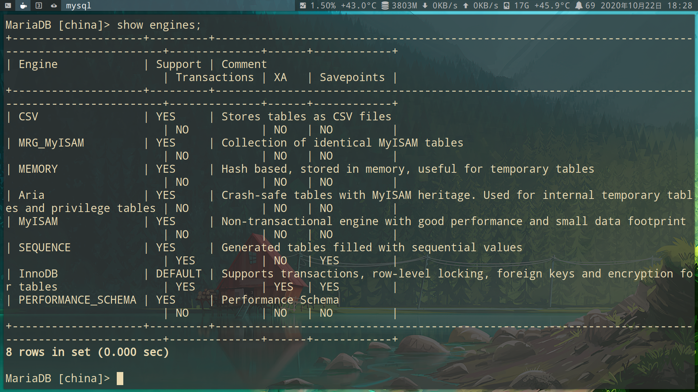

- Mysql

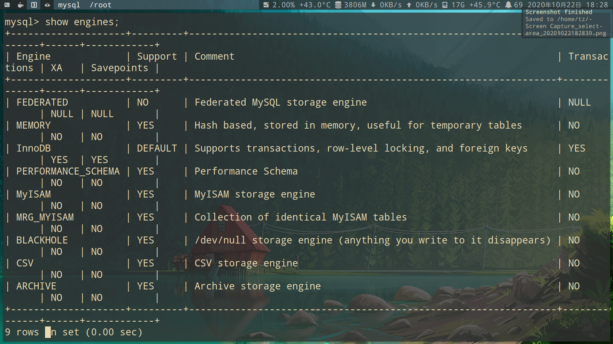

[Centos7 安装 Mysql](#install)

## 基本命令

### 连接数据库

| 参数 | 内容                 |
| ---- | -------------------- |
| -u   | 用户                 |
| -p   | 密码                 |
| -S   | 使用 socks 进行连接  |
| -h   | 连接指定 ip 的数据库 |
| -e   | 执行 shell 命令      |
| -P   | 连接端口             |

```sh
# 首先要连接进数据库
mysql -uroot -pYouPassword

# -h 连接192.168.100.208主机的数据库
mysql -uroot -pYouPassword -h192.168.100.208 -P3306

# -S 使用socket连接(mysql不仅监听3306端口,还监听mysql.sock)
mysql -uroot -pYouPassword -S/tmp/mysql.sock

# -e 可以执行 sql 命令(这里是show databases;)
mysql -uroot -pYouPassword -e "show databases"
```

[如需,连接远程 server 的数据库 (可跳转至用户权限设置)](#user)

### 常用 SQL 命令

在 `linux` 终端输入的命令是 `shell` 命令

而 `SQL` 命令指进入数据库里的命令

- **注意:** SQL 命令后面要加 `;`

- SQL 命令**大小写不敏感** `CREATE` 或 `create` 都可以

- 而表(table)是要**区分大小写**的

```sql
# 创建名为 tz 的数据库
create database tz;

# 查看数据库
show databases;

# 使用tz数据库
use tz;

# 查看tz数据库里的表
show tables;

# 查看 information_scema 数据库里的表
show tables from information_scema;

# 查看数据库状态
show status;

# 查看上一次查询成本(单位:数据页)
show status like 'Last_query_cost'

# 插入次数;
show status like "com_insert%";

# 删除次数;
show status like "com_delete%";

# 查询次数;
show status like "com_select%";

# 服务器运行时间
show status like "uptime";

# 连接次数
show status like 'connections';

# 插入次数;
show status like "com_insert%";

# 删除次数;
show status like "com_delete%";

# 查询次数;
show status like "com_select%";

# 服务器运行时间
show status like "uptime";

# 连接次数
show status like 'connections';

# 查看数据库队列
show processlist;

# 查看数据库保存目录
show variables like 'data%';

# SQL FUNCTION
# 查看当前使用哪个数据库
select database();

# 查看当前登录用户
select user();

# 查看数据库版本
select version();
```

## 下载数据库进行 SQL 语句 学习

```sql
# 连接数据库后,创建china数据库
create database china;
```

```sh
# 下载2019年中国地区表,一共有 783562 条数据
git clone https://github.com/kakuilan/china_area_mysql.git
# 如果网速太慢,使用这条国内通道
git clone https://gitee.com/qfzya/china_area_mysql.git

# 导入表到 china 库
cd china_area_mysql
mysql -uroot -pYouPassward china < cnarea20191031.sql
```

## DQL(查询)

### SELECT

**语法:**

> ```sql
> SELECT 列名称 FROM 表名称
> ```

- 语句顺序为: `FROM` -> `WHERE` -> `SELECT`

---

```sql
# 连接数据库后,进入 china 数据库
use china;

# 查看表 cnarea_2019 的字段(列)
desc cnarea_2019

# 将 cnarea_2019 表改名为 ca ,方便输入
alter table cnarea_2019 rename ca;
# 改回来
alter table ca rename cnarea_2019;

# 从表 cnarea_2019 选取所有列(*表示所有列)
select *
from cnarea_2019;

# 如果刚才将表改成 ca 名,就是以下命令
select *
from ca;

# 从表 cnarea_2019 选取 name 列
select name
from cnarea_2019;

# 从表 cnarea_2019 选取 name 和 id 列
select id,name
from cnarea_2019;

# distinct 过滤重复的数据
select distinct level
from cnarea_2019;

# limit 只显示前2行
select *
from cnarea_2019
limit 2;

# limit 选取所有列,但只显示100到70000行
select * from cnarea_2019
limit 100,70000;

# LEFT() 选取name列, 但只显示前2字符
SELECT LEFT(name, 2)
FROM cnarea_2019

# RIGHT() 选取name列, 但只显示后3字符
SELECT RIGHT(name, 3)
FROM cnarea_2019
```

#### where: 行(元组)条件判断

**语法:**

> ```sql
> SELECT 列名称 FROM 表名称 WHERE 列名称 条件
> ```

---


```sql
# 结尾处加入 \G 以列的方式显示
select * from cnarea_2019
where id=1\G;

MariaDB [china]> select * from cnarea_2019 where id=1\G;
*************************** 1. row ***************************
         id: 1
      level: 0
parent_code: 0
  area_code: 110000000000
   zip_code: 000000
  city_code:
       name: 北京市
 short_name: 北京
merger_name: 北京
     pinyin: BeiJing
        lng: 116.407526
        lat: 39.904030
```

```sql
# 选取 id 小于10的数据
select * from cnarea_2019
where id < 10;

# 选取 10<=id<=30 的数据
select * from cnarea_2019
where id<=30 and id>=10;

# 选取 id 等于10 和 id等于20 的数据
select * from cnarea_2019
where id in (10,20);

# 选取 not null(非空) 和 id 小于 10 的数据
select * from ca
where id is not null
and id < 10;

# 选取 50行到55行的数据
SELECT * FROM cnarea_2019
WHERE id BETWEEN 50 AND 55;
```

#### Order by (排序)

**语法:**

> ```sql
> SELECT 列名称 FROM 表名称 ORDER BY 列名称
> # or
> SELECT 列名称 FROM 表名称 WHERE 列名称 条件 ORDER BY 列名称
> ```

---

```sql
# 以 level 字段进行排序
select * from cnarea_2019
order by level;

# 选取 id<=10 ,以 level 字段进行排序
select * from cnarea_2019
where id<=10
order by level;

# desc 降序
select * from cnarea_2019
where id<=10
order by level desc;

# level 降序,再以 id 顺序显示
select * from cnarea_2019
where id<=10
order by level desc,
id ASC;
```

#### regexp (正则表达式)

```sql
# 选取以 '广州' 开头的 name 字段
select name from cnarea_2019
where name regexp '^广州';

# 选取包含 '广州' 的name 字段
select name from cnarea_2019
where name regexp '.*广州';
```

#### Group by (分组)

- 创建表people, people1

```sql
# 创建表people
create table people(
    `id` int (8) auto_increment,
    `name` varchar(50),
    `salary` varchar(50),
    primary key (`id`)
);

# 插入数据
INSERT INTO people (name, salary) VALUES
('a1','1000'),
('a2','2000'),
('a3','3000'),
('b1','1000'),
('b2','2000'),
('b3','3000'),
('c1','1000'),
('c2','2000'),
('c3','3000');

# 创建表people1
CREATE TABLE people1(
    `id` int (8) AUTO_INCREMENT,
    `name` varchar(50),
    `salary` varchar(50),
    primary key (`id`)
);

# 插入数据
INSERT INTO people1 (name, salary) VALUES
('c1','1000'),
('c2','2000'),
('c3','3000'),
('d', 3000),
(null,'3000'),
('d', null),
(null, null);


# 统计salary(工资)大于1000的人数
SELECT salary, COUNT(salary) FROM people
GROUP BY salary
HAVING salary > 1000;

# 统计salary为1000的人数
SELECT COUNT(name) FROM people
WHERE salary = 1000;
```

##### WITH ROLLUP

```sql
CREATE TABLE sales(
    `id` int (8) AUTO_INCREMENT,
    `name` varchar(50),
    `color` varchar(50),
    `quantitty` int (8),
    primary key (`id`)
);

# 插入数据
INSERT INTO sales (name, color, quantitty) VALUES
('shirt', 'black', 10),
('shirt', 'white', 8),
('shirt', 'red', 1),
('dress', 'black', 9),
('dress', 'white', 10),
('dress', 'red', 5),
('skirt', 'black', 1),
('skirt', 'white', 5),
('skirt', 'red', 5);

# name
SELECT name, SUM(quantitty) FROM sales
GROUP BY name

# color
SELECT color, SUM(quantitty) FROM sales
GROUP BY color

# WITH ROLLUP 统计每个颜色的销售数量,以及总量
SELECT name, color, SUM(quantitty) FROM sales
GROUP BY color, name
WITH ROLLUP

+--------+--------+----------------+
| name   | color  | SUM(quantitty) |
+--------+--------+----------------+
| dress  | black  | 9              |
| shirt  | black  | 10             |
| skirt  | black  | 1              |
| <null> | black  | 20             |
| dress  | red    | 5              |
| shirt  | red    | 1              |
| skirt  | red    | 5              |
| <null> | red    | 11             |
| dress  | white  | 10             |
| shirt  | white  | 8              |
| skirt  | white  | 5              |
| <null> | white  | 23             |
| <null> | <null> | 54             |
+--------+--------+----------------+

# name 统计每个品类的销售数量, 以及总量
SELECT name, color, SUM(quantitty) FROM sales
GROUP BY name, color
WITH ROLLUP

+--------+--------+----------------+
| name   | color  | SUM(quantitty) |
+--------+--------+----------------+
| dress  | black  | 9              |
| dress  | red    | 5              |
| dress  | white  | 10             |
| dress  | <null> | 24             |
| shirt  | black  | 10             |
| shirt  | red    | 1              |
| shirt  | white  | 8              |
| shirt  | <null> | 19             |
| skirt  | black  | 1              |
| skirt  | red    | 5              |
| skirt  | white  | 5              |
| skirt  | <null> | 11             |
| <null> | <null> | 54             |
+--------+--------+----------------+
```
#### 子查询

##### IN, NOT IN

- `()`: 表示集合

- `IN`: 判断在集合中的字段

- `NOT IN`: 判断不在集合中的字段

```sql
# IN
SELECT * FROM people
WHERE salary IN (1000, 3000);

# NOT IN
SELECT * FROM people
WHERE salary NOT IN (1000, 3000);

# 子查询1000工资的人
SELECT name FROM people
WHERE name IN
    (SELECT name FROM people
    WHERE salary = 1000);
# 等同于以上
SELECT name FROM people
WHERE name IN ('a1', 'b1', 'c1');

+------+
| name |
+------+
| a1   |
| b1   |
| c1   |
+------+
```

##### 标量子查询

> 可以出现在 `SELECT`, `HAVING`, `WHERE`

```sql
SELECT id, name,
    (SELECT count(*) FROM people1)
    AS count_people1
FROM people

+----+------+---------------+
| id | name | count_people1 |
+----+------+---------------+
| 1  | a1   | 7             |
| 2  | a2   | 7             |
| 3  | a3   | 7             |
| 4  | b1   | 7             |
| 5  | b2   | 7             |
| 6  | b3   | 7             |
| 7  | c1   | 7             |
| 8  | c2   | 7             |
| 9  | c3   | 7             |
+----+------+---------------+
```

##### 关量子查询

```sql
# IN()函数子查询
SELECT * FROM people WHERE id IN
(SELECT id FROM people1
WHERE id > 5);

# 使用关联子查询代替以上IN函数子查询.结果一样, 效率更高
SELECT * FROM people WHERE EXISTS
(SELECT * FROM people1
WHERE id > 5
AND people.id = people1.id);

+----+------+--------+
| id | name | salary |
+----+------+--------+
| 6  | b3   | 3000   |
| 7  | c1   | 1000   |
+----+------+--------+
```

##### with(临时表)

```sql
# 创建临时表p
WITH p (name, salary) AS
    (SELECT name, salary FROM people)
SELECT * FROM p

# with 实现people, people1的内连接
WITH p (id, name) AS
    (SELECT id, name FROM people),
    p1 (id, name) AS
    (SELECT id, name FROM people1)
SELECT * FROM p, p1
    WHERE p.id = p1.id;

# 等同于以上
SELECT p.id, p.name, p1.id, p1.name
FROM people as p
INNER JOIN people1 as p1
ON p.id = p1.id;

+----+------+----+--------+
| id | name | id | name   |
+----+------+----+--------+
| 1  | a1   | 1  | c1     |
| 2  | a2   | 2  | c2     |
| 3  | a3   | 3  | c3     |
| 4  | b1   | 4  | d      |
| 5  | b2   | 5  | <null> |
| 6  | b3   | 6  | d      |
| 7  | c1   | 7  | <null> |
+----+------+----+--------+
```

#### 集合操作

> 默认去除重复行

##### UNION(并操作)

```sql
SELECT name FROM people
UNION
SELECT name FROM people1

+--------+
| name   |
+--------+
| a1     |
| a2     |
| a3     |
| b1     |
| b2     |
| b3     |
| c1     |
| c2     |
| c3     |
| d      |
| <null> |
+--------+

# UNION ALL保留重复行
SELECT name FROM people
UNION ALL
SELECT name FROM people1
```

##### EXCEPT(差操作)

> 从左边的集合去除右边的集合

```sql
# people表去除people1表的重复行

SELECT name FROM people
EXCEPT
SELECT name FROM people1

+------+
| name |
+------+
| a1   |
| a2   |
| a3   |
| b1   |
| b2   |
| b3   |
+------+
```

##### INTERSECT(交操作)

```sql
SELECT name FROM people
INTERSECT
SELECT name FROM people1

+------+
| name |
+------+
| c1   |
| c2   |
| c3   |
+------+
```

#### 聚集函数(aggregation)

**语法**

> ```sql
> SELECT function(列名称) FROM 表名称
> ```

##### 基本聚集函数

| 聚集函数             | 操作                  |
|----------------------|-----------------------|
| MAX()                | 最大值                |
| MIN()                | 最小值                |
| SUM()                | 总值                  |
| AVG()                | 平均值                |
| COUNT(1)             | 总行数,等同于COUNT(*) |
| COUNT(DISTINCT name) | 总行数,去除重复行       |

```sql
# MAX(), MIN()
SELECT MAX(id),MIN(level) as max
FROM cnarea_2019;

# 选取 level 的平均值和 id 的总值
SELECT SUM(id),AVG(level)
from ca;

# 查看总列数
SELECT COUNT(1) as name from cnarea_2019;

# 统计 level 的个数
SELECT COUNT(DISTINCT level) as totals from cnarea_2019;
```

##### 加密函数

```sql
select md5('123');

# 保留两位小数
select format(111.111,2);

# 加锁函数
select get_lock('lockname',10);
select is_free_lock('lockname');
select release_lock('lockname');
```

##### rank(): 排名

- `rank() OVER (ORDER BY salary)`

- `rank() OVER (ORDER BY salary nulls last)`

```sql
SELECT name, salary,
rank() OVER (ORDER BY salary DESC) AS salary_rank
FROM people
# or
SELECT name, salary, (1 + (SELECT COUNT(*)
                      FROM people1 AS B
                      WHERE B.salary > A.salary)) AS salary_rank
FROM people as A
ORDER BY salary_rank

+------+--------+-------------+
| name | salary | salary_rank |
+------+--------+-------------+
| c3   | 3000   | 1           |
| b3   | 3000   | 1           |
| a3   | 3000   | 1           |
| c2   | 2000   | 4           |
| b2   | 2000   | 4           |
| a2   | 2000   | 4           |
| a1   | 1000   | 7           |
| c1   | 1000   | 7           |
| b1   | 1000   | 7           |
+------+--------+-------------+

# rank()对相等的值, 赋予相等的排名. 加上name字段让排名不相等

SELECT name, salary,
rank() OVER (ORDER BY salary, name desc) AS salary_rank
FROM people

+------+--------+-------------+
| name | salary | salary_rank |
+------+--------+-------------+
| c1   | 1000   | 1           |
| b1   | 1000   | 2           |
| a1   | 1000   | 3           |
| c2   | 2000   | 4           |
| b2   | 2000   | 5           |
| a2   | 2000   | 6           |
| c3   | 3000   | 7           |
| b3   | 3000   | 8           |
| a3   | 3000   | 9           |
+------+--------+-------------+
```

##### 分窗

```sql
CREATE TABLE class(
    `id` int (8) AUTO_INCREMENT,
    `score` int (8),
    `year`  int (8),
    primary key (`id`)
);

# 插入数据
INSERT INTO class (score, year) VALUES
(90, 2013),
(80, 2012),
(70, 2011),
(60, 2010),
(50, 2009),
(40, 2008),
(30, 2007),
(20, 2006),
(10, 2005);

# 累加. 9代表最大计算9行, 如果有第10行,则只会计算2到10行
SELECT score, year,
SUM(score) OVER (order by score rows 9 preceding) AS score_sum
FROM class;
# or使用unbounded
SELECT score, year,
SUM(score) OVER (order by score rows unbounded preceding) AS score_sum
FROM class;

+-------+------+-----------+
| score | year | score_sum |
+-------+------+-----------+
| 10    | 2005 | 10        |
| 20    | 2006 | 30        |
| 30    | 2007 | 60        |
| 40    | 2008 | 100       |
| 50    | 2009 | 150       |
| 60    | 2010 | 210       |
| 70    | 2011 | 280       |
| 80    | 2012 | 360       |
| 90    | 2013 | 450       |
+-------+------+-----------+

# 平均数
SELECT score, year,
AVG(score) OVER (order by score rows 9 preceding) AS score_avg
FROM class;

+-------+------+------------+
| score | year | score_avg  |
+-------+------+------------+
| 10    | 2005 | 10.0000    |
| 20    | 2006 | 15.0000    |
| 30    | 2007 | 20.0000    |
| 40    | 2008 | 25.0000    |
| 50    | 2009 | 35.0000    |
| 60    | 2010 | 45.0000    |
| 70    | 2011 | 55.0000    |
| 80    | 2012 | 65.0000    |
| 90    | 2013 | 75.0000    |
+-------+------+------------+

# following 显示2行之后的值
SELECT score, year,
SUM(score) OVER (order by score rows between 9 preceding and 2 following) AS score_sum
FROM class;

+-------+------+-----------+
| score | year | score_sum |
+-------+------+-----------+
| 10    | 2005 | 60        |
| 20    | 2006 | 100       |
| 30    | 2007 | 150       |
| 40    | 2008 | 210       |
| 50    | 2009 | 280       |
| 60    | 2010 | 360       |
| 70    | 2011 | 450       |
| 80    | 2012 | 450       |
| 90    | 2013 | 450       |
+-------+------+-----------+

# FIELD() 指定score列值, 不进行ORDER BY
SELECT * FROM class
ORDER BY FIELD (score, 90, 70)

+----+-------+------+
| id | score | year |
+----+-------+------+
| 29 | 80    | 2012 |
| 31 | 60    | 2010 |
| 32 | 50    | 2009 |
| 33 | 40    | 2008 |
| 34 | 30    | 2007 |
| 35 | 20    | 2006 |
| 36 | 10    | 2005 |
| 28 | 90    | 2013 |
| 30 | 70    | 2011 |
+----+-------+------+
```

### JOIN(关联查询): 改变表关系

**语法:**

> ```sql
> SELECT 列名称
> FROM 表名称1
> INNER JOIN 表名称2
> ON 表名称1.列名称=表名称2.列名称
> ```

---

```sql
# 创建表j
CREATE TABLE j(
    id   int (8),
    name varchar(50) NOT NULL UNIQUE,
    date DATE
);

# 插入数据
insert into j (id,name,date) values
(1,'tz1','2020-10-24'),
(10,'tz2','2020-10-24'),
(100,'tz3','2020-10-24');

# 查看结果
select * from j;
+------+------+------------+
| id   | name | date       |
+------+------+------------+
| 1   | tz1 | 2020-10-24 |
| 10  | tz2 | 2020-10-24 |
| 100 | tz3 | 2020-10-24 |
+------+------+------------+
```

#### INNER JOIN(内连接)

- people表

```sql
# INNER JOIN
SELECT * FROM people INNER JOIN people1
ON people.id = people1.id;
# JOIN
SELECT * FROM people JOIN people1
ON people.id = people1.id;
# or
SELECT * FROM people, people1
WHERE people.id = people1.id;

+----+------+--------+----+--------+--------+
| id | name | salary | id | name   | salary |
+----+------+--------+----+--------+--------+
| 1  | a1   | 1000   | 1  | c1     | 1000   |
| 2  | a2   | 2000   | 2  | c2     | 2000   |
| 3  | a3   | 3000   | 3  | c3     | 3000   |
| 4  | b1   | 1000   | 4  | d      | 3000   |
| 5  | b2   | 2000   | 5  | <null> | 3000   |
| 6  | b3   | 3000   | 6  | d      | <null> |
| 7  | c1   | 1000   | 7  | <null> | <null> |
+----+------+--------+----+--------+--------+
```

- cnarea_2019表

```sql
# 选取 j 表的 id,name,date 字段以及 cnarea_2019 表的 name 字段
select j.id,j.date,cnarea_2019.name
from j,cnarea_2019
where cnarea_2019.id=j.id;

# 或者
select j.id,j.name,j.date,cnarea_2019.name
from j inner join  cnarea_2019
on cnarea_2019.id=j.id;

+------+------+------------+--------------------------+
| id   | name | date       | name                     |
+------+------+------------+--------------------------+
|    1 | tz1  | 2020-10-24 | 北京市                   |
|   10 | tz2  | 2020-10-24 | 黄图岗社区居委会         |
|  100 | tz3  | 2020-10-24 | 安德路社区居委会         |
+------+------+------------+--------------------------+
```

##### STRAIGHT_JOIN

- 和 `inner join` 语法,结果相同,只是左表总是在右表之前读取

- 因为 `Nest Loop Join` 的算法,用更小的数据表驱动更大数据表,**更快**.

```sql
# 先读取 j 再读取 cnarea_2019 或者说 驱动表是j 被驱动表是cnarea_2019.
# 因为 j 表的数据更小所以更快
select j.id,j.name,j.date,cnarea_2019.name
from j straight_join cnarea_2019
on j.id=cnarea_2019.id;
```

#### LEFT JOIN(左连接)

```sql
# 左连接,以左表(j)id 字段个数进行选取.所以结果与inner join一样
select j.id,j.name,j.date,cnarea_2019.name
from j left join  cnarea_2019
on cnarea_2019.id=j.id;

+------+------+------------+--------------------------+
| id   | name | date       | name                     |
+------+------+------------+--------------------------+
|    1 | tz1  | 2020-10-24 | 北京市                   |
|   10 | tz2  | 2020-10-24 | 黄图岗社区居委会         |
|  100 | tz3  | 2020-10-24 | 安德路社区居委会         |
+------+------+------------+--------------------------+

# 插入一条高于 cnarea_2019表id最大值 的数据
insert into j (id,name,date) value
(10000000,'tz一百万','2020-10-24');

# 再次左连接,因为 cnarea_2019 没有id 10000000(一百万)的数据,所以这里显示为 null

select j.id,j.name,j.date,cnarea_2019.name
from j left join cnarea_2019
on j.id = cnarea_2019.id;

+----------+-------------+------------+--------------------------+
| id       | name        | date       | name                     |
+----------+-------------+------------+--------------------------+
|        1 | tz1         | 2020-10-24 | 北京市                   |
|       10 | tz2         | 2020-10-24 | 黄图岗社区居委会         |
|      100 | tz3         | 2020-10-24 | 安德路社区居委会         |
| 10000000 | tz一百万    | 2020-10-24 | NULL                     |
+----------+-------------+------------+--------------------------+
```

#### RIGHT JOIN(左连接)

```sql
# 右连接,以右表(cnarea_2019)id字段个数进行选取.左表id没有的数据为null.因为cnarea_2019表数据量太多这里limit 10

select j.id,j.date,cnarea_2019.name,cnarea_2019.pinyin
from j right join cnarea_2019
on j.id=cnarea_2019.id
limit 10;

+------+------------+--------------------------+-------------+
| id   | date       | name                     | pinyin      |
+------+------------+--------------------------+-------------+
|    1 | 2020-10-24 | 北京市                   | BeiJing     |
|   10 | 2020-10-24 | 黄图岗社区居委会         | HuangTuGang |
|  100 | 2020-10-24 | 安德路社区居委会         | AnDeLu      |
| NULL | NULL       | 直辖区                   | BeiJing     |
| NULL | NULL       | 东城区                   | DongCheng   |
| NULL | NULL       | 东华门街道               | DongHuaMen  |
| NULL | NULL       | 多福巷社区居委会         | DuoFuXiang  |
| NULL | NULL       | 银闸社区居委会           | YinZha      |
| NULL | NULL       | 东厂社区居委会           | DongChang   |
| NULL | NULL       | 智德社区居委会           | ZhiDe       |
+------+------------+--------------------------+-------------+
```

#### FULL OUTER JOIN(全连接)

```sql
# 如果mysql不支持 full outer,可以使用 union
SELECT * FROM new LEFT JOIN cnarea_2019 ON new.id = cnarea_2019.id

UNION

SELECT * FROM new RIGHT JOIN cnarea_2019 ON new.id =cnarea_2019.id;
```

## 查询优化

- 把查询看作是一个任务, 它由多个子任务构成, 优化方法如下:

    - 1.优化子任务的响应时间

    - 2.减少子任务数量

- 查询慢的原因往往是访问的数据太多:

    - 1.查询了不需要的数据:

        - 查询大量的数据, 但只使用少量的数据

    - 2.使用了语句`SELECT *` 查询了所有列, 特别是连接多个表还查询所有列

- 慢查询日志记录以下3个指标:

    - 1.响应时间(最重要的指标, 查询优化实际指减少查询的响应时间):

        - 排队时间:等待某些资源的时间, 如等待io, 等待锁...

        - 服务时间:真正花费的时间

    - 2.扫描行数

        <span id="#explain-type"></span>
        - 访问类型(`EXPLAIN` 的`type` 字段):访问类型决定了访问的快慢和访问的行数

            - 以下`type`的排列顺序为, 从慢到快, 从行数多到少:

                - ALL(全表)-> index(索引)-> range(范围)-> ref(唯一性索引)-> const(常数:单个值)

    - 3.返回行数

        - `EXPLAIN` 的`Extra` 字段为`Using where`时:表示从返回的数据过滤不匹配的记录

### 查询过程

- 查询过程:

    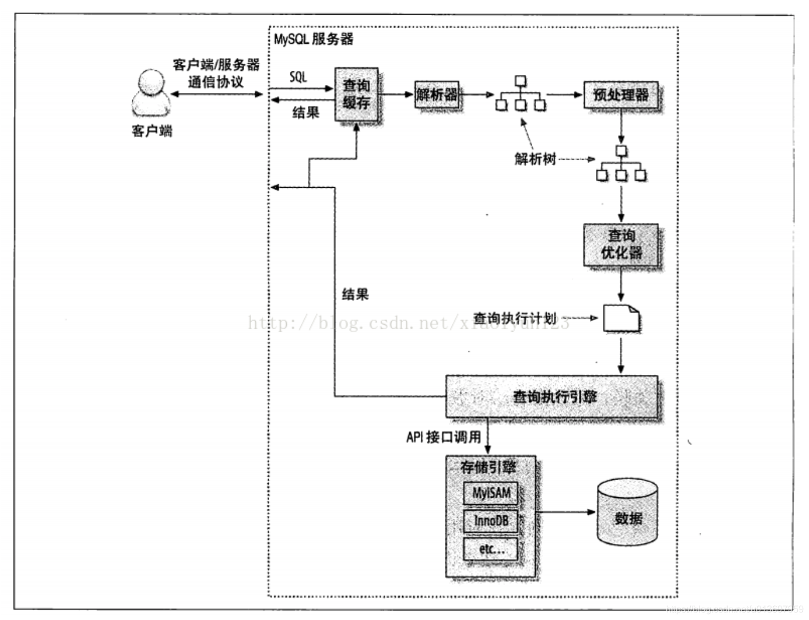

    - 1.client发送查询给server

        - mysql的client/server协议是**半双工**, 要么server 发送 client, 要么client 发送 server

            - client 发送一个数据包给 server

            - server 返回多个数据包给 client

                - server会将查询结果缓存至内存, 全部数据包返回客户端后, 才释放

            - `max_allowed_packet` 变量可设置数据包大小

    - 2.server检查查询缓存, 如果命中返回结果给client, 否则进入下一个阶段

    - 3.进入SQL解析器, 预处理, 优化器生成执行计划

        - 如果出现任何错误(如语法错误), 都可能会终止查询

        - 1.SQL解析器:生成解析树

        - 1.预处理器:检测权限

    - 4.根据执行计划, 调用存储引擎API查询

        - 优化器会预测并选择成本最低的执行计划

            - 需要向存储引擎获取统计信息

            - 动态优化:根据查询上下文, where的条件值等

                - 静态优化:不依赖查询上下文

            - 有很多原因会导致优化器选择错误的执行计划

            - 不要自以为比优化器聪明

        - 优化类型:

            - 重新排序连接表的顺序

            - `IN()`函数代替`OR`子句: IN()的时间复杂度是log n; OR的时间复杂度是n

        - `last_query_cost` 变量表示上一次查询大概需要随机页查找.这里为10个数据页

            ```sql
            SHOW STATUS LIKE 'last_query_cost';
            +-----------------+-----------+
            | Variable_name | Value |
            +-----------------+-----------+
            | Last_query_cost | 10.499000 |
            +-----------------+-----------+
            ```

    - 5.返回结果给client

### 查询中的JOIN(关联查询)

- mysql认为每一次查询都是一次join

    - 以下查询会先将单个查询结果放到临时表(旧版的mysql临时表没有索引)中, 再读取临时表进行join

        - 1.`UNION` 查询

            - UNION + LIMIT语句优化

            ```sql
            -- 两个表的所有行, 放入同一临时表内, 再取出前5条记录
            (SELECT * FROM people)
            UNION ALL
            (SELECT * FROM people1)
            LIMIT 5

            -- 两个表的前5行, 放入同一临时表内(只包含10条记录), 再取出前5条记录
            (SELECT * FROM people LIMIT 5)
            UNION ALL
            (SELECT * FROM people1 LIMIT 5)
            LIMIT 5
            ```

        - 2.子查询

### COUNT()函数优化

- 查询大量的数据, 但只使用少量的数据:

    ```sql
    -- 共扫描9行, 只获取2行
    SELECT COUNT(*) FROM people
    WHERE ID > 7;

    -- 优化:通过总行数减去多数行
    SELECT (SELECT COUNT(*) FROM people) - COUNT(*) FROM people
    WHERE ID <= 7;
    ```

- 使用`EXPLAIN` 获取扫描行数的近似值, 并不是所有业务都需要精确的COUNT()值, 如谷歌的搜索结果:

    ```sql
    EXPLAIN SELECT COUNT(*) FROM people\G;
    ```

- 使用COUNT()代替SUM():
    ```sql
    SELECT SUM(salary = 1000),
    SUM(salary = 2000) FROM people;

    -- 使用COUNT()代替SUM()
    SELECT COUNT(salary = 1000 or null),
    COUNT(salary = 2000 or null) FROM people;
    ```

### 延迟关联

- 通过子查询查找覆盖索引的字段. 这叫作延迟关联(deferred join)

- `LIMIT 50, 5`:需要查询55条记录, 但只返回最后5条, 前50条被抛弃
    ```sql
    SELECT * FROM cnarea_2019 LIMIT 50, 5;

    -- 延迟关联进行优化
    SELECT * FROM cnarea_2019
    INNER JOIN
    (SELECT id FROM cnarea_2019 LIMIT 50, 5)
    as lim USING(id);
    ```

### hint(优化器提示)

- 不要自以为比优化器聪明

    - mysql版本升级后, 优化器提示可能会失效

| 语句           | 操作                             |
|----------------|----------------------------------|
| STRAINGHT_JOIN | 按照语句的顺序进行join(关联查询) |

### [松散索引(loose index scan)](http://mysqlserverteam.com/what-is-the-scanning-variant-of-a-loose-index-scan/)

- 松散索引:
    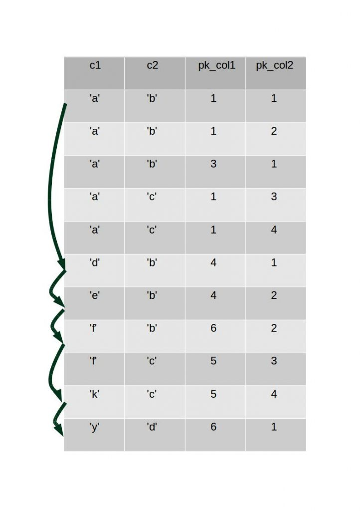

- 非松散索引:
    

- `EXPLAIN` 的`Extra` 字段为`Using index for group-by`:表示使用了松散索引
    - 在`GROUP BY` 分组中查询最大, 最小值可以使用松散索引
    ```sql
    -- 创建索引
    CREATE INDEX salary ON people(salary)

    EXPLAIN SELECT salary, MAX(id)
    FROM people
    GROUP BY salary\G

    ***************************[ 1. row ]***************************
    id            | 1
    select_type   | SIMPLE
    table         | people
    type          | range
    possible_keys | <null>
    key           | salary
    key_len       | 203
    ref           | <null>
    rows          | 10
    Extra         | Using index for group-by
    ```

### 自定义变量

- 自定义变量几乎可以在任何表达式上使用

    - 不能在常量的地方使用, 如LIMIT, 表名, 列名

    ```sql
    -- 定义变量
    SET @avg_people := (SELECT AVG(id) FROM people);

    -- 在查询中使用变量
    SELECT * FROM people1
    WHERE ID > @avg_people;
    ```

- 避免重复查询刚更新的数据:

    ```sql
    UPDATE index_test SET date = NOW()
    WHERE last_name = '王';
    SELECT * FROM index_test;

    -- 将修改的值定义为变量. 虽然依然是2次查询, 但第2次无需访问数据表, 因此更快
    UPDATE index_test SET date = NOW()
    WHERE last_name = '王'
    AND @now :=NOW();
    SELECT @now;
    ```

- SELECT 和 WHERE 子句是在不同阶段执行的, 因此变量也不一样

    ```sql
    SET @rownum = 0;
    SELECT *, @rownum := @rownum + 1 FROM people
    WHERE @rownum <= 1;

    +----+------+--------+------------------------+
    | id | name | salary | @rownum := @rownum + 1 |
    +----+------+--------+------------------------+
    | 1  | a1   | 1000   | 1                      |
    | 2  | a2   | 2000   | 2                      |
    +----+------+--------+------------------------+

    SET @rownum = 0;
    SELECT *, @rownum FROM people
    WHERE (@rownum := @rownum + 1) <= 1;

    +----+------+--------+---------+
    | id | name | salary | @rownum |
    +----+------+--------+---------+
    | 1  | a1   | 1000   | 1       |
    +----+------+--------+---------+
    ```

## DML (增删改操作)

- 有的地方把 DML 语句(增删改)和 DQL 语句(查询)统称为 DML 语句

### CREATE(创建)

**语法:**

> ```sql
> CREATE TABLE 表名称
> # 注意:列属性可添加和不添加,并且不区分大小写
> (
>   列名称1 数据类型 列属性,
>   列名称2 数据类型 列属性,
>   列名称3 数据类型 列属性,
> ....
> )
> ```

#### 数据类型


- 不同的存储引擎,有不同的实现

- mysql不支持自定义数据类型

- 最好指定为`NOT NULL`, 除非真需要存储 `NULL`

- 选择存储最小的数据类型

- INT(整数):

    | 类型      | 位数 |
    |-----------|------|
    | TINYINT   | 8位  |
    | SMALLINT  | 16位 |
    | MEDIUMINT | 24位 |
    | INT       | 32位 |
    | BIGINT    | 64位 |

    - 宽度 `INT(1)` 和 `INT(20)` 的存储和计算是一样的

    - 整型比字符串的 CPU 操作更低

    - 使用整数保存ip地址

        - ipv4通过`INET_ATON()`, `INET_NTOA()` 函数进行转换. `IS_IPV4()`判断是否为ipv4地址

        - ipv6通过`INET6_ATON()`, `INET6_NTOA()` 函数进行转换. `IS_IPV6()`判断是否为ipv6地址

        ```sql
        CREATE TABLE ipv4_test(
            ipv4 TINYINT UNSIGNED
        );

        INSERT INTO ipv4_test VALUES
        (INET_ATON('192.168.1.1'));

        SELECT INET_NTOA(ipv4) FROM ipv4_test;

        SELECT IS_IPV4(ipv4) FROM ipv4_test;
        ```

- FLOAT(浮点):

    | 类型    | 位数     |
    |---------|----------|
    | FLOAT   | 32位     |
    | DOUBLE  | 64位     |
    | DECIMAL | 存储格式 |

    - `FLOAT` 和 `DOUBLE` 并不精确, 在财务数据里像0.01的值, 并不能精确表示

    - 使用`DECIMAL(m, d)` m为总位数(范围:1到65位), d为小数点右边的位数

        - 计算时会转换为`DOUBLE` 类型

        ```sql
        CREATE TABLE decimal_test(
            data DECIMAL(6, 4) NOT NULL
        );

        INSERT INTO decimal_test VALUES
        (0.99999);
        ```

        - 超过d的位数, 会四舍五入.以下为0.0600

            ```sql
            INSERT INTO decimal_test VALUES
            (0.059999);
            ```

- TIMEMESTAMP, DATATIME(日期时间)

    | 类型    | 位数     |
    |---------|----------|
    | TIMESTAMP   | 32位     |
    | DATATIME  | 64位     |

    - `TIMEMESTAMP` 和 unix 时间相同,从 '1970-01-01 00:00:01' UTC -> '2038-01-19 03:14:07' UTC

    - `DATATIME` 从 1001 - 9999 年

    - 因尽量使用`TIMEMESTAMP`类型

        ```sql
        CREATE TABLE time_test(
            ts TIMESTAMP,
            dt DATETIME
        );

        INSERT INTO time_test VALUES
        ('2021-7-3 13:40:30', '2021-7-3 13:40:30'),
        (NOW(), NOW());
        ```

    - 如果超过unix时间就会报错

        ```sql
        INSERT INTO time_test(ts) VALUES
        ('2038-7-3 13:40:30');
        ```

        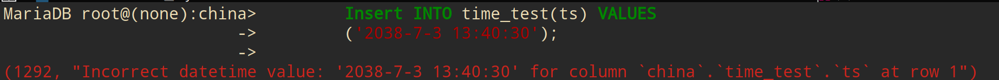

- BIT(位):

    - BIT(1): 一个位; 最大BIT(64): 64个位

    - BIT()的存储需要最小整数类型

        - BIT(17) 需要存储在24个位的MEDIUMINT类型

    - 插入57的二进制数, 由于57的ASCII码为字符9, 因此显示为字符9

        ```sql
        CREATE TABLE bit_test(
            b bit(8)
        );

        INSERT INTO bit_test VALUES
        (b'00111001');

        SELECT b, b+0 FROM bit_test
        ```

        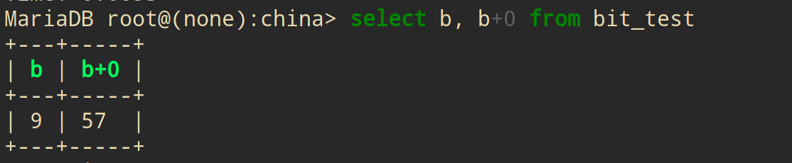

        - 因此应该谨慎使用BIT类型

    - 如果需要存储true/false值, 可以使用`char(0)`类型, 值为`NULL`, `''`(长度为0的空字符串)

        ```sql
        CREATE TABLE tf_test(
            tf char(0)
        );

        - ''为空字符串
        INSERT INTO tf_test VALUES
        (NULL),
        ('');

        SELECT * FROM tf_test
        ```
        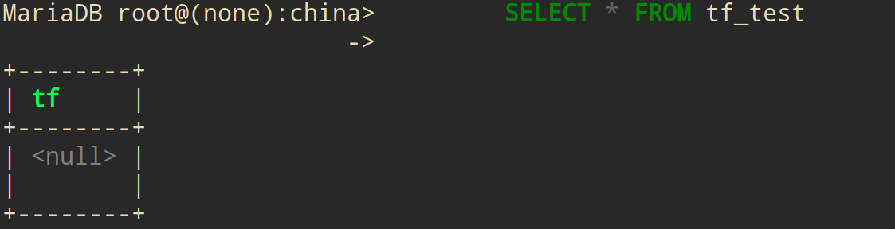

- SET:

    - 可以存储多个true/false值

    - set添加或删除字符串需要执行`ALTER TABLE` 操作

        - [快速ALTER TABLE](#alter_frm)

    ```sql
    CREATE TABLE set_test(
        acl SET('READ', 'WRITE', 'DELETE')
    );

    - 注意:中间不能有空格'READ, WRITE'
    INSERT INTO set_test VALUES
    ('READ,WRITE'),
    ('WRITE,DELETE');

    - FIND_IN_SET() 查找带有'WRITE'行
    SELECT * FROM set_test
    WHERE FIND_IN_SET('WRITE',acl)
    ```

    - 使用整数存储

        ```sql
        SET @READ   := 1<<0,
            @WRITE  := 1<<1,
            @DELETE := 1<<2;

        CREATE TABLE set_int_test(
            acl TINYINT DEFAULT 0
        );

        INSERT INTO set_int_test VALUES
        (@READ + @WRITE),
        (@WRITE + @DELETE);

        SELECT * FROM set_int_test WHERE acl & @READ;
        ```
        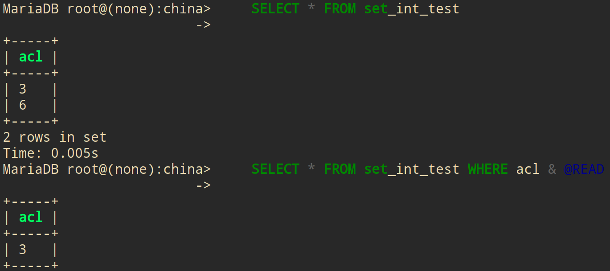

- 字符串:

    - VARCHAR:

      - 可变长度,需要额外记录长度

        - 当长度 <= 255 时,需要 1 个字节

        - 当长度 > 255 时,需要 2 个字节

        - `varchar(1)`,需要 2 个字节

        - `varchar(256)`,需要 258 个字节

        - 如果update字符串, 页不能容纳update后的大小, innodb就会分裂页

    - CHAR:

      - 定长字符串,不容易产生碎片

        - 适合存储 MD5 这些定长值

    - char类型会删除末尾的空格, 而varchar则不会

        ```sql
        CREATE TABLE char_test(
            char_col CHAR(10),
            varchar_col VARCHAR(10)
        );

        INSERT INTO char_test(char_col, varchar_col) VALUES
            (' string', ' string1'),
            (' string ', ' string1 ');

        - CONCAT()函数连接字符串, 以下命令为连接单引号''
        SELECT CONCAT("'", char_col, varchar_col, "'")
        FROM char_test;
        ```

        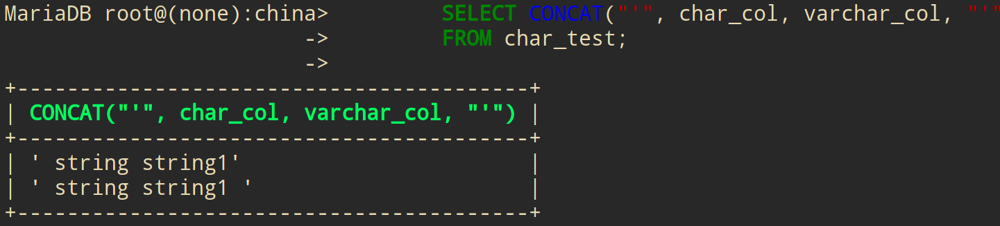


    - BINARY, VARBINARY类似于CHAR, VARCHAR

        - 使用BINARY(16)保存uuid

            - 通过`UNHEX()`, `HEX()` 函数进行转换

            ```sql
            CREATE TABLE uuid_test(
                uuid BINARY(16)
            );

            INSERT INTO uuid_test VALUES
            (UNHEX('FDFE0000000000005A55CAFFFEFA9089'));

            SELECT HEX(uuid) FROM uuid_test;
            ```

    - TEXT(字符串), BLOB(二进制字符串):

        - TEXT使用两个字节存储字符串大小

        - 一个字符大小为一个字节

        | TEXT类型     | BLOB类型     | 大小                     |
        | ------------ | ------------ | ------------------------ |
        | TINYTEXT     | TINYBLOB     | 255字节                  |
        | TEXT         | BLOB         | 65536字节(64K)           |
        | MEDIUMTEXT   | MEDIUMBLOB   | 16,777,215字节(16M)      |
        | LONGTEXT     | LONGBLOB     | 4,294,967,295 字节(4G)   |

        - BLOB:没有排序规则和字符集, 用于图片, 视频存储

        - 尽量避免使用TEXT, BLOB类型

        - 不能把全部字符用作索引, 只能索引字符的部分前缀

    - EMUM(枚举):

        ```sql
        CREATE TABLE emum_test(
            emum_col ENUM('xiaomi', 'huawei', 'meizu')
        );

        INSERT INTO emum_test(emum_col) VALUES
            ('huawei'),
            ('meizu'),
            ('xiaomi');

        SELECT emum_col FROM emum_test;
        SELECT emum_col + 0 FROM emum_test;
        ```

        - 实际存储的是整数, 而不是字符串, 因此查询需要进行字符串转换, 有额外开销

            - 与varchar连接varchar相比: emum连接emum要快很多, 而emum连接varchar要慢很多

        - emum添加或删除字符串需要执行`ALTER TABLE` 操作

            - [快速ALTER TABLE](#alter_frm)

        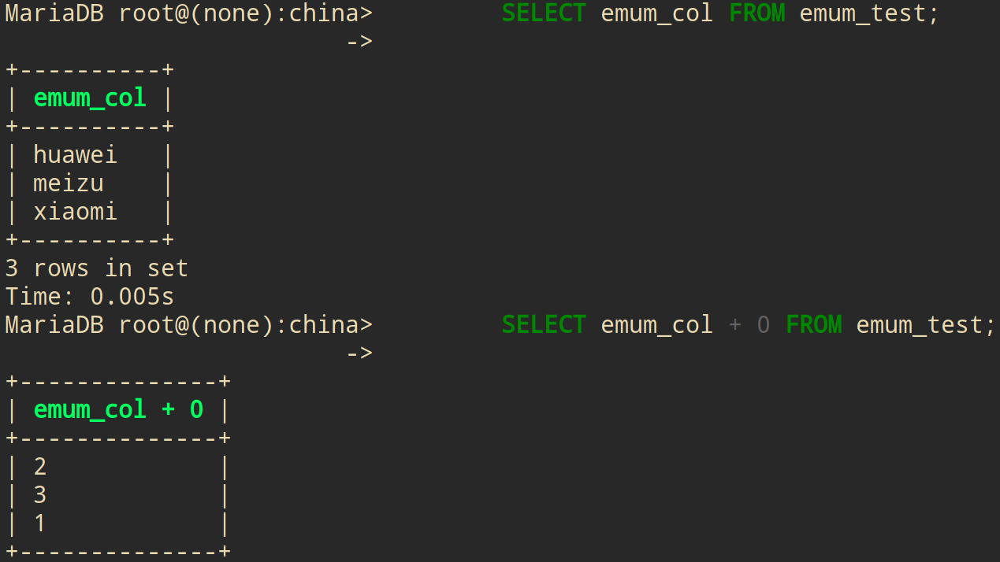

#### 列字段完整性约束

- NOT NULL(值不能为空)

  - NULL 很难优化

- UNIQUE 唯一性索引

  > - 列(字段) 内的数据不能出现重复

    - PRIMARY KEY ( `列名称` ) 设置主键
      > - 和 UNIQUE(唯一性索引) 一样.列(字段) 内的数据不能出现重复
      >
      > - 主键一定是唯一性索引,唯一性索引并不一定就是主键.
      >
      > - 主键列不允许空值,而唯一性索引列允许空值.

- CHECK

    - 列字段的值必须满足条件

    - 复杂的CHECK

        - `CHECK (col in (select * from table_name))`

#### 基本使用

```sql
# 创建 new 数据库设置 id 为主键,不能为空,自动增量
CREATE TABLE new(
    `id` int (8) AUTO_INCREMENT,            # AUTO_INCREMENT 自动增量(每条新记录递增 1)
    `name` varchar(50) NOT NULL UNIQUE,     # NOT NULL 设置不能为空 # UNIQUE 设置唯一性索引
    `date` DATE DEFAULT '2020-10-24',       # DEFAULT 设置默认值
    INDEX date(date),                       # INDEX 创建索引
    PRIMARY KEY (`id`),                     # 设置主健为 id 字段(列)
    CHECK (name in ('tz', 'tz1', 'tz2'))    # CHECK 设置name必须满足in内的集合
)ENGINE=InnoDB DEFAULT CHARSET=utf8mb4; # 编码为 utf8mb4 .因为utf-8,不是真正的utf-8 显示 emoj 会报错

# desc 查看 new 表里的字段
desc new;
+-------+-------------+------+-----+------------+----------------+
| Field | Type        | Null | Key | Default    | Extra          |
+-------+-------------+------+-----+------------+----------------+
| id   | int(8)      | NO  | PRI | <null>     | auto_increment |
| name | varchar(50) | NO  | UNI | <null>     |                |
| date | date        | YES | MUL | 2020-10-24 |                |
+-------+-------------+------+-----+------------+----------------+

# 查看 new 表详细信息
show create table new\G;
***************************[ 1. row ]***************************
Table        | new
Create Table | CREATE TABLE `new` (
  `id` int(8) NOT NULL AUTO_INCREMENT,
  `name` varchar(50) NOT NULL,
  `date` date DEFAULT '2020-10-24',
  PRIMARY KEY (`id`),
  UNIQUE KEY `name` (`name`),
  KEY `date` (`date`),
  CONSTRAINT `CONSTRAINT_1` CHECK (`name` in ('tz','tz1','tz2'))
) ENGINE=InnoDB DEFAULT CHARSET=utf8mb4

# 查看表索引
show index from new

# CREATE TEMPORARY 创建临时表(断开与数据库的连接后,临时表就会自动销毁)
CREATE TEMPORARY TABLE temp (`id` int);
```

#### [FOREIGN KEY(外键)](https://www.mysqltutorial.org/mysql-foreign-key/)

- 1.父表和子表必须使用相同的存储引擎

- 2.外键必须要有索引
    - 子表创建后, 父表的外键索引不能删除

- 3.外键和引用键中的对应列必须具有相似的数据类型.整数类型的大小和符号必须相同.字符串类型的长度不必相同.


```sql
CREATE TABLE foreign_test(
    `date` date,
    FOREIGN KEY (date) REFERENCES new(date)
         ON DELETE CASCADE
         ON UPDATE NO ACTION
);
```

- `CASCADE`: 允许对父表外键对应值进行操作

- `NO ACTION`: 不允许对父表外键对应值进行操作

### Insert

**语法**

> ```sql
> INSERT INTO 表名称 (列1, 列2,...) VALUES (值1, 值2,....)
> ```

```sql
# 设置初始值为100
ALTER TABLE new AUTO_INCREMENT=100;

# 插入一条数据
insert into new (name,date) values
('tz','2020-10-24');

# 插入多条数据
insert into new (name,date) values
('tz1','2020-10-24'),
('tz2','2020-10-24'),
('tz3','2020-10-24');

# 查看
select * from new;

# 可以看到 id 字段自动增量
MariaDB [china]> select * from new;
+-----+------+------------+
| id  | name | date       |
+-----+------+------------+
| 100 | tz   | 2020-10-24 |
| 102 | tz1  | 2020-10-24 |
| 103 | tz2  | 2020-10-24 |
| 104 | tz3  | 2020-10-24 |
+-----+------+------------+
```

#### INSERT... SELECT...

- 把 cnarea_2019 表里的字段,导入进 newcn 表.
  **语法:**
  > ```sql
  > INSERT INTO 新表名称 (列1, 列2,...) SELECT (列1, 列2,....) FROM 旧表名称;
  > ```

```sql

# 创建名为 newcn 数据库
create table newcn (
    id int(4) unique auto_increment,
    name varchar(50)
);

# 导入 1 条数据
insert into newcn (id,name)
select id,name from cnarea_2019
where id=1;

# 可多次导入
insert into newcn (id,name)
select id,name from cnarea_2019
where id >= 2 and id <=10 ;

# 查看结果
select * from newcn;
+------+--------------------------+
| id   | name                     |
+------+--------------------------+
| 1  | 北京市           |
| 2  | 直辖区           |
| 3  | 东城区           |
| 4  | 东华门街道       |
| 5  | 多福巷社区居委会 |
| 6  | 银闸社区居委会   |
| 7  | 东厂社区居委会   |
| 8  | 智德社区居委会   |
| 9  | 南池子社区居委会 |
| 10 | 黄图岗社区居委会 |
+------+--------------------------+

# 插入包含 广州 的数据
insert into newcn (id,name)
select id,name from cnarea_2019
where name regexp '广州.*';
```

#### [INSERT ... ON DUPLICATE KEY UPDATE ...](https://dev.mysql.com/doc/refman/8.0/en/insert-on-duplicate.html)

```sql
CREATE TABLE duplicate_test (
  id INT UNSIGNED NOT NULL AUTO_INCREMENT,
  a INT UNIQUE, -- 唯一性
  PRIMARY KEY (id)
);

INSERT INTO duplicate_test(a) VALUES
(1),
(2);

+----+---+
| id | a |
+----+---+
| 1  | 1 |
| 2  | 2 |
+----+---+
```

```sql
-- 由于c有唯一属性, 因此会报错
INSERT INTO duplicate_test(a) VALUES
(1);

-- ON DUPLICATE KEY UPDATE, 如果字段是UNIQUE, 并且已经值已经存在, 则修改
INSERT INTO duplicate_test (a) VALUES (1)
  ON DUPLICATE KEY UPDATE a=a+2;

+----+---+
| id | a |
+----+---+
| 2  | 2 |
| 1  | 3 |
+----+---+

-- 如果修改后的值也已经存在, 则会报错
INSERT INTO duplicate_test (a) VALUES (1)
  ON DUPLICATE KEY UPDATE a=a+1;
```

#### [LOAD DATA](https://dev.mysql.com/doc/refman/8.0/en/load-data.html)

```sql
-- 创建源数据表
CREATE TABLE load_data_test (
  id INT UNSIGNED NOT NULL AUTO_INCREMENT,
  data VARCHAR(64) DEFAULT NULL,
  ts TIMESTAMP,
  PRIMARY KEY (id)
);

INSERT INTO load_data_test VALUES
(1, 'one', '2014-08-20 18:47:00'),
(2, 'two', '2015-08-20 18:47:00'),
(3, 'three', '2016-08-20 18:47:00');

-- 将表数据输出/tmp/test文件
SELECT * INTO OUTFILE '/tmp/test'
  FIELDS TERMINATED BY ','
  FROM load_data_test;

-- 创建导入数据的表
CREATE TABLE load_data1_test (
  id INT UNSIGNED NOT NULL AUTO_INCREMENT,
  data VARCHAR(64) DEFAULT NULL,
  ts TIMESTAMP,
  PRIMARY KEY (id)
);

-- 导入数据
LOAD DATA INFILE '/tmp/test' INTO TABLE load_data1_test
  FIELDS TERMINATED BY ',';
```

### [REPLACE](https://dev.mysql.com/doc/refman/5.6/en/replace.html)

- 与INSERT语句不同之处是, 可以插入主键,唯一性索引相同的值, 即修改

```sql
CREATE TABLE replace_test (
  id INT UNSIGNED NOT NULL AUTO_INCREMENT,
  data VARCHAR(64) DEFAULT NULL,
  ts TIMESTAMP,
  PRIMARY KEY (id)
);

-- 初始插入.使用REPLACE也一样
INSERT INTO replace_test
VALUES (1, 'Old', '2014-08-20 18:47:00');

-- 此语句会报错
INSERT INTO replace_test
VALUES (1, 'New', '2014-08-20 18:47:42');

-- 使用REPLACE成功修改
REPLACE INTO replace_test
VALUES (1, 'New', '2014-08-20 18:47:42');
```

### UPDATE

**语法:**

> ```sql
> UPDATE 表名称 SET 列名称 = 新值 WHERE 列名称 = 某值
> ```

```sql
# 修改 id=1 的 city_code 字段为111
update cnarea_2019
set city_code=111
where id=1;

# 对每个 id-3 填回刚才删除的 id1,2,3
update cnarea_2019
set id=(id-3)
where id>2;

# 对小于level平均值进行加1
update cnarea_2019
set level=(level+1)
where level<=(select avg(level) from cnarea_2019);

# 把 广州 修改为 北京,replace() 修改列的某一部分值
update cnarea_2019
set name=replace(name,'广州','北京')
where name regexp '广州.*';

# 把以 北京 和 深圳 开头的数据,修改为 广州
update cnarea_2019
set name=replace(name,'深圳','广州'),
name=replace(name,'北京','广州')
where name regexp '^深圳' or name regexp '^北京';
```

#### case结构

```sql
# 工资只有1000的人, 升2倍
UPDATE people
set salary = salary * 2
WHERE salary = 1000

# 工资只有2000的人, 升1.5倍
UPDATE people
set salary = salary * 1.5
WHERE salary = 2000

# 工资大于2000的人, 升1.2倍
UPDATE people
set salary = salary * 1.2
WHERE salary > 2000

# 注意:以上顺序不能倒转
# 使用case语句避免顺序倒转
UPDATE people
SET salary = case
    when salary = 1000 then salary * 2
    when salary = 2000 then salary * 1.5
    else salary * 1.2
    end
```

### Delete and Drop (删除)

**语法:**

> ```sql
> # 删除特定的值
> DELETE FROM 表名称 WHERE 列名称 = 值;
> ```

```sql
# 删除 id1
delete from cnarea_2019
where id=1;
# 删除 id2和4
delete from cnarea_2019
where id in (2,4);

# 查看结果
select level, count(*) as totals from cnarea_2019
group by level;

# 删除表
delete from cnarea_2019;

# 删除表(无法回退)
truncate table cnarea_2019;

# 这两者的区别简单理解就是 drop 语句删除表之后,可以通过日志进行回复,而 truncate 删除表之后永远恢复不了,所以,一般不使用 truncate 进行表的删除.
```

**语法:**

> ```sql
> # 删除数据库,表,函数,存储过程
> DROP 类型 名称;
> # 或者 先判断是否存在后,再删除
> DROP 类型 if exists 名称;
> ```

| 类型      |
| --------- |
| TABLE     |
| DATABASE  |
| FUNCTION  |
| PROCEDURE |

```sql
# 删除 cnarea_2019 表
drop table cnarea_2019;

# 先判断 cnarea_2019 表是否存在,如存在则删除
drop table if exists cnarea_2019;

# 删除 china 数据库
drop database china;

# 先判断 chinaa 数据库是否存在,如存在则删除
drop table if exists china;

# 删除后,可以这样恢复数据库
create database china;
mysql -uroot -pYouPassward china < china_area_mysql.sql
```

#### 删除重复的数据

```sql
# 创建表
create table clone (
    `id` int (8),
    `name` varchar(50),
    `date` DATE
);

# 插入数据
insert into clone (id,name,date) values
(1,'tz','2020-10-24'),
(2,'tz','2020-10-24'),
(2,'tz','2020-10-24'),
(2,'tz1','2020-10-24'),
(2,'tz1','2020-10-24');

# 通过 ALTER IGNORE 加入 主健(PRIMARY KEY) 删除重复的数据
ALTER IGNORE TABLE clone
ADD PRIMARY KEY (id, name);
# 或者 ALTER IGNORE 加入 唯一性索引(UNIQUE)
ALTER IGNORE TABLE clone
ADD UNIQUE KEY (id, name);

select * from clone;
+----+------+------------+
| id | name | date       |
+----+------+------------+
|  1 | tz   | 2020-10-24 |
|  2 | tz   | 2020-10-24 |
|  2 | tz1  | 2020-10-24 |
+----+------+------------+

# 成功后可以删除 (这是主健)
alter table ca drop primary key;

# 成功后可以删除 (这是unique)
alter table clone drop index id;
alter table clone drop index name;
```

[误删数据进行回滚,跳转至**事务**](#transaction)

```sql
# 创建 a,b 两表
CREATE TABLE a(
    id INT AUTO_INCREMENT PRIMARY KEY,
    name VARCHAR(100) NOT NULL
) ENGINE=INNODB;

CREATE TABLE b(
    id INT AUTO_INCREMENT PRIMARY KEY,
    a_id INT NOT NULL,
    CONSTRAINT fk_a
    FOREIGN KEY (a_id)
    REFERENCES a(id)
) ENGINE=INNODB;

# 插入a 表 id 为1
insert into a (id,name) value
(1,'in a');

# 插入b 表 外键a_id 必须和刚才插入 a 表的 id 值一样
insert into b (id,a_id) value
(10,1);

# 尝试插入b 表新数据
insert into b (id,a_id) value
(20,2);

# 因为a表没有id为2的数据,所以报错
ERROR 1452 (23000): Cannot add or update a child row: a foreign key constraint fails (`china`.`b`, CONSTRAINT `b_ibfk_1` FOREIGN KEY (`a_id`) REFERENCES `a` (`id`))
```

b 表:

```sql
# 尝试修改b 表的 外键a_id 值
update b
set a_id = 2
where id = 1;
```

虽然没有报错,但 a_id 并没有修改:

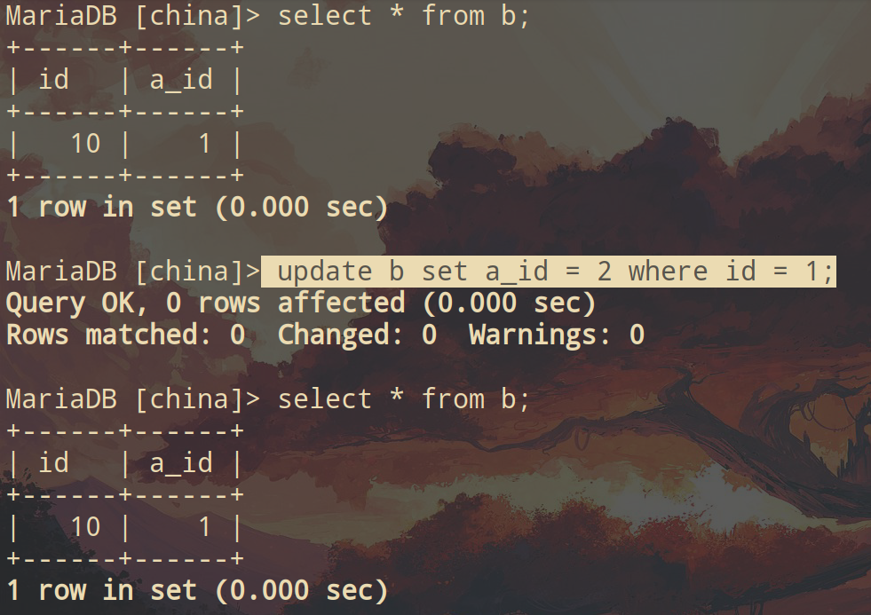

delete 也一样:

```sql
delete from b
where id =1;
```

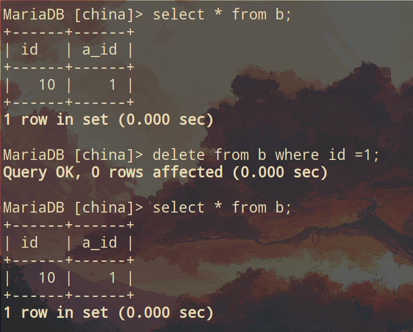

a 表:

```sql
# 因为没有权限,修改失败
update a set id = 2 where id = 1;
ERROR 1451 (23000): Cannot delete or update a parent row: a foreign key constraint fails (`china`.`b`, CONSTRAINT `fk_a` FOREIGN KEY (`a_id`) REFERENCES `a` (`id`))
```

添加权限:

```sql
# 删除外键
ALTER TABLE b DROP FOREIGN KEY fk_a;

# 重新添加外键,并授予权限
ALTER TABLE b
    ADD CONSTRAINT a_id
    FOREIGN KEY (a_id)
    REFERENCES a (id)
    ON UPDATE CASCADE
    ON DELETE CASCADE;

# 修改a 表
update a
set id = 2
where id = 1;

# 查看结果
select * from b;
```


又或者删除 b 表后重新新建,并授予权限:
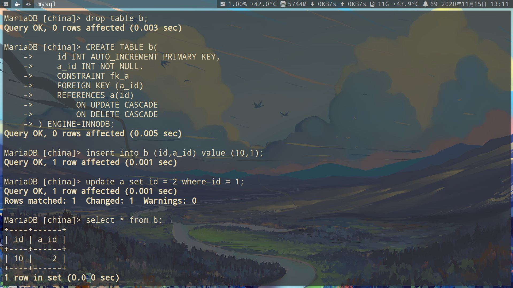

删除 a 表 刚才的数据:

```sql
delete from a
where id = 2;

# 查看结果
select * from b;
```

此时 a 表的数据删除,b 表对应的数据也会删除:


如果创建外键表时,没有指定 CONSTRAINT ,系统会自动生成(我这里为 b_ibfk_1):

```sql
# 查看CONSTRAINT
show create table b\G;
*************************** 1. row ***************************
       Table: b
Create Table: CREATE TABLE `b` (
  `id` int(11) DEFAULT NULL,
  `a_id` int(11) DEFAULT NULL,
  KEY `a_id_index` (`a_id`),
  CONSTRAINT `b_ibfk_1` FOREIGN KEY (`a_id`) REFERENCES `a` (`id`)
) ENGINE=InnoDB DEFAULT CHARSET=utf8mb4 COLLATE=utf8mb4_unicode_ci
1 row in set (0.000 sec)
```

## VIEW (视图)

- [深入解析 MySQL 视图 VIEW](https://www.cnblogs.com/geaozhang/p/6792369.html)

视图(view)是一种虚拟存在的表,是一个逻辑表,本身并不包含数据.作为一个 select 语句保存在数据字典中的.


性能:从数据库视图查询数据可能会很慢,特别是如果视图是基于其他视图创建的.

- 基表:用来创建视图的表叫做基表

    - 修改视图数据, 基表也会修改(视图没有指定的基表列字段为`null`)

    - 修改基表数据, 视图也会修改

**语法:**

> ```sql
> CREATE VIEW 视图名 (字段名) AS SELECT '值1' UNION SELECT '值2'...;
> # 基表视图
> CREATE VIEW 视图名 AS SELECT 字段名 FROM 表名...;
> ```

```sql
# 查看当前数据下的视图
show full tables
where table_type = 'view';

# 创建视图
create view v (day)
as select '1' union select '2';

# 查看视图
select * from v;
+-----+
| day |
+-----+
| 1   |
| 2   |
+-----+
# 删除视图
drop view v;

# 以 clone表 为基表,创建视图名为 v
create view v as
select * from clone;

# 查看视图信息
show create view v\G;

# 嵌套 v视图 名为 vv,并且 id <= 2
create view vv as select * from v
where id <= 2;

# 此时如果把 id 改为 3.注意这里 v 视图 和 clone 表的数据也会被更改
update vv
set id = 3
where id = 1;

# 因为 vv视图有where id <= 2的限制, 所以不满足条件的值不显示
select * from vv;
+----+------+------------+
| id | name | date |
+----+------+------------+
|  2 | tz   | 2020-10-24 |
|  2 | tz1  | 2020-10-24 |
+----+------+------------+

# 对vv视图修改的值,在v视图的也被修改
select * from v;
+----+------+------------+
| id | name | date       |
+----+------+------------+
|  3 | tz   | 2020-10-24 |
|  2 | tz   | 2020-10-24 |
|  2 | tz1  | 2020-10-24 |
+----+------+------------+

# 和刚才的 vv视图 一样 这次 vvv视图 加入with check option;
create view vvv as select * from v
where id <= 2
with check option;

# 此时对不满足条件的值,进行修改会报错
update vvv set id = 3 where id = 2;
ERROR 1369 (44000): CHECK OPTION failed `china`.`vvv`
```

可以看到 视图信息 多数为空 (**NULL**)

```sql
show table status like '名称'\G;
```

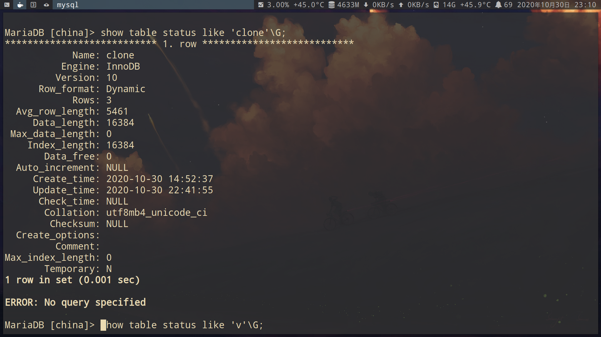
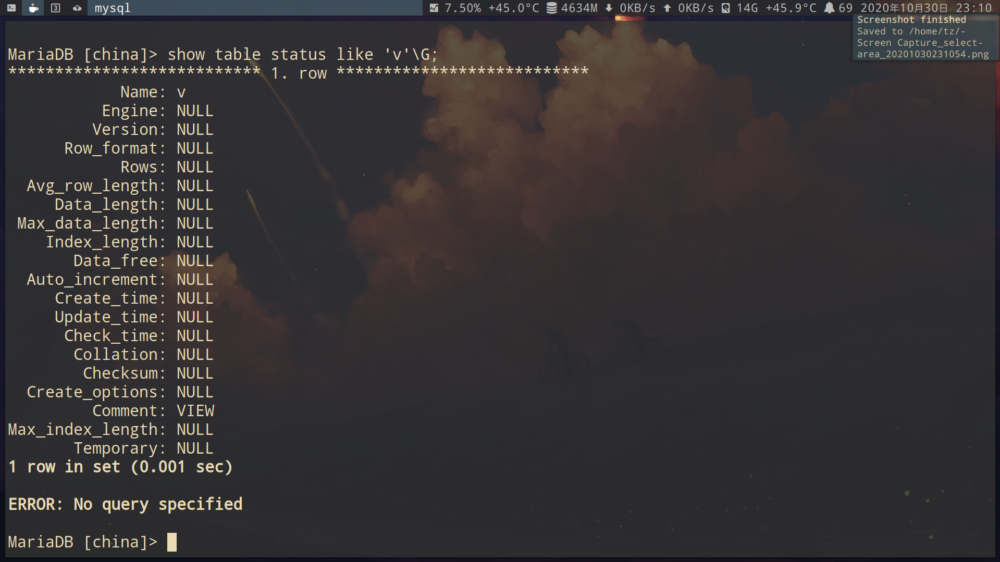

## Stored Procedure and Function (自定义存储过程 和 函数)

- [Difference between stored procedure and function in MySQL](https://medium.com/@singh.umesh30/difference-between-stored-procedure-and-function-in-mysql-52f845d70b05)

**区别:**

| Procedure                | Function                  |
| ------------------------ | ------------------------- |
| 可以执行函数             | 不能执行存储过程          |
| 不能在 select 语句下执行 | 只能在 select 语句下执行  |
| 支持 Transactions(事务)  | 不支持 Transactions(事务) |
| 可以不有返回值           | 必须要有返回值            |
| 能返回多个值             | 只能返回一个值            |

**Procedure:**

注意:procedure 是和数据库相关链接的,如果数据库被删除,procedure 也会被删除

delimiter 是分隔符 默认是: `;`

```sql
delimiter #

CREATE PROCEDURE hello (IN s VARCHAR(50))
BEGIN
   SELECT CONCAT('Hello, ', s, '!');
END #

delimiter ;

# 执行
call hello('World');

# 查看所有存储过程
show procedure status;

# 查看 hello 存储过程
show create procedure hello\G;
```

**Function:**

```sql
CREATE FUNCTION hello (s VARCHAR(50))
   RETURNS VARCHAR(50) DETERMINISTIC
   RETURN CONCAT('Hello, ',s,'!');

# 执行
select hello('world');
select hello(name) from ca limit 1;

# 查看所有自定义函数
show function status;

# 查看 hello 函数
show create function hello\G;
```

### Stored Procedure (自定义存储过程)

**语法:**

> ```sql
> delimiter #
> create procedure 过程名([IN 参数名 数据类型,OUT 参数名 数据类型... ])
>
> begin
>
> sql语句;
>
> end;
> delimiter ;
> ```

先创建表:

```sql
drop table if exists foo;
create table foo (
    id int unique auto_increment,
    val int not null default 0
);

# 插入一些数据
insert into foo (val) values (1);
insert into foo (val) values (2);
insert into foo (val) values (3);
insert into foo (val) values (4);
insert into foo (val) values (5);

# 查看结果
select * from foo;
```


循环 5 次, val 字段设置为 0 :

```sql
# 检测过程是否存在,如存在则删除
drop procedure if exists zero;

# 过程体要包含在delimiter里
delimiter #
-- 创建 zero 过程,并设置传递的变量为 int 类型的 v
-- 返回变量为 int 类型的 n
create procedure zero(IN v INT,OUT n INT)
begin

-- 变量i 代表 id 字段的值
declare i int default 1;
-- 变量s 代表循环次数
declare s int default 6;

    while i < s do
    -- 把 val 字段的值设置为 参数v
    update foo set val = v where id = i;
    set i = i + 1;
    end while;
    -- 设置返回变量 n 的值为 i
    set n = i;

end #
delimiter ;

# 设置 传递参数v 为0
set @v = 0;
# 执行 zero 过程
call zero(@v,@n);
# 查看 返回参数n 的值
select @n;

# 查看过程结果
select * from foo;
```


循环 1000 次,val 字段插入随机数:

```sql
drop procedure if exists foo_rand;

delimiter #
create procedure foo_rand()
begin

-- 循环次数1000次
declare v_max int unsigned default 1000;
declare v_counter int unsigned default 0;

-- 删除 foo表 的数据
  truncate table foo;
  start transaction;
  while v_counter < v_max do
  -- 插入随机数据
    insert into foo (val) values ( floor(rand() * 65535) );
    set v_counter=v_counter+1;
  end while;
  commit;
end #

delimiter ;

call foo_rand();

select * from foo order by id;
```


创建 10 个表

### ALTER

**语法:**

> ```sql
> ALTER TABLE table_name
> 动作 column_name 内容
> ```

| 动作   | 内容             |
| ------ | ---------------- |
| ADD    | 添加列           |
| DROP   | 删除列           |
| RENAME | 修改表名         |
| CHANGE | 修改列名         |
| MODIFY | 修改列的数据类型 |
| ENGINE | 修改存储引擎     |

```sql
# 重命名表
ALTER TABLE cnarea_2019 RENAME ca;

# 将列 name 改名为 mingzi ,类型改为 char(50)
ALTER TABLE ca change name mingzi char(50);

# 删除 id 列
ALTER TABLE ca DROP id;

# 添加 id 列
ALTER TABLE ca ADD id INT FIRST;

# 重命名 id 列为 number(bigint类型)
ALTER TABLE ca CHANGE id number BIGINT;

# 修改 city_code 列,为 char(50) 类型
ALTER TABLE ca MODIFY city_code char(50);
# 或者
ALTER TABLE ca CHANGE city_code city_code char(50);

# 修改 ca 表 id 列默认值1000
ALTER TABLE ca MODIFY id BIGINT NOT NULL DEFAULT 1000;
# 或者
ALTER TABLE ca ALTER id SET DEFAULT 1000;

# 添加主键,确保该主键默认不为空(NOT NULL)
ALTER TABLE ca MODIFY id INT NOT NULL;
ALTER TABLE ca ADD PRIMARY KEY (id);

# 删除主键
ALTER TABLE ca DROP PRIMARY KEY;

# 删除唯一性索引(unique)的 id 字段
ALTER TABLE ca DROP index id;

# 修改 ca 表的存储引擎
ALTER TABLE ca ENGINE = MYISAM;
```

#### ALTER优化

- mysql大部分修改表结构的操作是:新建一个空表, 将旧表数据插入新表, 再删除旧表

- 所有`MODIFY COLUMN` 都会导致表的重建

    ```sql
    ALTER TABLE table_name
    MODIFY COLUMN col INT DEFAULT 5
    ```

    - 使用`ALTER COLUMN`代替, 此命令直接修改frm文件, 而不是重建表

    ```sql
    ALTER TABLE table_name
    ALTER COLUMN col SET DEFAULT 5
    ```

<span id="alter_frm"></span>
- 手动修改frm文件, 避免重建表

    - **注意:此方法不受官方支持, 要自己承担风险, 执行前请先备份好数据**

    - 此方法适用于:

        - 移除(不是添加) `AUTO_INCREMENT`

        - 增加, 移除, 修改EMUM, SET类型

    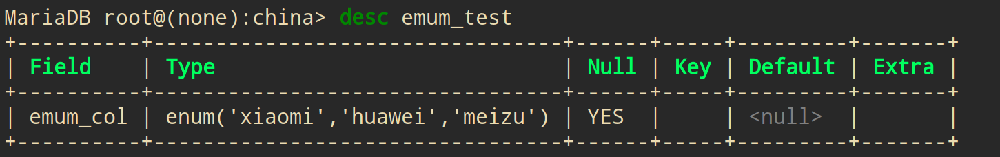
    ```sql
    -- 创建新表
    CREATE TABLE emum_test_new LIKE emum_test;

    -- 修改表结构
    ALTER TABLE emum_test_new
    MODIFY COLUMN emum_col ENUM('xiaomi','huawei','meizu','oppo', 'vivo') DEFAULT 'meizu';

    -- 关闭所有正在使用的表
    flush tables with read lock;
    ```

    ```sh
    # 进入表所在的数据库目录
    cd /var/lib/mysql/database_name

    # 交换新表和旧表
    mv emum_test.frm emum_test_tmp.frm
    mv emum_test_new.frm emum_test.frm
    mv emum_test_tmp.frm emum_test_new.frm
    ```

    ```sql
    -- 释放锁
    UNLOCK TABLES;

    -- 查看表结构是否更改
    DESC emum_test

    -- 查看数据
    SELECT * FROM emum_test
    ```
    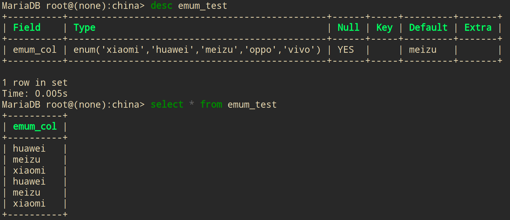

## INDEX(索引)

**索引:** 列(字段)相当于一本书,创建 **索引** 就相当于建立 **书目录**,可提高查询速度

- [Clusered Index](https://dev.mysql.com/doc/refman/8.0/en/innodb-index-types.html)(聚簇索引):按顺序保存所有数据文件

    - 如果表定义了主键InnoDB将其作为**Clusered Index**

    - 每一个叶结点上包含主键值, 事务ID, MVCC的回滚指针, 剩余列(col2...)

    - InnoDB每个表都有一个聚簇索引:

        - 如果表没有主键:

            - InnoDB会使用第一个UNIQUE not NULL作为Clusered Index

        - 如果表没有 Primary key 和 Unique not NULL:

            - InnoDB 会生成一个名为GEN_CLUST_INDEX 包含id值的隐藏列(隐藏聚簇索引)

        - 如果聚簇索引的值是非顺序的. 如`UUID`, 则会导致索引的插入完全随机:

            - 顺序的主键:每一条记录都存储在上一条记录的后面

                - 顺序写入会造成锁的竞争, 可通过variable [`innodb autoinc_lock_mode`](https://dev.mysql.com/doc/refman/8.0/en/innodb-auto-increment-handling.html)设置锁的并发度

                    - 只能在auto-increment的索引上使用

                    - 如果没有relication复制, 设置2

                        - 最大并发度, 但副本的auto-increment值未必不一致

                        - mysql 8.0:默认为2

                    - 如果有relication复制, 设置0, 1

                        - mariadb 10.5.11-1:默认为1

            - 非顺序的主键:

                - 乱序写入, 有可能会在中间的页写入:

                    - 写入的页可能已被移除缓存, 这需要从磁盘加载到内存, 会导致大量的随机io

                    - 页分裂(page split):如果写入的页已满, 就会分裂成两个页

                - 可以使用以下命令优化表数据和索引数据, 避免随机io
                    ```sql
                    OPTIMIZE TABLE table_name
                    ```

- [Secondary Indexes](https://dev.mysql.com/doc/refman/8.0/en/glossary.html#glos_secondary_index)(二级索引 或 辅助索引):不按顺序保存索引数据文件

- innodb 会在二级索引上使用共享锁, 而在聚簇索引上使用排他锁

- [Fast Index Creation](https://docs.huihoo.com/mysql/innodb-plugin-1.0-en/innodb-create-index.html):

    - `CREATE INDEX`会扫描并排序主键的聚簇索引:

        ```sql
        -- 扫描排序两次主键
        CREATE INDEX B ON T1 (B);
        CREATE UNIQUE INDEX C ON T1 (C);
        ```

    - `ALTER TABLE`只扫描排序1次主键的聚簇索引:

        1.创建表时指定聚簇索引A

        2.插入数据后

        3.再使用`ALTER TABLE`创建创建索引B和C

        ```sql
        CREATE TABLE T1(
           A INT PRIMARY KEY,
           B INT,
           C CHAR(1)
        );

        INSERT INTO T1 VALUES
        (1,2,'a'), (2,3,'b'), (3,2,'c'), (4,3,'d'), (5,2,'e');

        COMMIT;

        -- 只扫描一次主键
        ALTER TABLE T1 ADD INDEX (B),
                       ADD UNIQUE INDEX (C);
        ```

- 对于非常小的表全表扫描, 比索引更有效

- 限制每张表上的索引数量,建议单张表索引不超过 5 个

    - 禁止给表中的每一列都建立单独的索引

- 建立索引的意义:索引查询,可以减少随机 IO,索引能过滤出越少的数据,则从磁盘中读入的数据也就越少

- 把使用最频繁的列, 放到联合索引的左侧

- 尽可能把范围查询, 放在索引最右边

- 把字段长度小的列, 放在联合索引的最左侧

    - 列的字段越大,建立索引时所需要的空间也就越大,一页中所能存储的索引节点也就越少,在遍历时IO 次数也就越多

- 无法使用索引的语句

    - `WHERE age + 1 = 25`
        ```sql
        SELECT * FROM table_name
        WHERE age + 1 = 25
        ```

### [EXPLAIN](https://dev.mysql.com/doc/refman/8.0/en/explain-output.html#explain-join-types)

- [全网最全 | MySQL EXPLAIN 完全解读](https://mp.weixin.qq.com/s?src=11&timestamp=1621488329&ver=3079&signature=ce2PbaAILLUHmAka2fam5y4WUCX0tluEl*UJDpwnLsXFeoNumM9EUWThCCqEGNXQS8Sjer-ghHhvyajC8tO7jw8doi0ZlK0kdtqj3iQcbUgk1L3iyuAjNS-zusjAbJP0&new=1)

### B+树匹配原则

```sql
CREATE table index_test (
    last_name varchar(50),
    first_name varchar(50),
    date DATE
);

INSERT INTO index_test VALUES
('Jobs', 'Steve', '1955-2-24'),
('王', '小二', '2021-7-10');

-- 创建二级索引
ALTER TABLE index_test
ADD KEY(last_name, first_name, date);
```

- 重复索引:如果有索引(A, B), 就没有必要再创建(A)索引, 如发现重复索引可以立即删除

- 最左匹配:

    - 1.只匹配第一列`(last_name)`
        ```sql
        EXPLAIN SELECT * FROM index_test
        WHERE last_name='Jobs'
        ```

    - 2.只匹配last_name前缀以'J'开头的
        ```sql
        EXPLAIN SELECT * FROM index_test
        WHERE last_name LIKE 'J%'
        ```

    - 3.按顺序从左到右匹配如:`(last_name, first_name)`, `(last_name, first_name, date)`

        ```sql
        EXPLAIN SELECT * FROM index_test
        WHERE last_name='Jobs'
        AND first_name = 'Steve'
        AND date = '1955-2-24'
        ```

        - 不能跨过中间的列进行匹配如:`(last_name, date)`
        ??不按顺序, 跨过中间的列也可以
        ```sql
        EXPLAIN SELECT * FROM index_test
        WHERE date = '1955-2-24'
        AND last_name='Jobs'
        ```

- 范围匹配:

    - 某列使用范围匹配, 那么后面的列则无法使用索引

        - 尽可能使用`IN()` 代替范围查询, `IN()` 是多个等值查询依然可以使用索引

        ??可以

        - 以下只能匹配last_name, first_name
            ```sql
            EXPLAIN SELECT * FROM index_test
            WHERE last_name='Jobs'
            AND first_name LIKE 'S%'
            AND date = '1955-2-24'
            ```
- 排序匹配:

    - 1.和上面例子一样适用于最左匹配和范围匹配原则:

        ```sql
        EXPLAIN SELECT last_name FROM index_test
        ORDER BY last_name, first_name, date\G;

        ***************************[ 1. row ]***************************
        id            | 1
        select_type   | SIMPLE
        table         | index_test
        type          | index
        possible_keys | <null>
        key           | last_name
        key_len       | 410
        ref           | <null>
        rows          | 2
        Extra         | Using index
        ```

        - 列的顺序可以从where子句开始:
            ```sql
            EXPLAIN SELECT last_name FROM index_test
            WHERE last_name = 'Jobs'
            ORDER BY first_name, date\G;

            ***************************[ 1. row ]***************************
            id            | 1
            select_type   | SIMPLE
            table         | index_test
            type          | ref
            possible_keys | last_name
            key           | last_name
            key_len       | 203
            ref           | const
            rows          | 1
            Extra         | Using where; Using index
            ```

    - 2.降序`desc`, 依然能使用索引:
        ```sql
        EXPLAIN SELECT last_name from index_test
        ORDER BY last_name DESC, first_name DESC, date DESC\G;

        ***************************[ 1. row ]***************************
        id            | 1
        select_type   | SIMPLE
        table         | index_test
        type          | index
        possible_keys | <null>
        key           | last_name
        key_len       | 410
        ref           | <null>
        rows          | 2
        Extra         | Using index
        ```

        - 但如果有两种不同排序方向, 则不能使用索引:

            - Extra字段为`Using filesort`:表示不能使用索引, 需要自己排序, 数据量小则会在内存, 大则会在磁盘
                - 排序是成本很高的操作, 尽量避免对大量数据排序

            ```sql
            EXPLAIN SELECT last_name FROM index_test
            ORDER BY last_name ASC, first_name ASC, date DESC\G;
            -- 两条语句一样
            EXPLAIN SELECT last_name FROM index_test
            ORDER BY last_name, first_name, date DESC\G;

            ***************************[ 1. row ]***************************
            id            | 1
            select_type   | SIMPLE
            table         | index_test
            type          | index
            possible_keys | <null>
            key           | last_name
            key_len       | 410
            ref           | <null>
            rows          | 2
            Extra         | Using index; Using filesort
            ```

#### 前缀索引

- 对于过长的值, 可以建立前缀索引

    - 一个数据表的 x_name 值都是类似 23213223.434323.4543.4543.34324.可以只取前7位`alter table table1 add key (x_name(7))`

- 无法使用`ORDER BY`, `GROUP BY`, 以及覆盖查询

- 后缀索引(suffix index):像电子邮件这类值比较有效. 但mysql不支持后缀, 可以把字符串反转后, 再建立前缀索引

- 索引选择性:不重复的索引值,和表总数的比例. 唯一性索引的选择性是1, 性能最好

- 假设要建立cnarea_2019表的name列索引:

    - 查看选择性:
    ```sql
    SELECT COUNT(DISTINCT name) / COUNT(*) FROM cnarea_2019;

    +---------------------------------+
    | COUNT(DISTINCT name) / COUNT(*) |
    +---------------------------------+
    | 0.6138 |
    +---------------------------------+
    ```

    - 查看不同前缀长度的选择性
    ```sql
    SELECT
    COUNT(DISTINCT LEFT(name, 4)) / COUNT(*) AS sel3,
    COUNT(DISTINCT LEFT(name, 4)) / COUNT(*) AS sel4,
    COUNT(DISTINCT LEFT(name, 5)) / COUNT(*) AS sel5,
    COUNT(DISTINCT LEFT(name, 6)) / COUNT(*) AS sel6,
    COUNT(DISTINCT LEFT(name, 7)) / COUNT(*) AS sel7,
    COUNT(DISTINCT LEFT(name, 8)) / COUNT(*) AS sel8,
    COUNT(DISTINCT LEFT(name, 9)) / COUNT(*) AS sel9,
    COUNT(DISTINCT LEFT(name, 10)) / COUNT(*) AS sel10,
    COUNT(DISTINCT LEFT(name, 11)) / COUNT(*) AS sel11,
    COUNT(DISTINCT LEFT(name, 12)) / COUNT(*) AS sel12
    FROM cnarea_2019;

    +--------+--------+--------+--------+--------+--------+--------+--------+--------+--------+
    | sel3 | sel4 | sel5 | sel6 | sel7 | sel8 | sel9 | sel10 | sel11 | sel12 |
    +--------+--------+--------+--------+--------+--------+--------+--------+--------+--------+
    | 0.5271 | 0.5271 | 0.5662 | 0.5866 | 0.5981 | 0.6057 | 0.6095 | 0.6119 | 0.6128 | 0.6133 |
    +--------+--------+--------+--------+--------+--------+--------+--------+--------+--------+
    ```

    - 查看当前缀为8时, 最频繁出现的次数
    ```sql
    SELECT COUNT(*) AS cnt, LEFT(name, 8) FROM cnarea_2019
    GROUP BY name
    ORDER BY cnt DESC
    LIMIT 10;

    +-----+---------------+
    | cnt | LEFT(name, 8) |
    +-----+---------------+
    | 358 | 和平村委会 |
    | 333 | 张庄村委会 |
    | 328 | 团结村委会 |
    | 321 | 王庄村委会 |
    | 305 | 太平村委会 |
    | 281 | 市辖区     |
    | 274 | 胜利村委会 |
    | 265 | 新民村委会 |
    | 264 | 新庄村委会 |
    | 261 | 红星村委会 |
    +-----+---------------+
    ```

    - 到达8后选择性的提升已经很小了, 因此建立长度为8的索引

        ```sql
        ALTER TABLE cnarea_2019 ADD KEY (name(8));
        ```

### HASH INDEX

- 只有所有列全匹配才有效:

  - 假设索引为`key(last_name, first_name, date)`, 那么查询时如果只有last_name, 则无法使用索引

- 支持比较查询`=, IN(), <=>`.注意<>和<=>是不同操作

  - 不支持范围查询`where price > 100`

- hash index只包含哈希值, 行指针, 不存储字段值

- hash冲突很多的话, 需要遍历链表, 更高的操作代价

- 假设索引为`key(last_name)`. hash函数f(), 返回以下值:

    ```
    f('Jobs') = 2333
    f('王') = 6666
    ```

    | slot(桶) | value(值)     |
    |----------|---------------|
    | 2333     | 指向第1行指针 |
    | 6666     | 指向第2行指针 |

    - 假设查询last_name为'Jobs':
        ```sql
        SELECT * FROM index_test
        WHERE last_name = 'Jobs'
        ```

        - 1.先计算Jobs的hash

        - 2.查找hash对应的桶2333, 找到指向第1行指针

        - 3.判断第1行指针是否为Jobs, 防止hash冲突

#### 自适应哈希(adaptive hash index)

- innodb的一个特殊功能, 但某些索引值操作比较频繁时, 会在内存中基于B+树之上创建hash索引

- 如果存储引擎不支持自适应哈希, 也可以自己模拟:

    - 创建一个在B+树上的伪哈希索引. 依然是在B+树上查询, 但使用hash代替值查询:
        ```sql
        CREATE table hash_test (
            id INT UNSIGNED NOT NULL AUTO_INCREMENT,
            url varchar(255) NOT NULL,
            url_crc INT UNSIGNED NOT NULL DEFAULT 0, --哈希为int类型
            PRIMARY KEY(id)
        );
        ```
    - 创建INSERT, UPDATE的触发器, 使用`CRC32()`函数:

        - 注意:不要使用SHA1(), MD5(), 这类hash是强加密函数, 生成非常长字符串, 会浪费大量空间, 比较时也慢

        ```sql
        DELIMITER //

        CREATE TRIGGER hash_test_crc_in BEFORE INSERT ON hash_test FOR EACH ROW BEGIN SET NEW.url_crc=crc32(NEW.url);
        END;
        //

        CREATE TRIGGER hash_test_crc_up BEFORE UPDATE ON hash_test FOR EACH ROW BEGIN SET NEW.url_crc=crc32(NEW.url);
        END;
        //

        DELIMITER ;
        ```

    - 测试:
        ```sql
        INSERT INTO hash_test(url) VALUES
        ('http://www.mysql.com');

        INSERT INTO hash_test(url) VALUES
        ('http://www.mariadb.com');

        SELECT * FROM hash_test
        ```
        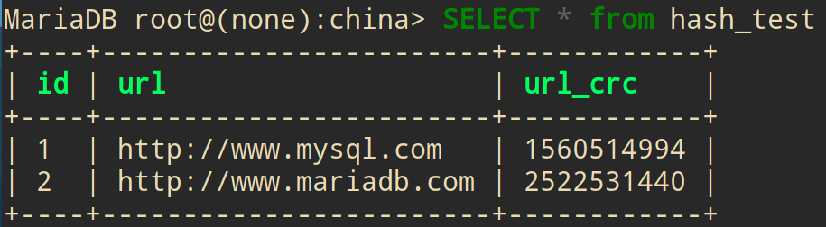

    - 防止hash值冲突, 需要加上`AND url = `:
        ```sql
        SELECT * FROM hash_test
        WHERE url_crc = CRC32('http://www.mysql.com')
        AND url = 'http://www.mysql.com'
        ```

    - `CRC32()`是32位的, 可以自定义一个64位hash函数:
        ```sql
        SELECT CONV(RIGHT(MD5('http://www.mysql.com/'), 16), 16, 10) AS HASH64
        ```
### 覆盖索引

- 覆盖索引:索引包含查询所需的字段值

    - 能提升性能, 无需回表

        - 如果索引不能覆盖查询所有列, 需要每扫描一条索引记录后, 回表查询对应的行, 基本是随机io

    - 因此必须存储字段值, 想hash, 空间, 全文索引都不能存储字段值

- 通过`EXPLAIN`命令Extra字段为`Using index` 就是覆盖索引:

    - 注意:type字段的`index` , 说明使用了索引扫描排序.[跳转至type字段说明](#explain-type)

    ```sql
    CREATE table index1_test (
        id INT AUTO_INCREMENT PRIMARY KEY,
        name VARCHAR(10)
    );

    INSERT INTO index1_test(name) VALUES ('one'), ('two');

    EXPLAIN SELECT id FROM index1_test\G;
    ***************************[ 1. row ]***************************
    id            | 1
    select_type   | SIMPLE
    table         | index1_test
    type          | index
    possible_keys | <null>
    key           | PRIMARY
    key_len       | 4
    ref           | <null>
    rows          | 2
    Extra         | Using index
    ```

- 通过`EXPLAIN`命令Extra字段为`Using where`表示没有使用索引:

    ```sql
    EXPLAIN SELECT name FROM index1_test
    WHERE name = 'one'\G;
    ***************************[ 1. row ]***************************
    id            | 1
    select_type   | SIMPLE
    table         | index1_test
    type          | ALL
    possible_keys | <null>
    key           | <null>
    key_len       | <null>
    ref           | <null>
    rows          | 2
    Extra         | Using where
    ```

    - 通过子查询查找id, 即第一阶段使用覆盖索引.这叫作延迟关联(deferred join)
        ```sql
        SELECT * FROM index1_test
        JOIN (SELECT id FROM index1_test) as id
        ON (index1_test.id = id.id);

        ***************************[ 1. row ]***************************
        id            | 1
        select_type   | SIMPLE
        table         | index1_test
        type          | index
        possible_keys | PRIMARY
        key           | PRIMARY
        key_len       | 4
        ref           | <null>
        rows          | 2
        Extra         | Using index
        ***************************[ 2. row ]***************************
        id            | 1
        select_type   | SIMPLE
        table         | index1_test
        type          | ALL
        possible_keys | PRIMARY
        key           | <null>
        key_len       | <null>
        ref           | <null>
        rows          | 2
        Extra         | Using where; Using join buffer (flat, BNL join)
        ```

    - 创建二级索引后在查询:
        ```sql
        ALTER TABLE index1_test ADD INDEX name(name);

        EXPLAIN SELECT name FROM index1_test
        WHERE name = 'one'\G;
        ***************************[ 1. row ]***************************
        id            | 1
        select_type   | SIMPLE
        table         | index1_test
        type          | ref
        possible_keys | name
        key           | name
        key_len       | 43
        ref           | const
        rows          | 1
        Extra         | Using where; Using index
        ```
        ```sql
MariaDB root@(none):china> explain select id from index1_test order by name,id
+----+-------------+-------------+-------+---------------+------+---------+--------+------+-------------+
| id | select_type | table       | type  | possible_keys | key  | key_len | ref    | rows | Extra       |
+----+-------------+-------------+-------+---------------+------+---------+--------+------+-------------+
| 1  | SIMPLE      | index1_test | index | <null>        | name | 43      | <null> | 2    | Using index |
+----+-------------+-------------+-------+---------------+------+---------+--------+------+-------------+

1 row in set
Time: 0.005s
MariaDB root@(none):china> explain select id from index1_test order by id,name
+----+-------------+-------------+-------+---------------+------+---------+--------+------+-----------------------------+
| id | select_type | table | type | possible_keys | key | key_len | ref | rows | Extra
              |
+----+-------------+-------------+-------+---------------+------+---------+--------+------+-----------------------------+
| 1  | SIMPLE      | index1_test | index | <null>        | name | 43      | <null> | 2    | Using index; Using filesort |
+----+-------------+-------------+-------+---------------+------+---------+--------+------+-----------------------------+

        ```

### [Multiple-Column Indexes (多列索引)](https://dev.mysql.com/doc/refman/8.0/en/multiple-column-indexes.html)

- Multiple-Column Indexes 最多可以**16**个列

- 如果 col1 和 col2 上有单独的索引时,那么优化器将尝试使用[索引合并优化](https://dev.mysql.com/doc/refman/8.0/en/index-merge-optimization.html)

```sql
explain select * from index_test
where last_name = 'Jobs'
or date = '2021-07-10'

explain select * from index_test
where date = '2021-07-10'
or last_name = 'Jobs'

+----+-------------+------------+------+---------------+-----------+---------+-------+------+--------------------------+
| id | select_type | table | type | possible_keys | key | key_len | ref | rows | Extra
             |
+----+-------------+------------+------+---------------+-----------+---------+-------+------+--------------------------+
| 1 | SIMPLE | index_test | ref | last_name | last_name | 203 | const | 1 | Using where; Using index |
+----+-------------+------------+------+---------------+-----------+---------+-------+------+--------------------------+

create index last_name on index_test(last_name)

create index date on index_test(date)

explain select date, last_name from index_test
where date = '2021-07-10'
union
select date, last_name from index_test
where last_name = 'Jobs'
```

| 存储引擎   | B+树   | hash哈希   | full-text(全文索引)   | 分形树索引(fractal tree)  | LSM树 |
| ---------- | ------ | ---------- | --------------------- | ------------------------- | ----- |
| Innodb     | 支持   | 支持       |                       |                           |
| MyISAM     | 支持   | 支持       |                       |                           |
| Memory     | 支持   | 支持       |                       |                           |
| TokuDB     |        |            |                       | 支持                      |
| InfiniDB   |        |            |                       |                           | 支持  |
| RocksDB    |

### SQL语法索引

> ```sql
> CREATE INDEX 索引名
> ON 表名 (列1, 列2,...)
> # 降序
> CREATE INDEX 索引名
> ON 表名 (列1, 列2,... DESC)
>
> ALTER table 表名
> ADD INDEX 索引名(列1, 列2);
> ```

```sql
# 显示索引
SHOW INDEX FROM ca;

# 添加索引id
CREATE INDEX name ON ca (id);

# 添加索引id,name
CREATE INDEX name ON ca (id,name);

# 添加索引降序id,name
CREATE INDEX name ON ca (id,name desc);

# 删除索引
DROP INDEX name ON ca;

# 添加索引id
ALTER table ca ADD INDEX name(id);
# 删除索引
ALTER table ca DROP INDEX name;

# 优化表数据和索引数据
OPTIMIZE TABLE ca
```

#### 索引状态

[handler_read:](https://dev.mysql.com/doc/refman/8.0/en/server-status-variables.html#statvar_Handler_read_next)

```sql
# 清空缓存和状态
flush tables;
flush status;
# 清空后全是0
SHOW STATUS LIKE 'handler_read%';
```

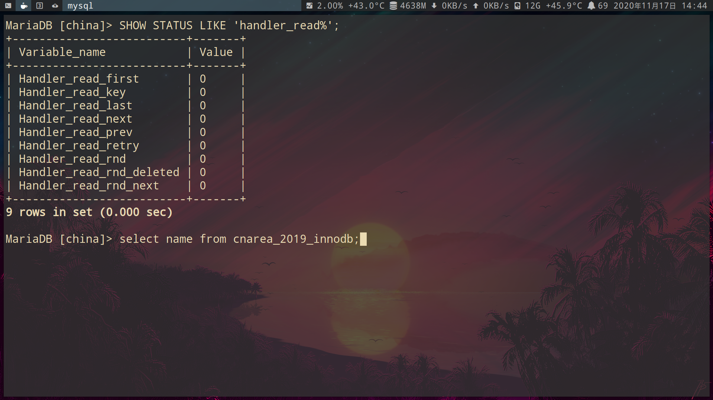

此时 name 字段,还没有索引:

```sql
select name from cnarea_2019_innodb;
SHOW STATUS LIKE 'handler_read%';
```

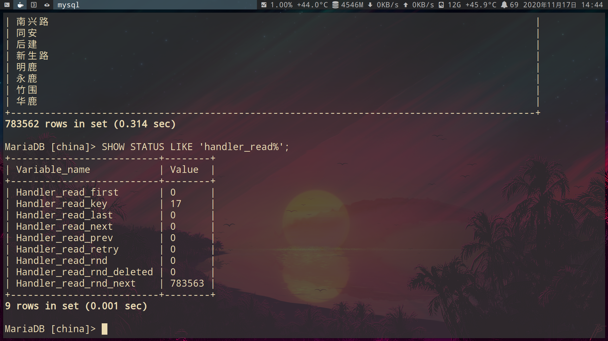
建立索引后在查询:

```sql
create index idx_name on cnarea_2019_innodb(name);
flush tables;
flush status;

select name from cnarea_2019_innodb;
SHOW STATUS LIKE 'handler_read%';
```

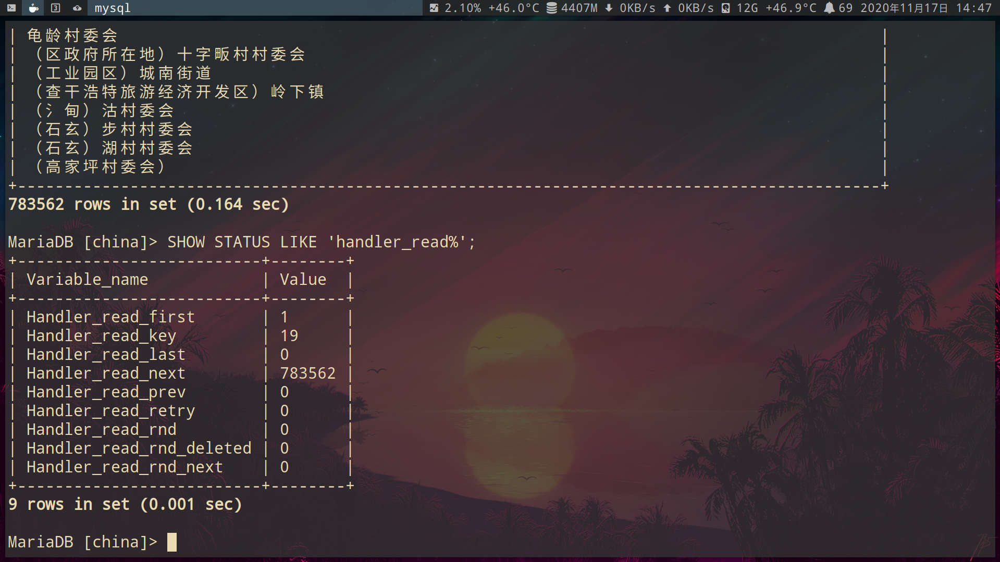

## DCL

DCL (语句主要是管理数据库权限的时候使用)

### 帮助文档

```sql
# 按照层次查询
? contents;
? Account Management
# 数据类型
? Data Types
? VARCHAR
? SHOW
```

### 用户权限设置

> ```sql
> # 创建用户
> CREATE USER 'username'@'host' IDENTIFIED BY 'password';
>
> # 授权
> GRANT privileges ON databasename.tablename TO 'username'@'host'
>
> # 撤销权限
> REVOKE privileges ON databasename.tablename FROM 'username'@'host'
> ```

[更多用户权限详情](https://blog.csdn.net/lu1171901273/article/details/91635417?utm_medium=distribute.pc_aggpage_search_result.none-task-blog-2~all~sobaiduend~default-1-91635417.nonecase&utm_term=mysql%20%E7%BB%99%E7%94%A8%E6%88%B7%E5%88%86%E9%85%8D%E8%A7%86%E5%9B%BE%E6%9D%83%E9%99%90&spm=1000.2123.3001.4430)

create and grant (创建和授权):

```sql
# 查看所有用户
SELECT user,host FROM mysql.user;

# 详细查看所有用户
SELECT DISTINCT CONCAT('User: ''',user,'''@''',host,''';')
AS query FROM mysql.user;

# 创建用户名为tz的用户
create user 'tz'@'127.0.0.1'
identified by 'YouPassword';

# 当前用户修改密码的命令
SET PASSWORD = PASSWORD("NewPassword");

# 修改密码
SET PASSWORD FOR 'tz'@'127.0.0.1' = PASSWORD('NewPassword');

# grant (授权)
# 只能 select china.cnarea_2019
grant select on china.cnarea_2019 to 'tz'@'127.0.0.1';

# 添加 insert 和 china所有表的权限
grant select,insert on china.* to 'tz'@'127.0.0.1';

# 添加所有数据库和表的权限
grant all PRIVILEGES on *.* to 'tz'@'127.0.0.1';

# 允许tz 用户授权于别的用户
grant all on *.* to 'tz'@'127.0.0.1' with grant option;

# 刷新权限
flush privileges;

# 查看用户权限
show grants for 'tz'@'127.0.0.1';

+-------------------------------------------------------------------+
| Grants for tz@127.0.0.1                                           |
+-------------------------------------------------------------------+
| GRANT ALL PRIVILEGES ON *.* TO `tz`@`127.0.0.1` WITH GRANT OPTION   |
| GRANT SELECT, INSERT ON `china`.* TO `tz`@`127.0.0.1`              |
| GRANT SELECT ON `china`.`cnarea_2019` TO `tz`@`127.0.0.1`         |
+-------------------------------------------------------------------+
```

#### revoke (撤销):

```sql
revoke all privileges on *.* from 'tz'@'127.0.0.1';
revoke grant option on *.* from 'tz'@'127.0.0.1';

+-----------------------------------------------------------+
| Grants for tz@127.0.0.1                                   |
+-----------------------------------------------------------+
| GRANT USAGE ON *.* TO `tz`@`127.0.0.1`                    |
| GRANT SELECT, INSERT ON `china`.* TO `tz`@`127.0.0.1`     |
| GRANT SELECT ON `china`.`cnarea_2019` TO `tz`@`127.0.0.1` |
+-----------------------------------------------------------+

revoke select, insert on china.* from 'tz'@'127.0.0.1';

+-----------------------------------------------------------+
| Grants for tz@127.0.0.1                                   |
+-----------------------------------------------------------+
| GRANT USAGE ON *.* TO `tz`@`127.0.0.1`                    |
| GRANT SELECT ON `china`.`cnarea_2019` TO `tz`@`127.0.0.1` |
+-----------------------------------------------------------+

revoke select on china.cnarea_2019 from 'tz'@'127.0.0.1';

+----------------------------------------+
| Grants for tz@127.0.0.1                |
+----------------------------------------+
| GRANT USAGE ON *.* TO `tz`@`127.0.0.1` |
+----------------------------------------+

# 刷新权限
FLUSH PRIVILEGES;

# 删除用户
drop user 'tz'@'127.0.0.1';
```

<span id="user"></span>

#### 授予权限,远程登陆

**语法:**

> ```sql
> GRANT PRIVILEGES ON 数据库名.表名 TO '用户名'@'IP地址' IDENTIFIED BY 'YouPassword' WITH GRANT OPTION;
> ```

```sql

# 允许root从'192.168.100.208'主机china库下的所有表(WITH GRANT OPTION表示有修改权限的权限)
grant all PRIVILEGES on china.* to
'root'@'192.168.100.208'
identified by 'YouPassword'
WITH GRANT OPTION;

# 允许root从'192.168.100.208'主机china库下的cnarea_2019表
grant all PRIVILEGES on china.cnarea_2019 to
'root'@'%'
identified by 'YouPassword'
WITH GRANT OPTION;

# 允许所有用户连接所有库下的所有表(%:表示通配符)
grant all PRIVILEGES on *.* to
'root'@'%' identified by 'YouPassword'
WITH GRANT OPTION;

# 刷新权限
FLUSH PRIVILEGES;
```

```sh
# 记得在服务器里关闭防火墙
iptables -F

# 连接远程数据库(我这里是192.168.100.208)
mysql -u root -p 'YouPassword' -h 192.168.100.208
```

### 配置(varibles)操作

- 注意`variables` 的修改,永久保存要写入`/etc/my.cnf`
  [详细配置说明](https://github.com/jaywcjlove/mysql-tutorial/blob/master/chapter2/2.6.md#%E9%85%8D%E7%BD%AE%E6%96%87%E4%BB%B6%E5%86%85%E5%AE%B9)

```sql
# 查看配置(变量)
show variables;
# 查看字段前面包含max_connect的配置(通配符%)
show variables like 'max_connect%';

show variables like 'max_connect%';
+--------------------+-------+
| Variable_name      | Value |
+--------------------+-------+
| max_connect_errors | 100   |
| max_connections    | 151   |
+--------------------+-------+
2 rows in set (0.01 sec)

# 设置自定义变量(重启后失效)
set @val = 1;
# 查看刚才的变量
select @val;

# 修改会话变量,该值将在会话内保持有效(重启后失效)
set session sql_mode = 'TRADITIONAL';

# 通过 select 查看
select @@session.sql_mode;
# 或者
show variables like 'sql_mode';

# 修改全局变量, 仅影响更改后连接的客户端的相应会话值.(重启后失效)
set global max_connect_errors=1000;

# 通过 select 查看
select @@global.max_connect_errors;
# 或者
show variables like 'max_connect_errors';

# 永久保存,要写入/etc/my.cnf
echo "max_connect_errors=1000" >> /etc/my.cnf
```

[mysql 的 sql_mode 合理设置](http://xstarcd.github.io/wiki/MySQL/MySQL-sql-mode.html)

## 表损坏

- INNODB一般不会损坏, 不存在什么查询会导致表损坏

    - 1.硬件问题(内存, 硬盘)

    - 2.使用 `rsync` 命令备份

```sql
-- 检测表是否损坏.注意并不是所有存储引擎都支持该命令
CHECK TABLE table_name;

-- 修复表
REPAIR TABLE table_name;

-- 也可以使用ALTER TABLE重建表
ALTER TABLE table_name ENGINE=INNODB;
```

## mysqldump 备份和恢复

> [建议使用更快更强大的 mydumper](#mydumper)

- 先创建一个数据表

```sql
use china;
create table tz (
    id   int (8),
    name varchar(50),
    date DATE
);

insert into tz (id,name,date) values
(1,'tz','2020-10-24');
```

- 1.使用 `mysqlimport` 导入(不推荐)

  > 因为 `mysqlimport` 是把数据**导入新增**进去表里,而非恢复

```sql
# 导出tz表. 注意:路径要加''
SELECT * FROM tz INTO OUTFILE '/tmp/tz.txt';

# 删除表和表的数据
drop table tz;

# 导入前要创建一个新的表
create table tz (
    id int (8),
    name varchar(50),
    date DATE
);
```

回到终端使用 `mysqlimport` 进行数据导入:

```sh
mysqlimport china /tmp/tz.txt
```

- 2.使用 `mysqldump` 备份

```sql
# 备份 china 数据库

mysqldump -uroot -pYouPassward china > china.sql

# 备份 china 数据库里的 tz 表

mysqldump -uroot -pYouPassward china tz > tz-tables.sql

# 备份所有数据库

mysqldump -uroot -pYouPassward --all-databases > all.sql

# -d 只备份所有数据库表结构(不包含表数据)

mysqldump -uroot -pYouPassward -d --all-databases > mysqlbak-structure.sql

# 恢复到 china 数据库

mysql -uroot -pYouPassward china < china.sql

# 恢复所有数据库

mysql -uroot -pYouPassward < all.sql
```

### 主从同步 (Master Slave Replication )

#### 主服务器配置

- `/etc/my.cnf` 文件配置

```sh
[mysqld]
server-id=129            # 默认是 1 ,这个数字必须是唯一的
log_bin=centos7

binlog-do-db=tz          # 同步指定库tz
binlog-ignore-db=tzblock # 忽略指定库tzblock
```

```sh
# 备份

# 进入数据库后给数据库加上一把锁,阻止对数据库进行任何的写操作
flush tables with read lock;

# 备份tz数据库
mysqldump -uroot -pYouPassward tz > /root/tz.sql

# 对数据库解锁,恢复对主数据库的操作
unlock tables;
```

```sql
# 启用slave权限
grant PRIVILEGES SLAVE on *.* to  'root'@'%';

# 或者启用所有权限
grant all on *.* to  'root'@'%';
```

查看主服务状态

```sql
# 日志目录 /var/lib/mysql/centos7.000001

mysql> show master status;
ERROR 2006 (HY000): MySQL server has gone away
No connection. Trying to reconnect...
Connection id:    7
Current database: tz

+----------------+----------+--------------+------------------+-------------------+
| File           | Position | Binlog_Do_DB | Binlog_Ignore_DB | Executed_Gtid_Set |
+----------------+----------+--------------+------------------+-------------------+
| centos7.000001 |      156 |              |                  |                   |
+----------------+----------+--------------+------------------+-------------------+
1 row in set (0.02 sec)
```

#### 从服务器配置

- `/etc/my.cnf` 文件配置

```sh
[mysqld]
server-id=128

replicate-do-db = tz     #只同步abc库
slave-skip-errors = all   #忽略因复制出现的所有错误
```

```sh
# 复制主服务器的tz.sql备份文件
scp -r "root@192.168.100.208:/root/tz.sql" /tmp/
# 创建tz数据库
mysql -uroot -p
```

恢复 tz 数据库

```sql
# 先创建 tz 数据库
create database tz;

# 导入
mysql -uroot -p tz < /tmp/tz.sql

# 如果出现以下核对错误
ERROR 1273 (HY000) at line 47: Unknown collation: 'utf8mb4_0900_ai_ci'
# 通过修改编码修复
sed -i 's/utf8mb4_0900_ai_ci/utf8mb4_unicode_ci/g' /tmp/tz.sql
# 再次运行
mysql -uroot -p tz < /tmp/tz.sql
```

```sql
# 关闭同步
stop slave;

# 开启同步功能
CHANGE MASTER TO
MASTER_HOST = '192.168.100.208',
MASTER_USER = 'root',
MASTER_PASSWORD = 'YouPassword',
MASTER_LOG_FILE='centos7.000001',
MASTER_LOG_POS=156;

# 开启同步
start slave;
```

```sql
MariaDB [tz]> show slave status\G;
*************************** 1. row ***************************
                Slave_IO_State: Connecting to master
                   Master_Host: 192.168.100.208
                   Master_User: root
                   Master_Port: 3306
                 Connect_Retry: 60
               Master_Log_File: centos7.000001
           Read_Master_Log_Pos: 6501
                Relay_Log_File: tz-pc-relay-bin.000001
                 Relay_Log_Pos: 4
         Relay_Master_Log_File: centos7.000001
              Slave_IO_Running: Connecting
             Slave_SQL_Running: Yes
```

```sh
# 测试能不能连接主服务器
mysql -uroot -p -h 192.168.100.208 -P3306
```

### docker 主从复制

[docker 安装 mysql 教程](#docker)

启动两个 mysql:

```sh
docker run -itd --name mysql-tz -p 3306:3306 -e MYSQL_ROOT_PASSWORD=YouPassword mysql

docker run -itd --name mysql-slave -p 3307:3306 -e MYSQL_ROOT_PASSWORD=YouPassword mysql
```

进入 docker 修改 `my.cnf` 配置文件

```sh
docker exec -it mysql-tz /bin/bash
echo "server-id=1" >> /etc/mysql/my.cnf
echo "log-bin=bin.log" >> /etc/mysql/my.cnf
echo "bind-address=0.0.0.0" >> /etc/mysql/my.cnf

docker exec -it mysql-slave /bin/bash
echo "server-id=2" >> /etc/mysql/my.cnf
echo "log-bin=bin.log" >> /etc/mysql/my.cnf

退出docker后,重启mysql
docker container restart mysql-slave
docker container restart mysql-tz
```

进入 master(主服务器) 创建 backup 用户,并添加权限:

```sql
mysql -uroot -pYouPassword -h 127.0.0.1 -P3306

create user 'backup'@'%' identified by 'YouPassword';
GRANT replication slave ON *.* TO 'backup'@'%';
FLUSH PRIVILEGES;
```

查看 master 的 ip:

```sh
sudo docker exec -it mysql-tz cat '/etc/hosts'
```

我这里为 `172.17.0.2`

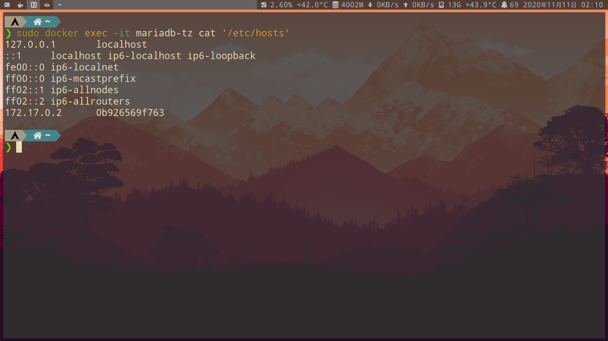

开启 **slave**:

```sql
# MASTER_HOST 填刚才查询的ip

mysql -uroot -pYouPassword -h 127.0.0.1 -P3307
CHANGE MASTER TO
MASTER_HOST = '172.17.0.2',
MASTER_USER = 'backup',
MASTER_PASSWORD = 'YouPassword';
start slave;
```

docker 主从复制测试:

- 左为 3307 从服务器
- 右为 3306 主服务器

在主服务器**新建数据库 tz,hello 表**,并插入 1 条数据.可以看到从服务器可以 select hello 表;在主服务器删除 tz 数据库,从服务器也跟着删除.


## mysqlbinlog

### [--flashback 闪回还原](https://mariadb.com/kb/en/flashback/)

日志格式必须设置为:

- binlog_format=ROW
- binlog_row_image=FULL

创建测试表,并插入数据:

```sql
drop table if exists test;

CREATE TABLE test(
    id int (8),
    name varchar(50),
    date DATE
);

insert into test (id,name,date) values
(1,'tz1','2020-10-24'),
(10,'tz2','2020-10-24'),
(100,'tz3','2020-10-24');

commit;
```

有两种闪回还原的方法:

- 通过 `pos` 还原:

```sql
# 记下日志名 和 pos 等下还原需要:

# 查看日志名,我这里为(bin.000016)
show master status;
+------------+----------+--------------+------------------+
| File       | Position | Binlog_Do_DB | Binlog_Ignore_DB |
+------------+----------+--------------+------------------+
| bin.000016 |     9074 |              |                  |
+------------+----------+--------------+------------------+

# 查看日志,找到删除修改数据前提交的pos(如下图:我这里是7144)
show binlog events in 'bin.000016'\G;
```


- 通过 `start-datetime` 还原:

```sql
# 记下删除修改数据前最后一次的时间

# 查看时间
select current_timestamp();
+---------------------+
| current_timestamp() |
+---------------------+
| 2020-11-19 16:50:19 |
+---------------------+
```

删除,修改,添加数据:

```sql
delete from test
where id = 1;

update test
set id = 20
where id = 10;

insert into test (id,name,date) values
(1000,'tz4','2020-10-24');

commit;

select * from test;
```

通过 `--start-position` 进行还原:

```sh
mysqlbinlog /var/lib/mysql/bin.000016 -vv -d china -T test \
   --start-position="7144" --flashback > /tmp/flashback.sql

sudo mysql -uroot -p china < /tmp/flashback.sql
```


通过 `--start-datetime` 进行还原:

```sh
mysqlbinlog /var/lib/mysql/bin.000016 -vv -d china -T test \
   --start-datetime="2020-11-19 16:50:19" --flashback > /tmp/flashback.sql

sudo mysql -uroot -p china < /tmp/flashback.sql
```


## 导出不同文件格式

```sh
# \G格式导出数据
mysql -uroot -p --vertical --execute="select * from cnarea_2019;" china > /tmp/cnarea_2019.html

# html
mysql -uroot -p --html --execute="select * from cnarea_2019;" china > /tmp/cnarea_2019.html

# xml
mysql -uroot -p --xml --execute="select * from cnarea_2019;" china > /tmp/cnarea_2019.html
```

```sql
# csv
SELECT * FROM cnarea_2019 INTO OUTFILE '/tmp/cnarea_2019.csv'
FIELDS TERMINATED BY ',' ENCLOSED BY '"'
LINES TERMINATED BY '\r\n';
```

## 高效强大的 mysql 软件

- [MySQL 常用工具选型和建议](https://zhuanlan.zhihu.com/p/86846532)

### [mycli](https://github.com/dbcli/mycli)

- 更友好的 mysql 命令行
- 目前发现不能,修改和查看用户权限

```sql
mysql root@localhost:(none)> SELECT DISTINCT CONCAT('User: ''',user,'''@''',host,''';') AS query FROM mysq
                          -> l.user;
(1142, "SELECT command denied to user 'root'@'localhost' for table 'user'")
```


### [mitzasql](https://github.com/vladbalmos/mitzasql)

- 一个使用`vim`快捷键的 `mysql-tui`

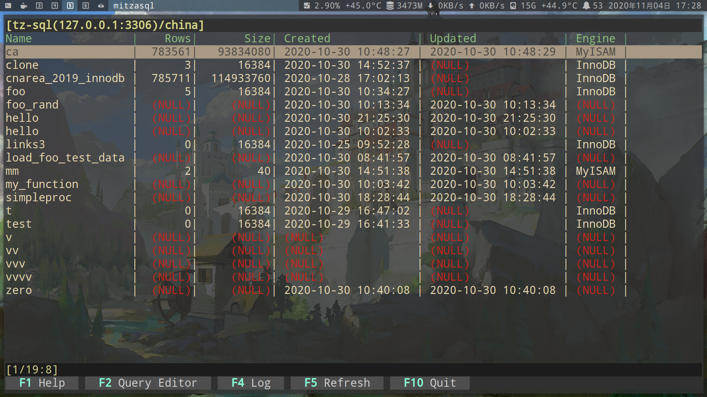
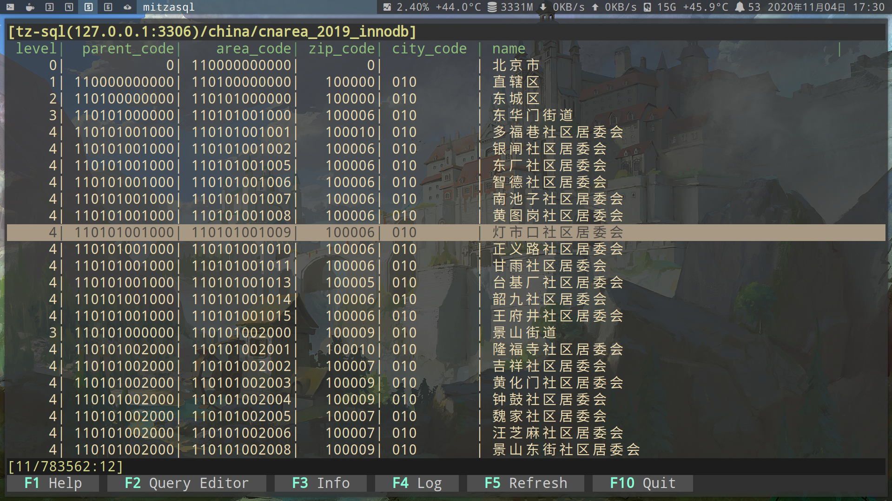

<span id="mydumper"></span>

### [mydumper](https://github.com/maxbube/mydumper)

Mydumper 是 MySQL 数据库服务器备份工具,它比 MySQL 自带的 mysqldump 快很多.[详细参数](https://linux.cn/article-5330-1.html)

```sh
# 带压缩备份--compress(gz)
mydumper \
--database=china \
--user=root \
--password=YouPassword \
--outputdir=/tmp/china.sql \
--rows=500000 \
--compress \
--build-empty-files \
--threads=10 \
--compress-protocol
```


```sh
# 不带压缩备份,最后再用7z压缩
mydumper \
--database=china \
--user=root \
--password=YouPassword \
--outputdir=/tmp/china.sql \
--rows=500000 \
--build-empty-files \
--threads=10 \
--compress-protocol
```


```sh
# 恢复
myloader \
--database=china \
--directory=/tmp/china.sql \
--queries-per-transaction=50000 \
--threads=10 \
--compress-protocol \
--verbose=3
```

### [XtraBackup]()

```sh
xtrabackup --backup --target-dir=/var/lib/mysql/backups
```

### [binlog2sql](https://github.com/danfengcao/binlog2sql)

```sql
drop table if exists test;

CREATE TABLE test(
    id int (8),
    name varchar(50),
    date DATE
);

insert into test (id,name,date) values
(1,'tz1','2020-10-24'),
(10,'tz2','2020-10-24'),
(100,'tz3','2020-10-24');

commit;

select current_timestamp();
+---------------------+
| current_timestamp() |
+---------------------+
| 2020-11-19 01:59:05 |
+---------------------+

delete from test
where id = 1;

update test
set id = 20
where id = 10;

insert into test (id,name,date) values
(1000,'tz4','2020-10-24');

commit;

select * from test;

show master status;
+------------+----------+--------------+------------------+
| File       | Position | Binlog_Do_DB | Binlog_Ignore_DB |
+------------+----------+--------------+------------------+
| bin.000014 |     6337 |              |                  |
+------------+----------+--------------+------------------+

select current_timestamp();
+---------------------+
| current_timestamp() |
+---------------------+
| 2020-11-19 01:59:34 |
+---------------------+
```

```sh
mysqlbinlog --no-defaults -v --start-datetime="2020-11-19 01:59:05" --stop-datetime="2020-11-19 01:59:34" /var/lib/mysql/bin.000014 --result-file=/tmp/result.sql

python binlog2sql/binlog2sql.py -uroot -p -dtest --start-file='bin.000014' --start-datetime="2020-11-19 01:59:05" --stop-datetime="2020-11-19 01:59:34" > /tmp/tmp.log

python binlog2sql/binlog2sql.py -uroot -p -dtest --flashback --start-file='bin.000014' --start-datetime="2020-11-19 01:59:05" --stop-datetime="2020-11-19 01:59:34" > /tmp/tmp.log
# 失败
```

### [percona-toolkit 运维监控工具](https://www.percona.com/doc/percona-toolkit/LATEST/index.html)

[percona-toolkit 工具的使用](https://www.cnblogs.com/chenpingzhao/p/4850420.html)

```sh
pt-query-digest /var/log/mysql/mysql_slow.log

pt-query-digest               \
    --group-by fingerprint    \
    --order-by Query_time:sum \
    --limit 10                \
    /var/log/mysql/mysql_slow.log
```

> centos7 安装:
>
> ```sh
> # 安装依赖
> yum install perl-DBI perl-DBD-MySQL perl-Time-HiRes perl-IO-Socket-SSL
> # 需要科学上网
> wget https://www.percona.com/downloads/percona-toolkit/3.2.1/binary/redhat/7/x86_64/percona-toolkit-3.2.1-1.el7.x86_64.rpm
> ```

```sh
# 分析slow log
pt-query-digest  --type=slowlog /var/log/mysql/mysql_slow.log > /tmp/pt_slow.log
cat /tmp/pt_slow.log

# 分析general log
pt-query-digest  --type=genlog /var/log/mysql/mysql_general.log > /tmp/pt_general.log
cat /tmp/pt_general.log
```

### [innotop](https://github.com/innotop/innotop)

- [MySQL 监控-innotop](https://www.jianshu.com/p/b8508fe10b8e)

这是在用 `mysqlslap` 进行压力测试下的监控

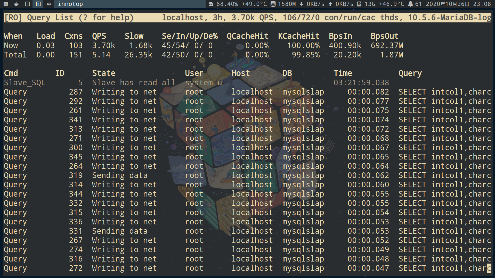
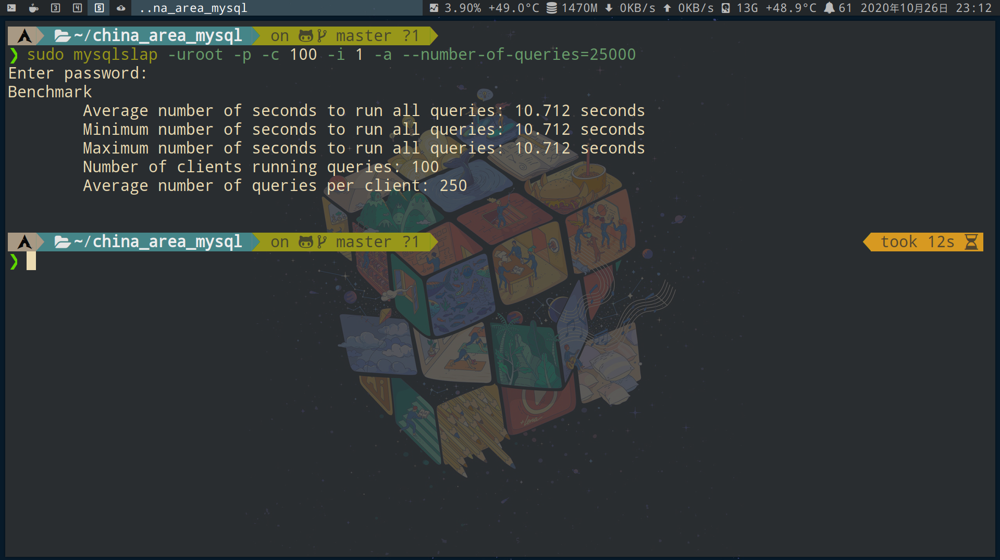

### [dbatool](https://github.com/xiepaup/dbatools)

监控以及查询工具

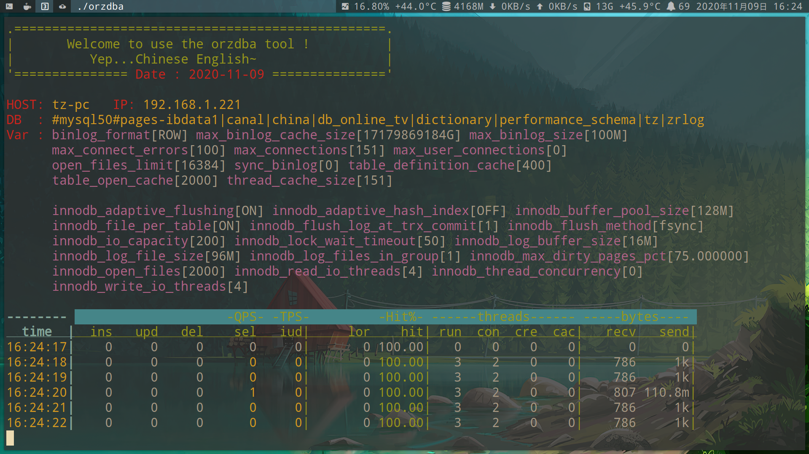

### undrop-for-innodb(\*数据恢复)

安装
[MySQL · 数据恢复 · undrop-for-innodb](http://mysql.taobao.org/monthly/2017/11/01/)
[undrop-for-innodb 实测(一)-- 表结构恢复](https://yq.aliyun.com/articles/684377)

```sh
git clone https://github.com/twindb/undrop-for-innodb.git
cd undrop-for-innodb
sudo make install
```

```sh
# 注意:目前还是在undrop-for-innodb
# 生成pages-ibdata1目录,目录下按照每个页为一个文件
stream_parser -f /var/lib/mysql/ibdata1
mkdir -p dumps/default

sudo mysql -uroot -p -e "create database dictionary"
sudo mysql -uroot -p dictionary < dictionary/*.sql

sudo ./sys_parser -uroot -p -d dictionary sakila/actor
```

### [osqueryi](https://github.com/osquery/osquery)

### [mytop](https://github.com/jzawodn/mytop)

### [MyRocks:lsm存储引擎](http://myrocks.io/docs/getting-started/)

# 安装 MySql

## Centos 7 安装 MySQL

从 CentOS 7 开始,`yum` 安装 `MySQL` 默认安装的会是 `MariaDB`

- 整个过程需要科学上网

```sh
# 下载
wget https://dev.mysql.com/get/mysql80-community-release-el7-3.noarch.rpm

# 安装源
rpm -Uvh mysql80-community-release-el7-3.noarch.rpm

# 查看安装是否成功
yum repolist enabled | grep "mysql.*-community.*"

# 查看当前MySQL Yum Repository中所有MySQL版本(每个版本在不同的子仓库中)
yum repolist all | grep mysql

# 切换版本
yum-config-manager --disable mysql80-community
yum-config-manager --enable mysql57-community

# 安装
yum install mysql-community-server
```

<span id="docker"></span>

## [docker 安装](https://www.runoob.com/docker/docker-install-mysql.html)

```sh
# 下载镜像
docker pull mysql:latest

# 查看本地镜像
docker images

# -p端口映射
docker run -itd --name mysql-tz -p 3306:3306 -e MYSQL_ROOT_PASSWORD=YouPassword mysql

# 查看运行镜像
docker ps

#进入容器
docker exec -it mysql-tz bash

#登录 mysql
mysql -uroot -pYouPassword -h 127.0.0.1 -P3306
```

## 常见错误

- 日志目录`/var/lib/mysql`

### 登录错误

```sh
mysql -uroot -p
ERROR 1045 (28000): Access denied for user 'root'@'localhost' (using password: YES)
```

#### 修复

```sh
# 在[mysqld]后添加skip-grant-tables(登录时跳过权限检查)
echo "skip-grant-tables" >> /etc/my.cnf
```

```sql
# 连接数据库
mysql -uroot -p
use mysql;

# 刷新权限
flush privileges;

# 修改密码(8以下的版本)
update mysql.user set password=PASSWORD('newpassword') where User='root';
# 修改密码(8以上的版本)
alter user 'root'@'localhost' identified by 'newpassword';
```

##### 修改密码成功后

```sh
# 删除刚才添加skip-grant-tables
sed -i '/skip-grant-tables/d' /etc/my.cnf

# 重新连接
mysql -uroot -p
```

##### 如果出现以下报错(密码不满足策略安全)

```sql
mysql> alter user 'root'@'localhost' identified by 'newpassword';
ERROR 1819 (HY000): Your password does not satisfy the current policy requirements
```

###### 修复

```sql
# 查看密码策略
SHOW VARIABLES LIKE 'validate_password%';

mysql> SHOW VARIABLES LIKE 'validate_password%';
+--------------------------------------+--------+
| Variable_name                        | Value  |
+--------------------------------------+--------+
| validate_password.check_user_name    | ON     |
| validate_password.dictionary_file    |        |
| validate_password.length             | 8      |
| validate_password.mixed_case_count   | 1      |
| validate_password.number_count       | 1      |
| validate_password.policy             | MEDIUM |
| validate_password.special_char_count | 1      |
+--------------------------------------+--------+

# 设置策略为LOW
set global validate_password.policy='LOW';

# 密码修改成功
mysql> alter user 'root'@'localhost' identified by 'newpassword';
Query OK, 0 rows affected (0.52 sec)
```

### ERROR 2013 (HY000): Lost connection to MySQL server during query(导致无法 stop slave;)

**修复:**

```sql
[mysqld]
skip-name-resolve
```

### ERROR 2002 (HY000): Can't connect to local MySQL server through socket '/var/run/mysqld/mysqld.sock' (111)(连接不了数据库)

- `systemctl restart mysql` 重启配置没问题
- `ps aux | grep mysql` 进程存在
- 内存不足

### ERROR 1075 (42000): Incorrect table definition; there can be only one auto column and it must be defined

```sql
# 要先删除 auto_incrment 属性,才能删除主健(我这里的主健是 id 字段)
alter table test modify id int(10);
alter table test drop primary key;
```

### 启动错误

```sh
● mariadb.service - MariaDB 10.5.8 database server
     Loaded: loaded (/usr/lib/systemd/system/mariadb.service; enabled; vendor preset: disabled)
     Active: failed (Result: exit-code) since Sun 2020-11-29 10:05:15 CST; 10min ago
       Docs: man:mariadbd(8)
             https://mariadb.com/kb/en/library/systemd/
    Process: 11236 ExecStartPre=/bin/sh -c systemctl unset-environment _WSREP_START_POSITION (code=exited, status=0/SUCCESS)
    Process: 11237 ExecStartPre=/bin/sh -c [ ! -e /usr/bin/galera_recovery ] && VAR= ||   VAR=`cd /usr/bin/..; /usr/bin/galera_recovery`; [ $? -eq 0 ]   && systemctl set-environment _WSREP_START_POSITION=$VAR || exit 1 (code=exited, status=0/SUCCESS)
    Process: 11246 ExecStart=/usr/bin/mariadbd $MYSQLD_OPTS $_WSREP_NEW_CLUSTER $_WSREP_START_POSITION (code=exited, status=1/FAILURE)
   Main PID: 11246 (code=exited, status=1/FAILURE)
     Status: "MariaDB server is down"
```

解决:

```sh
# 先删除目录
mv /var/lib/mysql /tmp
# 初始化
mysql_install_db --user=mysql --basedir=/usr --datadir=/var/lib/mysql
```

## 极限值测试

看看一个表最多是不是 1017 列:

```sh
# 通过脚本快速生成1017.sql
echo 'drop table if exists test_1017;' > /tmp/1017.sql

echo 'CREATE TABLE test_1017(' >> /tmp/1017.sql

for i in $(seq 1 1016);do
    echo "id_$i int," >> /tmp/1017.sql
done
echo "id_1017 int" >> /tmp/1017.sql

echo ");" >> /tmp/1017.sql

# 执行
sudo mysql -uroot -pYouPassword YouDatabase < /tmp/1017.sql
```

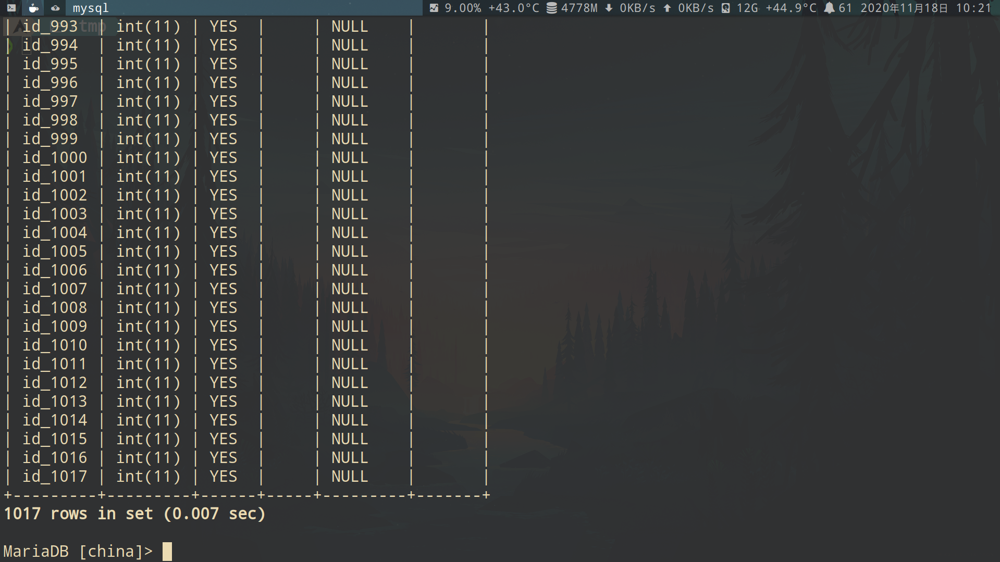

改为 1018:

```sh
# 通过脚本快速生成1018.sql
echo 'drop table if exists test_1018;' > /tmp/1018.sql

echo 'CREATE TABLE test_1018(' >> /tmp/1018.sql

for i in $(seq 1 1017);do
    echo "id_$i int," >> /tmp/1018.sql
done
echo "id_1018 int" >> /tmp/1018.sql

echo ");" >> /tmp/1018.sql

# 执行
sudo mysql -uroot -pYouPassword YouDatabase < /tmp/1018.sql
```


## benchmark(基准测试)

- 测试原则:

    - 基准测试应该运行足够长的时间(8 - 12小时), 因为系统可能需要3, 4个小时的io预热, 如果没有时间去完成, 那么已经花费的时间都是浪费

    - 测试结果保证可重复:每次测试都重启系统, 以及对测试的磁盘分区进行格式化, 数据的碎片度会导致测试结果不能重复

    - 不能用cpu密集性的标准去测试io密集性的应用

- 测试指标:

    - 并发度:是一个测试属性, 而不是一个测试结果. 在并发度增加时需要观察**吞吐量**, **响应时间**

        - 注意:web站点有50000个用户同时访问时, mysql可能只有10 - 15个访问

- 通过md5(), sha1()函数快速测试(不能用作基准测试):

    ```sql
    set @input := 'hello world';
    select benchmark(10000, MD5(@input));
    select benchmark(10000, SHA1(@input));
    ```

- 在性能下跌时可以使用以下命令:

    ```sql
    show engine innodb status\G;

    # 查看线程状态
    show full processlist;
    ```

### [sysbench](https://github.com/akopytov/sysbench)

- 优点:

    - sysbench的io测试与innodb的io非常相识

    - 支持lua语言

- cpu测试:

    ```sql
    sysbench --test=cpu --cpu-max-prime=20000 run
    ```

- io测试:

    | mode(测试模式) | 测试内容 |
    |----------------|----------|
    | seqwr          | 顺序写入 |
    | seqrewr        | 顺序重写 |
    | seqrd          | 顺序读取 |
    | rndrd          | 随机写入 |
    | rndwr          | 随机读取 |
    | rndrw          | 随机读写 |

    ```sql
    # 生成数据文件, 注意文件必须比内存大
    sysbench --test=fileio --file-total-size=100G prepare

    # rndrw:随机读写io测试
    sysbench --test=fileio --file-total-size=100G prepare --file-test-mode=rndrw/ --init-rng=on --max-time=300 --max-requests=0

    # 删除数据文件
    sysbench --test=fileio --file-total-size=100G cleanup
    ```
## [日志](/mysql-log.md)

## [存储引擎](/mysql-storage-engine.md)

## 设计规范

- [CTO 要我把这份 MySQL 规范贴在工位上！](https://mp.weixin.qq.com/s?src=11&timestamp=1605361738&ver=2706&signature=wzhghhJTTx1Hy9Nn90P35u9hfG3eaeMGOvIoDoBGTECHdDQAmUuxFCVHAbuUqaN4*UYga9bGdXxX3f1G8kiYZ1yoA4tnocgi8GZoRe2TNQFkbbh1T2eSqyC6DcA9bTqF&new=1)

### 基本规范

- 禁止在数据库中存储图片,文件等大的二进制数据

    - 文件过大,在短时间内会造成数据量快速增长

    - 读取时, 会造成大量的随机 IO 操作

- 禁止对线上数据库做压力测试

# reference

- [mysqltutorial](https://www.mysqltutorial.org/)
- [MySQL 入门教程](https://github.com/jaywcjlove/mysql-tutorial)
- [sql 语句教程](https://www.1keydata.com/cn/sql/)
- [W3cSchool SQL 教程](https://www.w3school.com.cn/sql/index.asp)
- [138 张图带你 MySQL 入门](https://mp.weixin.qq.com/s?src=11&timestamp=1603417035&ver=2661&signature=Z-XNfjtR11GhHg29XAiBZ0RAiMHavvRavxB1ccysnXtAKChrVkXo*zx3DKFPSxDESZ9lwRM7C8-*yu1dEGmXwHgv1qe7V-WvwLUUQe7Nz7RUwEuJmLYqVRnOWtONHeL-&new=1)

- [厉害了,3 万字的 MySQL 精华总结 + 面试 100 问！](https://mp.weixin.qq.com/s?src=11&timestamp=1603207279&ver=2656&signature=PlP1Ta3EiPbja*mclBpkiUWyCM93jx7G0DnE4LwwlzEvW-Fd9hxgIGq1*5ctVid5AZTssRaeDRSKRPlOGOXJfLcS4VUlru*NYhh4BrhZU4k91nsfqzJueeX8kEptSmfc&new=1)
- [mysql 存储过程详细教程](https://www.jianshu.com/p/7b2d74701ccd)

- [一文彻底读懂 MySQL 事务的四大隔离级别](https://mp.weixin.qq.com/s?src=11&timestamp=1605864322&ver=2718&signature=yj-1WmxuB0tL32v9OCfARl9LKeAqALuoFdmMgiJdyKjkgqeFwvGgJT10hOWiPj0Vn3qalU3-5AEsaoiHI8TTg3GL3s8rPmC7rXZkbu22VZcFcV48aa7sPiqw*Y3yAaC5&new=1)

# 第三方资源

- [awesome-mysql](http://shlomi-noach.github.io/awesome-mysql/)

    - [中文版](https://github.com/jobbole/awesome-mysql-cn)

# 新闻资源

- [MySQL Server Blog](http://mysqlserverteam.com/)

# online tools

- [创建数据库的实体-关系图的工具 dbdiagram](https://dbdiagram.io)
