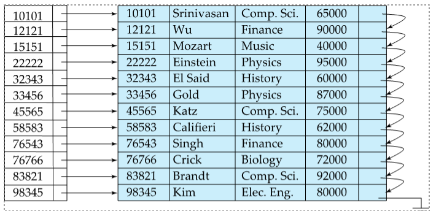
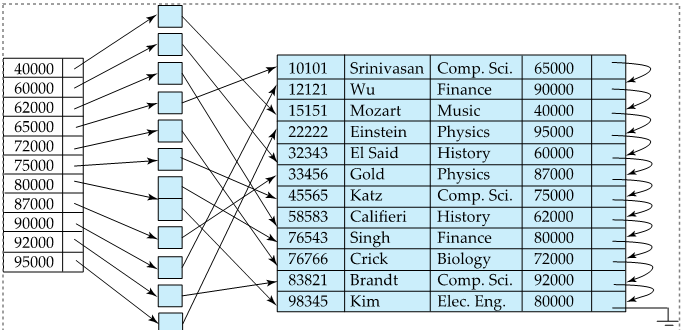
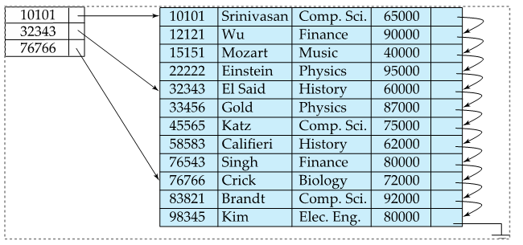
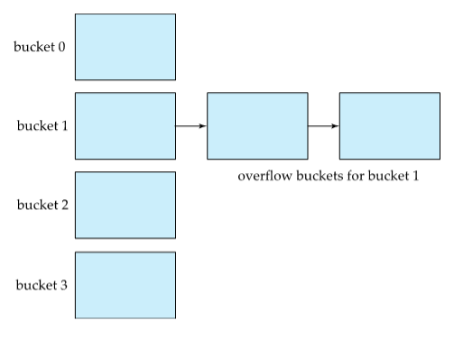
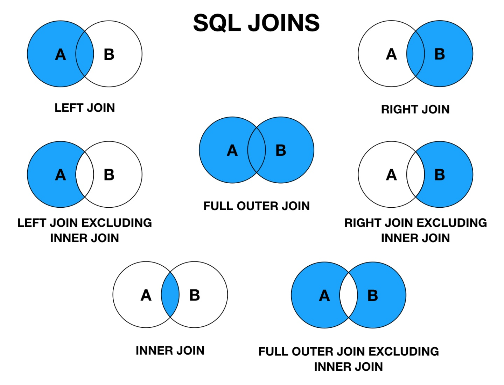
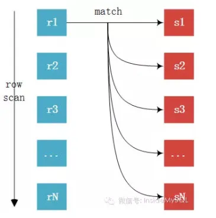
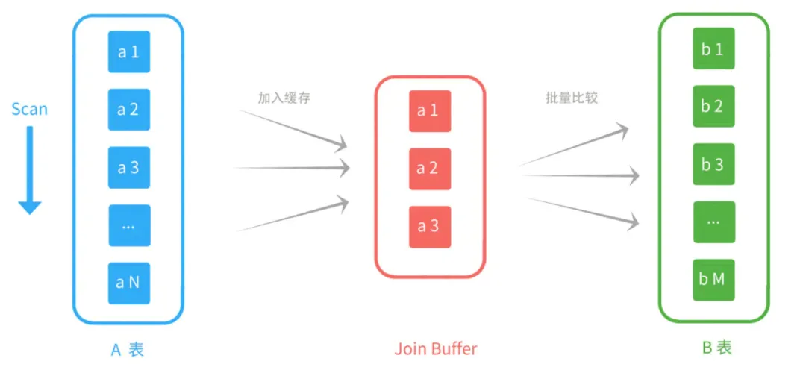
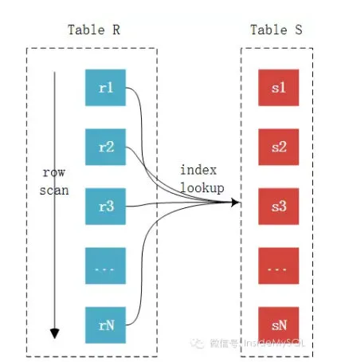
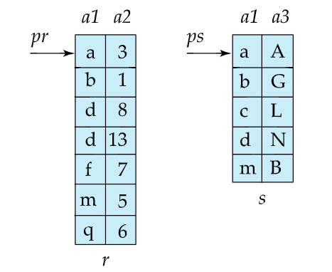
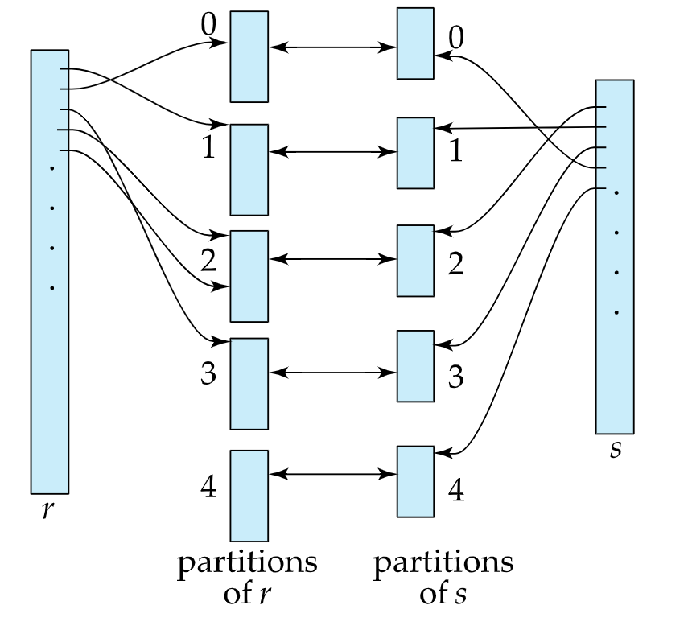

# RDBMS (关系性数据库)

## 基本理论

- 结构化存储(structured storage systems): 强调`Consistency`(一致性)

  - SQL语句并不区分大小写

  - 关系模型在逻辑层和视图层描述数据,不必关注数据存储的底层细节

    - 元组指 行

    - 属性指 列

    - 关系指 表

      - 关系是元组(行)的集合,但和元组的排列顺序没关

    - 关系模式:由属性(列)组成,数据库的逻辑设计

    - 关系实例:数据库的数据值

      - 关系模式不会发生变化,而关系实例会随时间变化
- 查询

  - 过程化语言

    - 以计算为操作的结果

    - 从单个关系中(id),选出满足一定条件的特殊元组(> 10)

      ```sql
      select * from cnarea_2019
      where id > 100
      ```

    - 从单个关系中,选出特定的属性(id)

      ```sql
      select id from cnarea_2019
      ```

    - 两种计算:id > 100,选出 id,name 属性

      ```sql
      select id,name from cnarea_2019
      where id > 100
      ```

    - 连接合并多个关系的元组

  - 非过程化语言

## SQL index(索引)

- 搜索码:查找记录的属性(列)或者属性集

- clustering index(聚集索引或primary index主索引): 搜索码按指定顺序排序

- no clustering index(非聚集索引或secondary index辅助索引): 搜索码按指定顺序排序

- 无论任何形式的索引, 面对插入和删除操作, 都需要更新

- dense index(稀疏索引): 按顺序存储部分搜索码, 因此**只有clusteriing index才能使用dense index**

   - 插入和删除

       - 如果是按顺序出现的第一个搜索码: 按顺序插入或删除

       - 否则: 不操作

    
    

- sparse index(稠密索引): 每个搜索码都有一个索引项,每条索引项都是指针, 因此**no clustering index必须是sparse index**

    - 插入:

        - 如果没有搜索码: 找到合适的位置插入

        - 如果有相同的搜索码: 则在索引项增加指向该记录的指针

    - 删除:

        - 如果指向相同搜索码的第一条记录指针: 删除这条记录, 更新索引项指向下一条记录

    

- mulitilevel index (多级索引): 两极或以上的索引. 在很大的原始索引上构造一层dense index的外层索引

    - 10000个块的索引, 二分搜索需要14次(log2(b)), 平均每次10毫秒读取一块, 那么需要140毫秒

    - 利用多级索引: 10000个块需要10000个索引项, 也就是100个块, 大大减少磁盘IO

### 索引数据结构

### B+树(平衡数)

- B树只允许搜索码出现一次

- B树有时不需要达到叶结点就能获取值

- B树的删除更加复杂, 有可能在非叶结点

- B+树胖和矮, 而二叉树高和瘦

    - 结点大小一般等同于磁盘块大小4KB

    - 假设搜索码=32B, n=100, 搜索码的值N = 100万, 一次查询只需要访问4个结点**(log[n/2] N)**

    - 平衡二叉树则是**(log2 N)**: 需要访问20个结点

- 叶结点:最多 `n-1` 个值, 最少 `(n-1)/2` 个值. 假设 n=4 叶结点最少包含2个, 最多3个值. 叶结点采用链表按顺序相连

- nonleaf node(非叶结点):最多 `n` 个指针, 最少 `n/2` 个指针. 形成对叶结点的多级稀疏索引, 不同于多索引顺序文件, 结点的指针数也叫**扇出**

- 插入和删除有可能会导致**分裂**, **合并**

    - 假设搜索码没有重复值, 最坏情况的删除复杂度是**log[n/2] N**

    - 随着树中不断的插入和删除, 会丧失IO的顺序性, 因此为了恢复顺序性需要重建索引

- 字符串索引的prefix compression(前缀压缩)技术: 非叶结点不需要存储完整的值, 只需存储前缀

    - 假设silberschatz的子树silas, silver. 只需存储前缀sil, 而不是存储silberschatz

- 对于不唯一搜索码, B+树会存储多次

### hash散列函数

> 理想的散列函数均匀的分布到所有的桶里, 使每个桶具有相同的记录

- 桶: 存储一条或多条记录, 桶大小一般等同于磁盘块

- 假设以工资为搜索码, 在1000-3000的记录的桶, 比 3000-6000的记录的桶多, 分布不均匀

- 桶溢出:

    - close addressing(闭地址): 假设3000-6000桶已经满了, 新插入的记录会添加到新桶里,以此类推. 3000-6000的桶与溢出桶使用链表连接在一起

    
    - open addressing(开地址): 假设3000-6000桶已经满了, 新插入的记录会添加到其它桶里. 删除操作很麻烦, 所以一般应用于只做查找, 插入的编译器符号表

- 动态散列: 通过桶的分裂, 合并适应数据库大小的变化. 性能不会随着数据库的增长而降低

- 维护一个中间层: 桶地址表

### 顺序索引与散列索引对比

- 此查询: 散列更优
```sql
SELECT A1, A2...An
FROM r
WHERE Ai = c
```

    - 顺序索引: 与关系r的Ai个数的对数成正比
    - 散列索引: 一个和数据库大小无关的常数

- 范围查询: 顺序更优
```sql
SELECT A1, A2...An
FROM r
WHERE Ai < c2 and Ai > c1
```

    - 顺序索引: 一旦找到c1就可以按顺序读取直到c2
    - 散列索引: 值是随机分布到不同的桶

### 位图索引

- 多码索引

- 位图索引很小, 大概是整个关系的1%

- 位图索引删除记录的代价很大, 一般在末尾添加新的记录

    - existence bitmap(存在位图): 通过位图中的1位, 当值为0时表示不存在

- 此查询: 计算A2, A1两个位图的交(与门), 如果有多条记录满足此条件, 则需要扫描整个关系
```sql
SELECT A1, A2...An
FROM r
WHERE A2 = c2 and A1 = c1
```


## JOIN(关联查询): 改变表关系

- [数据库表连接的简单解释](http://www.ruanyifeng.com/blog/2019/01/table-join.html?utm_source=tuicool&utm_medium=referral)

- [图解 SQL 里的各种 JOIN](https://zhuanlan.zhihu.com/p/29234064)

- [MySQL 的 join 功能弱爆了？](https://zhuanlan.zhihu.com/p/286581170)

### 基本概念

从两个或更多的表中获取结果.[图解 SQL 里的各种 JOIN](https://zhuanlan.zhihu.com/p/29234064)

- 只返回两张表匹配的记录,这叫内连接(inner join)
- 返回匹配的记录,以及表 A 多余的记录,这叫左连接(left join)
- 返回匹配的记录,以及表 B 多余的记录,这叫右连接(right join)
- 返回匹配的记录,以及表 A 和表 B 各自的多余记录,这叫全连接(full join)




### join的实现

Nested-Loop Join(嵌套循环连接)

- Nested-Loop Join 区分驱动表和被驱动表,先访问驱动表,筛选出结果集,然后将这个结果集作为循环的基础,访问被驱动表过滤出需要的数据

- 被驱动表(内层表)只需一次磁盘搜索

#### SNLJ(简单嵌套循环):

- 驱动表的结果集作为循环基础数据: 从结果集取出一条条数据(图中的R1, R2...)与被驱动表(图中的S1, S2)一一匹配(Sn次), 然后合并数据

- 对于表r的每一条记录, 需要对表s作完整的搜索. 代价很大




#### 代价分析

- 假设合并student和takes两个表

    | 行数和磁盘数    | 数量  |
    |-----------------|-------|
    | student行数     | 5000  |
    | student磁盘块数 | 100   |
    | takes行数       | 10000 |
    | takes磁盘块数   | 400   |

    - Nr: r表的行数
    - Ns: s表的行数
    - Br: r表的磁盘块数
    - Bs: s表的磁盘块数

- 最好的情况: 内存能容纳两个表

    - (Br + Bs)块的传输次数 + 两次磁盘搜索

    - `students磁盘块 + takes磁盘块 + 两次磁盘搜索` = `100 + 400 + 两次磁盘搜索`

- 最坏的情况: 内存只能容纳一个数据块

    - (Nr * Bs + Br)块的传输次数 + (Nr + Br)磁盘搜索次数

    - 假设student是外层循环, takes是内层循环:

        - `students行数 * takes磁盘块 + students行数 + students磁盘块` = `5000 * 400 + 5000 + 100`

    - 假设takes是外层循环, student是内层循环:

        - `10000 * 100 + 10000 + 400`

    - 两者对比: 假设块传输0.1毫秒, 磁盘搜索4毫秒

        - student为外层:2000100块传输 + 5100磁盘搜索

            - 200010 + 20400 = 220410

        - takes为外层:1000400块传输 + 10400磁盘搜索

            - 块的传输少了, 但磁盘搜索多了

            - 100040 + 41600 = 141640

        - takes虽然记录和块更多, 但作为外层更优

#### block nested-loop(块嵌套循环):

- MySQL

    - 加入了join buffer: 缓存 join 需要的字段, 降低了循环的次数,也就是被驱动表的扫描次数

    - MySQL 默认 buffer 大小 256K,如果有 n 个 join 操作,会生成 n-1 个 join buffer



#### 代价分析

- 内层表的每一块与外层表的每一块形成一对

    - 块中的行与另一个块中的行形成行对

- 最好的情况: 和简单循环一样 `100 + 400 + 两次磁盘搜索`

- 最坏的情况: 内外层表的每一块都只需读取一次

    - (Br * Bs + Br)块传输 + (2br)磁盘搜索

    - 100 * 400 + 100 + 2 * 100

    - 40100次块传输 + 200次磁盘搜索

    - 对比简单嵌套: 假设块传输0.1毫秒, 磁盘搜索4毫秒

        - 4010 + 800 = 4810毫秒

        - 比简单嵌套优

#### INLJ(索引嵌套循环):

- 一般行数少的作驱动表(外层表)



#### 代价分析

- 最坏的情况: 内存只能容纳一个数据块

    - 假设student是外层循环, takes是内层循环:

       - (Hs + 1): 假设每个结点为20个索引, takes有10000行, 那么高度为4, 存储数据还需要一次磁盘访问, 因此是(4 + 1)

       - Br + Nr * (Hs + 1) = 100 + 5000 * 5

       - 25100次磁盘搜索和块传输

    - 对比简单嵌套和块嵌套: 假设块传输0.1毫秒, 磁盘搜索4毫秒

        - 2510 + 100400 = 102910

        - 比简单嵌套优, 但比块嵌套差

            - 除非student表上的某一列行数显著减少, 那么可以比块嵌套更优

#### merge join(归并连接)

- 先排序, 再为每个表分配一个指向第一行的指针, 指针会遍历整个表



#### 代价分析

- 最好的情况已排序, 并且分配Bb(缓存块). 1Bb大小为1.6M = 400块:

    - (Br + Bs)块传输 + ([Br / Bb] + [Bs / Bb])磁盘搜索

    - 100 + 400 + 2

- 最坏的情况没有排序, 内存只能容纳3块

    - takes表:

        - 400 * (2 * [log3-1 (400 / 3)] + 1) = 6800次块传输

        - 400 * (2 * (400 / 3) + 400 * (2 * 8 -1)) + 400 = 6668次磁盘搜索

    - students表:

        - 100 * (2 * [log3-1 (100 / 3)] + 1) = 1300次块传输

        - 100 * (2 * (100 / 3) + 100 * (2 * 8 -1)) + 100 = 1264次磁盘搜索

    - 一共9100次块传输, 8932次磁盘搜索

- 假设分配1个Bb(缓存块)

    - 一共1640次磁盘搜索

- 假设分配5个Bb(缓存块)

    - 一共2500次块传输, 251次磁盘搜索

- 混合归并:
    - 假设1个表已排序, 另一个表没有排序, 但连接列有B+树的辅助索引

    - 可以把已排序的表与使用B+树辅助索引进行归并

#### hash join(散列连接)

- 表r与表s的连接条件必然会有**相同的值**

    - 假设相同的值为i, 则比较ri, si的散列值


