<!-- vim-markdown-toc GFM -->

* [Redis](#redis)
    * [许可证](#许可证)
    * [根据qps的架构部署](#根据qps的架构部署)
    * [软件架构](#软件架构)
        * [从单线程Reactor到redis6.0多线程架构演进](#从单线程reactor到redis60多线程架构演进)
        * [Redis vs Memcached](#redis-vs-memcached)
        * [Redis vs Dragonfly](#redis-vs-dragonfly)
    * [基本命令](#基本命令)
        * [遍历key命令](#遍历key命令)
        * [数据库迁移命令](#数据库迁移命令)
        * [高级技巧](#高级技巧)
    * [数据类型](#数据类型)
        * [redis的hashmap存储结构](#redis的hashmap存储结构)
        * [redis使用hashtable存储键值对](#redis使用hashtable存储键值对)
            * [rehash](#rehash)
        * [编码](#编码)
            * [ziplist编码](#ziplist编码)
            * [listpack编码](#listpack编码)
            * [intset编码](#intset编码)
        * [string (字符串)](#string-字符串)
            * [sds编码](#sds编码)
            * [string实现分布式锁](#string实现分布式锁)
            * [Bitmaps(位图)](#bitmaps位图)
        * [hash (哈希散列)](#hash-哈希散列)
        * [list (列表)](#list-列表)
        * [set (集合)](#set-集合)
            * [交集,并集,补集](#交集并集补集)
        * [zset(有序集合)](#zset有序集合)
            * [交集,并集](#交集并集)
            * [geo(地理信息定位)](#geo地理信息定位)
        * [publish subscribe (发布和订阅)](#publish-subscribe-发布和订阅)
            * [键空间通知（监控改动的键）](#键空间通知监控改动的键)
        * [streams(消息队列)](#streams消息队列)
            * [消息队列的发展](#消息队列的发展)
            * [基本命令](#基本命令-1)
        * [HyperLogLog（概率集合）](#hyperloglog概率集合)
        * [实现异步队列](#实现异步队列)
    * [Module(模块)](#module模块)
        * [RedisJSON](#redisjson)
        * [RediSearch](#redisearch)
        * [RedisBloom（布隆过滤器）](#redisbloom布隆过滤器)
        * [redis-cuckoofilter（布谷鸟过滤器）](#redis-cuckoofilter布谷鸟过滤器)
        * [docker中的redismod（包含所有模块）](#docker中的redismod包含所有模块)
    * [transaction (事务)](#transaction-事务)
    * [pipelining(流水线执行命令)](#pipelining流水线执行命令)
    * [client（客户端）](#client客户端)
        * [client list（客户端连接信息）vs info clients](#client-list客户端连接信息vs-info-clients)
            * [客户端配置](#客户端配置)
        * [RESP（与服务端通信的字符串格式）](#resp与服务端通信的字符串格式)
        * [编程语言](#编程语言)
            * [java](#java)
                * [Jedis](#jedis)
                * [Lettuce](#lettuce)
            * [python](#python)
                    * [redis-py](#redis-py)
                    * [redis-om-python: 对象模板](#redis-om-python-对象模板)
                    * [pottery:以python的语法访问redis](#pottery以python的语法访问redis)
            * [Lua 脚本](#lua-脚本)
                * [基本命令](#基本命令-2)
                * [脚本示例](#脚本示例)
    * [配置](#配置)
        * [config](#config)
            * [lazyfree模式](#lazyfree模式)
        * [info](#info)
        * [debug命令](#debug命令)
        * [ACL](#acl)
        * [远程登陆](#远程登陆)
        * [使用unix sock连接](#使用unix-sock连接)
        * [安全](#安全)
    * [persistence (持久化) RDB AOF](#persistence-持久化-rdb-aof)
        * [RDB(Redis DataBase)快照](#rdbredis-database快照)
        * [AOF(append only log)](#aofappend-only-log)
            * [AOF的实现原理](#aof的实现原理)
            * [AOFRW（重写）](#aofrw重写)
            * [redis 7.0.0的multi part AOF（多文件AOF机制）](#redis-700的multi-part-aof多文件aof机制)
            * [AOF开和关性能测试](#aof开和关性能测试)
        * [RDB和AOF持久化，如何处理过期key?](#rdb和aof持久化如何处理过期key)
        * [RDB/AOF重写子进程对性能的影响](#rdbaof重写子进程对性能的影响)
        * [RDB + AOF混合持久化](#rdb--aof混合持久化)
        * [只用作内存缓存，禁用RDB + AOF](#只用作内存缓存禁用rdb--aof)
        * [flushall/flushdb等命令误删除数据](#flushallflushdb等命令误删除数据)
        * [百度持久化方案](#百度持久化方案)
        * [Async-fork解决fork产生的阻塞](#async-fork解决fork产生的阻塞)
    * [master slave replication (主从复制)](#master-slave-replication-主从复制)
        * [主从建立过程](#主从建立过程)
        * [主从复制过程](#主从复制过程)
        * [心跳](#心跳)
        * [redis 4.0 PSYNC2 方案](#redis-40-psync2-方案)
        * [redis 6.0 无盘全量复制和无盘加载](#redis-60-无盘全量复制和无盘加载)
        * [redis 7.0 共享主从复制缓冲区](#redis-70-共享主从复制缓冲区)
        * [百度智能云 Redis PSYNC-AOF 方案](#百度智能云-redis-psync-aof-方案)
        * [Redis2.8-4.0过期key策略，主从不一致的优化历程](#redis28-40过期key策略主从不一致的优化历程)
        * [内存满后逐出策略，主从不一致](#内存满后逐出策略主从不一致)
        * [一些问题和注意事项](#一些问题和注意事项)
    * [sentinel (哨兵模式)](#sentinel-哨兵模式)
        * [sentinal的配置](#sentinal的配置)
        * [sentinel演示](#sentinel演示)
        * [专属API](#专属api)
        * [实现原理](#实现原理)
        * [slave（从节点）高可用](#slave从节点高可用)
        * [脑裂问题](#脑裂问题)
    * [cluster (集群)](#cluster-集群)
        * [集群功能限制](#集群功能限制)
        * [手动建立集群](#手动建立集群)
            * [节点握手](#节点握手)
            * [分配槽（slot）](#分配槽slot)
        * [自动建立集群](#自动建立集群)
            * [演示](#演示)
        * [Gossip通信协议](#gossip通信协议)
        * [集群的扩容和收缩](#集群的扩容和收缩)
            * [扩容](#扩容)
            * [收缩](#收缩)
        * [key的重定向](#key的重定向)
            * [Smart客户端](#smart客户端)
        * [故障转移](#故障转移)
            * [日志演示](#日志演示)
            * [手动故障转移](#手动故障转移)
        * [集群倾斜](#集群倾斜)
        * [单机redis数据迁移到cluster](#单机redis数据迁移到cluster)
        * [常见问题](#常见问题)
    * [调试和性能测试和优化](#调试和性能测试和优化)
        * [网络延迟](#网络延迟)
        * [阻塞](#阻塞)
            * [jedis发现阻塞](#jedis发现阻塞)
            * [slowlog(慢查询日志)](#slowlog慢查询日志)
            * [mysql 存储redis慢查询日志](#mysql-存储redis慢查询日志)
            * [客户端周期性连接超时](#客户端周期性连接超时)
            * [cpu](#cpu)
            * [持久化阻塞](#持久化阻塞)
            * [网络问题](#网络问题)
        * [设置CPU亲缘性（affinity）优化](#设置cpu亲缘性affinity优化)
        * [理解内存](#理解内存)
            * [内存的消耗](#内存的消耗)
            * [内存管理](#内存管理)
            * [内存优化](#内存优化)
        * [死键](#死键)
        * [处理大key（bigkey）](#处理大keybigkey)
            * [怎么产生](#怎么产生)
            * [危害](#危害)
            * [发现bigkey](#发现bigkey)
            * [解决方法](#解决方法)
            * [如何删除](#如何删除)
            * [vivo例子](#vivo例子)
        * [寻找热key（hotkey）](#寻找热keyhotkey)
        * [linux相关的性能配置](#linux相关的性能配置)
        * [监控](#监控)
            * [监控指标](#监控指标)
            * [cachecloud](#cachecloud)
            * [Grafana](#grafana)
        * [生产环境排查案例](#生产环境排查案例)
            * [版本升级实践](#版本升级实践)
            * [腾讯云开发者：Redis：你永远不知道告警和下班，谁先到来](#腾讯云开发者redis你永远不知道告警和下班谁先到来)
            * [记一次Ziplist导致Redis Core Dump分析](#记一次ziplist导致redis-core-dump分析)
            * [集群在做了一个前缀删除后，耗时涨了3倍](#集群在做了一个前缀删除后耗时涨了3倍)
    * [缓存（cache）](#缓存cache)
        * [缓存穿透、缓存雪崩、缓存击穿](#缓存穿透缓存雪崩缓存击穿)
        * [缓存无底洞问题：更多的节点不代表更高的性能](#缓存无底洞问题更多的节点不代表更高的性能)
        * [缓存一致性问题](#缓存一致性问题)
            * [最终一致性策略](#最终一致性策略)
            * [强一致性策略](#强一致性策略)
        * [如何减少缓存删除/更新的失败？](#如何减少缓存删除更新的失败)
        * [如何处理复杂的多缓存场景？](#如何处理复杂的多缓存场景)
        * [缓存策略设计](#缓存策略设计)
    * [redis正确使用](#redis正确使用)
        * [命令使用](#命令使用)
        * [客户端使用](#客户端使用)
        * [键值设计](#键值设计)
            * [登录系统。用户表](#登录系统用户表)
            * [tag系统。book表](#tag系统book表)
* [k8s](#k8s)
* [redis 安装](#redis-安装)
    * [centos7 安装 redis6.0.9](#centos7-安装-redis609)
    * [docker install](#docker-install)
* [其他版本的redis](#其他版本的redis)
    * [各大厂商的cluster（集群）方案](#各大厂商的cluster集群方案)
        * [proxy代理层](#proxy代理层)
        * [基于官方 redis cluster 的方案](#基于官方-redis-cluster-的方案)
    * [Redis Enterprise](#redis-enterprise)
    * [实现方案对比](#实现方案对比)
    * [Kvrocks](#kvrocks)
    * [阿里云的Tair](#阿里云的tair)
        * [数据类型](#数据类型-1)
        * [string](#string)
        * [TairString](#tairstring)
        * [TairHash](#tairhash)
        * [TairZset](#tairzset)
    * [腾讯云的Tendis](#腾讯云的tendis)
    * [百度云的PegaDB](#百度云的pegadb)
    * [小红书的RedKV](#小红书的redkv)
    * [美团的两套自研kv数据库](#美团的两套自研kv数据库)
        * [Squirrel](#squirrel)
        * [Cellar](#cellar)
    * [得物的redis](#得物的redis)
    * [滴滴的redis](#滴滴的redis)
* [第三方 redis 软件](#第三方-redis-软件)
    * [服务端](#服务端)
        * [redis-benchmark性能测试](#redis-benchmark性能测试)
        * [vire-benchmark：虚拟测试](#vire-benchmark虚拟测试)
        * [redis-rdb-tools：分析bigkey](#redis-rdb-tools分析bigkey)
        * [redis-port：分析rdb，可以在master和slave进行同步](#redis-port分析rdb可以在master和slave进行同步)
        * [redis-shake：在两个 redis 之间同步数据的工具，满足用户非常灵活的同步、迁移需求](#redis-shake在两个-redis-之间同步数据的工具满足用户非常灵活的同步迁移需求)
        * [redis-faina：facebook开发的通过MONITOR命令，统计hotkey](#redis-fainafacebook开发的通过monitor命令统计hotkey)
        * [京东hotkey中间件方案：proxy缓存+热点数据的发现与存储](#京东hotkey中间件方案proxy缓存热点数据的发现与存储)
        * [twemproxy：推特开发的集群代理层](#twemproxy推特开发的集群代理层)
        * [codis：豌豆荚开发的集群代理层](#codis豌豆荚开发的集群代理层)
        * [redis-migrate-tool：集群迁移工具](#redis-migrate-tool集群迁移工具)
    * [客户端](#客户端)
        * [iredis: 比redis-cli更强大](#iredis-比redis-cli更强大)
        * [redis-tui](#redis-tui)
        * [redis-memory-analyzer](#redis-memory-analyzer)
        * [RedisInsight: 官方推出的gui, 并且带有补全的cli](#redisinsight-官方推出的gui-并且带有补全的cli)
        * [AnotherRedisDesktopManager: gui](#anotherredisdesktopmanager-gui)
        * [tiny-rdm：gui](#tiny-rdmgui)
        * [RedisLive: 监控可视化](#redislive-监控可视化)
        * [dbatools](#dbatools)
* [reference](#reference)
* [online tool](#online-tool)

<!-- vim-markdown-toc -->

# Redis

## 许可证

- Redis从 7.4 起从原来的「BSD 3-Clause 开源协议」改成「RSALv2 和 SSPLv1 双重许可证」

    - 新的许可证主要是限制托管 Redis 产品的云服务商，比如 Redis 云数据库等，不能继续免费使用 Redis 最新的源代码。

        - 用 Redis Labs CEO 的话讲就是：“多年来，我们就像个傻子一样，他们拿着我们开发的东西大赚了一笔”。“他们”是谁？—— 公有云。Redis 切换 SSPL 的目的是，试图通过法律工具阻止这些云厂商白嫖吸血开源，成为体面的社区参与者，将软件的管理、监控、托管等方面的代码开源回馈社区。

    - 因为引入了额外的限制与所谓的“歧视”条款，OSI 并没有将 SSPL 认定为开源协议。因此使用 SSPL 的举措被解读为 —— “Redis 不再开源”，而云厂商的各种 Fork 是“开源”的。从法律工具的角度来说，这是成立的。但从朴素道德情感出发，这样的说法对于 Redis 来说是极其不公正的抹黑与羞辱。

    - 当 Redis 宣布更改协议后，马上就有 AWS 员工跳出来 Fork Redis —— “Redis 不开源了，我们的分叉才是真开源！” 然后 AWS CTO 出来叫好，并假惺惺地说：这是我们员工的个人行为 —— 堪称是现实版杀人诛心。

        - 被这样搞过的并非只有 Redis 一家。发明 SSPL 的 MongoDB 也是这个样子 —— 当 2018 年 MongoDB 切换至 SSPL 时，AWS 就搞了一个所谓 “API兼容“ 的 DocumentDB 来恶心它。ElasticSearch 修改协议后，AWS 就推出了 OpenSearch 作为替代。头部 NoSQL 数据库都已经切换到了 SSPL，而 AWS 也都搞出了相应的“开源替代”。

- 微软发布了一个兼容 Redis 的缓存服务器 [Garnet](https://github.com/microsoft/garnet)

- Redis 现在也被分叉了，诞生了两个全新的项目 [Redict](https://redict.io/) 和 [Valkey](https://github.com/valkey-io/valkey)，目标是成为自由软件版本的 Redis。

## 根据qps的架构部署

- 25w/qps
    - 机器标准:8 核+32G
    - 集群: 5 主+5 从(每个 master 都挂一个 slave)
    - 效果: 每台机器最高峰每秒大概 5W，5 台机器最多就是 25W，每个 master 都有一个从节点，任何一个节点挂了都有备份可切换成主节点进行故障转移

## 软件架构

- [腾讯云开发者：一文读懂 Redis 架构演化之路](https://cloud.tencent.com/developer/article/2217614)

- [深入学习Redis（1）：Redis内存模型](https://www.cnblogs.com/kismetv/p/8654978.html)

    > 内存, 数据类型

### 从单线程Reactor到redis6.0多线程架构演进

- [刘Java：Redis 的线程模型—文件事件处理器的详解](https://juejin.cn/post/7109446432116981796)

- [刘Java：Redis 6.0 引入的多线程机制简介](https://juejin.cn/post/7109841068669009933)

- [腾讯技术工程: Redis 多线程网络模型全面揭秘](https://segmentfault.com/a/1190000039223696)

- [Redis开发运维实战：Redis6.0解密-1.Thread/IO多线程]()


- Redis6之前的Redis并不是单线程程序。通常我们说的Redis的单线程，是指Redis接受链接，接收数据并解析协议，发送结果等命令的执行，都是在主线程中执行的。

    - Redis 在启动的时候，是会启动后台线程（BIO）的
        - Redis 在 2.6 版本，会启动 2 个后台线程，分别处理关闭文件、AOF 刷盘这两个任务
        - Redis 在 4.0 版本之后，新增了一个新的后台线程，用来异步释放 Redis 内存，也就是 lazyfree 线程。

    - 之所以 Redis 为「关闭文件、AOF 刷盘、释放内存」这些任务创建单独的线程来处理，是因为这些任务的操作都是很耗时的，如果把这些任务都放在主线程来处理，那么 Redis 主线程就很容易发生阻塞，这样就无法处理后续的请求了。

    - 后台线程相当于一个消费者，生产者把耗时任务丢到任务队列中，消费者（BIO）不停轮询这个队列，拿出任务就去执行对应的方法即可。

        

- 演进：

    - Redis6.0之前：单线程 Reactor 网络模型

        

        - 蓝色部分是一个事件循环，是由主线程负责的，可以看到网络 I/O 和命令处理都是单线程。

            - Redis 初始化的时候，会做下面这几件事情：
                - 首先，调用 epoll_create() 创建一个 epoll 对象和调用 socket() 创建一个服务端 socket
                - 然后，调用 bind() 绑定端口和调用 listen() 监听该 socket；
                - 然后，将调用 epoll_ctl() 将 listen socket 加入到 epoll，同时注册「连接事件」处理函数。

            - Redis 初始化完后，主线程就进入到一个事件循环函数，主要会做以下事情

                - 首先，先调用处理发送队列函数，看是发送队列里是否有任务，如果有发送任务，则通过 write 函数将客户端发送缓存区里的数据发送出去，如果这一轮数据没有发送完，就会注册写事件处理函数，等待 epoll_wait 发现可写后再处理 。

                - 接着，调用 epoll_wait 函数等待事件的到来：

                    - 如果是连接事件到来，则会调用连接事件处理函数，该函数会做这些事情：调用 accpet 获取已连接的 socket ->  调用 epoll_ctl 将已连接的 socket 加入到 epoll -> 注册「读事件」处理函数；
                    - 如果是读事件到来，则会调用读事件处理函数，该函数会做这些事情：调用 read 获取客户端发送的数据 -> 解析命令 -> 处理命令 -> 将客户端对象添加到发送队列 -> 将执行结果写到发送缓存区等待发送；
                    - 如果是写事件到来，则会调用写事件处理函数，该函数会做这些事情：通过 write 函数将客户端发送缓存区里的数据发送出去，如果这一轮数据没有发送完，就会继续注册写事件处理函数，等待 epoll_wait 发现可写后再处理 。

        - 对于一个 DB 来说，CPU 通常不会是瓶颈，因为大多数请求不会是 CPU 密集型的，而是 I/O 密集型，也就是客户端和服务端之间的网络传输延迟。使用单线程的 I/O 多路复用网络模型。能带来更好的可维护性，方便开发和调试。

            - 采用单线程模型可以避免了多线程之间的竞争，多线程模型虽然在某些方面表现优异，但是它却引入了程序执行顺序的不确定性，带来了并发读写的一系列问题，增加了系统复杂度、同时可能存在线程切换、甚至加锁解锁、死锁造成的性能损耗。

            - Redis 采用了 I/O 多路复用机制处理大量的客户端 Socket 请求，IO 多路复用机制是指一个线程处理多个 IO 流，就是我们经常听到的 select/epoll 机制。简单来说，在 Redis 只运行单线程的情况下，该机制允许内核中，同时存在多个监听 Socket 和已连接 Socket。内核会一直监听这些 Socket 上的连接请求或数据请求。一旦有请求到达，就会交给 Redis 线程处理，这就实现了一个 Redis 线程处理多个 IO 流的效果。

            - 所有的操作都在一个线程中处理，如果某个 handler 阻塞时，会导致其他所有的 client 的 handler 都得不到执行，更严重的是会导致整个服务不能接收新的 client 请求 (因为 acceptor 也被阻塞了)，因为有这么多的缺陷，因此单线程 Reactor 模型用的比较少，但是却很适合 Redis 的网络模型，因为 Redis 要求保证每个操作的原子性。

        - 优点:

            - 没有并发问题, 因此没有锁

            - 减少上下文切换

        - 缺点:

            - 只有1条队列, 可能会造成其他命令阻塞

            - Redis4.0 加入多线程处理异步任务

                - 问题: 耗时的命令的阻塞问题

                    - 如果键值的内存小：单线程同步删除损耗也不会太大

                    - 如果键值的内存大（几十兆的文件），毫秒内是无法删除的；还有`DEL`命令在删除上百个对象，会非常耗时。都会阻塞之后的命令。

                        - 但是这些删除释放操作对其它操作并没有任何影响，所以可以异步执行，通过多线程非阻塞的释放内存空间，提高执行效率。

                - 解决方法: 加入一些非阻塞命令如 `UNLINK`(DEL的异步版), `FLUSHALL ASYNC`, `FLUSHDB ASYNC`
                    - `UNLINK`命令入口函数unlinkCommand()和del调用相同函数delGenericCommand()进行删除KEY操作，使用lazy标识是否为lazyfree调用。如果是lazyfree,则调用dbAsyncDelete()函数。

                    - 但并非每次unlink命令就一定启用lazy free，redis会先判断释放KEY的代价(cost),当cost大于LAZYFREE_THRESHOLD（64）才进行lazy free.

                        - 释放key代价计算函数lazyfreeGetFreeEffort()，集合类型键，且满足对应编码，cost就是集合键的元数个数，否则cost就是1.

                        - 例子：
                            - 1.一个包含100元素的list key, 它的free cost就是100
                            - 2.一个512MB的string key, 它的free cost是1 所以可以看出，redis的lazy free的cost计算主要时间复杂度相关。

    - Redis6.0 多线程 Reactor 网络模型（默认关闭）： I/O 多线程只针对发送响应数据（write client socket），并不会以多线程的方式处理读请求（read client socket）。执行命令仍然是单线程顺序执行。因此不需要担心线程安全问题。

        - Redis的主要瓶颈不在CPU，为什么又要引入IO多线程？

            - 同步阻塞IO：当 socket 中有数据时，Redis 会通过系统调用将数据从内核态拷贝到用户态，供 Redis 解析用。这个拷贝过程是阻塞的，数据量越大拷贝的延迟越高，解析协议时间消耗也越大，糟糕的是这些操作都是在主线程中处理的，特别是链接数特别多的情况下，这种情况更加明显。

                

        - 开启多线程：在`redis.conf`配置文件设置

            ```redis
            # 开启多线程（默认为no）
            io-threads-do-reads true

            # 设置线程数（4 核的机器建议设置为 2 或 3 个线程，8 核的建议设置为 6 个线程）（默认为4，最大128个）
            io-threads 4
            ```

            - Redis 6.0 版本之后，Redis 在启动的时候，默认情况下会额外创建 6 个线程（不包括主线程）
                - Redis-server ： Redis的主线程，主要负责执行命令；
                - bio_close_file、bio_aof_fsync、bio_lazy_free：三个后台线程，分别异步处理关闭文件任务、AOF刷盘任务、释放内存任务；
                - io_thd_1、io_thd_2、io_thd_3：三个 I/O 线程，io-threads 默认是 4 ，所以会启动 3（4-1）个 I/O 多线程，用来分担 Redis 网络 I/O 的压力。

        - 注意事项：

            - `io-threads`个数设置为1时，实际上还是只使用主线程
            - `io-threads`默认只负责write，既发送数据给客户端
            - `io-threads`的个数一旦设置，不能通过config动态设置
            - 当设置ssl后，io-threads将不工作
            - 通常io线程并不能有太大提升，除非cpu占用特别明显或者客户端链接特别多的情况下，否则不建议使用
            - io线程只能是读，或者写，不存在读写并存的情况
                - 命令的执行由主线程串行执行 (保持单线程)
            - io线程的开关，实际取决于延迟发送客户端的数量是否小于IO线程数*2

        - 这里需要额外关注 I/O 线程初次启动时会设置当前线程的 CPU 亲缘性（affinity），也就是绑定当前线程到用户配置的 CPU 上，在启动 Redis 服务器主线程的时候同样会设置 CPU 亲和性
            - 如果某个CPU Core正在处理Redis的调用，执行到一半时产生了中断，那么CPU不得不停止当前的工作转而处理中断请求
                - 中断期间Redis也无法转交给其他core继续运行，必须等处理完中断后才能继续运行。

            

        - 性能测试：

            - 1.[美图技术：正式支持多线程！Redis 6.0与老版性能对比评测]()

                - GET/SET 命令在 4 线程 IO 时性能相比单线程是几乎是翻倍了
                
                

            - 2.采用vire-benchmark工具进行压测

                - 测试参数

                    - 1.redis-server

                        | 配置                | 说明                   | 值                |
                        |---------------------|------------------------|-------------------|
                        | io-threads          | io线程的数量           | [1,2,3,4,5,6,7,8] |
                        | io-threads-do-reads | io线程是否负责接收数据 | yes               |

                    - 2.vire-benchmark

                        | 压测项       | 值                                                                                                                                                |
                        |--------------|---------------------------------------------------------------------------------------------------------------------------------------------------|
                        | 客户端数量   | [1,10,50]                                                                                                                                         |
                        | payload大小  | [20,64,256,1024,2048,8192]                                                                                                                        |
                        | pipeline个数 | [10,50,100,500]                                                                                                                                   |
                        | 压测命令     | get,set,mget_10,mget_100,mset,lpush,rpush,lpop,rpop,lrange_10,lrange_100,sadd,spop,hset,,hincrby,hget,hmset,hmget,hgetall,zadd,zrem,pfadd,pfcount |

                - 测试结果分析

                    - 1.压测结果不考虑客户端数量，payload大小，pipeline个数，只是直观展现Redis6开启io多线程后，针对各个命令所能达到的极限QPS。
                        

                    - 2.IO线程数量与极限QPS的关系
                        - 在极限QPS的测试结果中，client个数基本上都为1，不具备实际意义，再结合线上实际业务情况，选取GET，client_count(50)，payload（20），pipeline（50）

                        - 1.由图可知，针对Get等简单命令，IO线程也并不是越多越好，这也符合代码中的自旋锁的实现逻辑。
                            - 但是IO多线程，确实能够再一定程度上提升QPS，但是效果并不是很明显。

                            
                        - 2.由图可知，IO多线程对payload较大请求，处理效果提升明显，但是当payload提高到2048左右时，提升效果不明显。

                            - Get，client_count（50），pipeline（50）

                            | 描述          | 1       | 2       | 3       | 4       | 5       | 6       | 7       | 8       |
                            |---------------|---------|---------|---------|---------|---------|---------|---------|---------|
                            | payload(20)   | 1234567 | 1282051 | 1315789 | 1562499 | 1204819 | 1408450 | 1265822 | 1282051 |
                            | payload(64)   | 1250000 | 1234567 | 1315789 | 1333333 | 1176470 | 1388889 | 1333333 | 1428571 |
                            | payload(256)  | 1123595 | 970873  | 1190476 | 1351351 | 1369863 | 1298701 | 1369863 | 1333333 |
                            | payload(1024) | 694444  | 806451  | 757575  | 793650  | 847457  | 833333  | 900900  | 862069  |
                            | payload(2048) | 431034  | 357142  | 381679  | 400000  | 446428  | 442477  | 485436  | 467289  |
                            | payload(4096) | 218818  | 232558  | 264550  | 247524  | 255754  | 237529  | 239808  | 265252  |

                            


                        - 3.对于客户端数量而言，IO多线程针对多个客户端有一定提升，但是效果不是很明显
                            - Get，client_count（50），payload（20）

                            | 描述       | 1       | 2       | 3       | 4       | 5       | 6       | 7       | 8       |
                            |------------|---------|---------|---------|---------|---------|---------|---------|---------|
                            | client(1)  | 1408450 | 1388889 | 1449275 | 1470588 | 1515151 | 1515151 | 1538461 | 1492537 |
                            | client(20) | 1408450 | 1408450 | 1315789 | 1351351 | 1515151 | 1449275 | 1538461 | 1449275 |
                            | client(50) | 1234567 | 1282051 | 1315789 | 1562499 | 1204819 | 1408450 | 1265822 | 1282051 |
                            - 从图也可观察到，当客户端数量提高到50左右时，IO线程越多，QPS反而成下降趋势。

                                

                        - 4.由图可知，在pipeline个数较少时，qps随着IO线程数量增多缓慢增加，当pipeline个数大于50个以上，随着线程数的增加，QPS成缓慢下降趋势。

                            - Get，client_count（50），payload（20）

                                | 描述          | 1       | 2       | 3       | 4       | 5       | 6       | 7       | 8       |
                                |---------------|---------|---------|---------|---------|---------|---------|---------|---------|
                                | pipeline(10)  | 757575  | 869565  | 1010101 | 934579  | 917431  | 1123595 | 1010101 | 1052631 |
                                | pipeline(50)  | 1234567 | 1282051 | 1315789 | 1562499 | 1204819 | 1408450 | 1265822 | 1282051 |
                                | pipeline(100) | 1470588 | 1298701 | 1369863 | 1408450 | 1250000 | 1369863 | 1428571 | 1298701 |

                                


                - 测试结论
                    - IO线程总体提升效果并不是非常明显，以基准结果为例，当IO线程为4时，较单线程在同条件下，QPS提升25%左右

                    - IO线程，对val与pipeline较大的操作，有明显的提升，当IO线程为4时，较单线程在同条件下，QPS最大提升30%左右，但随着val的增大，提升并不明显

                    - 对于多个客户端，IO多线程的提升并不明显

                    - 通过测试数据，发现Redis的IO多线程，在设置为4个时可达到最佳效率，到达最高QPS

    - Multi-Reactors 模式：不再是单线程的事件循环，而是有多个线程（Sub Reactors）各自维护一个独立的事件循环

        - 类似于Nginx 和 Memcached 等

- 多client命令队列

    - 问题:单命令队列

        - 每次客户端的命令都经历3个过程：发送命令、执行命令、返回结果。

        - redis采用单线程处理命令，所有命令被放入一个队列中顺序执行

            - 采用非阻塞I/O，epoll作为I/O多路复用实现

    - 解决方法:多命令队列

        - 1.每个客户端的连接都会初始化一个`client` 的对象, 并维护有一条命令队列

        - 2.I/O线程读取命令队列, 并解析第一条命令, **但不执行命令**

        - 3.等所有I/O线程完成读取后, 命令交由主线程处理, 将结果写入每个`client` 对象的buf

        - 4.I/O线程把`client`里的buf, 写回客户端

### Redis vs Memcached

- [刘Java：Redis的概述以及与memecached的区别](https://juejin.cn/post/7107623464848080932?searchId=2023081400322375A81D3F816B729C969C)

- redis不依赖操作系统的类库；memcache需要依赖libevent这样的类库

- 数据类型：

    - Redis支持丰富的数据类型，比如string、hash、list、set、zset。
    - Memcached只支持简单的key/value数据结构。

    - Redis能支持更丰富的数据操作,此外单个 value 的最大限制是 1GB
    - memcached 只能保存 1MB 的数据

- 单线程/多线程/承载QPS

    - Redis是单线程请求，所有命令串行执行，并发情况下不需要考虑数据一致性问题；性能受限于CPU，单实例QPS在4-6w。
    - Memcached是多线程，可以利用多核优势，单实例在正常情况下，可以达到写入60-80w qps，读80-100w qps。

- 持久化/数据迁移

    - Redis支持持久化操作，可以进行aof及rdb数据持久化到磁盘。
    - Memcached无法进行持久化，数据不能备份，只能用于缓存使用，且重启后数据全部丢失。

- 对热点、bigkey支持的友好度

    - Redis的big key与热key类操作，如果qps较高则容易造成Redis阻塞，影响整体请求。
    - Memcached因为是多线程，与Redis相比，在big key与热key类操作上支持较好。

- 高可用/HA

    - Redis支持通过Replication进行数据复制，通过master-slave机制，可以实时进行数据的同步复制，
        - 支持多级复制和增量复制，master-slave机制是Redis进行HA的重要手段。

    - Memcached无法进行数据同步，不能将实例中的数据迁移到其他MC实例中。

- 发布订阅机制
    - Redis支持pub/sub消息订阅机制，可以用来进行消息订阅与通知。
    - Memcached不支持发布订阅。

- 周边支持

    - Redis周边工具支持较好，比如迁移、数据分析等方便，目前KCC支持全量和指定前缀等数据分析和删除功能。
    - Memcched周边支持较少，且原生不支持key分析等操作，目前KCC自研实现针对中小memached集群的key分析和指定前缀数据删除功能。

    - 注：KCC是公司Redis、Memcached、ElasticSearch、Pika管控平台。目前管理70w+Cache实例，3000+ElasticSearch实例的智能化运维。

### Redis vs Dragonfly

- Dragonfly 是一款兼容 Redis/Memcached 协议的内存存储系统，从 Dragonfly 官方发布的基准测试结果来说，声称自己比 Redis 快了 25 倍，单个存储节点可以处理数百万的请求。
    

- 虽然以前就有诸如 KeyDB 或者 Skytable 这样的 Redis 挑战者，但是从来没有一款产品得到 Redis 官方的正式回应。此次官方的正式撰文回应，在外界看来至少也说明 Dragonfly 相较于之前的挑战者有了更大的影响力。

- redis官方博客发布了一篇名为[《13 年后，Redis 是否需要一个新架构？》](https://redis.com/blog/redis-architecture-13-years-later/)的文章，这篇文章由 Redis 的联合创始人兼 CTO Yiftach Shoolman、首席架构师 Yossi Gottlieb 以及性能工程师 Filipe Oliveira 联合署名，被业界认为是 Redis 官方针对 Dragonfly“碰瓷式”营销的回应。

    - redis官方认为Dragonfly的性能测试：只使用了单核redis，而Dragonfly使用了所有能用的核

    - redis官方以 40 分片 Redis 集群的方式重新压测对比 Dragonfly 单节点的性能（没说明 Dragonfly 单节点使用了多少线程），得出了 Redis 在同等资源占用下，吞吐量比 Dragonfly 要高出 18% 至 40%的结论：

    

    - 文章最后给出了 Redis 当下架构设计的几个原则/目标：
        - 1.在每个 VM 上运行多个 Redis 实例
        - 2.不建议redis使用超过25G内存
            - 不然主从复制、RDB、重写AOF，都会有更大的开销
        - 3.水平扩展至关重要
            - 水平拓展比垂直拓展更灵活，可以更好的迁移

            - 尤其是第三点文章用了很大篇幅来说明：比如单线程多分片的架构设计更加弹性、会有更小的爆炸半径、纵向扩展导致实例容量翻倍、更贴近 NUMA 架构等等，其他涉及 Redis Inc 商业版本因 AWS 的硬件限制以及自身数据中心限制带来的设计影响在这里不陈述了。

## 基本命令

- [Redis 命令参考](http://doc.redisfans.com/)

- 客户端:

    ```sh
    # 默认以ip127.0.0.1, port6379连接
    redis-cli

    # 等同于上
    redis-cli -h 127.0.0.1 -p 6379

    # 执行命令. key1值为1
    redis-cli set key1 1

    # -x 表示读取最后一个参数. key2值为2\n
    echo 2 | redis-cli -x set key2

    # 关闭redis服务器
    redis-cli shutdown
    # 关闭服务前进行持久化
    redis-cli shutdown save

    # --eval 执行lua
    redis-cli --eval file.lua arg
    ```

- 常用命令(对单个key)

    ```redis
    # 创建一个 key 为字符串对象, 值也为字符串对象的 key 值对
    SET msg "hello world !!!"

    # 对同一个 key 设置,会覆盖值以及存活时间
    SET msg "hello world"

    # 查看msg
    get msg

    # 返回原来的值, 并设置新的值
    getset msg "hw"

    # EX 设置 key 的存活时间, 单位秒
    SET msg "hello world" EX 100
    # 或者
    expire msg 100

    # 输入负数等同于DEL命令
    expire msg -1

    # timestamp(时间戳)后过期
    expireat msg timestamp

    # 毫秒后过期
    pexpire msg 10000

    # 毫秒timestamp(时间戳)后过期
    expireat msg timestamp

    # persist 可以移除存活时间
    persist msg

    # ttl 查看 key 存活时间, 单位秒. -1表示key没有设置过期时间, -2表示key不存在(已经过期)
    ttl msg

    # pttl 查看 key 存活时间, 单位毫秒
    pttl msg

    # strlen 查看 key 长度
    strlen msg

    # exists 查看 key 是否存在
    exists msg

    # type 查看 key 类型. 对应源代码里的RedisObject结构里的type
    type msg

    # object 查看 key 的编码. 对应源代码里的RedisObject结构里的encoding
    object encoding msg

    # 查看最后一次访问该key是多少秒之前. 对应源代码里的RedisObject结构里的lru
    object IDLETIME msg

    # 查看最后一次访问该key是多少秒之前. 对应源代码里的RedisObject结构里的refcount
    object refcount msg

    # 随机返回一个key
    randomkey

    # 改名, 会覆盖a
    rename msg a

    # renamenx 改名,如果a存在,那么改名失败
    renamenx msg a
    ```

### 遍历key命令

- redis采用hashtable数据结构存储键

    

- 遍历所有key

    - `keys` 命令: 遍历所有key(阻塞命令, 不建议在生成环境下使用)。时间复杂度是O(n)

    - `scan` 命令: 渐进式遍历key. 以0为游标开始, 默认搜索10个key. 然后返回一个游标,如果游标的结果为0,表示所有key已经遍历过了(非阻塞. 时间复杂度O(1))

        - 问题: 如果执行过程中key发生变化, 那么可能无法遍历到新的key, 也可能会遍历重复的key

    | 阻塞     | 非阻塞 |
    |----------|--------|
    | keys     | scan   |
    | hgetall  | hscan  |
    | smembers | sscan  |
    | zrange   | zscan  |

    ```redis
    # 搜索所有key
    keys *

    # 搜索包含 s 的key
    keys *s*

    # 搜索以a, b开头123结尾的key
    keys [a,b]123

    # 搜索hill hello
    keys h?ll*

    # 从0游标开始
    scan 0

    # 以0为游标开始搜索,count指定搜索100个key(默认值是10)
    scan 0 count 100

    # match 搜索包含 s 的key
    scan 0 match *s* count 100

    # type 搜索不同对象的key
    scan 0 count 100 type list
    ```

 | 命令   | 时间复杂度 |
 |--------|------------|
 | dbsize | O(1)       |

```redis
# move 将当前数据库的的 key ,移动到数据库1
move msg 1

# select 选择数据库1(默认使用0号数据库, 一共有16个数据库0-15)
select 1

# dbsize 统计当前数据库的 key 数量
dbsize

# swapdb 交换不同数据库的key
swapdb 0 1

# flushdb 删除当前数据库的所有key(阻塞命令)
flushdb

# flushall 删除所有数据库的所有key(阻塞命令)
flushall

# shutdown 关闭redis-server,所有客户端也会被关闭
shutdown

# 导出 csv 文件
hset n a 1 b 2 c 3
redis-cli --csv hgetall n > stdout.csv 2> stderr.txt
```

### 数据库迁移命令

| 命令           | 作用域        | 原子性 | 支持多个键 |
|----------------|---------------|--------|------------|
| move           | redis实例内部 | 是     | 否         |
| dump + restore | redis实例之间 | 否     | 否         |
| migrate        | redis实例之间 | 是     | 是         |

- `migrate` 命令: 将 **key** 迁移到另一个 **redis-server**

    - 迁移单个键
    ```redis
    set a 0

    # 将a 迁移到127.0.0.1:7777(对docker启动的redis无效)
    # 0表示迁移到数据库0, 1000表示迁移超时时间
    MIGRATE 127.0.0.1 7777 a 0 1000
    ```

    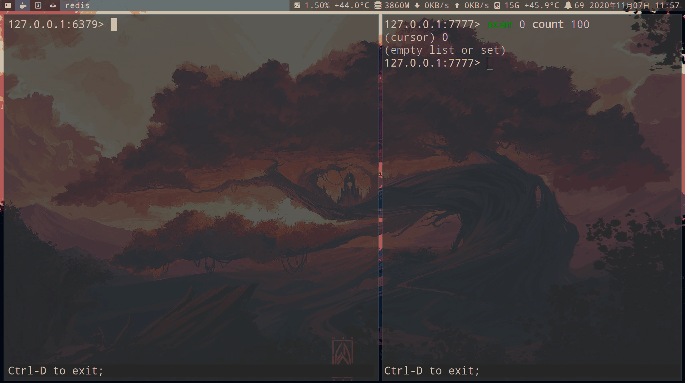

    - 迁移多个键
    ```redis
    MIGRATE 127.0.0.1 7777 "" 0 1000 keys key1 key2 key3
    ```

    - `copy` 选项迁移后不删除源键
    ```redis
    MIGRATE 127.0.0.1 7777 a 0 1000 copy
    ```

    - `replace` 选项覆盖目标数据库相同的键
    ```redis
    MIGRATE 127.0.0.1 7777 a 0 1000 copy replace
    ```

### 高级技巧

```sh
# 删除video开头的键
redis keys video* | xargs redis-cli del
```

## 数据类型

### redis的hashmap存储结构

- redis内部整体的存储结构是一个大的hashmap，内部是数组实现的hash，key冲突通过挂链表去实现，每个dictEntry为一个key/value对象，value为定义的redisObject。

- redisObject结构：
    ```c
    typedef struct redisObject {
        // 类型 4bits
        unsigned type:4;
        // 编码方式 4bits
        unsigned encoding:4;
        // LRU 时间（相对于 server.lruclock） 24bits
        unsigned lru:22;
        // 引用计数 Redis里面的数据可以通过引用计数进行共享 32bits
        int refcount;
        // 指向对象的值 64-bit
        void *ptr;
    } robj;
    ```

    - `*ptr`：如果是整数，直接存储数据；否则指向具体的数据结构的地址
    - `type`：表示该对象的类型，即String,List,Hash,Set,Zset中的一个

        | 对象         | type 命令输出 |
        | ------------ | ------------- |
        | 字符串对象   | "string"      |
        | 列表对象     | "list"        |
        | 哈希对象     | "hash"        |
        | 集合对象     | "set"         |
        | 有序集合对象 | "zset"        |

    - `encoding`：表示对象底层所使用的编码

    - refcount：引用次数
        - `object refcount {key}`命令查看引用次数
            - =0时表示可以安全回收
            - 大于1时, 表示共享对象
        - 对象为整数且数值范围在[0-9999]时，redis会使用共享对象池，从而节省内存

### redis使用hashtable存储键值对

- [Redis开发运维实战：Redis开发规范解析(三)--一个Redis最好存多少key]()

- 不同键值个数、value字节数大小下，内存的开销总和

    | 类型   | 8字节 | 50字节 | 100字节 | 500字节 | 1KB    |
    |--------|-------|--------|---------|---------|--------|
    | 10万   | 8.7MB | 12MB   | 18MB    | 56MB    | 105MB  |
    | 100万  | 78MB  | 116MB  | 169MB   | 550MB   | 1.01GB |
    | 500万  | 448M  | 667MB  | 980MB   | 3.1G    | 5.75GB |
    | 1000万 | 790MB | 1.2GB  | 1.7GB   | 5.5GB   | 10GB   |
    | 1亿    | 8GB   | 12GB   | 17GB    | 55GB    | 100GB  |

- dictEntry存储的是实际键值对
    ```c
    struct dictEntry {
        void *key;
        union {
            void *val;
            uint64_t u64;
            int64_t s64;
            double d;
        } v;
        struct dictEntry *next;     /* Next entry in the same hash bucket. */
    };
    ```

- 对于一个key：

    - 1.首先会通过哈希算法计算它的哈希值

        - Redis 4开始使用 siphash 算法代替 murmur2 算法。murmur2 算法已经证实会受到 HashDos 的攻击(可以简单理解为破坏哈希的均匀性)。

    - 2.然后与`sizemask`做`&`计算(等价于与size做%计算)，算出所在的数组下标(index)，然后生成dictEntry插入其中。

    ```
    # siphash算法计算"hello"的哈希值，然后与sizemask做&计算
    siphashKey ("keyname") & 3 = 984616787 & 3 = 3
    ```

- key冲突处理，通过链表处理

#### rehash

- 扩缩容(rehash)：
    - 对于Redis来说，一个哈希数据结构内置了两个哈希表（dictht）
        - 一个用于使用
        - 另一个平时闲置，待时机成熟，扩容一倍，然后将数据迁移到另一个哈希表内

        - redis7.0去掉了`dictht`
            - dictht ht[2]用dictEntry **ht_table[2]代替
            - 原来两个dictht的used用unsigned long ht_used[2]代替
            - 原来两个dictht的size用signed char ht_size_exp[2]代替，且由8个字节变为1个字节，计算方法如下：
                ```c
                #define DICTHT_SIZE(exp) ((exp) == -1 ? 0 : (unsigned long)1<<(exp))
                #define DICTHT_SIZE_MASK(exp) ((exp) == -1 ? 0 : (DICTHT_SIZE(exp))-1)
                ```

            - 效果：通过数据结构的优化（96->56字节），必然会在hash|set|zset key较多且为小value时，效果更为明显。
                - 内存优化

                    | original dict                              | original dict | optimized dict |
                    |--------------------------------------------|---------------|----------------|
                    | 1000000 65 byte one field hashes           | 290.38M       | 252.23M        |
                    | 1000 hashes with 1000 20 byte fields       | 62.22M        | 62.1M          |
                    | 1000000 sets with 1 1 byte entry           | 214.84M       | 176.69M        |
                    | dict struct size (theoretical improvement) | 96b           | 56b            |

                - 性能变化：除了get random keys外，其他整体有提升

                    | dict benchmark 10000000 | Inserting | Linear access of existing | 2nd round | Random access of existing | Accessing random keys | Accessing missing | Removing and adding |
                    |-------------------------|-----------|---------------------------|-----------|---------------------------|-----------------------|-------------------|---------------------|
                    | original                | 5371      | 2531                      | 2507      | 4135                      | 1447                  | 2893              | 4882                |
                    | optimized               | 5253      | 2488                      | 2481      | 4076                      | 1600                  | 2841              | 4801                |
                    | improvement             | 2.20%     | 1.70%                     | 1.04%     | 1.43%                     | -10.57%               | 1.80%             | 1.66%               |

    - 数据结构

        ```c
        struct dict {
            dictType *type;

            dictEntry **ht_table[2];
            unsigned long ht_used[2];

            long rehashidx; /* rehashing not in progress if rehashidx == -1 */

            /* Keep small vars at end for optimal (minimal) struct padding */
            int16_t pauserehash; /* If >0 rehashing is paused (<0 indicates coding error) */
            signed char ht_size_exp[2]; /* exponent of size. (size = 1<<exp) */
        };
        ```

        - `rehashidx`用来标识当前dict是否正在做rehash，如果为-1表示没有做rehash。
        - 当ht_used > 2^n时候，就需要扩容了
        - 为了保证Redis单线程的高效性，整个rehash是渐进式（一点点）完成的，但全部迁移完成后，将rehashidx置为-1，表示rehash结束了。

- rehash可能引起的问题？

    - 在阿里云的时候，有个客户反馈他的Redis内存突然涨了2GB，如下图所示：Redis实例的内存在一分钟内突然从7.46GB涨到9.46GB，并持续了一段时间。

       

        - 对于此类问题，我们已经有了一套检测方式：各类缓冲区检测、键值增长趋势、大键值、Lua引擎内存等等，但我们进行了一轮检测后，均未发现异常（注释：当时使用的Redis 3.0，内存统计信息不是很全）。经同事提醒后发现可能是rehash造成的，于是抱着尝试的心态做了试验。

    - 问题复现：

        - 我向一个空的Redis写入简单的键值对，2^n是rehash的临界点，在临界点附近放慢键值的写入速度。
            ```java
            public static void testRehash (int n){
                //rehash的临界点
                int rehashThreshold = (int)Math.pow (2, n);
                //临界点左右的偏移量，用于观察数据

                int offset = 10;
                for (int i = 0; i < rehashThreshold + offset; i ++){
                    jedis.set(String.valueOf(i), String.valueOf(i));
                    //用于观察临界点内存的变化。
                    if (i > rehashThreshold - offset){
                        TimeUnit.SECONDS.sleep(1);
                    }
                }
            }
            ```

        - `redis-cli --stat`可以用于定时观察Redis相关状态的变化。

            - 当n=15时，可以观察到：当keys超过32768（2^15）时，内存突然从3.45M涨到了3.70M。
                ```sh
                redis - cli - h 127.0 . 0.1 - p 6379 -- stat
                keys       mem      clients blocked requests            connections
                32767 3.45M 2 0 1230010 (+ 2) 13
                32768 3.45M 2 0 1230012 (+ 2) 13
                32769 3.70M 2 0 1230014 (+ 2) 13
                32770 3.70M 2 0 1230016 (+ 2) 13
                32771 3.70M 2 0 1230018 (+ 2) 13
                32772 3.70M 2 0 1230020 (+ 2) 13
                ```
            - 当n=20时，可以观察到：当keys超过1048576(2^20)时，内存突然从88.70M涨到了104.70M。
                ```sh
                keys       mem      clients blocked requests            connections
                1048574 88.70M  2 0 2278689 (+ 2) 16
                1048575 88.70M  2 0 2278691 (+ 2) 16
                1048576 88.70M  2 0 2278693 (+ 2) 16
                1048577 104.70M 2 0 2278695 (+ 2) 16
                1048578 104.70M 2 0 2278697 (+ 2) 16
                1048579 104.70M 2 0 2278699 (+ 2) 16
                ```

            - 当n=26时，效果更加明显，当keys超过67108864(2^26)后，内存直接从5.50G增长到6.50G。
                ```sh
                keys       mem      clients blocked requests            connections
                67108862 5.50G 2 0 2574533 (+ 2) 23
                67108863 5.50G 2 0 2574535 (+ 2) 23
                67108864 5.50G 2 0 2574537 (+ 2) 23
                67108865 6.50G 2 0 2574539 (+ 2) 23
                67108866 6.50G 2 0 2574541 (+ 2) 23
                ```

            - 下表是每个n对应的键值个数和rehash瞬间的内存额外开销：

                | n  | 键值个数       | rehash容量 |
                |----|----------------|------------|
                | 20 | 1048576(百万)  | 16MB       |
                | 26 | 67108864(千万) | 1GB        |
                | 27 | 134217728(亿)  | 2GB        |
                | 28 | 268435456(亿)  | 4GB        |

            - 下表是key个数越多，rehash需要的额外内存

                | 键值个数    | 需要额外的hash表内存大小 |
                |-------------|--------------------------|
                | 134,217,728 | 2GB                      |
                | 67,108,864  | 1GB                      |
                | 33,554,432  | 512.0MB                  |
                | 16,777,216  | 256.0MB                  |
                | 8,388,608   | 128.0MB                  |
                | 4,194,304   | 64.0MB                   |
                | 2,097,152   | 32.0MB                   |
                | 1,048,576   | 16.0MB                   |
                | 524,288     | 8.0MB                    |

        - 再结合一下当时客户Redis的键值变化，基本可以确定是由rehash造成的内存异常增长。

    - 但是还有更糟糕的情况，如果内存暴增的一瞬间超过了Redis设置的最大内存，不仅会产生大量的数据逐，而且会造成客户端产生大量的超时。下面我们用一个例子来具体说明。

        - 将Redis设置最大使用内存为6GB，并设置最大内存淘汰策略是`allkeys-lru`
            ```redis
            config set maxmemory 6GB
            config set maxmemory-policy allkeys-lru
            config rewrite
            ```

        - 继续设置n=26运行上述程序

            - 会发现在rehash临界点瞬间（67108864）`redis-cli --stat`会卡住，过一段时间后内存虽然也增长了，但是发现key大量丢失（rehash完成，但是rehash一瞬间内存的使用已经超过maxmemory，触发了maxmemory-policy），而且又长时间的卡顿

            - 如果放在生产环境，如果对QPS要求很高的核心业务，很可能就是一次事故。

            ```sh
            67108862 5.50G 2 0 2710190 (+2) 26
            67108863 5.50G 2 0 2710192 (+2) 26
            67108864 5.50G 2 0 2710194 (+2) 26
            ===这里 redis - cli -- stat 停顿===
            61202597 5.56G 2 0 2710196 (+2) 26
            61202598 5.56G 1 0 2710198 (+2) 26
            61202598 5.56G 1 0 2710199 (+1) 26
            61202598 5.56G 1 0 2710200 (+1) 26
            ```

- [Redis开发运维实战：Redis 6.2&7 Rehash相关优化]()

    - Redis 6.2 & 7+ Rehash相关优化

    - 实验
        - 1.版本选择
            - Redis 6.0.15
            - Redis 7.0.11

        - 2.实验条件
            - maxmemory = 5.6GB
            - 第一次灌入：67,100,000个key，观察内存
            - 第二次灌入：2,000,000个key，观察可用性和逐出

        - Redis 6.0.15实验

            - 第一次灌入：67,100,000个key，观察内存：
                ```
                maxmemory:         5.6GB
                used_memory_human: 5.5GB
                dbsize:            67,100,000
                ```

            - 第二次灌入：2,000,000个key，观察可用性和逐出

                - 客户端执行超时， 超时近30秒以上
                    ```sh
                    redis-cli --latency-history
                    min: 0, max: 1, avg: 0.06 (1485 samples) -- 15.01 seconds range
                    min: 0, max: 36511, avg: 45.63 (801 samples) -- 44.61 seconds range
                    ```

                - 逐出大量key：500万以上
                    ```
                    evicted_keys:5,909,376
                    ```

                - 峰值内存：rehash多了一个GB
                    ```
                    used_memory_peak_human:6.50G
                    ```

        - Redis 7.0.11实验

            - 第一次灌入：67,100,000个key，观察内存：（和6.0.15实验一样）
                ```
                maxmemory:         5.6GB
                used_memory_human: 5.5GB
                dbsize:            67,100,000
                ```

            - 第二次灌入：2,000,000个key，观察可用性和逐出

                - 客户端执行无超时
                    ```sh
                    redis-cli --latency-history
                    min: 0, max: 2, avg: 0.05 (1484 samples) -- 15.01 seconds range
                    min: 0, max: 3, avg: 0.24 (1454 samples) -- 15.00 seconds range
                    ```

                - 正常逐出 （还剩0.1GB）
                    ```
                    evicted_keys:152485
                    evicted_keys:443253
                    evicted_keys:751165
                    evicted_keys:1058191
                    evicted_keys:1367445
                    evicted_keys:1662485
                    evicted_keys:1662485
                    ```

                - 峰值内存：没有进行rehash
                    ```
                    used_memory_peak_human:5.50G
                    ```

        - 实验对比

            | 版本   | 是否发生rehash | 严重超时          |
            |--------|----------------|-------------------|
            | 6.0.15 | 有             | 有.30秒以上不可用 |
            | 7.0.11 | 无             | 无.正常逐出       |

    - 此处省略：源码解析


### 编码

- redis对象底层的八种数据结构

    ```c
    REDIS_ENCODING_INT（long 类型的整数）
    REDIS_ENCODING_EMBSTR embstr （编码的简单动态字符串）
    REDIS_ENCODING_RAW （简单动态字符串）
    REDIS_ENCODING_HT （字典）
    REDIS_ENCODING_LINKEDLIST （双端链表）
    REDIS_ENCODING_ZIPLIST （压缩列表）
    REDIS_ENCODING_INTSET （整数集合）
    REDIS_ENCODING_SKIPLIST （跳跃表和字典）
    ```


- redis不做编码回退：数据转向压缩编码非常消耗cpu得不偿失

#### ziplist编码

- Redis7中ziplist被listpack替代，所以相关配置都变为listpack

- zlplist：
    - 整个ziplist只需要malloc一次，它们在内存中是一块连续的区域。
    - 当列表对象元素不多，每个元素也不大的时候，就采用ziplist存储。

    - 优点：是一种压缩链表，它的好处是更能节省内存空间，因为它所存储的内容都是在连续的内存区域当中的。
    - 缺点：
        - 当元素过多时就不是那么好用了。为了保证他存储内容在内存中的连续性，插入的复杂度是O(N)，即每次插入都会重新进行realloc。
        - 连锁更新：向ziplist中增加、删除、修改数据内容、合并ziplist场景。

- 数据结构：
   
   - 1.zlbytes：记录整个压缩列表占用的内存字节数。在对ziplist重新分配内存或者计算zlend的位置时有用。
   - 2.zltail：最后一个节点距离头部的偏移量（字节）。无需遍历整个ziplist即可确定尾节点的地址，在反向遍历ziplist或者pop尾部节点的时候很有用。
   - zllen：节点（entry）个数。
   - entry：数据节点，长度不固定，自己的长度保存在每一个entry节点内部。
   - zlend：8位无符号整数固定值为0xFF，用于标记ziplist的结尾。

- 不同类型耗时排序 list < hash < zset

    | 类型 | 数据量 | key总数量 | 长度 | value大小 | 普通编码内存量/平均耗时 | 压缩编码内存量/平均耗时 | 内存低比例 | 耗时增长倍数 |
    |------|--------|-----------|------|-----------|-------------------------|-------------------------|------------|--------------|
    | hash | 100万  | 1000      | 1000 | 36字节    | 103.37M/0.84微秒        | 43.83M/13.24微秒        | 57.5%      | 15倍         |
    | list | 100万  | 1000      | 1000 | 36字节    | 92.46M/0.84微秒         | 39.92M/5.45微秒         | 56.8%      | 2.5倍        |
    | zset | 100万  | 1000      | 1000 | 36字节    | 151.84M/1.85微秒        | 43.83M/13.24微秒        | 71%        | 42倍         |

    - 命令平均耗时使用`info commandstats`命令获取：包含调用次数、总耗时、平均耗时（微秒）

- 建议长度不超过1000，每个元素大小控制在512字节以内

#### listpack编码

- [Redis开发运维实战：Redis7--ziplist的替代者listpack]()

- Redis7中ziplist被listpack替代，所以相关配置都变为listpack

    

    - 整体的对比图可以看到，其实两者结构相差不大，listpack相对于ziplist，没有了指向末尾节点地址的偏移量，这样也可以解决ziplist内存长度限制的问题。

- 相关配置变更
    ```
    * 新增list-max-listpack-size， 是list-max-ziplist-size的别名；
    * 新增hash-max-listpack-entries， 是hash-max-ziplist-entries的别名；
    * 新增hash-max-listpack-value， 是hash-max-ziplist-value的别名；
    * 新增zset-max-listpack-entries， 是zset-max-ziplist-entries的别名；
    * 新增zset-max-listpack-value， 是zset-max-ziplist-value的别名；
    ```

- entry结构对比
    
    - listpack移除了`prevlen`，在data后新增了`backlen`
        - 在ziplist中，`prevlen`代表前一个entry节点长度的偏移量；
            - 在实际数据的内存结构前有`prevlen`与`encoding`字段，当其发生变化时可能会导致内存不连续，为了保证内存中数据的连续，所以可能会触发连锁更新。
        - 在listpack中，`backlen`代表的是本entry节点的回朔起始地址长度的偏移量

    - 优势：
        - 在遍历最后一个entry时可以通过lp+totallen快速定位到lp尾地址，然后使用backlen快速定位到last entry的起始地址；***并且可以将head中的last offset字段节省出来；
        - 由于backlen仅代表了回朔本entry起始地址长度的偏移量，所以在增/删/改时，无需再关心前一个节点的长度，仅需要整体移动entry即可，所以不会涉及到内存的连锁更新；具体的代码流程这里不再复述；

- list相关命令性能对比（quicklist with ziplist -> quicklist with listpack)

    | command    | quicklist listpack(rps)  | quicklist ziplist(rps)   | percentage(positive: performance enhancement, negative: performance degradation) |
    |------------|--------------------------|--------------------------|----------------------------------------------------------------------------------|
    | LPUSH      | 106929 rps     p50=0.223 | 103535.75 rps  p50=0.223 | 3.2%  |
    | LRANGE_100 | 65737.58 rps   p50=0.375 | 67333.27 rps   p50=0.375 | -2.3% |
    | LRANGE_300 | 30900.44 rps   p50=0.839 | 31346.00 rps   p50=0.823 | -1.4% |
    | LRANGE_500 | 22126.59 rps   p50=1.175 | 22689.63 rps   p50=1.159 | -1.4% |
    | LRANGE_600 | 19443.90 rps   p50=1.343 | 19690.08 rps   p50=1.327 | -1.2% |
    | RPUSH      | 109075.04 rps  p50=0.223 | 108283.71 rps  p50=0.223 | 0.7%  |
    | LPOP       | 108636.61 rps  p50=0.223 | 110778.77 rps  p50=0.223 | 1.9%  |
    | RPOP       | 109757.44 rps  p50=0.223 | 109206.08 rps  p50=0.223 | 0.5%  |

    - lpush/rpush/lpop/rpop性能略有提升，这得益于listpack避免了连锁更新的问题

- 低版本的RDB在redis7中加载时，会自动将ziplist转换为listpack，其整体加载耗时会大约增加 9%-54% 左右。

    - 耗时测试

        - List（38%-46%）
        - hash (29%-54%)
        - Zset (9%-16%)

#### intset编码

- intset：

    - 查找元素的复杂度为O(logN)（采用二分法）

    - 插入时不一定为O(logN)，因为有可能涉及到升级操作。
        - 例子：当集合里全是int16_t型的整数，这时要插入一个int32_t，那么为了维持集合中数据类型的一致，那么所有的数据都会被转换成int32_t类型，涉及到内存的重新分配，这时插入的复杂度就为O(N)了。

- 数据结构：
    - 1.encoding：分3种int-16、int-32、int-64
        - 超过后自动升级，但不会回退
        - 因此尽量保持整数范围一致，如都在int-16范围内，防止个别元素触发集合升级，浪费内存
    - 2.length：集合个数
    - 3.contents：整数数组按从小到大排序
        - 因此intset是有序的

| 数据量 | key大小 | value大小 | 编码      | 集合长度 | 内存量  | 内存降低比例 | 平均耗时  |
|--------|---------|-----------|-----------|----------|---------|--------------|-----------|
| 100w   | 20字节  | 7字节     | hashtable | 1000     | 61.97MB |              | 0.78毫秒  |
| 100w   | 20字节  | 7字节     | intset    | 1000     | 4.77MB  | 92.6%        | 0.51毫秒  |
| 100w   | 20字节  | 7字节     | ziplist   | 1000     | 8.67MB  | 86.2%        | 13.12毫秒 |

### string (字符串)

- 应用:

    - 计数
        - 视频播放计数

    - 计时器
        - 手机验证码：超过5次失败就倒计时1分钟
        - ip在规定时间范围内的访问次数

    - 共享session：分布式web服务会将用户的session（用户登录信息）保存到各自服务器。负载均衡可能会造成用户每刷新一次都需要重复登录。
        - 通过redis对session集中管理，用户每次更新或查询登录信息直接从redis获取

| 命令        | 时间复杂度       |
|-------------|------------------|
| msetnx      | O(k) k是健的个数 |
| mget        | O(k) k是健的个数 |
| mset        | O(k) k是健的个数 |
| getrange    | O(N)             |
| bitpos      | O(N)             |
| bitop       | O(N)             |
| bitcount    | O(N)             |
| append      | O(1)             |
| strlen      | O(1)             |
| setex       | O(1)             |
| setrange    | O(1)             |
| setnx       | O(1)             |
| setbit      | O(1)             |
| psetex      | O(1)             |
| incrby      | O(1)             |
| incrbyfloat | O(1)             |
| incr        | O(1)             |
| getbit      | O(1)             |
| get         | O(1)             |
| getset      | O(1)             |
| set         | O(1)             |
| decrby      | O(1)             |
| decr        | O(1)             |
| bitfield    | O(1)             |

- `setnx`避免多个客户端同时执行`setnx key value`

```redis
# setnx 如果健不存在,才创建
# 因为msg健已经存在,所以创建失败
setnx msg "test exists"
# 创建成功
setnx test "test exists"

# 查看字符串长度
strlen key

# 查看 前5个字符
getrange msg 0 5
# 查看 倒数5个字符
getrange msg -5 -1

# 修改为HELLO,从第一个字符开始
setrange msg 0 'HELLO'

# 修改为WORLD,从第6个字符开始
setrange msg 6 WORLD

# 在末尾添加" tz"
append msg " tz"
```

- `Mset`创建多个健. 可以减少rtt(网络往返时间)

```redis
# 对多个健进行赋值(我这里是a,msg)
mset a 1 msg tz

# 如果这其中有一个健是存在的,那么都不会进行赋值
msetnx a '2' b '3' msg "tz-pc"

# 查看多个健
mget a b msg

# 删除 a,msg健
del a msg
```

- num(数), 依然是string(字符串)类型

- incr命令：对值做自增操作，返回3种结果：
    - 1.值不少整数，返回错误
    - 2.值是整数，返回自增后的结果
    - 3.值不存在，按照值为0自增，返回结果1
```redis
set a 1

# incr 对a加1(只能对 64位 的unsigned操作)
incr a

# 由于b键不存在，按照0自增，返回1
incr b

# incrby 对a加10(只能对 64位 的unsigned操作)
incrby a 10

# incrbyfloat 对a加1.1
incrbyfloat a 1.1

# incrbyfloat 对a减1.1
incrbyfloat a -1.1

# decr 对a减1(只能对 64位 的unsigned操作)
decr a

# decrby 对a减10(只能对 64位 的unsigned操作)
decrby a 10
```

#### sds编码

字符串对象的编码: [**详情**](http://redisbook.com/preview/object/string.html)

| 编码   | 作用                                   |
|--------|----------------------------------------|
| int    | 8个字节的整型                          |
| embstr | <=44 字节的字符串型: 分配1次内存. 只读 |
| raw    | >=45 字节的字符串型: 分配2次内存       |

- [Redis开发运维实战：Redis成本优化-版本升级-1.SDS优化历史]()

- redisObject和embstr是一块连续内存，redisObject和raw通常是不连续的
    
    

    - embstr申请或释放内存都是一次，raw需要两次，同时由于是连续内存，查询速度会更快。

- 为什么小于44字节用embstr编码呢？

    - redisObject占用空间： 4 + 4 + 24 + 32 + 64 = 128bits = 16字节
    - sdshdr8占用空间：1（uint8_t） + 1（uint8_t）+ 1 （unsigned char）+ 1（buf[]中结尾的'\0'字符）= 4字节
    - 初始最小分配为64字节，所以只分配一次空间的embstr最大为 64 - 16 - 4 = 44字节

- redis采用SDS（simple dynamic string）来实现简单动态字符串。embstr和raw都为sds编码
    ```c
    struct sdshdr {
        int len; // 字符串的实际内容所占长度
        int free; // 空闲空间长度
        char buf[]; //柔性字符数组
    };
    ```

    

- C 字符串 vs SDS(动态字符串)：

    - 获取字符串长度的时间复杂度: C为O(n), SDS为O(1)

    - 杜绝缓冲区溢出：
        - 进行两个字符串拼接c语言可使用strcat函数，但如果没有足够的内存空间。就会造成缓冲区溢出
        - sds在进行合并时会先用len检查内存空间是否满足需求，如果不满足，进行空间扩展，不会造成缓冲区溢出


    - 修改字符串长度:
        - C语言字符串不记录字符串长度，如果要修改字符串要重新分配内存，如果不进行重新分配会造成内存缓冲区泄露
        - SDS记录free(剩余空间)可以减少分配内存的次数

    - 二进制安全：
        - 因为C字符串以空字符作为字符串结束的标识，而对于一些二进制文件（如图片等），内容可能包括空字符串，因此C字符串无法正确存取
        - 所有 SDS 的API 都是以处理二进制的方式来处理 buf 里面的元素，并且 SDS 不是以空字符串来判断是否结束，而是以 len 属性表示的长度来判断字符串是否结束；

    - 使用SDS存储文本时, 可以兼容 C 字符串函数

- sds空间预分配

    - 如果sds修改后，sds长度（len的值）将于1mb，那么会分配与len相同大小的未使用空间，len与free值相同
        - 例子：修改之后字符串长度为100字节，那么会给分配100字节的未使用空间。最终sds空间实际为 100 + 100 + 1(保存空字符'\0')；

    - 如果大于等于1mb，每次给分配1mb未使用空间

- sds惰性空间释放：对字符串进行缩短操作时，程序不立即使用内存重新分配来回收缩短后多余的字节，而是使用 free 属性将这些字节的数量记录下来，等待后续使用（sds也提供api，我们可以手动触发字符串缩短）

- redis不同版本的`string`性能对比：

    - 测试版本：2.8.24、3.0.7、3.2.13、4.0.14、5.0.14、6.0.20、6.2.15、7.0.12

    - 1.写入100万条string键值对：key、value均为小于32字节字符串(测试用16字节)

        | 版本   | 2.8.24 | 3.0.7  | 3.2.13 | 4.0.14 | 5.0.14 | 6.0.20 | 6.2.15 | 7.0.12 |
        |--------|--------|--------|--------|--------|--------|--------|--------|--------|
        | 容量MB | 114.87 | 114.87 | 91.98  | 92.04  | 92.04  | 92.00  | 92.04  | 92.10  |

    - 2.写入100万条string键值对：key、value均为小于39字节字符串(测试用36字节)

        | 版本   | 2.8.24 | 3.0.7  | 3.2.13 | 4.0.14 | 5.0.14 | 6.0.20 | 6.2.15 | 7.0.12 |
        |--------|--------|--------|--------|--------|--------|--------|--------|--------|
        | 容量MB | 145.38 | 145.38 | 122.50 | 122.56 | 122.56 | 122.56 | 122.56 | 122.62 |

    - 3.写入100万条string键值对：key、value均为39到44字节之间的字符串(测试用42字节)

        | 版本   | 2.8.24 | 3.0.7  | 3.2.13 | 4.0.14 | 5.0.14 | 6.0.20 | 6.2.15 | 7.0.12 |
        |--------|--------|--------|--------|--------|--------|--------|--------|--------|
        | 容量MB | 175.90 | 175.90 | 137.76 | 137.82 | 137.82 | 137.78 | 137.82 | 137.88 |

    - 4.写入100万条键值对：key、value均为大于44字节(测试用100字节)

        | 版本   | 2.8.24 | 3.0.7  | 3.2.13 | 4.0.14 | 5.0.14 | 6.0.20 | 6.2.15 | 7.0.12 |
        |--------|--------|--------|--------|--------|--------|--------|--------|--------|
        | 容量MB | 267.45 | 267.42 | 259.83 | 259.89 | 259.89 | 259.89 | 259.89 | 259.95 |

    - 5.写入100万条键值对：key为字符串(100字节)，value为数字(>10000的数字)

        | 版本   | 2.8.24 | 3.0.7  | 3.2.13 | 4.0.14 | 5.0.14 | 6.0.20 | 6.2.15 | 7.0.12 |
        |--------|--------|--------|--------|--------|--------|--------|--------|--------|
        | 容量MB | 160.64 | 175.90 | 168.28 | 168.34 | 153.08 | 153.08 | 153.08 | 153.14 |

    - 结论：
        - Redis 3.2版本相比于之前版本，Redis容量有较大降幅。
        - Redis 5.0版本在value为数字的场景下，Redis容量有较大降幅。

- redis不同版本的sds优化之路

    - Redis 3.0 和 Redis 3.2+的sds有很大不同，新版本的sds会根据字符串长度使用不同的原信息

        - Redis3.2对sdshdr结构做了优化：按照字符串长度的不同，记录字符串len和free的类型会做相应变化：char、uint8_t、uint16_t、uint32_t、uint64_t。

            ```c
            struct __attribute__ ((__packed__)) sdshdr5 {
                unsigned char flags; /* 3 lsb of type, and 5 msb of string length */
                char buf[];
            };
            struct __attribute__ ((__packed__)) sdshdr8 {
                uint8_t len; /* used */
                uint8_t alloc; /* excluding the header and null terminator */
                unsigned char flags; /* 3 lsb of type, 5 unused bits */
                char buf[];
            };
            struct __attribute__ ((__packed__)) sdshdr16 {
                uint16_t len; /* used */
                uint16_t alloc; /* excluding the header and null terminator */
                unsigned char flags; /* 3 lsb of type, 5 unused bits */
                char buf[];
            };
            struct __attribute__ ((__packed__)) sdshdr32 {
                uint32_t len; /* used */
                uint32_t alloc; /* excluding the header and null terminator */
                unsigned char flags; /* 3 lsb of type, 5 unused bits */
                char buf[];
            };
            struct __attribute__ ((__packed__)) sdshdr64 {
                uint64_t len; /* used */
                uint64_t alloc; /* excluding the header and null terminator */
                unsigned char flags; /* 3 lsb of type, 5 unused bits */
                char buf[];
            };
            ```

            - 3.2中使用了叫sdshdr8的结构，在该结构下，元数据只需要3个字节；而3.2之前需要8个字节

            - 从图中可以看到为什么Redis 3的embstr界限是39字节、Redis 3.2的embstr界限是44字节

            

        - 案例：有个同事找我，说他申请两个集群，双写两个集群，但是写满后容量是这样的
            
            - 实验：分别在Redis 3.0.7和Redis 4.0.12，写入10亿个44字节的key和value
                - Redis 3.0.7的内存消耗：`used_memory_human:177G`
                - Redis 4.0.12的内存消耗：`used_memory_human:147G`

    - Redis5.0.6的数字优化：如果是20个字节以内的long类型，如果是非raw类型，可以转成embstr并针对性的做优化ptr直接存储数字
        

- [Redis开发运维实战：Redis成本优化-版本升级-2.复杂数据结构robj优化]()

- redis不同版本性能对比

    - 1.写入1万条hash键值对：key为37字节、1000对field(f0..f99)-value(2字节)

        | 版本   | 2.8.24 | 3.0.7  | 3.2.13 | 4.0.14 | 5.0.14 | 6.0.20 | 6.2.15 | 7.0.12 |
        |--------|--------|--------|--------|--------|--------|--------|--------|--------|
        | 容量MB | 995.83 | 995.83 | 776.72 | 461.61 | 461.61 | 461.61 | 461.61 | 461.29 |

    - 2.写入1万条zset键值对：key为37字节、1000对score(10001到11001)-element(32字节)

        | 版本   | 2.8.24  | 3.0.7   | 3.2.13  | 4.0.14  | 5.0.14  | 6.0.20  | 6.2.15  | 7.0.12  |
        |--------|---------|---------|---------|---------|---------|---------|---------|---------|
        | 容量MB | 1511.01 | 1511.14 | 1286.70 | 1134.15 | 1140.26 | 1134.20 | 1134.19 | 1133.81 |

- redis不同版本的优化之路

    - 3.2.13相比于3.0.7
        - hash类型(hashtable实现)：：Redis使用容量优化了28.2% (主要是Redis 3.2在sdshdr的优化）
        - zset类型(hashtable + skiplist实现)：Redis使用容量优化了17.4% (主要是Redis 3.2在sdshdr的优化）

    - 4.0.14相比于3.2.13

        - 所有复杂类型(例如hash、list、set、zset)中的元素不再使用`RedisObject`改为使用`sds`

            

            - 每个`robj`占用数据量: 4bit + 4bit + 24bit + 4字节 + 8字节 = 16字节

                ```c
                #define LRU_BITS 24
                typedef struct redisObject {
                    unsigned type:4;
                    unsigned encoding:4;
                    unsigned lru:LRU_BITS; /* LRU time (relative to global lru_clock) or
                                            * LFU data (least significant 8 bits frequency
                                            * and most significant 16 bits access time). */
                    int refcount;
                    void *ptr;
                } robj;
                ```

        - hash类型(hashtable实现)：Redis使用容量又优化了68.2%
        - zset类型(hashtable + skiplist实现)：Redis使用容量又优化了13.4%
#### string实现分布式锁

- [官方文档：分布式锁的实现方法](https://redis.io/docs/manual/patterns/distributed-locks/)

- [基于TairString实现高性能分布式锁](https://help.aliyun.com/zh/tair/use-cases/implement-high-performance-distributed-locks-by-using-tairstring?spm=a2c4g.11186623.0.0.3dff654cvz5Pzy)


- Redis 实现分布式锁的

    - 优点：
        - 性能高效（这是选择缓存实现分布式锁最核心的出发点）。
        - 实现方便。很多研发工程师选择使用 Redis 来实现分布式锁，很大成分上是因为 Redis 提供了 setnx 方法，实现分布式锁很方便。
        - 避免单点故障（因为 Redis 是跨集群部署的，自然就避免了单点故障）。

    - 缺点：
        - Redis 主从复制模式中的数据是异步复制的，这样导致分布式锁的不可靠性。如果在 Redis 主节点获取到锁后，在没有同步到其他节点时，Redis 主节点宕机了，此时新的 Redis 主节点依然可以获取锁，所以多个应用服务就可以同时获取到锁。


- 加锁：

    - NX 参数：可以实现「key不存在才插入」
    - EX/PX 参数：需要设置过期时间，以免客户端拿到锁后发生异常，导致锁一直无法释放
    - 锁变量值：每个客户端设置的值是一个唯一值，用于标识客户端

    ```redis
    SET resource_1 unique_value NX EX 5
    ```

- 解锁：

    - 一般使用DEL命令，但可能存在下列问题：
        - 1.t1时刻，App1设置了分布式锁resource_1，过期时间为3秒。
        - 2.App1由于程序慢等原因等待超过了3秒，而resource_1已经在t2时刻被释放。
        - 3.t3时刻，App2获得这个分布式锁。
        - 4.App1从等待中恢复，在t4时刻运行DEL resource_1将App2持有的分布式锁释放了。

    - 从上述过程可以看出，一个客户端设置的锁，必须由自己解开。要先判断锁的 unique_value 是否为加锁客户端，是的话，才将 lock_key 键删除。

        - 那么解锁就有两个操作GET + DEL：这时就需要 Lua 脚本来保证解锁的原子性

        ```lua
        if redis.call("get",KEYS[1]) == ARGV[1] then
            return redis.call("del",KEYS[1])
        else
            return 0
        end
        ```

- 续租：当客户端发现在锁的租期内无法完成操作时，就需要延长锁的持有时间，进行续租（renew）。同解锁一样，客户端应该只能续租自己持有的锁。在Redis中可使用如下Lua脚本来实现续租：

    ```lua
    if redis.call("get",KEYS[1]) == ARGV[1] then
        return redis.call("expire",KEYS[1], ARGV[2])
    else
        return 0
    end
    ```

#### Bitmaps(位图)

- 应用

    - 两种状态的统计都可以使用bitmaps：
        - 例子：统计用户活跃与非活跃数量、登录与非登录、上班打卡等等。

- 本质上是string类型

- 记录网站每天有多少用户登陆：1为登陆，0为没有登陆，偏移量作为用户的id

    - set集合 vs Bitmaps：假设网站有1亿用户

        - 每天5000万用户登陆存储一天的登陆内存量：bitmaps胜

            - 用户数量越多越能节省空间

            | 数据类型 | 每个用户占用的空间 | 需要存储的用户量 | 全部内存量             |
            |----------|--------------------|------------------|------------------------|
            | set      | 64位               | 50000000         | 64 * 50000000 = 400MB  |
            | bitmaps  | 1位                | 10000000         | 1 * 100000000 = 12.5MB |

        - 每天10万用户登陆存储一天的登陆内存量：set胜

            - 那么大部分位都是0

            | 数据类型 | 每个用户占用的空间 | 需要存储的用户量 | 全部内存量             |
            |----------|--------------------|------------------|------------------------|
            | set      | 64位               | 100000           | 64 * 100000 = 800KB    |
            | bitmaps  | 1位                | 10000000         | 1 * 100000000 = 12.5MB |

```redis
# 2022-3-19. id为5, 10, 15用户登陆
setbit 2022-3-19 5 1
setbit 2022-3-19 10 1
setbit 2022-3-19 15 1

# 2022-3-20
setbit 2022-3-20 5 1
setbit 2022-3-20 15 1

# 查看id10的用户是否登陆
getbit 2022-3-19 10

# 查看登陆用户的总数
bitcount 2022-3-19

# 查看登陆当中, 最小的用户id
bitpos 2022-3-19 1

# 查看不登陆当中, 最小的用户id
bitpos 2022-3-19 0
```

- 复合运算: `bitop <op> key key`

    - `and`(交集), `or`(并集), `not`(非), `xor`(异或)

```redis
# 交集. 查看这两天都登陆的用户总数, 并保存2022-3-19:and:2022-3-20
bitop and 2022-3-19:and:2022-3-20 2022-3-19 2022-3-20
bitop or 2022-3-19:or:2022-3-20 2022-3-19 2022-3-20
```

### hash (哈希散列)

- 应用:

    - 缓存关系型数据库的用户信息。相比于关系型数据库新增列后，所有行都需要设置值（即使是null）；hash是稀疏结构则不需要，但难以实现复杂的查询

        | id | name | age | city    |
        |----|------|-----|---------|
        | 1  | tom  | 23  | beijing |
        | 2  | mike | 30  | tianjin |

    - 电商app的购物车

哈希对象的编码: [**详情**](http://redisbook.com/preview/object/hash.html)

| 编码      | 作用                                                                                                                                               |
| --------- | ---------------------------------------------------------------------------------------                                                            |
| ziplist   | 压缩列表：元素个数小于`hash-max-ziplist-entries`(默认512个) 和 元素字节小于`hash-max-ziplist-value`(默认64字节) . 该编码更节约内存. 时间复杂度O(n) |
| hashtable | 字典: 无法ziplist条件时使用该编码. 时间复杂度为O(1)                                                                                                |
- hashtable结构

    

    - 扩容缩容的时候，需要分配新的hashtable，然后进行渐近式搬迁，这时候两个hashtable存储的旧的hashtable和新的hashtable。搬迁结束后，旧hashtable删除，新的取而代之。

- 渐进式rehash

    - 大字典的扩容是比较消耗时间的，需要重新申请新的数组，然后将旧字典所有链表的元素重新挂接到新的数组下面，是一个O(n)的操作。但是因为我们的redis是单线程的，无法承受这样的耗时过程，所以采用了渐进式rehash小步搬迁，虽然慢一点，但是可以搬迁完毕。

    - 扩容条件：Hash表中的元素个数等于第一维数组的长度的时候，就会开始扩容。扩容的大小是原数组的两倍。
        - 不过在redis在做bgsave（RDB持久化操作的过程），为了减少内存页的过多分离（Copy On Write），redis不会去扩容。但是如果hash表的元素个数已经到达了第一维数组长度的5倍的时候，就会强制扩容，不管你是否在持久化。

    - 缩容条件：元素个数低于数组长度的10%，并且缩容不考虑是否在做redis持久化。因为释放掉一些已经使用的内存，不会增大系统的压力。

- rehash步骤

    - 1.为ht[1] 分配空间，让字典同时持有ht[0]和ht[1]两个哈希表；

    - 2.定时维持一个索引计数器变量rehashidx，并将它的值设置为0，表示rehash 开始；

    - 3.在rehash进行期间，每次对字典执行CRUD操作时，程序除了执行指定的操作以外，还会将ht[0]中的数据rehash 到ht[1]表中，并且将rehashidx加一；

    - 4.当ht[0]中所有数据转移到ht[1]中时，将rehashidx 设置成-1，表示rehash 结束；

        - （采用渐进式rehash 的好处在于它采取分而治之的方式，避免了集中式rehash 带来的庞大计算量。特别的在进行rehash时只能对h[0]元素减少的操作，如查询和删除；而查询是在两个哈希表中查找的，而插入只能在ht[1]中进行，ht[1]也可以查询和删除。）

    - 5.将ht[0]释放，然后将ht[1]设置成ht[0]，最后为ht[1]分配一个空白哈希表。

    


| 命令         | 时间复杂度          |
|--------------|---------------------|
| hkeys        | O(k) k是filed的总数 |
| hvals        | O(k) k是filed的总数 |
| hgetall      | O(k) k是filed的总数 |
| hmset        | O(k) k是filed的个数 |
| hmget        | O(k) k是filed的个数 |
| hdel         | O(k) k是filed的个数 |
| hscan        | O(1)                |
| hstrlen      | O(1)                |
| hsetnx       | O(1)                |
| hlen         | O(1)                |
| hexists      | O(1)                |
| hincrby      | O(1)                |
| hget         | O(1)                |
| hincrbyfloat | O(1)                |
| hset         | O(1)                |

> ```redis
> HSET 表名 域名1 域值1 域名2 域值2 ...
> ```

```redis
# 一次创建多个域
hset n a 1 b 2 c 3

hmset n a 1 b 2 c 3
# 修改 a域为-1
hset n a -1

# hsetnx 如果a域存在,则不修改值
hsetnx n a 0

# 获取a域
hget n a

# hgetall 获取n的所有域和值(阻塞命令, 类似keys命令)
hgetall n

# 渐进式遍历(非阻塞, 类似于scan命令)
hscan n 0

# hkeys 查看n表里的所有域名
hkeys n

# hvals 查看n表里的所有域值
hvals n

# hexists 查看n表里是否存在a域
hexists n a

# hget 只查看n表里的a域
hget n a

# hmget 查看n表里的a,b域
hmget n a b

# 查看n表有多少个域
hlen n
# 查看a域的长度
hstrlen n a

# 删除指定域
hdel table a

# 删除整个table表
del table
```

对域的值进行加减

```redis
# a域的值加10(只能对 64位 的unsigned操作)
hincrby n a 10

# a域的值减5(只能对 64位 的unsigned操作)
hincrby n a -5

# a域的值加1.1
hincrbyfloat n a 1.1

# a域的值减1.1
hincrbyfloat n a -1.1
```

### list (列表)

- 数据结构：

    - stack(栈): lpush + lpop

    - queue(队列): lpush + rpop

    - 环形队列: lpush + ltrim

    - mq(消息队列): lpush + brpop实现阻塞队列

- 应用:

    - 消息队列

    - 文章列表:

        - 文章使用hash实现

            ```redis
            hmset acticle:1 title xx timestamp 1476536196 content xxxx
            ```

            - 问题: 获取多个文章都需要执行多次`hgetall`

                - 解决方法1: 使用pipeline(流水线执行命令)

                - 解决方法2: 文章序列化为string类型, 获取时使用`mget`

        - 使用列表把文章组合起来

            ```redis
            lpush user:1:acticles article:1 article:2
            ```

列表对象的编码: [**详情**](http://redisbook.com/preview/object/list.html)

| 编码         | 作用                                                                                                                                                                                                            |
| ------------ | --------------------------------------------------------------------------------------------------------------------------------------------------------------------------------------------------------------  |
| ziplist      | 等同于hash的ziplist                                                                                                                                                                                             |
| linkedlist   | 每个双端链表节点（node）都保存了一个字符串对象,而每个字符串对象都保存了一个列表元素.                                                                                                                            |
| quickList | zipList 和 linkedList 的混合体|

- Redis3.2之前的底层实现方式：压缩列表ziplist 或者 双向循环链表linkedlist

- Redis3.2及之后的底层实现方式：quicklist

    - 为什么不直接使用linkedlist？

        - linkedlist的附加空间相对太高，prev和next指针就要占去16个字节，而且每一个结点都是单独分配，会加剧内存的碎片化，影响内存管理效率。

- quicklist

    - 是一个基于ziplist的双向链表，quicklist的每个节点都是一个ziplist，结合了双向链表和ziplist的优点。

    - 它将 linkedList 按段切分，每一段使用 zipList 来紧凑存储，多个 zipList 之间使用双向指针串接起来.

    - ziplist使用LZF算法压缩。默认的压缩深度是0，也就是不压缩。压缩的实际深度由配置参数 `list-compress-depth` 决定

        - 为了支持快速push/pop操作，quicklist 的首尾两个 ziplist 不压缩，此时深度就是 1。

        - 如果深度为 2，就表示 quicklist 的首尾第一个 ziplist 以及首尾第二个 ziplist 都不压缩。

    - 默认单个ziplist长度为8k字节，超出了这个字节数，就会新起一个ziplist。关于长度可以使用`list-max-ziplist-size`决定。

    

| 命令       | 时间复杂度                           |
|------------|--------------------------------------|
| lrange     | O(S+N) S是start, N是start到end的范围 |
| ltrim      | O(N) N是裁剪的元素总数               |
| lset       | O(N) N是索引偏移量                   |
| linsert    | O(N) N是索引偏移量                   |
| lindex     | O(N)                                 |
| lrem       | O(N) N是列表长度                     |
| rpushx     | O(1)                                 |
| rpush      | O(k) k是健的个数                     |
| rpop       | O(1)                                 |
| rpoplpush  | O(1)                                 |
| lpushx     | O(1)                                 |
| lpush      | O(k) k是健的个数                     |
| lpop       | O(1)                                 |
| llen       | O(1)                                 |
| brpoplpush | O(1)                                 |
| brpop      | O(1)                                 |
| blpop      | O(1)                                 |

```redis
# 左插入
lpush list 2
lpush list 1

# 右插入
rpush list 3
rpush list 4

# 查看列表list
lrange list 0 -1

# 查看长度
llen list

# 左弹出
lpop list

# 右弹出
rpop list

# lpushx,rpushx不能对不存在的表进行插入
lpushxlist-null a a b b c c
rpushx list-null a a b b c c
```

```redis
lpush list1 a

# 右弹出list, 左插入到list1
rpoplpush list list1

# 弹出自己的最后一个值, 插入到第一位
rpoplpush list list
```

- brpop（阻塞）

```redis
# brpoplpush 是 rpoplpush 的阻塞版本
# 在 MULTI / EXEC 块(事务)中没有意义

# ll列表元素为空则阻塞, 如不为空则等同于rpop. 以下是阻塞时间3秒, 3秒后没有其它客户端插入就返回nil
brpop ll 3

# 0秒表示一直阻塞下去, 直到有客户端插入
brpop ll 0

# 阻塞多个列表, 只要其中有一个列表插入, 就返回
brpop ll ll1 ll2 0
```

- Redis 6.2.0开始提供了`LMOVE`命令，将列表a的最左/最右元素，移动到列表b的最左/最右
```redis
# LMOVE自身
127.0.0.1:6379> LRANGE a 0 -1
1) "cc"
2) "bb"
3) "aa"
127.0.0.1:6379> LMOVE a a left right
"cc"
127.0.0.1:6379> LRANGE a 0 -1
1) "bb"
2) "aa"
3) "cc"

将列表a的最左元素，移动到b的最右
127.0.0.1:6379> LPUSH a aa bb cc dd
(integer) 4
127.0.0.1:6379> LRANGE a 0 -1
1) "dd"
2) "cc"
3) "bb"
4) "aa"
127.0.0.1:6379> LPUSH b aa bb cc dd
(integer) 4
127.0.0.1:6379> LRANGE b 0 -1
1) "dd"
2) "cc"
3) "bb"
4) "aa"
127.0.0.1:6379> lmove a b left right
"dd"
127.0.0.1:6379> LRANGE b 0 -1
1) "dd"
2) "cc"
3) "bb"
4) "aa"
5) "dd"
127.0.0.1:6379> LRANGE a 0 -1
1) "cc"
2) "bb"
3) "aa"
```

```redis
# 查看ll的第1个值(注意:0表示第1个值)
lindex ll 0

# 查看ll的第2个值(注意:1表示第2个值)
lindex ll 1

# 查看ll的最后一个值
lindex ll -1

# 在第一个a值,前面插入b值
linsert ll before a b

# 在第一个a值,后面插入1值
linsert ll after a 1

# 将ll的第一个值修改为hello
lset ll 0 hello

# 只保留 前两个值(注意:0表示第1个值,1表示第2个值)
ltrim ll 0 1

# 移除两个b值
lrem ll 2 b
```

**sort 排序**: 只能对 _数字_ 或者 _字符串_ 进行排序(默认会按数字排序,如果有数字和字符串会报错)

```redis
# 新建两个列表
lpush gid 1 3 5 2 0
lpush name apple joe john

sort gid

# 倒序
sort gid desc

# 按字符排序
sort name alpha

# limit 进行筛选,倒序显示第 2 个到第 4 个
sort gid limit 2 4 desc
```

`by` 通过**字符串对象的值**来对 list 进行排序:

```redis
# 新建 uid 列表
lpush uid 1 2 3

# 新建三个字符串
set level1 100
set level2 10
set level3 1000

sort uid

# 通过level的大小对uid排序
sort uid by level*
```


`get` 通过 list 的顺序对 字符串 进行排序(反过来的 by)：

```redis
# 新建三个字符串
set name1 joe
set name2 john
set name3 xiaoming

# 通过uid的顺序,对 name 进行排序
sort uid get name*
# 对 name , level 进行排序
sort uid get name* get level*

# by 一个不存在的key(我这里是not).get的key值,不会进行排序
sort uid by not get name* get level*

# store 将结果,保存为新的列表key(注意会覆盖已经存在的列表key)
sort uid get name* get level* store name-level
```

### set (集合)

- 应用:

    - 标签
        ```redis
        # 给用户加标签
        sadd user:1 tag1 tag2
        ```
        ```redis
        # 给标签加用户
        sadd tag:1 user1 user2
        ```
        ```redis
        # 计算用户共同兴趣的标签
        sinter user:1 user:2
        ```

    - 共同好友功能，共同喜好，或者可以引申到二度好友之类的扩展应用。

    - 统计网站的独立IP。

    - 随机数（抽奖）：spop/srandmember

    - 点赞

集合对象的编码: [**详情**](http://redisbook.com/preview/object/set.html)

| 编码                | 作用                                                                                |
|---------------------|-------------------------------------------------------------------------------------|
| intset（整数集合）  | 当集合中的元素个数小于`set-max-intset-entries`（默认512个）使用该实现。节省内存, O(n) |
| hashtable（哈希表） | 无法满足intset条件时使用该编码. 时间复杂度为O(1)                                    |

- intset编码是有序的：
```redis
127.0.0.1:6379> sadd set:test 7 5 9 8 3 0
(integer) 6
127.0.0.1:6379> 2609:M 17 Aug 2023 23:09:28.091 * 1 changes in 900 seconds. Saving...
127.0.0.1:6379> object encoding set:test
"intset"
127.0.0.1:6379> smembers set:test
1) "0"
2) "3"
3) "5"
4) "7"
5) "8"
6) "9"
```

- hashtable编码是无序的：
```redis
127.0.0.1:6379> config set set-max-intset-entries 6
CONFIG SET will change the server's configs.
Do you want to proceed? (y/n): y
Your Call!!
OK
127.0.0.1:6379> sadd set:test 1
(integer) 1
127.0.0.1:6379> object encoding set:test
"hashtable"
127.0.0.1:6379> smembers set:test
1) "8"
2) "7"
3) "3"
4) "0"
5) "1"
6) "5"
7) "9"
```

| 命令        | 时间复杂度                                      |
|-------------|-------------------------------------------------|
| sinterstore | O(N*M) n是多个集合中元素最少的个数, m是健的个数 |
| sinter      | O(N*M) n是多个集合中元素最少的个数, m是健的个数 |
| sunion      | O(N) n是多个集合的个数和                        |
| sunionstore | O(N)n是多个集合的个数和                         |
| sdiff       | O(N) n是多个集合的个数和                        |
| sdiffstore  | O(N)n是多个集合的个数和                         |
| srem        | O(k) k是元素的个数                              |
| smembers    | O(N) n是元素的总数                              |
| sscan       | O(1)                                            |
| spop        | O(1)                                            |
| sismember   | O(1)                                            |
| srandmember | O(count)                                        |
| sadd        | O(k) k是元素的个数                              |
| scard       | O(1)                                            |
| smove       | O(1)                                            |

```redis
# 新建一个集合,名为jihe .字符串的集合编码为hashtable
sadd jihe 'test'
sadd jihe 'test1' 'test2' 'test3' 123

# 查看test元素是否在jihe内
sismember jihe test

# 查看集合元素个数
scard jihe

# 查看集合jihe所有元素, 返回结果是无序的(阻塞命令, 类似keys命令)
smembers jihe

# 渐进式遍历(非阻塞, 类似于scan命令)
sscan jihe 0

# 数字的集合编码为intset
sadd s 123

# 查看编码为intset
object encoding s

# 数字和字符都有的集合,编码为hashtable
sadd s test

# 再次查看编码发现已经变为hashtable
object encoding s
```

那如果一个集合,包含数和字符串,把字符串的值删除后.**编码**会变吗？

```redis
# 新建ss集合,包含数和字符串
sadd ss 123 'test'

# 查看编码为hashtable
object encoding ss

# 删除 ss 集合里的test字符串值
srem ss test

# 再次查看编码为hashtable. 没有变
object encoding ss
```

```redis
# 搜索jihe包含 t 的字符
sscan jihe 0 match *t*

# 删除集合里的test,test1值
srem jihe test test1

# 将jihe里的值123,移到jihe1
smove jihe jihe1 123

# 弹出随机一个数
spop jihe

# 弹出随机2个数
spop jihe 2

# 查看随机一个数
srandmember jihe

# 查看随机2个数
srandmember jihe 2
```

#### 交集,并集,补集

```redis
# 新建两个集合
sadd sss 123 test test1
sadd ssss 123 test abc cba

# sinter 返回两个集合的交集
sinter sss ssss

# sunion 返回两个集合的并集
sunion sss ssss

# sdiff 返回sss的补集
sdiff sss ssss
# sdiff 返回ssss的补集
sdiff ssss sss

# 返回交集,并集,补集的数量
sinterstore sss ssss
sunionstore sss ssss
sdiffstore sss ssss

# 保存集合运算的结果
sinterstore s-inter sss ssss
sunionstore s-union sss ssss
sdiffstore s-diff sss ssss
```


### zset(有序集合)

- 应用

    - 排行榜
        - 用户mike上传了一个视频，并获得了3个赞
        ```redis
        zadd user:ranking:2016_03_15 mike 3
        ```
        - 之后在获得了1个赞
        ```redis
        zincrby user:ranking:2016_03_15 mike 1
        ```
        - 删除用户
        ```redis
        zrem user:ranking:2016_03_15 mike
        ```
        - 显示top 10 赞数的用户
        ```redis
        zrevrangebyrank user:ranking:2016_03_15 0 9
        ```
        - 显示用户信息和用户排名
        ```redis
        hgetall user:info:tom
        zscore user:ranking:2016_03_15 mike
        zrank user:ranking:2016_03_15 mike
        ```

    - 权重的队列：普通消息的score为1，重要消息的score为2，然后工作线程可以选择按score的倒序来获取工作任务。让重要的任务优先执行。

    - 延迟消息队列：把当前要做的事情，往后推迟一段时间再做

        - 使用 `zadd score1 value1` 命令就可以一直往内存中生产消息，时间戳作为score进行排序。再利用 `zrangebyscore key min max withscores limit 0 1`查询最早的一条任务，来进行消费， 通过循环执行队列任务即可。

        - 在淘宝、京东等购物平台上下单，超过一定时间未付款，订单会自动取消
        - 打车的时候，在规定时间没有车主接单，平台会取消你的单并提醒你暂时没有车主接单
        - 点外卖的时候，如果商家在10分钟还没接单，就会自动取消订单
        - 微信红包场景，A给B发红包，B没有收，1天后钱会退回原账户

有序集合对象的编码: [**详情**](http://redisbook.com/preview/object/sorted_set.html)

| 编码     | 作用                          |
|----------|-------------------------------|
| ziplist  |                               |
| skiplist | 跳跃表: 平均O(logN)、最坏O(N) |

- ziplist如何做排序

    - 每个集合是两个节点来保存，第一个节点保存元素的成员（member），而第二个元素则保存元素的分值（score）。
    - 集合按分值从小到大进行排序，分值较小的元素放在表头，而分值较大的元素在表尾。
    

- skiplist跳表

    - 跳表本质上采用的是一种空间换时间的策略，是一种可以可以进行二分查找的有序链表，跳表在原有的有序链表上增加了多级索引，通过索引来实现快速查询。

    - 普通跳表：

        

        - 跳表支持平均O（logN）、最坏O（N）复杂度的节点查找

            - 对于理想的跳表，每向上一层索引节点数量都是下一层的1/2，跳表的**时间复杂度为o(logn)，空间复杂度为o(n)

        - 跳表相比于红黑树的优点：
            - 内存占用更少，自定义参数化决定使用多少内存
            - 查询性能至少不比红黑树差
            - 简单更容易实现和维护

    - Redis中的跳表和普通跳表有什么区别？

        - Redis中的跳跃表分数（score）允许重复，即跳跃表的key允许重复，如果分数重复，还需要根据数据内容来进字典排序。普通的跳跃表是不支持的。

        - 第1层链表不是一个单向链表，而是一个双向链表。这是为了方便以倒序方式获取一个范围内的元素。
        - 在Redis的跳跃表中可以很方便地计算出每个元素的排名。


    - Redis跳表数据结构：

        

        - header：指向跳跃表的表头节点，通过这个指针程序定位表头节点的时间复杂度就为O(1)

        - level：记录目前跳跃表内，层数最大的那个节点的层数(表头节点的层数不计算在内)，通过这个属性可以再O(1)的时间复杂度内获取层高最好的节点的层数

            - 有两个属性：
                - 前进指针：用于访问位于表尾方向的其他节点
                - 跨度：则记录了前进指针所指向节点和当前节点的距离(跨度越大、距离越远)。

            - 每次创建一个新跳跃表节点的时候，程序都根据幂次定律(powerlaw，越大的数出现的概率越小)随机生成一个介于1和32之间的值作为level数组的大小，这个大小就是层的“高度”。

        - length：记录跳跃表的长度，也即是，跳跃表目前包含节点的数量(表头节点不计算在内)，通过这个属性，程序可以再O(1)的时间复杂度内返回跳跃表的长度

        - 后退(backward)指针：节点中用BW字样标记节点的后退指针，它指向位于当前节点的前一个节点。

        - 分值(score)：各个节点中的1.0、2.0和3.0是节点所保存的分值。在跳跃表中，节点按各自所保存的分值从小到大排列。

        - 成员对象(oj)：各个节点中的o1、o2和o3是节点所保存的成员对象。
            - 在同一个跳跃表中，各个节点保存的成员对象必须是唯一的，但是多个节点保存的分值却可以是相同的:分值相同的节点将按照成员对象在字典序中的大小来进行排序，成员对象较小的节点会排在前面(靠近表头的方向)，而成员对象较大的节点则会排在后面(靠近表尾的方向)。

- **ziplist:** (其余情况使用 skiplist)

    - 有序集合保存的成员(member)数量小于 128 个.
      - 配置参数:(zset-max-ziplist-entries)

    - 成员(member)的长度都小于 64 字节.
      - 配置参数:(zset-max-ziplist-value)

| 命令             | 时间复杂度                                                                 |
|------------------|----------------------------------------------------------------------------|
| zinterstore      | O(N*K)+O(M*log(M)) n是成员数最小的集合, k是集合的个数, m是结果集合中的个数 |
| zunionstore      | O(N)+O(M*log(M)) n是所有集合成员的个数和, m是结果集合中的个数              |
| zrem             | O(M*log(N)) m是删除成员的个数, n是当前集合的个数                           |
| zrevrange        | O(log(N)+M)                                                                |
| zremrangebyrank  | O(log(N)+M)                                                                |
| zremrangebyscore | O(log(N)+M)                                                                |
| zrevrangebylex   | O(log(N)+M)                                                                |
| zrangebyscore    | O(log(N)+M)                                                                |
| zremrangebylex   | O(log(N)+M)                                                                |
| zrevrangebyscore | O(log(N)+M)                                                                |
| zrangebylex      | O(log(N)+M)                                                                |
| zrange           | O(log(N)+M)                                                                |
| zpopmin          | O(log(N)*M)                                                                |
| zpopmax          | O(log(N)*M)                                                                |
| zrevrank         | O(log(N)) n是当前有序集合的个数                                            |
| zrank            | O(log(N)) n是当前有序集合的个数                                            |
| zlexcount        | O(log(N))                                                                  |
| zincrby          | O(log(N))                                                                  |
| zadd             | O(log(N)*M) m是添加成员的个数, n是当前有序集合的个数                       |
| zcount           | O(log(N))                                                                  |
| bzpopmax         | O(log(N))                                                                  |
| bzpopmin         | O(log(N))                                                                  |
| zscan            | O(1)                                                                       |
| zscore           | O(1)                                                                       |
| zcard            | O(1)                                                                       |

```redis
# 新建有序集合名为z, 按score(分数)排序
zadd z 1 a 1 b 2 c 3 d
zadd z 1 100

# 查看z (阻塞命令, 类似keys命令)
zrange z 0 -1

# 包含score. 渐进式遍历(非阻塞, 类似于scan命令)
zscan z 0

# 查看z的第3个到第4个元素
zrange z 2 3

# 查看z, 包含score
zrange z 0 -1 withscores

# 倒序查看z
zrevrange z 0 -1 withscores

# 查看socre值是1到100的成员
zrangebyscore z 1 100
# 查看所有socre值的成员
zrangebyscore z -inf inf

# 查看所有socre值的成员, 包含socre
zrangebyscore z -inf inf withscores

# 倒序
zrevrangebyscore z 100 1
zrevrangebyscore z inf -inf

# 查看元素的个数
zcard z

# 查看指定score值范围内的个数
zcount z 50 100

# 查看a值是那个score值
zscore z a

# 查看a值的score排名(排名以 0 为底)
zrank z a

# 倒序a值的score排名(排名以 0 为底)
zrevrank z a

# 统计a值到b值的之间个数(包含a,b值)
zlexcount z [a [b

# 对成员100的score加1000
zincrby z 1000 100

# 统计score值是1到100的个数
zcount z 1 100

# 删除成员
zrem z a

# 删除前两个成员
zremrangebyrank z 0 1

# 删除score为2到3的所有成员(包括2,3)
ZREMRANGEBYSCORE z 2 3

# 删除从开头到c的成员(包括c)
zadd zz 1 a 1 b 2 c 3 d
zremrangebylex zz - [c

# 删除从开头到c的成员(不包括c)
zadd zzz 1 a 1 b 2 c 3 d
zremrangebylex zzz - (c

# 删除从a开头到c的成员(不包括c)
zadd zzzz 1 a 1 b 2 c 3 d
zremrangebylex zzzz [aaa (c

# 删除从score大于2的成员(不包含)
zremrangebyscore zzzz (2 +inf
```

#### 交集,并集

**ZUNIONSTORE (并集)**

> ```redis
> ZUNIONSTORE 新建的有序集合名 合并的数量 有序集合1 有序集合2... WEGHTS 有序集合1的乘法因子 有序集合2的乘法因子...
> ```

```redis
# 新建三个有序集合
zadd z1 1 a1 2 b1 3 c1 4 d1 5 e1
zadd z2 1 a2 2 b2 3 c2 4 d2 5 e2
zadd z3 1 a3 3 b3 3 c3 4 d3 5 e3

# 将z1,z2,z3 并集到名为 unionz 的有序集合(3表示合并3个有序集合也就是z1,z2,z3)
zunionstore unionz 3 z1 z2 z3
```


使用 WIGHTS 给 不同的有序集合 分别 指定一个乘法因子来改变排序 (默认设置为 1 )

```redis
# z1的值乘1,z2乘10,z3乘100
zunionstore unionz 3 z1 z2 z3 WEIGHTS 1 10 100
```


```redis
# 这次是z2乘10,z3乘100
zunionstore unionz 3 z1 z2 z3 WEIGHTS 1 100 10
```


```redis
# z1,z2乘10,z3乘10
zunionstore unionz 3 z1 z2 z3 WEIGHTS 1 1 10
```


**ZINTERSTORE (交集)**

```redis
# 新建math(数学分数表) 小明100分,小红60分
zadd math 100 xiaoming 60 xiaohong

# 新建历史(历史分数表) 小明50分,小红90分
zadd history 50 xiaoming 90 xiaohong

# 通过zinterstore 交集进行相加
zinterstore sum 2 math history
```


#### geo(地理信息定位)

- 应用：
    - 查看附近的人
    - 微信位置共享
    - 地图上直线距离的展示

- [刘Java：Redis GEO 地理位置的使用与原理解析以及Java实现GEOHash算法](https://juejin.cn/post/7113202149533679630?searchId=202308270748512C0BDDB8FBBD7BAB391C)

- 实际上是zset(有序集合)类型

    - 通过`geohash`命令 和 `zset` 类型, 实现geo的命令

```redis
# 新建北京和广州的经纬度
geoadd china 116.28 39.55 beijing
geoadd china 113.26 23.12 guangzhou

# 查看广州的经纬度
geopos china guangzhou

# 查看广州和北京之间的距离, 单位km
geodist china guangzhou beijing km

# 查看以北京为圆心, 半径为2000km内的城市
georadiusbymember china beijing 2000 km

# 由于是zset类型，所以使用zrem删除成员
zrem china beijing
```

- geohash 将经纬度转换为字符串。redis就是通过zset（有序集合）结合geohash实现geo的若干命令

    - 字符串长度越长精度越高

        | 长度 | 精度（km） |
        |------|------------|
        | 1    | 2500       |
        | 2    | 630        |
        | 3    | 78         |
        | 4    | 20         |
        | 5    | 2.4        |
        | 6    | 0.61       |
        | 7    | 0.076      |
        | 8    | 0.019      |
        | 9    | 0.002      |

    - 两个字符串越相似, 距离越短

    ```redis
    # 生成北京的经纬度的hash
    geohash china beijing
    ```

### publish subscribe (发布和订阅)

- redis7.0的Sharded-pubsub

    - Redis的pubsub是按channel频道进行发布订阅，然而在cluster模式下channel不被当做数据处理，也即不会参与到hash值计算无法按slot分发，所以在集群模式下Redis对用户发布的消息采用的是在集群中广播的方式。

    - 例子：一个集群有100个节点，用户在节点1对某个channel进行publish发布消息，该节点就需要把消息广播给集群中其他99个节点

        - 如果其他节点中只有少数节点订阅了该频道，那么绝大部分消息都是无效的，这对网络、CPU等资源造成了极大的浪费。

    - Sharded-pubsub便是用来解决这个问题，意如其名，sharded-pubsub会把channel按分片来进行分发，一个分片节点只负责处理属于自己的channel而不会进行广播，以很简单的方法避免了资源的浪费。

- [刘Java：Redis Pub/Sub 发布订阅模式的深度解析与实现消息队列](https://juejin.cn/post/7112434646851584013?searchId=202308270748512C0BDDB8FBBD7BAB391C)

- 应用：聊天室、公告牌、b站等视频服务、服务之间的消息解耦

> ```redis
> # 发布
> pubhlish 订阅号 内容
> ```

> ```redis
> # 订阅
> subscribe 订阅号1 订阅号2
> ```

- 视频服务
    ```redis
    # 客户端订阅
    subscribe video:changes

    # 另一个客户端push
    publish video:changes "video1, video2"
    ```

- 我这里一共三个客户端.左边为发布者;右边上订阅 rom,rom1;右边下只订阅 rom

    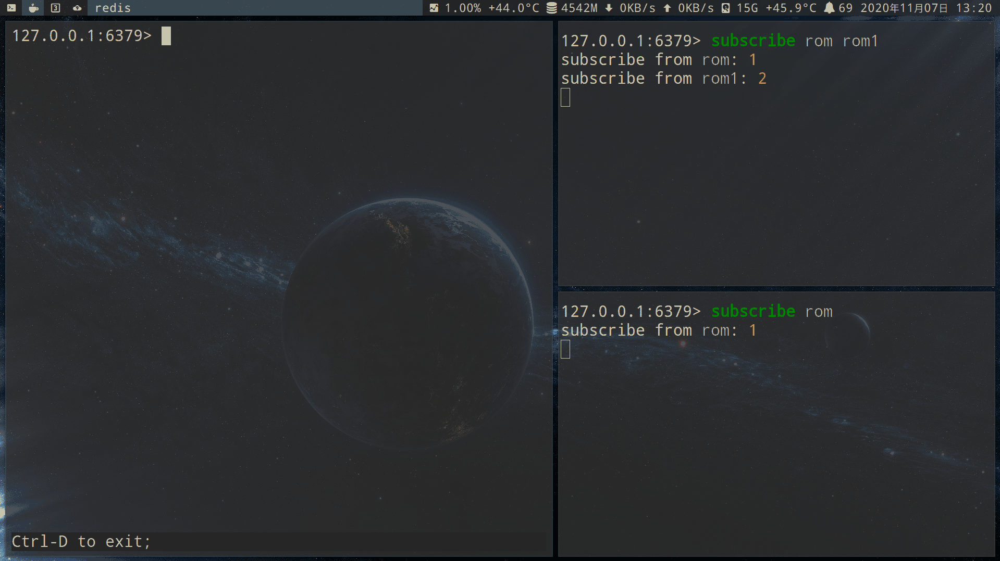

- `psubscribe` 通过通配符*,可以匹配 rom,rom1 等订阅.

    - psubscribe 信息类型为 `pmessage`
    - subscribe 信息类型为 `message`

    ```redis
    psubscribe rom*
    ```

    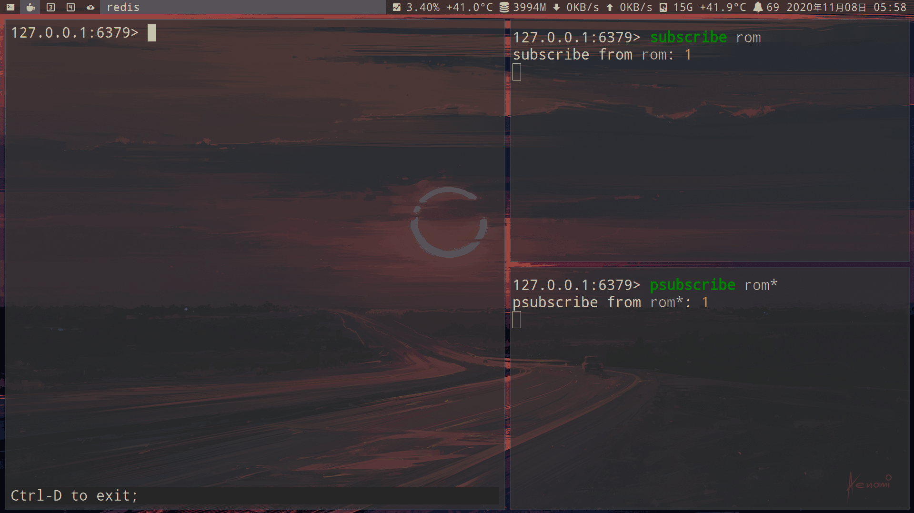

- Pub/Sub 原理

    - 每个 Redis 服务器进程维持着一个标识服务器状态的`redis.h/redisServer`结构

        ```c
        struct redisServer {
            // ...
            dict *pubsub_channels;  // 订阅频道
            list *pubsub_patterns;  // 订阅模式
            // ...
        };
        ```

        - `pubsub_channels`是一个 dict 字典结构，key（数组元素）为 channel，value 就是某个 client，client 以链表的方式串联起来

            - `SUBSCRIBE`：就是将 channel 和 client 加入到 dict 中
            - `PUBLISH`：只需要通过上述字典定位到具体的 channel，就能找到所有订阅该 channel 的客户端，再把消息发送给它们就好了。
            - `UNSUBSCRIBE`：将对应 channel 下面的链表中的 client 删除即可。

            

    - pubsub_patterns用于存储所有的 glob channel，它是一个 list 结构，节点类型为redis.h/pubsubPattern

        ```c
        typedefstruct pubsubPattern {
            redisClient *client;  // 订阅模式的客户端
            robj *pattern;        // 订阅的模式
        } pubsubPattern;
        ```

        - `PSUBSCRIBE`：程序就创建一个pubsubPattern添加到 pubsub_patterns 链表中。如果另一个客户端也订阅一个模式，则向链表的后面新增一个 pubsubPattern 节点即可。
            

        - `PUBLISH`：除了会在 pubsub_channels 中定位具体的 channel 之外，还会将指定的 channel 与 pubsub_patterns 中的模式进行对比，如果匹配成功的话，那么也将 message 发送到订阅那个模式的全部客户端。

            ```
            # 伪代码
            def PUBLISH(channel, message):
                # 遍历所有订阅频道 channel 的客户端
                for client in server.pubsub_channels[channel]:
                    # 将信息发送给它们
                    send_message(client, message)
                # 取出所有模式，以及订阅模式的客户端
                for pattern, client in server.pubsub_patterns:
                    # 如果 channel 和模式匹配
                    if match(channel, pattern):
                        # 那么也将信息发给订阅这个模式的客户端
                        send_message(client, message)
            ```

        - `PUNSUBSCRIBE`：删除 pubsub_patterns 中，client 和 pattern 信息对比一致的节点。

#### 键空间通知（监控改动的键）

接收那些以某种方式改动了 Redis 数据集的事件。[详情](http://redisdoc.com/topic/notification.html)

```redis
# 开启键空间通知
config set notify-keyspace-events "AKE"
```

```redis
# 订阅监听key
psubscribe '__key*__:*'
```


### streams(消息队列)

- [官方文档](https://redis.io/topics/streams-intro)

- [刘Java：Redis Stream 流的深度解析与实现高级消息队列【一万字】](https://juejin.cn/post/7112825943231561741?searchId=202308270748512C0BDDB8FBBD7BAB391C)

#### 消息队列的发展

- [阿里云开发者：Redis消息队列发展历程]()

    - List（列表）：

        - 1.通过 lpush 命令写入消息，通过 rpop 命令拉取消息，也可以使用 BRPOP 实现阻塞式的拉取消息。

            - brpop阻塞接口实现了长轮询，该效果等同于服务端推送，消费者能立刻感知到新的消息，而且通过设置合理的超时时间，使系统资源的消耗降到很低。

            

        - 2.rpop或brpop这样接口消费消息会先从队列中删除消息，然后再由应用消费，如果应用应用在处理消息前异常宕机了，消息就丢失了。

            - 但如果使用lindex这样的只读命令先读取消息处理完毕后在删除，又需要额外的机制来保证一条消息不会被其他消费者重复读到。

                - 因此需要通过2个list组和来完成消息的消费和确认功能。使用rpoplpush从list A中消费消息并移入list B，等消息处理完毕后在从list B中删除消息。

            

        - 优点：

            - Redis的接口是并发安全的，可以同时有多个生产者向一个list中生产消息，多个消费者从list中读取消息。

        - 缺点：

            - 不支持消息广播机制（每个消息只会被读取一次）。生产者生产的一个消息可以被多个消费者消费到，这个功能在分布式系统中非常重要。

    - Pub/Sub（发布/订阅）：支持消息多播

        

        - 优点：
            - 支持广播

            - psubscribe能按字符串通配符匹配：消费者可以会订阅一批channel
                - 例子：一个用户订阅了浙江的新闻的推送，但浙江新闻还会进行细分，例如“浙江杭州xx”、“浙江温州xx”，这里订阅者不需要获取浙江的所有子类在挨个订阅，只需要调用psubscribe“浙江*”就能订阅所有以浙江开头的新闻推送了

            - 能订阅特定key或特定命令的系统消息

            - 与数据库也无关：在 db10 上发布，将可以被 db1 上的订阅者听到。

        - 缺点：

            - 消息不会持久化

                - 必须先执行订阅，再等待消息发布。如果先发布了消息，那么该消息由于没有订阅者，消息将被直接丢弃。

            - 消息只管发送，不管接收，也没有 ACK 机制，无法保证消息的消费成功。如果某个消费者中途加入进来，或者挂掉重启，那么这之前丢失的消息也不能再次消费。

            - 如果消费者应用处理能力不足，消息就会在Redis的client buf中堆积，当堆积数据超过一个阈值后会断开这条连接，这意味着这些消息全部丢失了，在也找不回来了。

                - 如果同时有多个消费者的client buf堆积数据但又还没达到断开连接的阈值，那么Redis服务端的内存会膨胀，进程可能因为oom而被杀掉，这导致了整个服务中断。

            - 只能在同一个 `redis-server` 下使用

            - 结论：以上的缺点导致 Redis 的 Pub/Sub 模式就像个小玩具，在生产环境中几乎无用武之地，非常的尴尬！为此，Redis5.0 版本新增了 Stream 数据结构，不但支持多播，还支持数据持久化

    - Redis 5.0 stream


        - 优点：

            - 开销成本：存储message数据使用了listpack结构，这是一个紧凑型的数据结构，不同于list的双向链表每个节点都要额外占用2个指针的存储空间，这使得小msg情况下stream的空间利用率更高。

            - 持久化：stream的数据会存储在aof和rdb文件中
            - ack机制：保证消息至少被处理一次
                - 已经读取但没有ack的消息，stream会标示这条消息的状态为pending，等客户端重连后通过xpending命令可以重新读取到pengind状态的消息，继续处理。
                - 如果这个应用永久宕机了，并通过xclaim命令将转移到其他消费者

        - 消费组 (Consumer Group)：从 Kafka 借鉴的概念

            - `XREAD`命令可以实现一个消费者监听多个 Stream
            - 消费组`XREADGROUP`命令：多个消费者获取一个stream. entry被哪个消费者获取? 取决于哪个消费者更快(竞争)

                - kafka 的消费者组中的消费者还需要和分区对应，而 Redis 的消费者组中的消费者相当于直接从 Stream 中获取消息。

            - 功能：

                - 1.每条消息都提供给不同的消费者，因此不可能将相同的消息传递给同一个组内的多个消费者。
                - 2.在消费者组中，消费者通过名称进行标识，该名称是实现消费者的客户端必须提供的区分大小写的字符串。
                    - 即使在断开连接后，流消费者组仍保留所有消费者的状态，客户端可以再次声明为同一个消费者。
                - 3.ack：消费消息需要使用特定命令进行显式确认，表示此消息已正确处理，可以移除。

                    - 消费者组跟踪所有当前未 ack 的消息。因此每个消费者只会看到传递给它的消息。

            - 优点：
                - 消费者组实现同组多个消费者并行但不重复消费消息的能力，提升消费能力。
                - 消费者组能够记住最新消费的信息，保证消息连续消费
                - 消费者组能够记住消息转移次数
                    - 实现消费失败重试以及永久性故障的消息转移。
                    - 借此可以实现死信消息的功能（需自己实现）。
                - 消费者组提供了 PEL 未确认列表和 ACK 确认机制，保证消息被成功消费，不丢失

            - 数据结构：

                - 像是一个仅追加内容的消息链表，每个消息都有一个唯一的 ID 和内容
                

                - 1.消费者组（Consumer Group）：一个消费组可以有多个消费者 (Consumer) 同时进行组内消费，所有消费者共享 Stream 内的所有信息

                    - 但同一条消息只会有一个消费者消费到，不同的消费者会消费 Stream 中不同的消息，这样就可以应用在分布式的场景中来保证消息消费的唯一性。

                - 2.游标（last_delivered_id）：用来记录某个消费者组在 Stream 上的消费位置信息 **，每个消费组会有个游标，任意一个消费者读取了消息都会使游标 last_delivered_id 往前移动。

                    - 就是最新消费的消息ID：创建消费者组时需要指定从 Stream 的哪一个消息 ID（哪个位置）开始消费，该位置之前的数据会被忽略

                - 3.pending_ids：消费者内部的状态变量，作用是维护消费者的未确认的消息 ID。
                    - pending_ids 记录了当前已经被客户端读取，但是还没有 ack (Acknowledge character：确认字符）的消息。
                    - 如果客户端没有 ack，那么这个变量里面的消息 ID 就会越来越多，一旦某个消息被 ack，它就会对应开始减少。这个变量也被 Redis 官方称为 PEL (Pending Entries List)。

        - 重复处理问题：消息被重复处理要么是生产者重复投递，要么是消费者重复消费。

            - 解决生产者重复投递问题：

                - 每个消息都设置了一个唯一递增的id。当xadd超时后应用并不能确定消息是否投递成功，可以通过xread查询该id的消息是否存在，存在就说明已经投递成功，不存在则重新投递

                - 而且stream限制了id必须递增，这意味了已经存在的消息重复投递会被拒绝。

            - 解决消费者重复消费问题：考虑一个场景，消费者读取消息后业务处理完毕，但还没来得及ack就发生了异常，应用恢复后对于这条没有ack的消息进行了重复消费。这个问题因为ack和消费消息的业务逻辑发生在2个系统，没法做到事务性，需要业务来改造，保证消息处理的幂等性。


- 相比其他消息队列

    - 优点：基于内存存储，其速度相比于真正的消息队列比如 kafka、rocketmq 等更快
    - 缺点：
        - 也是因为内存的原因，我们无法使用 Redis Stream 长时间的存储大量的数据
        - 没有提供延时消息的能力

- 应用场景：由于基于内存，无法存储大量数据，因此在生产环境的应用也并不多

    - 更适用于小型、廉价的应用程序，以及可以丢弃数据的场景（限制 Stream 长度），比如记录某些不重要的操作日志。

#### 基本命令

| 命令       | 时间复杂度 |
|------------|------------|
| xpending   | O(N)       |
| xread      | O(N)       |
| xrange     | O(log(N)) 来寻找，然后 O(M) 来返回 M 个元素 |
| xrevrange  | O(log(N)) 来寻找，然后 O(M) 来返回 M 个元素 |
| xtrim      | O(N)       |
| xinfo      | O(N)       |
| xreadgroup | O(M)       |
| xclaim     | O(log N)   |
| xack       | O(1)       |
| xlen       | O(1)       |
| xadd       | O(1)       |
| xdel       | O(1)       |
| xgroup     | O(1)       |

```redis
# Stream 中每一个消息都有一个唯一的id
# 一条消息由一组字段值对组成，它基本上是一个小 dict 字典。键值对将会按照用户给定的顺序存储

# 添加消息到stream末尾(返回id值), *表示自动生成唯一id(毫秒时间戳 + 偏移量))
XADD mystream * key0 0
XADD mystream * key1 1 key2 2

# 指定id值
XADD mystream1 0-1 key0 0
XADD mystream1 0-2 key1 1 key2 2
XADD mystream1 10-1 key0 0
XADD mystream1 11-1 key0 0
XADD mystream1 100-1 key0 0

# 先插入entry, 并且只保留最新2条entry
XADD mystream MAXLEN 2 * value 1
# 或者
XTRIM mystream MAXLEN 1
XADD mystream * value 1

# 删除entry（不会真正的删除消息，它只是给消息做了个标志位）
XDEL mystream <id值>

# 数量限制（自动将最老的消息清除，确保最多不超过指定长度）。如果消息积累太多，那么 Stream 链表会很长，对内存来说是一个大问题。
XTRIM mystream MAXLEN 3

# 查看长度. 返回2
XLEN mystream

# 查看队列.复杂度 O(log(N))，迭代的每一步都很快。不需要 XSCAN 命令（Redis 没有提供 XSCAN）。
XRANGE mystream - +
# 查看队列, 顺序相反显示
XREVRANGE mystream + -

# 查看队列的详细信息
XINFO STREAM mystream

# 查看队列, 通过id值
XRANGE mystream1 <start:id值> <end:id值>

# 查看前2条entry
XRANGE mystream - + COUNT 2

# 查看指定id值后的2条entry
XRANGE mystream <id值> + COUNT 2


# XREAD(非阻塞), 查看mystream队列（非阻塞模式和 XRANGE 似乎没有太大的区别）
XREAD STREAMS mystream 0

# 读取多个队列
XREAD STREAMS mystream mystram1 0 0

# 查看前2条entry
XREAD COUNT 2 STREAMS mystream 0

# 阻塞获取最新的entry, 获取后返回。$表示返回的最大的 ID。
# 单位是毫秒，超时自动返回 null；0表示永久阻塞直到任何一个的 Stream 有数据返回。
XREAD BLOCK 0 STREAMS mystream $
```

- Consumer groups(消费者组)

```redis
# 为mystream创建消费者组。最后一个参数表示从哪里开始，0从第一条开始，$表示仅消费最新消息
XGROUP CREATE mystream mygroup $
# 如果mygroup不存在，才创建
XGROUP CREATE mystream mygroup $ MKSTREAM

# 查看组内的指定队列
XINFO GROUPS mystream

# 创建user0, 并获取最新的1条entry. > 表示获取到目前为止，从未传递给其他消费者的消息，并且会更新 last_delivered_id，通常都是传递这个参数。
XREADGROUP GROUP mygroup user0 COUNT 1 STREAMS mystream >

# 创建user1, 并获取最新的1条entry(最新的entry, 被user0还是user1获取? 取决于谁更快执行这条命令)
XREADGROUP GROUP mygroup user1 COUNT 1 STREAMS mystream >

# 查看user0, 已经获取的entry. 0表示消费者因故障重启时可以指定 ID 为 0 来获取分配给该消费者的所有未 ACK 的消息，实现消息的不丢失。
XREADGROUP GROUP mygroup user0 STREAMS mystream 0

# 查看指定队列的entry的未处理（待确认的）消息.消费者可能会永久失败并且永远无法恢复。待处理消息该怎么办呢？
# XDEL命令并未真正被移除，只是被标记为已删除，使用 XPENDING 也能够看到其还在存在于 PEL 中。
XPENDING mystream mygroup

# 查看所有entry的users获取情况(第三个参数为: entry从XADD到user XREADGROUP的时间(毫秒))
XPENDING mystream mygroup - + 2

# 查看每个user的entry的处理情况
XINFO CONSUMERS mystream mygroup

# 转移消息（假设用户故障无法恢复）。1小时后修改指定entry的ack用户为user1
XCLAIM mystream mygroup user1 3600000 <id值>

# 自动转移（相当于先调用 XPENDING，然后调用 XCLAIM）。1小时后修改指定entry在内的后10条entry的, ack用户为user1
XAUTOCLAIM mystream mygroup user1 3600000 <id值> COUNT 10

# 确认已经获取的entry, 确认后的entry无法从XREADGROUP获取，这条消息的 PEL 记录也被清除，从 Redis 服务器释放内存。
# 一旦消费者成功处理了一条消息，它就应该调用 XACK
XACK mystream mygroup <id值>
```

### HyperLogLog（概率集合）

- 应用

    - 网页统计UV （浏览用户数量，同一天同一个ip多次访问算一次访问，目的是计数，而不是保存用户）
        - 传统的方式，set保存用户的id，可以统计set中元素数量作为标准判断。
            - 但如果这种方式保存大量用户id，会占用大量内存，我们的目的是为了计数，而不是去保存id。

- 实际上是string类型, 通过一种基数算法实现set(集合)的效果

    - 算法论文: [Hyperloglog: the analysis of a near-optimal cardinality estimation algorithm](http://algo.inria.fr/flajolet/Publications/FlFuGaMe07.pdf)

    - 优点: 比set(集合)占用的内存小的多的多

    - 缺点: 存在误差率(官方数据是0.81%)

    - set vs HyperLogLog：假的每天100万个用户
        | 数据类型    | 1天 | 1个月 | 1年 |
        |-------------|-----|-------|-----|
        | set         | 80M | 2.4G  | 28G |
        | HyperLogLog | 15K | 450K  | 5M  |

        - 以上数据来源于《redis开发与运维》第3章的数据

        - 以下数据是在redis 7.0.11版本，我使用chatgpt生成的脚本进行测试

        
        
        

        | 数据类型    | 100万用户          |
        |-------------|--------------------|
        | set         | 53.77552795410156M |
        | hyperloglog | 14.078125K         |

```redis
# 新建两个key
pfadd 2022-3-19 'id1' 'id2'
pfadd 2022-3-20 'id1' 'id2' 'id3' 'id4'

# 查看2022-3-19的数量
pfcount 2022-3-19

# 合并为一个2022-3-19:merge:2022-3-20
pfmerge 2022-3-19:merge:2022-3-20 2022-3-19 2022-3-20
pfcount 2022-3-19:merge:2022-3-20
```

### 实现异步队列

- 1.List作为队列，通过RPUSH生产消息， LPOP消费消息

    - 问题：如果队列是空的，客户端会不停的pop，陷入死循环
    - 解决方法：
        - 当lpop没有消息时，可以使用sleep机制先休眠一段时间，然后再检查有没有消息。
        - 可以使用blpop命令，在队列没有数据的时候，会立即进入休眠状态，一旦数据到来，则立刻醒过来。这种做法的缺点是只能提供一个消费者消费

- 2.pub/sub主题订阅模式，发送者(pub)发送消息，订阅者(sub)接收消息

    - 问题：消息的发布是无状态的，无法保证到达，如果订阅者在发送者发布消息时掉线，之后上线也无法接收发布者发送的消息
    - 解决方法：使用消息队列

## Module(模块)

- docker安装

    ```sh
    # 包含所有模块
    docker run -d -p 6379:6379 redislabs/redismod
    ```

### [RedisJSON](https://oss.redis.com/redisjson/)

- [RedisJson 横空出世，性能碾压ES和Mongo！](https://cloud.tencent.com/developer/article/1922607)

    > 性能对比

- 编译安装

    ```sh
    # 进入redisjson的github仓库, 下载Releases里的source.zip文件
    curl -LO https://github.com/RedisJSON/RedisJSON/archive/refs/tags/v2.0.7.zip

    # 解压, 进入目录后

    # 编译
    cargo build --release
    ```

    - 加载模块启动
    ```
    redis-server --loadmodule /home/tz/v2.0.7/RedisJSON-2.0.7/target/release/librejson.so
    ```

    - 写入配置文件, 再启动
    ```
    # 配置文件/var/lib/redis/redis.conf加入以下行
    loadmodule /home/tz/v2.0.7/RedisJSON-2.0.7/target/release/librejson.so

    # 启动
    redis-server /var/lib/redis/redis.conf
    ```

    - 客户端连接后, 查看加载的模块
    ```
    info modules
    ```

- 基础命令

```redis
# 设置key
JSON.SET js $ '"bar"'

# 获取key
JSON.GET js
# 输出: "\"bar\""

# 获取key, 友好的输出
JSON.RESP js
# 输出: "bar"

# 删除key
JSON.DEL js

# 查看key类型
JSON.TYPE js

# 查看key的内存占用, 单位为bytes
JSON.DEBUG MEMORY js
```

- 字符串

```redis
JSON.SET js-str $ '"bar"'

# 查看长度
JSON.STRLEN js-str

# 在尾部添加字符串
JSON.STRAPPEND js-str '"baz"'
```

- 数(包含整数, 小数)

```redis
JSON.SET js-num $ 0

# 加1
JSON.NUMINCRBY js-num $ 1

# 减-0.75
JSON.NUMINCRBY js-num $ -0.75

# 乘2
JSON.NUMMULTBY js-num $ 2

JSON.GET js-num
# 输出: 0.5
```

- 数组

```redis
JSON.SET js-arr $ []

# 在末尾添加元素0
JSON.ARRAPPEND js-arr $ 0

# 0表示在头部添加元素 -2 1
JSON.ARRINSERT js-arr $ 0 -2 -1

JSON.GET js-arr $
# 输出: "[[-2,-1,0]]"

# 删除第1个元素外的其他元素
JSON.ARRTRIM js-arr $ 1 1

JSON.GET js-arr $
# 输出: "[[-1]]"

# pop最后一个元素
JSON.ARRPOP js-arr $
```

- object

```redis
JSON.SET js-obj $ '{"name":"tz","age":24,"married": false}'

# 修改key
JSON.SET js-obj $.age 25

# 操作json内的字符串类型
JSON.STRLEN js-obj $.name

# 操作json内的数类型
JSON.NUMINCRBY js-obj $.age 1

# 查看长度
JSON.OBJLEN js-obj $

JSON.GET js-obj $
# 输出: "[{\"name\":\"tz\",\"age\":26,\"married\":false}]"

JSON.RESP js-obj $
# 输出:以下
1) 1) "{"
   2) "name"
   3) "tz"
   4) "age"
   5) "26"
   6) "married"
   7) "false"

# 查看key
JSON.OBJKEYS js-obj $
# 输出以下
1) 1) "name"
   2) "age"
   3) "married"
```

```redis
JSON.SET js-obj1 $ '{"f1": {"a":1}, "f2":{"a":2}}'

# 修改a值
JSON.SET js-obj1 $..a 3

JSON.GET js-obj1
# 输出: "{\"f1\":{\"a\":3},\"f2\":{\"a\":3}}"

JSON.GET js-obj1 $.f1
# 输出: "[{\"a\":3}]"

JSON.GET js-obj1 $..a
# 输出: "[3,3]"
```

### [RediSearch](https://oss.redis.com/redisearch/)

- 编译安装
    ```sh
    git clone https://github.com/RediSearch/RediSearch.git
    cd RediSearch
    sudo make setup
    make build
    make run
    ```

    ```sh
    redis-server --loadmodule /path/to/module/src/redisearch.so
    ```

> FT.CREATE {index_name} ON JSON SCHEMA {json_path} AS {attribute} {type}

```redis
# 创建name索引
FT.CREATE userIdx ON JSON SCHEMA $.user.name AS name TEXT

# 创建json
JSON.SET myDoc $ '{"user":{"name":"tz","tag":"look book","hp":1000, "age":24}}'

# 搜索name
FT.SEARCH userIdx '@name:(tz)'

    1) "1"
    2) "myDoc"
    3) 1) "$"
       2) "{\"user\":{\"name\":\"tz\",\"tag\":\"look book\",\"hp\":1000,\"age\":24}}"

# 返回指定Field
FT.SEARCH userIdx '@name:(tz)' RETURN 1 name

    1) "1"
    2) "myDoc"
    3) 1) "name"
       2) "tz"

# 高亮
FT.SEARCH userIdx '@name:(tz)' RETURN 1 name HIGHLIGHT FIELDS 1 name TAGS '<b>' '</b>'

    1) "1"
    2) "myDoc"
    3) 1) "name"
       2) "<b>tz</b>"

# 聚合
FT.AGGREGATE userIdx '*' LOAD 6 $.user.hp AS hp $.user.age AS age APPLY '@hp-@age' AS hp-age

    1) "1"
    2) 1) "hp"
       2) "1000"
       3) "age"
       4) "24"
       5) "hp-age"
       6) "976"

# 删除索引
FT.DROPINDEX userIdx

# 添加自动补全
FT.SUGADD autocomplete "tz" 100

# GET
FT.SUGGET autocomplete "t"

    "tz"
```

- 数组索引
```redis
JSON.SET types:1 . '{"title":"fileltype1", "tags":["json","ini","yaml"]}'
JSON.SET types:2 . '{"title":"fileltype2", "tags":["json","yaml"]}'

# 创建索引
FT.CREATE types-idx ON JSON PREFIX 1 types: SCHEMA $.tags.* AS tags TAG

FT.SEARCH types-idx "@tags:{json}"

    1) "2"
    2) "types:1"
    3) 1) "$"
       2) "{\"title\":\"fileltype1\",\"tags\":[\"json\",\"ini\",\"yaml\"]}"
    4) "types:2"
    5) 1) "$"
       2) "{\"title\":\"fileltype2\",\"tags\":[\"json\",\"yaml\"]}"

FT.SEARCH types-idx "@tags:{ini}"

    1) "1"
    2) "types:1"
    3) 1) "$"
       2) "{\"title\":\"fileltype1\",\"tags\":[\"json\",\"ini\",\"yaml\"]}"
```

### [RedisBloom（布隆过滤器）](https://github.com/RedisBloom/RedisBloom)

- [官方文档](https://redis.io/docs/data-types/probabilistic/bloom-filter/)

```redis
# 添加foo
BF.ADD newFilter foo

# 查询foo
BF.EXISTS newFilter foo

# MADD
BF.MADD myFilter foo bar baz

# 自定义过滤器。0.0001表示错误率 600000表示期望元素个数
#1% error rate requires 10.08 bits per item
#0.1% error rate requires 14.4 bits per item
#0.01% error rate requires 20.16 bits per item
BF.RESERVE customFilter 0.0001 600000
```

### [redis-cuckoofilter（布谷鸟过滤器）](https://github.com/kristoff-it/redis-cuckoofilter)

- [官方文档](https://redis.io/docs/data-types/probabilistic/cuckoo-filter/)

### docker中的redismod（包含所有模块）

```sh
docker run -d -p 6379:6379 redislabs/redismod
```

## transaction (事务)

- 关系型数据库的事务：除查询操作以外，插入(Insert)、删除(Delete)和更新(Update)这三种操作都会对数据造成影响，因为事务处理能够保证一系列操作可以完全地执行或者完全不执行，因此在一个事务被提交以后，该事务中的任何一条SQL语句在被执行的时候，都会生成一条撤销日志(Undo Log)。

- Redis事务的特性

    - 不保证原子性：单条的Redis命令是原子性的，但事务不能保证原子性。

    - 有隔离性的：但没有隔离级别，事务中的所有命令都会序列化、按顺序地执行。事务在执行的过程中，不会被其他客户端发送来的命令请求所打断。（顺序性、排他性）

    - 不支持回滚：Redis执行过程中的命令执行失败，其他命令仍然可以执行。（一次性）

        - 为什么redis不支持回滚来保证原子性？

            - Redis 命令只会因为错误的语法而失败（并且这些问题不能在入队时发现），或是命令用在了错误类型的键上面：这也就是说，从实用性的角度来说，失败的命令是由编程错误造成的，而这些错误应该在开发的过程中被发现，而不应该出现在生产环境中。

            - 鉴于没有任何机制能避免程序员自己造成的错误， 并且这类错误通常不会在生产环境中出现， 所以 Redis 选择了更简单、更快速的无回滚方式来处理事务。

- 一组命令中存在两种错误不同处理方式

    - 1.代码语法错误（编译时异常）所有命令都不执行
        - 打错字会造成事务无法运行。例子：set写成sett

    - 2.代码逻辑错误（运行时错误），其他命令可以正常执行  （该点不保证事务的原子性）

```redis
# 新建一个key
set t 100

# 开启事务
multi
# 修改key
incr t

# 保存事务。如果结果为nil表示事务没有执行
exec
# 如果不保存,discard可以恢复事务开启前
discard
```

- `watch`(乐观锁) 监视一个(或多个) key ,如果在事务执行之前这个(或这些) key 被其他命令所改动,那么事务将被打断

    

    - 两个客户端:

        - 右客户端开启事务后, 执行 `incr t` 后

        - 被左边执行 `set t 100` 修改了 t 的值

        - 所以右边在 `exec` 保存事务后,返回(nil).事务对 t 值的操作被取消

    | 左边客户端   | 右边客户端   |
    | ------------ | ------------ |
    |              | set t 100    |
    |              | watch t      |
    |              | multi        |
    |              | incr t       |
    |              | incr t       |
    | set t 100    |              |
    |              | exec         |

    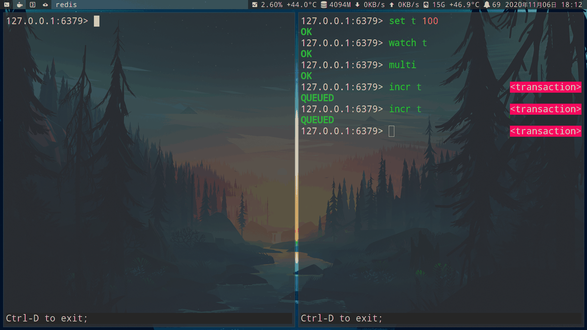

## [pipelining(流水线执行命令)](https://redis.io/topics/pipelining)

- pipeline可以让redis-server一次接收一组指令（在内核态中存入输入缓冲区，收到客户端的Exec指令再调用read() syscall）后再执行，减少I/O(即accept -> read -> write)次数

- 事务 vs pipelining:

    - 事务是原子的, pipelining不是原子的.因此事务不能同时运行, 而pipelining可以交替运行

    

- 普通timeline vs pipelining:

    - 网络的优势:

        - 普通情况: 客户端向服务器发送命令, 然后等待响应. 每条命令的花费1次rtt(往返时间)

        - pipelining: 客户端向服务器一次发送多条命令. 多条命令花费1次rtt(往返时间)

    - io的优势:

        - 每次执行都需要read(), write()的系统调用

            - 因此pipelining让多条命令只使用1次read(), write(), 从而可以减少内核态与用户态之间的上下文切换开销。

            - 在redis6.0 io多线程之前，基于golang redis客户端的简单高频命令的Benchmark测试：

                ```sh
                # 不使用pipelining
                perf stat -p 15537 -e context-switches -a sleep 10

                 Performance counter stats for process id '15537':

                            96,301      context-switches

                      10.001575750 seconds time elapsed
                ```

                ```sh
                # 使用pipelining
                perf stat -p 15537 -e context-switches -a sleep 10

                 Performance counter stats for process id '15537':

                                17      context-switches

                      10.001722488 seconds time elapsed
                ```

- pipeline虽然好用，pipeline组装的命令个数过大的缺点：

    - 1.增加客户端的等待时间

    - 2.会造成一定的网络阻塞

    - 解决方法：

        - 可以将一次包含大量命令的pipeline拆分成多次较小的pipeline来完成

            - 可以将pipeline的总发送大小控制在内核输入输出缓冲区大小之内（内核的输入输出缓冲区大小一般是 4K-8K

- 问题: redis cluster分布式方案下, 不能使用pipeline

    - 解决方法1: 客户端保存slot(哈希槽)和redis结点的关系

        - 支持的客户端有: go-redis

    - 解决方法2: [codis: 在服务器与客户端之间加入一层代理, 通过分槽实现pipeline](https://github.com/CodisLabs/codis)

## client（客户端）

```redis
# 查看当前客户端名字
client getname

# 设置名字
client setname tz

# 查看当前客户端id
client id

# 查看所有客户端
client list

# 关闭客户端(不过即使关闭了,一般会自动重新连接)
client kill 127.0.0.1:56352

# 阻塞客户端(slave客户端除外)
client pause <time(毫秒)>
```

`monitor`命令：监听其他客户端正在执行的命令，并记录详细时间戳

    

### client list（客户端连接信息）vs info clients

| 命令         | 优点                 | 缺点                                                       |
|--------------|----------------------|------------------------------------------------------------|
| client list  | 能精确分析每个客户端 | 阻塞命令，需要遍历所有客户端连接，收集连接信息             |
| info clients | 速度快               | 只是返回已保存的统计，不需要遍历客户端，所以不会阻塞服务器 |

- `client list` 命令:

    

    - [官方文档](https://redis.io/commands/client-list/)

    - `id`:客户端连接的唯一标识。这个id会随着reids连接自增，重启后为0
    - `fd`:socket文件描述符，与`lsof`命令中的fd是同一个，如果不是外部客户端，而是redis内部的伪装客户端fd=-1
        

    - `flag`：客户端类型

        | 类型 | 描述                                                |
        |------|-----------------------------------------------------|
        | A    | 尽可能快地关闭连接                                  |
        | b    | 客户端正在等待阻塞事件                              |
        | c    | 回复完整输出后，关闭链接                            |
        | d    | 一个受监视（watched）的键已被修改， EXEC 命令将失败 |
        | i    | 客户端正在等待 VM I/O 操作（已废弃）                |
        | M    | 客户端是主节点（master）                            |
        | N    | 未设置任何 flag                                     |
        | O    | 客户端正在执行monitor                               |
        | P    | 客户端是Pub/Sub subscriber                          |
        | r    | 客户端对集群节点处于只读模式                        |
        | S    | 普通客户端（normal）                                |
        | u    | 客户端未被阻塞（unblocked）                         |
        | U    | 客户端通过unix domain socket进行连接                |
        | x    | 客户端正在执行事务                                  |

    - 连接/空闲时间:

        - `age` 客户端连接的时间

        - `idle`(空闲时间)

    - 输入/输出缓冲区:

        - 输入缓冲区: `qbuf`, `qbuf-free`: 将client的发送的命令暂时保存, redis服务器会拉取并执行

            - 对单个客户端的输入缓冲区，之前固定为1gb，在4.0之后改为可配置
                ```redis
                # 这里是默认配置1gb
                client-query-buffer-limit: 1073741824
                ```

            - 大小根据输入内容的大小不同动态调整，至少要求每个客户端不能超过1G，超过会被kill掉

            - bigkey：如果输入缓冲区的命令包含大量bigkey，会造成redis阻塞，短期内不能处理命令

                - `info clients`命令中的`client_recent_max_input_buffer`代表最大输入缓冲区，可以设置超过10M就进行报警

        - 输出缓冲区: `obl`(固定缓冲区: 16KB的字节数组), `oll`(动态缓冲区: 列表), `omem`(使用的字节数) : 将client的发送的命令暂时保存, redis服务器会拉取并执行

            - `obl` 用完后, 会使用`oll`
                - 例子：当前客户端固定缓冲区的长度为0，动态缓冲区有4869个对象，两部分共使用了133081288直接=126M内存
                ```redis
                127.0.0.1:6379> client list
                id=3 addr=127.0.0.1:47586 laddr=127.0.0.1:6379 fd=7 name= age=1020 idle=0 flags=N db=0 sub=0 psub=0 ssub=0 multi=-1 qbuf=26 qbuf-free=20448 argv-mem=10 multi-mem=0 rbs=1024 rbp=0 obl=0 oll=4869 omem=133081288 tot-mem=22298 events=r cmd=client|list user=default redir=-1 resp=2
                ```

            - 相比输入缓冲区，输出缓冲区出现异常的概率更大

            - 输出缓冲区分3种客户端:

                - normal(普通客户端)

                - pusbsub(发布/订阅客户端)

                - slave(主从复制里的从客户端)

                    - 应适量增大slave客户端的输出缓冲区: 因为slave会比较大, 如果缓冲区溢出会被kill

                ```redis
                # 配置从客户端, hard limit为256mb(大于时, 客户端会被立刻关闭), soft limit为64mb(大于时, 超过60秒后才关闭)
                client-out-buffer-limit slave 256mb 64mb 60
                ```

            - `info clients`命令中的`client_logest_output_list`：代表最大输出缓冲区的对象数

            - monitor监控命令：生产环境应禁止使用。因为monitor在高并发的情况下, 会让输出缓冲区增大, 最后内存超过`maxmemory` 导致OOM

        - 输入/输出缓冲区大小不受maxmemory控制：假设maxmemory设置了4G，已经使用2G，而此时输入缓冲区的大小为3G，可能会造成数据丢失、键值淘汰、oom等情况。
            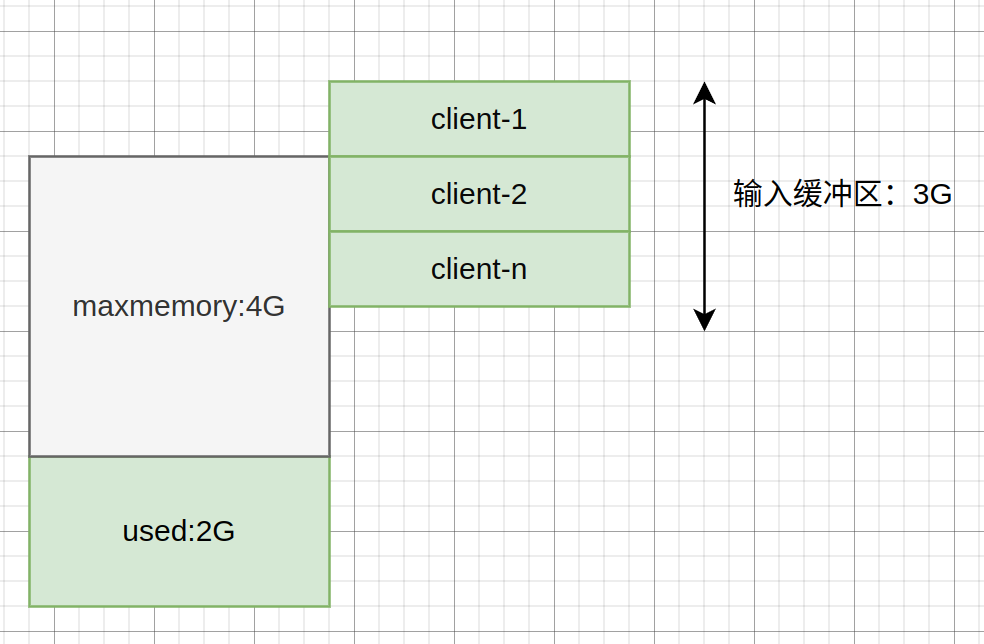

- `info client` 命令:

    

    | 参数                       | 内容                                                       |
    |----------------------------|------------------------------------------------------------|
    | connected_clients          | 已连接客户端的数量（不包括通过从属服务器连接的客户端）     |
    | client_longest_output_list | 当前连接的客户端当中，最长的输出列表                       |
    | client_longest_input_buf   | 当前连接的客户端当中，最大输入缓存                         |
    | blocked_clients            | 正在等待阻塞命令（BLPOP、BRPOP、BRPOPLPUSH）的客户端的数量 |

- `info stats`的有两个客户端相关的命令
    - `total_connections_received`：redis自启动以来，处理的客户端连接总数
    - `rejected_connections`：redis自启动以来，拒绝的客户端连接总数

#### 客户端配置


- client list命令的`idle`(空闲时间): 一旦`idle` 超过`timeout` 值(默认为0), 客户端会被关闭

    - `age`等于`idle`：表示一直处于空闲

    - 因此建议设置为300秒, 防止客户端bug

        ```redis
        # 查看timeout
        config get timeout

        # 设置timeout为300秒
        config set timeout 300

        # 写入配置文件
        config rewrite
        ```

        - 如果设置了`loglevel`为debug级别，可以看到客户端被关闭的日志
        ```
        12885:M 26 Aug 08:46:40.085 - Closing idle client
        ```

- `maxclients`：客户端最大连接数

- `tcp-keepalive`：检测tcp连接活性的周期（默认值为0，也就是不进行检测）。如果设置，建议设置60秒，那么redis每隔60秒会对它创建的tcp连接进行活性检测，防止大量死连接占用系统资源

- `maxmemory-clients`：所有clients最大内存的限制，当超过该限制后，Redis将会按照一定策略杀掉问题客户端，称为`client eviction`
    ```redis
    # 两种配置方法

    # 具体值
    maxmemory-clients 1g
    # 百分比：为maxmemory配置的XX%（如果整机部署密度较高，建议配置一定百分比，但会有客户端被干掉的风险。）
    maxmemory-clients 10%
    ```
### RESP（与服务端通信的字符串格式）
- `set hello world`命令的RESP格式
    ```
    *3
    $3
    SET
    $5
    hello
    $5
    world
    ```

    - 第1行的*号：参数数量3个
    - 第2行的$号：参数的字节数

    - 并且每一行之间会以CRLF（\r\n）表示。以下为实际RESP格式
    ```
    *3\r\n$3\r\nSET\r\n$5\r\nhello\r\n$5\r\nworld\r\n
    ```

### 编程语言

#### java

##### Jedis

|        | 优点                                                                         | 缺点                                                                                                           |
|--------|------------------------------------------------------------------------------|----------------------------------------------------------------------------------------------------------------|
| 直连   | 简单方便，适用于少量长期连接的场景                                           | 1.存在每次新建/关闭tcp连接开销  2.无法限制Jedis对象的个数，在极端情况下可能造成连接泄漏 3.Jedis对象线程不安全 |
| 连接池 | 1.无需每次连接都生成Jedis对象，降低开销 2.使用连接池形式保护和控制资源的使用 | 更麻烦，资源管理上需要很多参数保证，一旦规划不合规也会出现问题                                                 |

- jedis的直连

    ```java
    Jedis jedis = new Jedis("127.0.0.1", 6379)
    jedis.set("hello", "world")
    jedis.close()
    ```

- 连接池：生产环境一般使用连接池进行管理。预先初始化好Jedis连接，每次只需要向连接池借用就可以了。借用和归还都是本地操作，只有少量同步开销，远远小于tcp连接的开销。

    ```java
    // 使用默认连接池配置（默认8个Jedis对象，超过后就需要等待）
    GenericObjectPoolConfig poolConfig = new JedisPoolConfig();

    //创建Jedis连接池
    JedisPool jedisPool = new JedisPool(poolConfig,"localhost",6379);
    Jedis jedis = null;
    try {
        jedis = jedisPool.getResource()
        jedis.set("key1", "value1");
        jedis.get("key1");
    } catch (Exception e) {
        logger.error(e.getMessage(), e);
    } finally {
        if (jedis != null){
            // 如果使用jedisPool.close();操作不是关闭连接，而是归还连接池
            jedis.close();
        }
    }
    ```

##### Lettuce

- [阿里云开发者：Redis客户端Lettuce深度分析介绍（上）](https://developer.aliyun.com/article/917568)

    - Spring Boot自2.0版本开始默认使用Lettuce作为Redis的客户端

        - Lettuce客户端基于Netty的NIO框架实现，对于大多数的Redis操作，只需要维持单一的连接即可高效支持业务端的并发请求 —— 这点与Jedis的连接池模式有很大不同。

        - 本文通过分析Lettuce的特性和内部实现（基于6.0版本），及其与Jedis的对照比较

    - NIO通常被理解为non-blocking I/O的缩写，表示非阻塞I/O操作。

        - 《Java并发编程实战》中提到：「与基于锁的方案相比，非阻塞算法在设计和实现上都要复杂得多，但它们在可伸缩性和活跃性上却拥有巨大优势。由于非阻塞算法可以使多个线程在竞争相同的数据时不会发生阻塞，因此它能在粒度更细的层次上进行协调，并且极大地减少（线程）调度开销。

        - Netty NIO框架概述：作为Lettuce的底层框架

            

            - Channel表示一个连接通道，用于承载连接管理及读写操作

            - EventLoop则是事件处理的核心抽象。一个EventLoop可以服务于多个Channel，但它只会与单一线程绑定。

                - 业务端的并发请求均会被放入EventLoop的任务队列中，最终被该线程顺序处理。同时，Lettuce自身也会维护一个队列，当其通过EventLoop向Redis发送指令时，成功发送的指令会被放入该队列；当收到服务端的响应时，Lettuce又会以FIFO的方式从队列的头部取出对应的指令，进行后续处理。

            - 其中除了选择器Selector的事件监听动作外，对连接通道的读写操作均以非阻塞的方式进行

        - Redis服务端本身也是基于NIO模型，使用单一线程处理客户端请求。虽然Redis能同时维持成百上千个客户端连接，但是在某一时刻，某个客户端连接的请求均是被顺序处理及响应的（注3）。

            - Redis客户端与服务端通过TCP协议连接，而TCP协议本身会保证数据传输的顺序性。

            

            - Lettuce在保证请求处理顺序的基础上，天然地使用了管道模式（pipelining）与Redis交互

                - 在多个业务线程并发请求的情况下，客户端不必等待服务端对当前请求的响应，即可在同一个连接上发出下一个请求。

                - Jedis只能在处理完某个Redis连接上当前请求的响应后，才能继续使用该连接发起下一个请求 —— Lettuce和Jedis之间的这种差异，在某种程度上与HTTP/2和HTTP/1之间的差异类似

                - 假设在延迟非常高的网络条件下，RTT达到250ms，此时就算服务端拥有每秒处理100k请求的能力，（基于单一连接）整体的QPS也仅仅只有4。

                    - 而如果借助管道模式，客户端则可以一次性发出大量（如1k）请求，并随后一次性接收大量服务端的响应，从而显著提高请求处理速度。

                    

        - 笔者使用JMH框架模拟客户端高并发请求（200线程）的场景，基于单一Redis连接，对上述特性进行测试。
            - Redis服务端运行在阿里云的ECS上，与客户端所在机器的RTT约为12ms。在非管道模式下，如基于Jedis客户端的单个连接，整体的QPS理论上只能达到80+，实测更低；而同样是基于单个连接，借助Lettuce客户端，笔者实测录得7000+QPS。
            - 当然，此处的比较主要是为了说明Lettuce的管道特性，因为生产环境中Jedis总是配合连接池一起使用的。

    - 在管道模式下，一次socket读操作，也有可能会读取到多条Redis响应。

        - 在同步调用模式下，当Redis指令被标记为完成后，正在等待响应的业务线程便可以拿到结果数据了。
        - 调用模式为异步，则对响应结果的后续处理默认由EventLoop线程执行。这里RedisCommand指令对象和前述的RedisFuture结果对象似乎并不相同，但实际上它们都指向同一个实例（AsyncCommand）。

    - Lettuce与Jedis的性能比较：

        - Lettuce通过在单一共享连接上，以管道模式的方式与Redis交互；Jedis则通过其维护的连接池，对Redis进行并发操作

        
        

        - Redis官网文档《Using pipelining to speedup Redis queries》中的论述：

            - 管道模式：作用不仅仅在于其减少了网络RTT带来的延迟影响，同时，它也显著提升了Redis服务器每秒可执行的指令操作量。

                - 在Redis的管道模式下，单次read系统调用便可读取到许多指令，且单次write系统调用也能回写许多响应 —— 相比一次read或write系统调用仅处理一个客户端请求而言，这进一步降低了服务端处理请求时的上下文切换开销。

                - Redis的每秒请求处理数，随着管道的加长（即管道中指令数量的增加）会有接近线性的提升，并最终可达到非管道模式下处理性能的约10倍水平。

            - 不使用管道模式：虽然从访问内存数据并生成响应的角度看，Redis处理某条指令操作的成本是很低的，但是从执行套接字I/O操作的角度看，当需要逐个处理大量客户端请求时，对Redis来说（相对于内存操作）成本是很高的。套接字I/O操作涉及read和write这两个系统调用，这意味着Redis需要（频繁地）从用户态切换到内核态，而由此导致的上下文切换会非常耗时。

                - 套接字I/O操作涉及read和write这两个系统调用，这意味着Redis需要（频繁地）从用户态切换到内核态，而由此导致的上下文切换会非常耗时。

                    - 比如Netty的EventLoop遵循Java NIO的模式，仅与单个线程绑定（注7）；JDK 6中默认开启自旋锁，以尽可能减少线程切换的开销（注8）；Go语言更是使用goroutine替代线程，以提高程序并发性能

        - Lettuce能够天然地以管道的方式与Redis交互，但这并不意味着Jedis不支持管道特性。
            - 通过调用Jedis实例的pipelined方法显式地开启某个Jedis实例的管道特性。
                - 然而，由于Jedis客户端是通过连接池承载业务并发请求，而Jedis实例本身不是线程安全的，因此，单个Jedis实例的管道特性并不能服务这种常见的web应用场景。
                - Jedis实例的管道特性在其他场景下还是有用武之地的：如笔者曾使用GitHub上的开源项目Orestes-Bloomfilter进行基于Redis的分布式布隆过滤，其底层实现便是使用了Jedis实例的管道特性（注16）。

        - 从客户端的角度看，在Redis服务端指令处理速率相同的情况下，Jedis在多核处理器上的性能应该是高于仅使用单一Redis连接情况下的Lettuce的。

        - 下面笔者使用JMH（Java Microbenchmark Harness）框架，模拟业务高并发请求场景，基于localhost本地Redis服务

            - 我们使用200个并发线程，分别对Jedis连接池模式、Lettuce单连接模式、Lettuce连接池模式，以及Lettuce多连接模式（后文会对该模式作进一步阐释）进行测试。

            

            - 结论：与Jedis或Lettuce的连接池模式相比，多连接模式发挥了能够以管道模式与Redis交互的优势；与Lettuce单连接模式相比，多连接模式又充分利用了多核处理器的并行操作能力。

            - Jedis在连接池连接数达到200时，性能损耗严重；而Lettuce连接池模式的表现虽然有些差强人意，但是与Jedis相反，其性能在连接数达到200时，反而上了一个台阶。

                - 通过top和ps命令观察Jedis在不同连接数下测试时的CPU使用情况：当连接数为50时，CPU各项指标处于一个比较均衡的水平；而当连接数为200时，Jedis对CPU的使用急剧上升，同时，其中约90%以上的CPU时间消耗在了内核态。

            - 同样是在连接池模式下，Lettuce的性能随着连接数的增加不降反升，在连接数达到200时反而达到了该模式下的最高性能水平。

                - 由于Lettuce是基于Netty框架开发的，测试并发线程在拿到Lettuce连接后，并不会直接与Redis发生交互，而是将请求投递至Netty EventLoop的任务队列，最终由EventLoop完成Redis请求的发送和响应的接收。
                - EventLoop仅与单一线程绑定，并且可以服务于多个连接。外部线程虽然可以通过其持有的连接，并发地向某个EventLoop提交写请求，但是这些请求都会被放入任务队列中，最终被EventLoop线程顺序处理。

                - 阅读源码可知，Lettuce默认会生成与处理器核数相同数量的EventLoop，来处理所有Redis读写请求。因此，在其连接池模式下，我们的测试业务线程的并发度，可以说既受到连接池连接数的制约，又受到了EventLoop的制约。

            - Lettuce在连接数为8时，性能表现出众，位居第一。

                - 参考《Java并发编程实战》中对线程池大小的设置的论述作为总结：

                    - 如果线程池过大，那么大量的线程将在相对很少的CPU和内存资源上发生竞争，这不仅会导致更高的内存使用量，而且还可能耗尽资源。
                    - 如果线程池过小，那么将导致许多空闲的处理器无法执行工作，从而降低吞吐率。

                    - 对于计算密集型的任务，在拥有Ncpu个处理器的系统上，当线程池的大小为Ncpu+1时，通常能实现最优利用率。
                    - 对于包含I/O操作或者其他阻塞操作的任务，由于线程并不会一直执行，因此线程池的规模应该更大。
                        - 当任务需要某种通过资源池来管理的资源时，例如数据库连接，那么线程池和资源池的大小将会相互影响。如果每个任务都需要一个数据库连接，那么连接池的大小就限制了线程池的大小。

- 另一方面，我们推测Lettuce自身某些代码片段的执行，带来了额外的性能损耗。否则，在连接数为200的情况下，Lettuce连接池模式似乎应该与配备8个连接的Jedis在性能上更加接近

- Lettuce在连接池模式（200连接）下的业务线程benchmarking火焰图。

    

    - 黄色部分表示Java方法调用，蓝色部分表示native调用。

    - 消耗时间占比最多的顶部Lettuce方法依次为

        - 1.AsyncCommand#await方法（约58%）
            - 为业务线程将Redis请求投递至Netty EventLoop后调用，用于等待请求处理的响应

        - 2.ConnectionWrapping#wrapConnection方法（约10%）
            - 用于简化对连接池的使用，使我们在try语句块中获取并使用完连接后，不用编写代码将其显式归还
        - 3.CommandExpiryWriter#potentiallyExpire方法（约8%）
            - 基于用户指定的超时时间，对请求进行超时控制

        - 优化：

            - 对方法1没有优化的必要：其火焰图上层顶部停留在Unsafe#park方法调用，表示线程处于挂起等待状态。虽然占据了一半多的时间，但是在此状态下线程并不消耗CPU资源，而是在等待Redis请求的处理响应。

            - 对于方法2和方法3：笔者通过显式归还连接池连接、设置超时时间为0（即持续等待）的方式绕过后，benchmarking QPS性能提升约20%，最终与8连接Jedis性能基本持平。

                - 方法2使用动态代理对从连接池获取的Lettuce连接进行封装，以实现连接在被自动关闭（AutoCloseable#close）时，可自动返还连接池的能力。从火焰图中可以看到，由于每次从连接池取出连接时都需要进行代理封装，该特性导致Proxy#newProxyInstance方法被高频调用，成为方法2耗时的主要原因。
                    - 优化方法：我们可以通过显式归还连接的方式绕过

                - 方法3中所涉及的Redis请求超时控制，则是通过任务调度的方式实现的。具体来说，在将请求投递至Netty EventLoop之前，Lettuce会为该请求调度一个超时任务。超时任务会被放入阻塞队列LinkedBlockingQueue中，最终由Netty的EventExecutor消费执行。

                    - 顶部停留在Unsafe#unpark调用，即唤起EventExecutor这一步。与方法1所涉及的Unsafe#park调用类似，Unsafe#unpark调用本身并不耗时。因此我们可以判断此处发生了线程上下文切换 —— 即内核中断了业务线程的执行，转而执行被唤醒的EventExecutor线程。这可以说是上下文切换对程序性能造成负面影响的又一个实例。

                    - 优化方法：
                        - 通过设置超时时间为0，即不作请求超时控制来绕过的做法，在生产环境显然是不合适的。
                        - 笔者想到了Netty提供的时间轮算法 —— HashedWheelTimer。该算法专门为I/O请求超时管理而设计。
                            - HashedWheelTimer实例维护了一个工作线程，每隔一小段时间（默认100ms），该线程会收取新的超时任务，并执行已经到期的任务。而此处业务线程与工作线程间对超时任务的传递，是通过JCTools提供的MpscArrayQueue实现的。

#### python

- [python的redis客户端列表](https://redis.io/clients#python)

###### redis-py

- [官方文档](https://redis.readthedocs.io/en/stable/)

- `hash`类型对应python的`dict字典`类型

```py
import redis
r = redis.Redis()

# 防止redis连接失败,在r = redis.Redis()后,可以try: r.client()
try:
    r.client()
except redis.exceptions.ConnectionError:
    r.close()
    return 1

# set
r.mset({'1': 'google', '2': 'baidu'})
r.get('1')
```

- transaction(事务), pipeline(流水线执行命令)

```py
import redis

r = redis.Redis()

# 默认transaction=True表示事务执行, 而不是流水线执行
pipe = r.pipeline(transaction=False)
pipe.set('foo', 'bar')
pipe.get('foo')

# pipe缓冲区队列.当execute()才会执行
pipe.execute()
# 或者
pipe.set('foo', 'bar').get('foo').execute()
```

###### [redis-om-python: 对象模板](https://github.com/redis/redis-om-python)

###### [pottery:以python的语法访问redis](https://github.com/brainix/pottery)

```py
import pottery

# 列表
list1 = pottery.RedisList([1, 4, 9, 16, 25], key='list1')
for i in list1:
    print(i)
```

#### Lua 脚本

- Redis 7.0的Function

    - Function的出现很好的对Lua脚本进行了补充，它允许用户向Redis加载自定义的函数库

    - FUNCTION LOAD会把函数库自动进行主从复制和持久化存储；而SCRIPT LOAD则不会进行持久化和主从复制，脚本仅保存在当前执行节点。

    - 我们也非常建议大家逐步将Redis中的Lua脚本替换为Function。

- Redis 原生的事务（watch-multi-exec）机制只是一种带有 key watch 机制的批量执行手段，实际上和传统数据事务所强调的 ACID 不搭边。Redis 为了弥补自身的一些缺陷，引入了 Lua 作为存储过程的替代实现。

    - 得益于一直以来的单线程实现，Lua 脚本在 Redis 服务端是顺序执行的，也就保证了原子性。

    - 有了 Lua 这个灵活的机制，Redis 的边界被进一步被拓宽，诸如分布式锁这样的组合特性很快便流行开来。

    - 但实际上 Lua 的执行是有额外的开销的，词法分析、语法分析、JIT 以及跨越语言边界的 2 次额外数据类型转换。

    

- 但是 Lua 带来的这些成本问题并没有阻碍 Lua 的大量使用，因为这个特性极大的简化了很多业务逻辑。

    - 在很多场景下，大量的数据从存储服务读取到业务服务器，然后处理后又被写回。这个处理过程中很多时间和带宽被浪费在了数据的来回搬运上，以及业务服务为了原子性而采用的分布式锁甚至更重的机制上。

        - 如果一段针对数据的操作能简单的推送到服务端原子的执行，这就可以大幅度的简化业务逻辑，并且在整体性能上可能会更好。

            - 然而，一旦这个逻辑涉及到多个 key 时，在多个存储节点组成的集群模式下，这个操作就难以进行了。

            - 所以 Redis 集群模式下限定一个 Lua 脚本操作的 key 不得跨 slot，否则涉及到多个存储节点的 Lua 是无法解决原子性的问题的，而分布式事务显然太重了，不符合 Redis 的设计理念。

    - 特别地，在游戏客户的眼里，Lua 是一个可以帮助他们大幅度简化业务逻辑的机制。

        - 小到登录 Session 的多地域防重复登录，即时排行榜的维护，大到反作弊机制的完整解决方案，都有这广泛的应用场景。

        - 而且在短、平、快的游戏迭代中，谁能早一天发布，谁就能多一点市场机会。因为维护一个全游戏玩家的一致性视图是很困难的，所以分区分服是常见的业务策略。
            - 这样一个区/服的数据量进一步缩小和独立，如果能在一个数据节点上存储所有的数据，并且完整的支持 Lua 机制的话对游戏开发来说是很幸福的事情。

##### 基本命令

- `eval` 命令: 执行lua语句

```redis
# return 1 (0表示传递参数的数量)
eval "return 1" 0

# return 123
eval "return {1,2,3}" 0

# return key和值(这里是a和123)
eval "return {KEYS[1],ARGV[1]}" 1 a 123
eval "return {KEYS[1],KEYS[2],ARGV[1],ARGV[2]}" 2 a b 123 321
```

- `evalsha` 命令: 执行已经加载进redis内存的lua脚本

    - 避免每次发送lua脚本

```redis
# script load 会把脚本缓存进服务器,并返回hash(SHA1)值
script load "return {1,2,3}"

# evalsha 执行哈希值的脚本, 0表示传递参数的数量 (一般情况下执行eval命令,底层会转换为执行evalsha)
evalsha <hash> 0

# 查看脚本是否已经加载到redis内存当中
script exists "<hash>"

# 清空redis内存中的脚本
SCRIPT FLUSH

# 杀死目前正在执行的脚本(如果lua脚本正在执行写入操作, 则script kill不会生效)
SCRIPT KILL
```

- `redis.call` or `redis.pcall()`

    - 两个函数执行时: Redis 类型转换为 Lua 类型，然后结果再转换回 Redis 类型，结果与初始值相同

    - `redis.call`: 报错就返回

    - `redis.pcall`: 忽略报错继续执行

```redis
# set a 123
eval "return redis.call('set', KEYS[1],'123')" 1 a

# get a
eval "return redis.pcall('get', KEYS[1])" 1 a
```

##### 脚本示例

```redis
# 设置3个用户, 并分配值
mset user1 1 user2 2 user3 3

# 将3个用户, push进列表
lpush list1 user1 user2 user3
```

- lua脚本文件`test.lua`

```lua
-- test.lua

-- 获取list1
local list1 = redis.call("lrange", KEYS[1], 0, -1)
local count = 0

for k, v in ipairs(list1)
do
    -- 自增1
    redis.call("incr", v)
    count = count + 1
end
-- 返回个数
return count
```

- 执行脚本
```sh
redis-cli --eval test.lua list
```


## 配置

### config

配置文件在 `/etc/redis.conf` 目录

```redis
# config get 查看所有配置
config get *

# 查看所有以r开头的配置
config get r*

# 查看密码
config get requirepass

# config set 设置密码
config set requirepass YouPassword

# 之后登陆的客户端都要验证密码
auth YouPassword

# 清除密码(要重启redis-server才会生效)
config set requirpass ""

# 将 config set 的修改写入到 redis.conf 中(不写入,重启redis-server后修改会失效)
config rewrite
```

#### lazyfree模式

- Redis4.0支持。异步删除，用 `unlink` 命令代替 `del` 来删除。

- 会将这个 key 放入到一个异步线程中进行删除，这样不会阻塞主线程。

```
# 表示当 Redis 运行内存超过 maxmeory 时，是否开启 lazy free 机制删除（默认no）
lazyfree-lazy-eviction no

# 表示设置了过期时间的键值，当过期之后是否开启 lazy free 机制删除（默认no）
lazyfree-lazy-expire no

# 有些指令在处理已存在的键时，会带有一个隐式的 del 键的操作，比如 rename 命令，当目标键已存在，Redis 会先删除目标键，如果这些目标键是一个 big key，就会造成阻塞删除的问题，此配置表示在这种场景中是否开启 lazy free 机制删除（默认no）
lazyfree-lazy-server-del no
```

### info

[info 详情](http://redisdoc.com/client_and_server/info.html)

```redis
# 查看信息
info

# 查看cpu信息
info cpu

# 重置 info 命令中的某些统计数据
config resetstat

# 查看加载的模块
info modules

# 查看 memory
info memory
```

- `info latencystats`：对应配置文件`latency-tracking-info-percentiles`
    ```redis
    # 默认对应p50(中位数)、p99、p99.9每个命令的耗时
    127.0.0.1:6379> config get latency-tracking-info-percentiles
    latency-tracking-info-percentiles: 50 99 99.9
    ```

- rss > used ,且两者的值相差较大时,表示存在（内部或外部的）内存碎片.
- used > rss ,表示 Redis 的部分内存被操作系统换出到交换空间了,在这种情况下,操作可能会产生明显的延迟.

### debug命令

- 在配置文件加入`enable-debug-command local`开启debug（默认为no，因此不能执行debug相关的命令）

### ACL

redis 6.0 以上的版本

[**ACL:**](https://redis.io/topics/acl)

```redis
# 查看用户列表
acl list

# 创建用户test
acl setuser test

# 创建用户tz,并设置密码123,授予 get 权限
acl setuser tz on >123 ~cached:* +get

# 授予 set 权限
acl setuser tz +set

# 授予 all 所有权限
acl setuser tz +@all

# 查看用户详情
acl getuser tz

# 禁用用户
acl setuser tz off

# 切换用户
auth tz 123
```

### 远程登陆

**server (服务端)：**

```redis
# 关闭保护模式
CONFIG SET protected-mode no

# 在/etc/redis.conf文件.把bind修改为0.0.0.0 (*表示允许所有ip)
bind 0.0.0.0
# 也可以加入客户端的 ip
bind 127.0.0.1 You-Client-IP

# 写入 /etc/redis.conf 文件
config set rewrite

# 关闭防火墙
iptable -F

# 最后重启redis-server
```

**client (客户端)：**

```sh
# 关闭防火墙
iptable -F

# 连接服务器的 redis
redis-cli -h You-Server-IP -p 6379
```

### 使用unix sock连接

- unix socket 性能要更快

- 修改配置文件
```
# create a unix domain socket to listen on
unixsocket /var/run/redis/redis.sock

# set permissions for the socket
unixsocketperm 775
```

- [docker 上使用unix socket](https://medium.com/@jonbaldie/how-to-connect-to-redis-with-unix-sockets-in-docker-9e94e01b7acd)

```sh
# 使用unxi socket连接
redis-cli -s /var/run/redis/redis.sock
```

### 安全

- 2015年11月，全球数万个redis遭到攻击，数据全部被清楚，还有一个crackit的键存在，这个键其实是攻击者的公钥

- 被攻击的redis有以下特点：
    - redis所在的机器有外网ip
    - redis以默认端口6379启动，并且对外网开放
    - redis以root用户启动
    - redis的bind（防火墙）设置为0.0.0.0

- 攻击在利用`dir`和`dbfilename`两个配置可以使用`config set`动态配置，以RDB持久化的特性，把自己公钥写入到`/root/.ssh/authotrized_keys`文件中，机器就被攻陷了

    

- 预防：

    - 1.设置redis密码

        - 密码要足够复杂，不然会被暴力破解
        - 开启主从复制，从节点的配置要加入`masterauth`，不然会失效
        - auth是明文传输，有被攻击者劫持的风险

    ```sh
    # 服务器启动时，设置密码为testpasswd
    redis-server ~/notes/databases/redis/redis.conf --requirepass testpasswd
    ```

    ```sh
    # 客户端登陆后，auth命令进行密码验证
    redis-cli
    127.0.0.1:6379> ping
    (error) ERROR Authentication required.
    127.0.0.1:6379> auth testpasswd
    OK
    127.0.0.1:6379> ping
    "PONG"
    ```

    2.将危险命令改名

        | 危险命令         | 操作                    |
        |------------------|-------------------------|
        | keys             | 如果key很多，会阻塞     |
        | flushall/flushdb | 数据全部清除            |
        | save             | 如果key很多，会阻塞     |
        | debug            | debug reload会重启redis |
        | config           | 应该交给管理员使用      |
        | shutdown         | 关闭redis               |

        ```redis
        // flushall改名为qweqwe。之后在执行flushall就会显示找不到命令
        rename-command flushall qweqwe
        ```

        - 问题：
            - 1.`jedis.flushall()`内部使用的是flushall命令，改名后将报错。需要对客户端进行修改，有一定开发维护成本
            - 2.rename-command不支持`config set`命令的修改
            - 3.如果RDB/AOF文件包含了rename-command之前的命令，redis将无法启动
            - 4.对config命令改名，sentinel可能会无法工作

        - 最佳实践：
            - 对于危险命令如`flushall`进行改名
            - 第一次配置redis时，就配置rename-command，因为rename-command不支持config set
            - 要保证主从一致性

    - 3.防火墙只允许如80端口对外开放

        - bind配置的错误认识：bind指定的是网卡，而不是网址和端口

            ```sh
            # redis只能从10.10.xx.192这张网卡访问。默认为127.0.0.1。如果设置成0.0.0.0，表示允许任何人访问
            bind 10.10.xx.192
            ```
    - 4.定期备份数据
    - 5.不使用默认端口
    - 6.使用非root用户启动
        - resin、jetty、habase、hadoop都应该非root启动

## persistence (持久化) RDB AOF

- [官方文档](https://redis.io/docs/management/persistence/)

- [字节跳动技术团队：Redis 持久化策略浅析]()

- 获取RDB/AOF持久化的路径
```redis
config get dir
```

- RDB vs AOF:

    - RDB

        - 优点

            - 是一个二进制文件，表示redis某个时间点的数据快照（适合冷备份）

                - 比如每6小时执行bgsave备份，并把RDB文件复制到远程机器或文件系统（hdfs），用于灾难恢复

            - 恢复数据比AOF快

        - 缺点

            - 无法做到实时的持久化/秒级持久化

            - redis有多个版本的RDB文件格式。老版本的redis无法兼容新版的RDB

    - AOF优势:

        - 实时性

        - RDB并不是每个版本都互相兼容

            - redis7.0 使用新的RDB(第10版), 并不兼容旧版

        - 只有执行重写时才fork子进程, 而RDB每次都fork

            ```redis
            # info命令查看最近一次fork的耗时(微秒)
            latest_fork_usec
            ```

- redis服务器启动加载RDB/AOF过程（优先使用AOF，AOF默认关闭）：

    

    - AOF成功加载的日志：
        ```redis
        * DB loaded from disk: 0.269 seconds
        ```

    - RDB成功加载的日志：
        ```redis
        * DB loaded from append only file: 5.841 seconds
        ```

    - AOF文件错误的日志：
        ```redis
        # Bad file format reading the append only file: make a backup of your AOF file, then use ./redis-check-aof --fix <filename>
        ```

        - 需要使用`redis-check-aof --fix`命令进行修复，修复后用`diff -u`对比数据差异，找出丢失的数据
        - AOF文件可能存在结尾不完整的情况，比如机器掉电。使用`aof-load-truncated`配置兼容（默认开启），就算遇到文件有问题，也继续启动
        ```redis
        * Reading RDB preamble from AOF file...
        * Reading the remaining AOF tail...
        # !!! Warning: short read while loading the AOF file !!!
        # !!! Truncating the AOF at offset 439 !!!
        # AOF loaded anyway because aof-load-truncated is enabled
        ```

### RDB(Redis DataBase)快照

- [《Redis 设计与实现》: RDB 文件结构](http://redisbook.com/preview/rdb/rdb_struct.html)

- 增量快照：在做一次全量快照后，后续的快照只对修改的数据进行记录，需要记住哪些数据被修改了，可以避免全量快照带来的开销。

- 优点：
    - 结构紧凑体积小，加载速度快（相比AOF）
    - 可以做定期备份：例如低峰期（顺便搞个数据分析也行）

- 缺点：
    - 动作大、消耗大：全量操作对于磁盘、CPU、内存等均有消耗
    - 无法做到"实时"备份
    - 格式多变（Redis 3 4 5 6 7版本多次修改）
        - 最新的redis7为version10，不兼容之前版本

- 查看rdb文件信息
```sh
redis-check-rdb  dump.rdb
```

```redis
# 全量快照。在主线程中执行，会导致阻塞
save

# 全量快照。会创建一个子进程，该进程专门用于写入 RDB 文件，可以避免主线程的阻塞，也是默认的方式。
bgsave

# 上一次RDB的时间（日期格式）
lastsave
(local time) 2023-08-09 10:04:39
# 上一次RDB的时间(时间戳)
info PERSISTENCE
rdb_last_save_time:1691546679

# 关闭 RDB
config set save ""

# RDB只会对大于20字节的字符串进行压缩(LZF算法)。默认开启
config get rdbcompression

# 导入时是否检查
config get rdbchecksum
```

- `bgsave`触发条件:

    - 自动触发: 可在配置文件添加`save m n`:

        ```
        # 默认的save配置
        config get save
        # 输出
        save: 900 1 300 10 60 10000
        ```

        - 1.3600 秒内最少有 1 个 key 被改动
        - 2.300 秒内最少有 10 个 key 被改动
        - 3.60 秒内最少有 1000 个 key 被改动

        - `save`是性能杀手，所以一般情况下，我们在线上不会用这个功能的
            - 显示配置关闭save：`config set save ""`

    - 执行`shutdown`命令, 并且没有开启AOF持久化

    - 执行`debug reload`命令

    - 主从复制中: 主结点在进行全量复制时

    - 手动触发命令: `bgsave`

        - 如果已经存在正在执行的`bgsave`子进程, 则直接返回


- `bgsave` 执行过程:

    

    - 1.查看bgsave子进程是否运行: `rdb_bgsave_in_progress`参数

        - 检测是否存在rdb/zof的子进程, 有则直接返回

    - 2.fork创建子进程（阻塞）。
    ```redis
    # 查看最近一次fork的耗时（单位：微妙）
    info stats
    latest_fork_usec:0
    ```

    - 3.子进程fork完成。bgsave命令返回"background saving started"，表示不在阻塞主进程，可以继续响应其他命令

        - fork 的子进程初始时与父进程（Redis 的主进程）共享同一块内存；父进程继续给响应client，遇到写命令的时候，会使用COW (Copy On Write)技术，复制要修改内存页的副本

        

    - 4.子进程根据父进程的内存生成RDB文件

    - 5.完成后，子进程发送信号给父进程，父进程更新统计信息
    ```redis
    info PERSISTENCE
    rdb_changes_since_last_save:0
    rdb_bgsave_in_progress:0
    rdb_last_save_time:1691546679
    rdb_last_bgsave_status:ok
    rdb_last_bgsave_time_sec:-1
    rdb_current_bgsave_time_sec:-1
    rdb_saves:0
    rdb_last_cow_size:0
    rdb_last_load_keys_expired:0
    rdb_last_load_keys_loaded:16
    ```

- [Redis开发运维实战：Redis 7持久化优化 -- 1. 使用sync_file_range系统调用.md]()

    - 由于`fsync`与`fdatasync`（当写入文件长度发生变化时）系统调用都会更新元数据信息，而对于RDB这种连续性的写入数据场景，这期间可以不用频繁更新元数据信息，所以可以使用`sync_file_range`系统调用只将数据脏页只写入到文件区中。
        - sync_file_range系统调用在linux 内核2.6.17版本后支持

    

### AOF(append only log)

- AOF 与 WAL：

    - Write Ahead Log（WAL）写前日志：先把修改的数据记录到日志中，再进行写数据的提交，可以方便通过日志进行数据恢复。

    - AOF（Append Only File）写后日志：先执行写命令，把数据写入内存中，再记录日志。

        - 优点：

            - AOF 为了避免额外的检查开销，并不会检查命令的正确性，如果先记录日志再执行命令，就有可能记录错误的命令，再通过 AOF 日志恢复数据的时候，就有可能出错

            - 不会阻塞当前写操作命令的执行：因为当写操作命令执行成功后，才会将命令记录到 AOF 日志。

        - 缺点：

            - 数据可能会丢失：如果刚执行一个命令，但是 AOF 文件中还没来得及保存就宕机了，那么这个命令和数据就会有丢失的风险
            - 可能阻塞其他操作： 由于写操作命令执行成功后才记录到 AOF 日志，所以不会阻塞当前命令的执行，但因为 AOF 日志也是在主线程中执行，所以当 Redis 把日志文件写入磁盘的时候，还是会阻塞后续的操作无法执行。

- AOF默认关闭

    ```redis
    # 设置开启AOF（重启后会失效）
    config set appendonly yes

    # 查看 appendonly 配置
    config get append*
    ```

    - 配置文件（永久开启）
    ```
    appendonly yes
    ```

- AOF执行过程：

    

    > 写入的是命令是RESP(以\r\n结尾)文本（有很好的兼容性）

    - 1.命令写入（append）：将命令追加到aof_buf(缓冲区)

    - 2.命令同步（sync）：将aof_buf同步硬盘, 有以下3中同步机制:

        | 同步机制       | 操作                                                |
        |----------------|-----------------------------------------------------|
        | always         | 写入aof_buf后, 立即fsync                            |
        | everysec(默认) | 写入aof_buf后, 执行write. fsync由专门线程1秒调用1次 |
        | no             | 写入aof_buf后, 由操作系统负责fsync(一般30秒1次)     |

        - `everysec` 执行过程:

            - 对比距离上次同步的时间

                - 小于2秒时: 返回

                - 大于2秒时: 阻塞等待同步完成

                    ```redis
                    # 阻塞的次数会增加
                    info persistence
                    aof_delayed_fsync
                    ```
            - 因此: 最多丢失2秒内的数据, 而不是1秒

        - `always`策略并不能保证不丢数据：Redis执行一条写入命令时，会将数据写入`aof_buf`，但写入`aof_buf`和刷盘还是存在一次事件时间差。

    - 3.文件重写（rewrite）：AOF文件越来越大，需要定期进行重写

    - 4.重启加载（load）：redis服务器重启时，加载AOF文件进行数据恢复

- 优点：
    - RESP标准格式：无版本兼容性问题
    - 实时性更高且成本较小

- 缺点：
    - 体积大：协议 + 明文
    - 加载慢：利用fakeclient做回放
    - AOF重写还是动作不小

- master节点故障后Redis怎么恢复？
    - 1.关闭AOF：slave晋升成master，对外提供服务。原master恢复后变为slave，依赖全量复制获取全部数据
    - 2.开启AOF：同上...（只不过原master全量复制后做一次AOF重写）

- 我就不想丢理论上最少的数据，怎么办？

    - 开启always，不用主从切换，等待A节点恢复，重新加载AOF在提供服务

#### AOF的实现原理

- AOF依赖2个系统调用来完成其工作

    - 1.WRITE(2)，用于将数据写入Append Only文件
    - 2.fDataync(2)，用于刷新磁盘上的内核文件缓冲区，以确保用户指定的持久性级别

- 2个调用都可能是延迟的来源

    - 1.WRITE(2) ：当系统范围的磁盘缓冲区同步正在进行时，或者当输出缓冲区已满并且内核需要刷新磁盘以接受新的写入时，WRITE(2)都会因此阻塞。

    - 2.fDataync(2)：情况更糟，因为使用了许多内核和文件系统的组合，我们可能需要几毫秒到几秒的时间才能完成fDataync(2)，特别是在某些其它进程正在执行 I/O 的情况下；因此，Redis 2.4之后版本会尽可能在另一个线程执行fDataync(2)调用。

- strace命令查看AOF带来的延迟:

    ```sh
    # 当appendfsync配置选项设置为everysec时，我们监控不到后台线程执行的fdatync(2)；为此我们需将-f option加到上述命令中，这样就可以看到子线程执行的fdatync(2)了。
    sudo strace -p $(pidof redis-server) -T -e trace=fdatasync

    # 将write添加到trace项中以监控
    sudo strace -p $(pidof redis-server) -T -e trace=fdatasync,write

    # 由于WRITE(2)也用于将数据写入客户端socket以回复客户端请求，该命令也会显示许多与磁盘 I/O 无关的内容
    sudo strace -f -p $(pidof redis-server) -T -e trace=fdatasync,write 2>&1 | grep -v '0.0' | grep -v unfinished
    ```

#### AOFRW（重写）

- AOF的日志会越来越长，如果实例宕机重启，那么重放整个AOF将会变得十分耗时，而在日志记录中，又有很多无意义的记录
    - 例子：我现在将一个数据 incr一千次，那么就不需要去记录这1000次修改，只需要记录最后的值即可。所以就需要进行 AOF 重写。

- 重写触发条件:

    - 自动触发必须**同时满足**以下2个条件:

        - `aof_current_size`：当前 AOF 文件大小

        - `aof_base_size`：上一次重写后 AOF 文件大小

        - 1.`aof_current_size` > `auto-aof-rewrite-min-size`(默认64MB)

        - 2.当前 AOF 相比上一次 AOF 的增长率：(`aof_current_size - aof_base_size`) / `aof_base_size` >= `auto-aof-rewrite-percentage`

            - `auto-aof-rewrite-percentage`默认100，指定为0表示禁用AOF重写

    - 手动触发命令: `bgrewriteaof`

- AOF重写过程

    
    

    - 1.fork子进程(阻塞)

        - AOF重写子进程是否运行: `aof_rewrite_in_progress`参数

        - 父进程继续响应新的命令，除了将写入命令缓存`aof_buf`外，还会缓存到`aof_rewrite_buf`(重写缓冲区)。——也就是同一份数据会产生2次磁盘IO。redis7.0.0之前

    - 2.子进程分批写入硬盘. 参数`aof-rewrite-incrememntal-fsync`(默认32MB)

        - 防止1次写入过多数据, 造成硬盘busy

    - 3.AOF写入完成后，会向父进程发送一条信号，信号是进程间通讯的一种方式，且是异步的。
        ```redis
        info PERSISTENCE
        aof_enabled:0
        aof_rewrite_in_progress:0
        aof_rewrite_scheduled:0
        aof_last_rewrite_time_sec:-1
        aof_current_rewrite_time_sec:-1
        aof_last_bgrewrite_status:ok
        aof_rewrites:0
        aof_rewrites_consecutive_failures:0
        aof_last_write_status:ok
        aof_last_cow_size:0
        ```

    - 4.父进程收到该信号后，会调用一个信号处理函数，该函数主要做以下工作：将aof_rewrite_buf(重写缓冲区)使用pipe发送给子进程, 子进程再追加到新的AOF文件

        - redis3.0之前：主进程是一次性地全部写给 AOF 文件，就会导致阻塞 Redis。
        - redis3.0之后：在重写期间将 rewrite buffer 内容分多次由父进程发给子进程，子进程来将这部分数据刷到 AOF 文件中。解决了阻塞问题

    - 5.新的AOF文件原子替换旧的

#### redis 7.0.0的multi part AOF（多文件AOF机制）

- [阿里技术: Redis 7.0 Multi Part AOF的设计和实现](https://developer.aliyun.com/article/866957)

    - 此特性由阿里云数据库Tair团队贡献

    - 7.0.0之前的AOFRW（重写）

        - cpu开销：在AOFRW期间，主进程需要花费CPU时间向aof_rewrite_buf写数据
        - 内存开销：info命令的`aof_rewrite_buffer_length`字段可以看到当前时刻aof_rewrite_buf占用的内存大小
            - 在高写入流量下aof_rewrite_buffer_length几乎和aof_buffer_length占用了同样大的内存空间，几乎浪费了一倍的内存。

            - AOFRW带来的内存开销有可能导致Redis内存突然达到maxmemory限制，从而影响正常命令的写入，甚至会触发操作系统限制被OOM Killer杀死

            ```redis
            info
            aof_pending_rewrite:0
            aof_buffer_length:35500
            aof_rewrite_buffer_length:34000
            aof_pending_bio_fsync:0
            ```

        - 磁盘开销：Redis 在重写期间，会将更改分别写到 aof_rewrite_buf 和 aof_buf，而这两次 buffer 会由主进程和子进程分别刷到磁盘。问题就是同一份数据写两份 buffer 并且是两次磁盘io

    - 7.0.0之后的MP-AOF（multi part AOF）
        

        - 多份aof文件，并分为三种文件类型：原来只有1份

            - BASE（基础）文件：可以是rdb或aof重写时生成的文件。只能存在一个

                - 子进程来进行重写操作，只关心它的重写，不需要关心增量，因此它将全部重写的数据写完之后会生成一个 base.aof 文件，这部分数据代表它这个时刻的全量数据。

            - INCR（增量）文件：一般会在AOFRW开始执行时被创建，该文件可能存在多个。

                - 没有了aof_rewrite_buf(重写缓冲区)，改为写入INCR AOF文件

                - 在重写期间 Redis 会有许多更改，这些更改则由主进程递交给 aof buffer，进而由 buffer 主进程再刷到一个 incr.aof 增量文件中。

            - HISTORY（历史）文件：每次AOFRW成功完成时，本次AOFRW之前对应的BASE和INCR AOF都将变为HISTORY，HISTORY类型的AOF会被Redis自动删除。

            - Redis父进程使用一个manifest（清单）文件来跟踪这些aof文件

                - AOFRW结束时，主进程会原子更新manifest文件，将新生成的BASE AOF和INCR AOF信息加入进去，并将之前的BASE AOF和INCR  AOF标记为HISTORY（这些HISTORY AOF会被Redis异步删除）。一旦manifest文件更新完毕，就标志整个AOFRW流程结束。

                - 所有的AOF文件和manifest文件放入一个单独的文件目录中
                ```redis
                # 获取aof文件和manifest文件的目录
                get appenddirname
                ```

    - 兼容老版本升级

        - 满足下面三种情况之一时我们会认为这是一个升级启动
            - 1.如果appenddirname目录不存在
            - 2.或者appenddirname目录存在，但是目录中没有对应的manifest清单文件
            - 3.如果appenddirname目录存在且目录中存在manifest清单文件，且清单文件中只有BASE AOF相关信息，且这个BASE AOF的名字和server.aof_filename相同，且appenddirname目录中不存在名为server.aof_filename的文件

    - AOFRW限流

        - AOF大小超过一定阈值时支持自动执行AOFRW，当出现磁盘故障或者触发了代码bug导致AOFRW失败时，Redis将不停的重复执行AOFRW直到成功为止。在MP-AOF出现之前，这看似没有什么大问题（顶多就是消耗一些CPU时间和fork开销）。

        - 但是在MP-AOF中，因为每次AOFRW都会打开一个INCR AOF，并且只有在AOFRW成功时才会将上一个INCR和BASE转为HISTORY并删除。因此，连续的AOFRW失败势必会导致多个INCR AOF并存的问题。极端情况下，如果AOFRW重试频率很高我们将会看到成百上千个INCR AOF文件。

        - AOFRW限流机制：当AOFRW已经连续失败三次时，下一次的AOFRW会被强行延迟1分钟执行，依次类推延迟4、8、16...，当前最大延迟时间为1小时。

            - 在AOFRW限流期间，我们依然可以使用bgrewriteaof命令立即执行一次AOFRW。

#### AOF开和关性能测试

- [Redis开发运维实战：聊一聊Redis持久化开与关]()

- 测试环境：
    - CPU: Intel(R) Xeon(R) Gold 6248 CPU @ 2.50GHz
    - 机械磁盘
    - Redis版本：4.0.14
    - 压测工具：redis-benchmark
    - AOF策略：appendfsync everysec

- 压测方法：在”开和关“AOF情况下，在不同size(64字节、128字节、512字节)的OPS和耗时

- d=64字节

    | 命令  | ops(开AOF) | ops(关AOF) | 耗时(开AOF)                         | 耗时(关AOF)                         |
    |-------|------------|------------|-------------------------------------|-------------------------------------|
    | set   | 97352      | 121624     | 100.00% <= 0 milliseconds(总:5.14s) | 100.00% <= 0 milliseconds(总:4.11s) |
    | get   | 108979     | 109241     | 100.00% <= 0 milliseconds(总:4.59s) | 100.00% <= 0 milliseconds(总:4.58s) |
    | incr  | 104755     | 113301     | 100.00% <= 0 milliseconds(总:4.77s) | 100.00% <= 0 milliseconds(总:4.41s) |
    | lpush | 95347      | 110889     | 100.00% <= 0 milliseconds(总:5.24s) | 100.00% <= 0 milliseconds(总:4.51s) |
    | hset  | 97770      | 113791     | 100.00% <= 0 milliseconds(总:5.11s) | 100.00% <= 0 milliseconds(总:4.39s) |

    

- d=128字节

    | 命令  | ops(开AOF) | ops(关AOF) | 耗时(开AOF)                          | 耗时(关AOF)                         |
    |-------|------------|------------|--------------------------------------|-------------------------------------|
    | set   | 108908     | 114077     | 100.00% <= 2 milliseconds (总:4.59s) | 100.00% <= 0 milliseconds(总:4.38s) |
    | get   | 107388     | 111756     | 100.00% <= 1 milliseconds(总:4.66s)  | 100.00% <= 0 milliseconds(总:4.47s) |
    | incr  | 105042     | 113430     | 100.00% <= 0 milliseconds(总:4.76s)  | 100.00% <= 0 milliseconds(总:4.41s) |
    | lpush | 103114     | 114025     | 100.00% <= 0 milliseconds(总:4.85s)  | 100.00% <= 0 milliseconds(总:4.39s) |
    | hset  | 101440     | 113791     | 100.00% <= 1 milliseconds(总:4.93s)  | 100.00% <= 1 milliseconds(总:4.93s) |

    

- d=512字节

    | 命令  | ops(开AOF) | ops(关AOF) | 耗时(开AOF)                          | 耗时(关AOF)                         |
    |-------|------------|------------|--------------------------------------|-------------------------------------|
    | set   | 96581      | 108790     | 100.00% <= 8 milliseconds (总:5.18s) | 100.00% <= 1 milliseconds(总:4.60s) |
    | get   | 107898     | 105374     | 100.00% <= 0 milliseconds(总:4.63s)  | 100.00% <= 0 milliseconds(总:4.74s) |
    | incr  | 102438     | 107991     | 100.00% <= 0 milliseconds(总:4.88s)  | 100.00% <= 0 milliseconds(总:4.63s) |
    | lpush | 93231      | 105064     | 100.00% <= 8 milliseconds (总:5.36s) | 100.00% <= 0 milliseconds(总:4.76s) |
    | hset  | 96955      | 108225     | 100.00% <= 9 milliseconds (总:5.16s) | 100.00% <= 0 milliseconds(总:4.62s) |

    

- 结论：（注意此处没有考虑AOF重写，只能更差）
    - 1.开启AOF后：Redis的写性能下降了8~25%，读性能未下降（注意此处测试为非读写混合场景）
    - 2.开启AOF后：随着数据量的增加相关读写性能会下降。
    - 3.开启AOF后：实际测试中发现单核CPU也会少量上涨。

### RDB和AOF持久化，如何处理过期key?

- RDB 文件分为两个阶段

    - 1.RDB 文件生成阶段：从内存状态持久化成 RDB（文件）的时候，会对 key 进行过期检查，过期的键「不会」被保存到新的 RDB 文件中，因此 Redis 中的过期键不会对生成新 RDB 文件产生任何影响。

    - 2.RDB 加载阶段：要看是master还是slave

        - master：在载入 RDB 文件时，程序会对文件中保存的键进行检查，过期键「不会」被载入到数据库中。所以过期键不会对载入 RDB 文件的主服务器造成影响；

        - slave：在载入 RDB 文件时，不论键是否过期都会被载入到数据库中。
            - 但由于主从服务器在进行数据同步时，从服务器的数据会被清空。所以一般来说，过期键对载入 RDB 文件的从服务器也不会造成影响。

- AOF 文件分为两个阶段

    - 1.AOF 文件写入阶段：当 Redis 以 AOF 模式持久化时，如果数据库某个过期键还没被删除，那么 AOF 文件会保留此过期键，当此过期键被删除后，Redis 会向 AOF 文件追加一条 DEL 命令来显式地删除该键值。
    - 2.AOF 重写阶段：执行 AOF 重写时，会对 Redis 中的键值对进行检查，已过期的键不会被保存到重写后的 AOF 文件中，因此不会对 AOF 重写造成任何影响。

### RDB/AOF重写子进程对性能的影响

- fork耗时与内存量成正比（需要复制父进程的页表），建议redis内存控制在10GB以下（每GB20毫秒左右）

    - 写时复制cow（copy-on-wirte）：当父进程有写请求操作时，会创建内存页的副本

        - 因此避免在子进程备份时，进行大量写入操作，导致父进程维护大量内存页副本

        - linux kernel的Transparent Huge Pages（THP）大内存页（2MB）功能（默认开启）

            - 可以减少fork的时间，但会增加父进程创建内存页副本的消耗。从4KB变为2MB，每次写命令引起的复制内存页放大了512倍，拖慢写操作的时间，导致写操作慢查询
            ```sh
            # 关闭THP
            echo never > /sys/kernel/mm/transparent_hugepage/enabled
            echo never > /sys/kernel/mm/transparent_hugepage/defrag
            ```

        - rdb的copy-on-wirte日志。这里消耗了5MB

        ```redis
        * Background saving started by pid 10337
        * DB saved on disk
        * RDB: 5 MB of memory used by copy-on-write
        * Background saving terminated with success
        ```

        - aof重写的copy-on-wirte日志。这里消耗了53 + 1.49MB
        ```redis
        * Background append only file rewriting started by pid 8937
        * AOF rewrite child asks to stop sending diffs.
        * Parent agreed to stop sending diffs. Finalizing AOF...
        * Concatenating 0.00 MB of AOF diff received from parent.
        * SYNC append only file rewrite performed* AOF rewrite: 53 MB of memory used by copy-on-write*Background AOF rewrite terminated with success
        * Residual parent diff successfully flushed to the rewritten AOF (1.49 MB)
        * Background AOF rewrite finished successfully
        ```

- cpu开销：子进程分批写入文件，属于cpu密集操作，cpu利用率接近90%。不要绑定单核cpu，会和父进程竞争单核

    - 不要和cpu密集的服务部署在一起

    - 如果部署多redis实例，尽量保证同一时刻只有1个子进程

- 硬盘：写入会造成硬盘压力
    - 可以用iostat、iotop命令监控
    - 不要和高硬盘负载的服务部署在一起：存储服务、消息队列等...
    - aof重写可以配置`no-appendfsync-on-rewrite`（默认关闭），表示aof重写不做fsync操作
        - 开启这个配置项，在 AOF rewrite 期间，如果实例发生宕机，那么此时会丢失更多的数据，性能和数据安全性，你需要权衡后进行选择。
    - 多redis实例，可以配置不同的硬盘存储aof文件

### RDB + AOF混合持久化

- Redis 4.0 开始支持。Redis4.0 后大部分的使用场景都不会单独使用 RDB 或者 AOF 来做持久化机制，而是兼顾二者的优势混合使用。

- 需要redis.conf配置文件开启`aof-use-rdb-preamble`；并且必须开启aof

- 明显特征是aof文件的名字开头为：REDIS

- 混合持久化：在进行aof重写的时候

    - fork 出来的重写子进程会先将与主线程共享的内存数据以 RDB 方式写入到 AOF 文件
    - 然后主线程处理的操作命令会被记录在重写缓冲区里，重写缓冲区里的增量命令会以 AOF 方式写入到 AOF 文件

    

- 优点：重启 Redis 加载数据的时候，由于前半部分是 RDB 内容，这样加载的时候速度会很快。

    - Redis 服务器启动并载入 AOF 文件时，它会检查 AOF 文件的开头是否包含了 RDB 格式的内容。

        - 如果包含，那么服务器就会先载入开头的 RDB 数据，然后再载入之后的 AOF 数据。

        - 如果 AOF 文件只包含 AOF 数据，那么服务器将直接载入 AOF 数据。

### 只用作内存缓存，禁用RDB + AOF

### flushall/flushdb等命令误删除数据

- 会造成缓存雪崩

- 如果没有做业务降级操作，那么用户应用的最终反馈可能就是报错或空白页面

- AOF恢复：只不过是aof文件追加一条记录，删除对应的命令即可恢复

    - **如果AOF重写发生了，那么数据也就真的丢了**

        - 所以当误操作后需要做：

            - 1.调大AOF重写参数：`auto-aof-rewrite-min-size`和`auto-aof-rewrite-percentage`
                ```redis
                config set auto-aof-rewrite-percentage 1000
                config set auto-aof-rewrite-min-size 10000000000
                ```

            - 2.拒绝手动执行`bgrewriteaof`

    ```redis
    # 设置key
    set a 123

    # 再把它删了
    del a
    ```

    - 打开 `/var/lib/redis/appendonly.aof` 文件，把和 **del** 相关的行删除

    

    删除后：

    

    ```sh
    # 然后使用redis-check-aof 修复 appendonly.aof 文件
    redis-check-aof --fix /var/lib/redis/appendonly.aof

    # 重启redis-server后，key就会恢复
    ```

    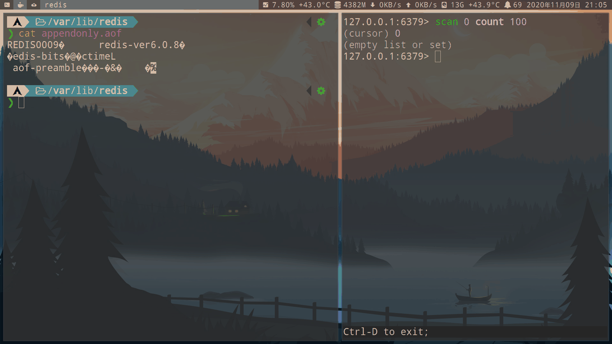

- RDB的变化

    - 除非执行过`save`, `bgsave`还有主从的全量复制，不然rdb会保存flush之前的数据

- 如果从节点同步了flash命令，数据也会被清除。但AOF和RDB的变化和主节点一样

- 建议维护人员提前准备好shell脚本或者其他自动化的方式处理，因为故障不等人。像flush这样的危险操作，应该通过有效方式进行规避

### 百度持久化方案

- 百度智能云 RDB 持久化优化：forkless

    - 分而治之：将阻塞式 save 设计为渐进式的 save ，主进程控制 save 的进度和处理请求，子线程来执行 save 以及处理 IO
    - Redis 内核实现 COW 机制，解决多线程访问数据冲突的情况。
    - RDB 和 AOF 有序混合的快照格式。

    

    - 渐进式 save 将数据分为三种状态：已经迭代，正在迭代以及没有迭代，分别对应 key1、key2 以及 key3，而此刻对应的 forkless RDB 格式 key1 和 key2 是 RDB 格式。

        - 请求要访问 key1，key1 属于已经迭代过的数据，则在主进程执行，子线程做传播
        - 请求要访问 key2 ，key2 属于正在迭代的数据，则进行冲突解决，主进程拷贝一份 key2 的 value，然后在主进程中执行，子线程中传播
        - 请求要访问 key3，key3 属于没有迭代的数据，那么则直接在主进程中执行即可。

- 异步 AOF

    - Redis 的 AOF 持久化是一个同步的过程，由主进程执行写磁盘操作
    - 百度智能云的异步 AOF 则是主进程将写磁盘的操作递交给子线程，子线程来执行 fsync。这样的话就可以很好地解决同步 AOF 带来的阻塞问题。
    

- 百度自研了同步组件 sync-agent 支持异地多活，并且支持了冲突解决。

    - Redis 会将所有更改数据持久化到 AOF 中，而所有持久化的 AOF 中的命令都会带有注释功能，在注释功能中会有一些地域分片信息，因此 sync-agent 解析 AOF 之后就会同步到其他地域。

    - 在这个过程中，其他地域是如何区分到其他地域和本地域的请求，以防止写回环呢？就是通过其他地域转发过来的 AOF 中带有的地域信息来区分。

- 基于按时间点恢复

    

    - 每个 rdb 文件表示一个时刻的实际，而 aof 文件表示一个时间段数据。
    - 假如要恢复到 t6 时刻，首先我们需要先加载距离 t6 时刻最近的起始时刻 rdb，然后在加载其后连续的 aof 文件，直到加载到包含 t6 时刻的 aof 文件。这样我们就可以实现按时间点恢复功能。

### Async-fork解决fork产生的阻塞

- 父进程调用fork()创建子进程的过程中，虽然使用了写时复制（cow）页表的方式进行优化，但由于要复制父进程的页表，还是会造成父进程出现短时间阻塞，阻塞的时间跟页表的大小有关，页表越大，阻塞的时间也越长。

- 在测试中很容易观察到fork产生的阻塞现象，以及fork造成的Redis访问抖动现象。

    - 1.阻塞现象复现

        - 实验对比：在单机环境下使用Redis-benchmark压测的过程中，手动执行bgsave命令，观察fork耗时和压测指标TP100。

        - 实验结果：

            - 1.压测时未执行bgsave，TP100约1毫秒
                ```sh
                # 压测过程中未执行 bgsave
                [root@xxx bin]# Redis-benchmark -d 256 -t set -n 1000000  -a xxxxxx -p 6380
                ====== SET ======
                  1000000 requests completed in 8.15 seconds
                  50 parallel clients
                  256 bytes payload
                  keep alive: 1

                99.90% <= 1 milliseconds
                100.00% <= 1 milliseconds
                122669.27 requests per second
                ```

            - 2.压测过程中，手动执行bgsave命令，触发fork操作，TP100达到187毫秒
                ```sh
                # 压测过程中执行 bgsave
                [root@xxx bin]# Redis-benchmark -d 256 -t set -n 1000000  -a xxxxxx -p 6380
                ====== SET ======
                  1000000 requests completed in 13.97 seconds
                  50 parallel clients
                  256 bytes payload
                  keep alive: 1

                86.41% <= 1 milliseconds
                86.42% <= 2 milliseconds
                99.95% <= 3 milliseconds
                99.99% <= 4 milliseconds
                99.99% <= 10 milliseconds
                99.99% <= 11 milliseconds
                99.99% <= 12 milliseconds
                100.00% <= 187 milliseconds
                100.00% <= 187 milliseconds
                71561.47 requests per second
                ```

            - 使用 `info stats` 返回上次fork耗时：`latest_fork_usec:183632`，可以看到fork耗时*183毫秒*

    - 2.Strace跟踪fork过程耗时

        - `strace` 常用来跟踪进程执行时的系统调用和所接收的信号。
        ```sh
        strace -p 32088 -T -tt -o strace00.out
        14:01:33.623495 clone(child_stack=NULL, flags=CLONE_CHILD_CLEARTID|CLONE_CHILD_SETTID|SIGCHLD, child_tidptr=0x7fbe5242fa50) = 37513 <0.183533>
        14:01:33.807142 open("/data1/6380/6380.log", O_WRONLY|O_CREAT|O_APPEND, 0666) = 60 <0.000018>
        14:01:33.807644 lseek(60, 0, SEEK_END)  = 8512 <0.000017>
        14:01:33.807690 stat("/etc/localtime", {st_mode=S_IFREG|0644, st_size=528, ...}) = 0 <0.000010>
        14:01:33.807732 fstat(60, {st_mode=S_IFREG|0644, st_size=8512, ...}) = 0 <0.000007>
        14:01:33.807756 mmap(NULL, 4096, PROT_READ|PROT_WRITE, MAP_PRIVATE|MAP_ANONYMOUS, -1, 0) = 0x7fbe52437000 <0.000009>
        14:01:33.807787 write(60, "35994:M 21 Mar 14:01:33.807 * Ba"..., 69) = 69 <0.000015>
        14:01:33.807819 close(60)               = 0 <0.000008>
        14:01:33.807845 munmap(0x7fbe52437000, 4096) = 0 <0.000013>
        ```

        - 结论：Linux中通过clone()系统调用实现fork()；我们可以看到追踪到clone系统调用，并且耗时183毫秒，与 info stats 统计的fork耗时一致。

- Async-fork

    - Async-fork设计的核心思想是将fork调用过程中最耗时的页表拷贝工作从父进程移动到子进程

        - 缩短父进程调用fork时陷入内核态的时间，父进程因而可以快速返回用户态处理用户查询，子进程则在此期间完成页表拷贝。

    - Async-fork的挑战：页表的异步复制操作可能导致快照不一致。（快照文件应该记录的是保存拍摄内存快照那一刻的内存数据）

        - 例子：Redis在T0时刻保存内存快照，而某个用户请求在T2时刻向Redis插入了新的键值对（k2, v2)，这将导致父进程修改它的页表项（PTE2）

            - 假如T2时刻这个被修改的页表项（PTE2）还没有被子进程复制完成， 这个修改后的内存页表项及对应内存页后续将被复制到子进程，这个新插入的键值对将被子进程最终写入硬盘，破坏了快照一致性。

            

    - Async-fork详解

        - 在默认fork中：父进程遍历每个VMA，将每个VMA复制到子进程，并自上而下地复制该VMA对应的页表项到子进程，对于64位的系统，使用四级分页目录，每个VMA包括PGD、PUD、PMD、PTE，都将由父进程逐级复制完成。

        - 在Async-fork中：父进程同样遍历每个VMA，但只负责将PGD、PUD这两级页表项复制到子进程。

            - 随后，父进程将子进程放置到某个CPU上使子进程开始运行，父进程返回到用户态，继续响应用户请求。由子进程负责每个VMA剩下的PMD和PTE两级页表的复制工作。

            

    - 问题：如果在父进程返回用户态后，子进程复制内存页表期间，父进程需要修改还未完成复制的页表项，怎样避免上述提到的破坏快照一致性问题呢？

        - 1.主动同步机制

            - 父进程返回用户态后，父进程的PTE可能被修改。如果在子进程复制内存页表期间，父进程检测到了PTE修改，则会触发主动同步机制。——也就是父进程也加入页表复制工作，来主动完成被修改的相关页表复制，该机制用来确保PTE在修改前被复制到子进程。

                - 当一个PTE将被修改时，父进程不仅复制这一个PTE，还同时将位于同一个页表上的所有PTE（一共512个PTE），连同它的父级PMD项复制到子进程。

                - 问题：父进程中的PTE发生修改时，如果子进程已经复制过了这个PTE，父进程就不需要复制了，否则会发生重复复制。怎么区分PTE是否已经复制过？

                    - 解决方法：Async-fork使用PMD项上的RW位来标记是否被复制。

                        - 当父进程第一次返回用户态时，它所有PMD项被设置为写保护（RW=0），代表这个PMD项以及它指向的512个PTE还没有被复制到子进程。

                        - 当子进程复制一个PMD项时，通过检查这个PMD是否为写保护，即可判断该PMD是否已经被复制到子进程。如果还没有被复制，子进程将复制这个PMD，以及它指向的512个PTE。
                            - 在完成PMD及其指向的512个PTE复制后，子进程将父进程中的该PMD设置为可写（RW=1），代表这个PMD项以及它指向的512个PTE已经被复制到子进程。

                        - 当父进程触发主动同步时，也通过检查PMD项是否为写保护判断是否被复制，并在完成复制后将PMD项设置为可写。

                        - 同时，在复制PMD项和PTE时，父进程和子进程都锁定PTE表，因此它们不会出现同时复制同一PMD项指向的PTE。

    - 错误处理

        - Async-fork在复制页表时涉及到内存分配，难免会发生错误。例如，由于内存不足，进程可能无法申请到新的PTE表。
            - 当错误发生时，应该将父进程恢复到它调用Async-fork之前的状态。

        - 在Async-fork中，父进程PMD项目的RW位可能会被修改。因此，当发生错误时，需要将PMD项全部回滚为可写。

- 从fork转换为Async-fork出现的问题：fork耗时正常，但是压测过程中执行bgsave，TP100不正常依然出现了尾延迟

    - 使用 `info stats` 返回上次fork耗时：`latest_fork_usec:426`

    ```sh
    # 压测过程中执行 bgsave
    [root@xxx ~]# /usr/bin/Redis-benchmark -d 256 -t set -n 1000000  -a xxxxxx -p 6679
    ====== SET ======
      1000000 requests completed in 7.88 seconds
      50 parallel clients
      256 bytes payload
      keep alive: 1

    100.00% <= 411 milliseconds
    100.00% <= 412 milliseconds
    100.00% <= 412 milliseconds
    126871.35 requests per second
    ```

- 追踪过程

    ```sh
    $ strace -p 32088 -T -tt -o strace00.out
    14:18:12.933441 clone(child_stack=NULL, flags=CLONE_CHILD_CLEARTID|CLONE_CHILD_SETTID|SIGCHLD, child_tidptr=0x7f461c0daa50) = 13772 <0.000380>
    14:18:12.933884 open("/data1/6679/6679.log", O_WRONLY|O_CREAT|O_APPEND, 0666) = 60 <0.000019>
    14:18:12.933948 lseek(60, 0, SEEK_END)  = 11484 <0.000013>
    14:18:12.933983 stat("/etc/localtime", {st_mode=S_IFREG|0644, st_size=556, ...}) = 0 <0.000016>
    14:18:12.934032 fstat(60, {st_mode=S_IFREG|0644, st_size=11484, ...}) = 0 <0.000014>
    14:18:12.934062 mmap(NULL, 4096, PROT_READ|PROT_WRITE, MAP_PRIVATE|MAP_ANONYMOUS, -1, 0) = 0x7f461c0e4000 <0.358768>
    14:18:13.292883 write(60, "32088:M 21 Mar 14:18:12.933 * Ba"..., 69) = 69 <0.000032>
    14:18:13.292951 close(60)               = 0 <0.000014>
    14:18:13.292980 munmap(0x7f461c0e4000, 4096) = 0 <0.000019>
    ```

    ```sh
    $ strace -p 11559 -T -tt -e trace=memory -o trace00.out
    14:18:12.934062 mmap(NULL, 4096, PROT_READ|PROT_WRITE, MAP_PRIVATE|MAP_ANONYMOUS, -1, 0) = 0x7f461c0e4000 <0.358768>
    14:18:13.292980 munmap(0x7f461c0e4000, 4096) = 0 <0.000019>
    ```

    - clone耗时380微秒，已经大幅降低，也就fork快速返回了用户态响应用户请求。

    - 然而，注意到，紧接着出现了一个mmap耗时358毫秒，与TP100数据接近。

        - 由于mmap系统调用会在当前进程的虚拟地址空间中，寻找一段满足大小要求的虚拟地址，并且为此虚拟地址分配一个虚拟内存区域( `vm_area_struct` 结构)，也就是会触发VMA级虚拟页表变化，也就触发父进程主动同步机制，父进程主动帮助完成相应页表复制动作。VMA级虚拟页表变化，需要将对应的三级和四级所有页目录都复制到子进程，因此，耗时比较高。

- 那么，这个mmap调用又是哪里来的呢？通过perf trace可以看到响应调用堆栈及耗时
    ```sh
    $ perf trace -p 11559 -o trace01.out --max-stack 15 -T
    616821913.647 (358.740 ms): Redis-server_4/32088 mmap(len: 4096, prot: READ|WRITE, flags: PRIVATE|ANONYMOUS            ) = 0x7f461c0e4000
                                           __mmap64 (/usr/lib64/libc-2.17.so)
                                           __GI__IO_file_doallocate (inlined)
                                           __GI__IO_doallocbuf (inlined)
                                           __GI__IO_file_overflow (inlined)
                                           _IO_new_file_xsputn (inlined)
                                           _IO_vfprintf_internal (inlined)
                                           __GI_fprintf (inlined)
                                           serverLogRaw (/usr/local/Redis/Redis-server)
                                           serverLog (/usr/local/Redis/Redis-server)
                                           rdbSaveBackground (/usr/local/Redis/Redis-server)
                                           bgsaveCommand (/usr/local/Redis/Redis-server)
                                           call (/usr/local/Redis/Redis-server)
                                           processCommand (/usr/local/Redis/Redis-server)
                                           processInputBuffer (/usr/local/Redis/Redis-server)
                                           aeProcessEvents (/usr/local/Redis/Redis-server)

    616822272.562 ( 0.010 ms): Redis-server_4/32088 munmap(addr: 0x7f461c0e4000, len: 4096                                ) = 0
                                           __munmap (inlined)
                                           __GI__IO_setb (inlined)
                                           _IO_new_file_close_it (inlined)
                                           _IO_new_fclose (inlined)
                                           serverLogRaw (/usr/local/Redis/Redis-server)
                                           serverLog (/usr/local/Redis/Redis-server)
                                           rdbSaveBackground (/usr/local/Redis/Redis-server)
                                           bgsaveCommand (/usr/local/Redis/Redis-server)
                                           call (/usr/local/Redis/Redis-server)
                                           processCommand (/usr/local/Redis/Redis-server)
                                           processInputBuffer (/usr/local/Redis/Redis-server)
                                           aeProcessEvents (/usr/local/Redis/Redis-server)
                                           aeMain (/usr/local/Redis/Redis-server)
                                           main (/usr/local/Redis/Redis-server)
    ```

    - 在bgsave执行逻辑中，有一处打印日志中的fprintf调用了mmap，很显然这应该是fork返回父进程后，父进程中某处调用。

- 针对找出来的代码位置，可以进行相应优化，针对此处的日志影响，我们可以屏蔽日志或者将日志移动到子进程进行打印，通过同样的分析手段，如果存在其他影响，均可进行对应优化。进行相应适配优化修改后，我们再次进行测试。

    - 测试环境
        - Redis版本：优化后Redis-Server
        - 机器操作系统：Tair专属操作系统镜像
        - 测试数据量：54.38G

        ```redis
        127.0.0.1:6680> info memory
        # Memory
        used_memory:58385641144
        used_memory_human:54.38G
        ```

    - 在压测过程中执行bgsave，fork耗时和TP100均正常。
        ```sh
        # 压测过程中执行 bgsave
        [root@xxx Redis]# /usr/bin/Redis-benchmark -d 256 -t set -n 1000000  -a dRedis123456 -p 6680
        ====== SET ======
          1000000 requests completed in 7.50 seconds
          50 parallel clients
          256 bytes payload
          keep alive: 1

        99.99% <= 1 milliseconds
        99.99% <= 2 milliseconds
        100.00% <= 2 milliseconds
        133386.69 requests per second
        ```

    - strace跟踪父进程只看到clone，并且耗时只有378微秒，
        ```sh
        strace -p 14697 -T -tt -o strace04.out
        14:42:00.723224 clone(child_stack=NULL, flags=CLONE_CHILD_CLEARTID|CLONE_CHILD_SETTID|SIGCHLD, child_tidptr=0x7fa5340d0a50) = 15470 <0.000378>
        ```

    - Perf trace跟踪父进程也只看到clone调用
        ```sh
        perf trace -p 14697 -o trace04.out --max-stack 15 -T
        618249694.830 ( 0.423 ms): Redis-server/14697  ... [continued]: clone()) = 15470 (Redis-server)
                                               __GI___fork (inlined)
                                               rdbSaveBackground (/usr/local/Redis/Redis-server)
                                               bgsaveCommand (/usr/local/Redis/Redis-server)
                                               call (/usr/local/Redis/Redis-server)
                                               processCommand (/usr/local/Redis/Redis-server)
                                               processInputBuffer (/usr/local/Redis/Redis-server)
                                               aeProcessEvents (/usr/local/Redis/Redis-server)
                                               aeMain (/usr/local/Redis/Redis-server)
                                               main (/usr/local/Redis/Redis-server)
        ```

    - 由于我们的优化是将触发mmap的相关日志修改到子进程中，使用Perf trace跟踪fork产生的子进程

        - 父进程strace信息的文件strace05.out.14697
        - 子进程strace信息的文件strace05.out.15931

        ```sh
        strace -p 14697 -T -tt -f -ff -o strace05.out
        14:47:40.878387 mmap(NULL, 4096, PROT_READ|PROT_WRITE, MAP_PRIVATE|MAP_ANONYMOUS, -1, 0) = 0x7fa5340da000 <0.000008>
        14:47:40.878415 write(6, "15931:C 21 Mar 14:47:40.878 * Ba"..., 69) = 69 <0.000015>
        14:47:40.878447 close(6)                = 0 <0.000006>
        14:47:40.878467 munmap(0x7fa5340da000, 4096) = 0 <0.000010>
        14:47:40.878494 open("temp-15931.rdb", O_WRONLY|O_CREAT|O_TRUNC, 0666) = 6 <0.000020>
        14:47:40.878563 fstat(6, {st_mode=S_IFREG|0644, st_size=0, ...}) = 0 <0.000006>
        14:47:40.878584 mmap(NULL, 4096, PROT_READ|PROT_WRITE, MAP_PRIVATE|MAP_ANONYMOUS, -1, 0) = 0x7fa5340da000 <0.000006>
        ```

        - 结论：在子进程中看到了mmap调用，子进程中调用不会影响父进程对业务访问的响应。

- fork与优化后的Async-fork性能测试

    - 1.fork()命令耗时：Redis执行 bgsave 命令后，通过Redis提供的 info stats 命令观察到的 latest_fork_usec 用时。

        

        - 使用支持Async-fork的操作系统，fork()操作产生的耗时非常小，不管数据量多大，耗时都非常稳定，基本在200微秒左右
        - 原生fork产生的耗时会随着数据量增长而增长，而且是从几十毫秒增长到几百毫秒。

    - 2.TP100抖动：在使用Redis-benchmark压测过程中，手动执行bgsave命令，触发操作系统fork()操作

        

        - 使用支持Async-fork的操作系统，fork()操作对Redis压测产生的性能影响非常小，性能提升非常明显，不管数据量多大，耗时都非常稳定，基本在1-2毫秒左右
        - 原生fork产生的抖动影响时间会随着数据量增长而增长，TP100从几十毫秒增长到几百毫秒。


## master slave replication (主从复制)

- [百度智能云：Redis 主从复制演进历程与百度智能云的实践](https://xie.infoq.cn/article/4cffee02a2a12c2450412fa21?utm_campaign=geektime_search&utm_content=geektime_search&utm_medium=geektime_search&utm_source=geektime_search&utm_term=geektime_search)

- [百度开发者中心：Redis 主从复制的原理及演进](https://developer.baidu.com/article/detail.html?id=294748)

```redis
# 打开 主从复制 连接6379服务器
slaveof 127.0.0.1 6379

# 查看当前服务器在主从复制扮演的角色
role

# 关闭 主从复制
slaveof no one
```

- **本地**主从复制：

    - 左边连接的是 127.0.0.1:6379 主服务器
    - 右边连接的是 127.0.0.1:7777 从服务器

    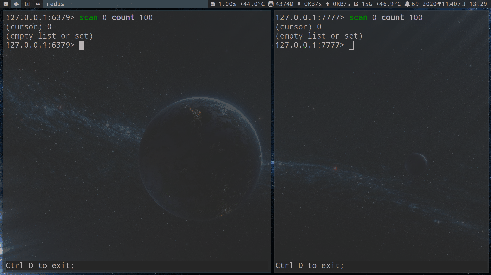

- **远程**主从复制：

    - 左边连接的是 虚拟机 192.168.100.208:6379 主服务器
    - 右边连接的是 本机 127.0.0.1:6379 从服务器

    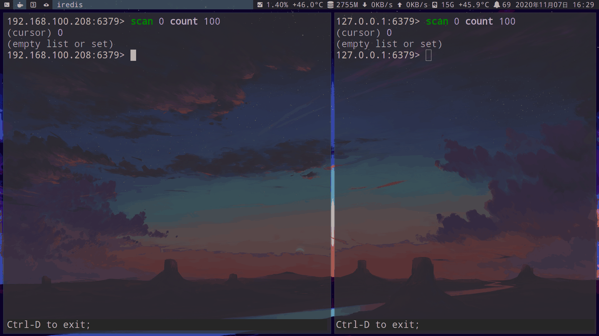


- 主从架构: 可实现读写分离: **master (主服务器)** 负责写入; **slave (从服务器)** 负责读取

    - 1.一主一从

        - 写命令比较多时: 可以只在从节点开启AOF，避免主节点的性能干扰

        - 注意：master没有开启持久化，自动重启后会数据清空：导致slave数据也被清空。先在从节点`slaveof no one`关闭主从复制，再进行master重启。

    - 2.一主多从(星型)

        > 优点即是缺点, 缺点即是优点

        - 优点: 多个从节点，分摊读命令的压力（比如keys、sort等慢查询命令）

        - 缺点: 主节点写命令时, 需要复制多个从节点, 从而导致更大的网络开销

        

    - 3.树状

        > 部分从服务器也是主服务器, 数据一层一层向下复制

        - 优点: 解决一主多从（星型）架构的缺点, 降低主节点复制压力

        

- 从节点的配置:

    - `replica-read-only=yes`（默认yes，也就是只读）redis6.0以前为`slave-read-only: yes`：从节点无法删除和修改key。开启可能会导致主从数据不一致, 因此不建议修改

        ```redis
        // 查看 replica-read-only
        config get replica-read-only

        // 设置 replica-read-only yes
        config set replica-read-only yes
        ```

        - 以下是关闭 slave 节点只读 后的演示:

            - 右边连接的是 127.0.0.1:6380 从服务器,在 slaveof 过程中无法使用 set 写入，执行 config set replica-read-only no 后，便可以使用 set

            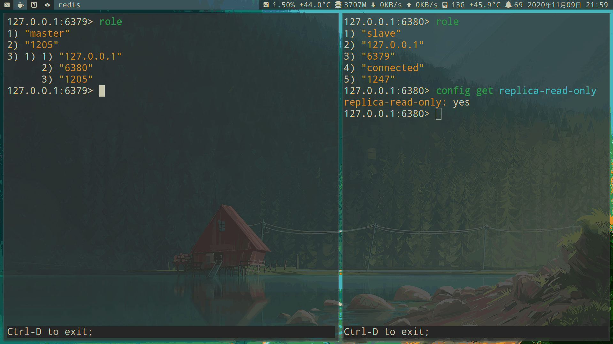

- 主节点的配置:

    - 默认关闭master在全量复制期间生成的rdb, 不保存硬盘(`repl-diskless-sync`): 开启后RDB并不会保存硬盘, 而是直接发送给slave

### 主从建立过程

- 这是redis2.8的psync1方案
    - 之前只有sync方案。只能全量复制，没有部分复制。
    - psync1方案：提出`runid`和`offset`实现部分复制

- 主从建立过程:

    - 1.从节点执行命令或配置文件写入`slaveof 127.0.0.1 6379`：保存主节点信息后返回，复制流程是异步执行
        ```redis
        # 查看保存的主从信息
        info replication

        # 查看当前节点是master, 还是slave
        role
        ```

    - 2.从节点建立socket: 专门接受master发送的复制命令

        - 以下的45572端口，便是从节点的套节字
        

        - 注意：如果从节点无法建立连接，会定时无限重试，或者执行`slaveof no one`取消复制

            - 查看与主节点连接失败的时间
            ```redis
            info replication
            master_link_down_since_seconds
            ```

    - 3.发送`PING` 命令
        - 检测socket是否可用
        - 如果从节点没有收到主节点回复的`PONG`，从节点会断开复制连接，然后定时发起重连

    - 4.权限验证

        - 如果master设置了`requirepass` 参数, 则需要密码验证

    - 5.全量复制: slave执行`psync` 命令, 请求master复制数据

    - 6.增量复制

- 断开主从连接过程: 从节点执行`slaveof no one`命令

    - 1.断开master的复制关系

    - 2.slave升级为master

    - 3.不会删除复制的数据


- 从节点切换主节点过程: 如先执行`slaveof 127.0.0.1 6379`后, 再执行`slaveof 127.0.0.1 6380`

    - 1.断开旧master的复制关系

    - 2.建立新master的复制关系

    - 3.**删除当前slave的数据**

    - 4.开始新的主从复制

### 主从复制过程

> 对应上面主从建立过程中的, 第5的全量复制, 第6的部分复制

- psync命令:

    - 1.slave发送`psync {runid} {offset}` 命令:

        - `runid`：slave保存的master节点id

            - master会核对id与自己是否一致。runid重启时重新生成，如果master重启过，会导致全量复制。可以使用`debug reload`进行重启，就不会丢失runid

        - `offset`：master和slave在写入数据之后，它的 offset 会增加。如果是第一次复制，那么值就是-1，将会引发全量复制

    - 1.复制偏移量

        - replication buffer：master连接的每一个slave的对应一个 replication buffer
            - master执行完每一个操作命令后，会将命令分别写入每一个slave所对应的 replication buffer

        - master写入命令后，会将命令的字节长度（偏移量）保存在`master_repl_offset`里

        - slave每秒上报自身的偏移量`slave_repl_offset`，因此主节点也会保存slave的偏移量

            - 两者可通过`info relication`命令查看

            - 刚开始复制数据的时候，上述两者的值相同，且都位于初始位置。

                - 每当master向 `repl_backlog_buffer` 写入一个操作，`master_repl_offset` 就会增加 1，从库复制完操作命令后，`slave_repl_offset` 也会增加 1。

        - master和slave的偏移量差值，就是要复制的偏移量

            - slave接受master后会累加偏移量`slave_repl_offset`

    - 2.master维护一个`repl_backlog_buffer`复制缓冲区是一个环形列表(默认1MB)：建立主从关系时创建。复制期间master响应的写命令，会写入slave的replication buffer, 也会写入`repl_backlog_buffer`

        - 与replication buffer不同：一个master中只有一个`repl_back_buffer`

        - 如果`repl_back_buffer`的大小超过了这个限制，Redis会开始丢弃最早的命令。

        

        ```redis
        // 查看缓冲区
        info relication
        ...

        repl_backlog_active:1                   // 开启复制缓冲区
        repl_backlog_size:1048576               // 缓冲区最大长度
        repl_backlog_first_bytes_offset:7479    // 起始偏移量
        repl_backlog_histlen:1048576            // 已保存数据的有效长度
        ...
        ```

    - master收到psync后的回复
        - 1.`+FULLRESYNC`：全量复制
        - 2.`+CONTINUE`：增量复制
        - 3.`-ERR`：表示redis的版本低于2.8，无法使用`psync`命令，将使用旧版的`sync`命令


- 全量复制过程：6G的数据大概2分钟左右

    - 1.slave发送`psync id -1`。偏移量的值-1，表示全量复制

    - 2.master响应`+FULLRESYNC`

    - 3.slave接受master的响应数据保存runid和offset（偏移量）

    - 4.master执行`bgsave` 命令生成RDB文件

        - 生成的RDB会保存到硬盘再发送, 可以开启`repl-diskless-sync`(默认关闭), 开启后并不会保存硬盘, 而是直接发送给slave

    - 5.master将RDB发送给slave, slave接受RDB文件

        - `repl-diskless-sync`：生成的RDB文件直接发送给slave，而不会保存磁盘

        - 如果传输超过`repl-timeout` (默认60秒), 会导致全量复制失败, slave会删除已经接受的临时RDB文件

    - 6.master生成rdb和传输rdb期间，依然响应读写命令，并写入复制客户端缓冲区

        - slave复制完成RDB快照后：master将复制客户端缓冲区发送给slave

            - 复制客户端缓冲区长度`client-output-buffer-limit slave 256MB 64MB 60`

                - 如果复制客户端缓冲区直接超过256MB或60秒内超过64MB, 会导致全量复制失败

    - 7.slave接受完全部数据后，会清空旧数据

        - 在执行全量复制期间, slave依然响应读命令, 如果时间过长, 可能会导致客户端读取到旧的数据

            - 可以开启`slave-server-stale-data` (默认关闭), 解决数据不一致

                - 开启后slave只会响应`info` `slaveof` 命令，其他命令会回复"SYNC with master in progess"


    - 8.加载新的RDB后, 如果slave开启了AOF持久化, 会立刻执行`bgrewriteaof` 命令重写AOF


- 部分复制：因为网络原因在主从复制过程中停止复制会怎么样？

    

    

    - 如果slave和master库的网络连接中断，slave便无法继续复制master的操作命令，但是master依然会向 `repl-backlog-buffer` 中写入操作命令。

    - slave与master重新连接后。
        - slave会发送runid和offset。
        - master拿到 Runid 跟自己的 Runid 比较，如果是一样的。并且offset（偏移量）在master的`repl-backlog-buffer`（复制缓冲区） 中能够找到，那么会回复`+CONTINUE`进行部分复制。如果找不到就全量复制

        - master根据`repl-backlog-buffer`（复制缓冲区）的数据发送给slave

### 心跳

- master默认每隔10秒发送`ping`命令

    - `repl-ping-slave-period`参数控制

- slave每隔1秒发送`replconf ack {offset}`，上报偏移量

    - master会将最后一次的通信延迟的秒数，保存为lag（正常应该是0,1）
        ```redis
        info replication
        slave0:ip=127.0.0.1,port=6380,state=online,offset=1526,lag=0
        ```

        - 如果超过`repl-timeout`（默认60秒），就会断开连接。如果slave之后恢复，那么心跳继续

### redis 4.0 PSYNC2 方案

- 问题：slave重启后丢失了master的runid和复制偏移量，这导致重启后需要全量同步

    - Redis 4.0 后，master的编号信息被写入到 RDB 中持久化保存。

- 问题：一主两从架构，当master挂掉了，我们将slave2选为master，它是不是能够跟slave1进行一个部分同步？在 PSYNC1 中，它是不可以的，因为master和slave的数据都是不一样的，它的 runid 也都不一样，所以不能进行这种增量同步。

    - 解决方法：PSYNC2提出新概念：Replid（自己的复制 ID）；Replid2 是自己上一次复制的主库的一个 Replid，同时它也记录了上一次复制的 offset

        - 在PSYNC1 中它只是校验，offset 是不是在 Backlog 里。现在多了一个校验，其实主要是判断它的复制历史是否一样的：如果它的 Replid 是一致的，比如说之前的 Runid 是一样的，自然可以来进行部分重同步的尝试。

            - 如果没有。PSYNC2的方案：对比Replid2（也就是上一次的 Replid）是否一样。如果一样的话，再看一下这个 offset 是不是在上一次的 second_replid_offset 中，如果在这之中，也可以进行增量同步。

                - 为什么要看上一次的 second_replid_offset？

                    - 现在有一主一从，你在主库上写了两条数据，LPUSH A、C，但是由于同步的延迟，在从库上只有一条，就是 LPUSH A、B，当 failover 后从库成为新主，它肯定会接收新的业务请求，比如它写入了一条 LPUSH A、D，此时我们想让旧主跟新主建立主从复制，这样是可以进行增量同步的吗？
                    

                        - 其实是不可以的。尽管它们的 offset 一样，但是它的 offset 和新主的 second_replid_offset 是不一样的，它的 second_replid_offset 的值是上一条的。

                            - 当从库切为主库之后，它的复制上下文已经变了，我们不能用新的复制上下文和老的去比较，只能用之前的复制上下文和老的去比较，这样才能实现对应。

### redis 6.0 无盘全量复制和无盘加载

- 无盘全量复制：以前的全量复制，RDB 生成后，在主进程中，会读取此文件并发送给从节点。

    - redis 6.0后：dump 后直接将数据直接发送数据给从节点，不需要将数据先写入到 RDB

        - 缺点：在子进程中直接使用网络发送数据，这比在子进程中生成 RDB 要慢，这意味着子进程需要存活的时间相对较长。子进程存在的时间越长，写时复制造成的影响就越大，进而导致消耗的内存会更多。

- 无盘加载：以前slave一般是先接收 RDB 将其存在本地，接收完成后再载入 RDB。

    - redis 6.0后：slave也可以直接载入master发来的数据，避免将其存入本地的 RDB 文件中，而后再从磁盘加载。

        - 直接从 socket 中读取数据并加载，边读边加载，实现了对磁盘的解耦，避免了保存磁盘文件的时间。
        - slave数据翻倍的问题：如果仍然保留之前的数据再加载一份新的数据，内存肯定是翻倍的。有2个方案

            - 1.empty-db：加载之前把之前的数据全部清掉再加载，从而减少了内存的消耗
                - slave上就没有数据了，这是非常危险的。

            - 2.swap：它是将原来的数据先保存到另外一份临时的 db 中，然后加载数据到新的 db，但这样就实现内存的翻倍
                - 数据更可靠，因为即使当主库的数据挂掉之后从库仍然有自己的数据

### redis 7.0 共享主从复制缓冲区

- 7.0在6.0的无盘加载swap方案，还做了一个反转优化

    - 不是将原来的数据临时保存到一个 db 中，这个数据仍然对外访问；而将加载的数据临时放在一个 db 中，加载完成之后交换

        - 所以它在加载的过程中也可以对外访问，也是 SWAPDB 的一个优点。

    - 缺点依旧是是内存翻倍

- 问题：有几个slave，它有几份buffer。如果我们这里有 10 个slave，每 1 个slave占用 1GB 的buffer，它就要占用 10GB 的内存，是非常可怕的。

    

    - 解决方法：所有的slave共同访问一份 buffer 就行了

        - Redis 7.0 中，百度团队的同学提出并实现了共享主从复制缓冲区的方案解决了这个问题。该方案让发送缓冲区与复制积压缓冲区共享，避免了数据的重复，可有效节省内存。

        - 实现原理：一个 buffer 的 block 链表，这个链表有多个数据块，数据块就是主从复制的数据。

            - 给数据块增加了一个特殊的字段叫 refcount，它会记录这个 refcount，也就是 block 的一个引用的个数，每当有从库对它引用的时候，它个数就会加一，当减少引用的时候它就减一。

            - 如图所示，Backlog 它引用了第一个 block，它的 count 就是 1，然后从库 A 和 B 它们都引用了第三个 block，它的 count 就是 2。这样我们就在一条链表上，不同的从库引用不同的节点，就实现了一个共享复制缓冲区的方案。
            

            - 但是这个方案仍然有几个问题需要解决，我们知道部分重同步的时候，在 Backlog 中要找到对应的数据内容，现在 Backlog 只是引用复制缓冲区，那共享的复制缓冲区，我们如何实现查找呢？这个链表上的节点非常多，可能是几万个，甚至是几十万个，我们如何高效地查找呢？

                - 这里我们通过一个 RaxTree记录了这些 block，通过每 64 个间隔记录一个 Block，实现了它的一个固定区间的缩影。

                

                - 查找的时候，先查 RaxTree，然后让它聚焦在一个范围内，就是 64 的这种格，然后我们再沿着这 64 个节点遍历一遍就可以找到对应的节点，整个查找的过程中也不会超过 100 次，时间也会在一毫秒之内，这样基本上就可以做到业务无感地去查找，这是我们复制 buffer 的方案，但是这个 buffer 我们不可能无限增长，我们如何裁剪它呢？

                    - 我们裁剪的一个朴素的 idea 就是 buffer block 的引用计数变为 0，就释放，我们从头来遍历；如果它是 0 就释放，如果它不是 0 我们就停止，其实现在的问题是如何减少引用计数让它引用计数减为 0，那什么情况减 1 呢？

                        - 当 block 读写完成了之后，我们访问下一个的时候，会将当前的 refcount 减 1，再一个如果从库断开了之后，在当前引用 block 的 refcount 也会减 1，因为它释放了，对它不引用了。再者就是 Backlog，它会有一个大小限制，如果超过大小限制，那么它就会前移，之前 Block 的引用计数也会减 1，通过这种不断地剪辑操作，前面的一些最开始的 block 的引用计数就会变为 0，我们就释放掉。

### 百度智能云 Redis PSYNC-AOF 方案

- 问题：

    - 1.部分复制需要建立在 Backlog 里头找数据，因为它的容量有限，所以它肯定是找数据有限，所以它只能应对网络短时间的闪断，而不是长时间的断开。

    - 2.客户端输出缓冲区也是有限的，它超过之后slave也会断开

        - 在业务流量高峰的时候，如果发生全量复制，数据会缓存到这个客户端的缓冲区中，洪峰流量会导致业务的 QPS 非常高，写入的数据也会非常大，输出缓冲区会超限断开，然后又会全量同步，这样就会循环失败，直到业务的流量过去之后，才逐渐地恢复同步。

    - 解决方法：PSYNC-AOF 实现

        - 就是将 AOF 的内容和 Backlog 的内容保持一致，当在 Backlog 里找不到内容后，可以尝试从 AOF 里头找。

            

            - 并且还记录了 AOF 对应的这种复制的 offset

            - 通过一个 RDB 作为基准，AOF 作为增量，而且还有多个这种 AOF 的文件，我们就可以实现一个更大的复制积压区，可以应对更长的网络延迟以及网络断开。

        - PSYNC-AOF 的主从复制的流程：

            

            - 1.发送一个 PSYNC 请求，如果它请求的 offset 在 Backlog 中，就能找到它走之前的逻辑
            - 2.如果找不到，按照之前的方案就会全量同步，但现在我们加了 AOF 的去尝试寻找的过程，它会基于 offset 到 AOF 文件去查找，AOF 文件找到之后，它又把 AOF 文件的内容发送给slave，然后把之后的 AOF 文件也发送给slave，从而实现了增量同步，避免全量同步。
            - 3.当然 AOF 文件大小也是有限制的，如果找不到，它最后也会进行全量同步，这是无法避免的。

        - AOF 文件的发送：

            - AOF 文件是通过子线程发送的，也就说发送 AOF 文件不会阻塞子线程的服务请求，它仍然是可以对外服务的

                - 通过 send_file 来提升发送的效率，通过这样的方式避免了master的阻塞。

            - slave在接收这些 AOF 的时候，它也是对外可以服务的，只是它的数据相对主库差异的有点多，有些老数据而已，如果业务可以忍受这个方案就可以极大地避免了洪峰流量导致的问题。

### Redis2.8-4.0过期key策略，主从不一致的优化历程

- [Redis开发运维实战：Redis2.8-4.0过期键优化详解]()

- redis2.8，在从节点get hello非空，在主节点get hello为空，之后从节点get hello为空，经排查主从同步offset基本正常，但出现了主从不一致。


- 过期key策略：

    - 惰性删除：每次执行key相关的命令时，都会先从expires中查找key是否过期

        - 可以看到每次读写key前，所有的Redis命令在执行之前都会调用`expireIfNeeded`函数：

            ```c
            int expireIfNeeded(redisDb *db, robj *key) {
                mstime_t when = getExpire(db,key);
                mstime_t now;
                if (when < 0) return 0; /* No expire for this key */
                now = server.lua_caller ? server.lua_time_start : mstime();
                if (server.masterhost != NULL) return now > when;
                /* Return when this key has not expired */
                if (now <= when) return 0;
                /* Delete the key */
                server.stat_expiredkeys++;
                propagateExpire(db,key);
                notifyKeyspaceEvent(NOTIFY_EXPIRED,
                    "expired",key,db->id);
                return dbDelete(db,key);
            }
            ```

            - 代码中可以看出，主从逻辑略有不同：
                - 1.主库：过期则expireIfNeeded会删除过期键，删除成功返回1，否则返回0。
                - 2.从库：expireIfNeeded不会删除key，而会返回一个逻辑删除的结果，过期返回1，不过期返回0 。
                - 但是从库过期键删除由主库的synthesized DEL operations控制。

    - 定时删除：从一定数量的数据库的过期库中取出一定数量的随机键进行检查，不为空则删除。不保证实时删除。
        ```c
        if (server->masterhost == NULL) activeExpireCycle();
        ```

        - 1.主库: 会定时删除过期键
        - 2.从库: 不执行定期删除

- Redis 2.8~4.0过期键读操作的fix记录

    - Redis2.8主从不一致

        - 读操作中都先调用lookupKeyRead函数：
            ```c
            robj *lookupKeyRead(redisDb *db, robs *key) {
                robj *val;
                expireIfNeeded(db,key);
                val = lookupKey(db,key);
                if (val == NULL)
                    server.stat_keyspace_misses++;
                else
                    server.stat_keyspace_hits++;
                return val;
            }
            ```

        - 对于主库，执行expireIfNeeded时，过期会删除key。lookupKey返回 NULL。
        - 对于从库，执行expireIfNeeded时，过期不会删除key。lookupKey返回value。
        - 也就是开篇提到的问题

    - Redis 3.2主从除exists之外都一致
        - 读操作同样先调用了lookupKeyRead，实际上调用的是lookupKeyReadWithFlags函数
            ```c
            robj *lookupKeyReadWithFlags(redisDb *db, robj *key) {
                robj *val;
                if (expireIfNeeded(db,key) == 1) {
                    if (server.masterhost == NULL) return NULL;
                    if (server.current_client &&  //当前客户端存在
                        server.current_client != server.master &&  //当前客户端不是master请求建立的（用户请求的客户端）
                        server.current_client->cmd &&
                        server.current_client->cmd->flags & REDIS_CMD_READONLY) {  //读命令
                            return NULL;
                         }
                val = lookupKey(db,key,flags);
                if (val == NULL)
                    server.stat_keyspace_misses++;
                else
                    server.stat_keyspace_hits++;
                return val;
                }
            ```

        - 可以看到，相对于2.8，增加了对expireIfNeeded返回结果的判断：
            - 对于主库，执行expireIfNeeded时，过期会删除key，返回1。masterhost为空返回NULL。
            - 对于从库，执行expireIfNeeded时，过期不会删除key，返回1。满足当前客户端不为 master且为读命令时返回NULL。

        - 除非程序异常。正常情况下对于过期键的读操作，主从返回一致。

    - Redis 4.0.11解决exists不一致的情况

- 过期键写操作

    - 在读写分离的场景中，可以使用过期键的机制将从库作为一个缓存，去缓存从库上耗时操作的结果，提升整体性能。

### 内存满后逐出策略，主从不一致

- 错误认知：从节点更新数据完全听从主节点

- 常见的不一致大概几种情况
    - maxmemory不一致
    - 数据结构优化参数不一致：查看ziplist相关、quicklist相关等配置一致

- 无论是all-keys、还是volatile，主节点和从节点逐出的key肯定不可能完全一样（因为LRU也是近似算法），但主节点会自己删除的key命令同步给从节点，长此以往master节点数据会slave节点多
    - 具体可以参考server.c每次处理命令都要做maxemory的检测和处理，直到满足条件，才会执行命令call

- Redis 5.0的新增配置`replica-ignore-maxmemory`（默认yes开启）：从节点不会自己逐出
    - 配置名：`replica-ignore-maxmemory`
    - 配置别名：`slave-ignore-maxmemory`

### 一些问题和注意事项

- 复制是异步的：master不等待slave复制完成

- 数据延迟：延迟取决于网络带宽和命令阻塞

    - 一般会把master和slave放在同一机房/同城机房

    - 需要监控程序定期检查master/slave的偏移量，同样也是延迟的偏移量。当超过10MB监控程序会触发报警，并通知客户端
        - 可以使用zookeeper监听回调机制实现client通知
        - client收到通知后，将读命令路由到其他从节点
            - 需要修改客户端，方案成本比较高。也可以采用redis集群做水平拓展

    - `repl-disable-tcp-nodelay=no`（默认关闭）：
        - 关闭：主节点产生的命令无论大小，都及时发送给从节点
        - 开启：会合并较小的tcp包，可以节省带宽, 但增大了延迟。默认发送时间根据liunx内核，一般为40秒。
        - 建议：同机架、机房关闭；同城跨机房开启

- master处理过期数据的2种方式：

    - 1.惰性删除：master每次处理读命令，检查是否过期，有则del，同时异步发送给slave

    - 2.定时删除：定时循环采样一定数量的key，发现过期后del

        - 如果此时有大量key过期，master采样的速度跟不上过期的速度，此时在slave会读取到过期的key

    - 注意：从节点自身永远不会主动删除过期的数据

- 主从配置不一致：有些配置必须一致

    - `maxmemory`：如果slave小于master，slave复制的数据大于maxmemory时，数据会丢失，但复制还在继续

    - `hash-max-ziplist-entries`（哈希编码的触发条件）：主从复制一致，但实际内存不一样

- runid：

    > redis服务器启动时会分配一个不同的runid, 从而识别不同的redis服务器

    - `info server` 命令查看runid

    - 开启主从复制后, 主节点如果重启, 导致前后id不一致, 引发全量复制

        - 解决方法: 主节点使用`debug reload` 命令(阻塞)重启, 从而保持runid一致, 避免全量复制

            - 缺点: 虽然可以避免全量复制, 但`debug reload` 是阻塞命令, 而阻塞期间会生成新的RDB文件, 并加载

- 部分复制退化为全量复制：

    - 如果offset（偏移量）不在`repl-backlog-buffer`（默认为1M），则会退化为全量复制

        - 确保`repl-backlog-buffer` > 复制偏移量的差值 * 网络中断的时长

- 星型架构复制风暴：单个master同时向多个slave发送RDB全量复制。导致网络带宽消耗严重，甚至连接断开

    - 解决方法：改为树状架构

- 单机器多master：如果机器故障时间长，恢复时会导致大量的全量复制

    - 解决方法：避免单机器部署过多master

- master没有开启持久化，自动重启后会数据清空：导致slave数据也被清空。先在从节点`slaveof no one`关闭主从复制，再进行master重启。

## sentinel (哨兵模式)

- [《Redis使用手册》中的sentinel章](http://redisdoc.com/topic/sentinel.html)

- 如果master故障（以下步骤都需要手动操作）
    - 1.将slave-1晋升为master（`slaveof no one`）
    - 2.将slave-2成为new master的slave（`slaveof {NewMaster-ip} {NewMaster-port}`
    - 3.客户端修改master的地址

    - 结论：上述都需要人介入，所以不是高可用，sentinal就是为了解决这一问题而生

- sentinel本身是redis节点，不存储数据，只支持部分命令

- sentinel 会周期性执行PING命令 master和slave是否正常

    - 发现master故障后，如果部署了多个sentinel（集群），会选举领导者负责故障转移（自动完成）
        - 1.对slave-1节点执行：`slaveof no one`
        - 2.对slave-2节点执行：`slaveof {NewMaster-ip} {NewMaster-port}`
        - 3.通知客户端

- sentinel（哨兵）集群：防止sentinel误判（提高故障判断准确性）或自己故障

    - 生产环境建议sentinel的节点分布在不同的物理机上

    - sentinal节点的配置要尽可能一致

    - 部署sentinel的机器时间要同步（NTP服务），否则日志的时序会混乱。

    - 哨兵至少3个，保证自己的高可用（领导者选举要一半+1个节点，奇数可以节省1个节点)

        - quorum（票数） = 1：主从 + 2哨兵

            ```
            +----+         +----+
            | M1 |---------| R1 |
            | S1 |         | S2 |
            +----+         +----+
            ```

            - 问题：master 宕机的时候，s1 和 s2 只要有一个认为 master 宕机，就可以进行切换，从 s1 和 s2 中选取一个来进行故障转移，需要满足 majority（也就是大多数哨兵是运行的。2 个哨兵的 majority 是 2，如果 2 个哨兵都运行，就允许执行故障转移）

                - 如果 M1 所在的机器宕机了，那么 s1 哨兵也就挂了，只剩 s2 一个，不满足 majority ，虽然集群还有一台机器 R1，但是故障转移也不会执行。

        - quorum（票数） = 2：1主2从 + 3哨兵

            ```
                   +----+
                   | M1 |
                   | S1 |
                   +----+
                      |
            +----+    |    +----+
            | R2 |----+----| R3 |
            | S2 |         | S3 |
            +----+         +----+
            ```

            - 那么，一个哨兵需要 2 张赞成票，就可以标记主库为“客观下线”了。这 2 张赞成票包括哨兵自己的一张赞成票和另外两个哨兵的赞成票。

                - 此时 majority 也是 2，就算 M1 所在的机器宕机了，哨兵还是剩下两个 s2 和 s3，它们满足 majority 就可以允许故障转移执行。

    - 所有配置可以通过`sentinel set`命令进行调整。如`sentinel set mymaster quorum 2`

- sentinel集合监控1个master？还是多个master？两套方案的优点即另一方的缺点
    - 监控1个master：
        - 优点：每套sentinel相互隔离
        - 缺点：资源浪费
    - 监控多个master：
        - 优点：降低运维成本，只需要一套sentinel集合就可以了
        - 缺点：
            - 如果这套sentinel集合出现异常，对多个redis造成影响
            - 如果redis节点过多，会造成sentinel节点产生过多的网络连接

### sentinal的配置

> ```redis
> # 命令
> sentinel monitor <name> 127.0.0.1 6379 <quorum>
> ```

- **sentinel** 配置文件 `~/notes/databases/redis/sentinel/redis-sentinel-26379.conf`加入以下代码:

```sh
# 端口
port 26379

# 允许后台启动
daemonize yes

# 日志文件的目录
dir "/home/tz/redis/sentinel"

# 日志文件名
logfile "26379.log"

# 仅仅只需要指定要监控的主节点，并自己定义名字
# 1表示quorum：要判定master最终不可达的票数（设置越小，下线条件越宽松，反之越严格）一般设置sentinel节点数的一半+1（例如3个sentinel节点就设置2）
# quorum除了代表票数外，还与领导者选举有关，至少要max(quorum, num(sentinels) / 2 + 1)个sentinel节点参与投票才能进行选举领导者（例如quorum=4，那么至少4个在线sentinel节点才能进行选举）
sentinel monitor YouMasterName 127.0.0.1 6379 1

# sentinel定期PING 主从节点和其他sentinel节点，超过时间(单位毫秒，这里为60秒)没有答复，则判定不可达
sentinel down-after-milliseconds YouMasterName 60000

# 当主服务器失效时， 在不询问其他 Sentinel 意见的情况下， 强制开始一次自动故障迁移
# 故障转移超时时间，超过后故障转移失败。下一次在故障超时时间设置为2倍
sentinel failover-timeout YouMasterName 5000

# 在执行故障转移，选举出新master后：最多可以有多少个slave同时对新master进行复制操作， 这个数字越大表示多个slave向新master同时发起复制操作（虽不会阻塞master，但会造成master的网络和磁盘IO开销）
# =1表示slave会轮询发起复制
sentinel parallel-syncs YouMasterName 1
```

- 其他配置参数。

    - `sentinel auth-pass <YouMasterName> <password>`：master如果设置密码，这里要添加master的密码

    - `sentinel notification-script <master-name> <script-path>`：故障转移期间，出现重要事件（如-sdown客观下线、-odown主观下线）时，会触发对应路径的shell脚本，并向脚本发送相应事件的参数。脚本的时间不能大于60秒，超过后会被kill掉
        ```sh
        #!bin/sh
        # 获取所有参数
        msg=$*

        # 退出
        exit 0
        ```

        - shell脚本记得设置执行权限（x），不然启动sentinel节点时会报以下错误
        ```
        >>> 'sentinel notification-script YouMasterName /home/tz/redis/sentinel/notification-script.sh'
        Notification script seems non existing or non executable.
        ```

    - `sentinel client-reconfig-script <master-name> <script-path>`：将故障转移后的结果发送给对应路径的shell脚本（也可以使用上一个参数的脚本）。脚本的时间不能大于60秒，超过后会被kill掉

### sentinel演示

开启 sentiel 服务器（默认端口为26379）

```sh
redis-sentinel ~/notes/databases/redis/sentinel/redis-sentinel-26379.conf
# 或者
redis-server ~/notes/databases/redis/sentinel/redis-sentinel-26379.conf --sentinel
```

```sh
# 连接 sentinel
redis-cli -p 26379
```

```redis
# 查看监听的主机
sentinel masters

# 查看 Maseter name
sentinel get-master-addr-by-name YouMasterName

# 通过订阅进行监听
PSUBSCRIBE *
```

我这里一共 4 个服务器(**一哨兵一主两从架构**):

- 左上连接的是 127.0.0.1:6379 主服务器
- 左下连接的是 127.0.0.1:6380 从服务器
- 右上连接的是 127.0.0.1:6381 从服务器
- 右下连接的是 127.0.0.1:26379 哨兵服务器


```redis
# 为了方便实验 哨兵的主观下线时间 我改为了 1 秒
sentinel down-after-milliseconds YouMasterName 1000
```

可见把 **6379** 主服务器关闭后，6380 成为新的主服务器:

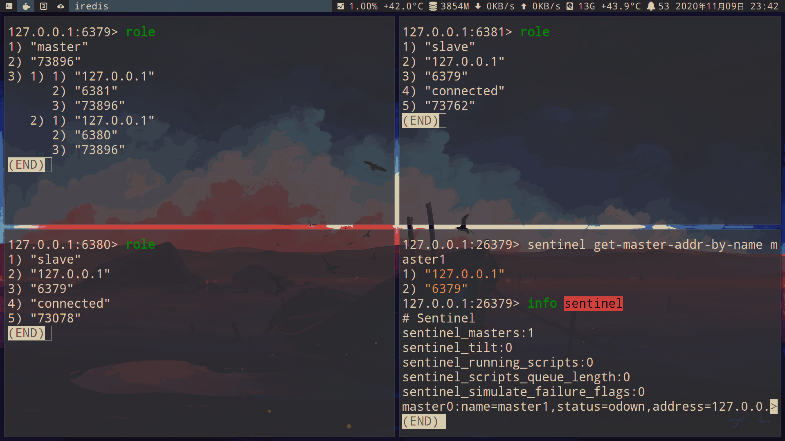

6379 重新连接后成为 **6380** 的从服务器:

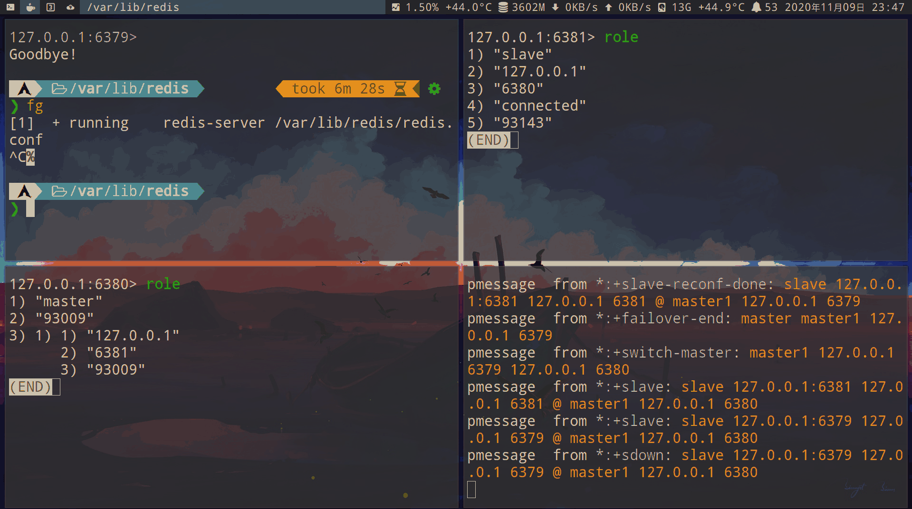

### 专属API
```redis
# 只显示指定master的ip和端口
sentinel get-master-addr-by-name YouMasterName

# 显示所有被监控的master的状态和统计信息
sentinel masters

# 指定master
sentinel masters YouMasterName

# 显示指定master中所有slave的状态和统计信息
sentinel slaves YouMasterName

# 显示监控指定master的其他sentinel节点信息（不包含自己）
sentinel sentinels YouMasterName

# 清除指定master的相关状态（如故障转移）
sentinel reset YouMasterName

# 对指定强制故障转移
sentinel failover YouMasterName

# 检测sentinel节点的总数，是否达到<quorum>的个数。如果quorum=3，sentinel节点个数是2，那么将无法进行故障转移
sentinel ckquorum YouMasterName

# 保存sentinel节点的配置，如配置文件还在则不会保存（只有配置文件丢失时有用）
sentinel flushconfig

# 取消指定master的监控。取消后可通过info Sentinel命令查看
sentinel remove YouMasterName

# 监控master（与配置文件一样）
sentinel monitor YouMasterName 127.0.0.1 6379 1
```

### 实现原理

- 3个定时任务

    - 1.每隔10秒，每个sentinel节点会向master和slave发送`info`命令获取最新的拓扑图
        - 通过向master执行`info`命令获取slave信息，这也是为什么不需要显示配置slave
        - 节点故障，可以实时获取

    - 2.每隔2秒，每个sentinel节点会订阅redis数据节点的`__sentinel__:hello频道`，并发送自身对master的判断以及自身的信息，从而了解其他sentinel节点
        - 哨兵之间的互相发现：是通过 redis 的 pub/sub 实现的
        - 可以发现新的sentinel节点
        - sentinel节点交换master的信息，并作为之后领导人选举的依据

    - 3.每隔1秒，每个sentinel会给主从节点、其他sentinel节点，发送`PING`命令做一次心跳检测，判断是否可达
        - sdown（主观下线）：ping超过`down-after-milliseconds`配置参数时，则对该节点做出失败判断。也叫主观下线，也就是存在误判的可能（可能是因为网络拥塞或者主库压力大的情况）

        - odown（客观下线）：如果一个哨兵在指定时间内收到了 majority(大多数) 数量的哨兵也认为那个 master 宕机了，就是客观宕机。

            - 当主观下线的是master的时候，该sentinel节点会通过`sentinel is-master-down-by-addr`命令向其他sentinel节点询问对master的判断，当超过<quorum>个数时，就做出客观下线的决定

            - master下线后sentinel节点依然会对其进行定期监控。日志设置`loglevel=debug`，可以查看
                - 缺点：造成网络资源浪费

- 领导者sentinel节点选举：故障转移只需1个sentinel节点完成，所有需要选举。redis使用raft算法实现

    - 1.每个sentinel都有资格成为领导者，当主观下线master的时，sentinel节点会通过`sentinel is-master-down-by-addr`命令，会将自己设置为领导者
    - 2.收到命令的sentinel，如果没有同意其他节点的发过来的命令，则同意该节点，否则拒绝
    - 3.sentinel节点发现自己的票数>= max(quorum, num(sentinels) / 2 + 1)时，就成为领导者
    - 4.如果此轮没有选举成功，则进入下一次选举

- 故障转移：领导者sentinel节点进行

    - 1.在slave列表里选出一个作为master。

        - 1.过滤以下不健康的slave：

            | 不健康                                          |
            |-------------------------------------------------|
            | 主观下线                                        |
            | 断线                                            |
            | 5秒内没有回复过sentinel节点的`PING`命令心跳检测 |
            | 与master失联超过`down-after-milliseconds*10秒`  |

        - 2.选择`slave-priority`（优先级，值越小，优先级越高）最高的slave。存在则返回，不存在则继续下一步
        - 3.选择复制偏移量最大的slave。存在则返回，不存在则继续下一步
        - 4.选择`runid`最小的slave

    - 2.对选择好的slave执行`slaveof no one`命令，成为master
    - 3.向剩余的slave执行`slaveof {NewMaster-ip} {NewMaster-port}`

- 如果没有可用的slave，将无法完成故障转移

    - 可以手动启动一个从节点（配置添加`slaveof {master-ip} {master-port}`），它会被sentinel自动发现

- Sentinel节点集合会将原来的master节点更新为slave节点，并保持着对其关注，当其恢复后命令它去复制新的主节点。

### slave（从节点）高可用

- 只有master高可用：

    

    - 如果slave-1故障，client-1将失联，sentinel节点只会对slave-1做主观下线，因为故障转移是针对master的。

    - 所以很多时候slave只是热备份，不让它参与客户端的读操作

- 实现slave高可用：
    - sentinel监控的slave变动事件
        - `+switch-master`：切换master（从升主），说明减少了1个slave
        - `+convert-to-slave`：切换slave（主降从），说明增加了1个slave
        - `+sdown`：主观下线。说明某个slave可能不可用，sentinel没有slave客观下线。需要客户端自己实现
        - `+reboot`：重启某节点，如果它是slave,说明添加了1个slave

    - 只要掌握所有slave的状态，把所有slave看作一个资源池。无论上线还是下线都能感知到，高可用就到达了

    

### 脑裂问题

- 脑裂

    - 在 Redis 主从架构中，部署方式一般是「一主多从」，主节点提供写操作，从节点提供读操作。 如果主节点的网络突然发生了问题，它与所有的从节点都失联了，但是此时的主节点和客户端的网络是正常的

        - 这个客户端并不知道 Redis 内部已经出现了问题，还在照样的向这个失联的主节点写数据（过程A），此时这些数据被旧主节点缓存到了缓冲区里，因为主从节点之间的网络问题，这些数据都是无法同步给从节点的。

    - 这时，哨兵也发现主节点失联了，它就认为主节点挂了（但实际上主节点正常运行，只是网络出问题了），于是哨兵就会在「从节点」中选举出一个 leader 作为主节点，这时集群就有两个主节点了 —— 脑裂出现了。

- 问题：

    - 然后，网络突然好了，哨兵因为之前已经选举出一个新主节点了，它就会把旧主节点降级为从节点（A），然后从节点（A）会向新主节点请求数据同步，因为第一次同步是全量同步的方式，此时的从节点（A）会清空掉自己本地的数据，然后再做全量同步。所以，之前客户端在过程 A 写入的数据就会丢失了，也就是集群产生脑裂数据丢失的问题。

- 解决方法：

    - 当主节点发现从节点下线或者通信超时的总数量小于阈值时，那么禁止主节点进行写数据，直接把错误返回给客户端。

        - `min-slaves-to-write x`：主节点必须要有至少 x 个从节点连接，如果小于这个数，主节点会禁止写数据。
        - `min-slaves-max-lag x`：主从数据复制和同步的延迟不能超过 x 秒，如果超过，主节点会禁止写数据。

    - 原主库就会被限制接收客户端写请求，客户端也就不能在原主库中写入新数据了。

        - 等到新主库上线时，就只有新主库能接收和处理客户端请求，此时，新写的数据会被直接写到新主库中。而原主库会被哨兵降为从库，即使它的数据被清空了，也不会有新数据丢失。

## cluster (集群)

- Redis 通过 fork 子进程来完成数据持久化，但 fork 在执行时会阻塞主线程，数据量越大，fork 的阻塞时间就越长，从而导致 Redis 响应变慢。

    - cluseter（集群）可以解决这个问题，也就是启动多个 Redis 实例来组成一个集群，再按照一定的规则把数据划分为多份，每一份用一个实例来保存，这样客户端只需要访问对应的实例就可以获取数据。

        - 在这种情况下 fork 子进程一般不会给主线程带来较长时间的阻塞

- cluster方案

    - 1.Twemproxy、Codis的代理方案：Proxy 会把你的请求根据路由规则，转发到对应的 Redis 节点上，当集群实例不足以支撑更大的流量请求时，还可以横向扩容，添加新的 Redis 实例提升性能，这一切对于你的客户端来说，都是透明无感知的。

            

    - 2.官方的Redis cluster：无需部署哨兵集群，集群内 Redis 节点通过 Gossip 协议互相探测健康状态，在故障时可发起自动切换。

            

- 数据分布理论

| 分区方式 | 哈希分区                                 | 顺序分区                                 |
|----------|------------------------------------------|------------------------------------------|
| 特点     | 离散度好、数据分布业务无关、无法顺序访问 | 离散度倾斜、数据分布业务相关、可顺序访问 |
| 代表产品 | redis、cassandra、dynamo                 | bigtable、hbase、hypertable              |

- 哈希分区的几个方法：

    - 1.节点取余分区（hash算法）：根据特定数据，如redis的key或用户id，hash(key) % N（节点数）计算哈希值，映射到对应节点

        - 优点：简单。常用于数据库分库分表（一般采用预分区方式，提前规划好分区数），扩容时通常翻倍扩容，避免映射全部被打乱，导致全量迁移

        - 缺点：扩容或收缩节点时，映射关系需要重新计算，会导致数据重新迁移

    - 2.一致性哈希分区（Distributed Hash Table）：为每个节点分配一个token（0-2^32），这些token构成一个哈希环。先根据key计算hash值，然后顺时针找到第一个大于等于该hash值的token节点

        - 假设A、B、C三个Redis实例按照如图所示的位置分布在圆环上，通过上述介绍的方法计算出key的hash值，发现其落在了位置E，按照顺时针，这个key值应该分配到Redis实例A上。

            - 如果此时Redis实例A挂了，会继续按照顺时针的方向，之前计算出在E位置的key会被分配到RedisB，而其他Redis实例则不受影响。

            

        - 优点：增删节点，只影响哈希环相邻节点

        - 缺点：
            - 增删节点，会造成哈希环部分数据无法命中，需要手动处理或忽略这些数据
                - 因此常用于缓存场景

            - 增删节点，需要增加1倍或删除1半节点，才能保证数据和负载的均衡

            - 节点较少时：节点变化对整个哈希环中的数据影响较大，容易出现部分节点数据过多，部分节点数据过少的问题，出现数据倾斜的情况

                - 如下图（图片来源于网络），数据落在A节点和B节点的概率远大于B节点
                    

                - 因此不适合少量节点：为此提出了虚拟槽

    - 3.虚拟槽分区：槽（slot）的数量远远大于节点数，采用大范围的槽是方便数据拆分和集群扩容。

        - 每个虚拟节点都会映射到真实节点，例如，计算出key的hash值后落入到了位置D，按照顺时针顺序，应该落到节点C#1这个虚拟节点上，因为虚拟节点会映射到真实节点，所以数据最终存储到节点C。

            

        - 优点：更加方便地添加和移除节点，增加节点时，只需要把其他节点的某些哈希槽挪到新节点就可以了，当需要移除节点时，只需要把移除节点上的哈希槽挪到其他节点就行了，不需要停掉Redis任何一个节点的服务（采用一致性哈希需要增加和移除节点需要rehash）

        - Dynamo也使用这方案

        - redis cluster槽的范围为2^14（0-16383）。假设有5个节点，平均每个节点负责3276个槽

            - slot=CRC16(key) & 16383
                - 根据键值对的 key，按照 CRC16 算法计算一个 16 bit 的值。
                - 再用 16bit 值对 16384 取模，得到 0~16383 范围内的模数，每个模数代表一个相应编号的哈希槽。

            

            - 官方推荐，一般至少三主三从六个节点

                

                - 画多个节点看起来太乱，所以上图只画了两个主节点

                - 共有三种线
                    - 1.主备复制的线
                    - 2.对外服务的线：访问master进行写操作，访问slave进行读操作
                    - 3.Redis Bus：
                        - Redis Cluster是一个去中心化的架构，不存在统一的配置中心，Redis Cluster中的每个节点都保存了集群的配置信息，在Redis Cluster中，这个配置信息通过Redis Cluster Bus进行交互，并最后达成一致性。
                        - 配置信息的一致性主要依靠PING/PONG，每个节点向其他节点频繁的周期性的发送PING/PONG消息。（gossip 协议）

- 顺序分区：rowkey在每个region顺序分布
    

### 集群功能限制

- 1.key批量操作受限：如`mget`、`mset`，只支持相同slot值的key。不同的slot值key不被支持
- 2.事务：只支持key在同一个节点，不支持多个节点
- 3.key为数据分区的最小粒度：不能将一个大key如hash、list映射到不同节点
- 4.不支持多数据库：单机下redis支持16个数据库，集群只能使用默认的db 0 号数据库
- 5.主从复制结构只支持一层：不支持嵌套树状复制结构

### 手动建立集群

- 开启6个redis

    ```sh
    # 通过for循环,开启6个实例
    for (( i=6379; i<=6384; i=i+1 )); do
        redis-server /home/tz/notes/databases/redis/cluster/redis-$i.conf
    done
    ```

    - 第一次开启，没有内部配置文件，会自动创建一份

        - redis会自动维护集群内部文件，不要手动修改，防止集群重启时产生错误

        - nodes-6379.conf文件内容

            ```
            253e27e0d617bb3c9cdbede1468ecc23e54e4ee9 :0@0 myself,master - 0 0 0 connected
    vars currentEpoch 0 lastVoteEpoch 0
            ```
            - 最重要的是节点id（40位16进制字符串），用于标识集群内的唯一性，很多操作需要借助节点id来完成。
                - 节点id不同于runid，节点id在集群初始化时只创建1次，重启后重用；runid重启是会重置，因此master节点重启会触发全量备份

    - 开启后检测节点日志是否正确

#### 节点握手

- 由客户端连接6379节点，发起`cluster meet 127.0.0.1 6380`命令

    - `cluster meet`是异步命令，执行后立刻返回

    - 流程：
        - 1.6379节点本地创建6380节点信息对象，并发送meet
            

        - 2.6380节点收到后，回复`PONG`

        - 3.之后6379和6380定期通过`PING/PONG`小学进行节点通信

    - 在6379和6380分别执行`cluster nodes`命令（等同于nodes-6379.conf配置文件），可以看到双方已经建立集群
        

        ```redis
        eaf4548fff6106be87d672019ecb600f2481f18d 127.0.0.1:6380@16380 master - 0 1692435953323 0 connected
        253e27e0d617bb3c9cdbede1468ecc23e54e4ee9 127.0.0.1:6379@16379 myself,master - 0 0 1 connected
        ```

- 握手没能正常工作，集群还在下线状态，读写都被禁止

    ```redis
    127.0.0.1:6379> set hello 11111
    (error) ERROR CLUSTERDOWN Hash slot not served
    ```

    - `cluster info`命令查看
    ```redis
    127.0.0.1:6379> cluster info
    cluster_state:fail
    //以下省略
    ```

    - 只有当16384个槽全部分配给节点后，才进入在线状态

#### 分配槽（slot）

- 分配槽

    ```sh
    #!/bin/sh
    for (( i=0; i<=5461; i=i+1 )); do
        redis-cli -h 127.0.0.1 -p 6379 cluster addslots $i
    done

    for (( i=5462; i<=10922; i=i+1 )); do
        redis-cli -h 127.0.0.1 -p 6380 cluster addslots $i
    done

    for (( i=10923; i<=16383; i=i+1 )); do
        redis-cli -h 127.0.0.1 -p 6381 cluster addslots $i
    done
    ```

    - `cluster nodes`查看节点分配的槽
    ```redis
    127.0.0.1:6379> cluster nodes
    ba17a754f45ce4ac259768d973de8354eee10a1b 127.0.0.1:6384@16384 master - 0 1692437361478 5 connected
    253e27e0d617bb3c9cdbede1468ecc23e54e4ee9 127.0.0.1:6379@16379 myself,master - 0 1692437358000 1 connected 0-5461
    a18392ee91e8494d1ab2ddaf2cbaa7c0ca204ff3 127.0.0.1:6382@16382 master - 0 1692437359000 2 connected
    4d36091538f0cfb2c73d18dd1d43dc37f4d198d2 127.0.0.1:6383@16383 master - 0 1692437360000 3 connected
    d1ab3a98eb3f46bcb5572ecef1c29ba97fb668b2 127.0.0.1:6381@16381 master - 0 1692437361000 4 connected 10923-16383
    eaf4548fff6106be87d672019ecb600f2481f18d 127.0.0.1:6380@16380 master - 0 1692437362480 0 connected 5462-10922
    ```

- 建立主从复制，必须在从节点上执行`cluster replicate {master nodeid}`

    ```sh
    redis-cli -h 127.0.0.1 -p 6382 cluster replicate 253e27e0d617bb3c9cdbede1468ecc23e54e4ee9
    redis-cli -h 127.0.0.1 -p 6383 cluster replicate eaf4548fff6106be87d672019ecb600f2481f18d
    redis-cli -h 127.0.0.1 -p 6384 cluster replicate d1ab3a98eb3f46bcb5572ecef1c29ba97fb668b2
    ```

    - `cluster nodes`可以看到节点状态变为`slave`
    ```redis
    127.0.0.1:6379> cluster nodes
    ba17a754f45ce4ac259768d973de8354eee10a1b 127.0.0.1:6384@16384 slave d1ab3a98eb3f46bcb5572ecef1c29ba97fb668b2 0 1692438829285 4 connected
    253e27e0d617bb3c9cdbede1468ecc23e54e4ee9 127.0.0.1:6379@16379 myself,master - 0 1692438825000 1 connected 0-5461
    a18392ee91e8494d1ab2ddaf2cbaa7c0ca204ff3 127.0.0.1:6382@16382 slave 253e27e0d617bb3c9cdbede1468ecc23e54e4ee9 0 1692438827280 1 connected
    4d36091538f0cfb2c73d18dd1d43dc37f4d198d2 127.0.0.1:6383@16383 slave eaf4548fff6106be87d672019ecb600f2481f18d 0 1692438826277 0 connected
    d1ab3a98eb3f46bcb5572ecef1c29ba97fb668b2 127.0.0.1:6381@16381 master - 0 1692438827000 4 connected 10923-16383
    eaf4548fff6106be87d672019ecb600f2481f18d 127.0.0.1:6380@16380 master - 0 1692438829000 0 connected 5462-10922
    ```

- 此时集群已经创建成功，已经可以使用`set`命令了
    ```redis
    127.0.0.1:6379> cluster info
    cluster_state:ok
    //省略
    ```

### 自动建立集群

```sh
# 通过for循环,开启6个实例
for (( i=6379; i<=6384; i=i+1 )); do
    redis-server /home/tz/notes/databases/redis/cluster/redis-$i.conf
done

# 自动建立集群
redis-cli --cluster create 127.0.0.1:6379 127.0.0.1:6380 127.0.0.1:6381 127.0.0.1:6382 127.0.0.1:6383 127.0.0.1:6384 --cluster-replicas 1

# 查看集群是否建立成功（包含cluster nodes命令）
redis-cli --cluster check 127.0.0.1:6379
```

#### 演示

- 至少配置6个节点，才能实现高可用

    - 配置 6 个实例,从端口 6380 到 6385:

    ```sh
    # 端口
    port 6380

    # 后台运行
    daemonize yes
    pidfile "/var/run/redis-6380.pid"

    # 日志和集群内部配置文件的保存目录
    dir "/var/lib/redis/6380"

    # 日志文件名
    logfile "6380.log"

    # 从节点只读模式
    replica-read-only yes

    # 开启集群模式
    cluster-enabled yes

    # 集群内部配置文件
    cluster-config-file nodes-6380.conf

    # 节点超时时间（单位毫秒）。每个节点每秒会执行 10 次 ping，每次会选择 5 个最久没有通信的其它节点。当然如果发现某个节点通信延时达到了 cluster_node_timeout / 2
    cluster-node-timeout 15000
    ```

- 开启 6 个实例:

    ```sh
    # 通过for循环,开启6个实例
    for (( i=6380; i<=6385; i=i+1 )); do
        redis-server /home/tz/notes/databases/redis/cluster/redis-$i.conf
    done
    ```


开启集群:

```sh
redis-cli --cluster create 127.0.0.1:6380 127.0.0.1:6381 127.0.0.1:6382 127.0.0.1:6383 127.0.0.1:6384 127.0.0.1:6385 --cluster-replicas 1
```


```sh
# -c 参数连接集群
redis-cli -c -p 6380
```

可以看到 set name tz 是在 6381 实例，手动把 6381 kill 掉,

重新连接后 get name 变成了 6384 实例

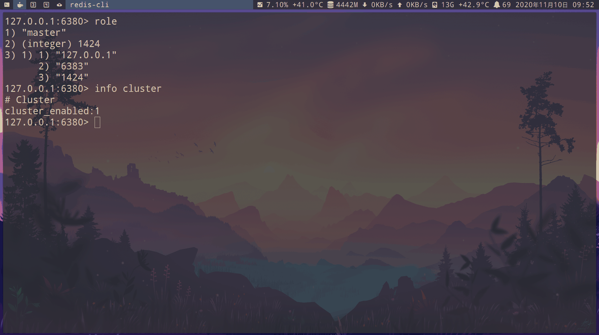

```redis
# 查看每个node(节点),等同于nodes.conf文件
cluster nodes
```

我这里是:

- node 6380 负责 0-5460 slots
- node 6384 负责 5461-10922 slots
- node 6385 负责 10923-16383 slots


```redis
# 查看每个node(节点) 的 slots(槽)
cluster slots
```

我这里是:

- 6383 是 6380 的从节点
- 6381 是 6384 的从节点
- 6382 是 6385 的从节点


也可以在 shell 里执行，通过 grep 显示:

```sh
# master
redis-cli -p 6380 cluster nodes | grep master

# slave
redis-cli -p 6380 cluster nodes | grep slave
```


关闭主节点 6384:

```sh
# 等同于kill
redis-cli -p 6384 debug segfault
```

可以看到原属于 6384 的从节点 6381,现在变成了主节点(master)


这时再关闭主节点 6381:

```sh
redis-cli -p 6381 debug segfault
```

因为 6381 已经没有从节点了，可以看到整个 cluster 已经 down 掉了

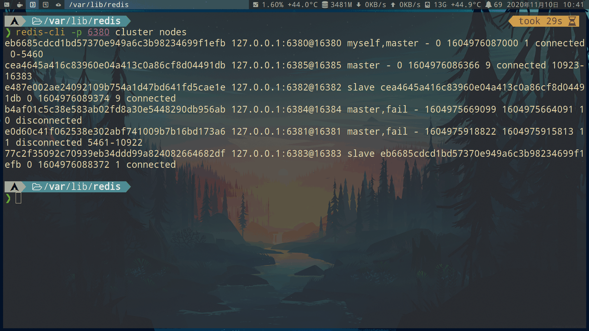

重新启动 6381 或者 6384 后会恢复集群

### Gossip通信协议

- 分布式存储需要维护node的元数据信息（故障信息、状态信息等）。维护方式分为：集中式、P2P

     - redis采用P2P的Gossip（流言）协议：并不是将集群元数据存储在某个节点上（如zookeeper），而是不断的互相通信，保持整个集群的元数据是完整的。

        - node彼此不断通信交换信息，一段时间后所有node都知道cluster的完整信息

- 通信过程：

    - 1.每个node都会开通一个tcp通道，与其他node通信。端口为基础端口加上10000

    - 2.每个node每秒1次选择几个node发送`PING`消息
        - 通信node过多虽然可以及时获取信息，但交换成本过高。因此选择通信的node列表就变得非常重要
            - 1.每秒随机5次找出最久没有通信的1个node，发送`PING`
            - 2.每100毫秒都会扫描本地node节点，如果发现最后通信时间大于`node-timeout` / 2，则立刻发送`PING`
            - 根据以上2个规则可以计算出：每个node每秒发送`PING`的数量= 1 + 10 * num(node.pong_received > cluster_node_timeout / 2)
                - 因此`cluster_node_timeout`参数对消息发送的影响非常大。带宽资源紧张时可以调整为30秒（默认为15秒）

    - 3.接受`PING`的node，回复`PONG`

- 消息类型：消息格式划分为`消息头` + `消息体`。消息头是固定的2KB，消息体包含其他node的信息

    - ping消息：封装了自己node和其他node状态的数据。用于检测node是否在线，并交换彼此状态信息。cluster内最频繁的消息

    - pong消息：响应ping和meet。封装了自身node状态的数据。也可以向cluster广播自身pong，对自身状态的更新
        

    - meet消息：通知有新node加入

    - fail消息：判断一个node下线时，会向cluster广播一个fail消息。其他node收到后会把对应node更新为下线状态

### 集群的扩容和收缩

- 扩容和收缩：可以看作是槽（slot）和对应数据在不同node之间移动

#### 扩容

- 扩容是cluster最常见的需求

- 1.准备好2个新节点（1个master + 1个slave）
```sh
redis-server redis-6385.conf
redis-server redis-6386.conf
```
- 2.加入集群
```sh
# 加入到6379集群
redis-cli --cluster add-node 127.0.0.1:6385 127.0.0.1:6379
redis-cli --cluster add-node 127.0.0.1:6386 127.0.0.1:6379
```
```sh
# 设置6386为6385的slave。这里输入6385的节点id（nodeid）
redis-cli -p 6386 cluster replicate 38df4d6291d994f1a9aa629fd23404f74abed9db
```

- 3.分配槽
```sh
redis-cli --cluster reshard 127.0.0.1:6379
# 以下为输出
# 输入4096。之前3个主节点，现在4个主节点16384 /4 = 4096
How many slots do you want to move (from 1 to 16384)? 4096
# 这里输入新节点6385的节点id
What is the receiving node ID? 38df4d6291d994f1a9aa629fd23404f74abed9db
# 这里输入源节点的id，分别输入6379、6380、6381的节点id，最后输入done
Source node #1: 253e27e0d617bb3c9cdbede1468ecc23e54e4ee9
Source node #2: eaf4548fff6106be87d672019ecb600f2481f18d
Source node #3: d1ab3a98eb3f46bcb5572ecef1c29ba97fb668b2
Source node #4: done
```

```sh
# 检测节点的均衡性。在2%以内表示相对均衡，无需调整
redis-cli --cluster rebalance 127.0.0.1:6379
*** No rebalancing needed! All nodes are within the 2.00% threshold.
```

- 4.最后`cluster nodes`命令查看cluster

#### 收缩

- 需要把自身的槽（slot）均匀的迁移到其他主节点

- cluster有4个节点，平均每个4096个槽。现在要下线1个节点（6385端口），剩下3个节点也就是4096 / 3 = 1365 + 1365 + 1366个槽。一共3次迁移

- 1.迁移

    - 从6385迁移到6379
    ```sh
    redis-cli --cluster reshard 127.0.0.1:6385
    # 以下为输出
    # 输入1365
    How many slots do you want to move (from 1 to 16384)? 1365
    # 输入目标的节点id，我这里是6379
    What is the receiving node ID? 253e27e0d617bb3c9cdbede1468ecc23e54e4ee9
    # 输入源的节点id，也就是下线的6385节点id
    Source node #1: 38df4d6291d994f1a9aa629fd23404f74abed9db
    Source node #2: done
    ```

    - 从6385迁移到6380
    ```sh
    redis-cli --cluster reshard 127.0.0.1:6385
    # 以下为输出
    # 输入1365
    How many slots do you want to move (from 1 to 16384)? 1365
    # 输入目标的节点id，这次是6380
    What is the receiving node ID? eaf4548fff6106be87d672019ecb600f2481f18d
    # 输入源的节点id，也就是下线的6385节点id
    Source node #1: 38df4d6291d994f1a9aa629fd23404f74abed9db
    Source node #2: done
    ```

    - 从6385迁移到6380
    ```sh
    redis-cli --cluster reshard 127.0.0.1:6385
    # 以下为输出
    # 这次输入1366
    How many slots do you want to move (from 1 to 16384)? 1366
    # 输入目标的节点id，这次是6381
    What is the receiving node ID? d1ab3a98eb3f46bcb5572ecef1c29ba97fb668b2
    # 输入源的节点id，也就是下线的6385节点id
    Source node #1: 38df4d6291d994f1a9aa629fd23404f74abed9db
    Source node #2: done
    ```

- 2.忘记节点：不在让其他node与下线node进行Gossip消息交换

    - 如果只有master下线，则需要把slave指向其他master
    - 如果主从都下线，建议先下线slave，在下线master。防止不必要的全量复制

    - 错误做法：`cluster foget {nodeid}`命令

        - 会把nodeid的node加入节点禁用列表，有效期是60秒，超过会再次进行Gossip消息交换。也就是只有60秒时间，要集群内的每个node都要执行此命令

            - 因此不建议线上用使用命令，需要大量节点命令交互，容易遗漏

    - 正确做法：

        ```sh
        # 下线slave 6386 最后输入节点id
        redis-cli --cluster del-node 127.0.0.1:6386 16a182f86987e9b2336f6eff4ba5f95db7bbe324

        # 下线master 6385 最后输入节点id
        redis-cli --cluster del-node 127.0.0.1:6385 38df4d6291d994f1a9aa629fd23404f74abed9db
        ```

- 3.最后`cluster nodes`命令查看cluster
    - 不包含6385和6386表示安全下线

### key的重定向

- key的重定向：

    - `redis-cli -c`开启自动重定向get key。不过我建议直接使用`iredis`客户端

    ```redis
    # 如果key不在本地，会显示MOVED。我这里表示key在6379节点的866槽。
    127.0.0.1:6380> get hello
    MOVED 866 127.0.0.1:6379
    "11111"

    # 查看key所在的槽（slot）
    cluster keyslot hello
    ```
    

- `hash-tag`：如果key包含`{}`只计算{}内的hash值。这样可以指定一些key，存储在同一个槽

    - 如果不合理使用，会导致大量的数据可能被集中到一个实例上发生数据倾斜，集群中的负载不均衡。

    ```redis
    # 只计算1的hash值
    set hello:{1}:1 11111
    set hello:{1}:2 11111
    set hello:{1}:3 11111

    # 使用mget测试是否在同一个槽
    mget hello:{1}:3 hello:{1}:2 hello:{1}:1
    ```

#### Smart客户端

- 通过客户端内部维护slot->node的映射关系，直接到目的node查找。从而减少1次网络往返

- jedis客户端需要自行修改

### 故障转移

- 故障发现：

    - 主观下线（pfail）：`cluster-node-timeout`时间内，发送的`PING`消息没有回复。会更新本地对node的状态为主观下线。然后在cluster内广播

    - 客观下线：node接受到其他node的pfail，都会尝试触发客观下线
        > 跟哨兵的原理一样
        - 统计下线报告的数量
            - 小于cluster主节点总数的一半，则退出
            - 大于cluster主节点总数的一半，则标记客观下线
                - 广播`fail`
                    - 通知cluster内的node标记故障节点为客观下线状态，并立刻生效
                    - 通知故障节点的slave触发故障转移

                    - 但可能会存在cluster被分割成一大一小两个独立cluster
                        - 大cluster完成客观下线，并广播`fail`
                        - 小cluster无法接受到`fail`。但只要恢复后，只要故障节点变为客观下线，最终可以通过Gossip消息传播到所有node

                        

- 故障恢复：下线的master的所有slave，从中选一个成为新master

    - 1.资格检查：每个slave都要检查与master的断线时间。如果超过`cluster-node-time * cluster-slave-validity-factor（有效因子，默认10）`则没有资格

    - 2.准备选举时间：复制偏移量越大的slave，说明延迟越低，应该具有更高的优先级，将提前触发故障选举流程
        

    - 3.发起选举：slave定时任务检测到达故障选举时间（failover_auth_time）到达后，发起选举

        - 1.更新配置纪元

            - 配置纪元：是一个只增不减的整数。

                - 作用：标识cluster内每个master的不同版本，和当前cluster的最大版本。每次出现新的master（新加入或由slave转换而来）、slave竞争选举。都会递增cluster全局的配置纪元，赋值给相关master
                    - 新节点的加入
                    - 槽节点映射冲突检测
                    - slave投票选举冲突检测

                - cluster维护一个全局的配置纪元（clusterState.current Epoch），记录cluster内所有master配置纪元的最大版本

                - master维护自身的配置纪元，表示当前master的版本，每个master的配置纪元都不相等

                    - 配置纪元会跟随`PING/PONG`消息在cluster内传播，如果发送方和接收方的master配置纪元相等，则表示出现了冲突，节点id（nodeid）更大的一方会递增全局配置纪元，并赋值给当前node来区分冲突

                - slave会复制master的配置纪元。

                    - slave每次发起投票都会自增cluster的全局配置纪元

        - 2.在cluster内广播选举信息，并记录已发送过的消息状态，保证该slave在一个配置纪元内只能发起一次选举。

    - 4.选举投票：每个配置纪元代表一次选举周期，在开始投票之后的`cluster-node-timeout * 2`时间内slave没有获取足够数量的投票，则本次选举作废。slave将自增配置单元发起下一轮投票，直到选举成功为止。
        - cluster内的master进行领导者选举。
        - 当slave收集到N/2+1个持有槽的master投票，slave就会替换为master
            - 故障master也算在投票数内，假设cluster是3主3从，有2个master部署在同一个机器上，当这台机器宕机时，slave无法收集到3/2+1个master选票导致故障转移失败
                - 解决方法：部署cluster时，所有master最少需要部署3台物理机上，才能避免单点问题

    - 5.替换master
        - slave取消复制变为master
        - 执行`clusterDelSlot`撤销故障master的槽，并执行`clusterAddSlot`把这些槽委派给自己
        - 向cluster广播pong，通知cluster内的所有node：当前slave变为master，并接管了槽的信息

#### 日志演示


- 故障转移

    - 1.强制关闭redis 6379
    ```sh
    kill -9 4748
    ```
    - 2.查看6379的slave 6382的日志，显示复制中断
    ```
    4906:S 20 Aug 2023 22:18:16.610 # Connection with master lost.
    4906:S 20 Aug 2023 22:18:16.610 * Caching the disconnected master state.
    4906:S 20 Aug 2023 22:18:16.610 * Reconnecting to MASTER 127.0.0.1:6379
    4906:S 20 Aug 2023 22:18:16.610 * MASTER <-> REPLICA sync started
    4906:S 20 Aug 2023 22:18:16.610 # Error condition on socket for SYNC: Connection refused
    ```

    - 3.其他两个master（6380、6381）将6379标记为主观下线，超过半数后标记为客观下线

    ```
    4854:M 20 Aug 2023 22:18:33.344 * Marking node 253e27e0d617bb3c9cdbede1468ecc23e54e4ee9 as failing (quorum reached).
    4906:S 20 Aug 2023 22:18:33.344 # Cluster state changed: fail
    ```

    - 4.6382在客观下线后准备选举时间，日志显示延迟879毫秒之后执行
    ```
    4906:S 20 Aug 2023 22:18:33.430 # Start of election delayed for 879 milliseconds (rank #0, offset 16993).
    ```

    - 5.延迟选举时间达到后，slave更新配置纪元（epoch），并发起故障选举
    ```
    4906:S 20 Aug 2023 22:18:34.333 # Starting a failover election for epoch 13.
    ```

    - 6.两个master（6380和6381）对slave（6385）投票
    ```
    4854:M 20 Aug 2023 22:18:34.334 # Failover auth granted to a18392ee91e8494d1ab2ddaf2cbaa7c0ca204ff3 for epoch 13
    ```
    - 7.slave获取超过半数的投票后，执行替换master操作，完成故障转移
    ```
    4906:S 20 Aug 2023 22:18:34.336 # Failover election won: I'm the new master.
    4906:S 20 Aug 2023 22:18:34.336 # configEpoch set to 13 after successful failover
    ```

    - 8.`cluster nodes`命令查看状态。6379状态是fail（客观下线），6382成为master
    ```redis
    a18392ee91e8494d1ab2ddaf2cbaa7c0ca204ff3 127.0.0.1:6382@16382 master - 0 1692541920389 13 connected 0-1364 1366-5461
    253e27e0d617bb3c9cdbede1468ecc23e54e4ee9 127.0.0.1:6379@16379 master,fail - 1692541096691 1692541092000 10 disconnected
    ```

- 故障节点恢复
    - 1.重新启动6379
    ```sh
    redis-server ~/notes/databases/redis/cluster/redis-6379.conf
    ```
    - 2.6379日志：成为了6382的slave
    ```
    8141:M 20 Aug 2023 22:35:33.617 # Configuration change detected. Reconfiguring myself as a replica of a18392ee91e8494d1ab2ddaf2cbaa7c0ca204ff3
    ```
    - 3.cluster内其他node接收到6382发来`PING`，清空客观下线
    ```
    4801:M 20 Aug 2023 22:35:33.713 * Clear FAIL state for node 253e27e0d617bb3c9cdbede1468ecc23e54e4ee9: master without slots is reachable again.
    ```
    - 4.6379发起6382的复制流程
    ```
    8141:S 20 Aug 2023 22:35:38.618 * MASTER <-> REPLICA sync: Flushing old data
8141:S 20 Aug 2023 22:35:38.618 * MASTER <-> REPLICA sync: Loading DB in memory
    ```

#### 手动故障转移

- 在slave执行`cluster failover`命令，slave会变为master（默认情况下，客户端会有短暂阻塞，但不会丢失数据）

    - 1.slave统治master停止处理所有客户端请求
    - 2.master发送对应slave延迟复制的数据
    - 3.slave接受处理延迟复制的数据，知道主从复制的偏移量一致为止，保证复制数据不丢失

    - 4.slave立刻发起投票选举（不需要延迟触发机制）。选举成功后成为master，向cluster广播master`PONG`消息
    - 5.旧master接受到消息后，更新自身配置成为slave，解除所有客户端的阻塞，这些请求会被重定向到新master上执行
    - 6.新slave向新master发起全量复制流程

- 应用场景：

    - 1.调整节点部署时，如节点所在的老机器替换到了新机器。

    - 2.强制故障转移。当自动故障转移失败时，只要master有存活的slave就可以了。自动转移失败的场景有以下
        - 1.master和所有slave同时故障。尽量保证master和slave不在同一机器/机架上。除非机房大面积故障，不然两台机器/机架故障概率很低
        - 2.slave与master复制断线时间爱你超过`cluster-slave-validity-factor * cluster-node-timeout + repl-ping-slave-period`导致slave被判定为没有故障转移资格。
            - 手动故障转移不做中断超时检查
        - cluster超过一半以上的master同时故障

    - 针对以上情况`cluster failover`命令提供两个参数`force/takeover`
        - `cluster failover force`：slave直接发起选举，不再跟master确认复制偏移量（数据会丢失），slave选举成功后替换新master，并向cluster广播配置
            - 应用场景：master宕机无法完成自动故障转移

        - `cluster failover takeover`：不在进行选举，而是直接替换成为新master。由于没有领导者选举发起故障转移，可能会导致配置纪元（epoch）冲突。冲突发生后以节点id（nodeid）高的一方为准，低的一方在这段时间内写入的数据会丢失

            - 应用场景：cluster内超过一半以上master故障，因为slave无法收到超过半数以上master的投票，所以无法完成选举

            - 例子：cluster分别部署在2个同城机房，每个机房都有4个master和4个slave

                

                - 当两个机房网络中断后：
                    - 机房A：完成自动故障转移，slave-4成为master-4
                    - 机房B：运维人员对slave-1、slave-2、slave-3分别执行`cluster failover takeover`命令强制故障转移
                - 当两个机房网络恢复后：cluster会有两套持有相同槽信息的node，cluster会使用配置纪元（epoch）高的master槽信息，相等时使用节点id（nodeid）更高的一方。另一方在这段时间内写入的数据将会丢失

- 建议优先级：`cluster failover` > `cluster failover force` > `cluster failover takeover`

### 集群倾斜

- 数据倾斜

    - 1.node和槽（slot）分配严重不均

        ```sh
        # 查看每个node负责的槽和key总量，以及每个槽平均的key数
        redis-cli --cluster info 127.0.0.1:6379
        127.0.0.1:6382 (a18392ee...) -> 3 keys | 5461 slots | 1 slaves.
        127.0.0.1:6381 (d1ab3a98...) -> 3 keys | 5462 slots | 1 slaves.
        127.0.0.1:6380 (eaf4548f...) -> 3 keys | 5461 slots | 1 slaves.
        [OK] 9 keys in 3 masters.
        0.00 keys per slot on average.
        ```

        ```sh
        # 节点对应的槽数量不均匀，可以使用
        redis-cli --cluster rebalance 127.0.0.1:6379
        ```

    - 2.不同槽对应的key数量差异过大
        - CRC16哈希函数，正常情况槽内key的数量会相对均衡
        - 当大量使用`hash_tag`时，会映射到同一个槽
            ```redis
            # 获取槽有多少个key
            cluster countkeysinslot {slof}

            # count代表循环获取所有key，从而发现过度使用hash_tag的槽
            cluster getkeysinslot {slof} {count}
            ```
    - 3.集合对象包含大量元素（也就是bigkey）

        - cluster的槽迁移是对key执行`migrate`命令，如果key过大可能会超时导致迁移失败。

        ```sh
        # 搜索bigkey
        redis-cli --bigkey
        ```

    - 4.内存相关配置不一致
        - 如`hash-max-ziplist-value`、`set-max-intset-entries`等压缩数据配置。如果有大量hash、set的key，极端情况下可能会有数倍内存差异，造成node内存倾斜

- 请求倾斜：对热key或大key使用算法复杂度比较高的命令（如hgetall、smembers等），会导致node负载过高

    - 1.合理设计key：热key拆分，使用`hmget`代替`hgetall`
    - 2.不要使用热key作为`hash_tag`，避免映射到同一个槽
    - 3.对于一致性不高的场景，客户端使用本地缓存减少热key调用

### 单机redis数据迁移到cluster
```sh
redis-cli import 127.0.0.1:6379 --from --copy --replace
```
### 常见问题

- 为了完整性，默认情况下16384个槽，任何一个没有指派到node时，cluster是不可用的。执行任何命令会返回`（error）CLUSTERDOWN Hash slot not served`错误。

    - 但当持有槽的master下线时：从故障发现到自动完成转移期间cluster是不可用的。可以设置参数`cluster-require-full-coverage=no`，当有master下线也只影响它负责槽的相关命令执行，不影响其他master

- 带宽消耗

    - cluster带宽消耗分为：读写命令消耗 + Gossip消息消耗

        - cluster内每个node通过`PING/PONG`消息彼此交换信息，官方建议cluster的node控制在1000以内

        - 消息数据量：每个消息包含：slots槽数组（2KB）+ cluster 1/10的状态数据（10个node状态数据约为1KB）

            - 例子：200个node的cluster，部署在20台物理机上，每台划分10个node，`cluster-node-timeout`（默认15秒），这时`PING/PONG`消息占用25MB，如果设置成20，降低到15MB以下

    - 合理规划：

        - 满足业务尽量避免大集群。同一个系统可以针对不同业务常见拆分多套cluster

        - 由于机器上线带宽是固定的，相同规模的cluster分布的机器越多，每台机器划分的节点划分的越均匀，则cluster内的整体可用带宽越高

            - 例子：《redis开发与运维》作者维护一个推荐系统，根据数据特征使用了5个cluster， 每个cluster的node规模控制在100以内

            - 如果cluster有60个node，部署在3台物理机上，每台部署20个node。这时带宽消耗将非常严重。

        - 适度提高`cluster-node-time`降低消息发送频率，同时此参数还影响故障转移速度，因此需要兼顾二者平衡
            - 主观下线（pfail）识别时间=cluster-node-timeout
            - 主观下线状态消息传播时间<=cluster-node-timeout / 2。超过此时间未通信的node,会发起`ping`
            - slave转移时间<=1000毫秒。由于存在延迟发起选举机制，偏移量最大的slave会最多延迟1秒发起选举。通常第一次就会选举成功，所以slave执行转移时间在1秒以内
            - 故障转移时间：failover-time（毫秒）<= cluster-node-timeout + cluster-node-timeout / 2 + 1000

- 避免在大量node的集群内，频繁使用Pub/Sub功能，否则会严重造成网络带宽的消耗

    - 建议使用sentinel结构专门用于Pub/Sub功能

- 集群读写分离

    - 只读连接：cluster模式下，slave不接受任何读写请求（复制配置的`slave-read-only`在cluster模式下无效）

        - 可以使用`readonly`命令打开客户端只读状态，让slave读取，分担master的压力。

            - `readonly`只是连接级别生效，每次新建连接都要执行。开启readonly想关闭使用`readwrite`命令

    - 读写分离：

        - 需要修改客户端：
            - 1.维护每个master可用的slave列表
            - 2.针对读命令维护请求node路由
            - 3.slave新建连接开启`readonly`状态

        - 不建议做读写分离，因为成本很高，可以直接拓展master数量
        - 读写分离用于特殊的业务场景
            - 1.利用复制的最终一致性，使用多个slave做跨机房部署，降低命令网络延迟
            - 2.master故障转移时间过长，业务把读请求路由给slave保证读操作可用
            - 以上场景，也可以在不同机房独立部署redis cluster解决，通过客户端多写来维护；读命令直接请求到最近机房的cluster，故障时客户端转向另一个cluster

## 调试和性能测试和优化

### 网络延迟

- Redis真的变慢了吗？
    - 机器配置比较低：延迟锁 2ms 时，就可以认为 Redis 变慢了
    - 机器配置比较高：延迟是 0.5ms 时，就可以认为 Redis 变慢了。

    - 所以，你只有了解了你的 Redis 在生产环境服务器上的基准性能，才能进一步评估，当其延迟达到什么程度时，才认为 Redis 确实变慢了。

    - 如果你观察到的 Redis 运行时延迟是其基线性能的 2 倍及以上，就可以认定 Redis 变慢了。
        - 一个简单的方法是用 iPerf 这样的工具测试网络极限带宽。
            ```sh
            # 服务端
            iperf -s -p 12345 -i 1 -M

            # 客户端
            iperf -c 服务器端IP -p 12345 -i 1 -t 10 -w 20K
            ```

```sh
# 测试于服务器的网络延迟
redis-cli --latency

# 执行延迟检测，持续时间为 60 秒。
redis-cli --intrinsic-latency 60

# 查看一段时间内 Redis 的最小、最大、平均访问延迟。默认每15秒输出1次
redis-cli --latency-history

# 每1秒输出1次
redis-cli --latency-history -i 1

# 图表显示
redis-cli --latency-dist
```

```sh
# 获取大key(内部采用scan)
redis-cli --bigkeys

# 每隔1秒获取内存占用, 一共获取100次. -r: 执行多次, -i: 每隔几秒执行一次
redis-cli -r 100 -i 1 info | grep used_memory_human

# 每隔一秒获取info的统计信息
redis-cli --stat
```

- 检测系统是否可以稳定分配指定容量内存

```sh
# 测试1G。测试检测时间比较长
# 并不需要每次redis开启都要进行测试。该功能偏向于调试和测试
redis-server --test-memory 1024
```

### 阻塞

#### jedis发现阻塞

- redis阻塞时，jedis客户端会抛出`JedisConnectionException`的异常

    - 解决方法：

        - 在应用方加入异常统计，并通过邮件/短信/微信报警（如1分钟超过10个异常）

            - redis调用api会分散在项目的多个地方，每个地方都加入监控代码难以维护。解决方法是日志系统，java可以使用`logback`或`log4j`

        - 但绝大多数客户端类库没有在异常信息打印ip和port的信息，在cluster集群无法快速定位是哪个节点
            - 解决方法：修改redis客户端的成本很低，比如Jedis只需要修改`Connection`类下的connect、sendCommand、readProtocolWithCheckingBroken方法专门捕抓连接、发送命令、协议读取事件异常。

- 引入如cachecloud的监控系统发现阻塞

- [阿里开发者：一次访问 Redis 延时高问题排查与总结]()

    - 在2023年3月8日，在某个地域进行了线上压测，发现接口的平均响应时间（RT）频繁超时，性能下降严重。
        - P50表示响应时间的中位数，即有一半的请求在400毫秒以下完成。
        - P90表示90%的请求在1200毫秒以下完成。
        - P99表示99%的请求在2000毫秒以下完成。

    - 为啥Redis访问延时如此高?

        - 可能性1: 服务端问题?我们Redis使用的是 redis_amber_master_4xlarge_multithread 16C32G+480G SSD 规格, 最大QPS参考值24w, 最大连接数3w, 配置还是非常豪华的。QPS以及Load在峰值请求阶段, 都仍然处于低位。

        - 可能性2: 物理网络问题?请求远远没有达到机器带宽, 不是瓶颈. 另外单独看了网卡重传率等指标, 也都正常。

        - 可能性3: 客户端问题?

            - Java虚拟机（JVM）垃圾回收，虽然YGC（新创建的对象首先被分配到年轻代）次数与耗时有所上升, 但没有发生FGC（是对整个堆内存（包括年轻代和老年代）的垃圾回收操作）。

            - JedisPool问题?

                - 把内存Dump出来, 分析JedisConnectionFactory几个相关重要指标, 发现问题有如下2个:

                    - 1.maxBorrowWaitTimeMills过大: 即最大等待时间过久。在等待从连接池中获取连接, 最大等待了1200ms。很大概率是因为block在连接池获取, 导致请求处理缓慢。

                    - 2.Redis连接创建销毁次数过多: createdCount 11555次; destroyedCount: 11553次。说明max-idle参数设置不合理(on return的时候检查idle是否大于maxIdle, 如果大于则直接销毁该连接)。每个对象的创建就是一次TCP连接的创建, 开销较大。导致脉冲式请求过来时引发频繁创建/销毁, 也会影响整体性能。

                - 解决问题：

                    - 修改前的参数
                    ```java
                    spring.redis.jedis.pool.max-active=100
                    spring.redis.jedis.pool.max-idle=16

                    spring.redis.jedis.pool.time-between-eviction-runs-millis=30000

                    spring.redis.jedis.pool.min-idle=0
                    spring.redis.jedis.pool.test-while-idle=true
                    spring.redis.jedis.pool.num-tests-per-eviction-run=-1
                    spring.redis.jedis.pool.min-evictable-idle-time-millis=60000
                    ```

                    - 修改后的参数
                    ```java
                    spring.redis.jedis.pool.max-active=500 // 线上稳定保有4台, 4*500=2000, 仍然远小于Redis规格支持的3w
                    spring.redis.jedis.pool.max-idle=500

                    spring.redis.jedis.pool.time-between-eviction-runs-millis=30000 // 定时心跳保活与检测

                    spring.redis.jedis.pool.min-idle=500 // 连接池的稳定数量
                    spring.redis.jedis.pool.test-while-idle=true //定时心跳保活与检测
                    spring.redis.jedis.pool.num-tests-per-eviction-run=-1 // 每次保活检测, 都需要把500个连接都检测一遍. 如果设置为-2, 则每次检测1/2比例的的连接.
                    spring.redis.jedis.pool.min-evictable-idle-time-millis=-1 // 不要因为idleTime大于某个阈值从而把连接给删除掉. 这样可以防止无意义的大规模连接重建。
                    ```

                - 验证：

                    - maxBorrowWaitTimeMills 下降比例接近 80%

                    - createdCount 也从之前的 11555次 下降到了 500次(即池子初始化的size)

                    - 业务侧整体性能也大幅提升, P50与P90均下降了将近60%, P99更是夸张地下降了70%。简直是amazing, 完结撒花!~

#### slowlog(慢查询日志)

- 慢查询只记录命令的执行时间，不包含命令排队和网络传输时间

    - 也就是说：客户端执行命令的时间会大于记录的时间

- redis通过一个列表(FIFO)存储慢查询日志

    - 日志长度为: `slowlog-max-len` 参数(默认128), 建议设置1000

- 慢查询时间为: `slowlog-log-slower-than` 参数(默认10000微妙, 也就是10毫秒), 建议设置1000

```redis
config set slowlog-log-slower-than 1000
config set slowlog-max-len 1000
# 将修改写入配置文件
config rewrite
```

```redis
# 获取日志, n为日志的条数. 有3个值分别为: 标识id, 发生时间戳, 命令耗时
slowlog get <n>

# 获取日志条数
slowlog len

# 删除所有日志
slowlog reset
```

#### mysql 存储redis慢查询日志

- 慢查询过多的情况下会丢失，可以定期执行`slow get` 命令将日志持久化到其他存储（例如mysql）

第13章cachecloud

#### 客户端周期性连接超时

- 分析

    - 服务端没有异常，只有一些慢查询

    - 网络是正常的

    - reids日志统计没有异常

    - 发现只有慢查询出现，客户端就会大量连接超时

- API或数据结构使用不合理导致bigkey：发现是应用方有个定期（每5分钟）任务，执行了hgetall（复杂度O(n)）造成阻塞，那个bigkey有200万个元素

    - 解决方法：
        - 修改为使用`hmget`命令
        - 处理bigkey：根据业务拆分，如用户好友集合，热点用户会关注大量好友，可以按时间或其他拆分多个集合

- 这得益于客户端的监控工具，如果redis是黑盒运行很难快速发现问题。
    - 监控慢查询，一旦超过阈值就报警

- 要避免在bigkey上执行超过O(n)复杂度的命令

#### cpu

- cpu饱和：

    - 单线程的redis只能使用1个cpu，cpu饱和指把单核cpu跑到接近100%

        - 这会导致redis无法处理更多命令

    - `info commandstats`命令统计命令不合理的开销时间

        ```redis
        cmdstat_hset:calls=198757512,userc=27021957243,userc_per_call=135.95
        ```

        - 这个输出发现了问题：hset复杂度只有O(1)，但平均耗时135微米，显然不合理，正常耗时应该10微妙以下。

            - 这是因为hash使用了`ziplist`编码，操作的复杂度在O(n)到O(n^2)之间

- cpu竞争：redis进程绑定cpu，降低上下文切换

    - Redis6.0之前：开启持久化和主节点不建议绑定cpu：子进程会和父进程共享1个cpu，导致相互竞争

    - Redis6.0之后：可以对主线程、后台线程、后台 RDB 进程、AOF rewrite 进程，绑定固定的 CPU 逻辑核心：

        - Redis 的性能已经足够优秀，除非你对 Redis 的性能有更加严苛的要求，否则不建议你绑定 CPU。

        ```
        # Redis Server 和 IO 线程绑定到 CPU核心 0,2,4,6
        server_cpulist 0-7:2
        # 后台子线程绑定到 CPU核心 1,3
        bio_cpulist 1,3
        # 后台 AOF rewrite 进程绑定到 CPU 核心 8,9,10,11
        aof_rewrite_cpulist 8-11
        # 后台 RDB 进程绑定到 CPU 核心 1,10,11
        # bgsave_cpulist 1,10-1
        ```


- 内存swap问题：可以降低swap的优先级`echo 10 > /proc/sys/vm/swappiness`

#### 持久化阻塞

- fork阻塞：查看`info stats`中的`latest_fork_usec`指标，表示最近一次的fork耗时，如果超过1秒，需要优化
    - 解决方法：建议每个redis内存控制在10GB以内

- AOF阻塞：设置`everysec`配置时，当硬盘压力过大，fsync需要等待，当主线程发现距离上一次fsync超过2秒时，会阻塞直到fsync完成，并打印如下日志。并且`info persistence`中的`aof_delayed_fsync`指标会累加。
    ```redis
    Asynchronous AOF fsync is taking too long (disk is busy?). Writeing the AOF buffer without wating for fsync to complete, this may slow down Redis.
    ```

    - 解决方法：
        - 不要和高硬盘负载的服务部署在一起：存储服务、消息队列等...
        - aof重写可以配置`no-appendfsync-on-rewrite`（默认关闭），表示aof重写不做fsync操作
        - 多redis实例，可以配置不同的硬盘存储aof文件

- HugePage：开启了THP，即使是`incr`命令也会出现在慢查询

- 也可能是其他进程引起的：使用`iotop`命令查看

#### 网络问题

- 网络闪断：发生在网络切割或者带宽耗尽，使用`sar -n DEV`查看流量是否正常；或者借助系统监控工具（如Ganglia）进行识别

- redis连接被拒绝：redis通过`maxclients`控制客户端的最大连接数，超过后会拒绝。`info stats`中的`rejected_connections`统计被拒绝连接的数量

    - 客户端访问redis时，尽量采用NIO长连接或连接池

    - 当redis用于大量分布式节点访问且生命周期比较短的场景时（如map/reduce）。客户端会频繁启动和销毁，默认redis不会主动关闭长时间闲置的连接或检查关闭无效的tcp连接，会导致redis无法快速释放的问题

        - 解决方法：配置`tcp-keepalive`和`timeout`参数，让redis主动检测和关闭连接

- 连接溢出：

    - 1.进程限制：最大打开文件数，通过`ulimit -n`查看（默认1024），设置`ulimit -n 65535`

    - 2.tcp-backlog（tcp三次握手中的accept 全连接队列长度）：

        - 查看backlog溢出。如果怀疑是backlog溢出，可以使用cron定时执行
        ```sh
        netstat -s | grep overflowed
        ```

        - 增大队列长度`echo 511 > /proc/sys/net/core/somaxconn`

- 网络延迟：
    - 网络延迟的快到慢：同物理机 > 同机架 > 跨机架 > 同机房 > 同城机房 > 异地机房
        - 容灾性与延迟正好相反

    - `redis-cli --latency`相关命令进行测试

- 网卡软中断：

    - 单个网卡队列只能使用1个cpu，高并发下网卡数据交互都集中在同1个cpu，无法充分利用多核。通过`top`命令中的`si`指标查看

    - linux 2.6.35之后支持Receive Packet Steering(RPS)，实现软件层模拟硬件多队列网卡

### 设置CPU亲缘性（affinity）优化

- Redis 通过设置 CPU 亲缘性（affinity），可以将主进程 / 线程和子进程 / 线程绑定到不同的核隔离开来，使之互不干扰，能有效地提升系统性能。

    ```sh
    # 设置cpu亲缘性
    taskset -cp cpu-list pid
    ```

    - 1.如果某个CPU Core正在处理Redis的调用，执行到一半时产生了中断，那么CPU不得不停止当前的工作转而处理中断请求

        - 中断期间Redis也无法转交给其他core继续运行，必须等处理完中断后才能继续运行。

    - 2.Redis本身定位就是高速缓存，线上的平均端到端响应时间小于1ms，如果频繁被中断，那么响应时间必然受到极大影响：

        - Redis 主进程正在 CPU-1 上运行，给客户端提供数据服务，此时 Redis 启动了子进程进行数据持久化（BGSAVE 或者 AOF），系统调度之后子进程抢占了主进程的 CPU-1，主进程被调度到 CPU-2 上去运行，导致之前 CPU-1 的高速缓存里的相关指令和数据被汰换掉，CPU-2 需要重新加载指令和数据到自己的本地高速缓存里，浪费 CPU 资源，降低性能。

        - 由最初的CPU 0单核处理中断，改进到多核处理中断，Redis进程被中断影响的几率增大了，因此我们需要对Redis进程也设置CPU亲缘性，使其与处理中断的Core互相错开，避免受到影响。

    - 3.可以解决NUMA 架构问题：多个处理器之间通过 QPI 数据链路互联，跨 NUMA 节点的内存访问开销远大于本地内存的访问
        - 由于`Linux wake affinity`特性，如果两个进程频繁互动，调度系统会觉得它们很有可能共享同样的数据，把它们放到同一CPU核心或NUMA Node有助于提高缓存和内存的访问性能，所以当一个进程唤醒另一个的时候，被唤醒的进程可能会被放到相同的CPU core或者相同的NUMA节点上。

            - 所有的网络中断都分配给CPU 0去处理，当中断处理完成时，由于`wakeup affinity`特性的作用，所唤醒的用户进程也被安排给CPU 0或其所在的numa节点上其他core。

        - 而当两个NUMA node处理中断时，这种调度特性有可能导致Redis进程在CPU core之间频繁迁移，造成性能损失。
        - 综合上述，将中断都分配在同一NUMA Node中，中断处理函数和应用程序充分利用同NUMA下的L2、L3缓存、以及同Node下的内存，结合调度系统的`wake affinity`特性，能够更进一步降低延迟。

### 理解内存

#### 内存的消耗

| info memory命令的属性   | 属性说明                                                                            |
|-------------------------|-------------------------------------------------------------------------------------|
| used_memory             | redis分配器的内存总量，所有数据的内存占用量。单位字节                               |
| used_memory_human       | 和上一个属性一样，只是单位会自动转换为KB、MB、GB                                    |
| used_memory_rss         | 从操作系统的角度显示redis进程的内存总量                                             |
| used_memory_peak        | used_memory属性的峰值，也就是内存使用的最大值                                       |
| used_memory_peak_perc   | 内存峰值所占内存的占比                                                              |
| used_memory_lua         | lua引擎消耗的内存大小                                                               |
| mem_fragmentation_ratio | used_memory_rss/used_memory的比值：内存碎片率                                       |
| mem_allocator           | 内存分配器默认为jemalloc                                                            |
| used_memory_overhead    | string等数据结构的管理需要一定的额外内存开销（overhead）                            |
| used_memory_startup     | 启动时临时内存开销                                                                  |
| used_memory_dataset     | 实际数据存储的内存，即减去overhead、startup额外的开销                               |
| used_memory_vm_eval     | 在虚拟内存中的大小，比used_memory更高。包括实际使用的内存以及预分配的内存缓冲区大小 |

`mem_fragmentation_ratio` > 1：说明多出的部分内存没有用于数据存储，而是内存碎片
`mem_fragmentation_ratio` < 1：操作系统把redis交换（swap）到硬盘


- 内存消耗的划分：自身内存 + 对象内存 + 缓冲内存 + 内存碎片

    - 对象内存：最大的一块，可以理解为`sizeof(keys) + sizeof(values)`

        - key本身是string类型。很容易忽略其对内存的消耗，要避免使用过长的key

    - 缓冲内存：

        - 1.客户端缓冲区：每条tcp连接的输入输出缓冲区。输入缓冲区无法设置，最大为1G；输出缓冲区通过`client-output-buffer-limit`控制

            > 输出缓冲区在大流量场景很容易失控，造成redis内存的不稳定，需要重点监控

            - 普通客户端：
                - 默认配置：`client-output-buffer-limit normal 0 0 0`
                - 有大量慢连接客户端接入时，可以设置`maxclient`做限制
                - 使用`monitor`命令会造成输出缓冲区飙升。

            - 从客户端：
                - 默认配置：`client-output-buffer-limit slave 256mb 64mb 60`
                - 如果主从之间延迟较高或者挂载了大量从节点时，会有很大的内存消耗
                    - 建议主从节点不要部署在较差的网络环境
                    - 建议主节点挂载的从节点不超过2个

            - 订阅客户端：
                - 默认配置：`client-output-buffer-limit pusbsub 32mb 8mb 60`
                - 当生产速度快于消费速度时，会造成输出缓冲区积压

        - 2.复制积压缓冲区：负责部分复制的功能，主节点只有一个，所有从节点共享

            - 适当调大 repl-backlog-size 参数，避免主从全量同步。（默认1MB，可以设置为100MB）
                ```redis
                # 默认1MB
                config get repl-backlog-size
                repl-backlog-size: 1048576
                ```

        - 3.AOF缓冲区：重写期间保存的写入命令，无法设置

    - 内存碎片：默认采用jemalloc（freebsd社区开发），可选的还有glibc、tcmalloc（google开发）

        - [Redis开发运维实战：Redis碎片整理原理解析与实践]()

        - jemalloc在64位系统将内存空间划分为：小、大、巨大三个范围

            | 类型 | 空间    | 值                            |
            |------|---------|-------------------------------|
            | 小   | 8byte   | [8]                           |
            |      | 16byte  | [16，32，48，...，128]        |
            |      | 32byte  | [160, 192, 224, 256]          |
            |      | 64byte  | [320, 384, 448, 512]          |
            |      | 128byte | [640, 768, 896, 1024]         |
            |      | 256byte | [1280, 1536, 1792, 2048]      |
            |      | 512byte | [2560, 3072, 3584]            |
            | 大   | 4KB     | [4KB，8KB，12KB，...，4072KB] |
            | 巨大 | 4MB     | [4MB，8MB，12MB，...]         |

            - 保存5KB的对象时，jemalloc可能会采用8KB的块，剩下的3KB成为内存碎片，不能再分配给其他对象存储。

            - 例子1：从0开始申请6字节、3字节、3字节、3字节，从图中可以看到，开辟了3*8个字节，但实际使用了(6+3+3+3)字节，空闲了9字节

                

            - 例子2：开始是填满的，但是删除后空出了一些小空间，后续就无法使用了

                

        - 碎片率越高，说明浪费越严重

            - 正常碎片率`mem_fragmentation_ratio` 在1.03左右
                ```redis
                info memory
                used_memory:     4285839160
                used_memory_rss: 4349640704
                mem_fragmentation_ratio:1.01
                mem_allocator:jemalloc-5.1.0
                ```

            - 假设有一个日常满的100GB（一主一从）集群，不同碎片率的表现

                | 碎片率 | 容量      | 实际占用内存量         |
                |--------|-----------|------------------------|
                | 1.05   | 100GB * 2 | 100GB * 2*1.05 = 210GB |
                | 1.1    | 100GB * 2 | 100GB * 2*1.1 = 220GB  |
                | 1.2    | 100GB * 2 | 100GB * 2*1.2 = 240GB  |
                | 1.3    | 100GB * 2 | 100GB * 2*1.3 = 260GB  |
                | 1.4    | 100GB * 2 | 100GB * 2*1.4 = 280GB  |
                | 1.5    | 100GB * 2 | 100GB * 2*1.5 = 300GB  |
                | 2      | 100GB * 2 | 100GB * 2*2 = 400GB    |


        - 高内存碎片的场景
            - 频繁对已存在的key执行`append`、`setrange`等更新命令
            - 大量过期key删除后，释放的空间无法充分利用，碎片率上升
            - 数据对齐：尽量采用数字类型或者固定长度的字符串等。但要根据业务而定，有些场景无法做到
            - 安全重启：重启节点可以做到内存碎片的重新整理
                - sentinel或cluster将碎片过高的主节点，转化为从节点，从而安全重启

        - 如何清理内存碎片
            - Redis < 4.0：
                - 1.数据对齐：保持键值尽量使用较为固定的长度，说实话这个对业务来说很难做到
                - 2.安全重启：重启 Redis 实例就可以让操作系统恢复之前因碎片而无法使用的内存
                    - slave节点：如无流量，可以重启（一主一从的情况要谨慎，万一重启期间，master挂了。）
                    - master节点：如果当前架构可主从切换（例如redis sentinel、redis cluster等），可以尝试（但通常来说主从切换对业务100%有损）
                - 3.切换到新集群：新建一个集群，将老集群群整体迁移到新集群（但新集群不久后也会碎片率高）

                - 总结：上述方法要不不合实际，要不治标不治本。

            - Redis ≥ 4.0：

                - 碎片整理功能：(仅jemalloc支持)

                    - 一图胜过千言万语：经过整理后24字节变为了16字节
                        

                    - redis.conf中相关的配置项：
                    ```
                    # 开启自动内存碎片清理（默认关闭）
                    activedefrag yes

                    # 内存使用 100MB 以下，不进行碎片整理
                    active-defrag-ignore-bytes 100mb

                    # 碎片率超过 10%，开始碎片整理
                    active-defrag-threshold-lower 10

                    # 碎片率超过 100%，尽最大努力碎片整理
                    active-defrag-threshold-upper 100

                    # 碎片整理占用 CPU 资源最小百分比
                    active-defrag-cycle-min 1
                    # 碎片整理占用 CPU 资源最大百分比
                    active-defrag-cycle-max 25

                    # 碎片整理期间，对于 List/Set/Hash/ZSet 类型元素一次 Scan 的数量
                    active-defrag-max-scan-fields 1000
                    ```

                    - 需要注意的是，这两个参数在不同版本的Redis默认值不太一样：

                        | 参数                    | 4.0.14 | 5.0.14 | 6.0.16 | 6.2.7 | 7.0.4 |
                        |-------------------------|--------|--------|--------|-------|-------|
                        | active-defrag-cycle-min | 25     | 5      | 1      | 1     | 1     |
                        | active-defrag-cycle-max | 75     | 75     | 25     | 25    | 25    |

                    ```redis
                    # 手动清理内存碎片
                    memory purge
                    ```

                - 开不开？
                    - 如果规模不大、碎片率不高、没专职维护建议关闭，ROI低。
                    - 如果规模大（比如我司100万+个节点），碎片整理的成本效果很明显，”成本优化，降本增效~“

                    - `active-defrag-cycle-min`和`active-defrag-cycle-max`，因为设置不当的话可能会影响Redis的性能或者可用性。


                    - 不同版本碎片率

                        | 版本         | 实例数 | 平均碎片率 | jemalloc版本   |
                        |--------------|--------|------------|----------------|
                        | Redis 3.0.5  | 2235   | 1.28       | jemalloc-3.6.0 |
                        | Redis 4.0.14 | 451361 | 1.156      | jemalloc-4.0.3 |
                        | Redis 6.0.15 | 623632 | 1.112      | jemalloc-5.1.0 |

                        - Redis 3采样较少，可以忽略
                        - Redis 4、6如无特殊均开启碎片整理
                        - Redis 6的碎片率比Redis 4确实低了一丢丢
                        - 不同版本的jemalloc不同，猜测肯定越来越优秀(这块了解不多，正在学习，请了解的大佬指教)

                    - 《Redis开发与运维》作者付磊的线上配置是Redis 6+、`active-defrag-cycle-min`：5、`active-defrag-cycle-max`：10

            - Redis5 大key优化
                - 碎片整理需要对Redis字典scan，如果在进行中发现set/hash/zset/list/stream的元素个数超过1000，则把这些键值放到一个单独的队列之后进行处理，这样做主要是为了防止碎片整理超时（如果一次scan中包含了很多大的键值，可能在内部已经超时了。）。

- 开启了THP大内存页（2MB）机制，导致内存消耗

    - THP可以降低fork子进程的速度，但copy-on-wirte期间复制的内存页从4KB变为2MB，放大512倍，如果父进程有大量写命令，会造成过度的内存消耗

    - AOF重写期间的内存消耗日志，每秒写200条左右
    ```redis
    //开启THP：
    C * AOF rewrite: 1039 MB of memory used by copy-on-write
    //关闭THP：
    C * AOF rewrite: 9 MB of memory used by copy-on-write
    ```

    - 解决方法：
        - 1.关闭THP
        - 2.设置`sysctl vm.overcommit_memory=1`允许内核分配所有物理内存，防止fork期间写命令过多，导致内存不足而失败

#### 内存管理

- redis默认无限制使用内存，建议所有redis都设置`maxmemory`

    - 由于内存碎片的存在，实际的内存消耗大于`maxmemory`

    - 24GB的服务器，开4个redis，每个redis 4G内存（maxmemory 4GB），预留4G给其他进程或redis 的fork进程

        - 得益于单线程的架构，即使没有虚拟化，也可以实现cpu和内存的隔离性

        - 动态调整：当发现redis-2只用了2G，而redis-1需要扩容到6G才够用。
            ```redis
            redis-1>config set maxmemory 6GB
            redis-2>config set maxmemory 2GB
            ```

            - 如果此时redis-3和redis-4也需要扩容到6GB就超出了物理限制：

                - 解决方法：
                    - 1.需要在线迁移数据
                    - 2.复制切换服务器达到扩容

- redis7.0新增了`maxmemory-clients`配置项

    - maxmemory控制的是Redis的整体运行内存而非数据内存，例如client buffer、lua cache、fucntion cache、db metadata等这些都会算在运行内存中

    - 在这些非数据内存使用当中，又以client buffer消耗最大，在大流量场景下client需要缓存很多用户读写数据（想象一下keys的结果需要先缓存在client output buffer中再发送给用户），由于网络流量的内存消耗导致触发eviction删除数据的情况非常之多。虽然Redis很早就支持对client-output-buffer-limit配置项，但其限制的也只是单个连接维度的output buffer，没有全局统计client使用内存和限制。

    - 为了解决这个问题，7.0新增了maxmemory-clients配置项，来对所有client使用的内存做限制，如果超过了这个限制就会挑选内存消耗最大的client释放，用来缓解内存使用的消耗。

- 内存回收

    - 1.删除过期key：

        - 1.惰性删除：客户端读取过期的可以时，才删除。是节省cpu成本的考虑，不需要维护TTL链表来处理过期key。

            - 优点：对 CPU 时间的占用是比较少的
            - 缺点：存在内存泄漏的问题——如果过期key一直没有访问，就无法释放

            

        - 2.定时任务删除（Redis 6.0之前）：定时任务（默认每100ms执行1次）`hz`参数控制。

            - 根据过期的可以的比例，使用快慢两种速率回收key
            
                - 每个数据库空间（如db0）随机检查20个key，发现过期时删除
                    - 配置文件参数`ACTIVE_EXPIRE_CYCLE_LOOKUPS_PER_LOOP`，默认为 20
                - 如果超过检查数量的25%的key（20个键值的25%，也就是5个），循环执行到不足25%或运行到超时为止
                - 如果之前回收key逻辑超时，则会以快模式运行回收

                - 快慢模式逻辑一样，只是超时时间不同
                    - 慢模式：25毫秒
                    - 快模式：1秒且2秒内只能运行1次

            - 缺点:

                - 这个定时任务，是在 Redis 主线程中执行的。

                    - 在执行主动过期的过程中，出现了需要大量删除过期 key 的情况，那么此时应用程序在访问 Redis 时，必须要等待这个过期任务执行结束，Redis 才可以服务这个客户端请求。

                - 仍然可能有最高达到25%的无效key存留；在CPU时间友好方面，不如惰性删除，会block住主线程。
                - 当Redis 需要处理大量的过期 key，特别当 Redis 实例中存在 bigkey 时，这个耗时会更久；而且这个耗时不会被记录在slow log中

                    - 解决方法：redis4.0后的lazy free模式：

                        ```redis
                        # 表示设置了过期时间的键值，当过期之后是否开启 lazy free 机制删除
                        # 默认no
                        127.0.0.1:6379> config get lazyfree-lazy-expire
                        lazyfree-lazy-expire: no
                        ```

            - Redis 6.0之前：每次执行定期删除都是随机抽取20个键值，如果当前Redis有过期时间的键值数量较多(例如几百万、几千万)，那么这个随机会导致很多key不会被扫描到

                - Redis 6.0：

                    - 每次随机-->记录遍历游标：在redisDb加了一个游标(expires_cursor)，记录上一次扫描的位置，可以保证最终全部的键值会被扫描到，有效的提升效率。

                    - 从超过检查数量的key25%到10%

                    - 新增active_expire_effort配置，可以适当增强定期删除粒度，它的值范围在1-10。
                        ```c
                        unsigned long effort = server.active_expire_effort-1, /* Rescale from 0 to 9. */
                        //增加每次扫描key的个数
                        config_keys_per_loop = ACTIVE_EXPIRE_CYCLE_KEYS_PER_LOOP +  ACTIVE_EXPIRE_CYCLE_KEYS_PER_LOOP/4*effort,
                        //增加快模式的超时时间
                        config_cycle_fast_duration = ACTIVE_EXPIRE_CYCLE_FAST_DURATION +  ACTIVE_EXPIRE_CYCLE_FAST_DURATION/4*effort,
                        //增加慢模式的超时时间
                        config_cycle_slow_time_perc = ACTIVE_EXPIRE_CYCLE_SLOW_TIME_PERC + 2*effort,
                        //上述while中的比率
                        config_cycle_acceptable_stale = ACTIVE_EXPIRE_CYCLE_ACCEPTABLE_STALE- effort;
                        ```

                    - 实验：写入500万条string（没有过期时间，加之长期不访问），key和value都是16字节，过期时间在1-18秒

                        | 版本         | 全部数据过期耗时 |
                        |--------------|------------------|
                        | Redis 4.0.14 | 38262ms          |
                        | Redis 6.0.15 | 19267ms          |

    - 2.超过`maxmemory`触发策略：

- 内存溢出策略：`maxmemory-policy`

    - [vivo互联网技术：深入解析Redis的LRU与LFU算法实现]()

        - LRU算法不会仅使用简单的队列或链表去缓存数据，而是会采用Hash表 + 双向链表的结构，利用Hash表确保数据查找的时间复杂度是O(1)，双向链表又可以使数据插入/删除等操作也是O(1)。

            

            - LRU算法流程：
                - 1.向一个缓存空间依次插入三个数据A/B/C，填满了缓存空间；
                - 2.读取数据A一次，按照访问时间排序，数据A被移动到缓存头部；
                - 3.插入数据D的时候，由于缓存空间已满，触发了LRU的淘汰策略，数据B被移出，缓存空间只保留了D/A/C。

            - Redis内部只使用Hash表缓存了数据，并没有创建一个专门针对LRU算法的双向链表

            - redisObject对象保存着lru时钟的字段（默认的单位是秒），每次Key被访问或修改都会引起lru字段的更新

                - lru字段仅占用了24bit的空间，按秒为单位也只能存储194天，所以可能会出现一个意想不到的结果，即间隔194天访问Key后标记的时间戳一样，Redis LRU淘汰策略局部失效。

            - 缺点：仅关注数据的访问时间或访问顺序，忽略了访问次数的价值，在淘汰数据过程中可能会淘汰掉热点数据。

                

                - 时间轴自左向右，数据A/B/C在同一段时间内被分别访问的数次。数据C是最近一次访问的数据，按照LRU算法排列数据的热度是C>B>A，而数据的真实热度是B>A>C。

                - 为了解决这个问题衍生出来LFU算法。

        - LFU（Least frequently used）即最不频繁访问，其原理是：如果一个数据在近期被高频率地访问，那么在将来它被再访问的概率也会很高，而访问频率较低的数据将来很大概率不会再使用。

            - 与LRU一样，也采用Hash表 + 双向链表的结构，数据在双向链表内按照热度值排序。

            - LFU算法的实现没有使用额外的数据结构，复用了redisObject数据结构的lru字段，把这24bit空间拆分成两部分去使用。

                - 由于记录时间戳在空间被压缩到16bit，所以LFU改成以分钟为单位，大概45.5天会出现数值折返，比LRU时钟周期还短。

                - 低位的8bit用来记录热度值（counter），8bit空间最大值为255，无法记录数据在访问总次数。

            - 缺点：实际上，访问频率不能等同于访问次数，抛开访问时间谈访问次数就是在“耍流氓”。

                

                - 在这段时间片内数据A被访问了5次，数据B与C各被访问了4次，如果按照访问次数判断数据热度值，必然是A>B=C；如果考虑到时效性，距离当前时间越近的访问越有价值，那么数据热度值就应该是C>B>A。

        - LRU和LFU策略选择：

            - 如果业务数据的访问较为均匀，OPS或CPU利用率一般不会出现周期性的陡升或陡降，数据没有体现出相对的“冷热”特性，即建议采用LRU算法，可以满足一般的运维需求。

            - 相反，业务具备很强时效性，在活动推广或大促期间，业务某些数据会突然成为热点数据，监控上呈现出OPS或CPU利用率的大幅波动，为了能抓取热点数据便于后期的分析或优化，建议一定要配置成LFU算法。

    | 策略 | 算法 | key范围 | 描述                                                                       |
    |------|------|---------|----------------------------------------------------------------------------|
    | noeviction |  |  | 默认策略，不删除任何key，在进行写操作时返回错误信息。此时redis只进行读操作 |
    | volatile-lru    | LRU                                                                        | 设置了expire过期的key           | 删除直到有可用的内存，如果没有可删除的key，回退到noeviction |
    | allkeys-lru     | LRU                                                                        | 所有key                         | 删除直到有可用的内存                                        |
    | allkeys-random  | 随机删除一部分key                                                          | 所有key                         | 删除直到有可用的内存                                        |
    | volatile-random | 随机删除一部分key                                                          | 一部分设置了expire过期的key     | 删除直到有可用的内存                                        |
    | volatile-ttl    | 根据优先剩余时间(time to live TTL) 删除最短的key                           | 适用于设置了expire过期时间的key | 删除直到有可用的内存，如果没有可删除的key，回退到noeviction |
    | allkeys-lfu     | LFU                                                                        | 所有key                         | 删除直到有可用的内存，如果没有可删除的key，回退到noeviction |
    | volatile-lfu    | LFU                                                                        | 设置了expire过期时间的key       | 删除直到有可用的内存，如果没有可删除的key，回退到noeviction |

    - 可以调小`maxmemory`手动触发内存回收

    - 纯缓存的redis：建议设置`allkeys-lru`

    - `info stats`中的`evicted_keys`查询已经被删除的key的数量

    - 如果redis一直工作在内存溢出（used_memory > maxmemory），且设置了非noeviction策略时，会频繁的触发内存回收操作，影响性能（主要包含查询可回收key和删除key的开销）。

#### 内存优化

- 内存不足时，优先考虑内存优化；而不是水平拓展，遇到瓶颈时在做水平拓展，即使是cluster垂直层面的优化也很重要

- 缩减键值：

    - key长度：在完整描述业务情况下，越短越好

        - user:{uid}:friends:notify:{fid}可以简化为u:{uid}:fs:nt:{fid}

    - value长度：

        - 常见需求是把业务对象序列化成二进制数组

            - java内置的序列化压缩不尽人意，可以选择更高效的序列化工具

        - 通用格式如json、xml等。在内存紧张的情况下，可以压缩后再存入redis

- 共享对象池：redis维护一个[0-9999]的整数对象池。list、hash、set、zset的内部元素都可以使用这个对象池。因此尽量使用整数对象

    - 可以通过`object refcount {key}`查看引用数，来判断

    - 使用共享对象后内存使用减低30%以上

        | 操作      | 是否对象共享 | key大小 | value大小    | used_mem | used_memory_rss |
        |-----------|--------------|---------|--------------|----------|-----------------|
        | 插入200万 | 否           | 20字节  | [0-9999]整数 | 199.91MB | 205.28MB        |
        | 插入200万 | 是           | 20字节  | [0-9999]整数 | 138.87MB | 143.28MB        |

    - 当`maxmemory-policy`设置了LRU和LFU算法的策略，将无法使用共享对象池

        - 共享意味着redisObject对象中的lru字段也会被共享，导致无法获取对象的最后访问时间

    - `ziplist`编码的值对象，即使是整数，也无法使用共享对象池

        - ziplist使用压缩内存连续结构，共享判断成本过高

    - 为什么只有整数共享？
        - 整数的比较算法O(1)
        - 字符串的比较算法O(n)
        - hash、list等的比较算法O(n^2)

        - 对于单线程的redis来说，显然不合理

- 字符串优化

    - redis3.0之后key的值为字符串且长度<=39时，内部编码为embstr，字符串sds和redisObject只要1次内存分配

        - 建议字符串长度控制在39以下，减少创建redisObject内存分配次数

    - 预分配机制

        | 阶段 | 数据量 | 操作说明                        | 命令   | key大小 | value大小 | used_mem | used_memory_rss | mem_fragmentation_ratio |
        |------|--------|---------------------------------|--------|---------|-----------|----------|-----------------|-------------------------|
        | 1    | 200w   | 新插入200w数据                  | set    | 20字节  | 60字节    | 321.98MB | 311.44MB        | 1.02                    |
        | 2    | 200w   | 在阶段1基础上每个对象追加60字节 | append | 20字节  | 60字节    | 657.67MB | 752.80MB        | 1.14                    |
        | 3    | 200w   | 重新插入200w数据                | set    | 20字节  | 120字节   | 473.56MB | 482.56MB        | 1.02                    |

        

        - 结果显示append后内存消耗严重：append后字符串对象预分配了1倍容量作为预留空间；而且大量追加操作需要内存重新分配，造成内存碎片率（mem_fragmentation_ratio）上升

            - 尽量减少字符串频繁修改命令如`append`、`setrange`，可以改为直接`set`来修改字符串


    - 字符串重构：不一定把每份数据作为字符串存储，像json这样的数据可以使用hash结构

        | 数据量 | key    | 存储类型 | value       | 配置                      | used_mem |
        |--------|--------|----------|-------------|---------------------------|----------|
        | 200W   | 20字节 | string   | json字符串  | 默认                      | 612.62MB |
        | 200W   | 20字节 | hash     | key-value对 | 默认                      | 1.88GB   |
        | 200W   | 20字节 | hash     | key-value对 | hash-max-ziplist-value:66 | 535.60MB |

        - 结果：第一次使用默认配置下的hash，内存非但没有降低，反而比string类型多出2倍

            - 调整`hash-max-ziplist-value=66`（默认值65）后使用ziplist编码，内存降低。因为json的其中一个属性长度是65，采用hashtable编码反而消耗了大量内存

- ziplist编码实现的类型耗时排序：list < hash < zset
- ziplist编码元素要控制在1000以内，不然存储时间就是O(n)到O(n^2)
- ziplist编码适合存储小对象，超过1KB的对象，反而得不偿失

- intset编码的集合：整数类型有3种int-16、int-32、int-64。因此元素尽量保持整数范围一致，如都在int-16范围内，防止个别元素触发集合升级，浪费内存

- 通过hash降低key的数量
    - 100万个key可以映射1000个hash，每个hash保存1000个元素
    - field设置原始key的字符串，方便哈希查找

        - key离散度较高时：可以按字符串位截断，后三位作为哈希的field，之前的部分作为hash的key
            - 例子：key=1948480 -> 哈希key=group:hash:1948, 哈希field=480

        - key离散度较低时：可以用哈希算法打散key
            - 例子：crc32(key) & 10000函数把key映射到0-9999的整数范围（共享对象），哈希field存储原始value

    - value设置原始key的value，确保不要超过`hash-max-ziplist-value`限制（即尽量使用ziplist编码）

    | 数据量 | key大小 | value大小 | string占用的内存 | hash-ziplist占用的内存 | 内存降低比例 | string:set耗时 | hash:hset耗时 |
    |--------|---------|-----------|------------------|------------------------|--------------|----------------|---------------|
    | 200w | 20字节 | 512字节 | 1392.64MB | 1000.97MB | 28.1% | 2.13微秒 | 21.28微秒 |
    | 200w | 20字节 | 200字节 | 596.62MB  | 399.38MB  | 33.1% | 1.49微秒 | 16.08微秒 |
    | 200w | 20字节 | 100字节 | 382.99MB  | 211.88MB  | 44.6% | 1.30微秒 | 14.92微秒 |
    | 200w | 20字节 | 50字节  | 291.46MB  | 110.32MB  | 62.1% | 1.28微秒 | 13.48微秒 |
    | 200w | 20字节 | 20字节  | 246.40MB  | 55.63MB   | 77.4% | 1.10微秒 | 13.21微秒 |
    | 200w | 20字节 | 5字节   | 199.93MB  | 24.42MB   | 87.7% | 1.10微秒 | 13.06微秒 |

    - hash-ziplist比string更节省内存。节省内存随着value的减少递增
    - hash-ziplist比string写入更耗时。但随着value的减少，耗时逐渐降低

### 死键

- [Redis开发运维实战：Redis成本优化-键值管理-1.Redis“垃圾”过期死键管理与优化]()

- Redis死键的定义不尽相同，通常有两种：
    - 1.写到Redis里后，由于过期时间过长或者压根没有过期时间，加之长期不访问，这类key可以被称为死键。
    - 2.明明已经过了过期时间，但还占用Redis内存（没有真的删除），这类key也可以被称为死键。

- 为什么会有死键？
    - 惰性删除：如果很多key不会被二次访问，就会产生死键
    - 定期删除：如果过期键值生产速度大于定期删除速度。有2种情况：
        - 1.当前Redis有大量写入同时键值过期时间都很短。
        - 2.当前Redis包含大量键值(例如百万级别)，但已经过期的数据只占很小的比率，这种相对诡异。

- 危害：集群100GB, 键值如果没有死键只有50G，如果有死键可能就是90GB
    - 增加运维次数：业务侧可能会频繁提交扩容。
    - 浪费成本
    - 可能产生逐出：不可预期的使用容量，可能会造成数据逐出(大部分逐出算法都是近似算法，例如lru)

- 如何识别

    - 1.expires表要“大”

        - 需要有一定规模(不然死键问题不存在)，一般认为超过100万（但这个不绝对，比如第2中情况）

    - 2.批量生成大量短过期时间的键值

    - 3.avg_ttl不可靠
        - avg_ttl是一个近似值，同时它会受到非常长过期时间的干扰（俗称“被平均”）。avg_ttl是15day，但是确实包含了大量死键

    - 4.利用stat_expired_time_cap_reached_count定位
        - stat_expired_time_cap_reached_count比较频繁说明过期键值很多，因为已经超时了，可以把全部实例绘图监控或者告警

    - 5.键值分析结合stat_expired_stale_perc指标
        - stat_expired_stale_perc是total_expired/total_sampled的近似比率，如果偏高说明过期键值很多，如果偏低，需要结合键值分析看是否受到了整体的干扰。

    - 6.终极绝招：scan后给集群打标签
        - 低峰期对每个可疑集群进行清理scan，记录前后键值容量变化，对集群进行标签后，开启定期scan

- 如何解决

    - 官方给出的一个方法是重启。这个对线上环境不太现实(即使有failover)

    - 1.适度调整`active_expire_effort`参数(针对Redis 6.0+)

        - Redis是要对外提供服务的，所以我们必须保证有足够多的CPU时间给正常的命令访问，Redis 4.0之后有个核心指标stat_expired_time_cap_reached_count可以作为参考，其实它就是记录了超时次数，代表在过期删除上投入过多CPU时间.可以对其进行监控。

    - 2.定期scan

        - 当识别到某些集群有如下特点，可以借助外力scan（其实就是惰性删除）帮助过期键值数据删除，但是也要力度适度，例如要结合当前Redis的CPU繁忙程度进行sleep时间设定。    
        

    - 3.hz：这个建议不要乱调整。

### 处理大key（bigkey）

- 查询慢日志发现，并不是复杂度过高的命令导致的；而是 SET/DEL 这种简单命令，就要怀疑是否是 bigkey。

- [阿里开发者：一文详解Redis中BigKey、HotKey的发现与处理](https://developer.aliyun.com/article/788271?spm=a2c6h.14164896.0.0.2a3a303akyut8e)

- [Redis开发运维实战：Redis开发规范解析(二)--老生常谈bigkey]()

- [vivo互联网技术：Bigkey问题的解决思路与方式探索]()

- 由于网络的一次传输 MTU 最大为 1500 字节，所以为了保证高效的性能，建议单个 k-v 大小不超过 1KB，一次网络传输就能完成，避免多次网络交互

- 数据类型最大值
    - 字符串：最大可以512MB
    - 二级数据结构（例如hash、list、set、zset）：最大2^32-1，40亿个元素

- 什么是bigkey？多种说法

    - 1.《redis开发与运维》作者认为：
        - string类型控制在10KB以内
        - hash、list、set、zset元素个数不要超过5000。

    - 2.[阿里开发者：一文详解Redis中BigKey、HotKey的发现与处理](https://developer.aliyun.com/article/788271?spm=a2c6h.14164896.0.0.2a3a303akyut8e)认为：

        - string类型控制在10KB以内，hash、list、set、zset元素个数不要超过5000。

        - STRING类型的Key，它的值为5MB（数据过大）

        - LIST类型的Key，它的列表数量为20000个（列表数量过多）

        - ZSET类型的Key，它的成员数量为10000个（成员数量过多）

        - HASH格式的Key，它的成员数量虽然只有1000个但这些成员的value总大小为100MB（成员体积过大）

#### 怎么产生

- Bigkey是怎么产生的：程序设计不当或者对于数据规模预料不清楚造成的

    - 【社交】：粉丝列表，如果某些明星或者大v不精心设计下，必是bigkey。

    - 【统计】：按天存储某项功能或者网站的用户集合，除非没几个人用，否则必是bigkey。
        - 例子：记录某网站的访问用户的IP，随着时间的推移，网站访问的用户越来越多，这个key的元素数量也会越来越大，形成Bigkey。

    - 【队列】：把Redis当做队列使用，处理任务，如果消费出现不及时情况，将导致队列越来越大，形成Bigkey。

    - 【缓存】：

        - 将数据从数据库load出来序列化放到Redis里，这个方式非常常用。但有两个地方需要注意
            - 1.是不是有必要把所有字段都缓存
            - 2.有没有相关关联的数据

        - 例子：缓存失效，从数据库查询出来序列化放到Redis里，短时间内会缓存大量的数据到Redis的key中，形成Bigkey。

        - 例子：该同学将某明星一个专辑下所有视频信息都缓存一个巨大的json中，造成这个json达到6MB，后来这个明星发了一个官宣。。。这个我就不多说了，领盒饭去吧。

#### 危害

> bigkey的存在并不是致命的，如果bigkey同时还是热点key，才是致命

- 1.在cluster中内存使用不均匀（平衡）。不均匀会不利于cluster对内存的统一管理，有数据丢失风险。

    

    - 图中的三个节点是同属于一个集群，它们的key的数量比较接近，但内存容量相差比较多
    - 可以使用使用Daas平台“工具集-操作项管理”，选择对应的slave实例执行分析，找出具体的Bigkey。

- 2.超时阻塞：redis的单线程，操作bigkey比较耗时会阻塞，导致客户端访问超时，更严重的会造成master-slave的故障切换。造成阻塞的操作不仅仅是业务程序的访问，还有key的自动过期的删除、del删除命令

    - 业务方反映程序访问Redis集群出现超时现象，hkeys访问Redis的平均响应时间在200毫秒左右，最大响应时间达到了500毫秒以上，如下图。

    

    - 1.使用Daas平台“服务监控-数据库实例监控”，选择master节点，选择Redis响应时间监控指标`redis.instance.latency.max`，如下图所示，从监控图中我们可以看到

        - (1).正常情况下，该实例的响应时间在0.1毫秒左右。

        - (2).监控指标上面有很多突刺，该实例的响应时间到了70毫秒左右，最大到了100毫秒左右，这种情况就是该实例会有100毫秒都在处理Bigkey的访问命令，不能处理其他命令。

        - 我们找到了具体的master实例，然后使用master实例的slave去分析下Bigkey情况。

        
        

    - 2.使用Daas平台“工具集-操作项管理”，选择slave实例执行分析，分析结果如下图，有一个hash类型key有12102218个fields。

        

        - 和业务沟通，这个Bigkey是连续存放了30天的业务数据了，建议根据二次hash方式拆分成多个key，也可把30天的数据根据分钟级别拆分成多个key，把每个key的元素数量控制在5000以内，目前业务正在排期优化中。优化后，监控指标的响应时间的突刺就会消失了。

- 3.网络拥塞：假设bigkey为1MB，每秒访问1000次，就是1000MB流量，而千兆网卡才128MB/s

    - 一般服务器会采用单机多实例的方式来部署，也就是说一个bigkey可能会对其他实例造成影响，其后果不堪设想。
        - 例子：vivo的Redis服务器是采用单机多实例的方式来部署Redis实例的，也就是说一个Bigkey可能会对同一个服务器上的其他Redis集群实例造成影响，影响到其他的业务。

- 4.过期删除：

    - 如果没有使用Redis 4.0的过期异步删除(`lazyfree-lazy-expire yes`)，就会存在阻塞Redis的可能性
    - 而且这个过期删除不会从主节点的慢查询发现（因为这个删除不是客户端产生的，是内部循环事件，可以从latency命令中获取或者从slave节点慢查询发现）。

- 5.迁移困难：

    - migrate实际上是通过dump + restore + del三个命令组合成原子命令完成，如果是bigkey，可能会使迁移失败，而且较慢的migrate会阻塞Redis。

    - cluster水平扩容就会涉及到key的迁移。

        - (1).通过migrate命令来完成的，migrate实际上是通过dump + restore + del三个命令组合成原子命令完成，它在执行的时候会阻塞进行迁移的两个实例，直到以下任意结果发生才会释放：迁移成功，迁移失败，等待超时。
        - (2).如果key的迁移过程中遇到Bigkey，会长时间阻塞进行迁移的那两个实例，可能造成客户端阻塞，导致客户端访问超时；也可能迁移时间太长，造成迁移超时导致迁移失败，水平扩容失败。

        - vivo失败例子：一个Redis集群水平扩容的工单，需要进行key的迁移，当工单执行到60%的时候，迁移失败了。

            

            - 进入工单找到失败的实例，使用失败实例的slave节点，在Daas平台的“工具集-操作项管理”进行Bigkey分析。经过分析找出了hash类型的Bigkey有8421874个fields，正是这个Bigkey导致迁移时间太长，超过了迁移时间限制，导致工单失败了。

            

            - 和业务沟通，这些key是记录用户访问系统的某个功能模块的ip地址的，访问该功能模块的所有ip都会记录到给key里面，随着时间的积累，这个key变的越来越大。同样是采用拆分的方式进行优化，可以考虑按照时间日期维度来拆分，就是一段时间段的访问ip记录到一个key中。Bigkey优化后，扩容的工单可以重试，完成集群扩容操作。

    - vivo分析了Daas平台的水平扩容时迁移key的过程及影响参数

        - 1.`cluster-node-timeout`：控制集群的节点切换参数，master堵塞超过cluster-node-timeout/2这个时间，就会主观判定该节点下线pfail状态，如果迁移Bigkey阻塞时间超过cluster-node-timeout/2，就可能会导致master-slave发生切换。

            - 优化：默认是60秒，在迁移之前设置为15分钟，防止由于迁移Bigkey阻塞导致master-slave故障切换。

        - 2.`migrate timeout`：控制迁移io的超时时间，超过这个时间迁移没有完成，迁移就会中断。

            - 优化：每次重试的超时时间都是10秒，3次重试之间间隔30秒，这样最多只会连续阻塞Redis实例10秒。

        - 3.`迁移重试周期`：迁移的重试周期是由水平扩容的节点数决定的，比如一个集群扩容10个节点，迁移失败后的重试周期就是10次。

        - 4.`一个迁移重试周期内的重试次数`：在一个起迁移重试周期内，会有3次重试迁移，每一次的migrate timeout的时间分别是10秒、20秒、30秒，每次重试之间无间隔。

            - 例子：一个集群扩容10个节点，迁移时候遇到一个Bigkey，第一次迁移的migrate timeout是10秒，10秒后没有完成迁移，就会设置migrate timeout为20秒重试，如果再次失败，会设置migrate timeout为30秒重试，如果还是失败，程序会迁移其他新9个的节点，但是每次在迁移其他新的节点之前还会分别设置migrate timeout为10秒、20秒、30秒重试迁移那个迁移失败的Bigkey。这个重试过程，每个重试周期阻塞（10+20+30）秒，会重试10个周期，共阻塞600秒。其实后面的9个重试周期都是无用的，每次重试之间没有间隔，会连续阻塞了Redis实例。

            - 优化：迁移失败后，只重试3次，每次重试间隔30秒，重试3次后都失败了，会暂停迁移，日志记录下Bigkey，去掉了其他节点迁移的重试。

        - 5.`迁移失败日志`：迁移失败后，记录的日志没有包括迁移节点、solt、key信息，不能根据日志立即定位到问题key。

            - 优化：记录迁移失败的节点、solt、key信息，可以立即定位到问题节点及key。


#### 发现bigkey

- 开发人员对redis的理解不尽相同，bigkey的出现在所难免，重要的是能够通过合理机制发现它们。

- 1.`redis-cli --bigkeys`命令分析：

    - 优点：在于方便及安全
    - 缺点：分析结果不可定制化。只能计算每种数据结构的top1，无法只分析STRING类型或是找出全部成员数量超过10的HASH Key

    - Daas平台集成了基于原生--bigkeys代码实现的查询Bigkey的方式，

    ```sh
    # 获取bigkey(内部采用scan)。
    # bigkeys仅能分别输出Redis六种数据结构中的最大Key，
    redis-cli --bigkeys
    ```

    - 注意事项：
        - 建议在从节点运行
            - 如果没有从节点
                - 可以选择在 Redis 实例业务压力的低峰阶段进行扫描查询，以免影响到实例的正常运行
                - 或可以使用--i 参数控制扫描间隔，避免长时间扫描降低 Redis 实例的性能。例如(`--i 0.1` 代表100毫秒执行一次)
        - 建议在节点本机运行，减少网络开销

- 2.scan + debug object key遍历计算每个key的serializedlength后，进行处理和报警
    - 场景：
        - 1.查redis大于10KB的所有key
        - 2.查redis长度大于5000的hash key
        - `redis-cli --bigkeys`就不行了

    ```redis
    # serializedlength属性代表编码序列化后的字节大小。值会比strlen key命令偏小。
    debug object keyname

    # 如果是字符串类型，完全看可以执行strlen
    strlen keyname
    ```
    

    - 注意事项

        - debug object bigkey本身可能就会比较慢，它本身就会存在阻塞Redis的可能：

            | 类型 | 长度    | 每个item长度 | 耗时    |
            |------|---------|--------------|---------|
            | hash | 100000  | 4字节        | 27毫秒  |
            | hash | 500000  | 4字节        | 137毫秒 |
            | hash | 1000000 | 4字节        | 255毫秒 |
            | list | 100000  | 4字节        | 4毫秒   |
            | list | 500000  | 4字节        | 8毫秒   |
            | list | 1000000 | 4字节        | 12毫秒  |
            | set  | 100000  | 4字节        | 16毫秒  |
            | set  | 500000  | 4字节        | 85毫秒  |
            | set  | 1000000 | 4字节        | 181毫秒 |
            | zset | 100000  | 4字节        | 78毫秒  |
            | zset | 500000  | 4字节        | 355毫秒 |
            | zset | 1000000 | 4字节        | 733毫秒 |

        - 如果键比较多会比较慢，可以使用pipeline机制完成
        - 建议在从节点完成
        - 建议在节点本机运行，减少网络开销
        - 如果不关系具体字节数，完全可以使用scan + strlen|hlen|llen|scard|zcard替代，他们都是o(1)

- 3.memory usage

    - 上面的debug object可能会比较危险、而且不太准确（序列化后的长度）

        - 有没有更准确的呢？Redis 4.0开始提供memory usage命令可以计算每个键值的字节数（自身、以及相关指针开销，具体的细节后面有文章会分析）

    - 如果你使用Redis 4.0+，你就可以用scan + memory usage(pipeline)了，而且很好的一点是,memory不会执行很慢

        ```redis
        127.0.0.1:6379> memory usage keyname
        (integer) 48
        ```
    - 注意事项：建议从节点 + 本地执行

- 4.客户端
    - 以jedis为例，可以在关键的出入口加上对应的检测机制
        ```java
        protected Object readProtocolWithCheckingBroken(){
          Object o = null;
          try{
            o = Protocol.read (inputStream);
            return o ;
          } catch (JedisConnectionException exc){
              UsefulDataCollector.collectException(exc, getHostPort(), System.currentTimeMillis());
              broken = true;
              throw exc;
          } finally{
            if(o != null){
              if(o instanceof byte[]){
                byte[] bytes = (byte[]) o ;
                if (bytes.length > threshold) {
                  //做很多事情，例如用ELK完成收集和展示
                }
              }
            }
          }
        }
        ```

- 5.监控报警

    - bigkey的大操作，通常会引起客户端输入或者输出缓冲区的异常，Redis提供了`info clients`里面包含的客户端输入缓冲区的字节数以及输出缓冲区的队列长度

        ```redis
        # 可以重点关注
        info clients
        client_longest_output_list:xxxxx
        client_biggest_input_buf:xxxxx
        ```

    - 如果想知道具体的客户端，可以使用client list命令来查找

- 6.改源码：这个其实也是能做的，但是各方面成本比较高，对于一般公司来说不适用。

- 7.RDB文件分析：使用redis-rdb-tools工具以定制化方式找出bigkey、hotkey、idlekey等（阿里云的做法）
    - 读者著：rdb要怎么找到hotkey呢？

    ```sh
    rdb -c memory dump.rdb > /tmp/redis.csv
    # 将大于 10 kb 的  key  输出
    rdb dump.rdb -c memory --bytes 10240 -f redis.csv
    ```

    - 分析RDB文件为离线工作，因此对线上服务不会有任何影响，这是它的最大优点但同时也是它的最大缺点：离线分析代表着分析结果的较差时效性。

    - 对于一个较大的RDB文件，它的分析可能会持续很久很久。

        - 建议在slave节点执行，因为生成RDB文件会影响节点性能。

    - Daas平台集成了基于RDB文件分析代码实现的查询Bigkey的方式，可以根据实际需求自定义填写N，分析的top N个Bigkey。该方式相对有一定风险，只有DBA有权限执行分析。

    - 提前解决，避免故障的发生，进行全网Bigkey的巡检：vivo的存储研发组分布式数据库同学计划开发一个高效的RDB解析工具，通过大规模解析RDB文件来分析Bigkey，可以提高分析速度，实现Bigkey的巡检。

- 我个人的最佳实践就是：
    - 1.Redis端与客户端相结合：`redis-cli --bigkeys`临时用、scan长期做排除隐患（尽可能本地化）、客户端实时监控。
    - 2.监控报警要跟上
    - 3.debug object尽量少用
    - 4.所有数据平台化
    - 5.要和开发同学强调bigkey的危害

#### 解决方法

- 1.拆分复制数据结构：

    - big list：list1、list2、...listN

    - 如果是类似hash这样的二级数据结构，元素个数过多时，可以进行拆分为多个key，并分布到不同的redis节点上
        

        - big hash：可以做二次的hash，例如hash%100

    - 按照日期拆分多个：key20220310、key20220311、key202203212

- 2.对失效数据进行定期清理：HASH结构中以增量的形式不断写入大量数据而忽略了这些数据的时效性，这些大量堆积的失效数据会造成大Key的产生

    - 建议使用HSCAN并配合HDEL对失效数据进行清理

#### 如何删除

- 如果你使用 Redis 4.0+，一条异步删除 `unlink` 就解决，就可以忽略下面内容。

- del不同数据类型的耗时统计

    | 数据类型 | 512KB  | 1MB    | 2MB    | 5MB    | 10MB |
    |----------|--------|--------|--------|--------|------|
    | string   | 0.22ms | 0.31ms | 0.32ms | 0.56ms | 1ms  |

    | 数据类型   | 10万个元素（8个字节） | 100万个元素（8个字节） | 10万个元素（16个字节） | 100万个元素（16个字节） | 10万个元素（128个字节） | 100万个元素（128个字节） |
    |------------|-----------------------|------------------------|------------------------|-------------------------|-------------------------|--------------------------|
    | hash       | 51ms                  | 950ms                  | 58ms                   | 970ms                  | 96ms                    | 2000ms                   |
    | list       | 23ms                  | 134ms                  | 23ms                   | 138ms                  | 23                      | 266                      |
    | set        | 44ms                  | 873ms                  | 58ms                   | 881ms                  | 73ms                    | 1319ms                   |
    | sorted set | 51ms                  | 845ms                  | 57ms                   | 859ms                  | 59ms                    | 969ms                   |

- 除了string外，其他类型的`del`速度很慢。使用sscan、hscan、zscan命令进行del，每次del 100个

- Hash删除: hscan + hdel
    ```java
    public void delBigHash(String host, int port, String password, String bigHashKey) {
        Jedis jedis = new Jedis(host, port);
        if (password != null && !"".equals(password)) {
            jedis.auth(password);
        }
        ScanParams scanParams = new ScanParams().count(100);
        String cursor = "0";
        do {
            ScanResult<Entry<String, String>> scanResult = jedis.hscan(bigHashKey, cursor, scanParams);
            List<Entry<String, String>> entryList = scanResult.getResult();
            if (entryList != null && !entryList.isEmpty()) {
                for (Entry<String, String> entry : entryList) {
                    jedis.hdel(bigHashKey, entry.getKey());
                }
            }
            cursor = scanResult.getStringCursor();
        } while (!"0".equals(cursor));
        //删除bigkey
        jedis.del(bigHashKey);
    }
    ```

- List删除: ltrim
    ```java
    public void delBigList(String host, int port, String password, String bigListKey) {
        Jedis jedis = new Jedis(host, port);
        if (password != null && !"".equals(password)) {
            jedis.auth(password);
        }
        long llen = jedis.llen(bigListKey);
        int counter = 0;
        int left = 100;
        while (counter < llen) {
            //每次从左侧截掉100个
            jedis.ltrim(bigListKey, left, llen);
            counter += left;
        }
        //最终删除key
        jedis.del(bigListKey);
    }
    ```

- Set删除: sscan + srem
    ```java
    public void delBigSet(String host, int port, String password, String bigSetKey) {
        Jedis jedis = new Jedis(host, port);
        if (password != null && !"".equals(password)) {
            jedis.auth(password);
        }
        ScanParams scanParams = new ScanParams().count(100);
        String cursor = "0";
        do {
            ScanResult<String> scanResult = jedis.sscan(bigSetKey, cursor, scanParams);
            List<String> memberList = scanResult.getResult();
            if (memberList != null && !memberList.isEmpty()) {
                for (String member : memberList) {
                    jedis.srem(bigSetKey, member);
                }
            }
            cursor = scanResult.getStringCursor();
        } while (!"0".equals(cursor));
        //删除bigkey
        jedis.del(bigSetKey);
    }
    ```

- SortedSet删除: zscan + zrem
    ```java
    public void delBigZset(String host, int port, String password, String bigZsetKey) {
        Jedis jedis = new Jedis(host, port);
        if (password != null && !"".equals(password)) {
            jedis.auth(password);
        }
        ScanParams scanParams = new ScanParams().count(100);
        String cursor = "0";
        do {
            ScanResult<Tuple> scanResult = jedis.zscan(bigZsetKey, cursor, scanParams);
            List<Tuple> tupleList = scanResult.getResult();
            if (tupleList != null && !tupleList.isEmpty()) {
                for (Tuple tuple : tupleList) {
                    jedis.zrem(bigZsetKey, tuple.getElement());
                }
            }
            cursor = scanResult.getStringCursor();
        } while (!"0".equals(cursor));
        //删除bigkey
        jedis.del(bigZsetKey);
    }
    ```

#### vivo例子

- 全网Redis集群有2200个以上，实例数量达到4.5万以上，有的比较大的集群的实例数量达到了1000以上，在当前阶段进行一次全网 Bigkey检查，估计需要以年为时间单位，非常耗时。我们需要新的思路去解决Bigkey问题。

- 可以从集群维度选择全部slave进行分析。

- 同一个集群的相同服务器slave实例串行分析，不同服务器的slave实例并行分析，最大并发度默认10，同时可以分析10个实例，并且可以自定义输入执行分析的并发度。

- 分析出符合Bigkey规定标准的所有key信息：大于1MB的string类型的所有key，如果不存在就列出最大的50个key；hash、list、set、zset等类型元素个数大于2000的所有key，如不存在就给出每种类型最大的50个key。

- 增加暂停、重新开始、结束功能，暂停分析后可以重新开始。

### 寻找热key（hotkey）

- 如今，明星们结婚离婚都流行官宣、电商网站也有各种秒杀活动、直播类也有很多大v，对于网站来说是好事儿，可以吸引大量用户关注，但对于做后端技术的同学可不是什么“好事”，因为这意味着同时在某一瞬间或阶段，流量会暴增，而且还会集中在某一个id、表、key等情况，当然换个思路想，也是好事，可以锻炼一下技术。

- hotkey（热点key）：

    - 某Redis实例的每秒总访问量为10000，而其中一个Key的每秒访问量达到了7000（访问次数显著高于其它Key）

    - 对一个拥有上千个成员且总大小为1MB的HASH Key每秒发送大量的HGETALL（带宽占用显著高于其它Key）

    - 对一个拥有数万个成员的ZSET Key每秒发送大量的ZRANGE（CPU时间占用显著高于其它Key）

- 危害：

    - cluster为例，会造成整体流量不均衡，个别node出现ops过大的情况，甚至会超过所能承受的ops，造成缓存击穿，大量强求将直接指向后端存储将其打挂并影响到其它业务

        - 例子：元旦晚上，好像正在看某古老电视剧，突然一票报警和微信通知过来，线上某集群短时间不可用，影响了某重要核心业务（现在就怕听到核心这两个字），快速止损后，经过一晚奋战终于找到原因：某bigkey + hotkey把Redis打爆（CPU），proxy都hang在该节点，造成整个集群不可用。
            - 但事后，业务同学问我，热点key是哪个，能帮忙查下吗？我也是一脸懵逼，说实话我之前查热点key的通常都是在没有故障的情况下用faina查一下。

- 发现热点key的方法：其实抽象的话就是四个部分：客户端、机器、proxy、redis server

    | 方法   | 优点                       | 缺点                                                                     |
    |--------|----------------------------|--------------------------------------------------------------------------|
    | 客户端 | 实现简单                   | 1.内存泄漏风险 2.维护成本高 3.只能统计单个客户端                         |
    | 代理端 | 实现最方便、最系统         | 增加代理端开发部署成本                                                   |
    | 服务端 | 实现简单                   | 1.monitor本身有危害（如输出缓冲区），只能在短时间使用 2.只能统计单个节点 |
    | 机器   | 对客户端和服务端无侵入影响 | 需要专业的运维团队开发，并且增加部署成本                                 |

    - 1.客户端：离key最近的地方

        - 设置全局字典（key的调用次数），每次执行命令，使用字典进行记录，以Jedis为例
            ```java
            public static final AtomicLongMap<String> ATOMIC_LONG_MAP = AtomicLongMap.create();
            public Connection sendCommand(final ProtocolCommand cmd, final byte[]... args) {
                //从参数中获取key
                String key = analysis(args);
                //计数
                ATOMIC_LONG_MAP.incrementAndGet(key);
                //ignore
            }
            ```

        - 问题：
            - 1.无法预知key的个数，存在内存泄露的危险。
            - 2.对于客户端代码有侵入，各个语言的客户端都需要维护此逻辑，维护成本较高。
            - 3.规模化汇总实现比较复杂。

            - 总结：此种方法基本不靠谱，除非键值个数较少，否则进程有个大对象。

    - 2.代理端：如推特开发的[twemproxy](https://github.com/twitter/twemproxy)、豌豆荚开发的[codis](https://github.com/CodisLabs/codis)这些基于代理redis的分布式架构，最适合作为热点key统计
        

        - 客户端对于proxy的访问通常是均匀的，所以理论上只要在一个代理完成热点key的统计即可。但是这样做的不多。一方面并不是所有Redis架构都是proxy模式，另一方面在proxy层做二次开发也需要投入相应的人力和时间。

        - 此种方法不具有普遍性，而且改proxy源码虽然不难，但维护成本和稳定性需要考量。

    - 3.服务端：

        - `redis-cli --hotkeys`命令
            ```sh
            # maxmemory-policy参数必须为allkeys-lfu和volatile-lfu（redis4.0以上支持）
            # 返回所有Key的被访问次数，它的缺点同样为不可定制化输出报告
            redis-cli --hotkeys
            ```

            - 问题：
                - 如果键值较多，执行较慢，和热点的概念的有点背道而驰
                - 热度定义的不够准确

            - 原理：
                - [redis4.0之基于LFU的热点key发现机制](https://developer.aliyun.com/article/278922)
                - 当这24 bits用作LFU时，其被分为两部分：

                    - 高16位用来记录访问时间（单位为分钟）
                    - 低8位用来记录访问频率，简称counter
                               16 bits         8 bits
                          +------------------+--------+
                          + Last access time | LOG_C  |
                          +------------------+--------+

                    - 8 bits最大值也就是255，只用8位来记录访问频率够用吗？对于counter，redis用了一个trick的手段，counter并不是一个简单的线性计数器，而是用基于概率的对数计数器来实现

                        ```c
                          uint8_t LFULogIncr(uint8_t counter) {
                              if (counter == 255) return 255;
                              double r = (double)rand()/RAND_MAX;
                              double baseval = counter - LFU_INIT_VAL;
                              if (baseval < 0) baseval = 0;
                              double p = 1.0/(baseval*server.lfu_log_factor+1);
                              if (r < p) counter++;
                              return counter;
                          }
                        ```

                        - 概率分布计算公式为：`1/((counter-LFU_INIT_VAL)*server.lfu_log_factor+1)`

                        - 下表是不同概率因子server.lfu_log_factor与访问频率counter的对应关系：

                            | factor | 100 hits | 1000 hits | 100K hits | 1M hits | 10M hits |
                            |--------|----------|-----------|-----------|---------|----------|
                            | 0      | 104      | 255       | 255       | 255     | 255      |
                            | 1      | 18       | 49        | 255       | 255     | 255      |
                            | 10     | 10       | 18        | 142       | 255     | 255      |
                            | 100    | 8        | 11        | 49        | 143     | 255      |

                        - 默认server.lfu_log_factor为10的情况下，8 bits的counter可以表示1百万的访问频率

                    - counter的衰减因子：

                        - 问题：随着key的访问量增长，counter最终都会收敛为255，这就带来一个问题，如果counter只增长不衰减就无法区分热点key。

                        - 解决方法：redis提供了衰减因子server.lfu_decay_time，其单位为分钟，计算方法也很简单，如果一个key长时间没有访问那么它的计数器counter就要减少，减少的值由衰减因子来控制

                            - 默认为1的情况下也就是N分钟内没有访问，counter就要减N。

                            ```c
                            unsigned long LFUDecrAndReturn(robj *o) {
                                unsigned long ldt = o->lru >> 8;
                                unsigned long counter = o->lru & 255;
                                unsigned long num_periods = server.lfu_decay_time ? LFUTimeElapsed(ldt) / server.lfu_decay_time : 0;
                                if (num_periods)
                                    counter = (num_periods > counter) ? 0 : counter - num_periods;
                                return counter;
                            }
                            ```

                - 热点key发现

                    - 在每次对key进行读写访问时，更新LFU的24 bits域代表的访问时间和counter，这样每个key就可以获得正确的LFU值

                        ```c
                        void updateLFU(robj *val) {
                            unsigned long counter = LFUDecrAndReturn(val);
                            counter = LFULogIncr(counter);
                            val->lru = (LFUGetTimeInMinutes()<<8) | counter;
                        }
                        ```

                    - 那么用户如何获取访问频率呢？redis提供了OBJECT FREQ子命令来获取LFU信息，但是要注意需要先把内存逐出策略设置为allkeys-lfu或者volatile-lfu，否则会返回错误

                        - 为了方便用户使用，redis 4.0.3同时也提供了`redis-cli --hotkeys`

        - 使用`monitor`命令进行统计

            - 利用monitor的结果就可以统计出一段时间内的热点key排行榜，命令排行榜，客户端分布等数据
            ```
            //伪代码统计了最近10万条命令中的热点key
            //获取10万条命令
            List<String> keyList = redis.monitor(100000);
            //存入到字典中，分别是key和对应的次数
            AtomicLongMap<String> ATOMIC_LONG_MAP = AtomicLongMap.create();
            //统计
            for (String command : commandList) {
                ATOMIC_LONG_MAP.incrementAndGet(key);
            }
            //后续统计和分析热点key
            statHotKey(ATOMIC_LONG_MAP);
            ```

            - facebook开发的[redis-faina](https://github.com/facebookarchive/redis-faina)正是利用上述原理使用Python语言实现的
            ```sh
            # 获取最近10万条命令的热点key、热点命令、耗时分布等数据。
            redis-cli -p 6379 MONITOR | head -n 100000 | ./redis-faina.py
            ```

            - 如果某个集群的某些节点明显不正常，例如QPS明显高于其他节点
                

                - 那么他就会进入黑名单，进入黑名单的节点，要做的事情就简单多了，执行monitor抓10000条数据，迅速关闭monitor的客户端，然后分析这10000条数据，基本上就能找到热点key

                - 问题：就是如果热点真的就是一瞬间，此方法是抓不到的。
                    - 此方法都是放在[CacheCloud](https://github.com/sohutv/cachecloud)每分钟自动抓取的，只需要修改一个CacheCloud配置即可，新版本的CacheCloud带有此功能，敬请期待。

            - 为了减少网络开销以及加快输出缓冲区的消费速度，monitor尽可能在本机执行。

            - 问题：
                - monitor命令在高并发条件下，会存在内存暴增和影响Redis性能的隐患，所以此种方法适合在短时间内使用。

                - 只能统计一个Redis节点的热点key，对于Redis集群需要进行汇总统计。

    - 4.机器：对机器上的tcp包进行抓取、分析，最终形成热点key统计。

        - 此种方法对于Redis客户端和服务端来说毫无侵入，是比较完美的方案

        - 问题：
            - 需要一定的开发成本，但是一些开源方案实现了该功能，例如ELK(ElasticSearch Logstash Kibana)体系下的packetbeat[2] 插件，可以实现对Redis、MySQL等众多主流服务的数据包抓取、分析、报表展示
            - 对于高流量的机器抓包，对机器网络可能会有干扰，同时抓包时候会有丢包的可能性
            - 维护成本过高

        - 不过确实有公司利用上述思路，开发了对应的系统

- 解决热点key：

    - 1.拆分复制数据结构：如果是类似hash这样的二级数据结构，元素个数过多时，可以进行拆分为多个key，并分布到不同的redis节点上

        - 例子：一个key名字叫做"good_100"，那就可以把它拆成四份，“good_100_copy1”、“good_100_copy2”、“good_100_copy3”、“good_100_copy4”，每次更新和新增时都需要去改动这N个key

        - 如何给即将访问的热key上加入后缀？几种办法，根据本机的ip或mac地址做hash，之后的值与拆key的数量做取余，最终决定拼接成什么样的key后缀，从而打到哪台机器上；服务启动时的一个随机数对拆key的数量做取余。

    - 2.迁移热点key：cluster为例，热点key所在的slot，迁移到新的redis节点上

    - 3.本地缓存+热点数据的发现与存储：将热点key放在proxy本地缓存。当数据更新时，数据会不一致，可以使用发布订阅机制解决

        - [京东技术：Redis数据倾斜与JD开源hotkey源码分析揭秘](https://cloud.tencent.com/developer/article/2205845)

        - 首先 Client 也会访问 SLB，并且通过 SLB 将各种请求分发至 Proxy 中，Proxy 会按照基于路由的方式将请求转发至后端的 Redis 中。

          - 在热点 key 的解决上是采用在服务端增加缓存的方式进行。具体来说就是在 Proxy 上增加本地缓存，本地缓存采用 LRU 算法来缓存热点数据，后端节点增加热点数据计算模块来返回热点数据。

            

            - 优点：
                - Proxy 本地缓存热点，读能力可水平扩展
                - DB 节点定时计算热点数据集合
                - DB 反馈 Proxy 热点数据
                - 对客户端完全透明，不需做任何兼容

        - 热点数据的发现与存储

            - 对于热点数据的发现，首先会在一个周期内对 Key 进行请求统计，在达到请求量级后会对热点 Key 进行热点定位，并将所有的热点 Key 放入一个小的 LRU 链表内，在通过 Proxy 请求进行访问时，若 Redis 发现待访点是一个热点，就会进入一个反馈阶段，同时对该数据进行标记。

            

            - 可以使用一个etcd或者zk集群来存储反馈的热点数据，然后本地所有节点监听该热点数据，进而加载到本地JVM缓存中。

        - 热点数据的获取

            - 在热点 Key 的处理上主要分为写入跟读取两种形式，在数据写入过程当 SLB 收到数据 K1 并将其通过某一个 Proxy 写入一个 Redis，完成数据的写入。
            - 假若经过后端热点模块计算发现 K1 成为热点 key 后， Proxy 会将该热点进行缓存，当下次客户端再进行访问 K1 时，可以不经 Redis。

            

        - 最后由于 proxy 是可以水平扩充的，因此可以任意增强热点数据的访问能力。

        - [京东hotkey中间件：proxy缓存+热点数据的发现与存储]()

### linux相关的性能配置

- [Redis开发运维实战：Redis在Linux系统的配置优化]()

- `/proc/sys/vm/overcommit_memory` 调整申请内存是否允许overcommit：默认为0

    - Linux操作系统对大部分申请内存的请求都回复yes，以便能运行更多的程序。因为申请内存后，并不会马上使用内存，这种技术叫做overcommit。

    ```sh
    # redis启动时候打印的日志
    2980:M 15 Aug 2023 16:57:21.878 # WARNING Memory overcommit must be enabled! Without it, a background save or replication may fail under low memory condition. Being disabled, it can can also cause failures without low memory condition, see https://github.com/jemalloc/jemalloc/issues/1328. To fix this issue add 'vm.overcommit_memory = 1' to /etc/sysctl.conf and then reboot or run the command 'sysctl vm.overcommit_memory=1' for this to take effect.
    ```

    - 上面日志表示：redis希望设置为1`sysctl vm.overcommit_memory=1`

        - 如果redis持久化fork子进程时，如果vm.overcommit_memory=0，代表如果没有可用内存，就会失败。并输出以下日志
            ```redis
            Cannot allocate memory
            ```

- `vm.swapniess`：调整文件页和匿名页的回收倾向

    - 要避免redis死掉；相反如果redis是高可用，死掉比阻塞更好

    | 值  | 策略                                                                           |
    |-----|--------------------------------------------------------------------------------|
    | 0   | linux3.5以上：宁愿oom killer也不用swap；linux3.4以下：宁愿swap也不用oom killer |
    | 1   | linux3.5以上：宁愿swap也不用oom killer                                         |
    | 60  | 默认值                                                                         |
    | 100 | 操作系统主动使用swap                                                           |

    ```sh
    # 数值为0-100（默认为60）。越大越积极回收匿名页；越小越积极回收文件页，因此一般建议设置为0，但是并不代表不会回收匿名页。
    cat /proc/sys/vm/swappiness
    60
    ```

    ```sh
    # 查看swap的使用量
    free -h

    # 实时查看swap的使用。si和so表示swap in swap on
    dstat --vmstat 1

    # 查看redis进程的swap使用情况，求和可以得出总的swap量
    cat /proc/$(pidof redis-server)/smaps | grep -i swap
    ```

- oom killer：oom killer进程回味每个用户进程设置一个权值，越高被“下手”的几率就越高。不同linux版本默认值不一样，我这里为0

    - 要避免redis死掉；相反如果redis是高可用，死掉比阻塞更好

    ```sh
    # 设置最小值时（-15到-17），表示该进程不会被oom killer杀掉
    echo -17 > /proc/$(pidof redis-server)/oom_adj
    ```

- linux kernel的Transparent Huge Pages（THP）大内存页（2MB）功能（默认开启）

    - THP开启后。Redis在启动时可能会看到如下日志：
    ```redis
    WARNING you have Transparent Huge Pages (THP) support enabled in your kernel. This will create latency and memory usage issues with Redis. To fix this issue run the command 'echo never > /sys/kernel/mm/transparent_hugepage/enabled' as root, and add it to your /etc/rc.local in order to retain the setting after a reboot. Redis must be restarted after THP is disabled.
    ```

    - 可以减少fork的时间，但会增加父进程创建内存页副本的消耗。从4KB变为2MB，每次写命令引起的复制内存页放大了512倍，拖慢写操作的时间，导致写操作慢查询
    ```sh
    # 关闭THP
    echo never > /sys/kernel/mm/transparent_hugepage/enabled
    ```


    - 添加到`/etc/rc.local`
        ```
        if test -f /sys/kernel/mm/transparent_hugepage/enabled; then
            echo never > /sys/kernel/mm/transparent_hugepage/enabled
        fi
        if test -f /sys/kernel/mm/transparent_hugepage/defrag; then
            echo never > /sys/kernel/mm/transparent_hugepage/enabled
        fi
        ```

- 使用NTP时间同步服务：像sentinel和cluster需要多个node。如果node时间不一致，对于异常情况的日志排查是非常困难的。

    ```sh
    # 在cron每小时同步一次
    0 * * * * /usr/sbin/ntpdate ntp.xx.com > /dev/null 2>&1
    ```

- ulimit中的打开文件描述符的数量：redis可以设置`maxclients`来限制客户端连接，对于linux来说这些连接都是文件描述符（默认为1024）。
    - redis建议至少设置为10032。因为`maxclients`默认为10000，此外redis内部会使用32个文件描述符，所以总共10000 + 32 = 10032

    ```sh
    # 查看所有配额限制
    ulimit -a

    # 设置文件描述符数量为10032
    ulimit -Sn 10032
    ```

- tcp-backlog（tcp三次握手中的accept 全连接队列长度）：

    - redis默认的tcp-backlog为511

    - 如果Linux的tcp-backlog小于Redis设置的tcp-backlog，那么在Redis启动时会看到如下日志：
    ```
    8625:M 15 Aug 2023 17:45:44.106 # WARNING: The TCP backlog setting of 511 cannot be enforced because /proc/sys/net/core/somaxconn is set to the lower value of 510.
    ```

    ```sh
    # 查看
    cat /proc/sys/net/core/somaxconn

    # 设置
    echo 511 > /proc/sys/net/core/somaxconn
    ```

### 监控

#### 监控指标

- 输出缓冲区：在大流量场景很容易失控，造成redis内存的不稳定

- 内存碎片整理：
    - `active_defrag_running`：1表示碎片整理正在运行
    - `active_defrag_key_hits`和`active_defrag_key_misses`：站在每个key的角度看，是否命中碎片整理。
    - `active_defrag_hits`和`active_defrag_misses`：站在每个key-values(如果是复杂数据结构，就可能多次)，是否命中碎片整理。

    - 例如一个hash键值对，有200个元素，其中有元素要做碎片整理：
        ```
        active_defrag_key_hits = 1
        active_defrag_hits > 1
        ```

- Redis3后一个新的统计项`total_net_output_bytes`
    - 该统计指标非常重要：通过对其监控，规划和防止打爆机器网卡（千兆、万兆）、找到bigkey（例如执行大的mget、hgetall、lrange等等）。

#### [cachecloud](https://github.com/sohutv/cachecloud)

- [安装文档](https://github.com/sohutv/cachecloud/blob/main/cachecloud-web/src/main/resources/static/wiki/quickstart/index.md)

#### Grafana

- reference:

    - [微信: 颜值爆表！Redis 官方可视化工具来啦，功能真心强大！](https://mp.weixin.qq.com/s?src=11&timestamp=1647579448&ver=3683&signature=eBTCSdLn*naHlqkuDmQucrXvHgXpwLEv3BahbB-ilkt5VbUqtLNq25y1tWSu2Q9uIBgd0s1qJzFbKljphryyn9MNx7XcXlwvx-ERZ6cQ33wQ-S9Qy3TA-Y9NIJgwKwxB&new=1)

- 安装grafana
```sh
docker pull grafana/grafana
docker run -p 3000:3000 --name grafana \
-d grafana/grafana
```

- 写入以下配置文件: `/home/tz/prometheus.yml`
```yml
global:
  scrape_interval: 5s
```

- 安装prometheus, 并导入配置文件
```sh
docker pull prom/prometheus
docker run -p 9090:9090 --name prometheus \
-v /home/tz/prometheus.yml:/etc/prometheus/prometheus.yml \
-d prom/prometheus
```

- 安装redis插件
```sh
# 进入grafana
docker exec -it grafana /bin/bash
# 安装redis插件
grafana-cli plugins install redis-datasource

# 退出grafana
exit
# 安装插件后, 需要重启grafana容器
docker container restart b9c68aec9425
```

- 查看redismod容器的ip地址
```sh
docker inspect -f '{{range.NetworkSettings.Networks}}{{.IPAddress}}{{end}}' 38a25cf3c110
```

- 进入grafana

    - 浏览器打开`http://127.0.0.1:3000/` 输入帐号秘密`admin:admin`

    - 进入设置, 选择redis数据库, 输入刚才获取的redismod容器的ip地址

        

### 生产环境排查案例

#### 版本升级实践

- [Redis开发运维实战：Redis版本升级实践]()

- 数据库产品求稳不求新。有2点原因：
    - 可能费力不讨好：新版本不稳定、没拿到什么收益。
    - 升级困难：不丢数据、平滑迁移、迁移效率高。

- Redis版本调查问卷(6.0 release是在2020年4月)
    

- 优点：
    - 新功能
    - 性能
    - 稳定性

- 缺点：兼容性问题

    - 如果不配置save配置，在Redis 6.2之前是等同于空、但是Redis 6.2后会使用默认配置实现auto save，那就是灾难性的。

    - Redis 5.0中Redis 4.0关于最大客户端缓冲区的名字是不同的。
        ```
        # 4.0
        client_longest_output_list
        client_biggest_input_buf

        # 5.0
        client_recent_max_input_buffer
        client_recent_max_output_buffer
        ```

- 开始升级工作，一般我会分为四个阶段。

    - 1.线上引流测试：观察1-2周
        - 使用类似tcpcopy的工具将一部分线上流量引入到新版本，观察收益、稳定性、性能、兼容性等。

    - 2.内存系统测试：观察1-2周
        - 组内会有一些平台组件用到CacheCloud

    - 3.业务开发测试集群：观察2-3周
        - 业务测试或者开发用的集群：此时主要关注业务侧耗时变化、性能变化是否符合预期。

    - 4.线上典型场景：观察3-4周
        - 成本收益类：例如Redis 7.0在小hash、set、zset上是有成本优化的。
        - 稳定性收益类：例如Redis 6.2解决了rehash、大批量evict带来的稳定性问题
        - 功能性：例如业务用新的命令、新的数据结构，新的module（例如json）

    - 5.持续升级：时间和规模有关
        - 譬如业务主动要求。
        - 譬如业务扩容。
        - 譬如机房整体搬迁

- Redis稳定性：Redis整体还是非常稳定的，也不用过于担忧(遵循7-8个小版本以后)。

- Redis版本升级不难也难：升级准备是否充足、升级计划是否合理，只要安排合理可以慢慢那结果。

- 我经历过3次Redis升级：
    - Redis 3->4：2019年开始，耗时2年升级完100万实例
    - Redis 4->6：2021年开始，耗时2年升级完160万实例
    - Redis 6->7：预期也需要两年

#### [腾讯云开发者：Redis：你永远不知道告警和下班，谁先到来](https://cloud.tencent.com/developer/article/2334339)

- 问题：hotkey 其实就会导致 CPU 变高，而这时，因为大量的 CPU 都在数据切换和存储上，导致其他的请求比较慢。

- 解决方法：
    - 1.如果是多实例的话，就是经典的读写分离！
    - 2.如果是单实例的话，就使用 pipeline 批量写入。
    - 3.如果pipeline无法满足业务的话，就在业务服务只加一层缓存。

    - 基于服务现状，笔者选择了第三种方案：然后，服务耗时降下来了！

        - 毕竟滑铁卢大学教授 Jay Black 的一句名言：计算机科学中的每个问题都可以用一间接层解决。

- 排查过程：使用排除法定位

    - 以下省略了图片，如果需要，要去看原文

    - 出现问题：A 模块的 B 阶段的处理耗时突然慢了

        - 因为 B 阶段不是 A 模块的第一个阶段，所以基本排除是模块间的网络通信、带宽等问题。

        - 2个思路：

            - 1.排查这个 A 模块本身的问题
            - 2.排查数据量的问题

            - 首先排查 A 模块本身的问题，这里的经验是，横向看基础指标，纵向看代码变更。
                - 先看 A 模块服务的基础资源数据
                    - 结果：是CPU、内存、网络 IO、磁盘 IO 几个大的指标没有明显的变化。
                - 那是不是最近发布出现的问题呢？
                    - 结果：经项目成员对齐，A 模块近期也没有进行发布。再排查下数据量的问题。

            - 再看是不是数据量出现问题？
                - 结果：确实是。上报量确实增加了5倍，既然这样：扩容、限流、服务降级三板斧搞上，问题解决了！
                    - 问题当时虽然解决了，但其实并没有真的确认根本原因，数据量也许只是一个引子，这里会不会有性能优化的点呢？

    - 定位到是redis的问题

        - 到底哪个方法出现了这么就耗时，排查耗时这里也有两个思路：
            - 1.业务打点进行排查
            - 2.性能分析工具排查

            - 一般来说，先用业务打点确认大概范围，然后通过性能分析工具精确确认问题点。之所以这样是因为有两个原因：
                - 1.业务代码一般是造成问题的主要原因，在业务代码进行有效打点，可以更快地确认问题范围、变更范围、责任范围，从而可以有明确的责任人去跟进。
                - 2.一般来说性能分析工具排查都会定位到一些组件函数、系统函数，所以可能有很多个调用者、先用耗时打点的方式确认范围，可能更小的范围确认调用者，也就是疑似点，这样组合起来会比较顺畅。
            - 先打点确定业务范围：
                - 1.首先是修改了一下指标上报的代码，在监控面板上查看。
                - 2.然后是在模块的日志中进行耗时采集和输出
                - 结果：基本上定位到函数是 Redis 的计数自增逻辑。
                    - 至于为什么采用两种方法进行确认，是因为，实际业务会比较复杂，很多函数并不是线性调用，获取正确且精确耗时并不容易，需要多种方案去确认。

        - 再用性能分析工具去定位精确函数：
            - 这里主要用的 pprof 工具（生成火焰图）
                - 紫色部分就是 Redis 相关命令的调用耗时，基本上占了总耗时的大头 Double check！
                - 这里笔者只是拿了一个函数作为例子，在这个场景下，基本上所有的 Redis 相关的命令都慢到秒级，也就是说，Redis 可用性出现了问题。

    - Redis 服务排障的基本方法：

        - 一般来说业务出现问题的可能性 > 服务本身出现问题的可能性。但由于，业务模块没有太多变动，所以这次先查服务本身。

        - 我们的问题是：Redis 服务请求的回包慢。3种思路
            - 1.Redis 服务本身问题
            - 2.Redis 数据存储问题
            - 3.请求 Redis 的问题

        - 1.Redis 服务本身问题——Redis 所在节点网路延迟问题确认
            - kevine 一篇文章的一段话

                > 业务服务器到 Redis 服务器之间的网络存在问题，例如网络线路质量不佳，网络数据包在传输时存在延迟、丢包等情况。
                >
                > 网络和通信导致的固有延迟：
                >
                > 客户端使用 TCP/IP 连接或 Unix 域连接连接到 Redis，在 1 Gbit/s 网络下的延迟约为200 us，而 Unix 域 Socket 的延迟甚至可低至 30 us，这实际上取决于网络和系统硬件；在网络通信的基础之上，操作系统还会增加了一些额外的延迟（如线程调度、CPU 缓存、NUMA 等）；并且在虚拟环境中，系统引起的延迟比在物理机上也要高得多。
                >
                > 结果就是，即使 Redis 在亚微秒的时间级别上能处理大多数命令，网络和系统相关的延迟仍然是不可避免的。

            - 在这个案例中，基本排除是节点网络的问题
                - 1.当数据量下降的时候，Redis 的回包耗时减少。
                - 2.Redis 服务是集群内服务，通过监控发现，内网带宽并没有突破限制。

        - 2.Redis 服务本身问题——Redis 自身服务网路延迟问题确认

            - 执行`redis-cli -h 127.0.0.1 -p 6379 --intrinsic-latency 60`命令，在 Redis server 上测试实例的响应延迟情况。

                - 结果：响应还是挺快的。不过，这个是瞬时速度，需要现场抓，所以在复现问题上来说不是那么好用，所以可以稍微调整下命令。

            - 执行`redis-cli -h 127.0.0.1 -p 6379 --latency-history -i 1`命令，查看一段时间内 Redis 的最小、最大、平均访问延迟
                - 结果：没啥问题。

            - 执行`info stat`命令，查看吞吐量
                ```redis
                # 从Rdis上一次启动以来总计处理的命令数
                total_commands_processed:2255
                # 当前Redis实例的OPS，redis内部较实时的每秒执行的命令数
                instantaneous_ops_per_sec:12
                # 网络总入量
                total_net_input_bytes:34312
                # 网络总出量
                total_net_output_bytes:78215
                # 每秒输入量，单位是kb/s
                instantaneous_input_kbps:1.20
                # 每秒输出量，单位是kb/s
                instantaneous_output_kbps:2.62
                ```

                - 这个吞吐量要是有时序图好了，嗯，事实上，这也就是为啥很多服务要配置 Prometheus 的原因：

            - 对于多实例：还要考虑主从同步的问题。主要关注：master_link_down_since_seconds、master_last_io_seconds_ago、master_link_status 等指标。执行`info Replication` 命令

        - 3.Redis 服务本身问题——CPU、Memory、磁盘 IO
            - 执行 info memory；info CPU；info Persistence 命令来查看
                - 结果：CPU 比较高，快到了90%。其他都没有问题

            - memory主要关注三个指标：used_memory_rss_human、used_memory_peak_human、mem_fragmentation_ratio
            - 磁盘：

                - 持久化是一个比较容易忽略的问题，但其实在集群模式下，持久化可能也会从侧面发现问题，关注如下几个点：

                    | 参数                                                                                           |
                    |------------------------------------------------------------------------------------------------|
                    | rdb_last_bgsave_time_sec（最近一次rdb是否成功）                                                |
                    | rdb_last_bgsave_time_sec（最近一次rdb的耗时）                                                  |
                    | rdb_changes_since_last_save（最近一次的rdb文件，写命令的个数，可查看有多少个写命令没有持久化） |
                    | rdb_last_save_time（离最近一次生成rdb的秒数）                                                  |

                - 内存交换主要关注的点是：maxmemory、maxmemory-policy、evicted_keys（超过内存后删除的key数）

        - 1.Redis 数据存储的问题——key 的总数
            - 这里单实例建议控制在 1kw 内；单实例键个数过大，可能导致过期键的回收不及时。
            - 执行info keyspace命令：主要是 Redis 实例包含的键个数。
                - 结果：没有问题

        - 2.Redis 数据存储的问题——Bigkey、内存大页
            - 执行`redis-cli -h 127.0.0.1 -p 6379 --bigkeys -i 0.01`命令
                - 结果：没有 bigkey，内存大页也没开启

        - 3.Redis 数据存储的问题——key 集中过期
            - 结果：因为如果是过期问题，不会仅出现在数据量大的情况发生，应该是“周期性出现”，所以问题点也不在这里。

        - 1.请求 Redis 的问题——客户端连接数、阻塞客户端的数
            - 执行`info clients`命令。
                - 结果：连接数430个、阻塞数0个，没有超过限制，所谓问题不在这里。阻塞的经典函数包括： BLPOP, BRPOP, BRPOPLPUSH。

        - 2.请求 Redis 的问题——慢命令
            - 执行`slowlog get 1、2、3等`
                - 结果：这里对几个慢命令的时间进行了查询，发现与 Redis 回包慢的时间不相符，而且并没有太慢，故问题也不在这里

        - 3.请求 Redis 的问题——缓存未命中
            - 执行`info stats`
                - 结果：keyspace_hits:87（命中次数）、keyspace_misses:17（未命中次数）。通过梳理业务逻辑得知，并没有未命中就去持久化数据库再去查询的逻辑。

        - 4.请求 Redis 的问题——Hotkey
            - 结果：hotkey 的问题确实存在

- 复现问题和测试的基本方法

    - 问题：CPU 高、hotkey 明显。

    - 既然是网络 IO 多，那怎么减少网络 IO 呢？两个方案：一个是 pipeline、一个是 Lua 脚本。
        - 做了 pipline 的测试，并用 perf 做了检测，发现上下文切换次数却是少了！

    - 线上模拟

        - 从质量同学的角度上看：压测讲究的是全链路模拟，不然就无法做上线前的最后的质量守护。

        - 从开发同学的角度上看：复现问题最好用到最低的资源，因为更多的资源意味着更多的人力成本、时间成本、沟通成本。

        

        - 笔者主要用的开发角度尽快的复现问题，所以选择模拟 kafka 的数据消费，然后给到服务 Y 压力，最终将压力传导到 Redis 中，具体工具使用 kaf。
            - 1.首先将 kaf 装在了 kafka 的一个服务中。
            - 2.然后抓取线上的数据30条（之所以抓的这么少，是因为线上就是 hotkey 的问题，这里模拟的就是大量相似数据访问的场景）。
            - 3.使用 kaf 给到10000次的生产数据。

            - 执行`cat xxx-test | kaf produce kv__0.111 -n 10000 -b qapm-tencent-cp-kafka:9092`
                - 结果：压力不够。

            - 提高压力执行`for i in {0..8};do cat xxx-test | kaf produce kv__0.111 -n 10000 -p ${i} -b qapm-tencent-cp-kafka:9092 ; done`
                - 结果：压力还是不够。

            - 那就将 kaf 装在每一个 kafka 的服务中。
                - 结果：有效果，但 Redis 的 CPU 还是不是很高。服务 Y 的 CPU 一直也不高，看来，服务 Y 并没有感受到压力。

            - 给服务 Y 加协程
                - 结果：CPU 上来了。但内存提前满了。

            - 加内存。这里其实也是一个资源调优的经验，事实上，一个服务的内存和 CPU 的比例关系需要结合线上的负载来看，而且要定期看，不然也会导致资源浪费。

                - 结果：终于，Redis 的 CPU 上去了！执行`info stats命令`查看OPS为20346

            - 结论：hotkey 其实就会导致 CPU 变高，而这时，因为大量的 CPU 都在数据切换和存储上，导致其他的请求比较慢。

#### 记一次Ziplist导致Redis Core Dump分析

- [Redis开发运维实战：记一次Ziplist导致Redis Core Dump分析]()

- Redis的版本是3.2.12

- 1.Redis的crash log还是非常给力的，里面包含了info、client list、当时堆栈信息、当前客户端的一些信息

    - 堆栈：Redis在处理zadd命令后发生了core，最后一个方法栈就是zsetConvert，其中1129行就在这里面。
    - info：并没有发现明显异常
    - 当前客户端：客户端正在执行如下操作：`zadd fpgn_622094516 1.554459526619E9 9909414677`
        - 并且给出key的一些信息，譬如它是有序集合，ziplist(encoding=5), 很重要的一个信息就是它的长度是257，这个数字非常敏感，因为我们知道Redis提供了ziplist的相关优化，针对有序集合有一个配置是zset-max-ziplist-entries。
    - 内存测试：Redis提供了--test-memory功能用来测试内存分配，从测试结果看没有出现内存分配不足（譬如OOM）这类问题。

- 2.源码分析
    - 初步分析是：zadd后当有序集合需要从ziplist转成skiplist这个期间造成了core，其中最奇怪的是dictAdd插入失败，造成core：
        - 看下什么原因会造成dictAdd会造成失败，很明显如果哈希表包含了元素，则插入失败。

- 3.内存分析：

    - 最好的方法就是分析下当前ziplist里都是什么就比较清楚了

        - 在朋友的帮助下使用GDB完成了ziplist的分析

    - 从结果可以看出，这个ziplist的数据，第134个和第7个key一样了。至此问题发现了，但是就没有但是了，为什么会出现这种情况就不知道了，我也提交了issue(#5995)暂时没有回复，看看哪位大佬知道怎么进一步分析。还有一些信息：当时core的是slave节点，master节点正常，slave重启后就恢复了。

#### 集群在做了一个前缀删除后，耗时涨了3倍

- [Redis开发运维实战：Redis碎片整理原理解析与实践]()

- Redis平台提供了各种删除数据的自助工单（每天数十个工单）
    - 全部删除
    - 按前缀删除
    - 按过期时间删除
    - 按空闲时间删除
    - 按类型删除
    - 上述的排列组合。

- 某天下午，有个业务突然找到我说，他的集群在做了一个前缀删除后，耗时涨了3倍，工单如下：做了一个前缀删除，数据量从2.9亿->6千万。

- 带着疑问快速过了下相关指标，得到以下结论：
    - 确实是删除数据后，耗时上涨了3倍（avg:1ms->3ms），删除期间整体还好（略诡异，脑子瞬间想到碎片整理，但这个集群的碎片整理cpu参数控制在10%-20%）
    - 主调机器确实有异常，但是之前也有问题（可排除）
    - Redis Server cpu消耗涨了3倍，但是max=24%，依据经验是没问题的，除非业务对耗时极度敏感。

- 综合看，流量无上涨、主调方无变动、删除大量数据、CPU上涨但可容忍（但业务可能不容忍），立刻做了关掉碎片整理的决定，服务瞬间恢复。

## 缓存（cache）

- 大部分的流量实际上都是读请求，而且大部分数据也是没有那么多变化的，如热门商品信息、微博的内容等常见数据就是如此。此时，缓存就是我们应对此类场景的利器。

- 业务的数据——例如订单、会员、支付等——都是持久化到数据库中的，因为数据库能有很好的事务保证、持久化保证。

    - 使得数据库在设计上通常难以兼顾到性能，因此往往不能满足大型流量下的性能要求，像是 MySQL 数据库只能承担“千”这个级别的 QPS，否则很可能会不稳定，进而导致整个系统的故障。而redis可以做到100000QPS

- 缓存的收益与成本：
    - 收益：
        - 1.加速读写：因为缓存是全内存，优化用户体验
        - 2.降低后端负载：减少后端的访问量、计算量

    - 成本：
        - 1.数据不一致：存在着一定窗口期的不一致性。时间窗口跟更新策略相关
        - 2.代码运维成本：要同时处理缓存和存储的逻辑
        - 3.运维成本：特别是redis cluster

- 3种更新策略：

    | 策略                 | 一致性 | 维护成本 |
    |----------------------|--------|----------|
    | LRU/LFU/FIFO算法剔除 | 最差   | 最低     |
    | 超市剔除             | 较差   | 较低     |
    | 主动更新             | 强     | 高       |

    - 1.LRU/LFU/FIFO算法剔除：超过`maxmemory-policy`内存最大值时启用

        - Reids4.0 之后可以将策略放在后台操作：

            ```redis
            # 表示当 Redis 运行内存超过 maxmeory 时，是否开启 lazy free 机制删除
            # 默认no
            127.0.0.1:6379> config get lazyfree-lazy-expire
            lazyfree-lazy-expire: no
            ```

    - 2.超时剔除：设置过期时间，过期后自动删除。

        - 可以容忍一段时间的数据不一致

            - 例子：视频的描述信息，可以容忍几分钟。但如果是交易方面的业务就不行

    - 3.主动更新：真实数据更新后，立即更新缓存

- 缓存粒度：

    - 假设用户表有100个列，需要缓存的什么粒度呢？
        - 缓存全部列：
        ```
        set user:(id) 'select * from user where id = {id}'
        ```

        - 缓存部分列：
        ```
        set user:(id) 'select {importColumn1}, {importColumn2}, {importColumn3} from user where id = {id}'
        ```

        | 缓存粒度 | 通用性 | 空间占用（内存空间+网络带宽） | 代码维护 |
        |----------|--------|-------------------------------|----------|
        | 全部数据 | 高     | 大                            | 简单     |
        | 部分数据 | 低     | 小                            | 较为复杂 |

### 缓存穿透、缓存雪崩、缓存击穿

- [刘Java：Redis的缓存穿透、缓存雪崩、缓存击穿问题的概念与解决办法](https://juejin.cn/post/7111680002508193805)

- 缓存穿透：查询一个在缓存和数据库中一定不存在的数据。导致每次查询都会去请求数据库

    

    - 问题：如果有恶意用户，就可以利用这个漏洞，模拟请求很多缓存和数据库中不存在的数据，比如传递负数 id，导致这些请求短时间内直接落在了数据库上

    - 解决方法

        - 1.业务层的代码中做好数据校验：ID 肯定是不能为负数的，对于一些很直观的异常请求执行进行拦截。

            - 这一点说起来简单，但是却需要开发者足够的细心，考虑的情况要足够全面，很多小公司的参数是没有进行类似的校验的。

        | 解决缓存穿透 | 适用场景                  | 维护成本                             |
        |--------------|---------------------------|--------------------------------------|
        | 缓存空对象   | 1.命中不高 2.数据频繁变化 | 1.简单 2.需要过度的空间 3.数据不一致 |
        | 布隆过滤器   | 1.命中不高 2.数据相对固定 | 1.复杂 2.需要过度的空间              |

        - 2.缓存空值：如果在缓存和数据库都取不到，则将不存在的结果也存入缓存，可以是空字符串或者空对象。并且设定较短的的缓存过期时间，比如设置为 30 秒。这个方法有2个问题

            - 1.需要更多的内存：如果某个攻击者在短时间内恶意制造大量不存在的不同的 id，那么缓存中会有很多无效数据，内存很可能会被打爆

                - 解决方法：对请求的 IP 进行限制。真正用户不会在短时间内发起这么多的请求。限制同一个 IP 在一定时间内对某个接口最多发起多少次请求，超出的请求直接拦截，或者直接将 IP 放入黑名单，限制所有请求，这一点 Nginx、API 网关、Redis 或者其他中间件都能做到。

            - 2.如果对空值设置了过期时间，那么可能会存在缓存层和存储层的数据会有一段时间的不一致的情况，这对于需要保持强一致性的业务会有影响。

        - 3.使用 [Redis 的布隆过滤器（Bloom Filter）](https://github.com/RedisBloom/RedisBloom)，概率性数据结构，快速的判某个 key 是否存在。

            

            - 当用户请求过来，先判断用户发来的请求的值是否存在于布隆过滤器中，不存在就直接 return，存在时才会走真正的查缓存和数据库的逻辑。

            - Bloom Filter 常被用来解决缓存穿透的问题，或者网页黑名单系统、垃圾邮件过滤系统、爬虫网址判重系统等大量数据并且允许一定误差的系统。

            - 问题：有一定的误识别率和删除困难

- 缓存雪崩：缓存中没有但数据库中有的数据。大量缓存集中在一段时间内失效，发生大量的缓存穿透。和缓存击穿不同的是，缓存击穿指并发查同一条数据，缓存雪崩是不同数据都过期了，很多数据都查不到从而查数据库。

    

    - 1.大量的缓存被同时设置或者刷新，并且缓存的失效时间相同。

        - 解决方法：设置缓存超时时间的时候加上一个随机的时间长度，比如这个缓存 key 的超时时间是固定的 5 分钟加上随机的 2 分钟
            ```
            redis.expireat(key, expire_time + random(120))
            ```

    - 2.缓存层不致命原因不能提供服务：

        - 解决方法：保证高可用。就像飞机有多个引擎一样。即使个别节点、个别机器、整个机房出现问题，依然可以提供服务。可以使用sentinel和cluster实现

    - 3.并发量较大的系统，假如有一个资源不可用，可能造成现场全部阻塞在这个资源上，造成系统不可用。

        - 解决方法：服务降级。对重要资源（redis、mysql、hbase、外部接口）进行隔离，让每个资源都单独运行在自己的线程池，即使个别出问题，对其他服务也不造成影响。

            - java的[Hystrix](https://github.com/Netflix/Hystrix)是隔离利器

            - 降级机制在高并发系统非常普遍，如推荐服务中的个性化推荐不可用，可以降级补充热点数据，不至于造成前端页面开天窗。


- 缓存击穿：缓存中没有但数据库中有的数据。热点key（大并发集中对这一个点进行访问），当这个 Key 在失效的瞬间，持续的大并发线程就穿破缓存，直接请求数据库，造成数据库宕机。

    

    - 解决方法：

        | 解决方法     | 优点             | 缺点                                                 |
        |--------------|------------------|------------------------------------------------------|
        | 分布式互诉锁 | 简单；保证一致性 | 代码复杂度大；存在死锁风险；存在线程池阻塞风险       |
        | 永不过期     | 基本杜绝问题     | 不保证一致性；逻辑过期时间增加代码维护成本和内存成本 |

        - 1.互诉锁（mutex）减少重建缓存次数：先从缓存中尝试获取，如果没有那么再尝试获取锁，获取到锁之后，再次尝试从缓存中获取，如果获取到了就直接返回，如果没有获取到就查库，然后设置到缓存中再返回

            

            

            - 使用`setnx`命令
                - 结果为true时：表示没有其他线程重建缓存
                - 结果为false时：表示已经有其他线程正在重建缓存，可以指定当前线程休息（比如50毫米），在重新执行函数，直到获取数据

        - 2.对于热点数据直接设置永远不过期，有更新操作就更新缓存就好了。

            - 可以设置“逻辑”的过期时间（从redis缓存角度来看确实没有设置过期时间）。超过逻辑时间后，是使用单独的线程构建缓存。
                - 缺点：重构缓存期间，会出现数据不一致。取决于应用方是否能容忍

                

- 缓存预热：系统上线后，将相关的缓存数据直接加载到缓存系统中。避免了系统刚上线的时候，在用户请求的时候，先查询数据库，然后再将数据缓存导致数据库压力大的问题

    - 在更新完数据库之后，再 sleep 一段时间，然后再次删除缓存。

        - sleep 时间要考虑大于另一个请求读取数据库旧数据 + 写缓存的时间，以及如果有 redis 主从同步、数据库分库分表，还要考虑数据同步的耗时，在 Sleep 之后再次尝试删除缓存（无论新的还是旧的）。

### 缓存无底洞问题：更多的节点不代表更高的性能

- [Redis开发运维实战：缓存无底洞问题优化]()

- 为什么redis集群规模扩大了，性能反而不如以前了？主要体现在批量操作，比如`mset`和`pipeline`的一些操作
    - 这个其实就是典型的缓存无底洞问题

- 例子：2010年，facebook的memcache已经有3000个节点了，承载着TB级别的缓存。但为了满足业务继续添加了新节点。但是发现性能非但没有好转反而下降了。这种现象叫：缓存无底洞现象

    - 大量新节点，造成水平扩容，导致键值分布到更多的节点上，因此`mget`等分布式批量操作命令，需要访问更多的的节点和网络往返时间，相比之下单机只需要1次网络往返
        
        

- 优化：
    - 1.命令本身的优化：如sql语句等
    - 2.客户端连接：使用长连接、连接池、NIO（非阻塞IO）等
    - 3.降低网络通信的次数

    - 以下假设前两点已经优化好了，重点看待第3点。对比有4种实现方法：

        | 方法     | 优点                             | 缺点                           | 网络IO的时间复杂度 |
        |----------|----------------------------------|--------------------------------|--------------------|
        | 串行命令 | 实现简单；少量key，性能可以满足  | 大量的key延迟严重              | O(keys)           |
        | 串行IO   | 实现简单；少量节点，性能可以满足 | 大量的node延迟严重             | O(nodes)          |
        | 并行IO   | 延迟取决于最慢的node             | 实现复杂；由于多线程，定位麻烦 | O(max_slow(node)) |
        | hash_tag | 性能最高                         | 维护成本高；容易出现数据倾斜   | O(1)              |

        - 1.串行命令：client n次get：n次网络 + n次get命令

            

            - 在redis cluster无法使用`mget`命令，最简单的方法就是逐个`get`，时间复杂度

        - 2.串行IO：client 1次pipeline get：1次网络 + n次get命令

            

            - 以Redis Cluster为例，Smart客户端会保存slot和节点的关系，得到每个节点的key子列表，之后对节点执行`mget`或者pipeline操作：操作时间 = node次网络时间 + n次命令

                - 比第一种要好很多，但是如果节点数足够多，还是有一定的性能问题。

            - 相比于Redis Cluster，代理模式（proxy）的串行IO会更加智能，客户端无需关心这些，整个操作在代理上完成
                

        - 3.并行IO：根据方法2基础上，加入多线程执行，由于多线程网络时间为O(1)，所以max_slow(node网络时间) + n次命令时间

            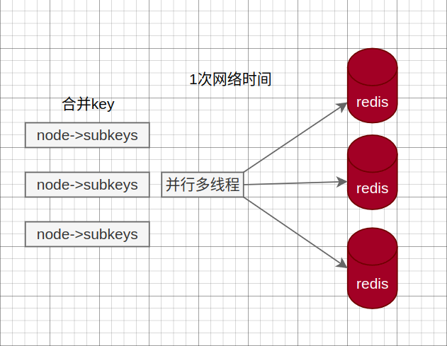

        - 4.hash_tag实现：cluster的hash_tag可以强制将多个key分配到1个node上

            - 操作时间 = 1次网络时间 + n次命令时间

            

### 缓存一致性问题

- [腾讯技术工程：认识 MySQL 和 Redis 的数据一致性问题](https://cloud.tencent.com/developer/article/1898550)

- [腾讯技术工程：万字图文讲透数据库缓存一致性问题](https://cloud.tencent.com/developer/article/2168718)

#### 最终一致性策略

- 缓存不一致性的问题无法在客观上完全消灭，因为我们无法保证数据库和缓存的操作是一个事务里的，而我们能做到的只是尽量缩短不一致的时间窗口。

- 结论：

    - 一般推荐使用 “更新数据库 + 删除缓存” 的方案。如果根据需要，热点数据较多，可以使用 “更新数据库 + 更新缓存” 策略。

    - “更新数据库 + 删除缓存” 中：优先使用先更新数据库，再删除缓存，原因主要有两个：

        - 先删除缓存值再更新数据库策略：
            - 1.有可能导致请求因缓存缺失而访问数据库，给数据库带来压力
            - 2.延迟双删中的 sleep 时间不好设置。

        - “更新数据库 + 更新缓存” 策略：在高并发情况下，有数据不一致问题

    - 包括Facebook的论文《Scaling Memcache at Facebook》也使用了这个策略。

- 只读缓存：只在缓存进行数据查找，即使用 “更新数据库+删除缓存” 策略

    - 无并发情况：有两步操作：更新数据库+删除缓存值

        - 单线程中步骤 1 和步骤 2 是串行执行的：
            - 可能存在“步骤 1 成功，步骤 2 失败” 的情况
            - 不太可能会发生 “步骤 2 成功，步骤 1 失败” 的情况

        | 执行顺序                 | 步骤1成功，步骤2失败的最后结果   | 是否存在一致性问题 |
        |--------------------------|----------------------------------|--------------------|
        | 先删除缓存，再更新数据库 | 请求无法命中缓存，读取数据库旧值 | 是                 |
        | 先更新数据库，再删除缓存 | 请求命中缓存，读取缓存旧值       | 是                 |

        - 1.先删除缓存，再更新数据库
        

        - 2.先更新数据库，再删除缓存
        

        - 解决方法：

            - 1.消息队列+异步重试：无论使用哪一种执行时序，可以在执行步骤 1 时，将步骤 2 的请求写入消息队列，当步骤 2 失败时，就可以使用重试策略，对失败操作进行 “补偿”。
            

                - 1.把要删除缓存值或者是要更新数据库值操作生成消息，暂存到消息队列中（例如使用 Kafka 消息队列）
                - 2.操作成功时：把这些消息从消息队列中去除（丢弃），以免重复操作
                    - 操作失败时：重试服务从消息队列中重新读取（消费）这些消息，然后再次进行删除或更新，重试超过的一定次数，向业务层发送报错信息。

            - 2.通过 Binlog 变更日志，使用MQ/Canal 或者 MQ+Canal 的策略来异步更新缓存：

                - Canal策略：即将负责更新缓存的服务伪装成一个 MySQL 的从节点，从 MySQL 接收 Binlog，解析 Binlog 之后，得到实时的数据变更信息，然后根据变更信息去更新/删除 Redis 缓存

                - MQ+Canal 策略：将 Canal Server 接收到的 Binlog 数据直接投递到 MQ 进行解耦，使用 MQ 异步消费 Binlog 日志，以此进行数据同步
                

    - 高并发情况（以上策略后，可以保证在单线程/无并发场景下的数据一致性。但是，在高并发场景下，由于数据库层面的读写并发，会引发的数据库与缓存数据不一致的问题）：

        - 1.先删除缓存，再更新数据库

            - 有可能导致请求因缓存缺失而访问数据库，给数据库带来压力，也就是缓存穿透的问题。针对缓存穿透问题，可以用缓存空结果、布隆过滤器进行解决。

            - 例子：现在缓存和数据库都是100，这时候需要对此计数减1，减成功后。那么数据库和缓存都是99才能满足数据一致性

            | 时间 | 线程 A | 线程 B                   | 问题            |
            |----|--------------|-------------------------------------|--------------------------|
            | T1 | 删除缓存     |                                     |                          |
            | T2 |              | 读取缓存，缓存丢失，从数据库读取100 | 线程B读取到旧值          |
            | T3 |              | 更新缓存100                         |                          |
            | T4 | 更新数据库99 |                                     | 缓存是100，数据库是99 |

            或者

            | 时间 | 线程 A | 线程 B                   | 问题            |
            |----|--------------|-------------------------------------|--------------------------|
            | T1 | 删除缓存     |                                     |                          |
            | T2 |              | 读取缓存，缓存丢失，从数据库读取100 | 线程B读取到旧值          |
            | T3 | 更新数据库99 |                                     |                          |
            | T4 |              | 更新缓存100                         | 缓存是旧值，数据库是新值 |

            - 解决方法：

                - 1.设置缓存过期时间：缓存过期后，读请求仍然可以从 DB 中读取最新数据并更新缓存，可减小数据不一致的影响范围。

                - 2.延时双删：在线程 A 更新完数据库值以后，让它先 sleep 一小段时间，确保线程 B 能够先从数据库读取数据，再把缺失的数据写入缓存，然后，线程 A 再进行删除。后续，其它线程读取数据时，发现缓存缺失，会从数据库中读取最新值。

                    - sleep 时间：在业务程序运行的时候，统计下线程读数据和写缓存的操作时间，以此为基础来进行估算：
                        - 可以使用延时队列进行替代代替sleep

                    ```
                    redis.delKey(X)
                    db.update(X)
                    Thread.sleep(N)
                    redis.delKey(X)
                    ```

                    | 时间 | 线程 A（写请求） | 线程 C（新的读请求）         | 线程 D（新的读请求）                     | 问题                               |
                    |------|------------------|------------------------------|------------------------------------------|------------------------------------|
                    | T5 | sleep(N)   | 缓存存在，读取到缓存旧值 100 |                                          | 其他线程可能在双删成功前读到脏数据 |
                    | T6 | 删除缓存值 |                              |                                          |
                    | T7 |            |                              | 缓存缺失，从数据库读取数据的最新值（99） |                                    |

        - 2.先更新数据库，再删除缓存

            | 时间 | 线程 A（写请求）                | 线程 B（读请求） | 线程 C（读请求） | 潜在问题 |
            |----|---------------------------------|---------------------------------------------|----------------------------------------|----------------------|
            | T1 | 更新主库 X = 99（原值 X = 100） |                                             |                                        |                      |
            | T2 |                                 |                                             | 读取缓存值100 | 线程 C 读取了旧值100 |
            | T3 | 删除缓存                        |                                             |
            | T4 |                                 | 查询缓存，缓存缺失，查询数据库得到当前值 99 |                                        |
            | T5 |                                 | 将 99 写入缓存                              |                                        |

            - 在更新数据库后删除缓存这个场景下，不一致窗口仅仅是 T2 到 T3 的时间，内网状态下通常不过 1ms

            - 但是真实场景下，还是会有一个情况存在不一致的可能性，这个场景是读线程发现缓存不存在，于是读写并发时，读线程回写进去老值：

                - 这个不一致场景出现条件非常严格，因为并发量很大时，缓存不太可能不存在；如果并发很大，而缓存真的不存在，那么很可能是这时的写场景很多，因为写场景会删除缓存。

                | 时间 | 线程 A（写请求）                | 线程 B（读请求--缓存不存在场景）             | 潜在问题        |
                |----|---------------------------------|----------------------------------------------|-------------------------|
                | T1 |                                 | 查询缓存，缓存缺失，查询数据库得到当前值 100 |                         |
                | T2 | 更新主库 X = 99（原值 X = 100） |                                              |                         |
                | T3 | 删除缓存                        |                                              |                         |
                | T4 |                                 | 将 100 写入缓存                              | 缓存值100，数据库值是99 |

            - “读写分离 + 主从库延迟”也会导致不一致：

                | 时间 | 线程 A（写请求）                | 线程 B（读请求）                          | MYSQL集群           | 潜在问题                        |
                |------|---------------------------------|-------------------------------------------|---------------------|---------------------------------|
                | T1   | 更新主库 X = 99（原值 X = 100） |                                           |                     |
                | T2   | 删除缓存                        |                                           |                     |
                | T3   |                                 | 查询缓存，缓存失效，读取从库，得到旧值100 |                     |
                | T4   |                                 | 更新缓存100                               |                     |
                | T5   |                                 |                                           | 从库完成同步X值为99 | 缓存值是旧值100，主从库为新值99 |

            - 解决方法：
                - 1.sleep或者发送「延迟消息」到队列中：延迟删除缓存，同时也要控制主从库延迟
                - 2.通过binlog，异步删除：canal将 binlog 日志采集发送到 MQ 中，然后通过 ACK 机制确认处理删除缓存。
                - 3.加锁（保证两步操作的“原子性”）：更新数据时，加写锁；查询数据时，加读锁
                

- 读写缓存：更新数据库+更新缓存

    - 同步直写：使用事务，保证缓存和数据更新的原子性，并进行失败重试（如果 Redis 本身出现故障，会降低服务的性能和可用性）

    - 异步回写：写缓存时不同步写数据库，等到数据从缓存中淘汰时，再写回数据库（没写回数据库前，缓存发生故障，会造成数据丢失） 该策略在秒杀场中有见到过，业务层直接对缓存中的秒杀商品库存信息进行操作，一段时间后再回写数据库。

    - 无并发情况：

        | 执行顺序                 | 步骤1成功，步骤2失败的最后结果 | 是否存在一致性问题 | 解决方法          |
        |--------------------------|--------------------------------|--------------------|-------------------|
        | 先更新缓存，再更新数据库 | 数据库为旧值               | 是 | 消息队列+重试机制 |
        | 先更新数据库，再更新缓存 | 请求命中缓存，读取缓存旧值 | 是 | 消息队列+重试机制 |

    - 高并发情况：

        | 策略                | 并发场景                                                                         | 潜在问题                                               | 应对方案 |
        |---------------------|----------------------------------------------------------------------------------|--------------------------------------------------------|----------|
        | 先更新数据库，再更新缓存 | 写+读 | 线程 A 未更新完缓存之前，线程 B 的读请求会短暂读到旧值                           | 可以忽略           |
        | 先更新缓存，再更新数据库 | 写+读 | 线程 A 未更新完数据库之前，线程 B 的读新值，只存在短暂的不一致                   | 可以忽略           |
        | 先更新数据库，再更新缓存 | 写+写 | 更新数据库的顺序是先 A 后 B，但更新缓存时顺序是先 B 后 A，数据库和缓存数据不一致 | 分布式锁（操作重） |
        | 先更新缓存，再更新数据库 | 写+写 | 更新缓存的顺序是先 A 后 B，但更新数据库时顺序是先 B 后 A，数据库和缓存数据不一致 | 分布式锁（操作重） |  |  | 分布式锁（操作重） |

        - 分布式锁：保证同一时间只有一个线程去更新数据库和缓存；没有拿到锁的线程把操作放入到队列中，延时处理。

            | 分布式锁策略       | 实现原理                                                                              |
            |--------------------|---------------------------------------------------------------------------------------|
            | 乐观锁             | 版本号，updatetime；只允许高版本覆盖低版本                                            |
            | redis的watch乐观锁 | key修改过，则回滚                                                                     |
            | setnx              | 获取锁：set/setnx；释放锁：del命令/lua脚本                                            |
            | redisson分布式锁   | 利用hash类型，将业务名称作为key，使用随机的uuid或线程id作为field，加锁的次数作为value；线程安全 |

#### 强一致性策略

- 上述策略只能保证数据的最终一致性。

- 强一致性，最常见的方案是 2PC、3PC、Paxos、Raft 这类一致性协议

    - 但它们的性能往往比较差，而且这些方案也比较复杂，还要考虑各种容错问题。如果业务层要求必须读取数据的强一致性，可以采取以下策略：

        - 1.暂存并发读请求：在更新数据库时，先在 Redis 缓存客户端暂存并发读请求，等数据库更新完、缓存值删除后，再读取数据，从而保证数据一致性。

        - 2.串行化：读写请求入队列，工作线程从队列中取任务来依次执行

            - 1.修改服务 Service 连接池：id 取模选取服务连接，能够保证同一个数据的读写都落在同一个后端服务上
            - 2.修改数据库 DB 连接池：id 取模选取 DB 连接，能够保证同一个数据的读写在数据库层面是串行的

        - 3.分布式读写锁：将淘汰缓存与更新库表放入同一把写锁中，与其它读请求互斥，防止其间产生旧数据。

### 如何减少缓存删除/更新的失败？

- 删除缓存这一步因为服务重启没有执行，或者 Redis 临时不可用导致删除缓存失败了，就会有一个较长的时间（缓存的剩余过期时间）是数据不一致的。

    - 把删除 Redis 的请求以消费 MQ 消息的手段去失效对应的 Key 值，如果 Redis 真的存在异常导致无法删除成功，我们依旧可以依靠 MQ 的重试机制来让最终 Redis 对应的 Key 失效。
        

        - 极端场景下，是否存在更新数据库后 MQ 消息没发送成功，或者没机会发送出去机器就重启的情况？

            - 1.如果 MQ 使用的是 RocketMQ，我们可以借助 RocketMQ 的事务消息，来让删除缓存的消息最终一定发送出去。

            - 2.如果使用的消息中间件并没有事务消息的特性：则可以采取消息表的方式让更新数据库和发送消息一起成功。

### 如何处理复杂的多缓存场景？

- 真实的缓存场景

    - 1.并不是数据库中的一个记录对应一个 Key 这么简单，有可能一个数据库记录的更新会牵扯到多个 Key 的更新。

    - 2.另外一个场景是，更新不同的数据库的记录时可能需要更新同一个 Key 值，这常见于一些 App 首页数据的缓存。

- 以一个数据库记录对应多个 Key 的场景来举例：缓存了一个粉丝的主页信息、主播打赏榜 TOP10 的粉丝、单日 TOP 100 的粉丝等多个信息。如果这个粉丝注销了，或者这个粉丝触发了打赏的行为，上面多个 Key 可能都需要更新。

    ```
    updateMySQL();//更新数据库一条记录
    deleteRedisKey1();//失效主页信息的缓存
    updateRedisKey2();//更新打赏榜TOP10
    deleteRedisKey3();//更新单日打赏榜TOP100
    ```

    - 涉及多个 Redis 的操作，每一步都可能失败，影响到后面的更新。

        - 甚至从系统设计上，更新数据库可能是单独的一个服务，而这几个不同的 Key 的缓存维护却在不同的 3 个微服务中

        - 最可怕的是，操作更新记录的地方很大概率不只在一个业务逻辑中，而是散发在系统各个零散的位置。

    - 解决方法：更新缓存的操作以 MQ 消息的方式发送出去，由不同的系统或者专门的一个系统进行订阅，而做聚合的操作。

        - 不同业务系统订阅 MQ 消息单独维护各自的缓存 Key
        

        - 专门更新缓存的服务订阅 MQ 消息维护所有相关 Key 的缓存操作
        

### 缓存策略设计

- 系统并不是将所有数据都需要存放到缓存中的，而只是将其中一部分热点数据缓存起来，所以我们要设计一个热点数据动态缓存的策略。

- 热点数据动态缓存的策略总体思路：通过数据最新访问时间来做排名，并过滤掉不常访问的数据，只留下经常访问的数据。

    - 例子：电商平台场景，现在要求只缓存用户经常访问的 Top 1000 的商品

        - 先通过缓存系统做一个排序队列（比如存放 1000 个商品），系统会根据商品的访问时间，更新队列信息，越是最近访问的商品排名越靠前

        - 同时系统会定期过滤掉队列中排名最后的 200 个商品，然后再从数据库中随机读取出 200 个商品加入队列中

        - 这样当请求每次到达的时候，会先从队列中获取商品 ID，如果命中，就根据 ID 再从另一个缓存数据结构中读取实际的商品信息，并返回。

        - 在 Redis 中可以用 zadd 方法和 zrange 方法来完成排序队列和获取 200 个商品的操作。

- 缓存更新策略

    - 1.Cache Aside（旁路缓存）策略

        - 写策略的步骤：先更新数据库中的数据，再删除缓存中的数据。
        - 读策略的步骤：
            - 如果读取的数据命中了缓存，则直接返回数据
            - 如果读取的数据没有命中缓存，则从数据库中读取数据，然后将数据写入到缓存，并且返回给用户。

        


        - 实际开发中，Redis 和 MySQL 的更新策略用的是 Cache Aside，另外两种策略应用不了。

        - Cache Aside 策略适合读多写少的场景，不适合写多的场景

            - 因为当写入比较频繁时，缓存中的数据会被频繁地清理，这样会对缓存的命中率有一些影响。

            - 如果业务对缓存命中率有严格的要求：两种解决方案
                - 1.在更新数据时也更新缓存，只是在更新缓存前先加一个分布式锁，因为这样在同一时间只允许一个线程更新缓存，就不会产生并发问题了。当然这么做对于写入的性能会有一些影响；
                - 2.在更新数据时更新缓存，只是给缓存加一个较短的过期时间，这样即使出现缓存不一致的情况，缓存的数据也会很快过期，对业务的影响也是可以接受。

    - 2.Read/Write Through（读穿 / 写穿）策略

        - Read Through 策略：先查询缓存中数据是否存在，如果存在则直接返回，如果不存在，则由缓存组件负责从数据库查询数据，并将结果写入到缓存组件，最后缓存组件将数据返回给应用。

        - Write Through 策略：当有数据更新的时候，先查询要写入的数据在缓存中是否已经存在：

            - 如果缓存中数据已经存在，则更新缓存中的数据，并且由缓存组件同步更新到数据库中，然后缓存组件告知应用程序更新完成。

            - 如果缓存中数据不存在，直接更新数据库，然后返回；

            

        - 特点是由缓存节点而非应用程序来和数据库打交道

            - 在我们开发过程中相比 Cache Aside 策略要少见一些，原因是我们经常使用的分布式缓存组件，无论是 Memcached 还是 Redis 都不提供写入数据库和自动加载数据库中的数据的功能。

            - 在使用本地缓存的时候可以考虑使用这种策略

    - 3.Write Back（写回）策略

        - 在更新数据的时候，只更新缓存，同时将缓存数据设置为脏的，然后立马返回，并不会更新数据库。
            - 对于数据库的更新，会通过批量异步更新的方式进行。

        - 问题：数据不是强一致性的，而且会有数据丢失的风险，因为缓存一般使用内存，而内存是非持久化的，所以一旦缓存机器掉电，就会造成原本缓存中的脏数据丢失。所以你会发现系统在掉电之后，之前写入的文件会有部分丢失，就是因为 Page Cache 还没有来得及刷盘造成的。

        - 实际上，Write Back（写回）策略也不能应用到我们常用的数据库和缓存的场景中，因为 Redis 并没有异步更新数据库的功能。

        

## redis正确使用

- [阿里官方 Redis 开发规范](https://developer.aliyun.com/article/1009125)
    > 作者是《redis开发与运维》的付磊

### 命令使用

- 1.【推荐】 O(N)命令关注N的数量：例如hgetall、lrange、smembers、zrange、sinter等并非不能使用，但是需要明确N的值。有遍历的需求可以使用hscan、sscan、zscan代替。

- 2.【推荐】：禁用命令：禁止线上使用keys、flushall、flushdb等，通过redis的rename机制禁掉命令，或者使用scan的方式渐进式处理。

- 3.【推荐】合理使用select：redis的多数据库较弱，使用数字进行区分，很多客户端支持较差，同时多业务用多数据库实际还是单线程处理，会有干扰。

- 4.【推荐】使用批量操作提高效率

    - 原生命令：例如mget、mset。
    - 非原生命令：可以使用pipeline提高效率。
        - 但要注意控制一次批量操作的元素个数 (例如500以内，实际也和元素字节数有关)。

    - 注意两者不同：
        - 1.原生是原子操作，pipeline是非原子操作。
        - 2.pipeline可以打包不同的命令，原生做不到
        - 3.pipeline需要客户端和服务端同时支持。

- 5.【建议】Redis事务功能较弱，不建议过多使用
    - Redis的事务功能较弱(不支持回滚)，而且集群版本(自研和官方)要求一次事务操作的key必须在一个slot上(可以使用hashtag功能解决)

- 6.【建议】Redis集群版本在使用Lua上有特殊要求：
    - 1.所有key都应该由 KEYS 数组来传递，redis.call/pcall 里面调用的redis命令，key的位置，必须是KEYS array, 否则直接返回error，"-ERR bad lua script for redis cluster, all the keys that the script uses should be passed using the KEYS array"
    - 2.所有key，必须在1个slot上，否则直接返回error, "-ERR eval/evalsha command keys must in same slot"

- 7.【建议】必要情况下使用monitor命令时，要注意不要长时间使用。

### 客户端使用

- 1.【推荐】避免多个应用使用一个Redis实例

    - 不相干的业务拆分，公共数据做服务化。

- 2.【推荐】使用带有连接池的数据库，可以有效控制连接，同时提高效率，标准使用方式：
    ```java
    Jedis jedis = null;
    try {
        jedis = jedisPool.getResource();
        //具体的命令
        jedis.executeCommand()
    } catch (Exception e) {
        logger.error("op key {} error: " + e.getMessage(), key, e);
    } finally {
        //注意这里不是关闭连接，在JedisPool模式下，Jedis会被归还给资源池。
        if (jedis != null)
            jedis.close();
    }
    ```

- 3.【建议】高并发下建议客户端添加熔断功能(例如netflix hystrix)
- 4.【推荐】设置合理的密码，如有必要可以使用SSL加密访问（阿里云Redis支持）

### 键值设计

- key名设计

    - 1.【建议】：可读性和可管理性。以业务名(或数据库名)为前缀(防止key冲突)，用冒号分隔，比如业务名:表名:id

        ```
        ugc:video:1
        ```

    - 2【建议】：简洁性。保证语义的前提下，控制key的长度，当key较多时，内存占用也不容忽视
        ```
        user:{uid}:friends:messages:{mid}
        ```
        简化为
        ```
        u:{uid}:fr:m:{mid}
        ```

    - 3.【强制】：不要包含特殊字符（空格、换行、单双引号以及其他转义字符）

- value设计

    - 1.【强制】：拒绝bigkey(防止网卡流量、慢查询)
        - string类型控制在10KB以内，hash、list、set、zset元素个数不要超过5000。
        - 非字符串的bigkey，不要使用del删除，使用hscan、sscan、zscan方式渐进式删除，同时要注意防止bigkey过期时间自动删除问题(例如一个200万的zset设置1小时过期，会触发del操作，造成阻塞，而且该操作不会不出现在慢查询中(latency可查))，查找方法和删除方法

    - 2.【推荐】：选择适合的数据类型。
        - 例如：实体类型(要合理控制和使用数据结构内存编码优化配置,例如ziplist，但也要注意节省内存和性能之间的平衡)
        - 反例：
            ```
            set user:1:name tom
            set user:1:age 19
            set user:1:favor football
            ```

#### 登录系统。用户表

- 关系型数据库的设计

    | filed           | 内容                 |
    |-----------------|----------------------|
    | user_id         | 表的主键             |
    | name            | 表示用户名           |
    | login_times     | 表示该用户的登录次数 |
    | login_times     | 每次用户登录后会自增 |
    | last_login_time | 更新为当前时间       |

    ```sql
    mysql> select * from login;
    +---------+----------------+-------------+---------------------+
    | user_id | name           | login_times | last_login_time     |
    +---------+----------------+-------------+---------------------+
    | 1 | ken thompson   | 5 | 2011-01-01 00:00:00 |
    | 2 | dennis ritchie | 1 | 2011-02-01 00:00:00 |
    | 3 | Joe Armstrong  | 2 | 2011-03-01 00:00:00 |
    +---------+----------------+-------------+---------------------+
    ```

- 关系型数据转化redis设计

    - 一般使用冒号做分割符，这是不成文的规矩。比如在php-admin for redis系统里，就是默认以冒号分割，于是user:1 user:2等key会分成一组。

    - key（表名:主键值:列名） value（列值）

        ```redis
        Set login:1:login_times 5
        Set login:2:login_times 1
        Set login:3:login_times 2

        Set login:1:last_login_time 2011-1-1
        Set login:2:last_login_time 2011-2-1
        Set login:3:last_login_time 2011-3-1

        set login:1:name ”ken thompson“
        set login:2:name “dennis ritchie”
        set login:3:name ”Joe Armstrong“
        ```

    - 在已知主键的情况下，通过get、set就可以获得或者修改用户的登录次数和最后登录时间和姓名

    - 一般用户是无法知道自己的id的，只知道自己的用户名，所以还必须有一个从name到id的映射关系
        ```redis
        set "login:ken thompson:id"      1
        set "login:dennis ritchie:id"    2
        set "login: Joe Armstrong:id"    3
        ```

    - 这样每次用户登录的时候业务逻辑如下(python版)，r是redis对象，name是已经获知的用户名。
        ```py
        # 获得用户的id
        uid = r.get("login:%s:id" % name)

        # 自增用户的登录次数
        ret = r.incr("login:%s:login_times" % uid)

        # 更新该用户的最后登录时间
        ret = r.set("login:%s:last_login_time" % uid, datetime.datetime.now())
        ```

    - 问题：关系型数据库的数据存储的的不灵活是问题的源头，数据仅有一种储存方法，那就是按行排列的堆表。
        - 统一的数据结构意味着你必须使用索引来改变sql的访问路径来快速访问某个列的，而访问路径的增加又意味着你必须使用统计信息来辅助，于是一大堆的问题就出现了。

        - 假设有如下需求，查找最近登录的N个用户。开发人员看看，还是比较简单的，一个sql搞定。
            ```sql
            select * from login order by last_login_time desc limit N
            ```

            - DBA了解需求后，考虑到以后表如果比较大，所以在last_login_time上建个索引。执行计划从索引leafblock 的最右边开始访问N条记录，再回表N次，效果很好。

        - 过了两天，又来一个需求，需要知道登录次数最多的人是谁。同样的关系型如何处理？DEV说简单
            ```sql
            select * from login order by login_times desc limit N
            ```

            - DBA一看，又要在login_time上建立一个索引。有没有觉得有点问题呢，表上每个字段上都有素引。

    - 没有索引，没有统计计划，没有执行计划，这就是kv数据库。

        - DEV需要添加2行代码，而DBA不需要考虑索引什么的。

        - redis里如何满足以上的需求呢？ 对于求最新的N条数据的需求，链表的后进后出的特点非常适合。

        - 我们在上面的登录代码之后添加一段代码，维护一个登录的链表，控制他的长度，使得里面永远保存的是最近的N个登录用户。
            ```py
            # 把当前登录人添加到链表里
            ret = r.lpush("login:last_login_times", uid)
            # 保持链表只有N位
            ret = redis.ltrim("login:last_login_times", 0, N-1)
            ```

        - 获得最新登录人的id，如下的代码即可
            ```py
            last_login_list = r.lrange("login:last_login_times", 0, N-1)
            ```

        - 另外，求登录次数最多的人，对于排序，积分榜这类需求，sorted set非常的适合，我们把用户和登录次数统一存储在一个sorted set里。
            ```py
            zadd login:login_times 5 1
            zadd login:login_times 1 2
            zadd login:login_times 2 3
            ```

        - 这样假如某个用户登录，额外维护一个sorted set，代码如此
            ```py
            # 对该用户的登录次数自增1
            ret = r.zincrby("login:login_times", 1, uid)
            ```

        - 那么如何获得登录次数最多的用户呢，逆序排列取的排名第N的用户即可
            ```py
            ret = r.zrevrange("login:login_times", 0, N-1)
            ```
#### tag系统。book表

- tag在互联网应用里尤其多见，如果以传统的关系型数据库来设计有点不伦不类。

- 关系型数据库的设计

    - 两张表
        - 一张book的明细
        - 一张tag表，表示每本的tag，一本书存在多个tag。

        ```sql
        mysql> select * from book;
        +------+-------------------------------+----------------+
        | id   | name                          | author         |
        +------+-------------------------------+----------------+
        |    1 | The Ruby Programming Language | Mark Pilgrim   |
        |    1 | Ruby on rail                  | David Flanagan |
        |    1 | Programming Erlang            | Joe Armstrong  |
        +------+-------------------------------+----------------+

        mysql> select * from tag;
        +---------+---------+
        | tagname | book_id |
        +---------+---------+
        | ruby    |       1 |
        | ruby    |       2 |
        | web     |       2 |
        | erlang  |       3 |
        +---------+---------+
        ```

    - 假如有如此需求，查找即是ruby又是web方面的书籍，如果以关系型数据库会怎么处理？
        ```sql
        select b.name, b.author  from tag t1, tag t2, book b
            where t1.tagname = \'web\' and t2.tagname = \'ruby\' and t1.book_id = t2.book_id and b.
        ```

        - tag表自关联2次再与book关联，这个sql还是比较复杂的，如果要求即ruby，但不是web方面的书籍呢？

        - 关系型数据其实并不太适合这些集合操作。

- redis的设计

    - 首先book的数据肯定要存储的，和上面一样。
        ```redis
        Set book:1:name    ”The Ruby Programming Language”
        Set book:2:name    ”Ruby on rail”
        Set book:3:name    ”Programming Erlang”

        Set book:1:author    ”Mark Pilgrim”
        Set book:2:author    ”David Flanagan”
        Set book:3:author    ”Joe Armstrong”
        ```

    - tag表我们使用集合来存储数据，因为集合擅长求交集、并集
        ```redis
        sadd tag:ruby 1
        sadd tag:ruby 2
        sadd tag:web 2
        sadd tag:erlang 3
        ```

    - 查找属于ruby又属于web的书？
        ```redis
        inter_list = redis.sinter("tag.web", "tag:ruby")
        ```
    - 即属于ruby，但不属于web的书？
        ```redis
        inter_list = redis.sdiff("tag.ruby", "tag:web")
        ```

    - 属于ruby和属于web的书的合集？
        ```redis
        inter_list = redis.sunion("tag.ruby", "tag:web")
        ```

# k8s

- [字节跳动技术团队：火山引擎 Redis 云原生实践]()

# redis 安装

## centos7 安装 redis6.0.9

- 源码安装:

    ```sh
    # 安装依赖
    yum install gcc make -y

    # 官网下载
    curl -LO https://download.redis.io/releases/redis-6.0.9.tar.gz

    # 国内用户可以去华为云镜像下载 https://mirrors.huaweicloud.com/redis/
    curl -LO https://mirrors.huaweicloud.com/redis/redis-6.0.9.tar.gz
    tar xzf redis-6.0.9.tar.gz
    cd redis-6.0.9
    make
    ```

- 使用 `yum` 包管理器安装:

    ```sh
    # epel源可以直接安装(版本为redis-3.2.12-2.el7)
    yum install redis -y
    ```

- 在centos上新安装的redis。需要做2步准备工作，才能远程连接redis

    - 1.redis配置文件`/etc/redis.conf`：需要设置`bind *`不然只允许本机访问

        ```
        bind *
        ```

    - 2.防火墙需要开启6379端口

        ```sh
        # 查看redis的端口6379是否开启。no表示没有开启
        firewall-cmd --query-port=6379/tcp

        # 开启端口。如果需要将规则保存至zone配置文件中，重启后也会自动加载，需要加入参数--permanent
        firewall-cmd --add-port=6379/tcp --permanent

        # 添加规则后需要重启防火墙
        firewall-cmd --reload
        ```

## [docker install](https://www.runoob.com/docker/docker-install-redis.html)

```sh
# 下载镜像
docker pull redis

# 查看本地镜像
docker images

# -p端口映射
docker run -itd --name redis-tz -p 6379:6379 redis

# 查看运行镜像
docker ps

# 进入docker
docker exec -it redis-tz /bin/bash

docker container stop redis-tz

docker run -d -p 6379:6379 -v $PWD/conf/redis.conf:/usr/local/etc/redis/redis.conf -v $PWD/data:/data --name docker-redis docker.io/redis redis-server /usr/local/etc/redis/redis.conf --appendonly yes
```

# 其他版本的redis

## 各大厂商的cluster（集群）方案

- [数据库技术大会：BAT 等 IT 大厂们都在用什么 Redis 集群方案?]()

- redis 集群方案主要有两类
    - 1.使用类 codis 的架构，按组划分，实例之间互相独立
    - 2.基于官方的 redis cluster 的方案

- codis

    - slots 方案：划分了 1024 个 slot， slots 信息在 proxy 层感知
        - redis 进程中维护本实例上的所有 key 的一个 slot map;

    - 迁移过程中的读写冲突处理：最小迁移单位为 key
        - 访问逻辑都是先访问 src 节点，再根据结果判断是否需要进一步访问 target 节点;
        - 访问的 key 还未被迁移：读写请求访问 src 节点，处理后访问
        - 访问的 key 正在迁移：读请求访问 src 节点后直接返回; 写请求无法处理，返回 retry
        - 访问的 key 已被迁移 (或不存在)：读写请求访问 src 节点，收到 moved 回复，继续访问 target 节点处理

### proxy代理层

- proxy代理层（类 codis 架构）
    
    - 分片算法：基于 slot hash 桶;
    - 分片实例之间相互独立，每组 一个 master 实例和多个 slave;
    - 路由信息存放到第三方存储组件，如 zookeeper 或 etcd
    - 旁路组件探活
    - 使用这套方案的公司：阿里云： ApsaraCache, RedisLabs、京东、百度等

- 阿里云：AparaCache

- 百度 BDRP 2.0
    - proxy基于 twemproxy 改造，实现了动态路由表
    - redis 内核：基于 2.x 实现的 slots 方案
    - metaserver：基于 redis 实现，包含的功能：拓扑信息的存储 & 探活; 最多支持 1000 个节点;
    - slot 方案：redis 内核中对 db 划分，做了 16384 个 db; 每个请求到来，首先做 db 选择
    - 数据迁移实现：数据迁移的时候，最小迁移单位是 slot，迁移中整个 slot 处于阻塞状态，只支持读请求，不支持写请求
        - 对比官方 redis cluster/ codis 的按 key 粒度进行迁移的方案：按 key 迁移对用户请求更为友好，但迁移速度较慢; 这个按 slot 进行迁移的方案速度更快

- 京东

    - proxy自主实现，基于 golang 开发
    - redis 内核：基于 redis 2.8configServer(cfs) 组件：配置信息存放
    - scala 组件：用于触发部署、新建、扩容等请求
    - mysql：最终所有的元信息及配置的存储
    - sentinal(golang 实现)：哨兵，用于监控 proxy 和 redis 实例，redis 实例失败后触发切换
    - slot 方案实现：在内存中维护了 slots 的 map 映射表
    - 数据迁移：基于 slots 粒度进行迁移
        - scala 组件向 dst 实例发送命令告知会接受某个 slot
        - dst 向 src 发送命令请求迁移，src 开启一个线程来做数据的 dump，将这个 slot 的数据整块 dump 发送到 dst(未加锁，只读操作) 写请求会开辟一块缓冲区，所有的写请求除了写原有数据区域，同时双写到缓冲区中。
        - 当一个 slot 迁移完成后，把这个缓冲区的数据都传到 dst，当缓冲区为空时，更改本分片 slot 规则，不再拥有该 slot，后续再请求这个 slot 的 key 返回 moved
        - 上层 proxy 会保存两份路由表，当该 slot 请求目标实例得到 move 结果后，更新拓扑
    - 跨机房：跨机房使用主从部署结构; 没有多活，异地机房作为 slave

### 基于官方 redis cluster 的方案

- 基于官方 redis cluster 的方案

    

    - 和上一套方案比，所有功能都集成在 redis cluster 中，路由分片、拓扑信息的存储、探活都在 redis cluster 中实现

    - 各实例间通过 gossip 通信
        - 优点：简单，依赖的组件少，应对 400 个节点以内的场景没有问题 (按单实例 8w read qps 来计算，能够支持 200 * 8 = 1600w 的读多写少的场景)
        - 缺点：但当需要支持更大的规模时，由于使用 gossip 协议导致协议之间的通信消耗太大，redis cluster 不再合适;

- 官方 redis cluster
    - 数据迁移过程：基于 key 粒度的数据迁移
    - 迁移过程的读写冲突处理：从 A 迁移到 B
        - 访问的 key 所属 slot 不在节点 A 上时，返回 MOVED 转向，client 再次请求 B
        - 访问的 key 所属 slot 在节点 A 上，但 key 不在 A 上， 返回 ASK 转向，client 再次请求 B
        - 访问的 key 所属 slot 在 A 上，且 key 在 A 上，直接处理;(同步迁移场景：该 key 正在迁移，则阻塞)

- AWS ElasticCache
    - ElasticCache 支持主从和集群版、支持读写分离; 集群版用的是开源的 Redis Cluster，未做深度定制

- 百度贴吧的 ksarch-saas
    - 基于 redis cluster + twemproxy 实现
    - 后被 BDRP 吞并
    - twemproxy 实现了 smart client 功能
    - 使用 redis cluster 后还加一层 proxy 的好处：
        - 对 client 友好，不需要 client 都升级为 smart client;(否则，所有语言 client 都需要支持一遍)
        - 可以做更多平台策略：比如在 proxy 可做 大 key、热 key 的监控、慢查询的请求监控、以及接入控制、请求过滤等

## Redis Enterprise

- 提供了一个管理层，允许我们的用户大规模运行Redis，并默认启用高可用性、即时故障切换、数据持久性和备份。

## 实现方案对比

- 从存储设计来看可以分为几类:

    - 1.基于磁盘 KV 存储引擎(比如 RocksDB/LevelDB) 实现 Redis 协议

        - 绝大多数的本地磁盘 KV 只提供最简单的 Get/Set/Delete 方法，对于 Hash/Set/ZSet/List/Bitmap 等数据结构需要基于磁盘 KV 之上去实现。优点是可以规避下面方案 2 里提到的大 Key 问题，缺点是实现工作量大一些。

    - 2.基于 Redis 存储之上将冷数据交换到磁盘(类似早期 Redis VM 的方案)

        - 基于 Redis 把冷数据交换磁盘是以 Key 作为最小单元，在大 Key 的场景下会有比较大的挑战。交换大 Key 到磁盘会有严重读写放大，如果是读可能会导致整个服务不可用，所以这种实现只能限制 Value 大小，优点在于实现简单且可按照 Key 维度来做冷热数据分离。

    - 3.基于分布式 KV(比如 TiKV) 实现 Redis 协议代理，本地不做存储

        - 最大的区别在于所以的操作都是通过网络。这种实现方式最大优点是只需要实现 Redis 协议的部分，服务本身是无状态的，无须考虑数据复制以及扩展性的问题。缺点也比较明显，因为所有的命令都是通过网络 IO，对于非 String 类型的读写一般都是需要多次网络 IO 且需要通过事务来保证原子，从而在延时和性能上都会比方案 1 和 2 差不少。

    

## [Kvrocks](https://github.com/KvrocksLabs/kvrocks)

- [高可用架构：Kvrocks: 一款开源的企业级磁盘KV存储服务]()


- Kvrocks 是基于 RocksDB 之上兼容 Redis 协议的 NoSQL 存储服务
    - 兼容 Redis 协议
        - [支持的redis命令](https://github.com/KvrocksLabs/kvrocks/blob/unstable/docs/support-commands.md)
    - 支持主从复制
    - 支持通过 Namespace 隔离不同业务的数据
    - 高可用，支持 Redis Sentinel 自动主从切换
    - 集群模式

- 大部分命令由于可多线程并行执行，从 QPS 的维度来看会比 Redis 更好一些，但延时肯定会比 Redis 略差。

    

    - Kvrocks 主要有两类线程:
        - 1.Worker 线程：主要负责收发请求，解析 Redis 协议以及请求转为 RocksDB 的读写
        - 2.后台线程：目前包含一下几种后台线程
            - Cron 线程，负责定期任务，比如自动根据写入 KV 大小调整 Block Size、清理 Backup 等
            - Compaction Checker 线程，如果开启了增量 Compaction 检查机制，那么会定时检查需要 Compaction 的 SST 文件
            - Task Runner 线程，负责异步的任务执行，比如后台全量 Compaction，Key/Value 数量扫描
            - 主从复制线程，每个 slave 都会对应一个线程用来做增量同步

- Kvrocks 会将 Redis 数据类型编码成 Key-Value 数据写入 RocksDB 的不同 Column Family

    - Metadata CF：主要存储 String 类型的数据，以及 Hash/Set/List 这些复杂类型的元数据 (长度，过期时间等)，不存储具体元素内容
    - Subkey CF：存储复杂类型元素内容
    - ZSetScore CF：存储 ZSet Score 信息
    - Pub/Sub CF：Pub/Sub 相关信息
    - Propagated CF: 作为主从同步和存放数据之外的内容，比如  Lua 脚本

- 以Hash 为例来说明 Kvrocks 是如何将复杂的数据结构转为 RocksDB 对应的 KV

    - [更多的数据结构设计](https://github.com/KvrocksLabs/kvrocks/blob/unstable/docs/metadata-design.md)

    - 最简单的方式是将 Hash 所有的字段进行序列化之后写到同一个 Key 里面，每次修改都需要将整个 Value 读出来之后修改再写入
        - 当 Value 比较大时会导致严重的读写方法问题。

    - blackwidow 的实现：把 Hash 拆分成 Metadata 和 Subkey 两个部分

        - Hash 里面的每个字段都是独立的 KV，再使用 Metadata 来找到这些 Subkey:

        - Metadata
            - flags ：来标识当前 Value 的类型，比如是 Hash/Set/List 等。
            - expire ：是 Key 的过期时间，size 是这个 Key 包含的字段数量，这两个比较好理解。
            - version ：是在 Key 创建时自动生成的单调递增的 id，每个 Subkey 前缀会关联上 version。
                - 当 metadata 本删除时，这个 version 就无法被找到，也意味着关联这个 version 的全部 subkey 也无法找到，从而实现快速删除，而这些无法找到的 subkey 会在后台 compact 的时候进行回收。

        ```
                +----------+------------+-----------+-----------+
        key =>  |  flags   |  expire    |  version  |  size     |
                | (1byte)  | (4byte)    |  (8byte)  | (8byte)   |
                +----------+------------+-----------+-----------+
                                    (hash metadata)

                             +---------------+
        key|version|field => |     value     |
                             +---------------+
                      (hash subkey)
        ```

        ```
        HSET key, field, value:
          // 先根据 hash key 找到对应的 metadata 并判断是否过期
          // 如果不存在或者过期则创建一个新的 metadata
          metadata = rocksdb.Get(key)
          if metadata == nil || metadata.Expired() {
             metadata = createNewMetadata();
          }
          // 根据 metadata 里面的版本组成 subkey
          subkey = key + metadata.version+field
            if rocksdb.Get(subkey) == nil {
             metadata.size += 1
          }
          // 写入 subkey 以及更新 metadata
            rocksdb.Set(subkey, value)
          rocksdb.Set(key, metadata)
        ```

- 如何进行数据复制?

    - 采用了类似 Redis 的主从异步复制模型。考虑到需要应对更多的业务场景，后续会支持半同步复制模型。

    - 全量复制利用 RocksDB 的 CheckPoint 特性
    - 增量复制采用直接发送 WAL 的方式，从库接收到WAL直接操作后端引擎，相比于 Binlog 复制方式（回放从客户端接收到的命令），省去了命令解析和处理的开销，复制速度大幅提升，这样也就解决了其它采用 Binlog 复制方式的存储服务所存在的复制延迟问题。

- 如何实现分布式集群？

    - Kvrocks 集群方案选择了类似 Codis 中心化的架构，集群元数据存储在配置中心，但不依赖代理层，配置中心为存储节点推送元数据，对外提供 Redis Cluster 集群协议支持，对于使用 Redis Cluster SDK 或者 Proxy 的用户不需要做任何修改。同时也可以避免类似Redis Cluster 受限于 Gossip 通信的开销而导致集群规模不能太大的问题。

    - 单机版的 Kvrocks 和 Redis 一样可以直接支持 Twmeproxy，通过Sentinel实现高可用，对于 Codis 通过简单的适配也能够比较快的支持。

- 如何实现弹性伸缩的？

    - 整个扩缩容拆分为迁移全量数据、迁移增量数据、变更拓扑三个阶段。

        - 迁移全量数据利用 RocksDB的 Snapshot 特性，生成 Snapshot 迭代数据发送到目标节点。同时，为了加快迭代效率数据编码上Key 增加 SlotID 前缀。
        - 迁移增量数据阶段直接发送 WAL。当待迁移的增量 WAL 小于设定的阈值则开始阻写，等发送完剩余的 WAL 切换拓扑之后解除阻写，这个过程通常是毫秒级的。

- 最常见的问题是磁盘的吞吐和延时带来的毛刺点问题。除了通过慢日志命令来确认是否有慢请求产生之外，还提供了 perflog 命令用来定位 RocksDB 访问慢的问题
    ```
    # 第一条命令设定只对 SET 命令收集 profiling 日志
    # 第二条命令设定随机采样的比例
    # 第三条命令设定超过多长时间的命令才写到 perf 日志里面(如果是为了验证功能可以设置为 0)
    127.0.0.1:6666> config set profiling-sample-commands set
    OK
    127.0.0.1:6666> config set profiling-sample-ratio 100
    OK
    127.0.0.1:6666> config set profiling-sample-record-threshold-ms 1
    OK

    # 执行 Set 命令，在去看 perflog 命令就可以看到对应的耗时点
    127.0.0.1:6666> set a 1
    OK
    127.0.0.1:6666> perflog get 2
    1) 1) (integer) 1
       2) (integer) 1623123739
       3) "set"
       4) (integer) 411
       5) "user_key_comparison_count = 7, write_wal_time = 122300, write_pre_and_post_process_time = 91867, write_memtable_time = 47349, write_scheduling_flushes_compactions_time = 13028"
       6) "thread_pool_id = 4, bytes_written = 45, write_nanos = 46030, prepare_write_nanos = 21605"
    ```

    - 之前通过这种方式发现了一些 RocksDB 参数配置不合理的问题，比如之前 SST 文件大小默认是 256MiB，当业务的 KV 比较小的时候可能会导致一个 SST 文件里面可能有百万级别的 KV，从而导致 index 数据块过大(几十 MiB)，每次从磁盘读取数据需要耗费几十 ms。
    - 但线上不同业务的 KV 大小可能会差异比较大，通过 DBA 手动调整的方式肯定不合理，所以有了根据写入 KV 大小在线自动调整 SST 和 Block Size 的功能

    - 另外一个就是 RocksDB 的全量 Compact 导致磁盘 IO 从而造成业务访问的毛刺点问题，之前策略是每天凌晨低峰时段进行一次，过于频繁会导致访问毛刺点，频率过低会导致磁盘空间回收不及时。所以增加另外一种部分 Compact 策略，优先对那些比较老以及无效 KV 比较多的 SST进行 Compact。开启只需要在配置文件里面增加一行，那么则会在凌晨 0 到 7 点之间去检查这些 SST 文件并做 Compact

        ```
        compaction-checker-range 0-7
        ```

## 阿里云的[Tair](https://github.com/alibaba/tair)

- [官方运维开发手册：云原生内存数据库Tair](https://help.aliyun.com/zh/tair/?spm=a2c4g.11186623.0.0.11a65b8143bl18)

- [阿里云开发者：Tair 对 Redis 引擎架构之争的看法](https://baijiahao.baidu.com/s?id=1749098207556513462&wfr=spider&for=pc)

    - Tair 把 Redis 的 AOF 数据彻底的 Binlog 化

        > 现代存储服务的一个核心设计就是 Binlog，很多特性都是围绕着 Binlog 展开的

        - 做到了 Binlog Based Replication 的同步，实现了同步和持久化的链路统一，解决了 Redis 基于内存的同步带来的大流量下主从重连容易触发全量以及存量数据同步过程中内存 buffer 写满导致主从再次断开等问题。

        - Tair 在网络条件良好的情况下，会自动从磁盘同步切换到内存同步以获得更好的同步时延。

        - 围绕 Binlog 也实现了跨域同步、CDC（Change Data Capture）等外部的 Binlog 消费和通知服务。

    - Tair使用多线程

        - Redis 的单线程模式使得用户的请求处理和主备同步的数据发送都是同一个线程，当用户的请求占据了太多 CPU 算力的时候，新的主备全量同步自然受到了很大影响。这本质上还是个 CPU 算力的问题。

            - Tair 的解法是把同步的逻辑拆到单独的线程去做，每个从节点采用独立的线程做主从同步相关的工作。

            - 这样Tair的从节点可以很轻松的以星型的方式和主节点进行挂载，数据一致性得到了很好的保障。特别的，以为主节点本身是多线程的设计，可以直接扩容主节点的线程数来实现，而不是增加更多的只读从节点。

                - 单节点扩展处理线程比扩展更多的只读节点无论在数据一致性上还是运维的复杂度上都是更优的选择。

                - 读者著：tair走的是垂直拓展；redis走的是水平拓展

        - 单线程的问题，其实这是存储服务控制流和数据流没有分开的问题

            - 存储服务要接入管控机制，必然要预留特权账号给管控组件使用。比如对用户账号施加的白名单、限流、敏感命令拦截等逻辑必须对管控账号提供另外的一组限制规则，但是在开源产品里，这类设计往往比较欠缺。

            - Tair 在设计上直接把控制流和数据流做了隔离和拆分，无论是从代码逻辑上，还是资源预留上彻底分为了控制平面和数据平面。

                - 控制平面：有单独的网络和请求处理线程，单独的账号权限控制，可以绑定到另外的网卡以及端口上。

        - Tair 的过期数据扫描也有独立的线程来执行，这个线程以每秒千次的（可调）频率调用扫描接口进行过期数据的检查和删除，基本上可以准实时的清理掉过期数据。

            - 这里存在实现路径上的依赖关系，如果存储引擎做不到线程安全，独立的扫描线程就无从谈起。

                - 例子：多个事务并发的时候，每个事务执行过程中是不能有过期的（导致「不可重复读」等其他意外问题），所以社区的事务（含 Lua 脚本）执行过程中是不会有过期检查的。但是这个问题在多线程事务并发的时候就麻烦一些，需要维护全局事务的最早开始时间，过期检查需要用这个时间进行，而不是当前时间。

                - 这个问题本质上是统计的问题：需要详细的统计清楚自己的数据区域用量，元数据区域用量，各类 buffer 机制的用量。只有这样才能在内存紧张的时候，合理的进行过载保护和回收内存。

                    - Tair 在内存统计上做到了严格的统计和区分，可以实时的获取各部分的内存使用统计，尤其是针对存储引擎部分的每种数据类型都维护了详细的内存统计。


        - Tair 的多线程进一步的支持了 Lua 的执行加速，每个命令执行线程拥有自己的 Local Lua VM 对用户的脚本进行并行处理，同时其他的普通请求正常进行。

            - 原本在单线程节点组成的集群里需要用分布式事务才能解决的问题此时用单机事务就可解决了。

            - 尽管单节点无法像集群那样水平扩展到数百个节点，但是单机近百 core 的机器已经覆盖了绝大多数的用户场景了。尽管一个 64 线程的单节点在绝对性能上不如一个 64 分片的集群实例，但是这个单节点能做到集群实例做不到的事情。

            - 不过正因为 Lua 的灵活性，操作的数据 key 有可能是在运行时动态计算得出的，那么事务开始前的 Hash Lock Table 机制就不够了，因为无法执行前预知这个 Lua 要操作哪些 key 要加哪些锁。

                - 所幸一般性的 Redis Lua 使用规范里都要求把操作的会变化的参数抽象到脚本参数里，以避免 Lua 脚本不同占据了服务端太多存储。

                - 所以 Tair 提供了一个「Lua 严格模式」的选项，开启后要求 Lua 脚本所操作的 key 必须在参数中给出，否则拒绝执行。在这个选项开启后在事务锁阶段就使用行锁（key 锁）而不是表锁（db 锁），能获得最好的加速效果。

    - 看起来 Tair 都是在用多线程的手段来解决这些问题的。那么在 Tair 看来多线程才是正确的设计吗？是，也不是。

        - 工程里充满着妥协与折衷，没有银弹。外部的讨论一般都是集中于单一的场景（比如普通的读/写请求跑分），只从纯粹的技术角度来看待架构的发展和技术的权衡。

        - 而 Tair 作为一个贴身业务，诞生于双十一的实际需求、和业务互相扶持着一路走来的存储产品，希望从业务视角给这场“模型之争”带来更多的思考。毕竟技术最终还是要落地业务的，不能片面的追求架构美而忽视真实的世界。我们需要根据用户实际的存储需求不断的打破自己的边界去拓展更多的使用场景。

        - Tair 的单节点形态既可以是单线程（命令执行单线程，后台线程和功能性线程保留），也可以是多线程模式（我们全都要）。不同的模型可以适应不同的场景，现实世界不是非黑即白的，往往比有技术洁癖的码农心里所想象的世界要复杂很多。

    - Tair 对引擎模型的思考

        - 一路看来，所有兼容 Redis 的多线程服务都在强调自己的某种程度的“性能更优”，但这是付出了更多 CPU 算力的条件下的。

        - 如果界定在相同的 CPU 投入中，在普通接口单 key 读写（get/set）场景下，单分片多线程（Standalone）的总体性价比几乎无法超过单线程多分片（Cluster ）模式。为什么？

            - 因为在 Redis 的集群模式下，采用的是 hash 数据分片算法。所有单 key 的普通读写从客户端就天然的分成了没有数据依赖的请求，各自独立的发给了某个存储节点，单个存储又都是单线程无锁的。

            - 而在单机多线程模式下，多个并发的线程总是要处理各种数据依赖和隔离，所以理论上在同等 CPU 资源下，双方都做到理论最优的话多线程很难超越。

            - 社区 Redis 一直是单线程的设计，所以天然满足最高的事务隔离级别 Serializable（序列化），多线程的服务只有完全做到了这个隔离级别才能作为 Redis 的平替，但是在公开的文档里很少看到有这样的讨论。

                - 如果只是单纯的实现一点数据结构，再兼容下 Redis 语义的话就对比 Redis 的话想超越不是很难。这就好比学会了 socket 之后随手写个网络库简单测试大概率比 libevent/libuv 之类的库跑得快的原因（因为缺了很多检查和各种高级特性，代码执行路径上就短了很多）。

        - 现实世界是复杂的，Redis 能取代 Memcached 的本质原因当然不仅仅只是 Redis 的 KV 性能更好，而是 Redis 更多的数据结构提供了更多业务视角的便利。

            - 再加上 PubSub（发布订阅）、Lua、持久化、集群等等一系列机制更是丰富了 Redis 的使用场景，使得 Redis 逐渐脱离了 Memcached 仅用于 cache 加速的简单用途而承担了更多的业务职责。

        - Redis 自身的数据结构除了大多数 O(1) 和 O(lgN) 时间复杂度的算法外，也有 O(N) 乃至 O(M *N) 等时间复杂度的性能杀手。比如大家熟知的keys *调用（用于匹配所有满足规则的 key 并返回）就是个不折不扣的性能刺客。Redis 作为一个 Hash 引擎，如何实现模糊匹配呢？答案是暴力匹配。这个接口的实现是在整个存储结构上进行的 for in all kv 的逐个比较，有 O(N) 的时间复杂度（N 是存储的 Key 总数）。生产环境里稍大点的 Redis 实例的 key 数量往往都是数百万甚至千万过亿的，那这个接口的执行效率可想而知。

            - 类似这样的接口还有不少，比如smembers、hkeys、hvals、hgetall等完整读取一个 key 的接口。

            - 如果不慎误用，问题往往不会出现在测试阶段，甚至业务上线的早期也不会有任何问题。因为这些接口的执行代价是和数据大小息息相关的，一开始数据量没那么大的时候往往风平浪静，但是在随着数据的逐渐增多，最终会在某个时间点拉大延迟，拖慢整个服务继而雪崩。

            - 精通 Redis 的用户在开发中会严格的控制自己每种复杂数据结构的大小，而且会避免使用这些可能会有问题的接口，但是现实中又没法保证所有的用户都精通 Redis 的接口。

            - 而且随着业务系统的演进，某些数据结构的设计也会变更。当一个 Hash 结构的 filed 数量扩展了数倍之后，谁又会想到业务代码的某处可能埋藏着一个早期的hgetall（返回整个 Hash 的内容）的调用呢。

    - 并发引擎设计

        - 单纯在内存中实现一个线程安全的 HashMap 不算什么困难的事情。不过根据 Redis 的接口语义，这个 HashMap 还得实现两个特性

            - 1.渐进式 rehash：前者是因为单个 Hash 存储的数据会到千万甚至亿条，触发引擎 rehash 的时候不能一蹴而就，必须是随着其他的数据操作渐进式进行的。
            - 2.Redis 支持使用 scan 接口来遍历数据，并发修改中这个遍历过程可以重复但是不能遗漏。

                - Dragonfly 在官方文档里也坦言是参考了[《Dash: Scalable Hashing on Persistent Memory》](https://arxiv.org/abs/2003.07302)这篇论文的思路。当然这个核心的存储不见得一定是 Hash 结构，社区也提过 RadixTree 的想法。

        - 有了支持并发的存储引擎，上层还需要对处理事务的并发控制。

            - 这里并发控制机制所带来的开销与用户的请求没有直接关系，是用于保证事务一致性和隔离性的额外开销。

            - 内存数据库和传统基于磁盘的数据库在体系结构上有很大的区别。

                - 内存事务不会涉及到 IO 操作，性能瓶颈就从磁盘转移到了 CPU 上。比较成熟的并发协议有：轻量锁、时间戳、多版本、串行等方式。大多数的 Redis 兼容服务还是采用了轻量锁的方案，这样比较容易做到兼容

            - Dragonfly 的实现是参考了[《VLL: a lock manager redesign for main memory database systems》](https://dl.acm.org/doi/10.1007/s00778-014-0377-7)里的 VLL 方案。不过从支持的接口列表看，Dragonfly 尚未完全兼容 Redis 的接口。

            - 完全的 Redis 接口兼容性对 Tair 来说是至关重要的，这里简单介绍下 Tair 采用的轻量锁方案。
                - 处理 KV 引擎的事务并发只要保证在 key 级别上串行即可，轻量锁方案都是实现一个 Hash Lock Table，然后对一个事务中所有涉及到 key 进行加锁即可。

                

                - Hash Lock Table 的实现本质上是个悲观锁机制，事务涉及的 key 操作都必须在执行前去检查 Hash Lock Table 来判断是锁授权还是锁等待。

                - 如果事务涉及到多个 key 的话加锁的顺序也很重要，否则会出现 AB 和 BA 的死锁问题。工程上常规的做法是要么对 key 本身进行排序，要么是对最终加锁的内存地址进行排序，以保证相同的加锁顺序。

    - Tair 慢查询隔离

        - 数学上的时间复杂度无法衡量真实的执行代码，还需要每个数据操作指令自定义复杂度公式，结合引擎查询计算复杂度。定义：

            | 定义 | 描述                                                                         |
            |------|------------------------------------------------------------------------------|
            | C    | 参数的数量（argc）或范围（range）                                            |
            | K    | 单个 DB 下的 KeyCount                                                        |
            | M    | 该种数据结构的内部成员数量（比如 list 的 node 数量，hash 的 field 数量等等） |
            - keys -> O(K)
            - sort -> O(M+M*log(M)) | M*log(M)
            - lrange -> O(M) | O(C)
            - sinterstore -> O(C*M)
            - hgetall -> O(M)
            - zinterstore -> O(M*C)+O(M*log(M))

        - 当引擎能估算识别请求的执行代价后，那么将这些必然会触发慢查询的请求隔离出去就可以了。

            

            - 在原本的 IO/Worker 线程之外，抽象了一组慢查询协程来处理这类慢查询的请求

            - 请求被分为 Fast Path，Slow Path 以及可能造成严重阻塞的 Slowest Path 三类。
                - Fast Path 直接在 IO 线程上执行并返回
                - Slow Path 在单独的 Worker 线程上计算（最后回到 IO 线程上回包）
                - Slowest Path 是引擎的代码估算系统得出的慢速请求，会被投递给专门的 Coroutines Threads 处理。

            - Coroutines Threads：本质上这是一组协程和线程以 M:N 模型进行协作的抽象，每个慢速请求会创建一个新的协程加入到优先队列里被调度执行。

                - 使用协程切换的目的是希望慢查询本身也是有优先级的，次慢的查询理应比更慢的查询尽早返回，而不是简单的 FCFS（First Come First Serve）策略。

                - 协程的选择有无栈协程（Stackless）和有栈协程（Stackful）两种

                    - 最大的区别就在于编程模型和资源占用上。

                    - 有栈协程可以在任意的函数位置进行协程切换，用户态一次纯寄存器的上下文切换仅在 10 ns 上下，远低于操作系统上下文切换的开销（几 us 到上百 us ）。为了不对原始代码进行过多的修改

                        - Tair 选择了有栈协程进行任务的封装与切换，同时为了降低极端场景下的内存开销，也提供了共享栈协程（Copying the stack）的选项以支持时间换空间。

            - Tair 是一个多引擎的服务，有内存和磁盘等不同的介质，所以这三类线程是根据实际的需求创建的。
                - 内存模式就只分配了 IO 和 Coroutines 线程
                - 磁盘形态的存储才会使用 Worker 线程池
                - 因为内存形态下请求处理的很快，此时 IO 线程直接处理快速的查询要比和 Worker 线程池的任务交互带来的 2 次上下文切换开销更划算。

    - 多线程引擎版本
        - 5.0引擎线程模型和社区版的区别
            
            - Tair for Redis 5.x 版本当时率先于 Redis 社区实现了多 IO 单 Worker 的形态。该版本将网络 IO 操作从原本的引擎线程中完全剥离，在不同的访问场景下有着相对于社区 150%~300% 的性能提升。

        - 6.0引擎线程模型和社区版的区别
            
            - 实现了多线程的并发引擎操作，突破了 5.x 版本 IO 线程存在上限的问题，在访问的 key 均匀的情况下，可以水平扩展线程数量提升单分片性能
            - 继续帮助用户抵御业务增长压力或者为改造集群版提供缓冲时间。

### 数据类型

- [Tair扩展数据结构概览](https://help.aliyun.com/zh/redis/developer-reference/extended-data-structures-of-apsaradb-for-redis-enhanced-edition)

### string

- [基于TairString实现高性能分布式锁](https://help.aliyun.com/zh/tair/use-cases/implement-high-performance-distributed-locks-by-using-tairstring?spm=a2c4g.11186623.0.0.3dff654cvz5Pzy)

    - 加锁：

        - 与redis相同

        ```redis
        SET resource_1 random_value NX EX 5
        ```

    - 解锁：

        - 直接使用Redis企业版的CAD命令即可实现优雅而高效的解锁：

        ```redis
        /* if (GET(resource_1) == my_random_value) DEL(resource_1) */
        CAD resource_1 my_random_value
        ```

    - 续租：

        - 直接使用CAS命令实现：CAS命令不会检查新设置的value和原value是否相同。

        ```redis
        CAS resource_1 my_random_value my_random_value EX 10
        ```
### TairString

- TairString，又称为exString（extended string），是一种带版本号的string类型数据结构。原生Redis String仅由key和value组成，而TairString不仅包含key和value，还携带了版本（version）

- 更新TairString的value时，需要校验version，如果校验失败会返回异常信息ERR update version is stale。
    - value更新后version自动加1。

- [基于TairString实现高性能乐观锁](https://help.aliyun.com/zh/tair/use-cases/implement-high-performance-optimistic-locking-by-using-tairstring?spm=a2c4g.11186623.0.0.14c221bae01Tgi)

    - 并发与Last-Writer-Win
        - 初始状态，string类型数据key_1的值为hello。
        - t1时刻，App1读取到key_1的值hello。
        - t2时刻，App2读取到key_1的值hello。
        - t3时刻，App1将key_1的值修改为world。
        - t4时刻，App2将key_1的值修改为universe。
        - key_1的值是由最后一次写入决定的，到了t4时刻，App1对key_1的认知已经出现了明显的误差，后续操作很可能出现问题，这就是所谓的Last-Writer-Win。要解决Last-Writer-Win问题，就需要保证访问并更新string数据这个操作的原子性，或者说，将作为共享资源的string数据转变为具有原子性的变量。

    - 使用TairString实现乐观锁

    ```lua
    while(true){
        {value, version} = exget(key);      // 获取key的value和version
        value2 = update(...);               // 先将新value保存到value2
        ret = exset(key, value2, version);  // 尝试更新key并将返回值赋予变量ret
        if(ret == ok)
           break;                           // 如果返回值为ok则更新成功，跳出循环
        else if (ret.contanis("version is stale"))
           continue;                        // 如果返回值包含"version is stale"则更新失败，重复循环
    }
    ```

    - 前文的示例代码中，如果在执行EXGET后该共享资源被其它客户端更新了，当前客户端会获取到更新失败的异常信息，然后重复循环，再次执行EXGET获取共享资源的当前value和version，直到更新成功，这样每次循环都有两次访问Redis的IO操作。如果使用TairString的EXCAS命令，可以将两次访问减少为一次，极大地节约系统资源消耗，提升高并发场景下的服务性能。

    ```lua
    while(true){
        {ret, value, version} = excas(key, new_value, old_version)    // 直接尝试用CAS命令置换value
        if(ret == OK)
           break;    // 如果返回值为OK则更新成功，跳出循环
        else (if ret.contanis("update version is stale"))    // 如果返回值包含"update version is stale"则更新失败，更新两个变量
           update(value);
           old_version = version;
     }
    ```

- [基于TairString实现高效限流器](https://help.aliyun.com/zh/tair/use-cases/implement-bounded-counters-by-using-tairstring?spm=a2c4g.11186623.0.0.487021baHWpBnv)

    - TairString的EXINCRBY/EXINCRBYFLOAT命令与原生Redis String的INCRBY/INCRBYFLOAT命令功能类似，都可对value进行递增或递减运算，但EXINCRBY/EXINCRBYFLOAT支持更多选项，例如EX、NX、VER、MIN、MAX等

        | 选项 | 说明                         |
        |------|------------------------------|
        | MIN  | 设置TairString value的最小值 |
        | MAX  | 设置TairString value的最大值 |

    - 在限量抢购或者限时秒杀类场景中，除了要有效应对秒杀前后的流量高峰，还需要防止发生接受的下单量超过商品限购数量的问题

    - 抢购限流器：通过MIN选项实现
        ```lua
        if(EXINCRBY(key_iphone, -1, MIN:0) == "would overflow")
            run_out();
        ```

    - 限流计数器：通过MAX选项实现
        ```lua
        if(EXINCRBY(rate_limitor, 1, MAX:1000) == "would overflow")
            traffic_control();
        ```

        - 限流计数器的应用场景很多，例如并发限流、访问频率限制、密码修改次数限制等等。

        - 以并发限流为例，在请求的并发量突然超过系统的性能限制时，为了防止服务彻底崩溃引发更大的问题，采用限速器限制并发量，保证系统处理能力内的请求得到及时回应，是一种较合理的临时解决方案。例如配置QPS（Query Per Second）限制，您可以使用TairStringEXINCRBY命令，通过简单的代码设置一个并发限流器：
            ```java
            /**
             * tryAcquire is thread-safe and will increment the key from 0 to the upper bound within an interval of time,
             * and return failure once it exceeds
             * @param key the key
             * @param upperBound the max value
             * @param interval the time interval
             * @return acquire success: true; fail: false
             */
            public static boolean tryAcquire(String key, int upperBound, int interval) {
                try (Jedis jedis = jedisPool.getResource()) {
                    jedis.eval("if redis.call('exists', KEYS[1]) == 1 "
                            + "then return redis.call('EXINCRBY', KEYS[1], '1', 'MAX', ARGV[1], 'KEEPTTL') "
                            + "else return redis.call('EXSET', KEYS[1], 0, 'EX', ARGV[2]) end",
                        Arrays.asList(key), Arrays.asList(String.valueOf(upperBound), String.valueOf(interval)));
                    return true;
                } catch (Exception e) {
                    if (e.getMessage().contains("increment or decrement would overflow")) {
                        return false;
                    }
                    e.printStackTrace();
                }
                return false;
            }
            ```

### TairHash

- TairHash是一种可为field设置过期时间和版本的hash

    - 使用高效的Active Expire算法，实现了在对响应时间几乎无影响的前提下，高效完成对field过期判断和删除的功能。

- [基于TairHash实现用户多设备登录管理](https://help.aliyun.com/zh/tair/use-cases/manage-multi-device-logon-from-a-single-user-by-using-tairhash?spm=a2c4g.11186623.0.0.232568b2JDWAMN)

    - 您可基于Redis String轻松实现用户单设备登录管理，但对于用户多设备登录管理场景，基于String实现则需要将用户ID与设备类型进行字符拼接，例如User_1_phone。

    - TairHash实现：将用户ID设置为Key、将设备类型设置为Field、将用户Token设置为Value，同时可对Field设置过期时间，简单又高效。

    

### TairZset

- 原生Redis支持的排序结构Sorted Set（也称Zset）只支持1个double类型的分值排序，实现多维度排序时较为困难。

- TairZset：最大支持256维的double类型的分值排序（排序优先级为从左往右）

    - 对于多维score而言，左边的score优先级大于右边的score，以一个三维score为例：score1#score2#score3，TairZset在比较时，会先比较score1，只有score1相等时才会比较score2，否则就以score1的比较结果作为整个score的比较结果。同样，只有当score2相等时才会比较score3。

    - 若所有维度分数都相同，则会按照元素顺序（ascii顺序）进行排序。

    - 为了方便理解，可以把#想象成小数点（.），例如0#99、99#90和99#99大小关系可以理解为0.99 < 99.90 < 99.99，即0#99 < 99#90 < 99#99。

- [基于TairZset轻松实现多维排行榜](https://help.aliyun.com/zh/tair/use-cases/implement-multidimensional-leaderboards-by-using-tairzset?spm=a2c4g.11186623.0.0.5aa76b3dLymByk)

- 应用：排序需求常见于各类游戏、应用、奖牌等排行榜中

- 在奖牌榜中，从金、银、铜牌的维度对参与方进行排名，先按照金牌数量排序；如果金牌数量一致，再以银牌数量排序；如果银牌数量也一致，再按照铜牌数量排序。

    | 排名 | 参与方 | 金牌金牌 | 银牌银牌 | 铜牌铜牌 |
    |------|--------|----------|----------|----------|
    | 1    | A      | 32       | 21       | 16       |
    | 2    | B      | 25       | 29       | 21       |
    | 3    | C      | 20       | 7        | 12       |
    | 4    | D      | 14       | 4        | 16       |
    | 5    | E      | 13       | 21       | 18       |
    | 6    | F      | 13       | 17       | 14       |

    ```java
    JedisPool jedisPool = new JedisPool();
    // 创建排行榜
    LeaderBoard lb = new LeaderBoard("leaderboard", jedisPool, 10, true, false);

    // 如果金牌数相同，按照银牌数排序，否则继续按照铜牌
    //                    金牌 银牌 铜牌
    lb.addMember("A",     32,  21, 16);
    lb.addMember("D",     14,  4,  16);
    lb.addMember("C",     20,  7,  12);
    lb.addMember("B",     25,  29, 21);
    lb.addMember("E",     13,  21, 18);
    lb.addMember("F",     13,  17,  14);

    // 获取 A 的排名
    lb.rankFor("A"); // 1

    // 获取top3
    lb.top(3);
    // [{"member":"A","score":"32#21#16","rank":1},
    // {"member":"B","score":"25#29#21","rank":2},
    // {"member":"C","score":"20#7#12","rank":3}]

    // 获取整个排行榜
    lb.allLeaders();
    // [{"member":"A","score":"32#21#16","rank":1},
    // {"member":"B","score":"25#29#21","rank":2},
    // {"member":"C","score":"20#7#12","rank":3},
    // {"member":"D","score":"14#4#16","rank":4},
    // {"member":"E","score":"13#21#18","rank":5},
    // {"member":"F","score":"13#17#14","rank":6}]
    ```

- 实现实时、小时、日、周和月维度的排行榜

    ```redis
    EXZINCRBY julyZset 7#2#6#16#22#100 7#2#6#16#22_user1
    EXZINCRBY julyZset 7#2#6#16#22#50 7#2#6#16#22_user2
    EXZINCRBY julyZset 7#2#6#16#23#70 7#2#6#16#23_user1
    EXZINCRBY julyZset 7#2#6#16#23#80 7#2#6#16#23_user1
    ```

    ```redis
    # 查询命令。小时级别实时排行榜，即从当前时间往前推算一个小时（例如16:23~15:23）。
    EXZREVRANGEBYSCORE julyZset 7#2#6#16#23#0 7#2#6#15#23#0
    # 返回
    1) "7#2#6#16#22_user1"
    2) "7#2#6#16#22_user2"
    ```

## 腾讯云的[Tendis](https://github.com/Tencent/Tendis)

- [朱小厮的博客：腾讯的Tendis能否干掉Redis，用了什么牛逼的技术呢？]()

- 3种版本：

    - 缓存版：适用于对延迟要求特别敏感, 并且对 QPS 要求很高的业务。基于社区 Redis 4.0 版本进行定制开发。
    - 存储版：适用于大容量, 延迟不敏感型业务, 数据全部存储在 磁盘, 适合温冷数据的存储。使用 RocksDB 作为底层存储引擎。
    - 冷热混合存储版：综合了缓存版和存储版的优点, 缓存层存放热数据, 全量数据存放在存储层。
        - 同步层 Redis-sync 模拟 Redis Slave 的行为, 接收 RDB 和 Aof, 然后并行地导入到存储层 Tendis。

    

- 冷热混合存储版

    

    - 缓存层 Redis 存储全量的 Keys 和热 Values(All Keys + Hot values), 存储层 Tendis 存储全量的 Keys 和 Values(All Keys + All values)。

    - 版本控制：每个 Key 和 每条 Aof 增加一个 Version，单调递增

        - 增量 RDB：

            - 主从在断线重连后, 如果 slave 发送的 psync_offset 对应的数据不在当前的 Master 的 repl_backlog 中, 则主备需要重新进行全量同步。

            - 引入 Version 之后, slave 断线重连, 给 Master 发送 带 Version 的 PSYNC replid psync_offset version命令。如果出现上述情况, Master 将大于等于 Version 的数据生成增量 RDB, 发给 Slave, 进而解决需要增量, 同步比较慢的问题。

    - Key 降冷：

        - 放弃了 Redis 缓存全量 Keys 的方案。使用Cuckoo Filter来解决缓存击穿和缓存穿透

            - Cuckoo Filter（布谷鸟过滤器）：可以删除并且误判率更高的布隆过滤器。

        - 收益：业务总共有 6620 W 个 Keys , 在缓存全量 Keys 的时候 占用 18408 MB 的内存, 在 Key 降冷后 仅仅占用 593MB 。

## 百度云的[PegaDB](https://cloud.baidu.com/doc/SCS/s/Kl50ot2hj)

- [百度智能云：容量成本性能全都要有， Redis 容量版 PegaDB 设计与实践](https://zhuanlan.zhihu.com/p/627073438)

- 兼容 Redis 协议的 KV 数据库，大致有如下三类方案：

    - 1.以 Pika、Kvrocks 为代表，采用基于磁盘的设计，数据全部存储在磁盘，在单机 KV 存储引擎 RocksDB 之上实现 Redis 的数据类型。
        - 但这类方案目前都没有成熟的集群方案去解决扩展性问题， 同时还存在性能、不支持多活架构等问题。

    - 2.以 Meitu Titan、Tedis 为代表的，也是采用基于磁盘的设计，数据全部存储在磁盘，但是在分布式 KV 存储引擎 TiKV 之上实现 Redis 的数据类型。
        - 但这类方案通常对 Redis 兼容性不太好，同时也存在性能、不支持多活架构等问题。

    - 3.以 Redis On Flash 为代表，数据存储在内存和磁盘，在内存中存储热点数据，在磁盘中存储冷数据,可以调整内存和磁盘的配比。
        - 这类方案基于 Redis 二次开发， 再组合单机 KV 存储引擎 RocksDB 去扩展存储容量，但这类方案比较适合数据冷热区分明显的场景, 存在通用性问题， 同时也存在大 Value 场景性能不好等问题。

- PegaDB最终选择了基于 Kvrocks 进行二次开发，并深度参与开源社区建设。

    - Kvrocks 是美图公司开发的一款分布式 KV 数据库，并于 2019 年正式开源。使用 RocksDB 作为底层存储引擎并兼容 Redis 协议，旨在解决 Redis 内存成本高以及容量有限的问题。

        - 基于 RocksDB 存储引擎来封装 Redis 的数据类型，Hash 等复杂数据类型会被拆分为多条 KV 数据。
        - 采用了多 Worker 线程的处理模型。
        - 基于引擎 WAL 的“物理复制”的主从复制
        - 借助 RocksDB Compaction Filter 特性实现了数据过期，并通过增加 Version 信息实现了大 Key 秒删。
        - 缺点：
            - 拓展方面：不支持水平扩展，无法支撑业务几十 TB 甚至百 TB 级规模数据存储
            - 性能方面：Kvrocks 在大 Value、冷热区分明显等场景下存在性能问题, 无法满足业务高 QPS 和毫秒级响应延迟的需求
            - 可用性方面：由于 Kvrocks 和 Redis 一样， 选择了异步复制模型，无法满足较高一致性需求。Kvrocks 不支持多活架构， 无法满足业务地域级容灾需求
            - 功能方面：Kvrocks 不支持 Redis4.0 以上版本命令、事务、Lua、多 DB 特性， 无法满足使用高版本 Redis 业务平滑迁移的需求。

    - PegaDB 在 Kvrocks 基础上做了很多改进：

        - PegaDB 选择了同 Redis-Cluster 一样的思路，预分配固定数量的 Slot。在集群架构方面选择了中心化的架构，由 MetaServer 统一管理集群元信息。

            - PegaDB 的集群架构不强依赖代理层，支持 MetaServer 向 PegaDB 下发拓扑，完全兼容 Redis-Cluster SDK

            

            - 每个 PegaDB 负责一定数量的 Slot，数据迁移就是将源节点中的一部分 Slot 搬迁到目标节点。
                - PegaDB 数据迁移采用了类似选择性复制的思路，迁移流程分为全量数据迁移、增量数据迁移两个阶段。
                    - 全量数据迁移：借助 RocksDB Snapshot 快照将需要迁移的 Slot 所包含的 Key 迭代出来，同时在 Key 编码中增加了 SlotID，这样同一个 Slot 的 Key 会存储在一起，显著提升了迭代效率。
                    - 增量数据迁移：直接使用了引擎层的 WAL 日志，这种方式不需要经过 Redis 协议解析和命令处理，相比发送原生 Redis 命令的方式更加高效。

                - 为了迁移时不影响正常请求，使用了独立的迁移线程，并且通过支持 Slot 并发迁移，利用 RocksDB Delete Range 特性清理源端数据来提升效率。为了保证数据一致性，拓扑变更期间会有短时间禁写，通常是毫秒级。

                

        - 主从复制优化
            - Kvrocks 在全量复制方面基于 RocksDB Checkpoint 数据快照，增量复制基于引擎层 WAL 的“物理复制”，并且基于 WAL seq_id 实现了断点续传。但有两个问题
                - 1.无同源增量复制保证主从切换会带来数据不一致
                - 2.异步复制模型，主从切换可能会导致数据丢失

            - PegaDB 是如何针对上述两个问题进行优化的呢？

                - 解决主从切换数据一致性问题：PegaDB 引入了复制 ID 的概念，当实例成为主库时会生成新的 Replication ID（复制历史的标识），每条写入 RocksDB 的操作都包含一个单调递增的 Sequence ID 和 Replication ID，只有从库 Replication ID 与主库相同并且 Sequence ID 小于主库时才可以进行重同步。

                    - 由于 Sequence ID 和 Replication ID 是存在于 WAL 中的，因此不仅支持 Failover 后部分重同步，而且支持重启后部分重同步。
                    

                - 解决异步复制问题：PegaDB 采用了半同步复制的方案，其具有更强的一致性，支持配置同步的从库个数，并且支持超时机制。

        - 性能优化
            - 存储引擎方面，LSM 引擎存在明显的写放大问题，尤其在写入量比较高的大 Value 场景下，经常会触发磁盘带宽瓶颈，导致性能显著下降。
                - 对于这个问题，业界有 WiscKey 和 PebbleDB 两种典型的方案。WiscKey 采用了 Key Value 分离的思路，PebblesDB 采用了弱化全局有序约束的思路。
                - 由于 PebbleDB 没有成熟的开源实现，最终我们选择了 WiscKey 的思路。对于 WiscKey 的方案
                - PegaDB采用RocksDB 社区全新版本的 Key-Value 分离实现 BlobDB

            - 耗时抖动优化：利用Rate Limiter 对 Compaction 进行限速，支持部分 Compaction，升级高版本 RocksDB（Compaction 有显著优化 #9423），使用 Partition index/filter；
            - 读取优化：Memtable 开启全局 Filter，Data Block 开启 Hash 索引，L0 和 L1 不压缩，自定义 Prefix Extractor，支持配置多 CF 共享和独享 Block Cache。
            - 写入优化：Key-Value 分离，开启 GC 预读，开启 enable_pipelined_write，开启 sync_file_range。

        - 缓存优化

            - 针对冷热数据区分明显场景通常采用传统 Cache (Redis)+DB (MySQL)架构
                - 但是这种架构需要业务自己来维护 Cache 的 DB 的数据一致性，业务开发复杂度较高。

            - PegaDB 支持了热 Key 缓存，单节点可支持百万级热 Key 访问， 大大简化了冷热区分明显场景的业务架构。

        - 编码优化

            - Kvrocks 分散编码的方式在批量、范围操作时会涉及多次磁盘 IO 性能差。
                - PegaDB 自定了前缀迭代器，显著提升了迭代效率。
            - PegaDB 扩展了紧凑型编码，批量、范围操作时，一次磁盘操作可以读到全部的数据，大大提升了性能。
            

        - 异地多活架构
            - 并没有采用传统基于 DTS 的方案来进行多个地域间数据的同步，这主要是出于同步性能的考虑。
            - PegaDB 设计了 SyncAgent 同步组件来同步数据
                - SyncAgent 和 PegaDB 同机部署，并且出于 HA 考虑 SyncAgent 在 PegaDB 主从实例上都会部署，但是只有主库上的 SyncAgent 会工作。
                - 为了避免循环复制，在 WAL 日志中增加了 ShardID 信息，ShardID 全局唯一，SyncAgent 通过 ShardID 区分是否是本地域写入的数据，SyncAgent 只会同步本地写入的数据，因此也就解决了循环复制的问题。
                - 为了支持断点续传，PegaDB 增加了 OpID 信息，OpID 单调递增，并且会及时更新到配置中心，同步中断后基于配置中心中存储的 OpID 信息进行断点续传
                - 对于异地多活架构，还需要解决多地域写冲突的问题， PegaDB 采用简单的 LWW 方案（Last Write Win）。
                

        - 数据类型优化

            - PJSON 数据类型
                - PegaDB 的 JSON 数据模型完全兼容 RedisJSON Module 的协议，同时支持 JSONPath 语法查询和更新文档中的元素，支持原子操作所有 JSON Value 类型，并且采用了紧凑型编码存储，天然支持热 Key 缓存，对于冷热区分明显的场景特别友好。

            - ZSET&HASH 命令增强
                - ZSET 类型支持聚合、结果过滤操作，HASH 类型支持 Range 操作。

- Kvrocks 与 RocksDB 交互

    - Kvrocks 会将 Redis 数据类型编码成 Key-Value 数据写入 RocksDB 的不同 Column Family （以下简称 CF）中

    | Column Family | 存储类型                                                                                                     |
    |---------------|--------------------------------------------------------------------------------------------------------------|
    | Metadata CF   | 主要存储 String 类型的数据，以及  Hash/Set/List 这些复杂类型的元数据 (长度，过期时间等)，不存储具体元素内容 |
    | Subkey CF     | 存储复杂类型元素内容                                                                                         |
    | ZSetScore CF  | 存储 Zset Score 信息                                                                                         |
    | Pub/Sub CF    | Pub/Sub 相关信息                                                                                             |
    | Propagated CF | 作为主从同步和存放数据之外的内容，比如  Lua 脚本                                                             |

    

## 小红书的[RedKV](https://redkv.org/)

RedKV部分兼容Redis协议，string/hash/zset等主要数据类型

- 2020年之前公司选择的NoSQL存储产品主要有：Redis、HBase，随着公司DAU的高速增长，早期的存储方案遇到如下挑战：

    - 1.Redis集群主要适用于缓存场景，开启AOF数据实时落盘对性能有比较大的影响，同时每个节点需要额外挂载云盘用于存储AOF。

        - 单节点的数据量设置过大会导致故障后节点数据的failover时间太长

        - 单节点数据量设置小会导致gossip协议在稳定性高要求下节点个数受限

        - 同时考虑突发流量的压力，Redis集群在部署上需要做一些空间预留，带来成本高的问题。

    - 2.HBase问题
        - HBase在高QPS下也产生了诸多的性能和稳定性问题
            - 例子：Zookeeper压力大时稳定性难以保障（节点探活，服务注册等都依赖 Zookeeper）
        - HBase的数据文件和WAL日志文件直接写HDFS，节点故障后，重放HDFS上的WAL速度慢
        - Java GC会导致Zookeeper误杀RegionServer，同时产生毛刺
        - Major Compaction 会导致I/O飙升，产生长尾效应
        - 受限HDFS的复杂性，黑盒运维对工程师来说比较困难
        - 在小红书的业务实战中，百万QPS下HBase延时不太理想，核心数据用大内存机型兜住，也引发成本高的问题。

- 小红书业务需求

    - 特征数据存储场景：写入带宽达到数十GB/s，要求实时写入性能和读取性能都很高。
        - 如笔记数据

    - 图片缓存的场景：数据量很大，要求读取时延低。可以接受故障场景下少量数据丢失。

    - 高性能（P99 < 10ms）：

        - P99（99th percentile）：99%的请求应该比给定的延迟更快，只有1%的请求被允许更慢。如果P99为10ms，则99%的请求的延迟应小于或等于10ms。

        - 模型数据存储服务。记录过去一段时间用户训练模型数据，对P99时延要求非常高，数据量在几十TB。
        - 去重存储服务。数据量在几十TB，P99<10ms, P999<20ms。
        - 风控数据存储服务。QPS目前达到千万级别，P999 < 30ms。

    - 兼容Redis协议，性能比Redis慢一些，但资源成本降低50%+。
        - 典型场景：广告的关键词存储和反作弊业务，解决大数据量、低QPS的存储模型。

    - 对标HBase：
        - 支持数据多版本，列存行取等特性，比HBase成本减少30%+，P99时延提升6倍。
        - 支持KKV级别的TTL。
        - 强一致：目前RedKV1.0采用的主从双副本，数据写入成功，可以通过配置同步模式来保障2副本写成功，读主写主保障强一致。对于写性能要求高的场景，可以打开异步写，写主成功则返回，依赖增量同步从节点数据。

        - 典型场景：
            - 风控服务。实时查询对P999要求极高，千万QPS下HBase已经不能满足性能需求，时延抖动比较大。
            - 画像存储服务。数据的维度多，字段读取的业务方多，对时延要求敏感。

- redkv架构设计。分3层

    

    - 1.Client接入层兼容Redis协议，支持各种语言的社区版SDK和公司定制的中间件版
        - RedKV集群部署完成后，通过公司内部提供的Service Mesh组件做服务发现，对Client提供服务。

    - 2.Proxy代理层支持千万QPS的读写能力，无状态扩展

        - 无状态CorvusPlus进程组成。它兼容老的Redis Client，扩缩容、升级对无Client和后端集群无感，支持多线程、IO多路复用和端口复用特性。

        - 对比开源版本，CorvusPlus增强了自我防护和可观测特性，实现了可在线配置的功能特性：

            - 限流
                - 我们需要保证流量过载时，Proxy和RedKV服务不被打崩，能保障高可用。
                - 在高QPS压力下，Proxy处理客户端读写超时，大量重试会导致雪崩，业务高峰期单个 Proxy 带宽可能超过机器的出入带宽限制
                - 对比原生的Redis Cluster模式，RedKV基于令牌桶的流控算法支持了对连接数、带宽和QPS多维度限流。

            - 数据在线压缩
                - 在解析Redis协议时，使用LZ4算法对写入数据进行在线压缩，读取时在线解压。
                - 在推荐缓存的使用场景中网络带宽和存储空间压缩40%以上

            - 线程模型优化
                - 采用IO多路复用技术，每个连接维护一个请求处理队列和响应队列，保序的返回给客户端。
                    - 读者著：有点像netty nio

            - backup-read（从读）优化长尾

                - 在公网环境下，一个CVM虚拟机和其他多个虚拟机共享一台物理机。当某个客户的CVM占用大量资源时，很容易影响到其他CVM的P99时延（由于QOS和隔离性做的不够好，SMI中断和内存CE）。在网络吞吐较大的情况下，某云的DPDK容易被打爆，出现母机OOB。

                    - 因此，RedKV的P99读时延的毛刺很难避免，但毛刺是偶尔发生的，当前我们的主从节点一定是离散部署在不同的母机上

                - 在RedKV的内部实现中，如果Server请求比较大，某些key的查询时延比较高的时候，容易产生排队堆积，或者compaction之后的block cache失效，很容易造成IO长尾。

                - 优化思路：
                    - 检查节点的状态和过去的延时
                    - 选择2个节点中状态好的那个节点发送请求
                    - 计算P99时延，超过P95时延则向另外一个节点发送一定数目的backup read请求数
                    - 两个请求中任意一个请求返回成功则成功，如果超时则继续重试

                    

                - 因为backup read转发不需要复制内存，通过索引来保证生命周期，而且只有超过P95时延的报文会被检查是否能发送backup read，因此，只要5%的报文会发送两次

            - 大key检测
                - Proxy在解析Redis的cmd可以附带统计KV的大小。
                - 对于string读类型的command，读到的val值大于 big-string-size 判定为大key
                - 对于写类型的command， 请求值大于 big-string-size 判定为大key
                - 对于hash/zset则为一次读取的kv总数大小。

                - 通过增加read_size（所有读请求总共读到的字节数） 和 write_size （所有写请求总共写入的字节数）监控，rate(read_size) / rate(total_req_amount) 可以计算出平均请求值大小。

                - 针对大Key：我们提供了Proxy层的数据压缩能力
                - 对于热Key：我们在Server层基于HeavyKeeper[3]算法做了topK统计和处理。

    - 3.存储层提供高可靠读写服务

        - RedKV当前支持的数据类型有string、hash和zset，数据节点选择RocksDB作为本地存储引擎，集群创建时支持配置多副本，主从节点离散部署。采用hash打散的方式存储连续slot分片的数据，能比较好的避免热点key问题。

    - RedKV2.0

        - RedKV1.0架构是无中心管控的架构

            - 推荐模型训练的数据量非常大，上下游业务很多，承载的QPS高，对应集群的节点也比较多，在故障处理和扩缩容方面会触发gossip抖动

            - 采用Gossip协议通信，节点故障时主从节点的切换，最长影响时间为30s。一个节点出现故障时，集群中正常节点将故障节点标记为 fail 状态需要经过一段收敛时间。在这段时间内，Proxy层有可能将用户请求转发给已经 fail 的节点，导致请求失败。减小集群收敛时间能有效减少Proxy层错误请求数量，提高集群的稳定性和可用性。

            - Gossip优化

                - 探测时间优化：

                    - 问题：Gossip每隔100ms随机选取一个节点发送ping包，并更新节点的ping_sent值为发送ping包时间。如果集群很大，节点数很多，那么故障节点被ping到的概率就会变小

                    - 解决方法：为了减少这部分时间，当集群中有节点超过2s没有收到故障节点发送的pong报文时，就立马通知其他节点去ping故障节点。这样可以把节点故障到正常节点给故障节点发送ping的时间控制在2s左右。

                - 判定PFAIL时间优化：
                    - Gossip 协议现有实现方式是超过node_timeout（通常为15s）时间没有收到pong报文，就将节点状态置为pfail。
                    - 优化将这个时间设置为3s（可配置）
                        - 为了减少这部分时间，当集群中有节点超过2s没有收到故障节点发送的pong报文时，就立马通知其他节点去ping故障节点。这样可以把节点故障到正常节点给故障节点发送ping的时间控制在2s左右。

                - 减少PFAIL到FAIL的判定时间：
                    - 问题：只有一个节点收到集群1/2的节点的PFAIL信息的时候，才会将故障节点判定为FAIL状态。而PFAIL这个信息是通过Gossip协议交互的，最久需要1/2 node_timeout才会通知到其他节点。
                    - 解决方法：因此为了加速PFAIL到FAIL的状态，所有的节点按照统一的规则选出一个种子节点，PFAIL信息除了随机发送一个节点意外，还会通知这个种子节点。这样种子节点能在最快的时间学习到集群所有节点的PFAIL信息，从而将故障节点标记为FAIL状态广播到集群。

        - RedKV2.0架构基于Shard管理的中心架构能更好的支持数据迁移和集群扩缩容，存储节点采用单进程多实例部署，在多活场景中可以支持副本数弹性扩展
        

    - RedKV Server

        - RedKV Server配置多个IO线程同时监听一个端口来接受连接请求，每个线程上的连接数目会随机均衡。每个线程只解析自己连接上的请求，并将解析出的报文通过key挂到对应的请求队列上，每个队列由一个Worker线程处理。

            

            - 这样同一个key/同一个slot上的请求都会落到同一根Worker线程上处理，避免了对key进行加锁，减少锁冲突和线程切换。

            - Worker线程中会对数据进行重编码，存储到Rocksdb本地存储引擎。

    - 数据复制
        

    - 数据批量导入

        - 小红书大量的离线业务数据存储在S3 Hive中，每天会有部分数据需要增量更新，其他的数据会被淘汰。

        - 业务需求：

            - 批量导入：如小红书的笔记数据，一般需要小时级别甚至天级别的更新，所以业务需要有快捷的批量导入功能。

            - 快速更新：特征数据的特点就是数据量特别大，以笔记为例，全量笔记在TB 级别数据量。如果通过 Jedis SDK 写入，那么存储集群需要支持百万QPS的机器资源。当下小红书数据平台支持业务把数据从hive通过工作流直接导入RedKV，一般是每天凌晨开始写数据，等到晚高峰时大量读取。
                - 这种方法实践下来，经常导致 RedKV集群的集群内存OOM，影响稳定性。

            - 性能及稳定：数据在导入的过程中不能影响读的性能


        - 解决方法：
            - 自定义获取集群视图和数据编码的UDTF，支持RedKV1.0的数据格式
            - 将原先的抽数据，编码，分片和排序整合成一个HiveOperator，执行完成后按指定的OutputFormat输出SST文件到一个指定S3目录
            - 通过Hadoop distcp工具做数据的跨云传输，走离线带宽不影响线上的读写业务
            - RedKV集群的节点SiderCar作为对象存储的一个Client，RedKV节点加载本节点的SST并ingest
            

    - 数据批量导出
        - 小红书的业务模型训练数据通过Hash存储在RedKV集群中，业务下游需要对训练结果进行离线分析，希望RedKV具有和Hive数据流通的能力。
        - RedKV本身是不支持Schema的，如果要将KV数据导入Hive表，则需要将Hash的KKV数据转化为一个Table。

        - RedKV的内部数据按hash打散，导入Hive表则需要提供table关键字，先按前缀扫描的方式扫描存储节点，再生成Hive识别的文件，最后通过Hive Load进行加载。为了更好的兼容其他spark任务，我们选择Hive支持的标准parquet列式存储文件，整个I/O链路如下图
            

    - 数据的备份和恢复

        - 问题：

            - 基于LSM结构的KV系统，数据compaction导致的空间放大会翻倍，数据量大后，数据备份需要大容量的磁盘
            - 单集群故障后，集群恢复的时间不可控
            - 备份数据依赖第三方系统
            - 广告系统对数据的及时恢复能力有比较高的要求，通常要求在分钟级。为了解决上述几个问题，我们提出了一种中心管控的主备集群容灾策略，通过Proxy接入层的秒级切换能快速切流到一个特定的版本

        - 解决方法：

            - 先部署一个容灾集群，主集群对外提供读写服务，灾备集群保存特定数量的快照数据
            - 低峰期，中心管控根据配置的版本数和任务时间会定时的向主集群发送打快照的服务
            - 快照完成后通过发生远程rsync命令将快照目录传送到容灾集群，主集群低峰期数据压缩后数据量可控，这样灾备集群可以备份指定数量的版本信息
            - 故障发生后，中心管控可以在灾备集群通过RPC指令指定恢复到一个特定的版本
            - Proxy接入层通过服务注册与发现主键配置2组服务，通过动态的秒级切换可以将流量打向特定版本的集群，完成服务访问的秒级切换
            

    - 跨云多活

        - 单机房云服务难以满足公司稳定性的需求，跨云多活可以提高服务的稳定性，双写双读可以实现主备数据中心均对外提供读写服务

        

        - RedKV双活设计
            - 同机部署，网络开销小
            - Sidecar Service 对主服务侵入性小
            - 单独部署，易于升级

        

    - zprofile中台

        - 在没有zprofile中台的场景下，zprofile用户和笔记信息都存储在HBase。
        - 为了保证集群的数据安全和服务稳定性，HBase采用了双集群部署，写入和读取方通过HBase Client API做数据存储。
        - HBase的用户数据在数十TB，在百万QPS下，P99时延已经在70ms左右，随着QPS的快速增长，时延越来越高，集群扩容带来的存储成本也越来越高，稳定性保障也面临极大的挑战。

        - zprofile中台服务，收敛上下游的业务，提供标准统一的读写方式。
            - 在存储方案上，平台架构组同学和存储组经过多次的业务沟通，最终选择使用RedKV作为底层存储，主要对接两类业务方：分别是数据生产者 producer 以及数据消费方 consumer。
                - zprofile-write service 对上游提供统一的数据写入接口服务，提供用户和比较的Meta管理，用户数据写入redkv-zprofile-user集群，笔记及其他数据写入redkv-zprofile-other集群。

                - zprofile-service对下游提供统一的数据消费服务，对应时延要求不高的离线服务，RedKV本身支持单向数据复制的能力通过2个offline小集群提供数据scan业务。

        

## 美团的两套自研kv数据库

- 如果业务的数据量小，对延迟敏感，我们建议大家用 Squirrel
- 如果数据量大，对延迟不是特别敏感，我们建议用成本更低的 Cellar

- Key 是怎么分布到存储节点上的。
    - Squirrel 跟 Cellar 是一样的。当我们拿到一个 Key 后，用固定的哈希算法拿到一个哈希值，然后将哈希值对 Slot 数目取模得到一个Slot id，我们两个 KV 现在都是预分片16384个 Slot 。

### Squirrel

- Squirrel 架构
    
    - 中间部分跟 Redis 官方集群是一致的
    - 在右边添加了一个集群调度平台，包含调度服务、扩缩容服务和高可用服务等，它会去管理整个集群，把管理结果作为元数据更新到 ZooKeeper。
    - 我们的客户端会订阅 ZooKeeper 上的元数据变更，实时获取到集群的拓扑状态，直接在 Redis 集群进行读写操作。

- Squirrel 节点容灾
    - 两个问题
        - 1.任何一个节点从宕机到被标记为 FAIL 摘除，一般需要经过 30 秒。主库的摘除可能会影响数据的完整性，所以，我们需要谨慎一些。
            - 但是对于从库呢？我们认为这个过程完全没必要。
            - 另一点，我们都知道内存的 KV 存储数据量一般都比较小。对于业务量很大的公司来说，它往往会有很多的集群。

        - 2.如果发生交换机故障，会影响到很多的集群，宕机之后去补副本就会变得非常麻烦。为了解决这两个问题，我们做了 HA 高可用服务。

    - 解决这两个问题：我们做了 HA 高可用服务。它会实时监控集群的所有节点。不管是网络抖动，还是发生了宕机（比如说 Redis 2 ），它可以实时更新 ZooKeeper ，告诉 ZooKeeper 去摘除 Redis 2 ，客户端收到消息后，读流量就直接路由到 Redis 3上。

        

        - 如果 Redis 2 只是几十秒的网络抖动，过几十秒之后，如果 HA 节点监控到它恢复后，会把它重新加回。

        - 如果过了一段时间，HA 判断它属于一个永久性的宕机，HA 节点会直接从 Kubernetes 集群申请一个新的 Redis 4 容器实例，把它加到集群里。

            - 此时，拓扑结构又变成了一主两从的标准结构，HA 节点更新完集群拓扑之后，就会去写 ZooKeeper 通知客户端去更新路由，客户端就能到 Redis 4 这个新从库上进行读操作。

        - 我们把从库的摘除时间从 30 秒降低到了 5 秒。另外，我们通过 HA 自动申请容器实例加入集群的方式，把宕机补副本变成了一个分钟级的自动操作，不需要任何人工的介入。
        

- Squirrel 跨地域容灾
    - 解决了单节点宕机的问题，那么跨地域问题如何解决呢？
    - 看下跨地域有什么不同。
        - 1.相对于同地域机房间的网络而言，跨地域专线很不稳定
        - 2.跨地域专线的带宽是非常有限且昂贵的。而集群内的复制没有考虑极端的网络环境。假如我们把主库部署到北京，两个从库部署在上海，同样一份数据要在北上专线传输两次，这样会造成巨大的专线带宽浪费。

    - 另外，随着业务的发展和演进，我们也在做单元化部署和异地多活架构。用官方的主从同步，满足不了我们的这些需求。基于此，我们又做了集群间的复制方案。

    - 我们要做的是通过集群同步服务，把北京主集群的数据同步到上海从集群上。
        

        - 同步流程：
            - 1.向同步调度模块下发“在两个集群间建立同步链路”的任务
            - 2.同步调度模块会根据主从集群的拓扑结构，把主从集群间的同步任务下发到同步集群，同步集群收到同步任务后会扮成 Redis 的 Slave，通过 Redis 的复制协议，从主集群上的从库拉取数据，包括 RDB以及后续的增量变更。
            - 3.同步机收到数据后会把它转成客户端的写命令，写到上海从集群的主节点里。

        - 要做异地多活也很简单，再加一个反向的同步链路，就可以实现集群间的双向同步。

- Squirrel 智能迁移

    - 3个问题：
        - Redis Cluster 虽然提供了数据迁移能力，但是对于要迁哪些 Slot，Slot 从哪迁到哪，它并不管。
        - 做数据迁移的时候，大家都想越快越好，但是迁移速度过快又可能影响业务正常请求。
        - Redis 的 Migrate 命令会阻塞工作线程，尤其在迁移大 Value 的时候会阻塞特别久。

    - 为了解决这些问题，我们做了全新的迁移服务

        

        - 首先生成迁移任务，这步的核心是“就近原则”，比如说同机房的两个节点做迁移肯定比跨机房的两个节点快。迁移任务生成之后，会把任务下发到一批迁移机上。

        - 迁移机迁移的时候，有这样几个特点：
            - 1.会在集群内迁出节点间做并发，比如同时给 Redis 1、Redis 3 下发迁移命令。
            - 2.每个 Migrate 命令会迁移一批 Key。
            - 3.我们会用监控服务去实时采集客户端的成功率、耗时，服务端的负载、QPS 等，之后把这个状态反馈到迁移机上。迁移数据的过程就类似 TCP 慢启动的过程，它会把速度一直往上加，若出现请求成功率下降等情况，它的速度就会降低，最终迁移速度会在动态平衡中稳定下来，这样就达到了最快速的迁移，同时又尽可能小地影响业务的正常请求。

        - 大 Value 的迁移，我们实现了一个异步 Migrate 命令，该命令执行时，Redis 的主线程会继续处理其他的正常请求。如果此时有对正在迁移 Key 的写请求过来，Redis 会直接返回错误。这样最大限度保证了业务请求的正常处理，同时又不会阻塞主线程。

- Squirrel 持久化重构
    - 问题：
        - 1.Fork 虽然有操作系统的 COW 机制，但是当内存用量达到 10 G 或 20 G 时，依然会造成整个进程接近秒级的阻塞。这对在线业务来说几乎是无法接受的。
        - 2.开 AOF 就可能因 IO 抖动造成进程阻塞，这也会影响请求成功率。

    - 解决方法：
        

        - 写请求会先写到 DB 里，然后写到内存 Backlog，这跟官方是一样的。
        - 同时它会把请求发给异步线程，异步线程负责把变更刷到硬盘的 Backlog 里。
        - 当硬盘 Backlog 过多时，我们会主动在业务低峰期做一次 RDB ，然后把 RDB 之前生成的 Backlog 删除。

        - 主从同步流程
            - 1.跟官方一样，我们会从内存 Backlog 里找有没有要求的同步点，如果没有，我们会去硬盘 Backlog 找同步点。
            - 2.由于硬盘空间很大，硬盘 Backlog 可以存储特别多的数据，所以很少会出现找不到同步点的情况。
            - 3.如果硬盘 Backlog 也没有，我们就会触发一次类似于全量重传的操作，但这里的全量重传是不需要当场生成 RDB 的，它可以直接用硬盘已存的 RDB 及其之后的硬盘 Backlog 完成全量重传。

        - 控制在低峰区生成 RDB ，减少了很多 RDB 造成的抖动。
        - 也避免了写 AOF 造成的抖动。不过，这个方案因为写 AOF 是完全异步的，所以会比官方的数据可靠性差一些

- Squirrel 热点 Key

    > 提出热点主从方案

    

    - 当有请求进来读写普通节点时，节点内会同时做请求 Key 的统计。如果某个 Key 达到了一定的访问量或者带宽的占用量，会自动触发流控以限制热点 Key 访问，防止节点被热点请求打满。

    - 同时，监控服务会周期性的去所有 Redis 实例上查询统计到的热点 Key。
        - 如果有热点，监控服务会把热点 Key 所在 Slot 上报到我们的迁移服务。

    - 迁移服务这时会把热点主从节点加入到这个集群中，然后把热点 Slot 迁移到这个热点主从上。
        - 热点主从上只有热点 Slot 的请求，所以热点 Key的处理能力得到了大幅提升。

### Cellar

- Cellar 走的是自研路径，不用考虑与官方版本的兼容性，对架构改动更大些。

- 跟阿里开源的 Tair 主要有两个架构上的不同

    - 1.OB

        - 我们的 OB 跟 ZooKeeper 的 Observer 是类似的作用，提供 Cellar 中心节点元数据的查询服务。
        - 它可以实时与中心节点的 Master 同步最新的路由表，客户端的路由表都是从 OB 去拿。
        - 优点：
            - 把大量的业务客户端跟集群的大脑 Master 做了天然的隔离，防止路由表请求影响集群的管理
            - 因为 OB 只供路由表查询，不参与集群的管理，所以它可以进行水平扩展，极大地提升了我们路由表的查询能力。

    - 2.ZooKeeper
        - 做分布式仲裁，解决我刚才提到的 Master、Slave 在网络分割情况下的“脑裂”问题，并且通过把集群的元数据存储到 ZooKeeper，我们保证了元数据的高可靠。

    

- Cellar 节点容灾

    - 问题：一个集群节点的宕机一般是临时的，一个节点的网络抖动也是临时的，它们会很快地恢复，并重新加入集群。因为节点的临时离开就把它彻底摘除，并做数据副本补全操作，会消耗大量资源，进而影响到业务请求。

    - 解决方法：实现了 Handoff 机制来解决这种节点短时故障带来的影响。

    - 流程
        - 1.如果 A 节点宕机了，会触发 Handoff 机制，这时候中心节点会通知客户端 A节点发生了故障，让客户端把分片 1 的请求也打到 B 上。
            - B 节点正常处理完客户端的读写请求之后，还会把本应该写入 A 节点的分片 1&2 数据写入到本地的 Log 中。
            

        - 2.如果 A 节点宕机后 3~5 分钟，或者网络抖动 30~50 秒之后恢复了，A 节点就会上报心跳到中心节点，中心节点就会通知 B 节点：“ A 节点恢复了，你去把它不在期间的数据传给它。
            - 这时候，B 节点就会把本地存储的 Log 回写到 A 节点上。
            - 等到 A 节点拥有了故障期间的全量数据之后，中心节点就会告诉客户端，A 节点已经彻底恢复了，客户端就可以重新把分片 1 的请求打回 A 节点。
            

        - 通过这样的操作，我们可以做到秒级的快速节点摘除，而且节点恢复后加回，只需补齐少量的增量数据。

    - 通过主动触发 Handoff 机制，实现了静默升级的功能。

        - A 节点要做升级，中心节点先通过主动 Handoff 把 A 节点流量切到 B 节点，A 升级后再回写增量 Log，然后切回流量加入集群。

- Cellar 跨地域容灾

    - 和Squirrel一样的，解决方案同样也是集群间复制。

    - 以下图一个北京主集群、上海从集群的跨地域场景为例，比如说客户端的写操作到了北京的主集群 A 节点，A 节点会像正常集群内复制一样，把它复制到 B 和 D 节点上。同时 A 节点还会把数据复制一份到从集群的 H 节点。

        - H 节点处理完集群间复制写入之后，它也会做从集群内的复制，把这个写操作复制到从集群的 I 、K 节点上。

        

    - 通过在主从集群的节点间建立这样一个复制链路，我们完成了集群间的数据复制，并且这个复制保证了最低的跨地域带宽占用。

    - 同样的，集群间的两个节点通过配置两个双向复制的链路，就可以达到双向同步异地多活的效果。

- Cellar 强一致

    - 数据复制是异步的，在做故障摘除时，可能因为故障节点数据还没复制出来，导致数据丢失。
        - 对于金融支付等场景来说，它们是不容许数据丢失的。
            - 主流的解决方案是基于 Paxos 或 Raft 协议的强一致复制。我们最终选择了 Raft 协议。
                - 主要是因为 Raft 论文是非常详实的，是一篇工程化程度很高的论文。业界也有不少比较成熟的 Raft 开源实现，可以作为我们研发的基础，进而能够缩短研发周期。

    

    - 中心节点会做 Raft 组的调度，它会决定每一个 Slot 的三副本存在哪些节点上。

    - Slot 1 在存储节点 1、2、4 上，Slot 2 在存储节点2、3、4上。

        - 每个 Slot 组成一个 Raft 组，客户端会去 Raft Leader 上进行读写。由于我们是预分配了 16384 个 Slot，所以，在集群规模很小的时候，我们的存储节点上可能会有数百甚至上千个 Slot 。

            - 这时候如果每个 Raft 复制组都有自己的复制线程、 复制请求和 Log等，那么资源消耗会非常大，写入性能会很差。

            - 所以我们做了 Multi Raft 实现， Cellar 会把同一个节点上所有的 Raft 复制组写一份 Log，用同一组线程去做复制，不同 Raft 组间的复制包也会按照目标节点做整合，以保证写入性能不会因 Raft 组过多而变差。

    - Raft 内部其实是有自己的选主机制，它可以控制自己的主节点，如果有任何节点宕机，它可以通过选举机制选出新的主节点。

    - 中心节点是不是就不需要管理 Raft 组了吗？不是的

        - 如果一个集群的部分节点经过几轮宕机恢复的过程， Raft Leader 在存储节点之间会变得极其不均。而为了保证数据的强一致，客户端的读写流量又必须发到 Raft Leader，这时候集群的节点流量会很不均衡。

        - 所以我们的中心节点还会做 Raft 组的 Leader 调度。
            - 比如说 Slot 1 存储在节点 1、2、4，并且节点 1 是 Leader。如果节点 1 挂了，Raft 把节点 2 选成了 Leader。然后节点 1 恢复了并重新加入集群，中心节点这时会让节点 2 把 Leader 还给节点 1 。
            - 即便经过一系列宕机和恢复，我们存储节点之间的 Leader 数目仍然能保证是均衡的。

- Cellar 智能迁移

    

    - 我们把桶的迁移分成了三个状态

        - 1.正常的状态，没有任何迁移
            - 如果这时候要把 Slot 2 从 A 节点迁移到 B节点，A 会给 Slot 2 打一个快照，然后把这个快照全量发到 B 节点上。

        - 2.在迁移数据的时候， B 节点的回包会带回 B 节点的状态。B 的状态包括什么？引擎的压力、网卡流量、队列长度等。
            - A 节点会根据 B 节点的状态调整自己的迁移速度。
                - 像 Squirrel 一样，它经过一段时间调整后，迁移速度会达到一个动态平衡，达到最快速的迁移，同时又尽可能小地影响业务的正常请求。

        - 3.当 Slot 2 迁移完后， 会进入图中 Slot 3 的状态。
            - 客户端这时可能还没更新路由表，当它请求到了 A 节点，A 节点会发现客户端请求错了节点，但它不会返回错误，它会把请求代理到 B 节点上，然后把 B 的响应包再返回客户端。同时它会告诉客户端，需要更新一下路由表了，此后客户端就能直接访问到 B 节点。

- Cellar 快慢列队

    - 网络线程池接收网络流量解析出请求包，然后把请求放到工作队列里，工作线程池会从工作队列取请求来处理，然后把响应包放回网络线程池发出。

    

    - 问题：一批超时请求当中
        - 只有一两个请求是引擎处理慢导致的
        - 大部分请求，只是因为在队列等待过久导致整体响应时间过长而超时了。

        - 从线上分析来看，真正的慢请求占超时请求的比例只有 1/20。

    - 解决方法：拆线程池、拆队列
        - 读写请求区分：网络线程在收到包之后，会根据它的请求特点，是读还是写，快还是慢，分到四个队列里。
        - 快慢请求区分：根据请求的 Key 个数、Value大小、数据结构元素数等对请求进行快慢区分。

        - 然后用对应的四个工作线程池处理对应队列的请求，就实现了快慢读写请求的隔离。

        - 线程池从一个变成四个，那线程数是不是变成原来的四倍？其实并不是的，我们某个线程池空闲的时候会去帮助其它的线程池处理请求。所以，我们线程池变成了四个，但是线程总数并没有变。

            - 我们线上验证中这样的设计能把服务 TP999 的延迟降低 86%，可大幅降低超时率。

- Cellar 热点 Key

    

    - 中心节点加了一个职责，多了热点区域管理，它现在不只负责正常的数据副本分布，还要管理热点数据的分布，图示这个集群在节点 C、D 放了热点区域。

    - 流程

        - 如果客户端有一个写操作到了 A 节点，A 节点处理完成后，会根据实时的热点统计结果判断写入的 Key 是否为热点。

        - 如果这个 Key 是一个热点，那么它会在做集群内复制的同时，还会把这个数据复制有热点区域的节点，也就是图中的 C、D 节点。

        - 同时，存储节点在返回结果给客户端时，会告诉客户端，这个 Key 是热点，这时客户端内会缓存这个热点 Key。
            - 当客户端有这个 Key 的读请求时，它就会直接去热点区域做数据的读取。
            - 通过这样的方式，我们可以做到只对热点数据做扩容，不像 Squirrel ，要把整个 Slot 迁出来做扩容。

    - 有必要的话，中心节点也可以把热点区域放到集群的所有节点上，所有的热点读请求就能均衡的分到所有节点上。
    - 通过这种实时的热点数据复制，我们很好地解决了类似客户端缓存热点 KV 方案造成的一致性问题。

## 得物的redis

- [得物技术：得物 Redis 设计与实践](https://zhuanlan.zhihu.com/p/662888646)

## 滴滴的redis

- [滴滴技术：滴滴 Redis 异地多活的演进历程](https://blog.itpub.net/28285180/viewspace-2996267/)

# 第三方 redis 软件

## 服务端

### [redis-benchmark性能测试](https://redis.io/topics/benchmarks)

- [loopback benchmarks is silly](https://redis.io/topics/pipelining#appendix-why-are-busy-loops-slow-even-on-the-loopback-interface)

- 默认使用redis-benchmark会插入3个键：`counter:__rand_int__` ，`key:__rand_int__`，`mylist`

    - 如果想插入更多键，使用-r参数

```sh
# -c 表示100个客户端，-n表示200000个get，-q表示
redis-benchmark -c 100 -n 200000 -q

# 测试set, lpush命令的吞吐量
redis-benchmark -t set,lpush -n 100000 -q
```

- unxi socket vs tcp/ip性能对比

```sh
time redis-benchmark -h 127.0.0.1 -p 6379
# 输出: redis-benchmark -h 127.0.0.1 -p 6379  10.25s user 14.48s system 83% cpu 29.676 total

time redis-benchmark -s /var/run/redis/redis.sock
# 输出: redis-benchmark -s /var/run/redis/redis.sock  10.36s user 10.83s system 98% cpu 21.558 total
```

### [vire-benchmark：虚拟测试](https://github.com/vipshop/vire)

- 基于redis-benchmark进行的简单二次开发

- [作者博客主页](https://deep011.github.io/)

- 主要的新feature如下：
    - 支持多线程
    - 支持memcached协议
    - 支持field随机
    - 增加了默认测试用例

- vire-benchmark的使用几乎和redis-benchmark一样，只是多了几个选项：

    | 参数 | 描述                                                                 |
    |------|----------------------------------------------------------------------|
    | -T   | 指定压测工具的线程数，可以压出更高的QPS                              |
    | -m   | 使用memcached协议进行测试                                            |
    | -f   | 用法如-r，用于控制hash，set中field的随机数量                         |
    | -S   | 指定只测试相关类型的命令，比如 server,string,hash,list,set,sortedset |

```sh
# 使用20个客户端，测试100k次请求
vire-benchmark -h 127.0.0.1 -p 6379 -n 100000 -c 20

# 使用SET命令，填充10万个key
vire-benchmark -t set -n 1000000 -r 100000000

# 测试命令ping、set、get，并输出csv
vire-benchmark -t ping,set,get -n 100000 --csv

# 测试指定命令
vire-benchmark -r 10000 -n 10000 eval 'return redis.call("ping")' 0

# 填充1万个随机值
vire-benchmark -r 10000 -n 10000 lpush mylist __rand_field__
```

### [redis-rdb-tools：分析bigkey](https://github.com/sripathikrishnan/redis-rdb-tools)

```sh
# json格式 查看
rdb --command json dump.rdb
```


```sh
rdb -c memory dump.rdb
# 导出 csv 格式
rdb -c memory dump.rdb > /tmp/redis.csv

# 将大于 10 kb 的  key  输出
rdb dump.rdb -c memory --bytes 10240 -f redis.csv
```


### [redis-port：分析rdb，可以在master和slave进行同步](https://github.com/CodisLabs/redis-port)

```sh
# 分析rdb
cat dump.rdb | ./redis-port decode 2>/dev/null

# dump 生成rdb
./redis-port dump -f 127.0.0.1:6379 -o save.rdb

# restore 恢复rdb。-n表示多少个cpu核
./redis-port restore -i dump.rdb -t 127.0.0.1:6379 -n 8

# sync 同步master和slave
./redis-port sync -f 127.0.0.1:6379 -t 127.0.0.1:6380 -n 8
```

### [redis-shake：在两个 redis 之间同步数据的工具，满足用户非常灵活的同步、迁移需求](https://github.com/alibaba/RedisShake)

- [中文文档](https://developer.aliyun.com/article/691794)

- [第一次使用，如何进行配置？](https://github.com/alibaba/RedisShake/wiki/%E7%AC%AC%E4%B8%80%E6%AC%A1%E4%BD%BF%E7%94%A8%EF%BC%8C%E5%A6%82%E4%BD%95%E8%BF%9B%E8%A1%8C%E9%85%8D%E7%BD%AE%EF%BC%9F)


### [redis-faina：facebook开发的通过MONITOR命令，统计hotkey](https://github.com/facebookarchive/redis-faina)

```sh
# 获取最近10万条命令的热点key、热点命令、耗时分布等数据。
redis-cli -p 6379 MONITOR | head -n 100000 | ./redis-faina.py
```

### [京东hotkey中间件方案：proxy缓存+热点数据的发现与存储](https://gitee.com/jd-platform-opensource/hotkey?_from=gitee_search)

- [京东技术：Redis数据倾斜与JD开源hotkey源码分析揭秘](https://cloud.tencent.com/developer/article/2205845)


- 流程

    - 客户端通过引用hotkey的client包，在启动的时候上报自己的信息给worker，同时和worker之间建立长连接。定时拉取配置中心上面的规则信息和worker集群信息。

    - 客户端调用hotkey的ishot()的方法来首先匹配规则，然后统计是不是热key。

    - 通过定时任务把热key数据上传到worker节点。

    - worker集群在收取到所有关于这个key的数据以后（因为通过hash来决定key 上传到哪个worker的，所以同一个key只会在同一个worker节点上），在和定义的规则进行匹配后判断是不是热key，如果是则推送给客户端，完成本地缓存。

- 角色构成

    - 1.etcd集群：etcd作为一个高性能的配置中心，可以以极小的资源占用，提供高效的监听订阅服务。主要用于存放规则配置，各worker的ip地址，以及探测出的热key、手工添加的热key等。

    - 2.client端jar包：就是在服务中添加的引用jar，引入后，就可以以便捷的方式去判断某key是否热key。同时，该jar完成了key上报、监听etcd里的rule变化、worker信息变化、热key变化，对热key进行本地caffeine缓存等。

    - 3.worker端集群：worker端是一个独立部署的Java程序，启动后会连接etcd，并定期上报自己的ip信息，供client端获取地址并进行长连接。之后，主要就是对各个client发来的待测key进行累加计算，当达到etcd里设定的rule阈值后，将热key推送到各个client。

    - 4.dashboard控制台：控制台是一个带可视化界面的Java程序，也是连接到etcd，之后在控制台设置各个APP的key规则，譬如2秒20次算热。然后当worker探测出来热key后，会将key发往etcd，dashboard也会监听热key信息，进行入库保存记录。同时，dashboard也可以手工添加、删除热key，供各个client端监听。

- 此处省略：大量代码

### [twemproxy：推特开发的集群代理层](https://github.com/twitter/twemproxy)

### [codis：豌豆荚开发的集群代理层](https://github.com/CodisLabs/codis)

### [redis-migrate-tool：集群迁移工具](https://github.com/vipshop/redis-migrate-tool)

- 支持 Twemproxy 集群，redis cluster 集群，rdb 文件 和 aof 文件
    - 迁移工具的来源可以是：单独的 redis 实例，twemproxy 集群，redis cluster，rdb 文件，aof 文件。
    - 迁移工具的目标可以是：单独的 redis 实例，twemproxy 集群，redis cluster，rdb 文件。

- 基本命令
```sh
# 状态查看：通过 redis-cli 连接 redis-migrate-tool 监控的端口，运行 info 命令
redis-cli -h 127.0.0.1 -p 8888

# 数据校验
redis-migrate-tool -c rmt.conf -o log -C redis_check
```

- 配置文件示例：从 redis cluster 集群迁移数据到 twemproxy 集群

```
[source]
type: redis cluster
servers:
- 127.0.0.1:6379

[target]
type: twemproxy
hash: fnv1a_64
hash_tag: "{}"
distribution: ketama
servers:
- 127.0.0.1:6380:1 server1
- 127.0.0.1:6381:1 server2
- 127.0.0.1:6382:1 server3
- 127.0.0.1:6383:1 server4

[common]
listen: 0.0.0.0:34345
threads: 8
step: 1
mbuf_size: 512
source_safe: true
```

- 配置文件示例：从 redis cluster 集群迁移数据到另外一个 cluster 集群

```
[source]
type: redis cluster
servers:
- 127.0.0.1:8379

[target]
type: redis cluster
servers:
- 127.0.0.1:7379

[common]
listen: 0.0.0.0:8888
```

- 配置文件示例：从 rdb 文件恢复数据到 redis cluster 集群
```
[source]
type: rdb file
servers:
 - /data/redis/dump1.rdb
 - /data/redis/dump2.rdb
 - /data/redis/dump3.rdb

[target]
type: redis cluster
servers:
 - 127.0.0.1:7379

[common]
listen: 0.0.0.0:8888
```

## 客户端

[一键安装脚本](https://github.com/ztoiax/userfulscripts/blob/master/awesome-redis.sh)

### [iredis: 比redis-cli更强大](https://github.com/laixintao/iredis)

- 更友好的补全和语法高亮的终端(cli)


[其他客户端](https://redis.io/clients#c)

### [redis-tui](https://github.com/mylxsw/redis-tui)

- 更友好的补全和语法高亮,有输出,key 等多个界面的终端(tui)


### [redis-memory-analyzer](https://github.com/gamenet/redis-memory-analyzer)

- `RMA`是一个控制台工具,用于实时扫描`Redis`关键空间,并根据关键模式聚合内存使用统计数据

```sh
# 默认只会输出一遍,可以用 watch 进行监控(变化的部分会高亮显示)
watch -d -n 2 rma
```


### [RedisInsight: 官方推出的gui, 并且带有补全的cli](https://github.com/RedisInsight/RedisInsight)

### [AnotherRedisDesktopManager: gui](https://github.com/qishibo/AnotherRedisDesktopManager)

- 一个有图形界面的`Redis`的桌面客户端,其中也可以显示 刚才提到的 `rma` 的内存数据


### [tiny-rdm：gui](https://github.com/tiny-craft/tiny-rdm)

### [RedisLive: 监控可视化](https://github.com/nkrode/RedisLive)

### [dbatools](https://github.com/xiepaup/dbatools)


# reference

- [《Redis 设计与实现》部分试读](http://redisbook.com/)
- [《Redis 使用手册》](http://redisdoc.com/)
- [《Redis 实战》部分试读](http://redisinaction.com/)
- [Redis 官方文档](https://redis.io/documentation)
- [Redis 知识扫盲](https://github.com/doocs/advanced-java#%E7%BC%93%E5%AD%98)
- [小林coding：图解Redis](https://www.xiaolincoding.com/redis/)
- [路人zhang：Redis高频面试题完整版]()

- [腾讯技术工程: 一篇详文带你入门 Redis](https://www.modb.pro/db/331298)
- [腾讯技术工程: 这篇Redis文章，图灵看了都说好](https://cloud.tencent.com/developer/article/1840412)

- [阿里云开发者：一文搞懂redis](https://developer.aliyun.com/article/878910)

- [redis作者博客](http://antirez.com/latest/0)

# online tool

- [在线 redis](https://try.redis.io/)
- [在线 PhpRedisAdmin](http://dubbelboer.com/phpRedisAdmin/)
